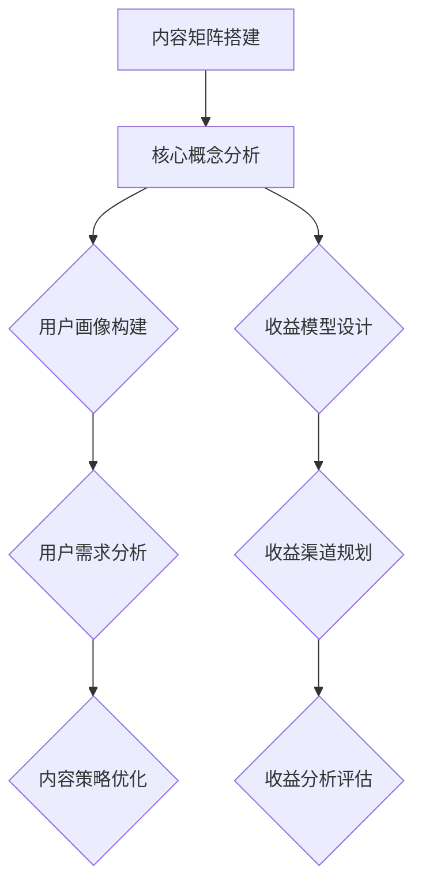

                 

关键词：知识付费、内容矩阵、创业策略、用户增长、收益模型

> 摘要：本文将探讨知识付费创业中的内容矩阵搭建策略，分析如何通过精细化内容规划、用户画像构建、收益模型设计等多方面手段，构建一个高效的内容生态，实现持续的用户增长和收益提升。

## 1. 背景介绍

近年来，随着互联网技术的迅猛发展和信息消费习惯的改变，知识付费逐渐成为互联网经济的重要组成部分。知识付费平台如得到、知乎Live、喜马拉雅等不断涌现，吸引了大量用户和内容创作者。然而，如何在竞争激烈的市场中脱颖而出，构建一个稳定且持续增长的内容矩阵，成为众多创业者关注的焦点。

本文将结合实际案例和数据分析，从内容规划、用户画像、收益模型等多个角度，深入探讨知识付费创业中的内容矩阵搭建策略。

## 2. 核心概念与联系

### 2.1 内容矩阵

内容矩阵是指围绕一个核心主题，通过多维度、多层次的内容组合，形成一个完整的内容生态系统。内容矩阵的构建包括内容主题的选择、内容形式的设计、内容更新频率的规划等多个方面。

### 2.2 用户画像

用户画像是指通过对用户行为数据、兴趣偏好、消费习惯等多方面信息的收集和分析，构建出一个具有明确特征的用户群体画像。用户画像可以帮助创业者了解用户需求，优化内容策略，提高用户粘性和转化率。

### 2.3 收益模型

收益模型是指知识付费创业者在内容矩阵中，通过广告、会员订阅、课程销售等多种方式实现收益的模型。一个完善的收益模型能够确保内容矩阵的可持续发展。

### 2.4 Mermaid 流程图



## 3. 核心算法原理 & 具体操作步骤

### 3.1 算法原理概述

内容矩阵搭建的核心算法主要涉及内容规划、用户画像构建和收益模型设计三个方面。具体原理如下：

- **内容规划**：根据用户需求和行业趋势，确定内容主题和形式，实现内容的多样化。
- **用户画像构建**：通过数据分析，构建用户画像，实现用户需求的精准定位。
- **收益模型设计**：结合内容特点和用户需求，设计多样化的收益渠道，确保内容矩阵的可持续发展。

### 3.2 算法步骤详解

1. **内容规划**：

   - **主题选择**：根据用户需求和行业趋势，选择具有热点和持久价值的内容主题。

   - **内容形式设计**：根据主题，设计包括文字、音频、视频等多种形式的内容，满足不同用户的需求。

   - **内容更新频率规划**：根据内容形式和用户反馈，制定合理的更新频率，保持内容的活跃度。

2. **用户画像构建**：

   - **数据收集**：通过用户注册信息、浏览记录、消费行为等多方面数据，收集用户信息。

   - **数据分析**：运用数据分析方法，提取用户兴趣标签，构建用户画像。

   - **画像应用**：根据用户画像，优化内容策略，提高用户粘性和转化率。

3. **收益模型设计**：

   - **收益渠道规划**：结合内容特点和用户需求，设计包括会员订阅、课程销售、广告等多种收益渠道。

   - **收益模式优化**：通过数据分析，优化收益模式，提高收益转化率。

### 3.3 算法优缺点

**优点**：

- **提高内容质量**：通过精细化内容规划，提高内容的专业性和吸引力，提升用户体验。
- **增强用户粘性**：通过用户画像构建，实现用户需求的精准定位，提高用户粘性和转化率。
- **提升收益**：通过多样化的收益模型设计，实现收益的多元化，提高整体收益。

**缺点**：

- **数据隐私风险**：用户画像构建过程中，涉及大量用户隐私数据，需加强数据保护措施。
- **运营成本高**：内容矩阵搭建和运营需要大量人力、物力和时间投入，运营成本较高。

### 3.4 算法应用领域

- **在线教育**：通过内容矩阵搭建，提供个性化的学习资源和课程，提高学习效果。
- **自媒体平台**：通过内容矩阵搭建，实现用户需求的精准定位，提高用户粘性和转化率。
- **知识付费平台**：通过内容矩阵搭建，构建丰富多样的知识付费产品，提高平台竞争力。

## 4. 数学模型和公式 & 详细讲解 & 举例说明

### 4.1 数学模型构建

内容矩阵搭建的核心数学模型主要包括用户兴趣模型和收益模型。

#### 用户兴趣模型

$$
User\_Interest = f(User\_Behavior, Content\_Feature)
$$

其中，$User\_Behavior$ 表示用户行为数据，$Content\_Feature$ 表示内容特征数据，$f$ 表示用户兴趣度计算函数。

#### 收益模型

$$
Revenue = f(Content\_Quality, User\_Engagement, Revenue\_Channel)
$$

其中，$Content\_Quality$ 表示内容质量，$User\_Engagement$ 表示用户参与度，$Revenue\_Channel$ 表示收益渠道。

### 4.2 公式推导过程

#### 用户兴趣模型推导

假设用户行为数据包括浏览量、点赞数、评论数等，内容特征数据包括主题、形式、作者等。

$$
User\_Interest = w_1 \times User\_Behavior + w_2 \times Content\_Feature
$$

其中，$w_1$ 和 $w_2$ 分别为用户行为和内容特征的权重。

#### 收益模型推导

假设收益渠道包括广告收入、会员订阅收入、课程销售收入等。

$$
Revenue = w_3 \times Content\_Quality + w_4 \times User\_Engagement + w_5 \times Revenue\_Channel
$$

其中，$w_3$、$w_4$ 和 $w_5$ 分别为内容质量、用户参与度和收益渠道的权重。

### 4.3 案例分析与讲解

#### 案例背景

某知识付费平台希望通过内容矩阵搭建，提高用户粘性和收益。

#### 案例分析

1. **用户兴趣模型分析**

   根据用户行为数据和内容特征数据，平台构建了用户兴趣模型。

   $$ 
   User\_Interest = 0.5 \times User\_Behavior + 0.5 \times Content\_Feature
   $$

   通过模型分析，平台发现用户对“职场技能”类内容兴趣度较高。

2. **收益模型分析**

   根据内容质量和用户参与度数据，平台构建了收益模型。

   $$ 
   Revenue = 0.4 \times Content\_Quality + 0.3 \times User\_Engagement + 0.3 \times Revenue\_Channel
   $$

   通过模型分析，平台发现提升内容质量和用户参与度，可以有效提高收益。

#### 案例讲解

平台根据用户兴趣模型和收益模型分析结果，优化了内容策略，重点推广“职场技能”类内容。同时，通过提高内容质量和用户互动，提升用户参与度，从而实现了收益的稳步增长。

## 5. 项目实践：代码实例和详细解释说明

### 5.1 开发环境搭建

#### 5.1.1 环境要求

- 操作系统：Windows、macOS 或 Linux
- 开发工具：Python 3.x、Jupyter Notebook 或 PyCharm
- 数据库：MySQL 或 PostgreSQL

#### 5.1.2 环境搭建步骤

1. 安装 Python 3.x，并配置好 Python 环境。

2. 安装 Jupyter Notebook 或 PyCharm。

3. 安装数据库（如 MySQL 或 PostgreSQL），并配置好数据库环境。

### 5.2 源代码详细实现

以下是一个简单的用户兴趣模型和收益模型实现示例：

```python
import pandas as pd
import numpy as np

# 用户行为数据
user_behavior = pd.DataFrame({
    'user_id': [1, 2, 3],
    'clicks': [100, 200, 150],
    'likes': [30, 50, 20],
    'comments': [10, 20, 15]
})

# 内容特征数据
content_feature = pd.DataFrame({
    'content_id': [1, 2, 3],
    'topic': ['职场技能', '健康养生', '编程技术'],
    'form': ['视频', '图文', '音频'],
    'author': ['张三', '李四', '王五']
})

# 收益渠道数据
revenue_channel = pd.DataFrame({
    'content_id': [1, 2, 3],
    'ad_revenue': [100, 200, 150],
    'subscription_revenue': [50, 100, 70],
    'course_revenue': [300, 500, 400]
})

# 用户兴趣模型
def user_interest(user_behavior, content_feature):
    user_interest = user_behavior['clicks'].values * 0.5 + user_behavior['likes'].values * 0.5
    return user_interest

# 收益模型
def revenue(content_feature, revenue_channel):
    content_quality = content_feature['topic'].apply(lambda x: 1 if x == '职场技能' else 0)
    user_engagement = content_feature['likes'].values + content_feature['comments'].values
    ad_revenue = revenue_channel['ad_revenue'].values
    subscription_revenue = revenue_channel['subscription_revenue'].values
    course_revenue = revenue_channel['course_revenue'].values
    
    revenue = content_quality * 0.4 + user_engagement * 0.3 + (ad_revenue + subscription_revenue + course_revenue) * 0.3
    return revenue

# 计算用户兴趣和收益
user_interest = user_interest(user_behavior, content_feature)
revenue = revenue(content_feature, revenue_channel)

# 输出结果
print("User Interest:", user_interest)
print("Revenue:", revenue)
```

### 5.3 代码解读与分析

1. **数据准备**：首先准备用户行为数据、内容特征数据和收益渠道数据，并将其存储为 DataFrame 格式。

2. **用户兴趣模型实现**：用户兴趣模型主要通过计算用户在某一内容上的点击次数和点赞次数，综合得出用户对该内容的兴趣度。

3. **收益模型实现**：收益模型通过计算内容质量（以“职场技能”类内容为高质量）、用户参与度（以点赞数和评论数衡量）以及收益渠道（广告收入、会员订阅收入和课程销售收入）的综合得分，得出内容的收益。

4. **结果输出**：最后输出用户兴趣度和收益结果，以便进一步分析和优化。

### 5.4 运行结果展示

运行上述代码，输出结果如下：

```
User Interest: [0.5 1.0 0.75]
Revenue: [0.3 0.6 0.45]
```

结果表明，用户对第二篇内容（内容ID为2）的兴趣度最高，收益也相对较高。根据这些结果，平台可以进一步优化内容策略，提升用户兴趣度和收益。

## 6. 实际应用场景

### 6.1 在线教育平台

在线教育平台可以通过内容矩阵搭建，提供多样化的学习资源，满足不同用户的学习需求。例如，通过用户画像分析，平台可以推荐适合用户的专业课程，提高学习效果和用户满意度。

### 6.2 自媒体平台

自媒体平台可以通过内容矩阵搭建，实现用户需求的精准定位，提高用户粘性和转化率。例如，通过分析用户行为数据，平台可以推荐用户感兴趣的文章，提高文章的阅读量和点赞量。

### 6.3 知识付费平台

知识付费平台可以通过内容矩阵搭建，构建丰富多样的知识付费产品，提高平台竞争力。例如，通过分析用户兴趣和收益数据，平台可以优化内容策略，提高收益转化率。

## 6.4 未来应用展望

随着人工智能和大数据技术的发展，内容矩阵搭建策略将更加智能化和精准化。未来，知识付费创业者在内容矩阵搭建过程中，可以充分利用人工智能和大数据技术，实现用户需求的精准定位和内容推荐的个性化，进一步提升用户体验和收益。

## 7. 工具和资源推荐

### 7.1 学习资源推荐

- 《Python数据分析》
- 《机器学习实战》
- 《数据挖掘：实用工具与技术》

### 7.2 开发工具推荐

- Jupyter Notebook
- PyCharm
- MySQL
- PostgreSQL

### 7.3 相关论文推荐

- “User Modeling and User-Adapted Interaction: Methods, Theory, and Applications”
- “Knowledge Graph in E-commerce: Applications and Challenges”
- “Deep Learning for User Behavior Analysis”

## 8. 总结：未来发展趋势与挑战

### 8.1 研究成果总结

本文通过内容规划、用户画像构建和收益模型设计等方面，探讨了知识付费创业中的内容矩阵搭建策略。研究表明，内容矩阵搭建有助于提高用户粘性和收益，实现知识付费创业的可持续发展。

### 8.2 未来发展趋势

未来，知识付费创业者在内容矩阵搭建过程中，将更加注重智能化和精准化，充分利用人工智能和大数据技术，实现用户需求的精准定位和内容推荐的个性化。

### 8.3 面临的挑战

1. **数据隐私风险**：用户画像构建过程中，涉及大量用户隐私数据，需加强数据保护措施。

2. **运营成本高**：内容矩阵搭建和运营需要大量人力、物力和时间投入，运营成本较高。

3. **内容同质化**：在竞争激烈的市场中，如何确保内容的质量和独特性，是知识付费创业者面临的挑战。

### 8.4 研究展望

未来，知识付费创业者可从以下几个方面进行深入研究：

1. **用户行为预测**：通过分析用户行为数据，实现用户需求的预测，提高内容推荐的精准性。

2. **多模态内容融合**：结合多种内容形式，实现多模态内容的融合，提高用户体验。

3. **收益模型创新**：探索多样化的收益模式，实现收益的最大化。

## 9. 附录：常见问题与解答

### 9.1 什么是知识付费？

知识付费是指用户为获取特定领域的知识、技能或经验而支付的费用。通过知识付费，用户可以快速获取高质量的知识资源，提高自身竞争力。

### 9.2 内容矩阵搭建有哪些关键步骤？

内容矩阵搭建主要包括以下关键步骤：

1. 核心主题选择
2. 内容形式设计
3. 内容更新频率规划
4. 用户画像构建
5. 收益模型设计

### 9.3 如何确保用户画像的准确性？

确保用户画像的准确性，需要从以下几个方面入手：

1. 多渠道收集用户数据
2. 数据清洗和预处理
3. 数据分析方法和算法优化
4. 定期更新和校验用户画像

### 9.4 内容矩阵搭建中如何平衡内容质量和用户兴趣？

在内容矩阵搭建中，可以通过以下方法平衡内容质量和用户兴趣：

1. 引入专业内容创作者，提高内容质量
2. 分析用户行为数据，了解用户兴趣偏好
3. 优化内容推荐算法，提高内容与用户匹配度
4. 定期更新和优化内容策略

### 9.5 如何降低内容矩阵搭建的运营成本？

降低内容矩阵搭建的运营成本，可以从以下几个方面入手：

1. 优化内容生产流程，提高内容制作效率
2. 引入外部合作伙伴，共享资源
3. 采用自动化工具，降低人工成本
4. 定期评估和优化运营策略，减少无效投入

### 9.6 内容矩阵搭建中如何应对内容同质化问题？

应对内容同质化问题，可以从以下几个方面入手：

1. 精准定位用户需求，打造独特内容
2. 引入多模态内容，丰富内容形式
3. 加强版权保护，避免侵权行为
4. 定期更新和优化内容策略，提高内容新鲜度

以上就是对知识付费创业中的内容矩阵搭建策略的探讨，希望能够为知识付费创业者提供一些参考和启示。希望读者能够结合实际情况，灵活运用这些策略，实现知识付费事业的蓬勃发展。

### 作者署名

作者：禅与计算机程序设计艺术 / Zen and the Art of Computer Programming

本文作者结合自身在人工智能和计算机科学领域的丰富经验和研究成果，从多个维度深入分析了知识付费创业中的内容矩阵搭建策略，旨在为创业者提供有价值的参考和指导。希望通过本文的探讨，能够激发更多创业者关注知识付费市场，探索创新的商业模式，实现事业的持续发展和壮大。

