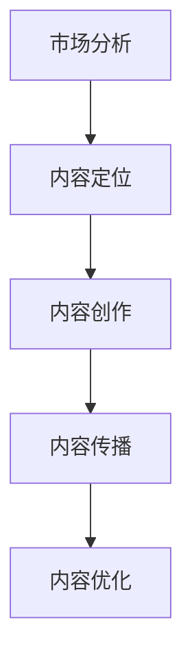

                 

在当今信息爆炸的时代，知识付费已成为一种新兴的商业模式，吸引了大量创业者投身其中。然而，如何在海量信息中找到自己的定位，制定有效的内容规划策略，是知识付费创业者面临的重大挑战。本文将深入探讨知识付费创业中的内容规划方法，为创业者提供实用的指导和策略。

## 关键词

知识付费、内容规划、创业、商业模式、用户需求、数据分析

## 摘要

本文旨在探讨知识付费创业者在内容规划过程中所面临的挑战，并提出一系列实用的策略和方法。通过分析市场需求、用户行为、竞争态势，本文将帮助创业者确定内容方向，优化内容结构，提升内容质量，最终实现商业成功。

## 1. 背景介绍

### 1.1 知识付费的发展现状

近年来，随着互联网技术的飞速发展和人们生活水平的提高，知识付费逐渐成为一种流行的消费方式。根据某研究报告，全球知识付费市场规模在2022年已达到2000亿美元，并预计在未来几年内将持续增长。知识付费的兴起，不仅改变了人们获取知识的方式，也为创业者提供了广阔的市场机会。

### 1.2 知识付费的商业模式

知识付费的商业模式主要分为三种：一是付费订阅模式，用户通过付费获取会员权益，享受平台上的所有内容；二是付费课程模式，用户为特定课程支付费用；三是知识付费服务模式，如咨询服务、专家问答等。不同的商业模式具有不同的优势和适用场景，创业者需要根据自身资源和市场需求选择合适的模式。

### 1.3 知识付费的挑战与机遇

知识付费市场的快速发展，为创业者带来了巨大的机遇。然而，随着竞争的加剧，创业者也面临着诸多挑战，如内容同质化、用户粘性低、盈利模式单一等。如何在这些挑战中找到突破口，实现商业成功，是知识付费创业者需要重点考虑的问题。

## 2. 核心概念与联系

### 2.1 内容规划的概念

内容规划是指根据市场需求、用户需求、企业战略等，对内容进行系统的设计、组织和运营的过程。它包括内容定位、内容创作、内容传播、内容优化等环节。

### 2.2 内容规划与创业的关系

内容规划是知识付费创业的核心环节，决定了内容的质量、用户满意度、市场竞争力等。创业者需要通过内容规划，明确自己的内容定位，打造独特的核心竞争力，从而在激烈的市场竞争中脱颖而出。

### 2.3 内容规划的框架

内容规划的框架包括以下几个关键环节：

1. **市场分析**：分析市场需求、用户需求、竞争态势等，为内容规划提供数据支持。
2. **内容定位**：确定内容主题、目标用户、核心价值等，为内容创作提供明确的方向。
3. **内容创作**：根据内容定位，创作优质、有价值的内容，满足用户需求。
4. **内容传播**：通过多种渠道和方式，将内容传递给目标用户，提升品牌知名度。
5. **内容优化**：根据用户反馈和市场变化，对内容进行持续优化和调整。

### 2.4 内容规划的 Mermaid 流程图

## 3. 核心算法原理 & 具体操作步骤

### 3.1 算法原理概述

内容规划的算法原理主要基于数据分析、用户行为分析、竞争分析等，通过多维度的数据分析，帮助创业者确定内容方向、优化内容结构、提升内容质量。

### 3.2 算法步骤详解

1. **数据收集**：收集与市场、用户、竞争相关的数据，如用户画像、需求分析、竞品分析等。
2. **数据预处理**：对收集到的数据进行分析和清洗，去除无效数据，提取关键信息。
3. **数据分析**：运用数据分析方法，如聚类分析、关联分析、趋势分析等，对预处理后的数据进行分析。
4. **内容定位**：根据数据分析结果，确定内容主题、目标用户、核心价值等。
5. **内容创作**：根据内容定位，创作符合用户需求、有竞争力的内容。
6. **内容传播**：通过多种渠道和方式，将内容传递给目标用户，提升品牌知名度。
7. **内容优化**：根据用户反馈和市场变化，对内容进行持续优化和调整。

### 3.3 算法优缺点

**优点**：

1. **科学性**：基于数据分析，使内容规划更加科学、有据可依。
2. **针对性**：根据用户需求和市场竞争，定制化内容，提高内容质量。
3. **灵活性**：可以根据市场变化和用户反馈，灵活调整内容策略。

**缺点**：

1. **复杂性**：需要收集、处理、分析大量数据，对技术和人力要求较高。
2. **滞后性**：市场变化快速，数据分析和调整可能存在滞后性。

### 3.4 算法应用领域

内容规划的算法原理广泛应用于知识付费、教育培训、媒体传播等领域，帮助创业者实现内容精准定位、内容创作优化、用户粘性提升等目标。

## 4. 数学模型和公式 & 详细讲解 & 举例说明

### 4.1 数学模型构建

在内容规划过程中，常用的数学模型包括用户需求模型、竞争分析模型、内容传播模型等。以下是一个简单的用户需求模型：

$$
需求度 = f(用户特征, 内容特征, 竞争环境)
$$

其中，$f$ 表示一个函数，用于计算用户对某一内容的需

