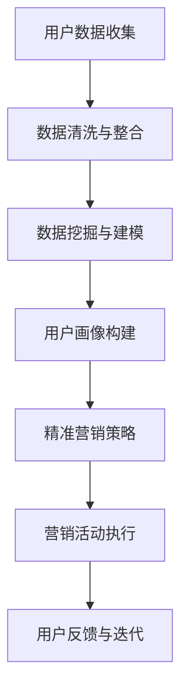
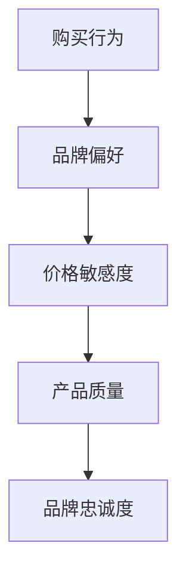
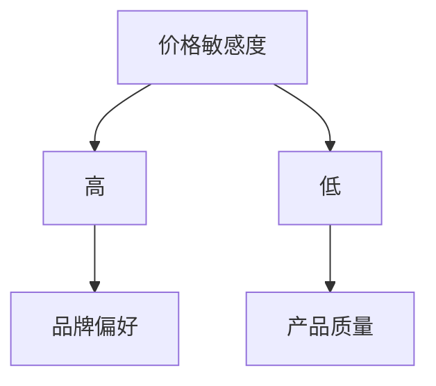

                 

关键词：知识付费、用户画像、精准营销、数据挖掘、机器学习、客户关系管理

> 摘要：随着知识付费市场的不断扩张，如何准确识别和把握用户需求，进行有效的用户画像构建和精准营销，成为知识付费创业成功的关键。本文将深入探讨用户画像与精准营销的原理和实践，结合案例，为知识付费创业者提供有价值的指导。

## 1. 背景介绍

近年来，知识付费已成为互联网经济中的一大亮点。从在线教育、技能培训到专业咨询，知识付费模式正在改变传统信息获取方式，形成新的商业生态。然而，面对竞争激烈的市场和不断变化的需求，知识付费创业者如何准确定位用户、挖掘潜在客户、提升用户满意度，是亟待解决的重要课题。

用户画像与精准营销作为现代数据驱动的商业策略，通过分析用户行为和需求，实现个性化服务和高效营销，已成为知识付费领域的关键利器。本文旨在深入探讨用户画像与精准营销在知识付费创业中的应用，为创业者提供有针对性的策略和建议。

## 2. 核心概念与联系

### 2.1. 用户画像

用户画像（User Profiling）是指通过对用户行为、需求、兴趣、背景等多维度数据的分析，构建出一个具有代表性的虚拟用户模型。用户画像有助于企业深入理解用户，实现精准营销和个性化服务。

### 2.2. 精准营销

精准营销（Precision Marketing）是一种基于数据分析和用户画像，针对特定用户群体进行定制化营销活动的策略。精准营销的核心在于提高营销效率，降低营销成本，提升客户转化率和满意度。

### 2.3. 关联性

用户画像是精准营销的基础，通过对用户画像的深入分析，企业可以识别出具有高潜在价值的用户群体，并制定相应的营销策略。精准营销则利用用户画像实现营销资源的优化配置，提高营销活动的针对性和有效性。

### 2.4. Mermaid 流程图



## 3. 核心算法原理 & 具体操作步骤

### 3.1. 算法原理概述

用户画像与精准营销的核心算法主要包括数据挖掘、机器学习、客户关系管理等领域的技术。其中，数据挖掘用于从海量数据中提取有价值的信息；机器学习通过建立模型，实现用户行为预测和需求分析；客户关系管理则关注用户关系维护和营销策略制定。

### 3.2. 算法步骤详解

#### 3.2.1. 数据收集

收集用户的基本信息（如年龄、性别、职业等）和行为数据（如浏览记录、购买记录、评论等）。数据来源包括用户注册信息、行为日志、第三方数据接口等。

#### 3.2.2. 数据清洗与整合

对收集到的数据进行清洗，去除重复、错误和不完整的数据。然后，将不同来源的数据进行整合，构建一个统一的用户数据集。

#### 3.2.3. 数据挖掘与建模

使用数据挖掘技术（如关联规则挖掘、聚类分析等）对用户数据进行挖掘，提取用户行为模式和兴趣偏好。然后，利用机器学习算法（如决策树、神经网络等）建立用户画像模型。

#### 3.2.4. 用户画像构建

根据用户画像模型，将用户划分为不同的群体，为每个用户生成一个个性化的画像。

#### 3.2.5. 精准营销策略

根据用户画像，制定有针对性的营销策略，如个性化推荐、定向广告投放、优惠活动等。

#### 3.2.6. 营销活动执行

执行营销策略，并通过数据监控和分析，评估营销效果，为后续优化提供依据。

#### 3.2.7. 用户反馈与迭代

收集用户反馈，对用户画像和营销策略进行调整和优化，实现持续改进。

### 3.3. 算法优缺点

#### 优点

- 提高营销效率，降低成本
- 增强用户满意度，提升转化率
- 个性化服务，提高用户体验

#### 缺点

- 数据收集和处理复杂度高
- 需要专业的技术团队支持
- 可能引发用户隐私保护问题

### 3.4. 算法应用领域

用户画像与精准营销在知识付费领域的应用主要包括：

- 在线教育：个性化课程推荐、学习进度跟踪、学习效果评估
- 技能培训：定制化课程设置、职业发展路径规划、就业推荐
- 专业咨询：用户需求分析、服务定制、客户关系管理

## 4. 数学模型和公式 & 详细讲解 & 举例说明

### 4.1. 数学模型构建

用户画像构建的核心在于用户行为和兴趣的量化表示。以下是构建用户画像的常用数学模型：

#### 4.1.1. 贝叶斯网络

贝叶斯网络是一种表示变量之间条件概率关系的图形模型。在用户画像中，可以使用贝叶斯网络来表示用户行为和兴趣之间的关系。

```latex
P(A|B) = \frac{P(B|A) \cdot P(A)}{P(B)}
```

其中，$A$ 表示用户行为，$B$ 表示用户兴趣。

#### 4.1.2. 决策树

决策树是一种基于特征划分的数据挖掘方法。在用户画像中，可以使用决策树来分析用户行为和兴趣的决策路径。

```latex
决策树 = \{根节点，内部节点，叶节点\}
```

### 4.2. 公式推导过程

#### 4.2.1. 贝叶斯网络推导

以用户购买行为和品牌偏好为例，构建贝叶斯网络模型：



根据贝叶斯定理，可以推导出各节点之间的条件概率：

```latex
P(A|B) = \frac{P(B|A) \cdot P(A)}{P(B)}
P(B|C) = \frac{P(C|B) \cdot P(B)}{P(C)}
P(C|D) = \frac{P(D|C) \cdot P(C)}{P(D)}
P(D|E) = \frac{P(E|D) \cdot P(D)}{P(E)}
```

#### 4.2.2. 决策树推导

以用户购买决策为例，构建决策树模型：



根据信息增益（Information Gain）原则，可以推导出各节点之间的划分依据：

```latex
IG(A, B) = H(A) - H(A|B)
H(A) = -\sum_{i} P(A_i) \cdot \log_2 P(A_i)
H(A|B) = -\sum_{i} P(A_i|B_i) \cdot \log_2 P(A_i|B_i)
```

### 4.3. 案例分析与讲解

#### 4.3.1. 案例背景

一家在线教育公司，希望通过用户画像和精准营销提高用户转化率和满意度。现有用户数据包括用户基本信息（年龄、性别、职业等）和行为数据（浏览记录、购买记录、评价等）。

#### 4.3.2. 案例分析

1. **数据收集与清洗**：收集用户数据，包括注册信息和行为日志，并进行清洗和整合。

2. **数据挖掘与建模**：使用关联规则挖掘技术，分析用户行为模式；使用聚类分析技术，将用户划分为不同群体。

3. **用户画像构建**：根据用户行为和兴趣，构建个性化用户画像。

4. **精准营销策略**：根据用户画像，制定个性化推荐、定向广告投放等营销策略。

5. **营销活动执行**：执行营销策略，并通过数据监控和分析，评估营销效果。

6. **用户反馈与迭代**：收集用户反馈，对用户画像和营销策略进行调整和优化。

#### 4.3.3. 案例讲解

1. **贝叶斯网络应用**：分析用户购买行为和品牌偏好之间的关系，为个性化推荐提供依据。

2. **决策树应用**：分析用户购买决策路径，为营销策略制定提供指导。

3. **数学模型应用**：使用信息增益原则，优化决策树划分依据，提高用户画像准确性。

4. **数据监控与分析**：通过数据监控，评估营销效果，为后续优化提供依据。

## 5. 项目实践：代码实例和详细解释说明

### 5.1. 开发环境搭建

- Python 3.8及以上版本
- pandas、numpy、scikit-learn等常用库
- Jupyter Notebook或PyCharm等IDE

### 5.2. 源代码详细实现

以下是一个简单的用户画像和精准营销项目示例代码：

```python
import pandas as pd
from sklearn.cluster import KMeans
from sklearn.metrics import accuracy_score

# 数据收集与清洗
data = pd.read_csv('user_data.csv')
data = data.dropna()

# 数据预处理
data['age'] = data['age'].astype(int)
data['gender'] = data['gender'].map({'男': 1, '女': 0})

# 数据归一化
from sklearn.preprocessing import StandardScaler
scaler = StandardScaler()
data_scaled = scaler.fit_transform(data[['age', 'gender']])

# 聚类分析
kmeans = KMeans(n_clusters=3, random_state=0)
clusters = kmeans.fit_predict(data_scaled)

# 用户画像构建
user Profiles = pd.DataFrame(clusters, columns=['cluster'])
data_with_profiles = pd.concat([data, user_Profiles], axis=1)

# 精准营销策略
def recommend_courses(cluster):
    if cluster == 0:
        return ['Python入门课程', '数据结构课程']
    elif cluster == 1:
        return ['高级Python课程', '算法课程']
    else:
        return ['人工智能课程', '机器学习课程']

# 营销活动执行
for index, row in data_with_profiles.iterrows():
    course_list = recommend_courses(row['cluster'])
    print(f"用户ID：{row['id']}，推荐课程：{', '.join(course_list)}")

# 用户反馈与迭代
# 假设收集到用户反馈后，调整聚类模型参数，重新构建用户画像
```

### 5.3. 代码解读与分析

- **数据收集与清洗**：读取用户数据，去除缺失值，对年龄和性别进行编码处理。
- **数据预处理**：对年龄和性别进行归一化处理，为聚类分析做准备。
- **聚类分析**：使用KMeans算法对用户数据进行聚类，划分用户群体。
- **用户画像构建**：根据聚类结果，为每个用户生成一个集群标识，构建用户画像。
- **精准营销策略**：根据用户画像，为不同集群推荐不同的课程。
- **营销活动执行**：根据推荐课程，为用户发送个性化推荐。
- **用户反馈与迭代**：收集用户反馈，对聚类模型进行调整，优化用户画像和推荐效果。

## 6. 实际应用场景

### 6.1. 在线教育

在线教育平台通过用户画像和精准营销，可以提供个性化课程推荐、学习进度跟踪、学习效果评估等服务，提高用户满意度和转化率。

### 6.2. 技能培训

技能培训平台可以利用用户画像，为学员定制化课程设置、职业发展路径规划、就业推荐等服务，提升培训质量和用户粘性。

### 6.3. 专业咨询

专业咨询机构通过用户画像和精准营销，可以提供用户需求分析、服务定制、客户关系管理等服务，增强客户满意度和忠诚度。

## 6.4. 未来应用展望

随着人工智能和大数据技术的发展，用户画像与精准营销在知识付费领域的应用将更加广泛和深入。未来，将有望实现以下发展方向：

- **个性化服务更加精细**：通过更丰富的数据源和更先进的算法，构建更精准的用户画像，实现更精细的个性化服务。
- **跨平台数据整合**：实现不同平台间的数据整合，为用户提供无缝的个性化体验。
- **智能决策支持**：利用用户画像和精准营销，为创业者和企业管理者提供智能决策支持。

## 7. 工具和资源推荐

### 7.1. 学习资源推荐

- 《数据挖掘：实用工具与技术》
- 《机器学习实战》
- 《Python数据分析》

### 7.2. 开发工具推荐

- Jupyter Notebook
- PyCharm
- VSCode

### 7.3. 相关论文推荐

- "User Profiling in Knowledge Services: A Survey"
- "Precision Marketing: Theory and Applications"
- "Deep Learning for User Behavior Analysis"

## 8. 总结：未来发展趋势与挑战

### 8.1. 研究成果总结

用户画像与精准营销在知识付费领域的应用取得了显著成果，提高了营销效率，降低了成本，提升了用户体验。

### 8.2. 未来发展趋势

随着人工智能和大数据技术的发展，用户画像与精准营销将实现更精细的个性化服务，跨平台数据整合，智能决策支持等发展方向。

### 8.3. 面临的挑战

数据隐私保护、算法透明性和公平性等问题将是用户画像与精准营销领域未来面临的重大挑战。

### 8.4. 研究展望

未来，用户画像与精准营销将在知识付费领域发挥更加重要的作用，为创业者提供有力的支持。

## 9. 附录：常见问题与解答

### 9.1. 问题1：如何保证用户数据的安全和隐私？

**解答**：确保用户数据的安全和隐私是用户画像与精准营销的重要前提。企业应采取以下措施：

- 数据加密：对用户数据进行加密处理，防止数据泄露。
- 数据脱敏：对敏感数据进行脱敏处理，保护用户隐私。
- 合规性：遵循相关法律法规，确保数据处理合规。

### 9.2. 问题2：用户画像与精准营销在不同领域的应用有何区别？

**解答**：用户画像与精准营销在不同领域的应用有以下区别：

- 应用领域不同：用户画像与精准营销在在线教育、技能培训、专业咨询等领域的应用有所不同。
- 数据来源不同：不同领域的数据来源和类型不同，需要根据领域特点调整数据收集和处理方法。
- 需求不同：不同领域对用户画像和精准营销的需求有所不同，需要针对具体需求制定相应的策略。

### 9.3. 问题3：如何评估用户画像与精准营销的效果？

**解答**：评估用户画像与精准营销的效果可以从以下几个方面进行：

- 营销效果：评估营销活动的点击率、转化率、ROI等指标。
- 用户满意度：通过用户反馈、评价等方式了解用户对个性化服务和营销活动的满意度。
- 数据分析：利用数据分析工具，分析用户行为和反馈数据，评估用户画像和精准营销的效果。

---

### 作者署名

作者：禅与计算机程序设计艺术 / Zen and the Art of Computer Programming
----------------------------------------------------------------

以上为文章的主要内容，请您进行审阅，并按照您的要求进行修改和完善。如果您有任何意见或建议，请随时告诉我。感谢您的关注和支持！<|vq_11996|>

