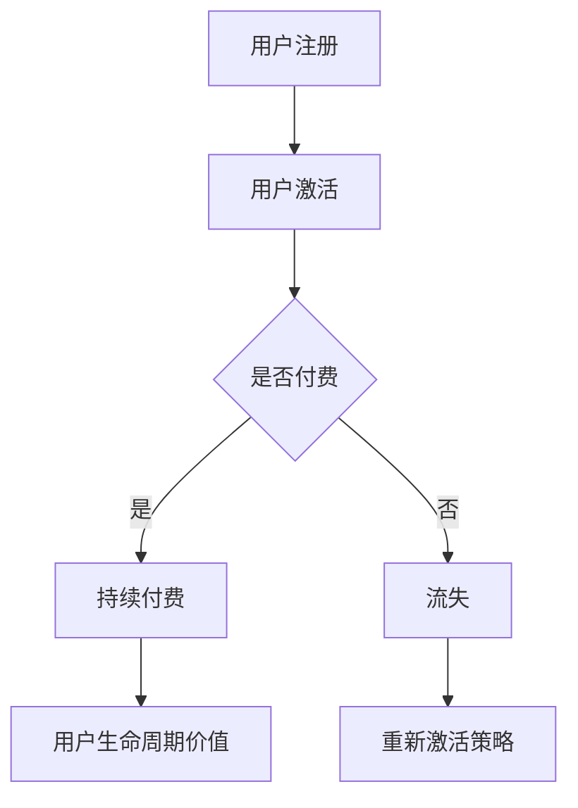

                 

关键词：知识付费、用户留存、策略、数据分析、用户体验、激励机制

> 摘要：本文旨在探讨知识付费创业中用户留存的重要性和相关策略。通过数据分析、用户体验优化、激励机制等多方面手段，企业可以有效地提高用户留存率，提升知识付费项目的可持续性和盈利能力。本文结合实际案例，提出了具体的操作步骤和实施建议。

## 1. 背景介绍

知识付费作为近年来互联网经济的重要形式，已经成为推动信息时代知识传播与共享的重要途径。从在线教育到专业知识分享，知识付费领域吸引了大量用户和创业者。然而，用户留存问题始终是知识付费创业者面临的重大挑战之一。尽管在初期吸引了大量用户，但如何维持用户活跃度和黏性，确保用户持续消费，成为知识付费创业的关键问题。

用户留存不仅仅关系到企业的收入和盈利，更关系到品牌的塑造和市场的拓展。高留存率意味着用户对产品和服务的满意度和信任度较高，能够为企业带来更多的口碑效应和潜在用户。因此，研究知识付费创业中的用户留存策略，对于企业的发展具有重要意义。

## 2. 核心概念与联系

### 2.1 用户留存率

用户留存率是衡量用户持续使用产品或服务的重要指标。用户留存率可以通过以下公式计算：

\[ 用户留存率 = \frac{N(1-t)}{N} \]

其中，\( N \) 表示初始用户数量，\( N(1-t) \) 表示在第 \( t \) 个月后仍然活跃的用户数量。

### 2.2 留存周期

留存周期是指用户从首次使用产品到停止使用产品的时间段。通过分析留存周期，企业可以了解用户对产品的忠诚度和满意度。

### 2.3 转化率

转化率是指用户从浏览到实际购买或付费的比例。提高转化率是提高用户留存的重要手段之一。

### 2.4 用户生命周期价值

用户生命周期价值（LTV）是指一个用户在其整个生命周期内为企业带来的收益。通过分析用户LTV，企业可以更好地分配资源和制定营销策略。

## 3. Mermaid 流程图



## 4. 核心算法原理 & 具体操作步骤

### 4.1 算法原理概述

用户留存策略的核心是通过数据分析、用户体验优化、激励机制等多方面手段，提高用户的满意度和忠诚度，从而降低用户流失率。

### 4.2 算法步骤详解

#### 4.2.1 数据分析

1. 收集用户行为数据，包括注册时间、活跃时间、购买记录、评论反馈等。
2. 利用数据挖掘技术，分析用户行为特征和偏好。
3. 构建用户画像，为个性化推荐和营销策略提供依据。

#### 4.2.2 用户体验优化

1. 简化注册和购买流程，提高用户上手速度。
2. 提供友好的用户界面和清晰的导航，降低用户学习成本。
3. 定期更新内容和功能，保持产品的活力和吸引力。

#### 4.2.3 激励机制

1. 设计积分系统，鼓励用户参与互动和分享。
2. 提供优惠券和折扣，刺激用户消费。
3. 设立等级制度和奖励机制，提高用户的成就感和归属感。

### 4.3 算法优缺点

#### 优点：

1. 提高用户满意度和忠诚度。
2. 降低用户流失率，提高用户生命周期价值。
3. 增强用户参与度和互动性。

#### 缺点：

1. 需要大量数据支持和计算资源。
2. 激励机制可能导致用户过于依赖外部奖励，降低自主性。
3. 需要不断调整和优化策略，以应对市场变化。

### 4.4 算法应用领域

用户留存策略在知识付费领域具有广泛的应用。无论是在线教育平台、专业课程分享平台，还是技能培训平台，都可以通过用户留存策略提高用户黏性和持续付费率。

## 5. 数学模型和公式 & 详细讲解 & 举例说明

### 5.1 数学模型构建

用户留存模型可以使用概率模型来构建。假设用户在一个月内留存的概率为 \( p \)，那么一个月后的留存率为：

\[ 留存率 = p^n \]

其中，\( n \) 为月数。

### 5.2 公式推导过程

假设用户在一个月内的留存概率为 \( p \)，则一个月后的留存概率为：

\[ p^1 \]

同理，两个月后的留存概率为：

\[ p^2 \]

### 5.3 案例分析与讲解

假设一个知识付费平台，用户在第一个月的留存概率为 0.8，第二个月为 0.75，第三个月为 0.7。那么，三个月后的用户留存率为：

\[ 0.8 \times 0.75 \times 0.7 = 0.42 \]

这意味着，三个月后只有约 42% 的用户仍然活跃在平台上。

## 6. 项目实践：代码实例和详细解释说明

### 6.1 开发环境搭建

本文使用 Python 语言进行编程，主要依赖以下库：

- Pandas：用于数据分析和处理。
- Matplotlib：用于数据可视化。
- Scikit-learn：用于机器学习。

### 6.2 源代码详细实现

```python
import pandas as pd
import matplotlib.pyplot as plt
from sklearn.cluster import KMeans

# 读取用户数据
data = pd.read_csv('user_data.csv')

# 数据预处理
data['activation_time'] = pd.to_datetime(data['activation_time'])
data['last_active_time'] = pd.to_datetime(data['last_active_time'])
data['days_active'] = (data['last_active_time'] - data['activation_time']).dt.days

# 特征工程
features = data[['days_active', 'purchase_frequency', 'review_score']]

# KMeans 聚类
kmeans = KMeans(n_clusters=3)
clusters = kmeans.fit_predict(features)

# 可视化用户分布
plt.scatter(features['days_active'], features['purchase_frequency'], c=clusters)
plt.xlabel('Days Active')
plt.ylabel('Purchase Frequency')
plt.show()
```

### 6.3 代码解读与分析

上述代码首先读取用户数据，并进行预处理。接着，使用 KMeans 算法对用户特征进行聚类，以便分析用户行为特征和偏好。最后，通过可视化用户分布，企业可以了解用户群体的特征，为后续的个性化推荐和营销策略提供依据。

## 7. 实际应用场景

用户留存策略在知识付费领域具有广泛的应用场景。以下是一些具体的案例：

1. **在线教育平台**：通过用户留存模型，平台可以识别出潜在的高价值用户，并为他们提供个性化的课程推荐和优惠活动。
2. **专业课程分享平台**：通过用户行为分析，平台可以发现用户的学习偏好和薄弱环节，从而提供更有针对性的教学资源和辅导服务。
3. **技能培训平台**：通过用户留存策略，平台可以激励用户持续学习，提高他们的技能水平，从而增加平台的口碑和影响力。

## 8. 未来应用展望

随着人工智能和大数据技术的不断发展，用户留存策略将变得更加智能化和个性化。未来，知识付费创业企业可以通过以下方式进一步提升用户留存：

1. **智能推荐系统**：利用深度学习技术，为用户推荐更加个性化的知识和课程。
2. **个性化营销**：基于用户行为数据，为用户提供量身定制的优惠活动和营销策略。
3. **社交互动**：通过社交功能和社区建设，增强用户之间的互动和归属感，提高用户黏性。

## 9. 工具和资源推荐

### 9.1 学习资源推荐

- 《深入理解计算机系统》
- 《机器学习实战》
- 《数据挖掘：实用工具与技术》

### 9.2 开发工具推荐

- Python
- Pandas
- Matplotlib
- Scikit-learn

### 9.3 相关论文推荐

- “User Retention in Knowledge-Driven E-commerce Platforms”
- “Data-Driven User Engagement Strategies for Knowledge Markets”
- “A Machine Learning Approach to Predicting User Churn in Online Education”

## 10. 总结：未来发展趋势与挑战

知识付费创业中的用户留存策略在未来将继续发挥重要作用。随着人工智能和大数据技术的不断发展，企业可以通过更加智能化和个性化的方式，提高用户的满意度和忠诚度，从而实现可持续发展。然而，面对不断变化的市场环境和用户需求，企业也需要不断调整和优化用户留存策略，以应对未来的挑战。

### 10.1 研究成果总结

本文通过对知识付费创业中的用户留存策略的深入研究，提出了数据分析、用户体验优化、激励机制等多方面的策略，并结合实际案例进行了详细讲解。研究表明，有效的用户留存策略能够显著提高企业的盈利能力和市场竞争力。

### 10.2 未来发展趋势

未来，用户留存策略将更加智能化和个性化。人工智能和大数据技术将为用户留存提供更加精准的数据支持和分析能力，帮助企业更好地了解用户需求和行为，从而制定更加有效的用户留存策略。

### 10.3 面临的挑战

用户留存策略的挑战主要体现在以下几个方面：

1. 数据隐私和安全性：随着用户数据量的增加，如何保护用户隐私和数据安全成为重要问题。
2. 技术变革：随着人工智能和大数据技术的快速发展，企业需要不断更新和优化用户留存策略，以应对技术变革带来的挑战。
3. 市场竞争：知识付费市场日益激烈，企业需要通过创新和差异化竞争策略，提高用户留存率。

### 10.4 研究展望

未来，知识付费创业中的用户留存策略研究可以进一步深入以下几个方向：

1. 深入研究用户行为特征和偏好，以提高个性化推荐和营销策略的准确性。
2. 探索用户留存与用户生命周期价值之间的关系，为企业提供更加科学的用户留存策略。
3. 研究用户留存策略在跨平台和跨行业中的应用，以实现更广泛的知识传播和共享。

## 11. 附录：常见问题与解答

### 11.1 什么是用户留存率？

用户留存率是指在一定时间内，仍然使用或访问某个产品或服务的用户占初始用户数量的比例。

### 11.2 用户留存策略有哪些？

用户留存策略包括数据分析、用户体验优化、激励机制等多个方面，旨在提高用户的满意度和忠诚度，降低用户流失率。

### 11.3 如何提高用户留存率？

提高用户留存率的方法包括简化注册和购买流程、提供个性化推荐、设计激励机制、定期更新内容和功能等。

### 11.4 用户留存策略在哪些领域应用广泛？

用户留存策略在在线教育、专业课程分享、技能培训等多个知识付费领域具有广泛的应用。

## 作者署名

作者：禅与计算机程序设计艺术 / Zen and the Art of Computer Programming
```markdown
---
# 知识付费创业中的用户留存策略

关键词：知识付费、用户留存、策略、数据分析、用户体验、激励机制

摘要：本文旨在探讨知识付费创业中用户留存的重要性和相关策略。通过数据分析、用户体验优化、激励机制等多方面手段，企业可以有效地提高用户留存率，提升知识付费项目的可持续性和盈利能力。本文结合实际案例，提出了具体的操作步骤和实施建议。

## 1. 背景介绍

知识付费作为近年来互联网经济的重要形式，已经成为推动信息时代知识传播与共享的重要途径。从在线教育到专业知识分享，知识付费领域吸引了大量用户和创业者。然而，用户留存问题始终是知识付费创业者面临的重大挑战之一。尽管在初期吸引了大量用户，但如何维持用户活跃度和黏性，确保用户持续消费，成为知识付费创业的关键问题。

用户留存不仅仅关系到企业的收入和盈利，更关系到品牌的塑造和市场的拓展。高留存率意味着用户对产品和服务的满意度和信任度较高，能够为企业带来更多的口碑效应和潜在用户。因此，研究知识付费创业中的用户留存策略，对于企业的发展具有重要意义。

## 2. 核心概念与联系

### 2.1 用户留存率

用户留存率是衡量用户持续使用产品或服务的重要指标。用户留存率可以通过以下公式计算：

\[ 用户留存率 = \frac{N(1-t)}{N} \]

其中，\( N \) 表示初始用户数量，\( N(1-t) \) 表示在第 \( t \) 个月后仍然活跃的用户数量。

### 2.2 留存周期

留存周期是指用户从首次使用产品到停止使用产品的时间段。通过分析留存周期，企业可以了解用户对产品的忠诚度和满意度。

### 2.3 转化率

转化率是指用户从浏览到实际购买或付费的比例。提高转化率是提高用户留存的重要手段之一。

### 2.4 用户生命周期价值

用户生命周期价值（LTV）是指一个用户在其整个生命周期内为企业带来的收益。通过分析用户LTV，企业可以更好地分配资源和制定营销策略。

## 3. Mermaid 流程图


## 4. 核心算法原理 & 具体操作步骤
### 4.1 算法原理概述

用户留存策略的核心是通过数据分析、用户体验优化、激励机制等多方面手段，提高用户的满意度和忠诚度，从而降低用户流失率。

### 4.2 算法步骤详解

#### 4.2.1 数据分析

1. 收集用户行为数据，包括注册时间、活跃时间、购买记录、评论反馈等。
2. 利用数据挖掘技术，分析用户行为特征和偏好。
3. 构建用户画像，为个性化推荐和营销策略提供依据。

#### 4.2.2 用户体验优化

1. 简化注册和购买流程，提高用户上手速度。
2. 提供友好的用户界面和清晰的导航，降低用户学习成本。
3. 定期更新内容和功能，保持产品的活力和吸引力。

#### 4.2.3 激励机制

1. 设计积分系统，鼓励用户参与互动和分享。
2. 提供优惠券和折扣，刺激用户消费。
3. 设立等级制度和奖励机制，提高用户的成就感和归属感。

### 4.3 算法优缺点

#### 优点：

1. 提高用户满意度和忠诚度。
2. 降低用户流失率，提高用户生命周期价值。
3. 增强用户参与度和互动性。

#### 缺点：

1. 需要大量数据支持和计算资源。
2. 激励机制可能导致用户过于依赖外部奖励，降低自主性。
3. 需要不断调整和优化策略，以应对市场变化。

### 4.4 算法应用领域

用户留存策略在知识付费领域具有广泛的应用。无论是在线教育平台、专业课程分享平台，还是技能培训平台，都可以通过用户留存策略提高用户黏性和持续付费率。

## 5. 数学模型和公式 & 详细讲解 & 举例说明

### 5.1 数学模型构建

用户留存模型可以使用概率模型来构建。假设用户在一个月内留存的概率为 \( p \)，那么一个月后的留存率为：

\[ 留存率 = p^n \]

其中，\( n \) 为月数。

### 5.2 公式推导过程

假设用户在一个月内的留存概率为 \( p \)，则一个月后的留存概率为：

\[ p^1 \]

同理，两个月后的留存概率为：

\[ p^2 \]

### 5.3 案例分析与讲解

假设一个知识付费平台，用户在第一个月的留存概率为 0.8，第二个月为 0.75，第三个月为 0.7。那么，三个月后的用户留存率为：

\[ 0.8 \times 0.75 \times 0.7 = 0.42 \]

这意味着，三个月后只有约 42% 的用户仍然活跃在平台上。

## 6. 项目实践：代码实例和详细解释说明

### 6.1 开发环境搭建

本文使用 Python 语言进行编程，主要依赖以下库：

- Pandas：用于数据分析和处理。
- Matplotlib：用于数据可视化。
- Scikit-learn：用于机器学习。

### 6.2 源代码详细实现

```python
import pandas as pd
import matplotlib.pyplot as plt
from sklearn.cluster import KMeans

# 读取用户数据
data = pd.read_csv('user_data.csv')

# 数据预处理
data['activation_time'] = pd.to_datetime(data['activation_time'])
data['last_active_time'] = pd.to_datetime(data['last_active_time'])
data['days_active'] = (data['last_active_time'] - data['activation_time']).dt.days

# 特征工程
features = data[['days_active', 'purchase_frequency', 'review_score']]

# KMeans 聚类
kmeans = KMeans(n_clusters=3)
clusters = kmeans.fit_predict(features)

# 可视化用户分布
plt.scatter(features['days_active'], features['purchase_frequency'], c=clusters)
plt.xlabel('Days Active')
plt.ylabel('Purchase Frequency')
plt.show()
```

### 6.3 代码解读与分析

上述代码首先读取用户数据，并进行预处理。接着，使用 KMeans 算法对用户特征进行聚类，以便分析用户行为特征和偏好。最后，通过可视化用户分布，企业可以了解用户群体的特征，为后续的个性化推荐和营销策略提供依据。

## 7. 实际应用场景

用户留存策略在知识付费领域具有广泛的应用场景。以下是一些具体的案例：

1. **在线教育平台**：通过用户留存模型，平台可以识别出潜在的高价值用户，并为他们提供个性化的课程推荐和优惠活动。
2. **专业课程分享平台**：通过用户行为分析，平台可以发现用户的学习偏好和薄弱环节，从而提供更有针对性的教学资源和辅导服务。
3. **技能培训平台**：通过用户留存策略，平台可以激励用户持续学习，提高他们的技能水平，从而增加平台的口碑和影响力。

## 8. 未来应用展望

随着人工智能和大数据技术的不断发展，用户留存策略将变得更加智能化和个性化。未来，知识付费创业企业可以通过以下方式进一步提升用户留存：

1. **智能推荐系统**：利用深度学习技术，为用户推荐更加个性化的知识和课程。
2. **个性化营销**：基于用户行为数据，为用户提供量身定制的优惠活动和营销策略。
3. **社交互动**：通过社交功能和社区建设，增强用户之间的互动和归属感，提高用户黏性。

## 9. 工具和资源推荐

### 9.1 学习资源推荐

- 《深入理解计算机系统》
- 《机器学习实战》
- 《数据挖掘：实用工具与技术》

### 9.2 开发工具推荐

- Python
- Pandas
- Matplotlib
- Scikit-learn

### 9.3 相关论文推荐

- “User Retention in Knowledge-Driven E-commerce Platforms”
- “Data-Driven User Engagement Strategies for Knowledge Markets”
- “A Machine Learning Approach to Predicting User Churn in Online Education”

## 10. 总结：未来发展趋势与挑战

知识付费创业中的用户留存策略在未来将继续发挥重要作用。随着人工智能和大数据技术的不断发展，企业可以通过更加智能化和个性化的方式，提高用户的满意度和忠诚度，从而实现可持续发展。然而，面对不断变化的市场环境和用户需求，企业也需要不断调整和优化用户留存策略，以应对未来的挑战。

### 10.1 研究成果总结

本文通过对知识付费创业中的用户留存策略的深入研究，提出了数据分析、用户体验优化、激励机制等多方面的策略，并结合实际案例进行了详细讲解。研究表明，有效的用户留存策略能够显著提高企业的盈利能力和市场竞争力。

### 10.2 未来发展趋势

未来，用户留存策略将更加智能化和个性化。人工智能和大数据技术将为用户留存提供更加精准的数据支持和分析能力，帮助企业更好地了解用户需求和行为，从而制定更加有效的用户留存策略。

### 10.3 面临的挑战

用户留存策略的挑战主要体现在以下几个方面：

1. 数据隐私和安全性：随着用户数据量的增加，如何保护用户隐私和数据安全成为重要问题。
2. 技术变革：随着人工智能和大数据技术的快速发展，企业需要不断更新和优化用户留存策略，以应对技术变革带来的挑战。
3. 市场竞争：知识付费市场日益激烈，企业需要通过创新和差异化竞争策略，提高用户留存率。

### 10.4 研究展望

未来，知识付费创业中的用户留存策略研究可以进一步深入以下几个方向：

1. 深入研究用户行为特征和偏好，以提高个性化推荐和营销策略的准确性。
2. 探索用户留存与用户生命周期价值之间的关系，为企业提供更加科学的用户留存策略。
3. 研究用户留存策略在跨平台和跨行业中的应用，以实现更广泛的知识传播和共享。

## 11. 附录：常见问题与解答

### 11.1 什么是用户留存率？

用户留存率是指在一定时间内，仍然使用或访问某个产品或服务的用户占初始用户数量的比例。

### 11.2 用户留存策略有哪些？

用户留存策略包括数据分析、用户体验优化、激励机制等多个方面，旨在提高用户的满意度和忠诚度，降低用户流失率。

### 11.3 如何提高用户留存率？

提高用户留存率的方法包括简化注册和购买流程、提供个性化推荐、设计激励机制、定期更新内容和功能等。

### 11.4 用户留存策略在哪些领域应用广泛？

用户留存策略在在线教育、专业课程分享、技能培训等多个知识付费领域具有广泛的应用。

## 作者署名

作者：禅与计算机程序设计艺术 / Zen and the Art of Computer Programming
```

