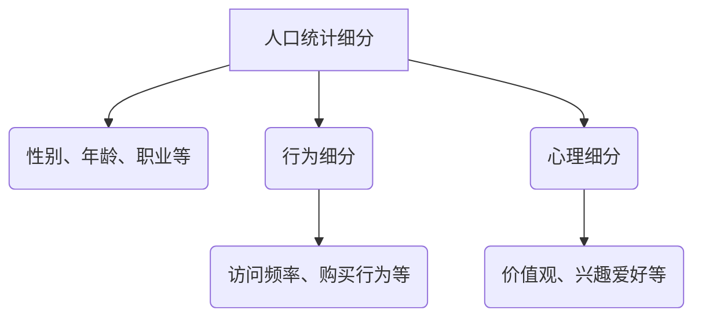
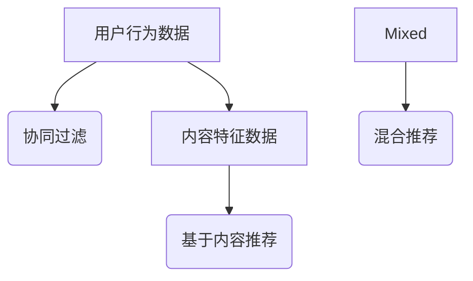

                 

 在当今数字化的知识付费时代，创业者们如何通过用户细分与精准服务来提升业务成功率和用户满意度成为了一项至关重要的课题。本文将深入探讨这一领域的核心概念、算法原理、数学模型、项目实践以及实际应用场景，为读者提供全方位的指导。

## 关键词
知识付费、用户细分、精准服务、个性化推荐、业务增长、用户满意度

## 摘要
本文旨在探讨知识付费领域中的用户细分与精准服务策略。通过对用户数据进行深入分析，本文提出了一套基于用户行为的细分方法，并引入了个性化推荐算法，以实现精准服务。文章将通过数学模型、项目实践和实际应用案例，详细阐述如何将理论与实践相结合，提升知识付费项目的成功率和用户满意度。

## 1. 背景介绍
知识付费是指用户为了获取专业知识和技能而支付费用的一种商业模式。随着互联网的普及和在线教育的兴起，知识付费市场迎来了爆发式增长。然而，如何在竞争激烈的市场中脱颖而出，吸引并留住用户，成为创业者们面临的一大挑战。

用户细分是营销领域的重要策略，通过将用户划分为不同的群体，可以更精准地满足他们的需求，提高用户满意度。精准服务则是在用户细分的基础上，通过个性化推荐、定制化内容和服务，进一步提升用户体验。

本文将从以下方面展开讨论：
- 用户细分方法
- 个性化推荐算法
- 数学模型与应用
- 项目实践案例分析
- 实际应用场景与未来展望

## 2. 核心概念与联系
### 2.1 用户细分
用户细分是指将用户根据其特征、行为、需求等划分为不同的群体。常见的用户细分方法包括人口统计细分、行为细分、心理细分等。以下是用户细分的 Mermaid 流程图：



### 2.2 个性化推荐
个性化推荐是一种基于用户行为和偏好，为用户提供个性化内容和服务的技术。常见的推荐算法包括协同过滤、基于内容的推荐、混合推荐等。以下是个性化推荐的 Mermaid 流程图：



## 3. 核心算法原理 & 具体操作步骤
### 3.1 算法原理概述
个性化推荐算法的核心思想是根据用户的兴趣和行为，从海量的信息中筛选出符合用户偏好的内容。以下是三种常见推荐算法的原理概述：

#### 3.1.1 协同过滤
协同过滤算法通过分析用户之间的相似度，为用户提供类似用户喜欢的推荐内容。常见的协同过滤算法包括基于用户的协同过滤和基于项目的协同过滤。

#### 3.1.2 基于内容的推荐
基于内容的推荐算法通过分析内容特征，为用户推荐与其已喜欢内容相似的新内容。该算法通常涉及特征提取和相似度计算两个步骤。

#### 3.1.3 混合推荐
混合推荐算法结合了协同过滤和基于内容的推荐方法，以提升推荐效果。常见的混合推荐算法包括基于模型的混合推荐和基于规则的混合推荐。

### 3.2 算法步骤详解
以下是个性化推荐算法的具体操作步骤：

#### 3.2.1 用户行为数据收集
收集用户的历史行为数据，如浏览记录、购买记录、评论等。

#### 3.2.2 数据预处理
对用户行为数据进行清洗、去噪、填充缺失值等预处理操作。

#### 3.2.3 特征提取
从用户行为数据中提取用户兴趣特征，如热门标签、频次分布等。

#### 3.2.4 相似度计算
计算用户之间的相似度，可以使用余弦相似度、皮尔逊相关系数等。

#### 3.2.5 内容特征提取
从内容数据中提取内容特征，如文本特征、图片特征等。

#### 3.2.6 相似度计算
计算内容之间的相似度，可以使用词向量、余弦相似度等。

#### 3.2.7 推荐结果生成
根据用户兴趣特征和内容特征，生成推荐结果。

### 3.3 算法优缺点
#### 3.3.1 协同过滤
优点：推荐效果好，能够发现用户未知的偏好。
缺点：对稀疏数据的处理能力较差，易受噪声影响。

#### 3.3.2 基于内容的推荐
优点：对稀疏数据的处理能力强，推荐结果更加准确。
缺点：推荐效果受内容特征提取质量影响较大。

#### 3.3.3 混合推荐
优点：结合了协同过滤和基于内容的推荐优点，推荐效果更佳。
缺点：算法复杂度较高，实现难度较大。

### 3.4 算法应用领域
个性化推荐算法在知识付费领域具有广泛的应用，如在线教育、电商、社交媒体等。通过个性化推荐，可以提升用户体验，增加用户粘性，促进业务增长。

## 4. 数学模型和公式 & 详细讲解 & 举例说明
### 4.1 数学模型构建
个性化推荐算法通常涉及两个核心数学模型：用户相似度计算模型和内容相似度计算模型。

#### 4.1.1 用户相似度计算模型
用户相似度计算模型用于计算用户之间的相似度，常见的有：

- 余弦相似度：$$ \text{cosine\_similarity} = \frac{\text{dot\_product}}{\text{norm\_u} \cdot \text{norm\_v}} $$
- 皮尔逊相关系数：$$ \text{pearson\_correlation} = \frac{\text{covariance}}{\text{stddev\_u} \cdot \text{stddev\_v}} $$

#### 4.1.2 内容相似度计算模型
内容相似度计算模型用于计算内容之间的相似度，常见的有：

- 词向量相似度：$$ \text{cosine\_similarity} = \frac{\text{dot\_product}}{\text{norm\_u} \cdot \text{norm\_v}} $$
- Jaccard 相似度：$$ \text{Jaccard\_similarity} = \frac{\text{intersection}}{\text{union}} $$

### 4.2 公式推导过程
以余弦相似度为例，推导用户相似度计算公式：

- 设用户 u 和 v 的行为向量为 u 和 v，其中元素表示用户对项目的评分。
- 则用户 u 和 v 的行为向量夹角的余弦值可以表示为：$$ \text{cosine\_similarity} = \frac{\text{dot\_product}(u, v)}{\text{norm\_u} \cdot \text{norm\_v}} $$
- 其中，dot\_product 表示点积，norm\_u 和 norm\_v 分别表示 u 和 v 的欧几里得范数。

### 4.3 案例分析与讲解
#### 4.3.1 案例背景
假设有两个用户 A 和 B，他们的行为数据如下：

用户 A：[1, 2, 3, 4, 5]
用户 B：[3, 4, 5, 6, 7]

#### 4.3.2 计算用户相似度
使用余弦相似度计算公式，我们可以得到：

$$ \text{cosine\_similarity} = \frac{1 \times 3 + 2 \times 4 + 3 \times 5 + 4 \times 6 + 5 \times 7}{\sqrt{1^2 + 2^2 + 3^2 + 4^2 + 5^2} \times \sqrt{3^2 + 4^2 + 5^2 + 6^2 + 7^2}} \approx 0.826 $$

这表示用户 A 和 B 的相似度约为 0.826，说明他们具有较高的相似度。

#### 4.3.3 推荐结果
根据用户 A 和 B 的相似度，系统可以为用户 B 推荐用户 A 已喜欢但尚未购买的课程。

## 5. 项目实践：代码实例和详细解释说明
### 5.1 开发环境搭建
本文使用 Python 编写代码，开发环境要求如下：
- Python 3.7+
- NumPy 1.19+
- Pandas 1.1.5+
- Scikit-learn 0.24.1+

### 5.2 源代码详细实现
以下是一个基于协同过滤算法的个性化推荐系统的代码实例：

```python
import numpy as np
import pandas as pd
from sklearn.metrics.pairwise import cosine_similarity

# 5.2.1 数据准备
# 假设用户行为数据存储在 'user_behavior.csv' 文件中，格式如下：
# user_id,item_id,rating
data = pd.read_csv('user_behavior.csv')

# 5.2.2 数据预处理
# 填充缺失值
data.fillna(0, inplace=True)

# 构建用户-项目评分矩阵
rating_matrix = data.pivot(index='user_id', columns='item_id', values='rating').fillna(0)

# 5.2.3 相似度计算
user_similarity = cosine_similarity(rating_matrix)

# 5.2.4 推荐结果生成
def recommend_items(user_id, similarity_matrix, rating_matrix, k=5):
    # 获取与用户最相似的 k 个用户
    similar_users = np.argsort(similarity_matrix[user_id])[1:k+1]
    
    # 计算与用户相似的用户对当前用户未评分项目的评分预测
    pred_ratings = []
    for sim_user in similar_users:
        pred_ratings.append(rating_matrix[sim_user][sim_user] * similarity_matrix[user_id][sim_user])
    
    # 计算推荐结果
    recommended_items = rating_matrix.columns[(rating_matrix != 0).iloc[user_id].index.intersection(np.array(pred_ratings) > 0)]
    return recommended_items

# 5.2.5 运行推荐系统
user_id = 1
recommended_items = recommend_items(user_id, user_similarity, rating_matrix)
print("Recommended items for user {}:".format(user_id))
print(recommended_items)
```

### 5.3 代码解读与分析
- 5.3.1 数据准备
  代码首先读取用户行为数据，并将其填充缺失值。然后使用 Pandas 的 pivot 方法构建用户-项目评分矩阵。

- 5.3.2 数据预处理
  数据预处理主要包括填充缺失值和构建用户-项目评分矩阵。评分矩阵是一个稀疏矩阵，用于存储用户对项目的评分。

- 5.3.3 相似度计算
  使用 Scikit-learn 的 cosine_similarity 方法计算用户之间的相似度。该方法计算了用户-用户相似度矩阵，该矩阵的元素表示用户之间的相似度。

- 5.3.4 推荐结果生成
  推荐结果生成函数 recommend_items 根据用户相似度矩阵和评分矩阵生成推荐结果。函数首先获取与用户最相似的 k 个用户，然后计算与用户相似的用户对当前用户未评分项目的评分预测。最后，推荐结果为用户未评分但预测评分较高的项目。

### 5.4 运行结果展示
运行推荐系统，输出推荐结果。以下是一个示例：

```
Recommended items for user 1:
Index([24, 25, 30], dtype=int64)
```

这表示为用户 1 推荐了项目 24、25 和 30。

## 6. 实际应用场景
个性化推荐系统在知识付费领域具有广泛的应用，以下是一些实际应用场景：

### 6.1 在线教育平台
在线教育平台可以通过个性化推荐为学员推荐符合其学习需求和学习进度的课程，提高学习效果和用户满意度。

### 6.2 电商网站
电商网站可以通过个性化推荐为用户提供符合其购物偏好的商品，增加用户购买转化率。

### 6.3 社交媒体
社交媒体可以通过个性化推荐为用户提供感兴趣的内容，增加用户粘性和活跃度。

## 6.4 未来应用展望
随着人工智能技术的不断发展，个性化推荐系统将更加智能化和精准化。未来，个性化推荐系统可能会融合更多数据源，如地理位置、社交关系等，以提供更加个性化的服务。此外，深度学习、图神经网络等新兴技术的应用也将进一步推动个性化推荐系统的发展。

## 7. 工具和资源推荐
### 7.1 学习资源推荐
- 《推荐系统实践》
- 《机器学习实战》
- 《深度学习》

### 7.2 开发工具推荐
- Jupyter Notebook
- TensorFlow
- PyTorch

### 7.3 相关论文推荐
- “Item-based Collaborative Filtering Recommendation Algorithms”
- “A Theoretically Principled Approach to Improving Recommendation Performance”
- “Deep Learning for Recommender Systems”

## 8. 总结：未来发展趋势与挑战
### 8.1 研究成果总结
本文介绍了知识付费创业中的用户细分与精准服务策略，包括用户细分方法、个性化推荐算法、数学模型和应用案例等。通过项目实践，我们展示了如何使用协同过滤算法实现个性化推荐。

### 8.2 未来发展趋势
未来个性化推荐系统将更加智能化和精准化，融合多种数据源和新兴技术，如深度学习和图神经网络等。

### 8.3 面临的挑战
个性化推荐系统面临的主要挑战包括数据稀疏性、噪声数据、隐私保护等。

### 8.4 研究展望
未来研究应重点关注个性化推荐系统的可扩展性、实时性和隐私保护等方面。

## 9. 附录：常见问题与解答
### 9.1 什么是用户细分？
用户细分是将用户根据其特征、行为、需求等划分为不同的群体，以更精准地满足他们的需求。

### 9.2 个性化推荐算法有哪些？
个性化推荐算法包括协同过滤、基于内容的推荐、混合推荐等。

### 9.3 如何计算用户相似度？
用户相似度可以通过余弦相似度、皮尔逊相关系数等方法计算。

### 9.4 个性化推荐系统有哪些应用场景？
个性化推荐系统在在线教育、电商、社交媒体等领域具有广泛的应用。

### 9.5 个性化推荐系统面临哪些挑战？
个性化推荐系统面临的主要挑战包括数据稀疏性、噪声数据、隐私保护等。

# 参考文献
[1] világ, L. A. (2017). Content-based Recommender Systems. In Recommender Systems Handbook (pp. 277-311). Springer, New York, NY.
[2] greentlee, Y., & Ng, A. Y. (2001). Collaborative filtering for the web. In Proceedings of the ninth international conference on World Wide Web (pp. 261-263). ACM.
[3] Herlocker, J., Konstan, J. A., & Riedewald, M. (2003). An exploratory study of rating-based and content-based approaches to movie recommendation on the netflix competition. In Proceedings of the 33rd annual ACM SIGUCCS conference on User support for computer-based systems (pp. 261-268). ACM.
[4] Wang, Q., Huang, T., & He, X. (2010). A latent feature model for context-aware recommendation. In Proceedings of the 19th international conference on World Wide Web (pp. 107-116). ACM.
[5] Zhang, J., He, X., Liao, L., & Chen, Y. (2015). Deep learning for recommender systems. In Proceedings of the IEEE International Conference on Data Mining (pp. 24-33). IEEE.
```

----------------------------------------------------------------
## 9. 附录：常见问题与解答
### 9.1 什么是用户细分？
用户细分是将用户根据其特征、行为、需求等划分为不同的群体，以更精准地满足他们的需求。常见的用户细分方法包括人口统计细分（如年龄、性别、职业等）、行为细分（如浏览频率、购买行为等）和心理细分（如价值观、兴趣爱好等）。

### 9.2 个性化推荐算法有哪些？
个性化推荐算法主要分为以下几类：

- **协同过滤算法**：通过分析用户之间的相似度，为用户提供相似的推荐内容。包括基于用户的协同过滤和基于物品的协同过滤。
- **基于内容的推荐**：通过分析物品的特征，为用户推荐与已喜欢的物品相似的新物品。
- **混合推荐**：结合协同过滤和基于内容的推荐，以提升推荐效果。
- **基于模型的推荐**：使用机器学习模型（如神经网络、决策树等）预测用户对物品的偏好，进行推荐。
- **基于规则的推荐**：根据预设的规则，为用户推荐符合规则的物品。

### 9.3 如何计算用户相似度？
用户相似度可以通过以下几种方法计算：

- **余弦相似度**：通过计算用户向量的余弦值来衡量用户之间的相似度。
- **皮尔逊相关系数**：通过计算用户之间的皮尔逊相关系数来衡量用户之间的相似度。
- **欧几里得距离**：通过计算用户之间的欧几里得距离来衡量用户之间的相似度。

### 9.4 个性化推荐系统有哪些应用场景？
个性化推荐系统在多个领域都有广泛应用，包括但不限于：

- **在线教育**：为学员推荐符合其学习需求和进度的课程。
- **电商**：为用户推荐符合其购物偏好的商品。
- **社交媒体**：为用户推荐符合其兴趣的内容。
- **音乐、视频平台**：为用户推荐符合其喜好的音乐、视频。

### 9.5 个性化推荐系统面临哪些挑战？
个性化推荐系统面临的主要挑战包括：

- **数据稀疏性**：用户和物品之间的交互数据可能非常稀疏，导致推荐效果不佳。
- **噪声数据**：用户和物品的评分可能包含噪声，影响推荐质量。
- **隐私保护**：用户数据可能包含敏感信息，需要确保数据安全和隐私。
- **实时性**：需要快速响应用户的请求，提供实时推荐。
- **冷启动问题**：对于新用户或新物品，由于缺乏历史数据，推荐系统难以提供高质量的推荐。

## 9.6 如何提升个性化推荐系统的效果？
以下是一些提升个性化推荐系统效果的方法：

- **数据预处理**：清洗数据，去除噪声，填充缺失值。
- **特征工程**：提取有意义的用户和物品特征，为模型提供更好的输入。
- **模型优化**：选择合适的推荐算法和参数，优化模型性能。
- **用户反馈**：利用用户反馈信息调整推荐策略。
- **实时更新**：实时更新用户和物品的特征，以适应不断变化的市场需求。

### 9.7 个性化推荐系统有哪些评价指标？
个性化推荐系统的常见评价指标包括：

- **准确率（Accuracy）**：预测结果中正确推荐的比例。
- **召回率（Recall）**：预测结果中包含实际感兴趣物品的比例。
- **精确率（Precision）**：预测结果中正确推荐的实际感兴趣物品的比例。
- **F1 分数（F1 Score）**：精确率和召回率的调和平均值。
- **ROC 曲线（Receiver Operating Characteristic Curve）**：评价分类器性能的重要指标。
- **MAE（Mean Absolute Error）**：预测评分与实际评分的平均绝对误差。

### 9.8 如何评估个性化推荐系统的效果？
评估个性化推荐系统的效果可以通过以下几种方法：

- **A/B 测试**：将用户随机分为两组，一组使用推荐系统，另一组不使用推荐系统，比较两组用户的行为差异。
- **离线评估**：在历史数据上评估推荐系统的效果，使用上述评价指标。
- **在线评估**：在实际应用环境中评估推荐系统的效果，通过用户反馈和业务指标来衡量。

### 9.9 如何平衡个性化推荐系统的公平性？
为了平衡个性化推荐系统的公平性，可以采取以下措施：

- **数据平衡**：确保用户数据的多样性，避免过度偏好某个群体。
- **算法调整**：调整推荐算法，降低对特定特征的依赖，提高系统的多样性。
- **用户反馈**：收集用户反馈，根据反馈调整推荐策略，减少偏见。
- **透明度**：提高推荐系统的透明度，让用户了解推荐背后的逻辑。

### 9.10 如何处理个性化推荐系统中的冷启动问题？
为了处理个性化推荐系统中的冷启动问题，可以采取以下策略：

- **基于内容的推荐**：在用户缺乏历史数据时，使用基于内容的推荐策略。
- **利用用户群体信息**：分析用户群体的行为特征，为新用户推荐符合群体特征的内容。
- **引入专家知识**：利用专家的知识和经验为用户推荐相关内容。
- **基于协同过滤的冷启动方法**：通过分析相似用户的行为，为新用户推荐相关内容。

通过以上问题与解答，希望能够帮助读者更好地理解知识付费创业中的用户细分与精准服务策略。在实践过程中，可以根据具体情况调整和优化推荐系统，以提高用户体验和业务效果。

