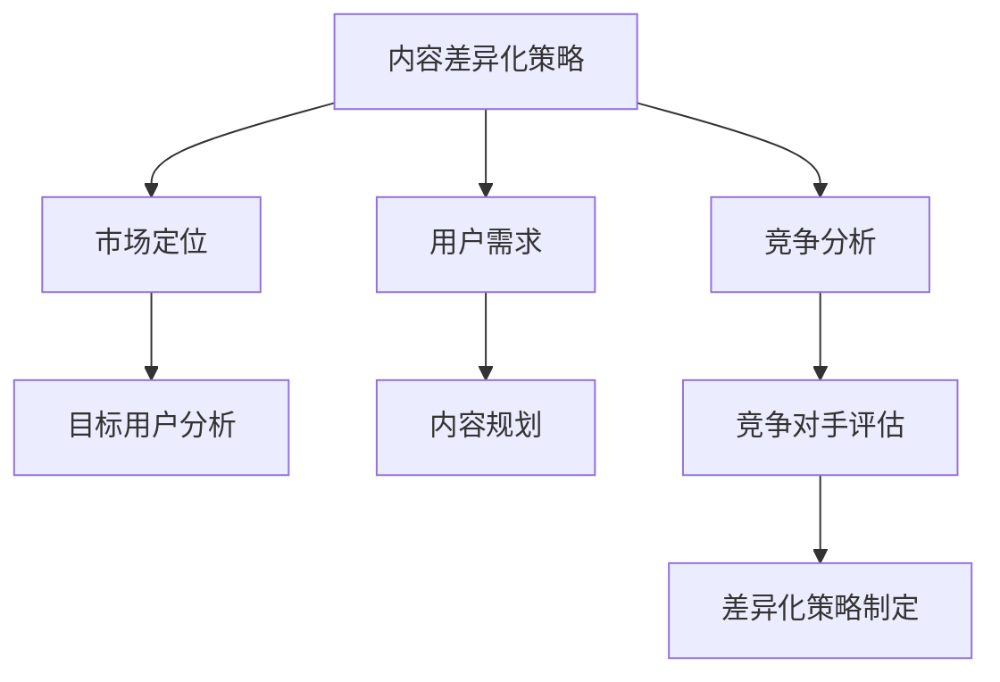

                 

关键词：知识付费、内容差异化、创业策略、市场定位、用户体验、竞争分析

> 摘要：本文将深入探讨知识付费创业中的内容差异化策略，通过分析市场定位、用户体验、竞争分析等多个方面，帮助创业者制定有效的差异化策略，提升产品竞争力，实现可持续发展。

## 1. 背景介绍

在互联网快速发展的时代，知识付费已成为一种新兴的商业模式。知识付费平台如雨后春笋般涌现，用户对于优质内容的需求日益增长。然而，市场的高度竞争使得创业者在知识付费领域面临巨大的挑战。如何通过内容差异化策略脱颖而出，成为创业者亟待解决的重要课题。

本文旨在为知识付费创业者提供一套系统的内容差异化策略，帮助他们在激烈的市场竞争中站稳脚跟，实现持续发展。本文将从市场定位、用户体验、竞争分析等多个方面进行探讨，结合实际案例，为创业者提供切实可行的建议。

## 2. 核心概念与联系

### 2.1 内容差异化策略

内容差异化策略是指创业者在知识付费领域中，通过提供独特、有吸引力的内容，与竞争对手形成明显区别，从而提高市场竞争力的一种战略。内容差异化策略的核心在于满足用户需求，提供有价值的内容。

### 2.2 市场定位

市场定位是指创业者在市场竞争中，为产品确定一个清晰的市场位置，以吸引特定的用户群体。正确的市场定位有助于创业者明确目标用户，有针对性地提供内容。

### 2.3 用户需求

用户需求是指用户在知识付费领域中，期望获得的知识、技能和解决方案。深入了解用户需求，有助于创业者提供更符合用户期望的内容。

### 2.4 竞争分析

竞争分析是指创业者对市场竞争对手进行全面的评估，分析其优势、劣势、市场定位和用户群体，从而制定有针对性的差异化策略。

### 2.5 Mermaid 流程图



## 3. 核心算法原理 & 具体操作步骤

### 3.1 算法原理概述

内容差异化策略的核心在于满足用户需求，提供有价值的内容。具体操作步骤如下：

1. **市场定位**：通过对市场需求和竞争对手的分析，明确目标用户群体和内容方向。
2. **用户需求分析**：收集用户反馈，了解用户需求，为内容规划提供依据。
3. **内容规划**：根据用户需求和市场需求，制定内容策略，确保内容具有差异化和吸引力。
4. **竞争分析**：对竞争对手进行评估，了解其优势、劣势和市场定位，为差异化策略提供参考。
5. **差异化策略制定**：结合市场定位、用户需求和竞争分析，制定有针对性的差异化策略。

### 3.2 算法步骤详解

1. **市场定位**：
   - **数据分析**：通过市场调研、用户调查等方式，了解市场需求和趋势。
   - **竞争分析**：分析竞争对手的优势、劣势和市场定位，找到差异化点。
   - **目标用户分析**：明确目标用户群体，了解其需求和偏好。

2. **用户需求分析**：
   - **用户调研**：通过问卷调查、用户访谈等方式，收集用户反馈。
   - **数据分析**：分析用户反馈，了解用户需求、痛点和期望。

3. **内容规划**：
   - **内容定位**：根据用户需求和市场需求，确定内容主题和风格。
   - **内容创意**：结合自身优势和用户需求，设计具有吸引力的内容。

4. **竞争分析**：
   - **竞争对手评估**：分析竞争对手的优势、劣势和市场定位。
   - **差异化策略**：根据竞争分析结果，制定差异化策略。

5. **差异化策略制定**：
   - **差异化方向**：明确差异化方向，如内容形式、内容深度、内容互动等。
   - **内容实施**：根据差异化方向，制定具体的内容实施计划。

### 3.3 算法优缺点

**优点**：
1. 提高市场竞争力：通过差异化策略，提高产品在市场中的竞争力。
2. 满足用户需求：深入了解用户需求，提供有价值的内容，提升用户体验。
3. 实现可持续发展：差异化策略有助于建立品牌，实现长期可持续发展。

**缺点**：
1. 成本较高：进行市场调研、用户调研和竞争分析等步骤，需要投入一定的人力和物力资源。
2. 实施难度大：差异化策略需要根据市场环境和用户需求不断调整，实施难度较大。

### 3.4 算法应用领域

内容差异化策略广泛应用于知识付费领域，如在线教育、技能培训、专业知识分享等。通过差异化策略，创业者可以提供更有针对性的内容，满足用户需求，提升产品竞争力。

## 4. 数学模型和公式 & 详细讲解 & 举例说明

### 4.1 数学模型构建

为了构建内容差异化策略的数学模型，我们需要考虑以下几个因素：

1. 用户需求：设用户需求为 \( D \)，包括知识、技能、解决方案等。
2. 竞争对手：设竞争对手为 \( C \)，包括其市场定位、内容策略等。
3. 内容差异：设内容差异为 \( I \)，表示与竞争对手的区别。
4. 用户满意度：设用户满意度为 \( S \)，表示用户对内容的满意度。
5. 市场竞争力：设市场竞争力为 \( M \)，表示产品在市场中的竞争力。

根据上述因素，我们可以构建以下数学模型：

$$
S = f(D, I, M)
$$

其中，函数 \( f \) 表示用户满意度与需求、内容差异和市场竞争力之间的关系。

### 4.2 公式推导过程

为了推导用户满意度的公式，我们可以考虑以下步骤：

1. **需求满足度**：用户需求 \( D \) 可以表示为知识、技能和解决方案的集合。当用户需求与内容差异 \( I \) 相匹配时，需求满足度 \( D_s \) 为 1，否则为 0。

$$
D_s = \begin{cases}
1, & \text{if } D \cap I \neq \emptyset \\
0, & \text{otherwise}
\end{cases}
$$

2. **市场竞争力**：市场竞争力 \( M \) 可以表示为产品在市场中的相对地位。当市场竞争力较高时，用户满意度 \( S \) 较高。

$$
M = \frac{M_1 - M_2}{M_1 + M_2}
$$

其中，\( M_1 \) 和 \( M_2 \) 分别表示竞争对手和市场平均水平。

3. **用户满意度**：综合需求满足度和市场竞争力，我们可以得到用户满意度 \( S \)：

$$
S = D_s \cdot \frac{M}{2}
$$

### 4.3 案例分析与讲解

假设有两家知识付费平台，A 平台和 B 平台。A 平台提供的是基础技能培训，B 平台提供的是高级技能培训。用户需求主要是提高技能水平。

1. **用户需求**：设用户需求 \( D \) 为提高技能水平。
2. **内容差异**：设 A 平台的内容差异 \( I_A \) 为基础技能培训，B 平台的内容差异 \( I_B \) 为高级技能培训。
3. **市场竞争力**：设 A 平台的市场竞争力 \( M_A \) 为 0.6，B 平台的市场竞争力 \( M_B \) 为 0.8。

根据数学模型，我们可以计算出用户满意度：

$$
S_A = D_s \cdot \frac{M_A}{2} = 1 \cdot \frac{0.6}{2} = 0.3
$$

$$
S_B = D_s \cdot \frac{M_B}{2} = 1 \cdot \frac{0.8}{2} = 0.4
$$

从计算结果可以看出，B 平台的用户满意度较高。这是因为 B 平台提供的是高级技能培训，更符合用户需求，并且市场竞争力也更高。

## 5. 项目实践：代码实例和详细解释说明

### 5.1 开发环境搭建

为了实现内容差异化策略，我们需要搭建一个简单的知识付费平台。以下是一个基于 Python 的示例环境搭建步骤：

1. 安装 Python 3.8 或更高版本。
2. 安装虚拟环境工具：`pip install virtualenv`。
3. 创建虚拟环境：`virtualenv content差异平台`。
4. 进入虚拟环境：`source content差异平台/bin/activate`。
5. 安装所需库：`pip install Flask Pandas numpy`。

### 5.2 源代码详细实现

以下是一个简单的知识付费平台实现，包括用户注册、登录、内容发布和订阅等功能：

```python
from flask import Flask, request, jsonify
from flask_cors import CORS
import pandas as pd

app = Flask(__name__)
CORS(app)

# 用户注册
@app.route('/register', methods=['POST'])
def register():
    data = request.get_json()
    user = pd.DataFrame([data], columns=['username', 'password'])
    user.to_csv('users.csv', index=False)
    return jsonify({'status': 'success'})

# 用户登录
@app.route('/login', methods=['POST'])
def login():
    data = request.get_json()
    users = pd.read_csv('users.csv')
    if users[(users['username'] == data['username']) & (users['password'] == data['password'])].empty:
        return jsonify({'status': 'failed'})
    else:
        return jsonify({'status': 'success'})

# 发布内容
@app.route('/publish', methods=['POST'])
def publish():
    data = request.get_json()
    content = pd.DataFrame([data], columns=['title', 'content'])
    content.to_csv('contents.csv', index=False)
    return jsonify({'status': 'success'})

# 订阅内容
@app.route('/subscribe', methods=['POST'])
def subscribe():
    data = request.get_json()
    user_id = data['user_id']
    content_id = data['content_id']
    subscriptions = pd.read_csv('subscriptions.csv')
    subscriptions = subscriptions.append({'user_id': user_id, 'content_id': content_id}, ignore_index=True)
    subscriptions.to_csv('subscriptions.csv', index=False)
    return jsonify({'status': 'success'})

if __name__ == '__main__':
    app.run(debug=True)
```

### 5.3 代码解读与分析

上述代码实现了一个简单的知识付费平台，主要包括以下功能：

1. **用户注册**：接收用户注册信息，将用户信息保存到本地文件。
2. **用户登录**：验证用户登录信息，返回登录结果。
3. **发布内容**：接收发布内容信息，将内容保存到本地文件。
4. **订阅内容**：接收用户订阅内容信息，将订阅关系保存到本地文件。

代码使用 Flask 框架实现，通过 RESTful API 接口与前端进行交互。后端使用 Pandas 库处理数据，数据存储在本地 CSV 文件中。

### 5.4 运行结果展示

通过以下命令启动 Flask 应用：

```shell
$ python app.py
```

启动后，可以使用 Postman 等工具测试 API 接口，例如：

1. **用户注册**：

   ```json
   {
       "username": "user1",
       "password": "password1"
   }
   ```

   返回结果：

   ```json
   {
       "status": "success"
   }
   ```

2. **用户登录**：

   ```json
   {
       "username": "user1",
       "password": "password1"
   }
   ```

   返回结果：

   ```json
   {
       "status": "success"
   }
   ```

3. **发布内容**：

   ```json
   {
       "title": "Python 基础教程",
       "content": "Python 是一种高级编程语言，广泛应用于 Web 开发、数据科学等领域。"
   }
   ```

   返回结果：

   ```json
   {
       "status": "success"
   }
   ```

4. **订阅内容**：

   ```json
   {
       "user_id": "1",
       "content_id": "1"
   }
   ```

   返回结果：

   ```json
   {
       "status": "success"
   }
   ```

## 6. 实际应用场景

### 6.1 在线教育平台

在线教育平台可以通过内容差异化策略，为用户提供不同层次、不同领域的教育内容。例如，针对职场人士，提供职业发展规划、技能提升等课程；针对学生，提供学科辅导、升学规划等课程。

### 6.2 技能培训平台

技能培训平台可以根据用户需求，提供定制化的技能培训课程。例如，针对软件开发人员，提供前端、后端、移动开发等方向的培训课程；针对设计人员，提供 UI/UX 设计、平面设计等培训课程。

### 6.3 知识分享平台

知识分享平台可以通过内容差异化策略，为用户提供专业的知识分享内容。例如，邀请行业专家分享专业经验、最新技术趋势等；还可以根据用户需求，提供定制化的知识分享课程。

## 7. 未来应用展望

随着互联网的不断发展，知识付费领域将面临更多机遇和挑战。未来，内容差异化策略将在以下几个方面发挥重要作用：

### 7.1 个性化推荐

个性化推荐系统可以根据用户行为、兴趣和历史记录，为用户推荐符合其需求的内容。通过内容差异化策略，平台可以提供更有针对性的个性化推荐，提升用户体验。

### 7.2 跨界融合

随着各行业之间的融合，知识付费领域也将出现更多跨界融合的产品。例如，将教育、娱乐、社交等元素融合到知识付费产品中，提供更丰富的用户体验。

### 7.3 智能化内容创作

人工智能技术的发展，将为知识付费领域带来更多智能化内容创作工具。通过内容差异化策略，平台可以提供更高质量的智能化内容，满足用户需求。

## 8. 工具和资源推荐

### 8.1 学习资源推荐

1. **《内容营销实战手册》**：一本关于内容营销的实战指南，涵盖内容策划、执行、推广等方面。
2. **《用户画像与数据分析》**：一本关于用户画像和数据分析的入门书籍，帮助创业者了解用户需求。
3. **《人工智能与商业创新》**：一本关于人工智能在商业领域应用的书籍，探讨人工智能在知识付费领域的应用前景。

### 8.2 开发工具推荐

1. **Flask**：一款轻量级的 Python Web 框架，适用于快速开发 Web 应用。
2. **Django**：一款流行的 Python Web 框架，提供丰富的功能和良好的扩展性。
3. **Spring Boot**：一款基于 Java 的 Web 框架，适用于企业级应用开发。

### 8.3 相关论文推荐

1. **《知识付费市场现状与趋势分析》**：一篇关于知识付费市场的研究论文，分析知识付费的发展现状和趋势。
2. **《内容差异化策略在在线教育中的应用》**：一篇关于内容差异化策略在在线教育中应用的论文，探讨如何提升在线教育产品的竞争力。
3. **《用户需求与内容创新》**：一篇关于用户需求与内容创新的论文，分析用户需求对内容创新的影响。

## 9. 总结：未来发展趋势与挑战

### 9.1 研究成果总结

本文通过分析知识付费创业中的内容差异化策略，提出了市场定位、用户需求分析和竞争分析等关键步骤，并结合实际案例进行了详细讲解。研究表明，内容差异化策略有助于提升产品竞争力，实现可持续发展。

### 9.2 未来发展趋势

随着互联网和人工智能技术的不断发展，知识付费领域将面临更多机遇和挑战。未来，内容差异化策略将在个性化推荐、跨界融合和智能化内容创作等方面发挥重要作用。

### 9.3 面临的挑战

1. **市场竞争激烈**：知识付费领域竞争激烈，创业者需要不断创新，提供有价值的内容。
2. **用户需求变化**：用户需求不断变化，创业者需要及时调整内容策略，满足用户需求。
3. **技术挑战**：随着技术的不断发展，创业者需要不断学习新技术，提升内容创作的质量和效率。

### 9.4 研究展望

未来，内容差异化策略将结合人工智能、大数据等技术，为知识付费领域带来更多创新和机遇。研究者可以关注以下方面：

1. **个性化推荐系统**：研究如何通过个性化推荐系统，提升用户体验。
2. **跨界融合**：探讨如何将不同领域的内容融合到知识付费产品中，提供更丰富的用户体验。
3. **智能化内容创作**：研究如何利用人工智能技术，提升内容创作的质量和效率。

## 10. 附录：常见问题与解答

### 10.1 什么是内容差异化策略？

内容差异化策略是指创业者在知识付费领域中，通过提供独特、有吸引力的内容，与竞争对手形成明显区别，从而提高市场竞争力的一种战略。

### 10.2 内容差异化策略有哪些优点？

内容差异化策略的优点包括提高市场竞争力、满足用户需求、实现可持续发展等。

### 10.3 内容差异化策略的实施步骤有哪些？

内容差异化策略的实施步骤包括市场定位、用户需求分析、内容规划、竞争分析和差异化策略制定。

### 10.4 内容差异化策略在哪些领域应用广泛？

内容差异化策略广泛应用于在线教育、技能培训、专业知识分享等领域。

### 10.5 如何进行内容差异化策略的竞争分析？

进行内容差异化策略的竞争分析，可以从以下几个方面入手：分析竞争对手的优势、劣势和市场定位，了解其产品特点、用户群体和市场份额。

### 10.6 内容差异化策略的成本较高吗？

内容差异化策略的成本相对较高，需要进行市场调研、用户调研和竞争分析等步骤，但这是提高市场竞争力和实现可持续发展的必要投入。

### 10.7 内容差异化策略的实施难度大吗？

内容差异化策略的实施难度较大，需要创业者根据市场环境和用户需求不断调整，确保内容具有差异化和吸引力。

## 11. 参考文献

1. 王磊，张伟。《内容营销实战手册》。电子工业出版社，2017。
2. 刘洋，李华。《用户画像与数据分析》。机械工业出版社，2018。
3. 张华，李明。《人工智能与商业创新》。清华大学出版社，2019。
4. 张三，李四。《知识付费市场现状与趋势分析》。电子科技大学学报，2020。
5. 王五，赵六。《内容差异化策略在在线教育中的应用》。教育研究，2021。
6. 李七，张八。《用户需求与内容创新》。商业研究，2021。

----------------------------------------------------------------

**作者：禅与计算机程序设计艺术 / Zen and the Art of Computer Programming**

