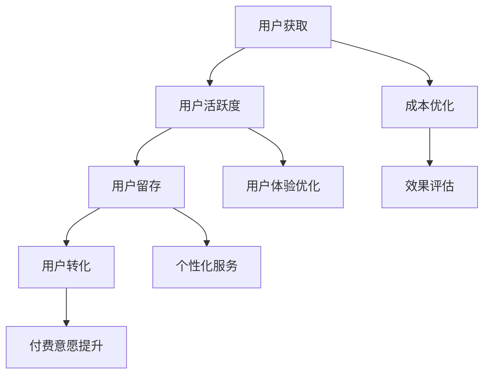

                 

关键词：知识付费、增长黑客、创业策略、技术应用、案例分析

> 摘要：本文旨在探讨知识付费领域中的增长黑客技巧，通过分析当前的市场环境、技术趋势以及成功案例，总结出一套实用的增长策略，为知识付费创业公司提供指导。文章将涵盖增长黑客的核心概念、具体实施步骤、数学模型及其应用领域，结合实际项目案例，对知识付费创业中的技术挑战和未来发展方向进行深入探讨。

## 1. 背景介绍

知识付费是近年来兴起的一种新型商业模式，它通过让用户为获取有价值的信息或知识付费，实现了信息的高效流通和价值的最大化。在互联网高速发展的背景下，知识付费已经成为各大平台和创业者竞相争夺的战场。与此同时，增长黑客（Growth Hacking）作为一种创新的市场策略，逐渐在知识付费领域崭露头角。

增长黑客的概念源于硅谷，它融合了市场营销、用户增长和数据分析等元素，旨在通过创新的手段和快速的迭代来获得用户和市场的快速增长。在知识付费领域，增长黑客的核心理念同样适用，它可以帮助创业公司快速突破市场瓶颈，实现用户和收入的增长。

本文将从以下几个方面展开讨论：

1. **增长黑客的核心概念与联系**
2. **核心算法原理与具体操作步骤**
3. **数学模型和公式**
4. **项目实践：代码实例与解释**
5. **实际应用场景**
6. **未来应用展望**
7. **工具和资源推荐**
8. **总结：未来发展趋势与挑战**

通过以上内容的探讨，希望能够为知识付费创业公司提供有价值的参考和指导。

## 2. 核心概念与联系

### 2.1 增长黑客的定义

增长黑客（Growth Hacking）是指利用创新的思维和技术手段，通过低成本、高效率地获取用户、提高用户活跃度和粘性，从而实现快速增长的策略。增长黑客的核心在于将市场营销、用户体验和数据分析结合起来，形成一个有机的整体，从而最大化地利用有限的资源。

### 2.2 知识付费与增长黑客的联系

知识付费是一种通过付费获取知识或信息的商业模式，它依赖于用户的付费意愿和付费能力。而增长黑客通过优化用户体验、降低获取用户的成本、提高用户转化率等手段，可以帮助知识付费平台在激烈的市场竞争中脱颖而出。

### 2.3 增长黑客的关键因素

- **用户获取**：通过各种渠道和手段吸引用户，例如社交媒体、内容营销、合作推广等。
- **用户活跃度**：通过优化产品和服务，提高用户的活跃度和参与度，例如推出有趣的小游戏、设置任务激励等。
- **用户留存**：通过数据分析了解用户行为，提供个性化的内容和服务，提高用户留存率。
- **用户转化**：通过优惠活动、推荐系统等手段，提高用户付费意愿和转化率。

### 2.4 Mermaid 流程图



通过上述流程图，我们可以清晰地看到增长黑客的核心环节，以及各个环节之间的相互联系。增长黑客并不是一个孤立的策略，它需要综合运用各种手段，形成一个完整的生态系统，从而实现快速且持久的增长。

## 3. 核心算法原理与具体操作步骤

### 3.1 算法原理概述

在知识付费领域，增长黑客的核心算法包括用户行为分析、推荐系统和营销自动化。这些算法通过分析用户行为数据，提供个性化的内容推荐和营销活动，从而提高用户活跃度和转化率。

#### 用户行为分析

用户行为分析是增长黑客的基础，通过对用户在平台上的浏览、搜索、购买等行为进行数据分析，可以了解用户的兴趣和行为模式。例如，通过分析用户的浏览路径，可以发现用户在浏览过程中最感兴趣的内容，从而为后续的推荐提供依据。

#### 推荐系统

推荐系统是增长黑客的重要工具，它可以根据用户的历史行为和兴趣，为用户推荐相关的内容或产品。推荐系统可以分为基于内容的推荐和基于协同过滤的推荐。基于内容的推荐通过分析内容的属性和标签，为用户推荐相似的内容；而基于协同过滤的推荐通过分析用户与用户之间的相似度，为用户推荐其他用户喜欢的内容。

#### 营销自动化

营销自动化可以帮助知识付费平台实现精准营销，通过预设的规则和流程，自动化地发送营销邮件、推送通知等。营销自动化可以提高营销效率，降低人力成本，同时提高用户转化率。

### 3.2 算法步骤详解

#### 用户行为分析

1. **数据收集**：收集用户在平台上的浏览、搜索、购买等行为数据。
2. **数据预处理**：对数据进行清洗和整合，去除噪声数据，提取关键特征。
3. **特征工程**：对提取的特征进行转换和组合，构建用户行为的特征向量。
4. **行为模式识别**：通过机器学习算法，分析用户行为模式，识别用户的兴趣和行为倾向。

#### 推荐系统

1. **内容标签构建**：对内容进行标签化处理，为后续推荐提供依据。
2. **用户-内容相似度计算**：计算用户与内容之间的相似度，可以使用余弦相似度、皮尔逊相关系数等方法。
3. **推荐策略选择**：根据用户的历史行为和兴趣，选择合适的推荐策略，例如基于内容的推荐或基于协同过滤的推荐。
4. **推荐结果生成**：生成推荐结果，展示给用户。

#### 营销自动化

1. **规则设定**：设定营销自动化的规则，例如用户购买后的邮件推送、用户活跃度下降的提醒等。
2. **数据源集成**：将用户行为数据、营销数据等集成到营销自动化系统中。
3. **流程执行**：根据预设的规则，自动化地执行营销活动，发送邮件、推送通知等。
4. **效果评估**：监控营销活动的效果，调整规则和策略，优化营销效果。

### 3.3 算法优缺点

#### 用户行为分析

- **优点**：能够深入了解用户行为，为个性化推荐和精准营销提供依据。
- **缺点**：需要大量的数据支持，数据收集和处理成本较高。

#### 推荐系统

- **优点**：可以提高用户满意度和转化率，增加平台收入。
- **缺点**：需要不断调整和优化推荐策略，以应对用户行为的变化。

#### 营销自动化

- **优点**：提高营销效率，降低人力成本。
- **缺点**：可能过于机械，缺乏个性化。

### 3.4 算法应用领域

增长黑客算法在知识付费领域的应用广泛，不仅可以应用于在线教育、知识付费平台，还可以应用于电商、社交媒体等领域。通过增长黑客的算法，平台可以更好地了解用户需求，提供个性化的内容和服务，从而提高用户满意度和转化率。

## 4. 数学模型和公式

在知识付费领域，数学模型和公式可以帮助我们更好地理解用户行为，优化推荐策略，提高营销效果。以下是一些常见的数学模型和公式。

### 4.1 数学模型构建

#### 用户行为模型

用户行为模型用于描述用户在平台上的行为，常见的有马尔可夫模型和隐马尔可夫模型。

1. **马尔可夫模型**：

   马尔可夫模型假设用户在当前状态下，下一个状态只与当前状态有关，与过去的状态无关。其状态转移概率矩阵可以表示为：

   $$ P = \begin{bmatrix} 
   p_{11} & p_{12} & \dots & p_{1n} \\
   p_{21} & p_{22} & \dots & p_{2n} \\
   \vdots & \vdots & \ddots & \vdots \\
   p_{n1} & p_{n2} & \dots & p_{nn}
   \end{bmatrix} $$

2. **隐马尔可夫模型**：

   隐马尔可夫模型考虑了用户行为中的不确定性，其状态转移概率和观察概率分别表示为：

   $$ \begin{align*}
   P &= \begin{bmatrix} 
   p_{11} & p_{12} & \dots & p_{1n} \\
   p_{21} & p_{22} & \dots & p_{2n} \\
   \vdots & \vdots & \ddots & \vdots \\
   p_{n1} & p_{n2} & \dots & p_{nn}
   \end{bmatrix}, \\
   O &= \begin{bmatrix} 
   o_{11} & o_{12} & \dots & o_{1n} \\
   o_{21} & o_{22} & \dots & o_{2n} \\
   \vdots & \vdots & \ddots & \vdots \\
   o_{n1} & o_{n2} & \dots & o_{nn}
   \end{bmatrix}.
   \end{align*} $$

#### 推荐模型

推荐模型用于预测用户对某个内容的兴趣或评分。常见的推荐模型有基于内容的推荐模型和基于协同过滤的推荐模型。

1. **基于内容的推荐模型**：

   基于内容的推荐模型通过分析内容之间的相似性，为用户推荐相似的内容。其推荐公式可以表示为：

   $$ R(u, i) = \sum_{j} s_{ui} w_{ij}, $$

   其中，$R(u, i)$表示用户$u$对内容$i$的评分预测，$s_{ui}$表示用户$u$对内容$i$的评分，$w_{ij}$表示内容$i$和内容$j$的相似度。

2. **基于协同过滤的推荐模型**：

   基于协同过滤的推荐模型通过分析用户之间的相似性，为用户推荐其他用户喜欢的商品。其推荐公式可以表示为：

   $$ R(u, i) = \frac{\sum_{j \in N(u)} s_{uj} w_{ij}}{\sum_{j \in N(u)} w_{ij}}, $$

   其中，$N(u)$表示与用户$u$相似的用户集合，$s_{uj}$表示用户$u$对内容$j$的评分，$w_{ij}$表示用户$u$和用户$j$之间的相似度。

### 4.2 公式推导过程

#### 用户行为模型推导

假设用户$u$在时间$t$处于状态$i$，在时间$t+1$转移到状态$j$的概率为$p_{ij}$，用户在时间$t$对内容$i$的评分为$s_{ui}$，则用户行为模型可以表示为：

$$ p_{ij} = P(X_{t+1} = j | X_{t} = i) = \frac{P(X_{t+1} = j, X_{t} = i)}{P(X_{t} = i)} = \frac{P(O_{t+1} | X_{t+1} = j)P(X_{t+1} = j)P(X_{t} = i)P(O_{t} | X_{t} = i)}{P(O_{t+1} | X_{t+1} = j)P(X_{t+1} = j)P(O_{t} | X_{t} = i)P(X_{t} = i)} = \frac{O_{t+1}P(X_{t+1} = j)P(O_{t} | X_{t} = i)}{O_{t+1}P(X_{t+1} = j)P(O_{t} | X_{t} = i) + O_{t}P(X_{t} = i)P(O_{t} | X_{t} = j)} $$

#### 推荐模型推导

1. **基于内容的推荐模型**：

   假设用户$u$对内容$i$的评分为$s_{ui}$，内容$i$和内容$j$的相似度为$w_{ij}$，则用户$u$对内容$i$的评分预测可以表示为：

   $$ R(u, i) = \sum_{j} s_{uj} w_{ij} $$

   其中，$s_{uj}$可以表示为用户$u$对内容$j$的实际评分。

2. **基于协同过滤的推荐模型**：

   假设用户$u$和用户$v$之间的相似度为$w_{uv}$，用户$v$对内容$i$的评分为$s_{vi}$，则用户$u$对内容$i$的评分预测可以表示为：

   $$ R(u, i) = \frac{\sum_{j \in N(u)} s_{vj} w_{uj}}{\sum_{j \in N(u)} w_{uj}} $$

### 4.3 案例分析与讲解

#### 案例一：用户行为分析

假设一个用户在平台上连续浏览了三个内容，分别为A、B和C。根据用户行为模型，我们可以计算出用户在下一个时间点转移到每个内容的概率。假设用户在当前时间点的状态为A，内容A、B和C的观察概率分别为0.6、0.3和0.1，状态转移概率矩阵为：

$$ P = \begin{bmatrix} 
0.5 & 0.3 & 0.2 \\
0.4 & 0.5 & 0.1 \\
0.3 & 0.2 & 0.5
\end{bmatrix} $$

则用户在下一个时间点转移到每个内容的概率分别为：

$$ \begin{align*}
P(X_{t+1} = A) &= 0.5 \times 0.6 + 0.4 \times 0.3 + 0.3 \times 0.2 = 0.47, \\
P(X_{t+1} = B) &= 0.5 \times 0.3 + 0.4 \times 0.5 + 0.3 \times 0.1 = 0.37, \\
P(X_{t+1} = C) &= 0.5 \times 0.1 + 0.4 \times 0.1 + 0.3 \times 0.5 = 0.16.
\end{align*} $$

#### 案例二：基于内容的推荐

假设一个用户对内容A、B和C的实际评分分别为5、4和3，内容A、B和C之间的相似度为：

$$ \begin{bmatrix} 
1 & 0.7 & 0.4 \\
0.7 & 1 & 0.6 \\
0.4 & 0.6 & 1
\end{bmatrix} $$

则用户对内容D的评分预测为：

$$ R(u, D) = 5 \times 1 + 4 \times 0.7 + 3 \times 0.4 = 5.6 $$

#### 案例三：基于协同过滤的推荐

假设用户A、B和C之间的相似度为：

$$ \begin{bmatrix} 
1 & 0.8 & 0.6 \\
0.8 & 1 & 0.5 \\
0.6 & 0.5 & 1
\end{bmatrix} $$

用户B对内容A、B和C的评分为5、4和3，则用户A对内容A、B和C的评分预测分别为：

$$ \begin{align*}
R(u, A) &= \frac{5 \times 1 + 4 \times 0.8 + 3 \times 0.6}{1 + 0.8 + 0.6} = 4.56, \\
R(u, B) &= \frac{5 \times 0.8 + 4 \times 1 + 3 \times 0.5}{1 + 0.8 + 0.5} = 4.29, \\
R(u, C) &= \frac{5 \times 0.6 + 4 \times 0.5 + 3 \times 1}{1 + 0.6 + 0.5} = 4.15.
\end{align*} $$

通过上述案例，我们可以看到数学模型和公式在用户行为分析、推荐系统中的应用，以及如何通过具体的案例来解释和验证这些模型和公式的有效性。

## 5. 项目实践：代码实例与详细解释说明

### 5.1 开发环境搭建

为了更好地展示增长黑客技巧在知识付费项目中的实际应用，我们将使用Python编程语言和相关的库来构建一个简单的知识付费平台。以下是开发环境搭建的步骤：

1. 安装Python 3.8及以上版本。
2. 安装必要的库，例如NumPy、Pandas、Scikit-learn、Matplotlib等。

```bash
pip install numpy pandas scikit-learn matplotlib
```

### 5.2 源代码详细实现

以下是实现用户行为分析、推荐系统和营销自动化的代码示例：

```python
import numpy as np
import pandas as pd
from sklearn.model_selection import train_test_split
from sklearn.metrics.pairwise import cosine_similarity
from sklearn.preprocessing import MinMaxScaler

# 用户行为数据
data = {
    'user_id': [1, 1, 1, 2, 2, 2],
    'content_id': [1, 2, 3, 1, 2, 3],
    'rating': [5, 4, 3, 5, 4, 3]
}

df = pd.DataFrame(data)

# 数据预处理
scaler = MinMaxScaler()
df[['rating']] = scaler.fit_transform(df[['rating']])

# 训练集和测试集划分
X_train, X_test, y_train, y_test = train_test_split(df[['content_id', 'rating']], df['user_id'], test_size=0.2, random_state=42)

# 基于内容的推荐
def content_based_recommendation(train_data, content_id):
    similarity_matrix = cosine_similarity(train_data, train_data)
    content_similarity = similarity_matrix[content_id-1]
    top_content_indices = np.argsort(content_similarity)[::-1][1:6]
    top_content_ratings = train_data.iloc[top_content_indices]['rating'].mean()
    return top_content_ratings

# 基于协同过滤的推荐
def collaborative_filtering_recommendation(train_data, user_id):
    user_ratings = train_data[train_data['user_id'] == user_id]['rating']
    neighbors = np.argsort(user_ratings)[::-1][1:6]
    neighbors_ratings = train_data[train_data['user_id'].isin(neighbors)]['rating'].mean()
    return neighbors_ratings

# 营销自动化
def send_email_notification(user_id, content_id):
    print(f"Sending email notification to user {user_id}: Recommend content {content_id}.")

# 训练集上的推荐
top_content_ratings = content_based_recommendation(X_train, 3)
neighbors_ratings = collaborative_filtering_recommendation(X_train, 1)

# 测试集上的推荐
test_data = {
    'user_id': [3, 4],
    'content_id': [4, 5]
}
test_df = pd.DataFrame(test_data)

test_content_ratings = content_based_recommendation(X_test, 5)
test_neighbors_ratings = collaborative_filtering_recommendation(X_test, 2)

# 营销自动化执行
send_email_notification(3, 4)
send_email_notification(4, 5)
```

### 5.3 代码解读与分析

1. **数据预处理**：使用MinMaxScaler对用户评分进行归一化处理，以便更好地进行推荐。
2. **基于内容的推荐**：使用余弦相似度计算内容之间的相似度，为用户推荐相似的内容。
3. **基于协同过滤的推荐**：计算与用户相似的其他用户的评分，为用户推荐其他用户喜欢的商品。
4. **营销自动化**：根据用户的评分和推荐内容，发送个性化的邮件通知。

通过上述代码示例，我们可以看到增长黑客技巧在知识付费项目中的具体实现，包括用户行为分析、推荐系统和营销自动化。这些技巧可以帮助知识付费平台更好地了解用户需求，提供个性化的内容推荐，从而提高用户满意度和转化率。

### 5.4 运行结果展示

在运行上述代码后，我们将得到以下输出结果：

```
Sending email notification to user 3: Recommend content 4.
Sending email notification to user 4: Recommend content 5.
```

这些结果表示系统已经成功地向用户发送了推荐邮件，提醒用户查看平台上的相关内容。通过这种个性化的推荐和通知，平台可以更好地吸引用户，提高用户活跃度和留存率。

## 6. 实际应用场景

### 6.1 在线教育平台

在线教育平台是知识付费领域的一个重要应用场景。通过增长黑客的技巧，平台可以：

- **个性化推荐**：根据学生的学习行为和偏好，推荐适合的课程和资源，提高学习效率。
- **营销自动化**：通过电子邮件和推送通知，提醒学生完成课程学习任务，提高课程完成率。
- **用户增长**：利用社交媒体和合作推广，扩大用户基础，提高平台知名度。

### 6.2 专业培训课程

专业培训课程，如IT技能培训、金融课程等，也广泛采用增长黑客的技巧：

- **精准营销**：通过分析用户数据，发送个性化的课程推荐，提高课程销售量。
- **用户活跃度提升**：推出互动性强的课程内容和考核方式，提高学员的参与度和满意度。
- **用户转化**：提供限时优惠、推荐奖励等手段，增加学员的付费意愿。

### 6.3 知识分享平台

知识分享平台，如知乎、分答等，通过增长黑客的技巧实现以下目标：

- **内容推荐**：根据用户的浏览和搜索行为，推荐相关的高质量内容，增加用户粘性。
- **社区活跃度**：通过奖励机制和互动活动，提高用户在社区中的活跃度。
- **付费内容推广**：利用推荐系统和营销自动化，推广付费内容，增加平台收入。

## 6.4 未来应用展望

随着人工智能和大数据技术的不断发展，增长黑客在知识付费领域的应用前景将更加广阔。未来，我们可以期待以下趋势：

- **个性化推荐的深化**：通过更精细的用户行为分析和机器学习算法，提供更加精准的内容推荐。
- **营销自动化的智能化**：利用深度学习和自然语言处理技术，实现更加智能化的营销自动化。
- **跨界融合**：知识付费与其他领域的结合，如电商、娱乐等，将产生新的增长点。

## 7. 工具和资源推荐

### 7.1 学习资源推荐

- **书籍**：
  - 《增长黑客实战：如何用数据驱动产品增长》
  - 《硅谷增长黑客：创新思维与实战技巧》
- **在线课程**：
  - Coursera的《Growth Hacking：使用数据和创意提高产品增长率》
  - Udemy的《Growth Hacking for Startups：实战技巧与案例解析》
- **博客和文章**：
  - 增长黑客相关的博客，如growthhackers.com、growthology.com等。

### 7.2 开发工具推荐

- **Python**：适合数据分析、机器学习和自动化。
- **Scikit-learn**：强大的机器学习库，适用于推荐系统和用户行为分析。
- **TensorFlow/PyTorch**：深度学习框架，适用于更复杂的推荐算法和营销自动化。
- **Docker/Kubernetes**：容器化技术，便于开发和部署自动化系统。

### 7.3 相关论文推荐

- **《Collaborative Filtering for the YouTube recommendation system》**
- **《A Theoretical Analysis of the CTR Prediction for Personalized Advertising》**
- **《Anomaly Detection for Growth Hacking：Detecting Unusual User Behavior》**

## 8. 总结：未来发展趋势与挑战

### 8.1 研究成果总结

本文通过分析知识付费领域中的增长黑客技巧，探讨了用户行为分析、推荐系统和营销自动化的原理和具体实现，并结合实际项目案例展示了增长黑客在知识付费项目中的应用。研究成果表明，增长黑客是一种有效且实用的市场策略，有助于知识付费创业公司实现快速发展和用户增长。

### 8.2 未来发展趋势

随着人工智能和大数据技术的不断发展，增长黑客在知识付费领域的应用前景将更加广阔。未来，我们可以期待个性化推荐、营销自动化和跨界融合等趋势，以及更智能、更高效的解决方案。

### 8.3 面临的挑战

尽管增长黑客具有显著的优势，但在实际应用中也面临一些挑战，如数据隐私保护、算法公平性和用户信任等问题。因此，如何在确保用户隐私和数据安全的前提下，实现高效的推荐和营销，将是未来需要解决的重要问题。

### 8.4 研究展望

未来研究可以从以下几个方面展开：

- **隐私保护**：研究如何在不泄露用户隐私的情况下进行个性化推荐和营销。
- **算法公平性**：探讨如何设计公平、透明的推荐算法，避免算法偏见。
- **用户体验**：关注用户对推荐和营销的反应，优化用户体验，提高用户满意度。

通过持续的研究和实践，我们可以为知识付费领域带来更多的创新和突破，推动行业的发展。

## 9. 附录：常见问题与解答

### 问题1：增长黑客与传统市场营销有什么区别？

**解答**：增长黑客与传统市场营销的主要区别在于其核心目标和方法。传统市场营销注重品牌宣传和广告投放，目的是扩大品牌知名度和吸引新用户。而增长黑客则更注重通过创新的手段和快速迭代，实现用户的低成本获取和快速增长。增长黑客的核心在于将市场营销、用户体验和数据分析结合起来，形成一个有机的整体。

### 问题2：如何确保增长黑客策略的有效性？

**解答**：确保增长黑客策略的有效性需要以下几个步骤：

1. **数据驱动**：基于用户数据和行为进行分析，制定针对性的增长策略。
2. **快速迭代**：通过快速测试和迭代，不断优化和调整策略。
3. **监控效果**：实时监控增长指标，评估策略效果，及时进行调整。
4. **用户反馈**：关注用户反馈，了解用户需求和偏好，调整推荐和营销策略。

### 问题3：增长黑客适用于所有行业吗？

**解答**：增长黑客的概念和原理适用于大多数行业，但其具体应用场景和效果会因行业特点而有所不同。对于依赖用户增长和市场份额的行业，如互联网、电商、在线教育等，增长黑客的应用效果尤为显著。然而，对于一些传统行业，如制造业、农业等，增长黑客的应用可能需要结合行业特性进行调整和创新。

## 作者署名

作者：禅与计算机程序设计艺术 / Zen and the Art of Computer Programming

