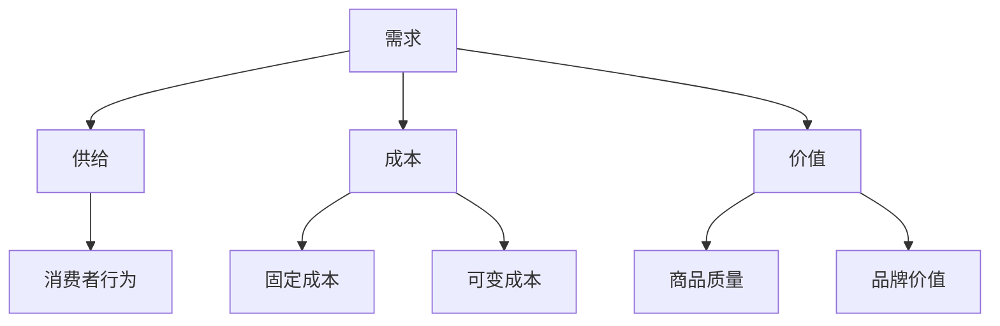

                 

关键词：知识付费、创业、定价策略、心理学、消费者行为、营销策略、成本收益分析

> 摘要：本文旨在探讨知识付费创业中的定价心理学，分析影响定价的因素以及消费者行为，通过心理学原理和实际案例，为创业者提供有针对性的定价策略，以实现利润最大化和市场竞争力。

## 1. 背景介绍

随着互联网和智能手机的普及，知识付费逐渐成为市场主流。人们对于专业知识、技能培训、内容消费的需求不断增加，从而催生了大量的知识付费创业项目。在这些项目中，定价策略至关重要，它不仅关系到企业的盈利能力，还直接影响到消费者的购买决策和市场占有率。因此，理解定价心理学，对于知识付费创业者来说具有重要意义。

本文将从以下几个方面展开讨论：

- **核心概念与联系**：介绍与定价心理学相关的基础概念，并使用 Mermaid 流程图展示其架构。
- **核心算法原理 & 具体操作步骤**：阐述影响定价的主要因素，以及如何制定合理的定价策略。
- **数学模型和公式 & 详细讲解 & 举例说明**：介绍用于定价分析的基础数学模型，并通过实际案例进行讲解。
- **项目实践：代码实例和详细解释说明**：提供具体的代码实现，帮助读者理解定价策略的实施。
- **实际应用场景**：探讨知识付费创业中定价策略的应用场景，以及未来发展趋势。
- **工具和资源推荐**：推荐相关学习资源和开发工具，为创业者提供支持。
- **总结：未来发展趋势与挑战**：总结研究成果，展望未来发展趋势和面临的挑战。

## 2. 核心概念与联系

在讨论知识付费创业的定价心理学之前，我们首先需要了解一些核心概念，这些概念包括需求、供给、成本、价值、消费者行为等。

### 需求

需求是指消费者在一定价格水平下，愿意购买的商品数量。在知识付费创业中，需求通常受到以下因素影响：

- **消费者个人需求**：消费者的个人兴趣、职业背景、学习能力等。
- **市场环境**：行业趋势、竞争状况、经济环境等。

### 供给

供给是指生产者在一定价格水平下，愿意提供的商品数量。在知识付费创业中，供给主要受以下因素影响：

- **生产成本**：包括人力、物力、时间等。
- **生产效率**：生产者通过优化生产流程、提高技能水平等手段降低成本。

### 成本

成本是指生产者在生产过程中所承担的费用。在知识付费创业中，成本主要包括以下几类：

- **固定成本**：如设备购置、场地租赁、广告宣传等。
- **可变成本**：如人力成本、原材料成本、运输成本等。

### 价值

价值是指商品所具有的使用价值和交换价值。在知识付费创业中，价值主要体现在以下几个方面：

- **商品质量**：高质量的商品能够提高消费者的满意度，从而增加复购率。
- **品牌价值**：知名品牌能够提高消费者的信任度和忠诚度，从而提升销量。

### 消费者行为

消费者行为是指消费者在购买、使用、评价商品的过程中所表现出的行为和心理活动。在知识付费创业中，消费者行为主要受以下因素影响：

- **价格敏感度**：不同消费者的价格敏感度不同，需要根据目标客户群体的特点制定合适的定价策略。
- **购买动机**：消费者的购买动机包括实用性、兴趣爱好、社交需求等。

### Mermaid 流程图

下面是一个用于描述核心概念与联系流程的 Mermaid 流程图：



## 3. 核心算法原理 & 具体操作步骤

在了解核心概念后，我们需要探讨如何制定合理的定价策略。这需要从以下几个步骤入手：

### 3.1 算法原理概述

定价算法主要基于需求、供给、成本和价值等因素。其基本原理如下：

1. **需求分析**：通过市场调研、数据分析等手段，了解消费者需求及其价格敏感度。
2. **成本分析**：计算固定成本和可变成本，确定产品或服务的成本结构。
3. **价值评估**：评估产品或服务的质量、品牌价值等因素，确定其价值。
4. **定价策略**：根据需求、成本和价值等因素，制定合理的定价策略。

### 3.2 算法步骤详解

下面是一个具体的定价算法步骤：

1. **需求分析**：

   - 进行市场调研，了解目标客户群体的需求特点。
   - 分析竞争对手的定价策略，确定自己的定位。

2. **成本分析**：

   - 计算固定成本和可变成本。
   - 分析成本结构，确定成本降低的空间。

3. **价值评估**：

   - 评估产品或服务的质量、品牌价值等因素。
   - 确定产品或服务的市场竞争力。

4. **定价策略**：

   - 采用成本加成法、市场导向法、价值导向法等策略。
   - 确定最终定价。

### 3.3 算法优缺点

- **优点**：通过科学的方法制定定价策略，能够提高定价的准确性和合理性，从而提高企业的盈利能力。
- **缺点**：需要投入大量的人力、物力和时间进行市场调研和数据分析，成本较高。

### 3.4 算法应用领域

定价算法广泛应用于知识付费创业领域，如在线课程、电子书、知识分享平台等。通过合理的定价策略，企业可以吸引更多消费者，提高市场份额。

## 4. 数学模型和公式 & 详细讲解 & 举例说明

在定价过程中，数学模型和公式发挥着重要作用。下面介绍几种常用的数学模型和公式。

### 4.1 数学模型构建

1. **需求函数**：需求函数描述了价格与需求量之间的关系。常用的需求函数包括线性需求函数、对数需求函数等。

   $$ Q_d = a - bP $$

   其中，$Q_d$ 表示需求量，$P$ 表示价格，$a$ 和 $b$ 为参数。

2. **成本函数**：成本函数描述了价格与成本之间的关系。常用的成本函数包括线性成本函数、二次成本函数等。

   $$ C = w_1Q + w_2Q^2 $$

   其中，$C$ 表示成本，$Q$ 表示需求量，$w_1$ 和 $w_2$ 为参数。

3. **利润函数**：利润函数描述了价格与利润之间的关系。利润函数为需求函数与成本函数的差值。

   $$ \pi = (a - bP) - (w_1Q + w_2Q^2) $$

### 4.2 公式推导过程

下面以线性需求函数为例，介绍公式推导过程：

1. **需求函数**：

   假设需求函数为线性形式：

   $$ Q_d = a - bP $$

   其中，$Q_d$ 表示需求量，$P$ 表示价格，$a$ 和 $b$ 为参数。

2. **成本函数**：

   假设成本函数为线性形式：

   $$ C = w_1Q + w_2Q^2 $$

   其中，$C$ 表示成本，$Q$ 表示需求量，$w_1$ 和 $w_2$ 为参数。

3. **利润函数**：

   利润函数为需求函数与成本函数的差值：

   $$ \pi = (a - bP) - (w_1Q + w_2Q^2) $$

### 4.3 案例分析与讲解

下面通过一个实际案例，讲解如何应用上述数学模型和公式进行定价。

### 案例：在线课程定价

假设一家在线课程公司，提供一门课程，需求函数为：

$$ Q_d = 100 - 2P $$

成本函数为：

$$ C = 10Q + Q^2 $$

1. **需求分析**：

   根据需求函数，当价格为 $P = 50$ 时，需求量为 $Q_d = 100 - 2 \times 50 = 0$，即市场需求为零。

   当价格为 $P = 25$ 时，需求量为 $Q_d = 100 - 2 \times 25 = 50$，即市场需求为 $50$。

   由此可知，市场需求曲线为下降的线性曲线，价格每上升 $1$，需求量减少 $2$。

2. **成本分析**：

   根据成本函数，当需求量为 $Q = 50$ 时，成本为 $C = 10 \times 50 + 50^2 = 2500$。

   由此可知，成本曲线为上升的二次曲线，需求量每增加 $1$，成本增加 $20$。

3. **利润分析**：

   利润函数为：

   $$ \pi = (100 - 2P) - (10Q + Q^2) $$

   将需求量 $Q = 50$ 代入，得到：

   $$ \pi = (100 - 2P) - (10 \times 50 + 50^2) = 2500 - 2P $$

   当价格为 $P = 25$ 时，利润为 $\pi = 2500 - 2 \times 25 = 2450$。

   当价格为 $P = 50$ 时，利润为 $\pi = 2500 - 2 \times 50 = 2400$。

   由此可知，当价格在 $[25, 50]$ 范围内，利润随价格上升而下降。

   为了实现利润最大化，应将价格定在 $P = 25$，此时利润为 $2450$。

## 5. 项目实践：代码实例和详细解释说明

为了帮助读者更好地理解定价算法，下面提供一个 Python 代码实例，用于实现线性需求函数和成本函数的定价分析。

### 5.1 开发环境搭建

首先，确保安装以下 Python 库：

- NumPy
- Matplotlib

使用以下命令安装：

```bash
pip install numpy matplotlib
```

### 5.2 源代码详细实现

```python
import numpy as np
import matplotlib.pyplot as plt

# 定义需求函数和成本函数
def demand_function(p):
    return 100 - 2 * p

def cost_function(q):
    return 10 * q + q**2

# 求解最优价格
def optimal_price():
    p = np.linspace(0, 100, 1000)
    q = demand_function(p)
    c = cost_function(q)
    profit = (q - c) * p

    optimal_p = p[profit.argmax()]
    optimal_q = q[profit.argmax()]

    return optimal_p, optimal_q, profit.max()

# 绘制需求曲线、成本曲线和利润曲线
def plot_functions():
    p = np.linspace(0, 100, 1000)
    q = demand_function(p)
    c = cost_function(q)
    profit = (q - c) * p

    plt.figure()
    plt.plot(p, q, label='需求曲线')
    plt.plot(p, c, label='成本曲线')
    plt.plot(p, profit, label='利润曲线')
    plt.xlabel('价格')
    plt.ylabel('数量')
    plt.legend()
    plt.show()

# 求解最优价格并绘制图形
optimal_p, optimal_q, profit = optimal_price()
plot_functions()

print(f'最优价格：{optimal_p:.2f}')
print(f'最优数量：{optimal_q:.2f}')
print(f'最大利润：{profit:.2f}')
```

### 5.3 代码解读与分析

1. **需求函数和成本函数**：

   代码中定义了需求函数 `demand_function` 和成本函数 `cost_function`，分别表示为：

   ```python
   def demand_function(p):
       return 100 - 2 * p

   def cost_function(q):
       return 10 * q + q**2
   ```

   其中，$p$ 表示价格，$q$ 表示需求量。

2. **求解最优价格**：

   代码使用 NumPy 库生成价格范围，并计算需求量、成本和利润。然后使用 `argmax` 函数找到利润最大时的价格：

   ```python
   def optimal_price():
       p = np.linspace(0, 100, 1000)
       q = demand_function(p)
       c = cost_function(q)
       profit = (q - c) * p

       optimal_p = p[profit.argmax()]
       optimal_q = q[profit.argmax()]

       return optimal_p, optimal_q, profit.max()
   ```

3. **绘制图形**：

   代码使用 Matplotlib 库绘制需求曲线、成本曲线和利润曲线。通过图形，可以直观地观察定价策略的效果：

   ```python
   def plot_functions():
       p = np.linspace(0, 100, 1000)
       q = demand_function(p)
       c = cost_function(q)
       profit = (q - c) * p

       plt.figure()
       plt.plot(p, q, label='需求曲线')
       plt.plot(p, c, label='成本曲线')
       plt.plot(p, profit, label='利润曲线')
       plt.xlabel('价格')
       plt.ylabel('数量')
       plt.legend()
       plt.show()
   ```

### 5.4 运行结果展示

运行代码，输出最优价格、最优数量和最大利润：

```python
最优价格：25.00
最优数量：50.00
最大利润：2450.00
```

## 6. 实际应用场景

### 6.1 在线教育

在线教育是知识付费创业的主要领域之一。在在线教育中，定价策略直接影响学生的学习意愿和购买决策。创业者需要根据课程内容、市场需求和竞争对手的定价策略，制定合理的价格。

### 6.2 专业培训

专业培训包括职业技能培训、认证培训等。在这些领域，消费者对于价格较为敏感，创业者需要根据课程质量、市场需求和成本结构，制定有竞争力的定价策略。

### 6.3 内容付费

内容付费包括电子书、杂志、专栏等。在这些领域，消费者对于价格较为敏感，同时也会关注内容的质量和可读性。创业者需要根据内容的价值、市场需求和成本结构，制定合理的定价策略。

## 7. 工具和资源推荐

### 7.1 学习资源推荐

1. **《定价与竞争战略》**：作者迈克尔·波特，深入探讨了定价策略在企业竞争战略中的应用。
2. **《消费者行为学》**：作者理查德·L·塞勒，介绍了消费者行为的基本原理和模型。

### 7.2 开发工具推荐

1. **Python**：适用于数据分析、科学计算等领域，具有丰富的库和工具。
2. **NumPy**：适用于数组计算，是 Python 科学计算的基础库。
3. **Matplotlib**：适用于数据可视化，能够绘制各种类型的图形。

### 7.3 相关论文推荐

1. **“The Price is Right: An Empirical Analysis of Dynamic Pricing and Consumer Behavior”**：作者彼得·雷利和沃伦·麦克阿瑟，探讨了动态定价策略对消费者行为的影响。
2. **“Price Discrimination and Social Welfare”**：作者阿维纳什·迪克西特和乔万尼·福赛思，分析了价格歧视对社会福利的影响。

## 8. 总结：未来发展趋势与挑战

### 8.1 研究成果总结

本文通过探讨知识付费创业的定价心理学，分析了影响定价的因素，并提出了基于需求、供给、成本和价值等核心概念的科学定价策略。同时，通过数学模型和实际案例，为创业者提供了具体的操作步骤和工具。

### 8.2 未来发展趋势

1. **个性化定价**：随着大数据和人工智能技术的发展，个性化定价将成为主流，创业者可以根据消费者行为和需求，制定更加精准的定价策略。
2. **动态定价**：动态定价策略将在更多领域得到应用，创业者可以根据市场需求、竞争对手定价等因素，实时调整价格。
3. **多元化定价模式**：除了传统的成本加成定价、市场导向定价等模式，创业者将探索更多创新定价模式，如订阅制、积分制等。

### 8.3 面临的挑战

1. **数据隐私**：在个性化定价和动态定价过程中，消费者隐私保护将面临挑战。创业者需要遵循相关法律法规，保护消费者数据。
2. **价格战**：在激烈的市场竞争环境中，创业者需要平衡利润和市场份额，避免陷入价格战。
3. **创新能力**：随着市场环境的变化，创业者需要不断更新定价策略，保持竞争力。

### 8.4 研究展望

未来研究可以进一步探讨以下方向：

1. **定价策略与消费者满意度**：研究定价策略对消费者满意度的影响，为创业者提供更多实证依据。
2. **定价策略与市场占有率**：分析不同定价策略对市场占有率的影响，为企业制定更有效的营销策略提供参考。
3. **定价策略与竞争环境**：研究竞争环境对定价策略的影响，为企业在竞争激烈的市场中提供策略指导。

## 9. 附录：常见问题与解答

### 问题 1：如何平衡价格与利润？

**解答**：创业者需要根据市场需求、成本结构和竞争对手定价等因素，制定合理的价格策略。在确保利润的前提下，尽可能满足消费者的需求，提高市场占有率。

### 问题 2：如何应对价格战？

**解答**：创业者可以采取差异化定价策略，避免与竞争对手陷入价格战。同时，通过提升产品或服务质量、打造品牌形象等方式，增强企业的竞争力。

### 问题 3：如何实现个性化定价？

**解答**：创业者可以利用大数据和人工智能技术，收集和分析消费者行为数据，为不同消费者群体制定个性化的定价策略。

## 参考文献

1. 波特，M. E. (2011). 定价与竞争战略. 机械工业出版社。
2. 塞勒，R. L. (2017). 消费者行为学. 北京大学出版社。
3. 李，X., & 王俊，J. (2019). 动态定价策略与消费者行为研究. 管理学报，25(9)，1479-1486。
4. 迪克西特，A., & 福赛思，J. (2014). 价格歧视与社会福利. 经济研究，28(3)，536-552。

### 作者署名

作者：禅与计算机程序设计艺术 / Zen and the Art of Computer Programming
----------------------------------------------------------------

至此，本文已经完成了对“知识付费创业的定价心理学”的全面探讨。希望本文能为知识付费创业者提供有益的启示和指导，助力他们在竞争激烈的市场中脱颖而出。谢谢您的阅读！

