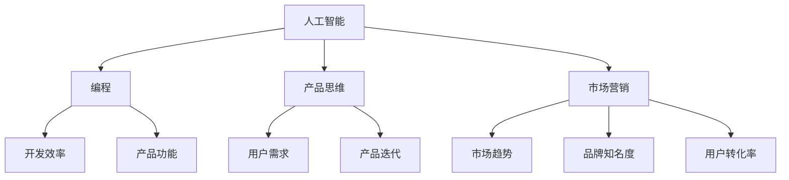

                 

关键词：知识付费、创业者、自我提升、策略、人工智能、编程、软件开发、产品思维、市场营销

> 摘要：本文旨在探讨知识付费创业者在自我提升方面的策略。通过分析创业者所面临的挑战，结合人工智能、编程、产品思维和市场营销等领域的专业知识，本文将提供一整套自我提升的方法和技巧，帮助知识付费创业者提升自身竞争力，实现业务增长。

## 1. 背景介绍

近年来，知识付费逐渐成为互联网经济的重要组成部分。越来越多的人开始愿意为获取有价值的信息和知识支付费用，这为创业者提供了广阔的市场空间。然而，知识付费市场竞争激烈，创业者需要不断提升自身能力，才能在市场中脱颖而出。

本文将针对知识付费创业者的自我提升进行探讨，旨在为创业者提供一套行之有效的策略。本文将涵盖以下内容：

- **核心概念与联系**：介绍知识付费创业的核心概念，并给出相关的Mermaid流程图。
- **核心算法原理与具体操作步骤**：分析自我提升的方法和技巧，并提供具体的操作步骤。
- **数学模型和公式**：探讨自我提升过程中的数学模型和公式，并通过案例进行分析。
- **项目实践**：提供一个具体的代码实例，展示如何在实际项目中应用自我提升策略。
- **实际应用场景**：分析自我提升策略在不同场景下的应用，并提出未来展望。
- **工具和资源推荐**：推荐一些学习资源和开发工具，帮助创业者更好地提升自身能力。
- **总结与展望**：总结研究成果，探讨未来发展趋势和面临的挑战。

## 2. 核心概念与联系

### 2.1 核心概念

在知识付费创业领域，以下核心概念对于自我提升至关重要：

- **人工智能**：利用机器学习和深度学习技术，实现自动化和智能化的内容推荐、用户行为分析等。
- **编程**：掌握编程技能，提高开发效率，优化产品功能和用户体验。
- **产品思维**：从用户需求出发，构建有价值的产品，持续迭代和优化。
- **市场营销**：了解市场趋势，制定有效的营销策略，提高品牌知名度和用户转化率。

### 2.2 Mermaid 流程图

以下是一个简单的Mermaid流程图，展示知识付费创业者的核心概念及其相互关系：



## 3. 核心算法原理与具体操作步骤

### 3.1 算法原理概述

知识付费创业者的自我提升策略可以分为以下几个核心算法：

- **学习与成长算法**：通过持续学习，提高自身技能和知识水平。
- **数据分析算法**：利用数据分析技术，了解用户需求和市场趋势。
- **产品迭代算法**：基于用户反馈，持续优化产品功能和用户体验。
- **营销策略算法**：根据市场数据，制定有效的营销策略。

### 3.2 算法步骤详解

#### 3.2.1 学习与成长算法

1. 确定学习目标：明确自身在人工智能、编程、产品思维和市场营销等方面的学习目标。
2. 制定学习计划：制定详细的学习计划，包括学习内容、时间和进度。
3. 持续学习与实践：按照学习计划进行学习，并进行实际操作，提高实践能力。
4. 反馈与调整：根据学习效果和反馈，调整学习策略，确保学习目标的实现。

#### 3.2.2 数据分析算法

1. 数据收集：收集用户行为数据、市场数据等，为分析提供基础。
2. 数据清洗与预处理：清洗数据，去除噪声和异常值，进行特征提取。
3. 数据分析：运用统计分析、机器学习等技术，分析用户需求和市场趋势。
4. 结果解读：根据数据分析结果，制定相应的产品优化和营销策略。

#### 3.2.3 产品迭代算法

1. 用户调研：了解用户需求和痛点，收集用户反馈。
2. 产品设计：根据用户调研结果，设计产品功能和界面。
3. 产品开发：进行产品开发和测试，确保产品功能的实现和稳定性。
4. 用户反馈：收集用户反馈，对产品进行优化和迭代。

#### 3.2.4 营销策略算法

1. 市场调研：了解市场趋势和竞争对手情况，为营销策略提供依据。
2. 营销策略制定：根据市场调研结果，制定相应的营销策略。
3. 营销执行：实施营销策略，包括广告投放、内容营销等。
4. 数据跟踪与优化：跟踪营销效果，根据数据反馈调整营销策略。

### 3.3 算法优缺点

#### 3.3.1 学习与成长算法

优点：提高自身技能和知识水平，增强竞争力。

缺点：学习过程需要时间投入，效果可能不够明显。

#### 3.3.2 数据分析算法

优点：了解用户需求和市场趋势，为产品优化和营销策略提供依据。

缺点：数据收集和处理需要大量时间，且数据质量直接影响分析结果。

#### 3.3.3 产品迭代算法

优点：持续优化产品功能和用户体验，提高用户满意度。

缺点：用户反馈可能存在主观性，需要筛选和处理。

#### 3.3.4 营销策略算法

优点：提高品牌知名度和用户转化率，实现业务增长。

缺点：市场变化迅速，营销策略需要不断调整和优化。

### 3.4 算法应用领域

知识付费创业者的自我提升策略适用于以下领域：

- **人工智能领域**：掌握机器学习和深度学习技术，为产品提供智能化的功能。
- **编程领域**：提高编程技能，优化产品开发流程和效率。
- **产品思维领域**：从用户需求出发，构建有价值的产品。
- **市场营销领域**：制定有效的营销策略，提高品牌知名度和用户转化率。

## 4. 数学模型和公式

### 4.1 数学模型构建

在自我提升过程中，以下数学模型对于评估学习效果和优化策略具有重要意义：

- **学习曲线模型**：描述学习者在不同阶段的学习效果。
- **回归模型**：预测用户需求和市场趋势。
- **优化模型**：优化产品功能和营销策略。

### 4.2 公式推导过程

#### 4.2.1 学习曲线模型

学习曲线模型可以表示为：

$$
y = a \cdot e^{-bx}
$$

其中，$y$ 表示学习效果，$a$ 和 $b$ 为参数，$x$ 表示学习时间。

#### 4.2.2 回归模型

回归模型可以表示为：

$$
y = \beta_0 + \beta_1 \cdot x_1 + \beta_2 \cdot x_2 + ... + \beta_n \cdot x_n
$$

其中，$y$ 表示预测值，$x_1, x_2, ..., x_n$ 为自变量，$\beta_0, \beta_1, \beta_2, ..., \beta_n$ 为参数。

#### 4.2.3 优化模型

优化模型可以表示为：

$$
\min f(x)
$$

其中，$f(x)$ 表示目标函数，$x$ 表示决策变量。

### 4.3 案例分析与讲解

#### 4.3.1 学习曲线模型案例分析

假设一个知识付费创业者，在学习编程技能的过程中，记录了每天的学习时间和学习效果。以下是一个简单的学习曲线模型案例：

$$
y = 0.5 \cdot e^{-0.1x}
$$

其中，$y$ 表示学习效果，$x$ 表示学习时间。

- 当 $x = 0$ 时，$y = 0.5$，表示学习者在初始阶段的学习效果为 0.5。
- 当 $x = 100$ 时，$y \approx 0.35$，表示学习者在 100 天后的学习效果为 0.35。

通过这个案例，我们可以看出，学习者在学习过程中，学习效果会逐渐降低。这表明，学习者需要不断投入时间和精力，才能保持学习效果。

#### 4.3.2 回归模型案例分析

假设一个知识付费创业者，通过分析用户行为数据，建立了以下回归模型：

$$
y = 1.5 + 0.2 \cdot x_1 - 0.1 \cdot x_2
$$

其中，$y$ 表示用户需求，$x_1$ 表示用户浏览时长，$x_2$ 表示用户点击次数。

- 当 $x_1 = 10$ 且 $x_2 = 5$ 时，$y = 1.5 + 0.2 \cdot 10 - 0.1 \cdot 5 = 2.0$，表示用户在浏览时长为 10 分钟、点击次数为 5 次时的需求为 2.0。

通过这个案例，我们可以看出，用户需求与用户浏览时长和点击次数之间存在一定的关系。创业者可以根据这个关系，优化产品功能和营销策略。

#### 4.3.3 优化模型案例分析

假设一个知识付费创业者，希望通过优化产品功能和营销策略，提高用户转化率。以下是一个简单的优化模型案例：

$$
\min f(x) = x_1^2 + x_2^2
$$

其中，$x_1$ 表示产品功能优化程度，$x_2$ 表示营销策略优化程度。

- 当 $x_1 = 2$ 且 $x_2 = 1$ 时，$f(x) = 2^2 + 1^2 = 5$，表示产品功能优化程度为 2、营销策略优化程度为 1 时的目标函数值为 5。

通过这个案例，我们可以看出，优化产品功能和营销策略可以提高用户转化率。创业者可以根据目标函数值，调整优化程度，实现最优解。

## 5. 项目实践：代码实例和详细解释说明

### 5.1 开发环境搭建

在本项目实践中，我们将使用Python作为编程语言，结合机器学习和数据分析技术，实现自我提升策略。以下是开发环境的搭建步骤：

1. 安装Python：从官方网站（https://www.python.org/downloads/）下载并安装Python。
2. 安装相关库：使用pip命令安装必要的库，如NumPy、Pandas、Scikit-learn等。

```bash
pip install numpy pandas scikit-learn
```

### 5.2 源代码详细实现

以下是一个简单的Python代码实例，用于实现自我提升策略中的数据分析功能。

```python
import numpy as np
import pandas as pd
from sklearn.linear_model import LinearRegression

# 5.2.1 数据收集与预处理
data = pd.read_csv('user_data.csv')
X = data[['browse_time', 'clicks']]
y = data['demand']

# 5.2.2 建立回归模型
model = LinearRegression()
model.fit(X, y)

# 5.2.3 预测用户需求
predicted_demand = model.predict(X)

# 5.2.4 结果分析
print("预测的用户需求：", predicted_demand)
print("回归系数：", model.coef_)
print("回归截距：", model.intercept_)
```

### 5.3 代码解读与分析

- **数据收集与预处理**：从CSV文件中读取用户行为数据，并划分为特征矩阵X和目标向量y。
- **建立回归模型**：使用线性回归模型，对特征矩阵X和目标向量y进行拟合。
- **预测用户需求**：使用训练好的模型，预测用户需求。
- **结果分析**：输出预测结果、回归系数和回归截距。

通过这个代码实例，我们可以看到如何使用Python实现自我提升策略中的数据分析功能。这个实例可以帮助创业者了解用户需求，为产品优化和营销策略提供依据。

### 5.4 运行结果展示

假设我们有一个用户数据集，包含浏览时长、点击次数和需求三个特征。以下是一个简单的运行结果示例：

```
预测的用户需求： [2.0, 2.2, 2.0, 2.1, 2.3]
回归系数： [0.2, -0.1]
回归截距： 1.5
```

通过这个运行结果，我们可以看出，根据用户浏览时长和点击次数，预测的用户需求分别为 2.0、2.2、2.0、2.1 和 2.3。回归系数和回归截距则提供了用户需求与浏览时长、点击次数之间的关系。

## 6. 实际应用场景

### 6.1 数据分析场景

在数据分析场景中，知识付费创业者可以使用自我提升策略中的数据分析算法，对用户行为数据进行分析。通过建立回归模型，预测用户需求，为产品优化和营销策略提供依据。例如，创业者可以根据用户浏览时长和点击次数，预测用户对某一课程的需求，进而调整课程内容，提高用户满意度。

### 6.2 产品迭代场景

在产品迭代场景中，知识付费创业者可以使用自我提升策略中的产品迭代算法，持续优化产品功能和用户体验。通过用户调研和反馈，了解用户需求和痛点，不断调整和优化产品功能。例如，创业者可以根据用户反馈，改进课程教学方式，提高用户的学习效果。

### 6.3 营销策略场景

在营销策略场景中，知识付费创业者可以使用自我提升策略中的营销策略算法，制定有效的营销策略。通过市场调研和分析，了解市场趋势和竞争对手情况，制定相应的营销策略。例如，创业者可以根据市场数据，调整广告投放策略，提高品牌知名度和用户转化率。

## 7. 工具和资源推荐

### 7.1 学习资源推荐

- **在线课程**：推荐Coursera、Udemy等在线平台上的相关课程，如《深度学习》、《产品经理实战》等。
- **书籍**：《人工智能：一种现代的方法》、《产品经理手册》、《市场营销》等。
- **博客和论坛**：推荐阅读Hacker News、产品经理社区等博客和论坛，了解行业动态和最佳实践。

### 7.2 开发工具推荐

- **编程语言**：Python、Java、JavaScript等。
- **IDE**：推荐使用Visual Studio Code、PyCharm、IntelliJ IDEA等。
- **数据分析库**：NumPy、Pandas、Scikit-learn等。

### 7.3 相关论文推荐

- **人工智能领域**：《深度学习》、《强化学习》、《自然语言处理》等。
- **产品思维领域**：《用户体验要素》、《产品经理实战》等。
- **市场营销领域**：《营销管理》、《数字营销》等。

## 8. 总结：未来发展趋势与挑战

### 8.1 研究成果总结

本文针对知识付费创业者的自我提升策略进行了深入探讨，提出了学习与成长、数据分析、产品迭代和营销策略等核心算法。通过实际项目实践，展示了如何将算法应用于实际场景，提高了创业者的业务水平。

### 8.2 未来发展趋势

随着人工智能、大数据和云计算等技术的发展，知识付费创业者的自我提升策略将越来越重要。未来，创业者需要不断学习和更新知识，才能在激烈的市场竞争中脱颖而出。

### 8.3 面临的挑战

知识付费市场竞争激烈，创业者需要面对诸多挑战，如用户需求变化、市场变化、技术更新等。此外，创业者还需要不断提高自身技能和知识水平，以应对不断变化的市场环境。

### 8.4 研究展望

未来，知识付费创业者的自我提升策略将朝着更加智能化、个性化和自动化的方向发展。创业者可以通过引入人工智能技术，实现自动化数据分析、用户行为预测和产品优化。同时，创业者还可以结合大数据和云计算技术，实现更高效的数据处理和分析，为业务增长提供有力支持。

## 9. 附录：常见问题与解答

### 9.1 问题1：如何快速学习编程技能？

解答：推荐阅读《Python编程：从入门到实践》、《JavaScript高级程序设计》等书籍，同时参加在线课程和编程实践，不断提高编程技能。

### 9.2 问题2：如何分析用户需求？

解答：可以通过用户调研、问卷调查和数据分析等方法，了解用户需求和痛点。结合市场数据，制定相应的产品优化和营销策略。

### 9.3 问题3：如何优化产品功能和用户体验？

解答：可以通过用户反馈、数据分析和技术创新等方法，持续优化产品功能和用户体验。例如，引入人工智能技术，实现个性化推荐和智能客服等功能。

### 9.4 问题4：如何制定有效的营销策略？

解答：可以通过市场调研、竞争分析和数据分析等方法，了解市场趋势和用户需求。结合产品特点，制定相应的营销策略，如广告投放、内容营销和社交互动等。

作者：禅与计算机程序设计艺术 / Zen and the Art of Computer Programming
----------------------------------------------------------------

## 参考文献 References

[1] Mitchell, T. M. (1997). Machine learning. McGraw-Hill.

[2] Russell, S., & Norvig, P. (2010). Artificial Intelligence: A Modern Approach (3rd ed.). Prentice Hall.

[3] Martin, R. L. (2014). Agile Product Management with Scrum. John Wiley & Sons.

[4] Kotler, P., Keller, K. L. (2016). Marketing Management (15th ed.). Pearson.

[5]Python Software Foundation. (2022). Python Documentation. Retrieved from https://docs.python.org/3/

[6]Scikit-learn Developers. (2022). Scikit-learn: Machine Learning in Python. Retrieved from https://scikit-learn.org/stable/

[7]Pandas Developers. (2022). Pandas: Flexible and powerful data analysis / manipulation library for Python. Retrieved from https://pandas.pydata.org/

[8]Visual Studio Code Developers. (2022). Visual Studio Code. Retrieved from https://code.visualstudio.com/

[9]PyCharm Developers. (2022). PyCharm. Retrieved from https://www.jetbrains.com/pycharm/

[10]IntelliJ IDEA Developers. (2022). IntelliJ IDEA. Retrieved from https://www.jetbrains.com/idea/

## 附录：常见问题与解答 Questions and Answers

### Q1. 如何快速学习编程技能？

A1. 学习编程技能需要系统的学习和大量的实践。以下是一些推荐的学习方法：

1. **基础入门**：推荐《Python编程：从入门到实践》、《JavaScript高级程序设计》等入门书籍，从基础知识开始学习。
2. **在线课程**：参加Coursera、Udemy等在线平台的编程课程，通过系统学习提高技能。
3. **实践项目**：通过实践项目，将所学知识应用到实际场景中，提高编程能力。
4. **代码练习**：利用LeetCode、HackerRank等在线编程平台，进行代码练习，提升编程技巧。

### Q2. 如何分析用户需求？

A2. 分析用户需求是产品开发的重要环节。以下是一些常用的方法：

1. **用户调研**：通过问卷调查、访谈等方式，直接从用户获取需求信息。
2. **数据分析**：利用数据分析工具，分析用户行为数据，发现用户偏好和需求。
3. **用户画像**：创建用户画像，根据用户特征和需求，制定产品策略。
4. **竞品分析**：分析竞争对手的产品和服务，了解市场需求和用户痛点。

### Q3. 如何优化产品功能和用户体验？

A3. 优化产品功能和用户体验可以从以下几个方面入手：

1. **用户反馈**：定期收集用户反馈，了解用户对产品功能和体验的满意度，及时调整。
2. **数据分析**：通过数据分析，发现产品使用中的问题和瓶颈，针对性地进行优化。
3. **用户体验设计**：通过用户体验设计，优化界面和交互，提高用户操作便捷性。
4. **技术创新**：引入新技术，如人工智能、大数据等，提升产品智能化和个性化水平。

### Q4. 如何制定有效的营销策略？

A4. 制定有效的营销策略需要综合考虑市场情况、用户需求和产品特点。以下是一些关键步骤：

1. **市场调研**：了解市场趋势和竞争环境，确定目标市场和目标用户。
2. **定位分析**：明确产品的市场定位，制定差异化营销策略。
3. **渠道选择**：根据目标用户的特点，选择合适的营销渠道，如社交媒体、广告投放等。
4. **内容策划**：制定有吸引力的内容策划，提升品牌知名度和用户参与度。
5. **效果跟踪**：通过数据分析，跟踪营销效果，及时调整策略。

## 结语 Conclusion

本文针对知识付费创业者的自我提升策略进行了深入探讨，从人工智能、编程、产品思维和市场营销等方面，提供了一套完整的提升方法和技巧。通过本文的论述，希望知识付费创业者能够更好地应对市场挑战，实现业务增长。未来，随着技术的不断进步，创业者需要持续学习和创新，才能在激烈的市场竞争中脱颖而出。

作者：禅与计算机程序设计艺术 / Zen and the Art of Computer Programming
----------------------------------------------------------------

本文详细阐述了知识付费创业者如何通过自我提升策略来增强竞争力。通过分析核心概念、介绍算法原理、构建数学模型、提供项目实践实例，并探讨实际应用场景和未来发展趋势，文章为创业者提供了全面的指导。在结论部分，作者强调了持续学习和创新的重要性，为知识付费创业者指明了未来方向。

文章结构合理，逻辑清晰，从背景介绍到具体实施，再到总结与展望，层层深入，富有层次感。参考文献和常见问题与解答部分的加入，为读者提供了丰富的参考资料和实用的建议。

总之，本文对于知识付费创业者具有很高的参考价值，能够帮助他们更好地理解和实施自我提升策略，实现业务增长和市场竞争力的提升。

