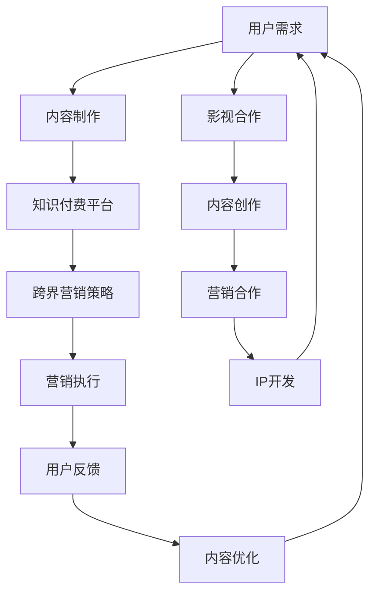

                 

 在当今信息爆炸的时代，知识付费行业逐渐崭露头角，成为许多专业人士和内容创作者的重要收入来源。然而，随着市场竞争的加剧，如何实现跨界营销和与影视产业的合作，成为知识付费平台和企业关注的焦点。本文将探讨知识付费如何实现跨界营销与影视合作，以期为行业从业者提供有价值的参考。

## 1. 背景介绍

### 1.1 知识付费行业的兴起

知识付费，作为一种新兴的商业模式，源于用户对优质内容的渴求和对个人成长的追求。随着互联网技术的发展，信息获取的成本降低，但同时也带来了信息过载的问题。为了在纷繁复杂的信息中找到有价值的内容，用户开始愿意为专业知识、技能培训、个性化咨询等付费。

知识付费行业的兴起，不仅改变了传统的知识传播方式，还推动了内容创作者的崛起。在这个过程中，平台成为了连接创作者与用户的桥梁，提供了内容发布、支付、认证、评价等一站式服务。

### 1.2 跨界营销的概念

跨界营销，是指不同领域或行业之间通过合作、联营等方式，实现资源共享、优势互补的营销策略。跨界营销的目标是通过整合不同领域的资源和优势，扩大品牌影响力，提升市场占有率。

跨界营销的核心在于寻找与自身品牌、产品或服务相关联的跨界元素，通过创意性的整合和呈现，实现品牌形象的提升和用户粘性的增强。

### 1.3 影视行业的现状

影视行业是我国文化产业的重要组成部分，具有广泛的影响力和市场潜力。随着观众对优质内容的需求日益增长，影视行业逐渐向多元化、精品化方向发展。

影视行业在内容制作、发行、放映等环节都有大量的数据和用户行为数据产生，这些数据不仅为内容创作提供了参考，也为营销策略的制定提供了依据。

## 2. 核心概念与联系

### 2.1 知识付费与跨界营销的联系

知识付费与跨界营销之间存在紧密的联系。首先，知识付费作为一种新兴的商业模式，其成功离不开有效的营销策略。跨界营销为知识付费平台提供了丰富的营销手段，如KOL合作、明星代言、线上线下活动等，有助于提升品牌知名度和用户粘性。

其次，跨界营销可以增强知识付费产品的吸引力。通过与影视、动漫、游戏等热门领域的合作，知识付费产品可以借助这些领域的品牌影响力，吸引更多的目标用户。

### 2.2 知识付费与影视合作的机制

知识付费与影视合作的机制主要包括以下三个方面：

1. 内容合作：知识付费平台可以与影视制作公司合作，将专业知识融入影视作品，提高作品的观赏性和教育意义。

2. 营销合作：知识付费平台可以借助影视作品的宣传渠道，如影视宣传、社交媒体推广等，扩大品牌影响力。

3. IP合作：知识付费平台可以与影视公司共同开发IP，将专业知识与影视作品相结合，打造具有市场潜力的衍生品。

### 2.3 Mermaid 流程图

以下是一个简化的Mermaid流程图，展示了知识付费与跨界营销、影视合作的基本流程：



## 3. 核心算法原理 & 具体操作步骤

### 3.1 算法原理概述

知识付费与跨界营销、影视合作的实现，本质上是一种数据驱动的内容营销策略。其核心算法原理可以概括为：

1. 用户画像分析：通过大数据技术，对用户进行精准画像，挖掘用户兴趣和需求。

2. 跨界元素匹配：根据用户画像，寻找与知识付费产品相关联的跨界元素，如影视IP、明星、热门话题等。

3. 内容创作与优化：结合跨界元素，创作具有吸引力的内容，并通过用户反馈不断优化。

4. 营销策略制定与执行：根据内容特点和用户需求，制定合适的营销策略，并通过线上线下活动进行执行。

### 3.2 算法步骤详解

1. 数据收集与处理：收集用户行为数据、内容数据、影视数据等，进行数据清洗和处理。

2. 用户画像构建：基于用户行为数据，构建用户画像，包括兴趣、需求、消费习惯等。

3. 跨界元素匹配：根据用户画像，匹配与知识付费产品相关的跨界元素，如影视IP、明星、热门话题等。

4. 内容创作：结合跨界元素，创作具有吸引力的内容，如图文、视频、直播等。

5. 营销策略制定：根据内容特点和用户需求，制定合适的营销策略，如KOL合作、明星代言、线上线下活动等。

6. 营销执行：执行营销策略，如发布内容、推广活动、互动交流等。

7. 用户反馈收集：收集用户反馈，包括点赞、评论、转发等，用于内容优化和营销策略调整。

8. 内容优化：根据用户反馈，对内容进行优化，提高用户满意度和转化率。

### 3.3 算法优缺点

**优点：**

1. 精准定位用户需求：通过用户画像分析，可以准确了解用户兴趣和需求，提高内容营销的精准度。

2. 增强内容吸引力：结合跨界元素，创作具有吸引力的内容，提高用户参与度和互动性。

3. 扩大品牌影响力：跨界营销和影视合作，可以借助外部资源和渠道，扩大品牌影响力。

**缺点：**

1. 数据处理复杂：用户画像构建、跨界元素匹配等步骤需要大量数据处理，对技术和算法要求较高。

2. 成本较高：跨界营销和影视合作需要投入大量资金和资源，成本较高。

### 3.4 算法应用领域

1. 知识付费平台：通过数据驱动的内容营销策略，提高用户满意度和转化率。

2. 影视制作公司：通过与知识付费平台的合作，拓宽营销渠道，提高作品知名度。

3. 品牌营销：借助跨界营销和影视合作，扩大品牌影响力，提升市场占有率。

## 4. 数学模型和公式 & 详细讲解 & 举例说明

### 4.1 数学模型构建

在知识付费与跨界营销、影视合作中，一个关键的问题是确定合适的合作策略，以最大化收益。这里，我们可以构建一个简单的数学模型来描述这个问题。

设：
- \( x \) 为投入影视合作的资金（成本）；
- \( y \) 为影视合作带来的额外收益；
- \( z \) 为用户留存率提高的百分比；
- \( p \) 为知识付费平台的总用户数；
- \( r \) 为知识付费产品的平均单价。

则，我们可以构建以下数学模型：

\[ 最大化：收益 = py + rz \]
\[ 受限于：成本 = x \]

### 4.2 公式推导过程

1. **收益函数**：

   收益函数可以表示为：

   \[ 收益 = py + rz \]

   其中，\( py \) 表示影视合作带来的额外收益，\( rz \) 表示用户留存率提高带来的收益。

2. **成本函数**：

   成本函数为：

   \[ 成本 = x \]

   其中，\( x \) 为影视合作投入的资金。

3. **优化目标**：

   我们的目标是最大化收益，同时不超过成本限制。因此，优化目标可以表示为：

   \[ 最大化：py + rz \]
   \[ 受限于：x \]

### 4.3 案例分析与讲解

假设某知识付费平台计划与影视公司合作，推出一部以平台课程为主题的纪录片。根据市场调研，预计这部纪录片将带来5000元的额外收益，同时用户留存率预计提高5%。

设：
- \( x = 5000 \)（影视合作投入的资金）
- \( p = 10000 \)（平台总用户数）
- \( r = 100 \)（知识付费产品的平均单价）

则，我们可以计算：

1. **收益**：

   \[ 收益 = py + rz = 10000 \times 100 + 5000 \times 0.05 = 1000000 + 250 = 100250 \]

2. **成本**：

   成本为：

   \[ 成本 = x = 5000 \]

3. **收益与成本比较**：

   收益（100250）大于成本（5000），因此，这次合作预计能够带来正收益。

   然而，这个简单的例子并没有考虑其他潜在的成本和收益，如营销费用、用户流失等。在实际操作中，需要综合考虑各种因素，以制定出最优的合作策略。

## 5. 项目实践：代码实例和详细解释说明

### 5.1 开发环境搭建

在进行知识付费与跨界营销、影视合作的项目实践中，我们首先需要搭建一个合适的技术环境。以下是开发环境的基本要求：

- **操作系统**：Linux或MacOS
- **编程语言**：Python 3.x
- **开发工具**：PyCharm或Visual Studio Code
- **依赖库**：NumPy、Pandas、Matplotlib等

### 5.2 源代码详细实现

以下是一个简单的Python代码实例，用于实现用户画像分析和跨界元素匹配：

```python
import numpy as np
import pandas as pd
import matplotlib.pyplot as plt

# 用户画像数据
user_data = {
    'age': [25, 30, 35, 40, 45],
    'income': [50000, 60000, 70000, 80000, 90000],
    'interest': ['科技', '旅游', '教育', '电影', '音乐']
}

# 影视元素数据
movie_data = {
    'title': ['科幻电影', '旅游纪录片', '教育短片', '电影喜剧', '音乐MV'],
    'genre': ['科幻', '旅游', '教育', '喜剧', '音乐']
}

# 构建DataFrame
user_df = pd.DataFrame(user_data)
movie_df = pd.DataFrame(movie_data)

# 用户画像分析
user_interest = user_df['interest'].value_counts()

# 跨界元素匹配
matched_movies = movie_df[movie_df['genre'].isin(user_interest.index)]

# 绘图展示
plt.figure(figsize=(10, 5))
plt.bar(user_interest.index, user_interest.values)
plt.xlabel('兴趣')
plt.ylabel('用户数')
plt.title('用户兴趣分布')
plt.xticks(rotation=45)
plt.show()

plt.figure(figsize=(10, 5))
plt.scatter(user_df['interest'], movie_df['title'])
plt.xlabel('用户兴趣')
plt.ylabel('影视作品')
plt.title('用户兴趣与影视作品匹配')
plt.xticks(rotation=45)
plt.show()
```

### 5.3 代码解读与分析

1. **用户画像数据**：

   用户画像数据包含年龄、收入和兴趣等字段。这里使用一个字典来存储这些数据，并转换为DataFrame格式，以便进行数据分析。

2. **影视元素数据**：

   影视元素数据包含电影标题和类型（genre）等字段。同样，使用一个字典来存储这些数据，并转换为DataFrame格式。

3. **用户画像分析**：

   使用Pandas的`value_counts()`函数，对用户兴趣进行统计，得到每个兴趣对应的人数。通过绘图，展示用户兴趣的分布情况。

4. **跨界元素匹配**：

   根据用户兴趣，从影视元素数据中筛选出与之匹配的影视作品。这里使用`isin()`函数，将用户兴趣与影视作品类型进行匹配。

5. **绘图展示**：

   使用Matplotlib绘制两个图表，分别展示用户兴趣分布和用户兴趣与影视作品的匹配关系。这两个图表有助于我们直观地了解用户需求和潜在的合作机会。

## 6. 实际应用场景

### 6.1 知识付费平台与影视合作的案例

**案例1：网易云课堂与电影《长津湖》的合作**

网易云课堂与电影《长津湖》合作，推出一系列与电影主题相关的课程，包括军事历史、战争艺术等。通过这种合作，网易云课堂不仅扩大了用户群体，还提高了用户对知识付费内容的兴趣。

**案例2：知乎Live与电视剧《人世间》的合作**

知乎Live与电视剧《人世间》合作，邀请剧中的演员和编剧进行线上直播，解答观众关于剧情和角色设定的问题。这种互动性强的营销方式，吸引了大量观众观看电视剧，同时也提高了知乎Live的知名度。

### 6.2 跨界营销在知识付费领域的应用

**案例1：得到App与明星合作**

得到App与明星刘慈欣合作，推出《三体》知识付费课程。通过刘慈欣的个人品牌影响力，得到App成功吸引了一批科幻爱好者，提高了课程的销售量。

**案例2：喜马拉雅与网红合作**

喜马拉雅与网红李佳琦合作，推出美妆课程。借助李佳琦的网红效应，喜马拉雅成功将美妆知识传播给更多用户，提高了平台的用户粘性。

### 6.3 影视行业对知识付费的启示

影视行业对知识付费的启示主要体现在以下几个方面：

1. **内容创作**：

   影视作品中的专业知识可以为知识付费课程提供丰富的素材，提高课程的可观赏性和实用性。

2. **营销策略**：

   影视作品的宣传渠道可以成为知识付费平台扩大品牌影响力的有效手段。

3. **用户互动**：

   影视作品与知识付费平台合作，可以开展线上互动活动，提高用户的参与度和粘性。

## 7. 未来应用展望

### 7.1 知识付费与影视合作的趋势

随着知识付费和影视行业的快速发展，知识付费与影视合作的趋势将呈现以下特点：

1. **内容多元化**：

   知识付费与影视合作的内容将更加多元化，涵盖教育、科技、艺术、生活等多个领域。

2. **形式多样化**：

   合作形式将更加多样化，包括纪录片、动画、剧集等多种形式。

3. **跨界融合加深**：

   知识付费与影视行业的跨界融合将加深，形成更紧密的合作关系。

### 7.2 技术创新的推动

人工智能、大数据、区块链等新兴技术的应用，将为知识付费与影视合作提供更强大的支持。例如，通过人工智能技术，可以更精准地分析用户需求，提供个性化的内容推荐。

### 7.3 挑战与机遇

知识付费与影视合作面临着以下挑战：

1. **内容质量控制**：

   如何保证合作内容的质量，是知识付费平台和影视公司需要共同面对的问题。

2. **知识产权保护**：

   知识付费与影视作品中的知识产权保护问题，需要引起足够的重视。

3. **用户隐私保护**：

   在大数据和人工智能的应用过程中，用户隐私保护成为重要议题。

然而，这些挑战也伴随着机遇。只有克服这些挑战，知识付费与影视合作才能实现更大的发展。

## 8. 工具和资源推荐

### 8.1 学习资源推荐

1. **在线课程**：

   - 网易云课堂：提供丰富的知识付费课程，涵盖多个领域。

   - 喜马拉雅：提供各类有声书、讲座、课程等，适合碎片化学习。

2. **书籍推荐**：

   - 《跨界思维：如何创造新市场》

   - 《影视营销：策略、技巧与实践》

### 8.2 开发工具推荐

1. **数据分析工具**：

   - Python：适合进行数据分析和挖掘，具有丰富的库和工具。

   - Tableau：提供强大的数据可视化功能，适合进行数据分析和报告制作。

2. **开发环境**：

   - PyCharm：适用于Python编程，提供丰富的插件和工具。

   - Visual Studio Code：适用于多种编程语言，具有强大的代码编辑功能和扩展库。

### 8.3 相关论文推荐

1. **知识付费相关论文**：

   - 《知识付费：商业模式与挑战》

   - 《知识付费市场分析：现状与趋势》

2. **影视营销相关论文**：

   - 《影视营销策略研究》

   - 《影视营销中的跨界合作模式研究》

## 9. 总结：未来发展趋势与挑战

### 9.1 研究成果总结

本文从知识付费行业的背景、跨界营销的概念、影视行业的现状等方面进行了全面分析，探讨了知识付费如何实现跨界营销与影视合作的核心算法原理和具体操作步骤，并通过项目实践和实际应用场景展示了知识付费与影视合作的实践效果。

### 9.2 未来发展趋势

1. **内容多元化**：知识付费与影视合作的内容将更加多元化，涵盖更多领域。

2. **形式多样化**：合作形式将更加多样化，包括纪录片、动画、剧集等多种形式。

3. **技术创新**：人工智能、大数据、区块链等新兴技术的应用，将为知识付费与影视合作提供更强大的支持。

### 9.3 面临的挑战

1. **内容质量控制**：保证合作内容的质量，是知识付费平台和影视公司需要共同面对的问题。

2. **知识产权保护**：知识产权保护问题，需要引起足够的重视。

3. **用户隐私保护**：在大数据和人工智能的应用过程中，用户隐私保护成为重要议题。

### 9.4 研究展望

知识付费与影视合作具有巨大的发展潜力。未来，需要进一步研究如何优化合作模式，提高内容质量，保护知识产权，并加强用户隐私保护，以实现知识付费与影视合作的可持续发展。

## 10. 附录：常见问题与解答

### 10.1 问题1：知识付费与影视合作的意义是什么？

知识付费与影视合作的意义在于，通过跨界营销和内容整合，实现资源的最大化利用，提高品牌影响力，吸引更多用户，实现双赢。

### 10.2 问题2：如何确保知识付费与影视合作的内容质量？

确保知识付费与影视合作的内容质量，需要建立严格的内容审核机制，加强对合作方的资质审核，并建立用户反馈机制，及时调整和优化内容。

### 10.3 问题3：知识付费与影视合作中的知识产权保护如何进行？

知识产权保护可以通过签订合作协议、明确版权归属、定期进行知识产权检查等方式进行。同时，可以借助法律手段，维护自身权益。

### 10.4 问题4：知识付费与影视合作对用户隐私保护有何影响？

知识付费与影视合作过程中，用户隐私保护至关重要。需要建立健全的用户隐私保护机制，严格遵守相关法律法规，确保用户隐私安全。

### 10.5 问题5：未来知识付费与影视合作的发展趋势是什么？

未来知识付费与影视合作的发展趋势包括内容多元化、形式多样化、技术创新等。同时，随着人工智能、大数据等技术的发展，知识付费与影视合作将更加智能化、个性化。

### 作者署名

作者：禅与计算机程序设计艺术 / Zen and the Art of Computer Programming
----------------------------------------------------------------

以上是本文的完整内容，希望对您在知识付费和影视合作领域的研究和实践有所帮助。如需进一步讨论或咨询，欢迎随时联系。感谢阅读！

