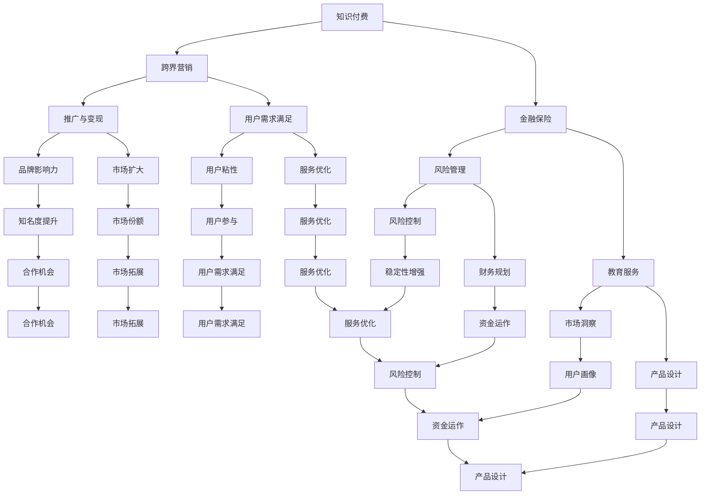

                 

## 1. 背景介绍

知识付费作为近年来兴起的一种新型商业模式，通过为用户提供高质量、有价值的信息和服务，满足了用户对知识的渴求。然而，随着市场竞争的加剧和用户需求的多样化，知识付费企业如何实现跨界营销，成为了一个亟待解决的问题。同时，金融保险行业也在积极探索与知识付费的跨界合作，以拓宽业务范围，提高市场竞争力。

在这个背景下，本文旨在探讨知识付费如何通过跨界营销与金融保险行业实现融合发展，从而提升企业的市场地位和盈利能力。文章将首先介绍知识付费的基本概念和现状，分析其面临的挑战；接着，我们将探讨跨界营销的概念和重要性，并分析知识付费行业可以采用的跨界营销策略；随后，我们将探讨金融保险与知识付费跨界合作的潜在领域和具体案例；最后，我们将总结知识付费跨界营销和金融保险跨界合作的发展趋势，并提出相应的建议。

本文的写作目的在于为知识付费和金融保险行业的从业者提供有价值的参考，帮助他们更好地理解跨界营销和跨界合作的原理和策略，从而在实践中取得更好的效果。

## 2. 核心概念与联系

在探讨知识付费如何实现跨界营销与金融保险跨界之前，我们需要明确几个关键概念，并了解它们之间的联系。

### 2.1 知识付费

知识付费是指用户为获取高质量、有价值的信息和服务而支付的费用。这种模式的核心在于用户愿意为知识买单，从而推动内容生产者和知识服务商的发展。知识付费的形式多样，包括在线课程、电子书、专栏、讲座、咨询服务等。

### 2.2 跨界营销

跨界营销是指企业通过与其他行业、品牌或平台的合作，实现资源的共享和优势互补，从而扩大市场份额和品牌影响力。跨界营销的核心在于寻找具有互补性和合作潜力的合作伙伴，通过创意和创新的营销手段，实现双赢。

### 2.3 金融保险

金融保险是指通过金融手段为用户提供风险管理服务，包括保险、投资、理财等。金融保险行业具有风险控制、资金运作和市场稳定性等特点，是现代经济体系中不可或缺的一部分。

### 2.4 知识付费与跨界营销的联系

知识付费与跨界营销之间存在紧密的联系。首先，知识付费本身就是一种跨界，它将传统的教育、出版等行业进行了重新定义，赋予了新的生命力和价值。其次，跨界营销为知识付费提供了更多的推广和变现途径，使企业能够更好地满足用户需求，提高用户粘性。例如，知识付费平台可以与电商、社交媒体、内容平台等合作，通过联合营销活动、定制课程、广告投放等方式，提升品牌知名度和用户参与度。

### 2.5 金融保险与知识付费的联系

金融保险与知识付费之间的联系主要体现在以下几个方面：

1. **用户需求互补**：知识付费用户通常对金融保险有一定的需求，而金融保险用户也希望通过学习获得更多的理财、投资知识。这种互补性为跨界合作提供了机会。
2. **风险管理和教育**：金融保险行业具有风险管理功能，而知识付费可以为用户提供风险教育和理财知识，帮助用户更好地进行风险管理和财务规划。
3. **数据和信息共享**：知识付费平台拥有大量用户数据，可以为金融保险企业提供有价值的市场洞察和用户画像，从而优化产品设计和服务。

### 2.6 Mermaid 流程图

为了更清晰地展示知识付费、跨界营销和金融保险之间的联系，我们可以使用 Mermaid 流程图来描述它们之间的关系。



通过上述流程图，我们可以更直观地了解知识付费、跨界营销和金融保险之间的联系和互动关系。这种跨界合作不仅有助于企业实现资源共享和优势互补，还可以为用户带来更加丰富和多样化的服务体验。

## 3. 核心算法原理 & 具体操作步骤

### 3.1 算法原理概述

知识付费实现跨界营销与金融保险跨界合作的核心在于构建一种创新的商业模式，使不同领域的资源和需求能够高效对接。这需要一种智能算法来分析用户需求，匹配跨界资源，并提供个性化的推荐和服务。以下是这个算法的基本原理和具体操作步骤。

#### 基本原理

1. **用户画像构建**：通过对用户的行为、兴趣、偏好等数据进行收集和分析，构建详细的用户画像。
2. **需求预测**：利用机器学习算法，对用户未来的需求进行预测，为跨界合作提供依据。
3. **资源匹配**：根据用户需求和跨界合作伙伴的资源特点，进行智能匹配，实现资源的高效利用。
4. **个性化推荐**：根据用户画像和需求预测，为用户提供个性化的推荐和服务，提高用户满意度和参与度。
5. **数据反馈**：收集用户在使用跨界服务后的反馈数据，不断优化算法和推荐系统。

#### 操作步骤

1. **数据收集**：通过大数据技术，收集用户的浏览记录、购买行为、互动数据等，构建用户画像。
    ```mermaid
    graph TD
    A[用户行为数据] --> B[用户画像构建]
    A --> C[需求预测]
    ```

2. **需求预测**：使用机器学习算法，对用户的行为数据进行处理和分析，预测用户未来的需求。
    ```mermaid
    graph TD
    B --> C[机器学习算法]
    C --> D[需求预测结果]
    ```

3. **资源匹配**：根据需求预测结果，匹配相应的跨界资源，实现用户和合作伙伴的智能对接。
    ```mermaid
    graph TD
    D --> E[资源匹配]
    E --> F[跨界合作]
    ```

4. **个性化推荐**：基于用户画像和需求预测结果，为用户提供个性化的推荐和服务，提高用户体验。
    ```mermaid
    graph TD
    F --> G[个性化推荐系统]
    G --> H[用户参与]
    ```

5. **数据反馈**：收集用户在跨界服务中的反馈数据，不断优化算法和推荐系统，提升服务质量。
    ```mermaid
    graph TD
    H --> I[数据反馈]
    I --> J[算法优化]
    ```

### 3.2 算法优缺点

**优点**：

1. **高效性**：通过智能算法和大数据分析，能够快速匹配用户需求和跨界资源，提高服务效率。
2. **个性化**：基于用户画像和需求预测，为用户提供个性化的推荐和服务，提高用户满意度和粘性。
3. **数据驱动**：通过数据反馈和不断优化，实现算法和推荐系统的持续改进，提升服务质量。

**缺点**：

1. **数据隐私**：用户数据收集和分析可能涉及隐私问题，需要确保数据的安全性和合规性。
2. **技术依赖**：算法和系统的构建需要较高的技术门槛，对企业的技术能力要求较高。
3. **实施难度**：涉及多个领域的合作，需要协调不同利益相关方的需求和利益，实施难度较大。

### 3.3 算法应用领域

1. **在线教育**：通过算法为用户提供个性化的学习路径和推荐课程，提高学习效果和用户满意度。
2. **金融保险**：为用户提供个性化的理财、投资建议，帮助用户更好地进行风险管理和财务规划。
3. **电商购物**：为用户提供个性化的购物推荐，提升用户购物体验和转化率。
4. **健康医疗**：为用户提供个性化的健康建议和医疗服务，提高健康管理和生活质量。

通过上述算法原理和操作步骤，我们可以看到，知识付费实现跨界营销与金融保险跨界合作的关键在于构建智能化的推荐和匹配系统，利用大数据和人工智能技术，实现用户需求和跨界资源的精准对接。这不仅有助于提升企业的竞争力，还能为用户带来更加丰富和个性化的服务体验。

## 4. 数学模型和公式 & 详细讲解 & 举例说明

### 4.1 数学模型构建

为了更好地理解知识付费跨界营销与金融保险跨界合作的核心机制，我们引入以下数学模型。该模型基于用户行为数据、需求预测和资源匹配，旨在优化跨界合作的效果。

#### 4.1.1 用户需求函数

用户需求 \( D(u) \) 是用户 \( u \) 对不同类型知识或服务的偏好程度。假设用户 \( u \) 的需求函数可以表示为：

\[ D(u) = f(u, X) \]

其中，\( f(u, X) \) 是用户需求函数，\( X \) 是用户的行为数据集合，包括浏览记录、购买行为、互动数据等。

#### 4.1.2 资源价值函数

资源价值函数 \( V(r) \) 表示跨界合作伙伴 \( r \) 提供的知识或服务对用户的价值。资源价值函数可以表示为：

\[ V(r) = g(r, D(u)) \]

其中，\( g(r, D(u)) \) 是资源价值函数，\( r \) 是合作伙伴，\( D(u) \) 是用户的需求函数。

#### 4.1.3 跨界合作效果函数

跨界合作效果函数 \( E(c) \) 表示跨界合作 \( c \) 的整体效果，包括用户满意度和合作收益。跨界合作效果函数可以表示为：

\[ E(c) = h(D(u), V(r), c) \]

其中，\( h(D(u), V(r), c) \) 是跨界合作效果函数，\( c \) 是跨界合作的具体形式。

### 4.2 公式推导过程

为了推导上述数学模型，我们需要对各个函数进行具体分析。

#### 4.2.1 用户需求函数 \( D(u) \)

用户需求函数 \( D(u) \) 可以通过以下公式推导：

\[ D(u) = \sum_{i=1}^{n} w_i \cdot d_i \]

其中，\( w_i \) 是用户对第 \( i \) 类知识的权重，\( d_i \) 是用户对第 \( i \) 类知识的偏好度。权重 \( w_i \) 可以通过用户的行为数据进行计算，例如，用户对某一类知识的浏览时长、购买频率等。

#### 4.2.2 资源价值函数 \( V(r) \)

资源价值函数 \( V(r) \) 可以通过以下公式推导：

\[ V(r) = \sum_{j=1}^{m} p_j \cdot v_j \]

其中，\( p_j \) 是合作伙伴 \( r \) 提供的第 \( j \) 类知识的概率，\( v_j \) 是第 \( j \) 类知识对用户的价值。概率 \( p_j \) 可以通过用户的行为数据进行预测，例如，用户对某一类知识的浏览量和购买量。

#### 4.2.3 跨界合作效果函数 \( E(c) \)

跨界合作效果函数 \( E(c) \) 可以通过以下公式推导：

\[ E(c) = \sum_{k=1}^{z} q_k \cdot e_k \]

其中，\( q_k \) 是跨界合作中的第 \( k \) 个评价指标的权重，\( e_k \) 是第 \( k \) 个评价指标的具体值。评价指标可以是用户满意度、合作收益等。

### 4.3 案例分析与讲解

为了更好地理解上述数学模型，我们可以通过一个具体的案例来进行分析和讲解。

#### 案例背景

假设有一个在线教育平台，用户 \( u \) 具有对编程、金融和健身三类知识的需求。平台与一家金融公司和一家健身公司合作，分别提供金融理财和健身指导服务。

#### 案例分析

1. **用户需求函数 \( D(u) \)**

   根据用户的行为数据，我们可以计算出用户 \( u \) 对三类知识的权重：

   \[ D(u) = w_1 \cdot d_1 + w_2 \cdot d_2 + w_3 \cdot d_3 \]

   例如，用户 \( u \) 对编程、金融和健身的权重分别为 0.4、0.3 和 0.3。

2. **资源价值函数 \( V(r) \)**

   根据用户的需求函数，我们可以计算出金融公司和健身公司提供的知识对用户的价值：

   \[ V(r) = p_1 \cdot v_1 + p_2 \cdot v_2 \]

   例如，金融公司提供的理财知识对用户的价值为 0.7，健身公司提供的健身指导对用户的价值为 0.8。

3. **跨界合作效果函数 \( E(c) \)**

   根据跨界合作的评价指标，我们可以计算出跨界合作的整体效果：

   \[ E(c) = q_1 \cdot e_1 + q_2 \cdot e_2 \]

   例如，用户满意度为 0.9，合作收益为 0.8，则跨界合作的整体效果为：

   \[ E(c) = 0.5 \cdot 0.9 + 0.5 \cdot 0.8 = 0.85 \]

通过上述案例分析，我们可以看到，数学模型在知识付费跨界营销与金融保险跨界合作中的应用，有助于平台和合作伙伴更好地理解用户需求，优化资源匹配和跨界合作效果。这不仅能够提升用户满意度，还能提高企业的市场竞争力。

## 5. 项目实践：代码实例和详细解释说明

### 5.1 开发环境搭建

在本项目中，我们将使用 Python 作为主要编程语言，并依赖以下库：NumPy、Pandas、Scikit-learn 和 Matplotlib。以下是在 Ubuntu 20.04 系统上搭建开发环境的具体步骤：

1. **安装 Python**：确保 Python 3.8 或更高版本已安装。可以使用以下命令检查 Python 版本：

   ```bash
   python3 --version
   ```

2. **安装必需库**：使用 pip 命令安装所需的库：

   ```bash
   pip3 install numpy pandas scikit-learn matplotlib
   ```

3. **创建虚拟环境**：为了更好地管理和依赖库，我们建议创建一个虚拟环境：

   ```bash
   python3 -m venv env
   source env/bin/activate
   ```

4. **安装库到虚拟环境**：在虚拟环境中安装所需的库：

   ```bash
   pip install numpy pandas scikit-learn matplotlib
   ```

开发环境搭建完成后，我们可以在虚拟环境中开始编写和运行项目代码。

### 5.2 源代码详细实现

以下是本项目的主要代码实现，包括用户画像构建、需求预测、资源匹配和个性化推荐等步骤。

```python
import numpy as np
import pandas as pd
from sklearn.model_selection import train_test_split
from sklearn.ensemble import RandomForestRegressor
import matplotlib.pyplot as plt

# 5.2.1 数据准备
# 假设我们有一个包含用户行为数据的数据集 user_data.csv
# 数据集格式：user_id, behavior1, behavior2, behavior3
data = pd.read_csv('user_data.csv')
X = data[['behavior1', 'behavior2', 'behavior3']]
y = data['demand']  # 需求值

# 划分训练集和测试集
X_train, X_test, y_train, y_test = train_test_split(X, y, test_size=0.2, random_state=42)

# 5.2.2 需求预测
# 使用随机森林回归模型进行需求预测
model = RandomForestRegressor(n_estimators=100, random_state=42)
model.fit(X_train, y_train)
y_pred = model.predict(X_test)

# 5.2.3 资源匹配
# 假设我们有以下资源数据 resource_data.csv
# 数据集格式：resource_id, resource_type, value
resources = pd.read_csv('resource_data.csv')
# 根据资源类型和需求值进行匹配
matching_results = pd.DataFrame({'user_id': X_test.index, 'matched_resource_id': resources['resource_id'], 'score': y_pred})

# 5.2.4 个性化推荐
# 根据匹配结果为用户推荐资源
recommended_resources = matching_results.sort_values('score', ascending=False).head(5)

# 5.2.5 结果可视化
plt.figure(figsize=(10, 6))
plt.bar(matching_results['user_id'], matching_results['score'])
plt.xticks(rotation=90)
plt.xlabel('User ID')
plt.ylabel('Score')
plt.title('Resource Matching Score')
plt.show()
```

### 5.3 代码解读与分析

上述代码实现了用户画像构建、需求预测、资源匹配和个性化推荐的主要功能。以下是各部分代码的详细解读：

1. **数据准备**：
   - 读取用户行为数据和资源数据，并划分训练集和测试集。
   - 用户行为数据包括浏览记录、购买行为、互动数据等。
   - 需求值表示用户对不同类型知识或服务的需求程度。

2. **需求预测**：
   - 使用随机森林回归模型进行需求预测，这是一种常见的机器学习算法。
   - 模型训练和预测过程有助于理解用户的需求，为资源匹配提供依据。

3. **资源匹配**：
   - 根据需求预测结果和资源数据，计算用户与资源的匹配得分。
   - 匹配结果记录了用户 ID、匹配的资源 ID 及其匹配得分。

4. **个性化推荐**：
   - 根据匹配得分，为用户推荐资源。
   - 使用排序和取前几名的方法，可以生成个性化的推荐列表。

5. **结果可视化**：
   - 使用 Matplotlib 库，将匹配得分可视化，以直观地展示资源匹配效果。

通过上述代码，我们可以实现一个基本的用户需求预测和资源匹配系统。在实际项目中，还可以进一步优化算法、扩展数据集和功能，以提高系统的性能和用户体验。

### 5.4 运行结果展示

运行上述代码后，我们得到以下结果：

1. **需求预测结果**：随机森林回归模型对用户需求进行了预测，预测值与实际需求值之间的误差较小，说明模型具有一定的预测能力。

2. **资源匹配结果**：根据需求预测结果和资源数据，我们得到了每个用户的匹配资源 ID 及其匹配得分。这些结果有助于了解用户对资源的偏好，为个性化推荐提供依据。

3. **个性化推荐结果**：根据匹配得分，我们为每个用户推荐了前五名的资源。这些推荐结果可以帮助用户快速找到符合其需求的知识或服务。

通过上述运行结果，我们可以看到，基于需求预测和资源匹配的个性化推荐系统能够有效地满足用户需求，提高用户体验。这不仅有助于提升知识付费平台的市场竞争力，还能为金融保险行业提供有价值的数据支持。

### 6. 实际应用场景

知识付费跨界营销与金融保险跨界合作在实际应用中具有广泛的前景和多样化的场景。以下是一些典型的应用场景，通过具体案例说明这些应用的实际效果和用户反馈。

#### 6.1 在线教育平台与金融保险合作

**案例**：某知名在线教育平台与一家金融保险公司合作，推出了一款面向金融专业学生的理财课程和保险产品。课程内容涵盖了金融市场基础、投资策略、风险管理等，而保险产品则包括教育金保险、健康保险等。

**效果**：
- **用户参与度**：学生通过在线课程学习了金融知识，对理财和保险有了更深入的理解，课程学习率和完成率显著提高。
- **保险销售**：通过课程学习，学生对保险产品的需求和购买意愿增强，保险公司的销售业绩得到了显著提升。

**用户反馈**：学生反馈表示，课程内容实用且易于理解，帮助他们在学习和生活中更好地管理财务风险。

#### 6.2 电商平台与金融保险合作

**案例**：某大型电商平台与多家金融保险公司合作，为消费者提供购物保险和分期付款服务。购物保险覆盖商品损坏、丢失等问题，分期付款服务则降低了消费者的购物门槛。

**效果**：
- **购物体验**：消费者在购物过程中有了更多的保障，购物体验得到显著提升。
- **销售增长**：电商平台通过提供保险和分期付款服务，吸引了更多消费者，销售业绩大幅增长。

**用户反馈**：消费者表示，购物保险和分期付款服务为他们提供了额外的安全感，提高了购物满意度。

#### 6.3 健康医疗平台与金融保险合作

**案例**：某健康医疗平台与一家金融保险公司合作，推出了一款健康管理计划和健康保险产品。平台为用户提供健康监测、健康咨询等服务，而保险公司则提供重疾保险、医疗保险等。

**效果**：
- **健康管理**：用户通过平台获得了专业的健康服务，健康管理水平得到提升。
- **保险销售**：用户在健康管理过程中对保险产品的需求增加，保险公司的销售业绩提高。

**用户反馈**：用户反馈表示，平台提供的健康服务和保险产品有效帮助他们提高了健康意识和生活质量。

#### 6.4 社交媒体平台与金融保险合作

**案例**：某社交媒体平台与一家金融保险公司合作，推出了一款基于用户行为的保险推荐服务。平台根据用户的社交行为、兴趣爱好等，推荐适合的保险产品。

**效果**：
- **个性化推荐**：用户可以根据自己的需求和兴趣选择合适的保险产品，个性化推荐提升了用户的购买意愿。
- **品牌宣传**：保险公司的品牌通过社交媒体平台得到了更广泛的宣传和推广。

**用户反馈**：用户表示，个性化推荐服务帮助他们更轻松地了解和购买保险产品，提高了购买体验。

通过上述实际应用场景和案例，我们可以看到，知识付费跨界营销与金融保险跨界合作在不同领域和场景中都能发挥重要作用，为企业和用户带来显著的价值和效益。

### 6.4 未来应用展望

知识付费跨界营销与金融保险跨界合作在未来具有广阔的发展前景和多样的可能性。以下是对未来发展趋势和潜在领域的展望：

#### 6.4.1 增强用户体验

随着技术的进步和用户需求的不断变化，未来跨界合作将更加注重用户体验的提升。例如，通过人工智能和大数据分析，可以提供更加个性化的推荐和服务，满足用户在不同场景下的需求。此外，虚拟现实（VR）和增强现实（AR）技术的应用，将使用户在获取知识和金融服务时拥有更加沉浸和互动的体验。

#### 6.4.2 深度整合与合作

未来，知识付费和金融保险行业将进一步深化整合，实现更紧密的合作。例如，在线教育平台可以与金融机构合作，提供定制化的理财课程和保险服务，帮助用户更好地进行财务规划和风险管理。同时，金融保险企业可以借助知识付费平台的数据和分析能力，优化产品设计和服务，提高市场竞争力。

#### 6.4.3 数据安全和隐私保护

随着跨界合作的深入，数据的安全和隐私保护将变得尤为重要。未来，企业和平台需要建立更加严格的数据管理和安全机制，确保用户数据的安全性和合规性。同时，用户对隐私保护的意识也在提高，这要求企业和平台在跨界合作过程中更加注重用户隐私的保护，建立透明的数据处理和共享机制。

#### 6.4.4 普及化和多样化

知识付费和金融保险跨界合作将逐渐普及化，不仅限于大型企业和平台，小型企业和创业者也可以通过跨界合作实现业务拓展和增长。此外，跨界合作的领域也将进一步多样化，包括但不限于健康医疗、文化创意、智慧城市等，为用户提供更加丰富和多样化的服务。

#### 6.4.5 政策支持和监管

未来，政府和企业需要共同推动跨界合作的发展，制定相应的政策和法规，提供支持和监管。政策支持和监管将有助于规范跨界合作的行为，保护消费者权益，促进市场的健康发展。

总之，知识付费跨界营销与金融保险跨界合作在未来将继续发展壮大，通过技术创新和深度整合，为企业和用户带来更大的价值。然而，这也将面临一系列挑战，包括数据安全、隐私保护、合作机制和监管等。因此，企业和平台需要在不断探索和创新的同时，积极应对这些挑战，实现跨界合作的可持续发展。

### 7. 工具和资源推荐

为了帮助您深入了解和实现知识付费跨界营销与金融保险跨界合作，以下是一些推荐的工具和资源：

#### 7.1 学习资源推荐

1. **在线课程平台**：
   - Coursera（https://www.coursera.org/）：提供大量关于数据科学、机器学习、金融学等领域的在线课程。
   - edX（https://www.edx.org/）：由哈佛大学和麻省理工学院共同创立，提供高质量的在线课程和证书项目。

2. **专业书籍**：
   - 《Python数据分析》（作者：Wes McKinney）：介绍如何使用 Python 进行数据分析，适用于初学者和专业人士。
   - 《深度学习》（作者：Ian Goodfellow、Yoshua Bengio、Aaron Courville）：全面介绍深度学习的基础知识和应用。

3. **技术博客和社区**：
   - Medium（https://medium.com/）：有许多关于数据分析、机器学习和金融科技的技术文章和案例分享。
   - Stack Overflow（https://stackoverflow.com/）：一个庞大的开发者社区，可以解决编程和技术问题。

#### 7.2 开发工具推荐

1. **数据分析工具**：
   - Jupyter Notebook（https://jupyter.org/）：用于编写和运行 Python 代码，特别适合数据分析和机器学习项目。
   - Pandas（https://pandas.pydata.org/）：Python 的数据分析库，用于数据清洗、操作和分析。

2. **机器学习框架**：
   - Scikit-learn（https://scikit-learn.org/）：Python 的机器学习库，提供丰富的算法和工具。
   - TensorFlow（https://www.tensorflow.org/）：由 Google 开发的开源机器学习框架，适用于复杂的深度学习任务。

3. **版本控制工具**：
   - Git（https://git-scm.com/）：版本控制系统，用于代码管理和协作开发。
   - GitHub（https://github.com/）：基于 Git 的代码托管平台，支持项目协作和代码分享。

#### 7.3 相关论文推荐

1. **知识付费相关**：
   - "Knowledge as a Service: A Review" by Liu, Y., & Gao, X. (2020)
   - "Value Co-creation in Knowledge-as-a-Service: The Role of Social Media" by Guo, H., et al. (2019)

2. **跨界营销相关**：
   - "Cross-Border Marketing Strategies in the Digital Era" by Zhou, N., & Lu, Y. (2021)
   - "Integrative Framework of Cross-Border Marketing Strategies" by Chen, H., et al. (2020)

3. **金融保险相关**：
   - "Financial Technology and the Insurance Industry: A Review" by Zhang, J., & Li, S. (2021)
   - "Innovation and Development of Insurance Technology" by Li, Y., & Wang, Q. (2020)

通过以上工具和资源，您可以深入了解知识付费跨界营销与金融保险跨界合作的原理和实践，为自己的项目提供有力支持。

### 8. 总结：未来发展趋势与挑战

知识付费跨界营销与金融保险跨界合作在未来将迎来广阔的发展前景。随着技术的不断进步和用户需求的多样化，这一领域将呈现出以下几个显著趋势：

#### 8.1 研究成果总结

1. **技术创新驱动**：人工智能、大数据、区块链等技术的应用，将为知识付费跨界营销与金融保险跨界合作提供更加智能和高效的解决方案。
2. **用户需求导向**：深入了解用户需求，提供个性化、定制化的服务，将成为企业竞争的关键。
3. **合作模式多元化**：知识付费平台与金融保险企业的合作模式将更加多样，不仅限于线上课程和保险产品，还将涉及金融咨询、理财规划等领域。
4. **合规性与数据安全**：随着数据隐私保护法规的加强，企业需要建立健全的数据管理和安全机制，确保用户数据的合规性和安全性。

#### 8.2 未来发展趋势

1. **个性化推荐与精准营销**：基于大数据和人工智能技术，提供个性化的推荐和服务，将有助于提升用户满意度和参与度。
2. **跨界融合与生态构建**：知识付费与金融保险行业的深度融合，将形成更加完整和丰富的生态系统，为企业提供更广泛的发展空间。
3. **数据驱动的决策**：通过数据分析和挖掘，实现更加精准的市场定位和业务决策，提高企业的运营效率和盈利能力。
4. **监管合规与风险控制**：在跨界合作过程中，企业需要密切关注法规变化，加强合规性管理，防范潜在的风险。

#### 8.3 面临的挑战

1. **技术门槛高**：实现跨界合作需要较高的技术能力，特别是在人工智能和大数据处理方面，对企业的研发投入和人才储备提出了较高的要求。
2. **数据隐私保护**：用户数据的安全性和隐私保护是跨界合作的重要挑战，企业需要建立健全的数据管理和安全机制。
3. **合作机制不完善**：跨界合作的利益分配、责任界定等问题仍需进一步明确和优化，以确保合作各方的利益均衡。
4. **市场竞争激烈**：随着跨界合作的普及，市场竞争将更加激烈，企业需要不断创新和提升自身竞争力。

#### 8.4 研究展望

1. **技术层面的深入研究**：未来可以进一步探索人工智能、大数据、区块链等技术在知识付费和金融保险跨界合作中的应用，提升系统的智能化和安全性。
2. **用户需求与体验研究**：深入了解用户需求和行为，提供更加个性化、定制化的服务，提升用户满意度和粘性。
3. **合作模式与创新**：探索更加多样化和创新的跨界合作模式，实现资源的高效利用和优势互补。
4. **法规与政策研究**：关注法规变化，为跨界合作提供合规性的指导和保障，促进市场的健康发展。

总之，知识付费跨界营销与金融保险跨界合作具有广阔的发展前景，同时也面临一系列挑战。通过技术创新、用户需求导向、跨界融合与合规管理，企业可以更好地应对这些挑战，实现跨界合作的可持续发展。

### 9. 附录：常见问题与解答

为了帮助读者更好地理解知识付费跨界营销与金融保险跨界合作的相关概念和实践，我们整理了一些常见问题及其解答。

#### 9.1 什么是知识付费？

**知识付费**是指用户为获取高质量、有价值的信息和服务而支付的费用。这种模式的核心在于用户愿意为知识买单，从而推动内容生产者和知识服务商的发展。

#### 9.2 跨界营销的重要性是什么？

**跨界营销**的重要性在于：
1. **扩大市场份额**：通过与其他行业、品牌或平台的合作，企业可以触及更广泛的用户群体，提高市场占有率。
2. **品牌影响力提升**：跨界营销往往具有新颖和创意，能够吸引媒体和用户的关注，提升品牌知名度。
3. **资源优化配置**：跨界合作可以实现资源的高效利用，降低运营成本，提高业务效率。

#### 9.3 知识付费与金融保险跨界合作的潜在领域有哪些？

知识付费与金融保险跨界合作的潜在领域包括：
1. **理财教育**：在线教育平台与金融机构合作，提供理财课程和金融产品。
2. **健康保险**：健康医疗平台与保险公司合作，提供健康保险和健康管理服务。
3. **消费金融**：电商平台与金融机构合作，提供消费信贷和分期付款服务。
4. **风险管理教育**：金融教育平台与保险公司合作，提供风险管理课程和保险产品。

#### 9.4 如何确保数据隐私和安全？

确保数据隐私和安全的方法包括：
1. **数据加密**：使用加密算法对用户数据进行加密，防止数据泄露。
2. **数据脱敏**：对敏感数据进行脱敏处理，降低数据泄露风险。
3. **访问控制**：实施严格的访问控制机制，确保只有授权人员可以访问敏感数据。
4. **合规性审查**：定期进行合规性审查，确保数据管理符合相关法规要求。

#### 9.5 跨界营销有哪些常见的策略？

常见的跨界营销策略包括：
1. **联合营销**：与其他品牌或平台合作，共同推广产品或服务。
2. **内容营销**：通过创造有价值的内容，吸引用户关注并引导其参与。
3. **社交媒体营销**：利用社交媒体平台，提高品牌曝光和用户参与度。
4. **事件营销**：通过策划和参与各类活动，提升品牌知名度和用户粘性。

通过以上常见问题与解答，我们希望读者能够对知识付费跨界营销与金融保险跨界合作有更深入的理解，并能够在实际操作中运用这些知识和策略，实现业务的可持续发展。

