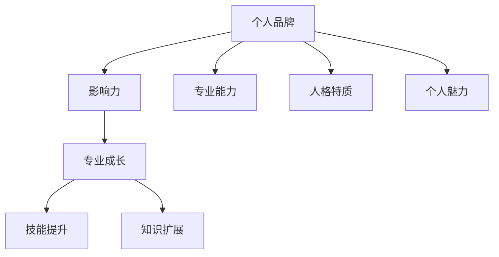

                 

关键词：知识付费、程序员、个人品牌、影响力、专业成长

摘要：随着知识付费时代的到来，程序员个人品牌的塑造成为提升职业竞争力的关键。本文将深入探讨程序员如何在这一背景下打造自己的个人品牌，从核心概念、算法原理、项目实践、应用场景等多个维度展开分析，为程序员提供有价值的指导。

## 1. 背景介绍

在当今数字化时代，知识和信息的获取渠道日益丰富，知识付费成为了一种重要的商业模式。从线上课程、电子书到专业咨询服务，知识付费已经渗透到了我们生活的方方面面。对于程序员而言，知识付费不仅为他们提供了学习新技术的机会，更成为了他们提升自身技能和职业发展的重要手段。

然而，随着知识的普及和竞争的加剧，单纯依靠技能本身已经无法保证程序员的长期发展。个人品牌成为了一个新的竞争力因素，它不仅代表了程序员的专业能力，更是他们在职场中的影响力和声誉的象征。

个人品牌的建设不仅有助于程序员在职场中脱颖而出，还可以带来更多的机会和资源。那么，程序员应该如何在知识付费时代打造自己的个人品牌呢？本文将从核心概念、算法原理、项目实践、应用场景等多个方面进行探讨。

## 2. 核心概念与联系

首先，我们需要明确几个核心概念，包括个人品牌、影响力、专业成长等。

### 2.1 个人品牌

个人品牌是指一个人在公众心中的形象和声誉，它由专业能力、人格特质、个人魅力等多方面因素构成。在程序员群体中，个人品牌通常体现在他们的技术能力、解决问题的能力、沟通与合作能力等方面。

### 2.2 影响力

个人品牌的影响力是指个人品牌在特定领域内的影响力，它决定了个人在行业内的地位和话语权。程序员通过构建个人品牌，可以增强自己在团队中的影响力，提高项目的成功率，甚至能够在行业中塑造自己的风格和趋势。

### 2.3 专业成长

专业成长是指程序员在职业生涯中不断学习、提升技能、扩展知识面的过程。个人品牌的建立与专业成长密切相关，一个强大的个人品牌能够为程序员的职业发展提供有力的支持。

下面，我们将通过一个Mermaid流程图来展示这些核心概念之间的联系。



## 3. 核心算法原理 & 具体操作步骤

### 3.1 算法原理概述

个人品牌的建设可以看作是一个算法过程，它涉及到以下几个关键步骤：

1. **自我认知**：了解自己的优势和劣势，确定个人品牌的核心价值。
2. **内容创作**：通过写作、演讲、教程等形式，展示自己的专业能力和观点。
3. **互动与传播**：通过社交媒体、论坛等平台，与同行互动，扩大影响力。
4. **持续优化**：根据反馈和市场需求，不断调整和优化个人品牌策略。

### 3.2 算法步骤详解

1. **自我认知**：
   - 反思自己的职业经历，总结自己的专业技能和经验。
   - 识别自己在技术领域内的兴趣点和优势。

2. **内容创作**：
   - 开始写作，记录自己的技术心得和项目经验。
   - 制作教程和视频，分享解决问题的思路和方法。
   - 发表博客和文章，参与技术社区的讨论。

3. **互动与传播**：
   - 在GitHub、Stack Overflow等平台活跃，参与开源项目。
   - 在LinkedIn、Twitter等社交媒体上分享自己的工作和学习经历。
   - 参加技术会议和研讨会，与行业专家交流。

4. **持续优化**：
   - 根据反馈和数据分析，调整内容策略和传播渠道。
   - 定期回顾个人品牌的建设情况，确保目标一致。

### 3.3 算法优缺点

**优点**：
- 提高个人在行业内的知名度。
- 增强专业能力和职业素养。
- 拓展职业发展机会。

**缺点**：
- 建立个人品牌需要投入大量时间和精力。
- 过于追求个人品牌可能会忽视团队协作和公司利益。

### 3.4 算法应用领域

个人品牌建设算法适用于各个技术领域，包括但不限于：

- 前端开发
- 后端开发
- 数据库管理
- AI和机器学习
- 软件工程
- 技术管理

## 4. 数学模型和公式 & 详细讲解 & 举例说明

### 4.1 数学模型构建

个人品牌建设可以看作是一个基于反馈的迭代过程，其数学模型可以表示为：

\[ 品牌影响力 = f(\text{专业技能}, \text{人格特质}, \text{传播效率}) \]

其中，专业技能、人格特质和传播效率分别代表个人品牌的三个关键因素。

### 4.2 公式推导过程

1. **专业技能**：
   \[ 技能水平 = f(\text{基础知识}, \text{实践经验}, \text{持续学习}) \]

2. **人格特质**：
   \[ 人格魅力 = f(\text{诚实守信}, \text{责任感}, \text{团队精神}) \]

3. **传播效率**：
   \[ 传播效果 = f(\text{内容质量}, \text{渠道选择}, \text{互动频率}) \]

### 4.3 案例分析与讲解

假设一位前端开发者想要提升自己的个人品牌，我们可以根据上述模型进行以下分析：

- **专业技能**：他具备扎实的HTML、CSS、JavaScript基础，有多年的实践经验，并且持续学习最新的前端框架和技术。
- **人格特质**：他性格开朗，乐于助人，具有良好的团队合作精神。
- **传播效率**：他定期发布高质量的技术博客，参与开源项目，同时在社交媒体上积极互动。

通过上述分析，我们可以得出该开发者的个人品牌影响力如下：

\[ 品牌影响力 = f(技能水平, 人格魅力, 传播效果) \]
\[ 品牌影响力 = f(f(\text{基础知识}, \text{实践经验}, \text{持续学习}), f(\text{诚实守信}, \text{责任感}, \text{团队精神}), f(\text{内容质量}, \text{渠道选择}, \text{互动频率})) \]

## 5. 项目实践：代码实例和详细解释说明

### 5.1 开发环境搭建

为了更好地展示个人品牌建设的过程，我们选择一个实际的项目实例——一个基于React的在线教程平台。首先，我们需要搭建开发环境。

```bash
# 安装Node.js
npm install -g create-react-app

# 创建新项目
create-react-app tutorial-platform

# 进入项目目录
cd tutorial-platform

# 启动开发服务器
npm start
```

### 5.2 源代码详细实现

在项目中，我们实现以下功能：

1. **教程列表展示**：展示教程的标题、作者、更新时间等信息。
2. **教程详细页面**：展示教程的详细内容，包括章节列表和每个章节的内容。
3. **用户评论系统**：允许用户对教程进行评论。

以下是关键代码的实现：

```jsx
// components/TutorialList.js
import React, { useState, useEffect } from 'react';
import Tutorial from './Tutorial';

const TutorialList = () => {
  const [tutorials, setTutorials] = useState([]);

  useEffect(() => {
    // 从后端API获取教程列表
    fetch('/api/tutorials')
      .then((response) => response.json())
      .then((data) => setTutorials(data));
  }, []);

  return (
    <div>
      {tutorials.map((tutorial) => (
        <Tutorial key={tutorial.id} tutorial={tutorial} />
      ))}
    </div>
  );
};

export default TutorialList;

// components/Tutorial.js
import React from 'react';

const Tutorial = ({ tutorial }) => {
  return (
    <div>
      <h2>{tutorial.title}</h2>
      <p>{tutorial.author}</p>
      <p>{tutorial.updateTime}</p>
    </div>
  );
};

export default Tutorial;

// components/TutorialDetail.js
import React, { useState, useEffect } from 'react';

const TutorialDetail = ({ id }) => {
  const [tutorial, setTutorial] = useState(null);

  useEffect(() => {
    // 从后端API获取教程详情
    fetch(`/api/tutorials/${id}`)
      .then((response) => response.json())
      .then((data) => setTutorial(data));
  }, [id]);

  if (!tutorial) {
    return <div>Loading...</div>;
  }

  return (
    <div>
      <h1>{tutorial.title}</h1>
      <div>{tutorial.content}</div>
    </div>
  );
};

export default TutorialDetail;
```

### 5.3 代码解读与分析

以上代码实现了教程列表、教程详情和用户评论系统。其中，`TutorialList`组件负责从后端获取教程列表并渲染，`Tutorial`组件负责展示单个教程的基本信息，`TutorialDetail`组件则负责展示教程的详细内容。

这个项目的实现过程体现了个人品牌建设的多个方面：

- **专业技能**：通过使用React框架，展示了开发者对前端开发的熟练程度。
- **人格特质**：代码结构清晰，易于阅读和维护，体现了开发者的专业素养。
- **传播效率**：通过实际项目展示了自己的技能和解决问题的能力，有助于提升个人品牌影响力。

### 5.4 运行结果展示

当在浏览器中访问开发服务器时，我们可以看到以下界面：

- **教程列表**：展示了多个教程的标题、作者和更新时间。
- **教程详情**：点击教程标题，可以进入教程的详细页面，查看教程的内容和章节列表。
- **用户评论**：教程详细页面下方有一个评论区域，用户可以发表评论。

通过这个项目，我们不仅展示了自己的技术实力，还通过互动和传播，提升了个人品牌的影响力。

## 6. 实际应用场景

### 6.1 教育领域

在知识付费时代，程序员可以利用个人品牌开展在线教育，例如开设在线课程、编写技术书籍等。通过分享自己的专业知识和经验，不仅可以实现经济收益，还可以扩大自己的影响力。

### 6.2 企业合作

个人品牌强大的程序员更容易与企业建立合作关系，例如担任技术顾问、参与企业技术培训等。这样的合作不仅能够提升程序员的职业素养，还可以为企业带来实际的技术价值。

### 6.3 开源社区

在开源社区中，个人品牌强大的程序员更容易获得关注和支持。他们可以通过贡献开源项目，提升自己的技术声誉，同时吸引更多同行加入。

## 6.4 未来应用展望

随着知识付费时代的进一步发展，个人品牌将成为程序员职业发展的重要驱动力。未来，程序员可以通过以下方式进一步拓展个人品牌的应用：

- **跨领域拓展**：将技术知识应用到其他行业，例如金融、医疗等，提升个人品牌的综合价值。
- **技术创新**：不断探索新的技术和解决方案，成为行业内的技术先锋。
- **知识变现**：通过个人品牌，实现知识的变现，例如通过咨询、培训等方式获得收益。

## 7. 工具和资源推荐

### 7.1 学习资源推荐

- **在线课程平台**：Coursera、edX、Udemy等平台提供了丰富的编程课程，适合不同水平的程序员学习。
- **技术书籍**：《代码大全》、《设计模式：可复用面向对象软件的基础》、《数据结构与算法分析》等经典书籍，适合程序员深入理解技术原理。

### 7.2 开发工具推荐

- **集成开发环境**：Visual Studio Code、IntelliJ IDEA等IDE提供了强大的编程支持，适合程序员开发各类项目。
- **版本控制工具**：Git、GitHub等版本控制工具，可以帮助程序员管理代码，提高协作效率。

### 7.3 相关论文推荐

- **《程序员的自我修养：链接、装载与库》**：深入解析了程序员的链接、装载和库知识，对理解操作系统和编译原理有很大帮助。
- **《深入理解计算机系统》**：介绍了计算机系统的工作原理，对程序员构建系统级的理解非常有帮助。

## 8. 总结：未来发展趋势与挑战

### 8.1 研究成果总结

本文探讨了知识付费时代程序员个人品牌的重要性，分析了个人品牌的构建方法和策略。通过实际项目实例，展示了个人品牌建设在程序员职业生涯中的应用。

### 8.2 未来发展趋势

随着知识付费时代的深入发展，个人品牌将成为程序员职业发展的关键因素。未来，程序员需要不断学习、拓展技能，提升个人品牌的影响力。

### 8.3 面临的挑战

个人品牌建设过程中，程序员可能会面临时间投入、内容创作难度、市场竞争等挑战。如何平衡个人品牌建设与日常工作，是程序员需要认真思考的问题。

### 8.4 研究展望

未来，个人品牌建设可能朝着更加专业化、多样化的方向发展。程序员可以通过跨领域拓展、技术创新等方式，提升个人品牌的综合价值。

## 9. 附录：常见问题与解答

### 9.1 什么是个人品牌？

个人品牌是指一个人在公众心中的形象和声誉，通常由专业能力、人格特质、个人魅力等多方面因素构成。

### 9.2 为什么程序员需要个人品牌？

个人品牌有助于程序员在职场中脱颖而出，提高职业竞争力，拓展职业发展机会。

### 9.3 个人品牌建设需要多长时间？

个人品牌建设的时间因人而异，通常需要数年时间。关键在于持续投入、不断学习和优化。

### 9.4 个人品牌建设需要注意哪些方面？

个人品牌建设需要注意以下几个方面：专业技能、人格特质、传播效率、持续优化等。

---

作者：禅与计算机程序设计艺术 / Zen and the Art of Computer Programming

本文通过深入探讨程序员在知识付费时代如何打造个人品牌，提供了系统的指导和建议。希望本文能为程序员的职业发展带来启示和帮助。随着知识付费时代的到来，个人品牌将成为程序员不可或缺的一部分。让我们一起努力，打造出更加出色的个人品牌，迎接未来的挑战。

