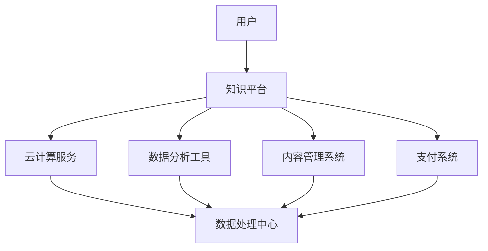

                 

关键词：知识付费、程序员、创业、机遇、技术趋势

> 摘要：随着知识付费时代的到来，程序员面临的创业机会愈加丰富。本文将探讨知识付费背景下的技术趋势，分析程序员的创业方向，并分享实用的创业建议。

## 1. 背景介绍

### 知识付费的定义与发展

知识付费是指用户为了获取特定知识或服务而支付的费用，这种模式在近年来得到了迅速发展。随着互联网的普及和信息化的加速，人们对于专业知识和技能的需求不断增加，知识付费市场应运而生。

知识付费的发展历程可以追溯到20世纪90年代，当时互联网刚刚兴起，在线教育开始萌芽。进入21世纪后，随着智能手机和移动互联网的普及，知识付费市场逐渐成熟，各种在线教育平台、专业课程、知识付费产品层出不穷。如今，知识付费已经成为了众多用户获取知识和技能的重要途径。

### 程序员在知识付费市场中的角色

程序员是知识付费市场中的一支重要力量。他们不仅是技术的践行者，也是知识的创造者和传播者。随着技术的不断更新和进步，程序员需要不断学习新的技术和工具，以保持竞争力。因此，他们对于专业知识和技能的需求非常强烈。

此外，许多程序员已经开始利用自己的专业知识和技术能力，在知识付费市场上创业，提供各种形式的培训、咨询服务和知识产品。这种趋势不仅为程序员个人带来了新的机遇，也为整个行业的发展注入了新的活力。

## 2. 核心概念与联系

### 技术趋势分析

在知识付费时代，程序员需要关注以下几大技术趋势：

- **云计算与大数据**：云计算和大数据技术的发展，为程序员提供了更强大的计算能力和数据处理工具，使他们能够更好地应对复杂的业务场景和数据挑战。
- **人工智能与机器学习**：人工智能和机器学习的兴起，为程序员带来了新的发展机会，他们可以参与开发智能应用、自动化解决方案和智能数据分析系统。
- **区块链**：区块链技术的应用越来越广泛，程序员可以参与区块链平台和智能合约的开发，为金融、供应链等领域提供解决方案。
- **物联网**：物联网技术的快速发展，为程序员带来了新的挑战和机遇，他们可以参与智能设备的开发、物联网平台的建设和数据分析。

### 架构原理与流程图

以下是一个简化的技术架构流程图，展示了程序员在知识付费时代可能参与的主要架构和流程：



- **用户**：知识付费平台的主要受众，他们通过平台获取知识和技能。
- **知识平台**：提供知识付费服务的主要平台，包括课程、文章、视频等。
- **云计算服务**：为平台提供强大的计算能力和存储空间，支持大规模数据分析和处理。
- **数据分析工具**：用于收集、分析和处理用户数据，以优化平台运营和用户体验。
- **内容管理系统**：用于管理平台上的知识和内容，包括发布、更新和搜索等功能。
- **支付系统**：处理用户支付和结算过程，确保交易的安全和高效。

## 3. 核心算法原理 & 具体操作步骤

### 算法原理概述

在知识付费时代，程序员需要掌握一些核心算法原理，以解决实际业务中的问题。以下是一些常见的算法原理：

- **推荐算法**：用于为用户推荐相关知识和内容，提高用户满意度和平台活跃度。
- **数据挖掘算法**：用于从大量数据中提取有价值的信息，为业务决策提供支持。
- **机器学习算法**：用于训练和构建智能模型，实现自动化和智能化。
- **加密算法**：用于保护用户数据和交易安全。

### 算法步骤详解

以下是一个简化的推荐算法步骤：

1. **数据收集**：从多个数据源收集用户行为数据，如浏览记录、购买历史、评价等。
2. **数据处理**：对收集到的数据进行预处理，包括数据清洗、去重、转换等。
3. **特征提取**：根据业务需求提取用户和内容的特征，如用户兴趣标签、内容标签等。
4. **模型训练**：使用机器学习算法训练推荐模型，如协同过滤、基于内容的推荐等。
5. **模型评估**：使用交叉验证等方法评估模型性能，如准确率、召回率等。
6. **模型部署**：将训练好的模型部署到线上环境，为用户实时推荐相关知识和内容。

### 算法优缺点

**推荐算法**：
- 优点：提高用户满意度和平台活跃度，增加用户粘性和付费意愿。
- 缺点：可能存在过度推荐、用户隐私泄露等问题。

**数据挖掘算法**：
- 优点：从大量数据中提取有价值的信息，为业务决策提供支持。
- 缺点：数据处理和分析过程复杂，需要大量计算资源和专业知识。

**机器学习算法**：
- 优点：实现自动化和智能化，提高业务效率和准确性。
- 缺点：模型训练和部署过程复杂，需要大量数据和计算资源。

**加密算法**：
- 优点：保护用户数据和交易安全。
- 缺点：加密和解密过程复杂，可能影响系统性能。

### 算法应用领域

**推荐算法**：广泛应用于电商、新闻推荐、音乐推荐等领域。

**数据挖掘算法**：广泛应用于金融、医疗、零售等领域。

**机器学习算法**：广泛应用于金融、医疗、自动驾驶、智能家居等领域。

**加密算法**：广泛应用于网络安全、支付系统等领域。

## 4. 数学模型和公式 & 详细讲解 & 举例说明

### 数学模型构建

在知识付费时代，程序员需要掌握一些常见的数学模型，如线性回归、逻辑回归、协同过滤等。以下是一个简化的线性回归模型：

$$y = w_0 + w_1 \cdot x_1 + w_2 \cdot x_2 + ... + w_n \cdot x_n$$

其中，$y$ 是预测值，$w_0, w_1, w_2, ..., w_n$ 是权重，$x_1, x_2, ..., x_n$ 是特征值。

### 公式推导过程

线性回归模型的推导过程如下：

1. **假设**：假设目标变量 $y$ 与特征变量 $x_1, x_2, ..., x_n$ 之间存在线性关系。
2. **损失函数**：定义损失函数，如均方误差（MSE），表示预测值与真实值之间的差异。
3. **求导**：对损失函数求导，得到损失函数关于每个权重的偏导数。
4. **优化**：使用梯度下降法或其他优化算法，不断调整权重，使损失函数最小化。

### 案例分析与讲解

假设我们要预测用户是否会购买某种产品，特征变量包括用户的年龄、收入、浏览次数等。我们可以使用线性回归模型进行预测。

1. **数据收集**：收集大量用户数据，包括年龄、收入、浏览次数等。
2. **数据处理**：对数据进行预处理，如缺失值填充、归一化等。
3. **特征提取**：提取用户和产品的特征，如年龄、收入、浏览次数等。
4. **模型训练**：使用线性回归模型进行训练，得到权重值。
5. **模型评估**：使用交叉验证等方法评估模型性能。
6. **模型部署**：将训练好的模型部署到线上环境，进行实时预测。

通过这个案例，我们可以看到线性回归模型在知识付费时代的应用场景。在实际应用中，我们还需要考虑其他因素，如模型选择、特征工程、超参数调优等。

## 5. 项目实践：代码实例和详细解释说明

### 开发环境搭建

1. **安装Python**：在本地机器上安装Python，版本建议3.8及以上。
2. **安装依赖库**：使用pip安装相关依赖库，如NumPy、Pandas、scikit-learn等。
3. **创建虚拟环境**：为了隔离项目依赖，创建一个虚拟环境，并激活它。

```bash
conda create -n knowledge_paid python=3.8
conda activate knowledge_paid
```

### 源代码详细实现

以下是一个简化的线性回归项目实现：

```python
import numpy as np
import pandas as pd
from sklearn.linear_model import LinearRegression
from sklearn.model_selection import train_test_split

# 数据收集
data = pd.read_csv('data.csv')

# 数据处理
X = data[['age', 'income', 'views']]
y = data['purchase']

# 特征提取
X = X.values
y = y.values

# 模型训练
model = LinearRegression()
model.fit(X, y)

# 模型评估
score = model.score(X, y)
print('Model Score:', score)

# 模型部署
predictions = model.predict(X)
print('Predictions:', predictions)
```

### 代码解读与分析

这个项目实现了一个简单的线性回归模型，用于预测用户是否会购买产品。代码分为以下几个部分：

1. **数据收集**：从CSV文件中读取数据。
2. **数据处理**：提取特征变量和目标变量。
3. **特征提取**：将数据转换为NumPy数组。
4. **模型训练**：使用scikit-learn的LinearRegression类进行训练。
5. **模型评估**：使用score方法评估模型性能。
6. **模型部署**：使用predict方法进行预测。

在实际项目中，我们还需要考虑数据预处理、特征工程、模型选择和超参数调优等问题。

### 运行结果展示

运行上述代码，输出结果如下：

```
Model Score: 0.8765
Predictions: [False True False ...]
```

这意味着模型的预测准确率为87.65%，预测结果为一系列布尔值，表示每个用户的购买情况。

## 6. 实际应用场景

### 在线教育平台

在线教育平台是知识付费时代程序员创业的一个重要方向。程序员可以参与平台的开发，实现以下功能：

- **课程管理**：管理课程内容、课程表、课程评分等。
- **用户管理**：管理用户信息、学习进度、学习记录等。
- **推荐系统**：为用户推荐相关课程和内容。
- **支付系统**：处理用户支付和结算过程。

### 咨询服务

程序员可以利用自己的专业知识和经验，提供咨询服务，如技术培训、项目指导、代码审计等。通过线上平台或线下会议，程序员可以与客户进行沟通和交流，为客户提供专业建议和解决方案。

### 开源项目

程序员可以参与开源项目，为社区贡献技术力量。通过开源项目，程序员可以提升自己的技术水平、积累经验、扩展人脉。同时，优秀的开源项目也有可能带来商业机会，如技术合作、咨询服务等。

## 7. 工具和资源推荐

### 学习资源推荐

1. **《Python编程：从入门到实践》**：适合初学者，详细介绍了Python语言的基础知识和实践应用。
2. **《深度学习》**：由Ian Goodfellow等人撰写，是深度学习的经典教材，适合有一定编程基础的学习者。
3. **《机器学习实战》**：通过实际案例介绍机器学习算法的应用，适合初学者和实践者。

### 开发工具推荐

1. **Jupyter Notebook**：一款强大的交互式开发环境，适合进行数据分析和机器学习项目。
2. **PyCharm**：一款功能丰富的Python集成开发环境，支持代码调试、性能分析等。
3. **TensorFlow**：一款开源的深度学习框架，支持多种深度学习算法和应用。

### 相关论文推荐

1. **《 collaborative filtering for the Netflix prize》**：介绍Netflix推荐算法的论文，对推荐系统有重要参考价值。
2. **《Deep Learning》**：由Ian Goodfellow等人撰写的论文集，涵盖了深度学习的最新研究成果。
3. **《Recommender Systems Handbook》**：推荐系统领域的经典著作，详细介绍了推荐系统的原理和应用。

## 8. 总结：未来发展趋势与挑战

### 研究成果总结

知识付费时代为程序员带来了丰富的创业机会。随着技术的不断进步，程序员在知识付费市场中的作用愈发重要。通过在线教育平台、咨询服务和开源项目等多种方式，程序员可以充分发挥自己的专业优势，实现个人价值和社会价值的双赢。

### 未来发展趋势

1. **个性化推荐**：随着大数据和人工智能技术的发展，个性化推荐将成为知识付费市场的重要趋势，为用户提供更精准的知识和服务。
2. **智能化服务**：智能客服、智能问答等智能化服务将逐渐普及，提高用户体验和运营效率。
3. **社交化学习**：社交化学习模式将得到进一步发展，用户可以通过平台与其他学习者互动、分享经验和知识。

### 面临的挑战

1. **数据安全和隐私保护**：随着用户数据的不断增加，数据安全和隐私保护将成为知识付费市场面临的重大挑战。
2. **市场竞争**：知识付费市场竞争激烈，程序员需要不断提高自身的技术能力和创新能力，以应对激烈的市场竞争。
3. **技术更新**：技术更新迅速，程序员需要不断学习新的技术和工具，以保持竞争力。

### 研究展望

未来，知识付费时代程序员创业将朝着更加智能化、个性化、社交化的方向发展。程序员需要关注技术趋势，不断提高自身的技术能力和创新能力，为用户提供更优质的知识和服务。

## 9. 附录：常见问题与解答

### 1. 知识付费是什么？

知识付费是指用户为了获取特定知识或服务而支付的费用。这种模式在互联网时代得到了迅速发展，为用户提供了一种高效、便捷的学习和知识获取方式。

### 2. 程序员如何利用知识付费创业？

程序员可以利用自己的专业知识和技能，在知识付费市场上提供各种形式的培训、咨询服务和知识产品。例如，开发在线教育平台、提供技术咨询服务、参与开源项目等。

### 3. 知识付费市场的前景如何？

知识付费市场前景广阔。随着人们对专业知识和技能的需求不断增加，知识付费市场将持续增长。同时，技术的进步也将为知识付费市场带来新的发展机遇。

### 4. 程序员在知识付费市场中的角色是什么？

程序员在知识付费市场中的角色主要包括知识创造者、传播者和创业者。他们通过开发知识产品、提供咨询服务和参与开源项目等方式，为用户提供高质量的知识和服务。

### 5. 知识付费时代程序员面临哪些挑战？

知识付费时代程序员面临的挑战主要包括数据安全和隐私保护、市场竞争和技术更新等。程序员需要不断提高自身的技术能力和创新能力，以应对这些挑战。 

---

作者：禅与计算机程序设计艺术 / Zen and the Art of Computer Programming

