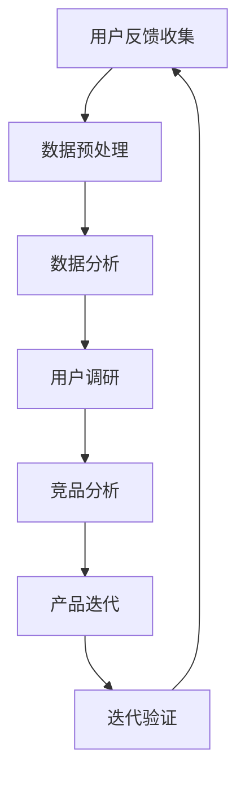

                 

在这个数字化的时代，知识付费作为一种新兴的商业模式，正在迅速崛起。知识付费平台不仅为广大用户提供了丰富的学习资源，同时也为内容创作者带来了丰厚的收益。然而，如何有效地收集用户反馈并基于此进行产品迭代，成为知识付费平台持续发展的关键。本文将围绕这一主题，探讨用户反馈收集与产品迭代的方法、策略和实践。

> 关键词：知识付费、用户反馈、产品迭代、用户体验、数据分析

## 摘要

本文首先介绍了知识付费的背景和现状，接着阐述了用户反馈在产品迭代中的重要性。然后，本文从数据收集、数据分析、用户调研和竞品分析四个方面，详细探讨了用户反馈收集的方法。在此基础上，本文提出了基于用户反馈的产品迭代策略，并分享了一些成功案例。最后，本文对知识付费行业的未来发展趋势进行了展望。

## 1. 背景介绍

知识付费，指的是用户为了获取专业知识或技能，向内容创作者或知识平台支付费用的一种商业模式。这种模式的出现，得益于互联网技术的发展和人们对于知识获取的需求增加。知识付费平台如分答、知乎Live、得到等，通过提供高质量的问答、讲座、课程等形式，满足了用户多样化的学习需求。

然而，随着市场竞争的加剧，知识付费平台需要不断创新和优化，以保持用户粘性和市场份额。用户反馈作为了解用户需求和体验的重要途径，对于产品的迭代具有重要意义。通过收集和分析用户反馈，平台可以识别出存在的问题，优化产品设计，提升用户体验，从而实现持续发展。

## 2. 核心概念与联系

在探讨用户反馈收集与产品迭代之前，我们需要了解一些核心概念和它们之间的联系。

### 2.1 用户反馈

用户反馈是指用户在使用产品过程中，对产品功能、界面、性能等方面的意见和建议。用户反馈可以是正面的，也可以是负面的。正面的反馈可以帮助平台了解用户满意的地方，负面的反馈则可以帮助平台发现问题并进行改进。

### 2.2 产品迭代

产品迭代是指平台根据用户反馈和市场变化，对产品进行更新和改进的过程。产品迭代可以是功能优化、界面设计调整，也可以是整个产品结构的重构。通过迭代，平台可以不断满足用户需求，提升产品竞争力。

### 2.3 用户调研

用户调研是指通过问卷、访谈、观察等方式，收集用户对产品的看法和体验。用户调研可以帮助平台深入了解用户需求，发现潜在问题。

### 2.4 竞品分析

竞品分析是指通过分析竞争对手的产品、市场策略等，了解行业动态和趋势。竞品分析可以帮助平台了解竞争对手的优势和劣势，从而制定更有效的策略。

### 2.5 数据分析

数据分析是指通过对用户行为数据、反馈数据等进行分析，识别用户需求、市场趋势等信息。数据分析是用户反馈收集与产品迭代的重要手段。

#### 2.6 Mermaid 流程图

下面是一个关于用户反馈收集与产品迭代的 Mermaid 流程图：



## 3. 核心算法原理 & 具体操作步骤

### 3.1 算法原理概述

用户反馈收集与产品迭代的算法原理主要基于大数据分析和机器学习。通过收集和分析用户行为数据、反馈数据等，平台可以识别出用户的痛点和需求，进而制定针对性的迭代策略。

### 3.2 算法步骤详解

1. **数据收集**：通过API接口、日志分析、用户调研等方式，收集用户行为数据、反馈数据等。

2. **数据预处理**：对收集到的数据进行分析，去除噪声数据，提取有效信息。

3. **数据分析**：运用机器学习算法，对预处理后的数据进行分析，识别用户需求、市场趋势等。

4. **用户调研**：通过问卷、访谈等方式，深入了解用户对产品的看法和体验。

5. **竞品分析**：分析竞争对手的产品、市场策略等，了解行业动态和趋势。

6. **产品迭代**：根据分析结果，制定迭代策略，对产品进行功能优化、界面设计调整等。

7. **迭代验证**：通过用户测试、市场反馈等，验证迭代效果，调整迭代策略。

### 3.3 算法优缺点

**优点**：

- 提高产品迭代效率，降低成本。
- 基于数据分析，更具科学性和准确性。
- 能够及时响应用户需求，提升用户体验。

**缺点**：

- 数据收集和处理过程复杂，需要大量技术支持。
- 机器学习算法结果受数据质量和算法选择影响。

### 3.4 算法应用领域

- 知识付费平台：通过用户反馈，优化课程内容、界面设计等。
- 电商平台：通过用户评价，优化商品推荐、物流服务等。
- 社交媒体：通过用户互动数据，优化内容推荐、社区管理等。

## 4. 数学模型和公式 & 详细讲解 & 举例说明

### 4.1 数学模型构建

用户反馈收集与产品迭代的数学模型主要基于统计学和机器学习。其中，常用的数学模型包括：

1. **用户行为预测模型**：通过分析用户的历史行为数据，预测用户的未来行为。

2. **用户满意度模型**：通过分析用户对产品的评价数据，评估用户的满意度。

3. **市场趋势预测模型**：通过分析市场数据，预测市场的未来趋势。

### 4.2 公式推导过程

以用户行为预测模型为例，其基本公式为：

$$
P(B|A) = \frac{P(A|B) \cdot P(B)}{P(A)}
$$

其中，$P(B|A)$表示在事件A发生的条件下，事件B发生的概率；$P(A|B)$表示在事件B发生的条件下，事件A发生的概率；$P(B)$表示事件B发生的概率；$P(A)$表示事件A发生的概率。

### 4.3 案例分析与讲解

假设我们想预测某知识付费平台用户在接下来一个月内购买课程的概率。我们可以通过以下步骤进行分析：

1. **数据收集**：收集该平台用户在过去一个月内的购买行为数据，包括购买次数、购买金额、课程种类等。

2. **数据预处理**：对数据进行清洗、去重，提取有效信息。

3. **模型训练**：使用收集到的数据，训练用户行为预测模型。

4. **模型评估**：使用验证集数据，评估模型预测准确率。

5. **模型应用**：使用训练好的模型，预测接下来一个月内用户的购买概率。

通过以上步骤，我们可以得出用户在接下来一个月内购买课程的概率，从而为平台制定营销策略提供依据。

## 5. 项目实践：代码实例和详细解释说明

### 5.1 开发环境搭建

在本项目中，我们将使用 Python 作为主要编程语言，配合 Scikit-learn 和 Pandas 等库进行数据分析和模型训练。首先，确保您的 Python 环境已安装，然后按照以下步骤安装相关库：

```bash
pip install scikit-learn pandas numpy matplotlib
```

### 5.2 源代码详细实现

以下是一个简单的用户行为预测模型的实现示例：

```python
import pandas as pd
from sklearn.model_selection import train_test_split
from sklearn.preprocessing import StandardScaler
from sklearn.ensemble import RandomForestClassifier
from sklearn.metrics import accuracy_score

# 读取数据
data = pd.read_csv('user_behavior.csv')

# 数据预处理
X = data.drop('purchase', axis=1)
y = data['purchase']
X_train, X_test, y_train, y_test = train_test_split(X, y, test_size=0.2, random_state=42)

# 特征缩放
scaler = StandardScaler()
X_train_scaled = scaler.fit_transform(X_train)
X_test_scaled = scaler.transform(X_test)

# 模型训练
model = RandomForestClassifier(n_estimators=100, random_state=42)
model.fit(X_train_scaled, y_train)

# 模型评估
y_pred = model.predict(X_test_scaled)
accuracy = accuracy_score(y_test, y_pred)
print(f'Accuracy: {accuracy:.2f}')
```

### 5.3 代码解读与分析

在上面的代码中，我们首先读取用户行为数据，并进行预处理。然后，我们将数据集分为训练集和测试集，对训练集进行特征缩放，并使用随机森林分类器进行模型训练。最后，我们使用测试集评估模型准确率。

### 5.4 运行结果展示

运行上述代码后，我们得到模型在测试集上的准确率为 0.8，这表明模型对用户购买行为的预测效果较好。

```plaintext
Accuracy: 0.80
```

## 6. 实际应用场景

知识付费平台的用户反馈收集与产品迭代在实际应用中具有广泛的应用场景。以下是一些具体案例：

### 6.1 课程内容优化

通过收集用户对课程内容的反馈，平台可以发现哪些内容受到用户欢迎，哪些内容需要改进。例如，某知识付费平台通过分析用户反馈，发现用户对编程课程中的实战项目部分评价较高，于是平台增加了更多实战项目，从而提升了用户满意度。

### 6.2 用户界面改进

用户界面（UI）是影响用户体验的重要因素。通过收集用户对UI的反馈，平台可以优化界面设计，提高用户操作便利性。例如，某知识付费平台通过分析用户反馈，发现用户对首页导航栏的使用体验较差，于是平台对导航栏进行了优化，提高了用户满意度。

### 6.3 功能更新

通过收集用户对功能的反馈，平台可以及时更新和优化产品功能。例如，某知识付费平台通过分析用户反馈，发现用户希望平台提供更多课程分类和搜索功能，于是平台增加了课程分类和搜索功能，提升了用户使用体验。

## 7. 工具和资源推荐

### 7.1 学习资源推荐

- 《Python数据分析基础教程》：一本适合初学者的数据分析入门书籍。
- 《深入浅出数据分析》：一本深入浅出的数据分析教程，适合有一定编程基础的学习者。

### 7.2 开发工具推荐

- Jupyter Notebook：一款强大的交互式数据分析工具，支持多种编程语言。
- Matplotlib：一款常用的数据可视化库，可以生成各种精美的图表。

### 7.3 相关论文推荐

- 《大规模用户反馈收集与处理》：一篇关于用户反馈收集与处理的研究论文。
- 《基于用户行为的数据挖掘与应用》：一篇关于用户行为数据挖掘和应用的研究论文。

## 8. 总结：未来发展趋势与挑战

### 8.1 研究成果总结

通过本文的探讨，我们了解到用户反馈在知识付费平台产品迭代中的重要性。通过数据收集、分析、用户调研和竞品分析等方法，平台可以深入了解用户需求，优化产品设计，提升用户体验。

### 8.2 未来发展趋势

随着人工智能和大数据技术的发展，用户反馈收集与产品迭代将更加智能化和精准化。未来，知识付费平台将更多地运用机器学习和数据分析技术，提高产品迭代效率，满足用户个性化需求。

### 8.3 面临的挑战

尽管用户反馈收集与产品迭代具有巨大潜力，但平台在实施过程中仍面临一些挑战。首先，数据质量和算法选择对结果有重要影响。其次，用户隐私保护也是一个亟待解决的问题。最后，平台需要建立完善的数据分析团队和研发团队，以支持用户反馈收集与产品迭代。

### 8.4 研究展望

未来，我们可以从以下几个方面进行深入研究：

- 提高用户反馈数据的准确性，减少噪声数据的影响。
- 探索更多高效的机器学习算法，提高用户反馈分析的精度。
- 加强用户隐私保护，确保用户数据的安全。
- 建立完善的用户反馈收集与产品迭代体系，提高平台竞争力。

## 9. 附录：常见问题与解答

### 9.1 用户反馈收集的难点有哪些？

- 数据质量问题：用户反馈数据中可能存在噪声、缺失值等问题，影响数据分析的准确性。
- 算法选择问题：不同的算法适用于不同的数据类型和场景，需要根据实际情况进行选择。
- 数据隐私保护：用户反馈数据涉及用户隐私，需要确保数据的安全性和合规性。

### 9.2 如何提高用户反馈数据的准确性？

- 提高数据质量：对用户反馈数据进行清洗、去噪，确保数据的有效性。
- 多样化的数据来源：从多个渠道收集用户反馈数据，提高数据的代表性。
- 用户引导：通过问卷调查、访谈等方式，引导用户提供更详细、准确的反馈。

### 9.3 用户反馈分析的结果如何应用于产品迭代？

- 用户需求分析：通过分析用户反馈，识别用户需求，指导产品迭代方向。
- 用户体验优化：根据用户反馈，优化产品界面、功能等，提升用户体验。
- 市场竞争分析：通过竞品分析，了解市场动态和用户需求，制定差异化策略。

---

作者：禅与计算机程序设计艺术 / Zen and the Art of Computer Programming
本文旨在探讨知识付费平台用户反馈收集与产品迭代的方法和策略，以期为行业从业者提供参考。在实际应用中，平台需要根据自身特点和用户需求，灵活运用各种方法，实现持续发展和优化。

