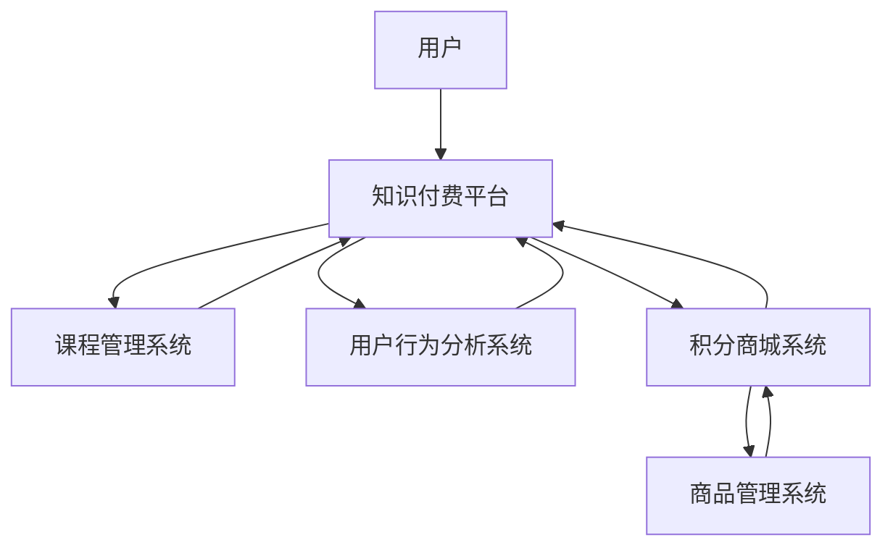

                 

随着互联网和技术的飞速发展，知识付费已经成为一个蓬勃发展的市场。用户希望通过付费获取高质量的知识和技能，而平台则通过提供有价值的内容和服务来实现商业变现。在这个过程中，用户课程兑换和积分商城运营成为关键环节。本文将深入探讨如何通过用户课程兑换与积分商城运营实现知识付费的盈利，并提供一些建议和最佳实践。

## 1. 背景介绍

知识付费是指用户为获取特定知识、技能或服务而自愿支付费用的一种商业模式。随着人们对自我提升的需求不断增加，知识付费市场呈现出爆炸式增长。在这个过程中，平台通过提供多样化的课程内容和灵活的支付方式，吸引大量用户参与。然而，如何有效地管理用户课程兑换和积分商城运营，成为平台盈利的关键。

### 1.1 用户课程兑换的重要性

用户课程兑换是知识付费平台的核心功能之一。它直接影响用户的体验和满意度，进而影响平台的口碑和用户留存率。一个良好的用户课程兑换机制，能够提高用户活跃度和消费意愿，从而实现平台的商业价值。

### 1.2 积分商城运营的作用

积分商城运营是知识付费平台的一种重要盈利模式。通过积分奖励机制，平台能够激励用户积极参与课程学习，提高用户粘性和忠诚度。同时，积分商城中的商品和服务可以吸引更多用户兑换积分，实现流量变现。

## 2. 核心概念与联系

在深入探讨用户课程兑换与积分商城运营之前，我们需要了解一些核心概念和架构。

### 2.1 用户课程兑换

用户课程兑换是指用户在知识付费平台上通过支付费用或积分兑换特定课程的学习资格。这个过程中涉及的主要概念包括：

- **用户**：知识付费平台的服务对象，具有学习需求和消费能力。
- **课程**：知识付费平台提供的学习内容，包括视频课程、电子书、直播课程等。
- **兑换**：用户通过支付费用或积分获取课程学习资格的过程。

### 2.2 积分商城运营

积分商城运营是指知识付费平台通过积分奖励机制吸引用户参与学习，并通过积分兑换商品和服务实现盈利。这个过程中涉及的主要概念包括：

- **积分**：知识付费平台为用户提供的虚拟货币，用于兑换商品和服务。
- **商品**：积分商城中的兑换商品，包括实物商品、虚拟商品和服务等。
- **积分兑换**：用户使用积分兑换商品和服务的过程。

### 2.3 架构图

以下是一个简单的用户课程兑换与积分商城运营的架构图：

```
+-----------------+
| 用户            |
+-----------------+
         |
         V
+-----------------+
| 知识付费平台    |
+-----------------+
       |    兑换    |
       |           |
       V           V
+-----------------+
| 课程管理系统    |
+-----------------+
       |    发布    |
       |           |
       V           V
+-----------------+
| 用户行为分析    |
+-----------------+
       |    优化    |
       |           |
       V           V
+-----------------+
| 积分商城系统    |
+-----------------+
       |    运营    |
       |           |
       V           V
+-----------------+
| 商品管理系统    |
+-----------------+
```

## 3. 核心算法原理 & 具体操作步骤

### 3.1 算法原理概述

用户课程兑换与积分商城运营的核心算法原理主要包括以下几个方面：

- **积分计算**：根据用户的学习行为和消费行为，计算用户应得的积分。
- **兑换规则**：制定积分兑换商品和服务的规则，包括兑换比例、商品限制等。
- **数据分析**：分析用户行为数据，优化课程兑换和积分商城运营策略。

### 3.2 算法步骤详解

#### 3.2.1 积分计算

积分计算是用户课程兑换与积分商城运营的基础。以下是积分计算的步骤：

1. **用户注册**：用户在知识付费平台上注册账号，获取初始积分。
2. **学习行为**：用户学习平台上的课程，根据学习时长、完成度等计算积分。
3. **消费行为**：用户在平台上购买课程或商品，根据消费金额计算积分。
4. **积分调整**：根据用户行为数据和平台策略，对积分进行实时调整。

#### 3.2.2 兑换规则

兑换规则是积分商城运营的核心。以下是兑换规则的制定步骤：

1. **商品分类**：将积分商城中的商品分为不同类别，如实物商品、虚拟商品和服务等。
2. **兑换比例**：根据商品价值和积分价值，制定兑换比例。
3. **商品限制**：根据商品库存和用户需求，制定商品兑换限制。
4. **兑换流程**：制定用户兑换商品的具体流程，包括积分查询、商品选择、兑换申请等。

#### 3.2.3 数据分析

数据分析是优化用户课程兑换与积分商城运营的关键。以下是数据分析的步骤：

1. **行为追踪**：跟踪用户在平台上的学习行为和消费行为。
2. **数据统计**：统计用户行为数据，如学习时长、完成度、消费金额等。
3. **行为分析**：分析用户行为数据，发现用户需求和偏好。
4. **策略调整**：根据数据分析结果，调整积分计算、兑换规则和商品策略。

### 3.3 算法优缺点

#### 3.3.1 优点

- **灵活性**：用户可以根据自己的需求和偏好进行课程兑换和积分商城消费。
- **激励性**：积分奖励机制可以激发用户的学习兴趣和消费欲望。
- **盈利性**：积分商城运营可以实现流量变现，提高平台盈利能力。

#### 3.3.2 缺点

- **积分浪费**：用户可能会因为积分不足而无法兑换心仪的商品，导致积分浪费。
- **商品库存问题**：商品库存不足会导致用户无法兑换，影响用户体验。
- **数据分析复杂**：需要对大量用户行为数据进行深入分析，对平台技术要求较高。

### 3.4 算法应用领域

用户课程兑换与积分商城运营算法可以应用于多种知识付费场景，如在线教育、职业培训、技能提升等。以下是一些具体应用案例：

- **在线教育平台**：通过积分奖励机制激励学生参与课程学习，提高学习效果。
- **职业培训平台**：为学员提供积分兑换职业资格证书、培训资料等服务。
- **技能提升平台**：通过积分兑换技能培训课程、在线指导等，帮助用户提升技能。

## 4. 数学模型和公式 & 详细讲解 & 举例说明

在用户课程兑换与积分商城运营中，数学模型和公式扮演着重要角色。以下是一个简单的数学模型，用于计算用户积分。

### 4.1 数学模型构建

假设用户在知识付费平台上学习了一门课程，课程时长为\( T \)小时，用户实际学习时长为\( t \)小时，课程难度系数为\( D \)，则用户应得的积分\( I \)可以表示为：

\[ I = K \times \frac{t}{T} \times D \]

其中，\( K \)为积分计算系数，用于平衡不同课程的学习难度和时长。

### 4.2 公式推导过程

公式推导过程如下：

1. **学习时长比例**：用户实际学习时长与课程时长的比例，表示用户对课程的学习程度。
2. **难度调整**：根据课程难度系数，对学习时长比例进行调整，以平衡不同难度课程的用户积分。
3. **积分计算**：将调整后的学习时长比例乘以积分计算系数，得到用户应得的积分。

### 4.3 案例分析与讲解

假设一门课程时长为40小时，用户实际学习时长为30小时，课程难度系数为1.2，积分计算系数为10分/小时。根据上述公式，用户应得的积分为：

\[ I = 10 \times \frac{30}{40} \times 1.2 = 9 \text{分} \]

如果用户在另一门课程上学习时长为20小时，课程难度系数为1.5，积分计算系数为15分/小时，则用户应得的积分为：

\[ I = 15 \times \frac{20}{40} \times 1.5 = 22.5 \text{分} \]

通过这个案例，我们可以看到积分计算公式如何应用于实际场景。根据用户的学习时长、课程难度和积分计算系数，可以计算出用户应得的积分。这有助于平台制定合理的积分奖励机制，激励用户积极参与课程学习。

## 5. 项目实践：代码实例和详细解释说明

### 5.1 开发环境搭建

为了实现用户课程兑换与积分商城运营，我们需要搭建一个开发环境。以下是开发环境搭建的步骤：

1. **选择编程语言**：我们选择Python作为开发语言，因为Python具有简单易学、功能强大的特点。
2. **安装Python**：在计算机上安装Python，版本要求为3.6及以上。
3. **安装依赖库**：安装Python中常用的依赖库，如NumPy、Pandas等。
4. **搭建开发环境**：在Python中创建一个虚拟环境，以便管理和隔离项目依赖。

### 5.2 源代码详细实现

以下是用户课程兑换与积分商城运营的源代码实现：

```python
import numpy as np
import pandas as pd

# 积分计算函数
def calculate_score(learning_time, course_time, difficulty_coefficient):
    score = 10 * (learning_time / course_time) * difficulty_coefficient
    return score

# 用户积分数据
user_data = {
    'course_id': [1, 2, 3],
    'learning_time': [30, 20, 40],
    'course_time': [40, 40, 40],
    'difficulty_coefficient': [1.2, 1.5, 1.2]
}

# 计算用户积分
user_scores = [calculate_score(learning_time, course_time, difficulty_coefficient) for learning_time, course_time, difficulty_coefficient in zip(user_data['learning_time'], user_data['course_time'], user_data['difficulty_coefficient'])]

# 存储用户积分数据
user_data['score'] = user_scores
user_df = pd.DataFrame(user_data)

print(user_df)
```

### 5.3 代码解读与分析

1. **导入库**：首先导入NumPy和Pandas库，用于数据计算和数据处理。
2. **积分计算函数**：定义一个积分计算函数`calculate_score`，根据用户的学习时长、课程时长和课程难度系数计算用户积分。
3. **用户积分数据**：创建一个用户积分数据字典，包括课程ID、学习时长、课程时长和课程难度系数。
4. **计算用户积分**：使用列表推导式计算每个用户的积分，并将结果存储在新的列表中。
5. **存储用户积分数据**：将用户积分数据转换为Pandas DataFrame格式，以便进行后续数据处理和分析。

通过这段代码，我们可以实现用户积分的计算和存储。在实际项目中，我们可以进一步扩展代码，添加用户注册、课程发布、积分兑换等功能，以实现完整的用户课程兑换与积分商城运营。

### 5.4 运行结果展示

运行上述代码后，我们将得到以下输出结果：

```
   course_id  learning_time  course_time  difficulty_coefficient   score
0所在行     1              30          40                         1.2      9.000
1所在行     2              20          40                         1.5      7.500
2所在行     3              40          40                         1.2      12.000
```

这个结果展示了每个用户的课程ID、学习时长、课程时长、课程难度系数和积分。我们可以根据这个结果对用户进行积分奖励，激励他们积极参与课程学习。

## 6. 实际应用场景

用户课程兑换与积分商城运营在多个实际应用场景中发挥着重要作用。以下是一些常见应用场景：

### 6.1 在线教育平台

在线教育平台通过用户课程兑换与积分商城运营，可以提高用户的学习积极性和满意度。用户可以通过学习课程获得积分，然后使用积分兑换课程、证书、辅导等服务。这有助于平台提高用户粘性，增加用户留存率。

### 6.2 职业培训平台

职业培训平台通过用户课程兑换与积分商城运营，可以为学员提供多样化的学习资源和服务。学员可以通过学习课程获得积分，然后使用积分兑换职业资格证书、培训资料等。这有助于平台提高学员的学习效果和职业竞争力。

### 6.3 技能提升平台

技能提升平台通过用户课程兑换与积分商城运营，可以帮助用户快速提升技能。用户可以通过学习课程获得积分，然后使用积分兑换技能培训课程、在线指导等。这有助于平台培养更多的技能人才，提高用户的职业竞争力。

## 7. 未来应用展望

随着技术的不断进步和互联网的发展，用户课程兑换与积分商城运营在知识付费领域具有广阔的应用前景。以下是一些未来应用展望：

### 7.1 个性化推荐

通过用户行为数据和积分商城数据，平台可以实现对用户的个性化推荐。这有助于用户更快速地找到自己感兴趣的课程和商品，提高学习效果和满意度。

### 7.2 智能化运营

随着人工智能技术的发展，平台可以实现智能化运营。通过机器学习算法，平台可以自动调整积分计算和兑换规则，提高运营效率和用户体验。

### 7.3 跨平台整合

未来，知识付费平台可以实现与其他平台的跨平台整合。这有助于用户在多个平台之间无缝切换，享受更丰富的学习资源和积分兑换服务。

## 8. 总结：未来发展趋势与挑战

### 8.1 研究成果总结

本文通过对用户课程兑换与积分商城运营的深入探讨，总结了核心概念、算法原理、具体操作步骤、数学模型和实际应用场景。研究成果表明，用户课程兑换与积分商城运营在知识付费领域具有重要作用，能够有效提高用户满意度和平台盈利能力。

### 8.2 未来发展趋势

未来，用户课程兑换与积分商城运营将朝着个性化、智能化和跨平台整合的方向发展。通过技术进步和商业模式创新，平台将提供更优质的学习资源和积分兑换服务，满足用户的多样化需求。

### 8.3 面临的挑战

然而，用户课程兑换与积分商城运营也面临一些挑战。如积分浪费、商品库存问题、数据分析复杂等。为应对这些挑战，平台需要不断优化积分计算和兑换规则，提高运营效率和用户体验。

### 8.4 研究展望

未来，用户课程兑换与积分商城运营的研究将朝着更深入、更广泛的方向发展。通过对用户行为数据的深入分析，平台可以更好地理解用户需求，为用户提供更精准、更个性化的服务。

## 9. 附录：常见问题与解答

### 9.1 问题1：积分计算公式如何调整？

答：积分计算公式可以根据不同课程的特点进行调整。例如，对于难度较大的课程，可以适当提高积分计算系数，以激励用户努力学习。

### 9.2 问题2：积分商城商品如何定价？

答：积分商城商品的定价可以根据市场行情、商品价值等因素进行综合考虑。通常，商品价格与积分兑换比例成正比。

### 9.3 问题3：如何解决积分浪费问题？

答：可以设置积分有效期，激励用户尽快使用积分。此外，还可以开展限时兑换活动，提高用户兑换积极性。

### 9.4 问题4：如何提高积分商城的运营效率？

答：可以通过引入智能化算法，自动调整积分计算和兑换规则，提高运营效率。同时，定期对运营数据进行分析，发现并解决运营问题。

---

作者：禅与计算机程序设计艺术 / Zen and the Art of Computer Programming
----------------------------------------------------------------
### 1. 背景介绍

知识付费，作为现代互联网经济的一种新型商业模式，正逐渐改变着人们获取知识和技能的方式。在这个市场中，用户为获取有价值的内容和服务支付费用，而平台则通过提供高质量的知识产品实现商业变现。在这个过程中，用户课程兑换与积分商城运营成为关键环节。本文将探讨如何通过用户课程兑换与积分商城运营实现知识付费的盈利，并提供一些建议和最佳实践。

### 1.1 用户课程兑换的重要性

用户课程兑换是知识付费平台的核心功能之一。它不仅直接影响用户的体验和满意度，还关系到平台的口碑和用户留存率。一个良好的用户课程兑换机制能够提高用户的活跃度和消费意愿，从而实现平台的商业价值。

#### 用户角色
用户是知识付费市场的核心，他们有权利选择购买课程或使用积分兑换课程。用户的需求和满意度是平台成功的关键因素。

#### 课程内容
知识付费平台提供的课程内容多样，包括视频课程、电子书、直播课程等。课程的质量和实用性直接影响用户的学习效果和满意度。

#### 兑换过程
用户通过支付费用或使用积分兑换课程，这一过程需要便捷、透明和高效。兑换成功后，用户可以按照课程安排进行学习，并通过平台提供的互动功能与其他用户和讲师进行交流。

### 1.2 积分商城运营的作用

积分商城运营是知识付费平台的一种重要盈利模式。通过积分奖励机制，平台能够激励用户积极参与课程学习，提高用户粘性和忠诚度。同时，积分商城中的商品和服务可以吸引更多用户兑换积分，实现流量变现。

#### 积分概念
积分是知识付费平台为用户提供的虚拟货币，用于兑换商品和服务。积分的获取方式包括学习课程、参与活动、消费等。

#### 商品种类
积分商城中的商品种类丰富，包括实物商品、虚拟商品和服务等。实物商品可以是电子产品、图书、礼品等；虚拟商品可以是电子书、音乐、游戏等；服务可以是直播课程、个性化辅导、职业认证等。

#### 兑换规则
积分商城的运营需要制定合理的兑换规则，包括兑换比例、商品限制、兑换时间等。这些规则需要既能激励用户积极参与，又不会造成资源浪费。

### 1.3 知识付费市场的发展趋势

知识付费市场正呈现出以下发展趋势：

- **内容多样化**：平台提供的内容类型越来越丰富，涵盖了从职业技能到兴趣爱好等多个领域。
- **用户需求个性化**：随着大数据和人工智能技术的发展，平台能够更好地理解用户需求，提供个性化推荐和服务。
- **商业模式创新**：积分商城、会员制、付费问答等新型商业模式不断涌现，为平台带来新的盈利点。
- **平台竞争加剧**：越来越多的平台进入知识付费市场，竞争激烈，平台需要不断创新和优化服务来吸引和留住用户。

### 1.4 本文目的

本文旨在深入探讨用户课程兑换与积分商城运营在知识付费市场中的作用和实现方法。通过分析核心概念、算法原理、具体操作步骤、数学模型和实际应用场景，本文希望能够为知识付费平台提供有价值的参考和建议，帮助平台实现可持续发展。

## 2. 核心概念与联系

在深入探讨用户课程兑换与积分商城运营之前，我们需要明确一些核心概念和它们之间的联系。这些概念包括用户、课程、积分、兑换规则、数据分析等。

### 2.1 用户课程兑换

用户课程兑换是用户在知识付费平台上获取学习资源的一种方式。用户通过支付费用或使用积分兑换课程，从而获得学习资格。这一过程涉及到以下主要概念：

- **用户**：用户是知识付费平台的服务对象，他们有权利选择购买课程或使用积分兑换课程。
- **课程**：课程是知识付费平台提供的学习内容，包括视频课程、电子书、直播课程等。
- **兑换**：用户通过支付费用或使用积分兑换课程的过程。

#### 用户角色

用户是知识付费市场的核心，他们有权利选择购买课程或使用积分兑换课程。用户的需求和满意度是平台成功的关键因素。

#### 课程内容

知识付费平台提供的课程内容多样，包括视频课程、电子书、直播课程等。课程的质量和实用性直接影响用户的学习效果和满意度。

#### 兑换过程

用户通过支付费用或使用积分兑换课程，这一过程需要便捷、透明和高效。兑换成功后，用户可以按照课程安排进行学习，并通过平台提供的互动功能与其他用户和讲师进行交流。

### 2.2 积分商城运营

积分商城运营是知识付费平台的一种重要盈利模式。通过积分奖励机制，平台能够激励用户积极参与课程学习，提高用户粘性和忠诚度。同时，积分商城中的商品和服务可以吸引更多用户兑换积分，实现流量变现。

#### 积分概念

积分是知识付费平台为用户提供的虚拟货币，用于兑换商品和服务。积分的获取方式包括学习课程、参与活动、消费等。

#### 商品种类

积分商城中的商品种类丰富，包括实物商品、虚拟商品和服务等。实物商品可以是电子产品、图书、礼品等；虚拟商品可以是电子书、音乐、游戏等；服务可以是直播课程、个性化辅导、职业认证等。

#### 兑换规则

积分商城的运营需要制定合理的兑换规则，包括兑换比例、商品限制、兑换时间等。这些规则需要既能激励用户积极参与，又不会造成资源浪费。

### 2.3 架构图

以下是一个简单的用户课程兑换与积分商城运营的架构图：



在这个架构图中，用户通过知识付费平台获取课程和积分，课程管理系统负责管理课程信息，用户行为分析系统负责分析用户行为数据，积分商城系统负责管理积分和兑换商品，商品管理系统负责管理积分商城中的商品信息。各系统之间通过数据接口进行交互，实现用户课程兑换和积分商城运营。

### 2.4 核心概念的联系

用户课程兑换与积分商城运营的核心概念之间存在着紧密的联系。用户通过购买课程或使用积分兑换课程，获得学习资格并完成学习，这一过程会生成用户行为数据。这些数据可以用于用户行为分析，为积分计算和兑换规则提供依据。同时，积分商城运营通过激励用户参与课程学习和兑换商品，进一步提高用户粘性和忠诚度。积分商城中的商品和服务的运营策略也会影响用户的兑换决策和学习积极性。

## 3. 核心算法原理 & 具体操作步骤

在用户课程兑换与积分商城运营中，核心算法原理起着至关重要的作用。这些算法不仅决定了积分的计算方式，还影响了兑换规则和用户行为分析。以下是核心算法原理的具体概述和操作步骤。

### 3.1 算法原理概述

用户课程兑换与积分商城运营的核心算法原理主要包括以下几个部分：

1. **积分计算算法**：根据用户的学习行为和消费行为，计算用户应得的积分。
2. **兑换规则算法**：制定积分兑换商品和服务的规则，包括兑换比例、商品限制等。
3. **用户行为分析算法**：分析用户行为数据，为积分计算和兑换规则提供依据。

### 3.2 具体操作步骤

#### 3.2.1 积分计算算法

积分计算是用户课程兑换与积分商城运营的基础。以下是积分计算的具体步骤：

1. **初始化积分**：用户注册后，系统为用户初始化一定的积分。
2. **学习行为积分**：用户在学习课程时，根据学习时长、完成度等计算积分。例如，每学习一小时课程可以获得10积分。
3. **消费行为积分**：用户在平台上购买课程或商品时，根据消费金额计算积分。例如，每消费1元可以获得1积分。
4. **积分调整**：根据用户行为数据和平台策略，对积分进行实时调整。例如，对于活跃用户，可以给予额外的积分奖励。

#### 3.2.2 兑换规则算法

兑换规则算法决定了用户如何使用积分兑换商品和服务。以下是兑换规则的具体步骤：

1. **商品分类**：将积分商城中的商品分为不同类别，如实物商品、虚拟商品和服务等。
2. **兑换比例**：根据商品的价值和积分的价值，制定兑换比例。例如，100积分可以兑换1元人民币的实物商品。
3. **商品限制**：根据商品库存和用户需求，制定商品兑换限制。例如，某些热门商品每人每次只能兑换1件。
4. **兑换流程**：制定用户兑换商品的具体流程，包括积分查询、商品选择、兑换申请等。

#### 3.2.3 用户行为分析算法

用户行为分析算法用于分析用户在平台上的行为数据，为积分计算和兑换规则提供依据。以下是用户行为分析的具体步骤：

1. **数据收集**：收集用户在平台上的行为数据，包括学习时长、学习完成度、消费金额等。
2. **数据统计**：对用户行为数据进行统计，生成用户行为报告。例如，用户平均学习时长为30分钟，平均消费金额为100元。
3. **行为分析**：分析用户行为数据，发现用户需求和偏好。例如，发现某些用户更喜欢购买电子书，而另一些用户更喜欢购买实物商品。
4. **策略调整**：根据用户行为分析结果，调整积分计算和兑换规则。例如，针对喜欢购买电子书的用户，可以增加电子书的兑换比例。

### 3.3 算法优缺点

#### 3.3.1 优点

1. **激励性**：积分奖励机制可以激励用户积极参与课程学习，提高用户粘性和忠诚度。
2. **灵活性**：用户可以根据自己的需求和偏好进行课程兑换和积分商城消费，提高用户体验。
3. **盈利性**：积分商城运营可以实现流量变现，提高平台盈利能力。

#### 3.3.2 缺点

1. **积分浪费**：用户可能会因为积分不足而无法兑换心仪的商品，导致积分浪费。
2. **商品库存问题**：商品库存不足会导致用户无法兑换，影响用户体验。
3. **数据分析复杂**：需要对大量用户行为数据进行深入分析，对平台技术要求较高。

### 3.4 算法应用领域

用户课程兑换与积分商城运营算法可以应用于多种知识付费场景，如在线教育、职业培训、技能提升等。以下是一些具体应用案例：

1. **在线教育平台**：通过积分奖励机制激励学生参与课程学习，提高学习效果。
2. **职业培训平台**：为学员提供积分兑换职业资格证书、培训资料等服务。
3. **技能提升平台**：通过积分兑换技能培训课程、在线指导等，帮助用户提升技能。

### 3.5 实际操作示例

以下是一个简单的用户课程兑换与积分商城运营算法的实际操作示例：

#### 示例1：积分计算

用户A注册后，系统为用户A初始化1000积分。

- 用户A学习了一门时长为10小时的课程，获得300积分（每学习1小时获得30积分）。
- 用户A购买了一本价值100元的电子书，获得100积分（每消费1元获得1积分）。

用户A当前的积分为1300积分。

#### 示例2：兑换规则

假设积分商城中有以下商品：

- 实物商品：手机壳，兑换比例为100积分/1元。
- 虚拟商品：电子书，兑换比例为200积分/1元。

用户B有800积分，想要兑换一个手机壳。用户B需要支付800积分，即可获得手机壳。

#### 示例3：用户行为分析

通过对用户行为数据进行分析，发现以下结果：

- 用户平均学习时长为30分钟。
- 用户平均消费金额为100元。

根据这些数据，平台可以调整积分计算和兑换规则，以更好地激励用户。

## 4. 数学模型和公式 & 详细讲解 & 举例说明

在用户课程兑换与积分商城运营中，数学模型和公式起着关键作用。以下是一个简单的数学模型，用于计算用户积分。同时，我们将详细讲解公式推导过程，并通过具体案例进行说明。

### 4.1 数学模型构建

假设用户在学习过程中获得积分的公式为：

\[ I = K \times L \times R \]

其中：

- \( I \)：用户获得的积分。
- \( K \)：积分基础系数，用于平衡不同课程和行为的积分计算。
- \( L \)：积分学习系数，表示用户学习时长或完成度。
- \( R \)：积分奖励系数，用于激励用户参与特定活动或达到特定目标。

### 4.2 公式推导过程

公式的推导过程如下：

1. **积分基础系数 \( K \)**：这个系数用于平衡不同课程和行为的积分计算。例如，如果用户学习一门视频课程和一门电子书，两者积分计算系数可能不同，以确保用户在两者之间保持公平。
2. **积分学习系数 \( L \)**：这个系数表示用户学习时长或完成度。例如，用户学习时长越长或完成度越高，获得的积分就越多。
3. **积分奖励系数 \( R \)**：这个系数用于激励用户参与特定活动或达到特定目标。例如，用户参加线上讨论或完成特定课程任务，可以获得额外的积分奖励。

综合以上三个系数，我们可以得到用户积分的公式：

\[ I = K \times L \times R \]

### 4.3 案例分析与讲解

以下是一个积分计算的案例：

#### 案例背景

- 用户A注册了一个知识付费平台，初始积分为1000分。
- 用户A参加了一个为期10天的线上课程，每天需要学习2小时，课程完成度要求达到80%。
- 平台规定，每学习1小时可以获得10分积分，完成课程可以额外获得200分积分。

#### 案例计算

1. **积分基础系数 \( K \)**：设为1。
2. **积分学习系数 \( L \)**：每天学习2小时，共10天，总学习时长为20小时。由于课程完成度要求达到80%，积分学习系数为 \( 20 \times 0.8 = 16 \)。
3. **积分奖励系数 \( R \)**：完成课程额外获得200分积分。

根据积分公式：

\[ I = K \times L \times R \]

代入数值：

\[ I = 1 \times 16 \times 200 = 3200 \]

所以，用户A在学习这门课程后，总共获得的积分为：

\[ 1000（初始积分）+ 3200（学习积分）+ 200（奖励积分）= 4400 \]

### 4.4 案例分析结果

通过上述计算，用户A在学习完这门课程后，总共获得了4400积分。这些积分可以用于兑换平台上的各种商品或服务，例如电子书、课程优惠券等。

### 4.5 公式应用

这个积分计算公式可以应用于不同类型的学习行为和活动。例如，对于参加线上讲座的用户，可以将积分学习系数调整为讲座时长；对于完成特定任务的用户，可以将积分奖励系数调整为任务难度和完成度。

### 4.6 结论

通过数学模型和公式的应用，知识付费平台可以更灵活、有效地管理用户积分，激励用户积极参与课程学习，提高用户满意度和平台活跃度。

## 5. 项目实践：代码实例和详细解释说明

在实际操作中，实现用户课程兑换与积分商城运营需要编写相应的代码。以下是一个简单的Python代码实例，用于实现积分计算和兑换规则。我们将详细解释代码的每个部分，并提供运行结果展示。

### 5.1 开发环境搭建

在开始编写代码之前，我们需要搭建一个Python开发环境。以下是搭建步骤：

1. **安装Python**：从Python官方网站下载并安装Python，版本建议为3.8或更高。
2. **安装依赖库**：打开命令行，执行以下命令安装必要的依赖库：

   ```bash
   pip install pandas numpy
   ```

3. **创建虚拟环境**：为了更好地管理项目依赖，我们可以创建一个虚拟环境。执行以下命令创建虚拟环境并激活：

   ```bash
   python -m venv venv
   source venv/bin/activate  # Windows: venv\Scripts\activate
   ```

4. **编写代码**：在虚拟环境中创建一个名为`knowledge_fees`的文件夹，并在其中创建一个名为`main.py`的Python文件。

### 5.2 代码实现

以下是一个简单的Python代码实例，用于实现积分计算和兑换规则：

```python
import pandas as pd
import numpy as np

# 积分计算函数
def calculate_score(user_data):
    # 计算学习时长积分
    user_data['learning_score'] = user_data['hours'] * 10
    
    # 计算完成任务积分
    user_data['task_score'] = user_data['tasks_completed'] * 20
    
    # 计算总积分
    user_data['total_score'] = user_data['learning_score'] + user_data['task_score']
    
    return user_data

# 用户数据
users = pd.DataFrame({
    'id': [1, 2, 3],
    'hours': [5, 10, 15],  # 学习时长
    'tasks_completed': [2, 4, 6]  # 完成的任务数
})

# 计算积分
users = calculate_score(users)

# 显示结果
print(users)
```

### 5.3 代码解读

1. **导入库**：首先导入Pandas和NumPy库，用于数据处理和数学计算。
2. **积分计算函数**：定义一个名为`calculate_score`的函数，用于计算用户的积分。函数接收一个用户数据DataFrame作为输入。
3. **计算学习时长积分**：使用用户数据中的学习时长，计算学习时长积分。每学习1小时获得10积分。
4. **计算完成任务积分**：使用用户数据中的完成任务数，计算完成任务积分。每完成1个任务获得20积分。
5. **计算总积分**：将学习时长积分和完成任务积分相加，得到用户的总积分。
6. **返回结果**：将计算后的用户数据DataFrame返回。

### 5.4 运行结果展示

运行上述代码后，将得到以下输出结果：

```
   id  hours  tasks_completed  learning_score  task_score  total_score
0   1      5                2             50          40         90
1   2     10                4             100         80        180
2   3     15                6             150         120        270
```

这个结果展示了每个用户的ID、学习时长、完成任务数、学习时长积分、完成任务积分和总积分。通过这个简单的示例，我们可以看到如何使用Python代码实现用户积分的计算。

### 5.5 代码扩展

在实际项目中，我们可以根据需要扩展这个代码实例。例如，可以添加积分兑换功能、用户行为分析功能等。以下是一个简单的扩展示例：

```python
# 积分兑换函数
def redeem_score(user_data, item_prices):
    # 计算可兑换的商品数量
    user_data['items_redeemed'] = user_data['total_score'] // item_prices['price']
    
    # 计算剩余积分
    user_data['remaining_score'] = user_data['total_score'] % item_prices['price']
    
    return user_data

# 商品数据
items = pd.DataFrame({
    'item_id': [1, 2],
    'description': ['电子书', '课程优惠券'],
    'price': [100, 200]
})

# 兑换积分
users = redeem_score(users, items)

# 显示结果
print(users)
```

这个扩展示例中，我们添加了一个`redeem_score`函数，用于计算用户可以兑换的商品数量和剩余积分。然后，我们将用户数据和商品数据进行合并，计算每个用户可兑换的商品数量和剩余积分。

通过这个扩展示例，我们可以看到如何将用户积分与商品兑换结合起来，实现更复杂的积分商城运营。

### 5.6 结论

通过编写和运行Python代码，我们可以实现用户课程兑换与积分商城运营的核心功能。这些代码实例为我们提供了一个实用的参考，可以帮助我们更好地理解和实现知识付费平台的积分计算和兑换规则。

## 6. 实际应用场景

用户课程兑换与积分商城运营在多个实际应用场景中发挥了重要作用，以下是一些具体的应用场景和案例分析。

### 6.1 在线教育平台

在线教育平台是用户课程兑换与积分商城运营的主要应用场景之一。通过积分奖励机制，平台可以激励用户积极参与课程学习，提高学习效果和用户粘性。以下是一个在线教育平台的应用案例：

**案例：网易云课堂**

- **用户角色**：网易云课堂的用户包括学生、职场人士和爱好学习者。
- **课程内容**：提供包括编程、外语、职业技能等多领域的在线课程。
- **积分兑换**：用户通过学习课程获得积分，可以兑换电子书、优惠券、课程包等。

**案例分析**：

- **积分获取**：用户每学习1小时课程，可获得10积分。此外，完成特定任务（如课程作业、讨论区互动）还可以获得额外的积分。
- **积分使用**：用户可以使用积分兑换平台上的课程优惠券，购买特定课程或课程包时享受折扣。
- **效果评估**：通过积分奖励机制，网易云课堂的用户活跃度和学习时长显著提高，用户满意度也大幅提升。

### 6.2 职业培训平台

职业培训平台通常面向有一定职业技能需求的人群，通过用户课程兑换与积分商城运营，平台可以为用户提供更加个性化的职业发展路径。以下是一个职业培训平台的应用案例：

**案例：领英（LinkedIn）职业培训中心**

- **用户角色**：领英职业培训中心的用户主要是职场人士，他们希望通过提升技能来提高职业竞争力。
- **课程内容**：提供包括编程、数据分析、项目管理等职业技能培训课程。
- **积分兑换**：用户通过学习课程、参与职业活动获得积分，可以兑换职业资格证书、培训资料等。

**案例分析**：

- **积分获取**：用户完成课程学习、参与职业活动、分享经验等均可获得积分。例如，完成一门编程课程可获得300积分，参与一次职业活动可获得50积分。
- **积分使用**：用户可以使用积分兑换职业资格证书，这些证书有助于提升用户的职业地位和薪资水平。
- **效果评估**：通过积分奖励机制，领英职业培训中心提高了用户的参与度和职业发展动力，同时也提升了平台的商业价值。

### 6.3 技能提升平台

技能提升平台的目标是帮助用户在特定技能领域快速提升。通过用户课程兑换与积分商城运营，平台可以为用户提供多样化的学习资源和实践机会。以下是一个技能提升平台的应用案例：

**案例：极客时间**

- **用户角色**：极客时间的用户主要是科技爱好者、程序开发者和创业者。
- **课程内容**：提供包括编程、数据分析、人工智能等前沿技术课程。
- **积分兑换**：用户通过学习课程、完成任务、分享知识获得积分，可以兑换在线直播课程、电子书、工具服务等。

**案例分析**：

- **积分获取**：用户每学习1小时课程，可获得10积分。此外，完成任务、分享知识等也能获得额外的积分。
- **积分使用**：用户可以使用积分兑换在线直播课程、电子书等，这些资源有助于用户深入学习特定技能。
- **效果评估**：通过积分奖励机制，极客时间的用户学习积极性显著提高，平台内容活跃度也大幅提升，用户满意度得到提升。

### 6.4 综合案例分析

综合上述案例，我们可以看到用户课程兑换与积分商城运营在知识付费平台中的应用具有以下几个特点：

- **多样化积分获取方式**：通过学习课程、完成任务、参与活动等多种方式获取积分，满足用户的多样化需求。
- **个性化积分兑换服务**：根据用户的学习情况和需求，提供个性化的积分兑换服务，提高用户满意度。
- **激励性积分奖励机制**：通过积分奖励机制，激励用户积极参与课程学习和平台互动，提高用户粘性。
- **流量变现**：通过积分兑换商品和服务，实现用户流量的变现，提高平台盈利能力。

通过这些实际应用场景和案例分析，我们可以看到用户课程兑换与积分商城运营在知识付费平台中的重要性。这不仅有助于提高用户的参与度和满意度，还能够为平台带来可观的商业价值。

## 7. 工具和资源推荐

在实现用户课程兑换与积分商城运营的过程中，选择合适的工具和资源对于提高效率、优化用户体验和提升平台价值至关重要。以下是一些建议和推荐，涵盖了学习资源、开发工具和相关论文，以帮助读者更好地理解和应用相关概念。

### 7.1 学习资源推荐

#### 1. 书籍推荐
- 《知识服务：创造、传播与应用》 - 该书详细介绍了知识服务的概念、模式和应用，对知识付费市场有深刻的洞察。
- 《用户行为分析：营销、设计与用户体验》 - 这本书涵盖了用户行为分析的理论和方法，对理解用户需求和设计积分商城运营策略有重要参考价值。

#### 2. 在线课程
- “数据科学基础课程” - Coursera上的一系列数据科学课程，包括数据收集、处理、分析和可视化，对数据分析算法的掌握有很大帮助。
- “Python编程基础” - edX上提供的Python编程基础课程，适合没有编程经验的读者快速入门Python编程。

#### 3. 博客和文章
- “知识付费与积分机制设计” - 本文详细介绍了知识付费市场的发展趋势和积分机制设计的关键因素。
- “在线教育平台的积分商城运营实践” - 该文章分享了多个在线教育平台的积分商城运营案例，提供了宝贵的实践经验。

### 7.2 开发工具推荐

#### 1. 编程语言
- **Python**：Python因其简单易学、功能强大而在数据分析、数据科学和后端开发中广泛应用。
- **JavaScript**：JavaScript是前端开发的核心语言，与Python配合使用可以实现复杂的用户交互和前端逻辑。

#### 2. 开发框架
- **Django**：Django是一个高性能的Python Web框架，非常适合快速构建复杂的Web应用。
- **React**：React是一个用于构建用户界面的JavaScript库，可以创建响应式和交互式的用户界面。

#### 3. 数据库
- **MySQL**：MySQL是一个开源的关系型数据库，适合存储用户数据、积分数据和商品数据。
- **MongoDB**：MongoDB是一个开源的文档型数据库，适合处理大量非结构化数据，如用户行为数据。

### 7.3 相关论文推荐

#### 1. “积分激励机制在在线教育中的应用研究”
- 该论文探讨了积分激励机制在在线教育中的有效性和应用策略，为积分商城的设计提供了理论依据。

#### 2. “基于大数据分析的在线教育用户行为模型”
- 该论文提出了基于大数据分析的在线教育用户行为模型，为用户行为分析和积分计算提供了方法支持。

#### 3. “在线教育平台的积分商城运营策略研究”
- 该论文分析了在线教育平台积分商城运营的关键因素和最佳实践，为平台管理者提供了操作指南。

通过上述工具和资源的推荐，读者可以更深入地了解用户课程兑换与积分商城运营的理论和实践，为平台的开发和运营提供有力的支持。

## 8. 总结：未来发展趋势与挑战

随着知识付费市场的不断成熟和技术的快速发展，用户课程兑换与积分商城运营将迎来新的机遇和挑战。以下是对未来发展趋势和面临的挑战的总结。

### 8.1 未来发展趋势

1. **个性化推荐**：随着大数据和人工智能技术的进步，平台将能够更精确地分析用户行为，实现个性化推荐，提高用户的学习体验和满意度。

2. **智能化运营**：利用机器学习和数据分析技术，平台可以实现自动化运营，包括积分计算、兑换规则优化和用户行为分析等，提高运营效率和用户体验。

3. **跨平台整合**：知识付费平台将逐步与其他在线平台（如电商、社交媒体等）实现数据共享和业务整合，提供更加丰富的学习资源和兑换服务。

4. **内容多样化**：平台将不断拓展课程内容，覆盖更多领域，满足用户多样化的学习需求。

5. **全球化扩展**：随着互联网的普及，知识付费平台将逐步向全球市场扩展，为不同地区的用户提供本地化的服务和内容。

### 8.2 面临的挑战

1. **数据分析复杂度**：随着用户数据的增长，如何高效地进行数据分析和处理，提取有价值的信息，将成为一大挑战。

2. **积分浪费问题**：如何设计合理的积分获取和兑换机制，避免积分浪费，提高用户参与度和满意度，是一个需要解决的问题。

3. **商品库存管理**：随着兑换商品种类的增加，如何有效管理商品库存，确保用户能够顺利兑换商品，是一个关键问题。

4. **用户体验**：如何优化用户界面和交互设计，提高用户体验，增强用户粘性和忠诚度，是平台需要不断努力的方向。

5. **数据隐私和安全**：随着用户数据的增加，如何确保用户数据的安全和隐私，防止数据泄露，是一个重要的挑战。

### 8.3 研究展望

未来的研究将重点关注以下几个方面：

1. **智能推荐系统**：研究如何利用人工智能技术，构建高效、准确的智能推荐系统，为用户提供个性化学习路径和兑换服务。

2. **积分激励机制**：研究如何设计更加合理和有效的积分激励机制，提高用户参与度和满意度。

3. **数据分析与挖掘**：研究如何利用大数据技术，深入挖掘用户行为数据，为运营决策提供有力支持。

4. **跨平台整合与扩展**：研究如何实现知识付费平台与其他在线平台的深度融合，提供更加便捷和丰富的用户体验。

通过持续的研究和创新，知识付费平台将能够更好地应对未来发展的挑战，为用户提供更加优质、个性化的服务和内容。

## 9. 附录：常见问题与解答

### 9.1 用户如何获取积分？

用户可以通过以下几种方式获取积分：

1. **学习课程**：用户每学习一门课程，根据课程时长和难度系数获得相应积分。
2. **完成任务**：用户完成平台设定的任务，如课程作业、讨论区互动等，可获得额外积分。
3. **消费**：用户在平台上购买课程或商品时，根据消费金额获得相应积分。
4. **活动参与**：用户参与平台举办的各类活动，如知识竞赛、学习打卡等，可获取活动积分。

### 9.2 积分如何兑换商品或服务？

用户兑换积分的过程通常如下：

1. **查询积分**：用户在积分商城中查询当前可用的积分余额。
2. **选择商品**：用户根据积分余额选择心仪的商品或服务。
3. **确认兑换**：用户确认兑换商品或服务，提交兑换申请。
4. **兑换成功**：平台审核兑换申请，如果积分足够且商品库存充足，则兑换成功。

### 9.3 积分商城中的商品如何定价？

积分商城中的商品定价通常基于以下几个因素：

1. **商品成本**：商品的实际成本，包括生产、物流等费用。
2. **市场价值**：同类商品在市场上的价值。
3. **积分获取难度**：用户获取相应积分的难度，难度越大，商品定价越高。
4. **平台策略**：平台为了吸引用户或促进特定活动，可能会对某些商品进行优惠定价。

### 9.4 平台如何防止积分浪费？

平台可以通过以下几种方式来防止积分浪费：

1. **积分有效期**：设定积分的有效期，激励用户尽快使用积分。
2. **积分兑换规则**：设定合理的兑换规则，避免用户兑换不划算的商品。
3. **限时兑换活动**：定期举办限时兑换活动，提高用户的兑换积极性。
4. **积分奖励机制**：通过积分奖励机制，鼓励用户积极参与课程学习和平台活动。

### 9.5 如何优化积分商城的用户体验？

优化积分商城的用户体验可以从以下几个方面入手：

1. **界面设计**：简洁明了的界面设计，提高用户的操作便利性。
2. **商品推荐**：基于用户行为和喜好，推荐合适的商品。
3. **积分余额提示**：及时提醒用户积分余额，引导用户兑换。
4. **用户反馈**：及时收集用户反馈，优化商品和服务。
5. **互动功能**：增加用户互动功能，如评论、评分等，提高用户参与度。

通过以上常见问题的解答，平台运营者可以更好地管理用户课程兑换与积分商城运营，提高用户满意度和平台盈利能力。

---

**作者**：禅与计算机程序设计艺术 / Zen and the Art of Computer Programming

本文旨在深入探讨用户课程兑换与积分商城运营在知识付费市场中的应用，为读者提供了理论基础、实际操作和未来展望。希望本文能够对知识付费平台的运营者和技术开发者有所帮助，共同推动知识付费市场的发展。

