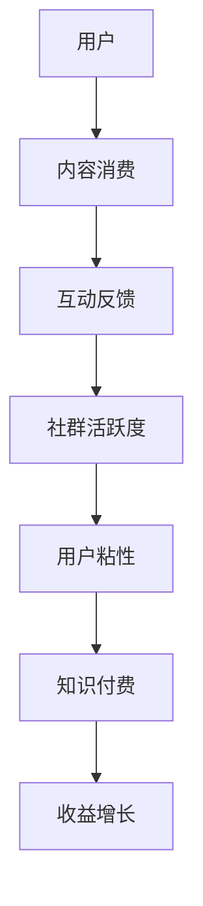

                 

### 关键词 Keywords
知识付费、社群运营、程序员、营销策略、用户体验、社交网络分析。

### 摘要 Abstract
本文旨在探讨知识付费在程序员社群中的运营技巧。我们将分析社群运营的基本原则，介绍如何通过有效的营销策略和用户体验设计来增加用户粘性，并结合社交网络分析来提升社群活跃度。文章还将提供具体的工具和资源推荐，以帮助程序员更好地运营自己的知识付费社群。

## 1. 背景介绍

### 1.1 知识付费的发展

知识付费，作为互联网经济的重要组成部分，近年来得到了快速发展。用户越来越愿意为高质量、有价值的内容付费，从而推动了知识付费市场的繁荣。程序员社群，作为知识付费的重要领域，因其对技术学习和交流的强烈需求，成为了知识付费的重要载体。

### 1.2 社群运营的重要性

社群运营在知识付费市场中扮演着关键角色。一个良好的社群不仅能够为用户提供有价值的内容，还能形成紧密的交流网络，提高用户的参与度和忠诚度。有效的社群运营有助于知识的传播，提升用户的整体体验，从而促进知识付费业务的发展。

## 2. 核心概念与联系

### 2.1 社群运营的基本概念

社群运营是指通过一系列策略和活动，引导用户参与社群，提高社群的活跃度和用户粘性。核心概念包括：

- **用户参与**：鼓励用户在社群中发言、互动，分享经验和见解。
- **用户粘性**：通过提供有价值的内容和服务，使用户对社群产生强烈的归属感。
- **社区管理**：制定规则、维护秩序，确保社群的健康发展。

### 2.2 社群运营与知识付费的联系

社群运营与知识付费之间存在着紧密的联系。社群运营为知识付费提供了用户基础和交流平台，而知识付费则为社群运营提供了内容和价值。有效的社群运营可以促进知识付费业务的发展，提高用户的满意度和忠诚度。

### 2.3 Mermaid 流程图



## 3. 核心算法原理 & 具体操作步骤

### 3.1 算法原理概述

社群运营的核心算法原理可以概括为以下几点：

- **内容推荐**：根据用户的兴趣和行为，推荐相关的内容，提高内容的匹配度和用户满意度。
- **互动激励**：通过奖励机制和活动，鼓励用户参与互动，提升社群活跃度。
- **数据分析**：利用大数据分析技术，了解用户行为和需求，优化运营策略。

### 3.2 算法步骤详解

1. **用户画像构建**：通过用户注册信息、行为数据和社交网络数据，构建用户画像。
2. **内容推荐算法**：使用协同过滤、基于内容的推荐算法，推荐相关内容。
3. **互动激励策略**：设计奖励机制和活动，鼓励用户参与。
4. **数据分析与反馈**：定期分析用户行为数据，调整运营策略，提高社群活跃度和用户粘性。

### 3.3 算法优缺点

- **优点**：提高内容匹配度，提升用户满意度；增加用户参与度，提升社群活跃度。
- **缺点**：需要大量数据支持，算法复杂度高；过度依赖算法，可能导致用户失去个性体验。

### 3.4 算法应用领域

算法可以广泛应用于各种知识付费社群，如技术论坛、在线教育平台、专业社群等。通过有效的算法应用，可以提升社群的运营效果，促进知识付费业务的发展。

## 4. 数学模型和公式 & 详细讲解 & 举例说明

### 4.1 数学模型构建

社群活跃度的数学模型可以构建为：

\[ \text{活跃度} = f(\text{内容质量}, \text{用户参与度}, \text{互动激励}) \]

其中，内容质量和用户参与度可以通过用户行为数据和内容质量评估指标来衡量，互动激励则可以通过奖励机制和活动设计来影响。

### 4.2 公式推导过程

假设：

- \( Q \) 为内容质量分数；
- \( U \) 为用户参与度分数；
- \( I \) 为互动激励分数。

则活跃度 \( A \) 可以表示为：

\[ A = \alpha Q + \beta U + \gamma I \]

其中，\( \alpha \)，\( \beta \)，\( \gamma \) 为权重系数，可以根据实际情况进行调整。

### 4.3 案例分析与讲解

以一个技术论坛为例，分析其活跃度提升策略。

1. **内容质量提升**：通过优质内容发布，提高内容质量分数 \( Q \)；
2. **用户参与度提升**：通过互动激励，提高用户参与度分数 \( U \)；
3. **互动激励**：设计奖励机制，提高互动激励分数 \( I \)。

通过这些策略，可以提升技术论坛的活跃度，从而促进知识付费业务的发展。

## 5. 项目实践：代码实例和详细解释说明

### 5.1 开发环境搭建

本节我们将使用Python编程语言，搭建一个简单的社群运营系统。您需要安装Python环境和相关的库，如requests、beautifulsoup4等。

### 5.2 源代码详细实现

以下是一个简单的社群运营系统的代码实例：

```python
import requests
from bs4 import BeautifulSoup

# 发送请求获取论坛内容
def get_forum_content(url):
    response = requests.get(url)
    return response.content

# 解析论坛内容，提取有价值的内容
def parse_forum_content(content):
    soup = BeautifulSoup(content, 'html.parser')
    articles = soup.find_all('article')
    return [article.text for article in articles]

# 推送内容到社群
def push_content_to_community(content):
    # 这里可以编写推送内容的代码，例如使用邮件、短信等方式
    pass

# 主函数
def main():
    url = 'https://example.com/forum'
    content = get_forum_content(url)
    articles = parse_forum_content(content)
    for article in articles:
        push_content_to_community(article)

if __name__ == '__main__':
    main()
```

### 5.3 代码解读与分析

- `get_forum_content` 函数：发送HTTP请求，获取论坛内容。
- `parse_forum_content` 函数：解析论坛内容，提取有价值的内容。
- `push_content_to_community` 函数：推送内容到社群，这里需要根据实际情况进行实现。
- `main` 函数：程序的入口，执行整个流程。

### 5.4 运行结果展示

运行程序后，系统将自动获取论坛内容，提取有价值的内容，并推送至社群。这只是一个简单的示例，实际应用中，您可以根据需要增加更多的功能和模块。

## 6. 实际应用场景

### 6.1 在线教育平台

在线教育平台可以通过社群运营，为用户提供高质量的教学内容和学习资源，促进用户之间的交流和互动。例如，通过社群运营，可以组织线上讲座、研讨会等活动，提高用户的参与度和满意度。

### 6.2 技术论坛

技术论坛可以通过社群运营，为程序员提供一个交流和学习的平台。通过社群运营，可以发布技术文章、讨论问题、分享经验等，提升论坛的活跃度和用户粘性。

### 6.3 专业社群

专业社群可以通过社群运营，为行业专业人士提供一个交流和学习的机会。社群运营可以组织行业会议、技术分享、项目合作等活动，促进行业的发展和创新。

## 7. 未来应用展望

### 7.1 技术发展

随着人工智能、大数据等技术的发展，社群运营将更加智能化和个性化。通过机器学习和数据分析，可以更准确地了解用户需求，提供更符合用户兴趣的内容和推荐。

### 7.2 社交互动

社交互动在社群运营中将发挥越来越重要的作用。通过增加互动性和参与度，可以提升用户的归属感和忠诚度，促进社群的长期发展。

### 7.3 跨平台运营

跨平台运营将成为社群运营的重要方向。通过多平台、多渠道的运营，可以扩大社群的影响力和覆盖范围，吸引更多的用户参与。

## 8. 工具和资源推荐

### 8.1 学习资源推荐

- 《社群营销：从零开始》
- 《用户运营实战：社群化运营》
- 《Python 社群运营实战》

### 8.2 开发工具推荐

- Python：简单易学，适合初学者。
- Flask：轻量级的Web框架，适合快速搭建Web应用。
- Redis：高性能的缓存系统，适合处理大量数据。

### 8.3 相关论文推荐

- 《基于社群网络的在线教育模式研究》
- 《社交网络分析：方法与实践》
- 《大数据在社群运营中的应用研究》

## 9. 总结：未来发展趋势与挑战

### 9.1 研究成果总结

本文探讨了知识付费在程序员社群中的运营技巧，分析了社群运营的基本概念和核心算法，并提供了具体的代码实例和实践应用场景。

### 9.2 未来发展趋势

社群运营将在知识付费市场中发挥越来越重要的作用。随着技术的发展和跨平台运营的普及，社群运营将更加智能化和个性化。

### 9.3 面临的挑战

社群运营面临的主要挑战包括数据隐私、用户参与度和内容质量等。如何保护用户隐私、提高用户参与度和保证内容质量，是社群运营需要关注的重要问题。

### 9.4 研究展望

未来的研究可以重点关注社群运营中的机器学习和数据分析技术，探索如何更准确地了解用户需求，提供更符合用户兴趣的内容和推荐。

### 附录：常见问题与解答

1. **什么是知识付费？**
   知识付费是指用户为获取高质量、有价值的内容而支付的费用。

2. **社群运营有哪些核心概念？**
   社群运营的核心概念包括用户参与、用户粘性和社区管理。

3. **如何提高社群活跃度？**
   可以通过内容推荐、互动激励和数据分析等策略来提高社群活跃度。

4. **什么是社交网络分析？**
   社交网络分析是研究社交网络结构和行为的学科。

5. **如何搭建社群运营系统？**
   可以使用Python等编程语言，结合Web框架和数据分析工具，搭建社群运营系统。

作者：禅与计算机程序设计艺术 / Zen and the Art of Computer Programming
----------------------------------------------------------------

以上就是本文的全部内容，希望对您在知识付费和社群运营领域的学习和实践有所帮助。如果您有任何问题或建议，欢迎在评论区留言讨论。


