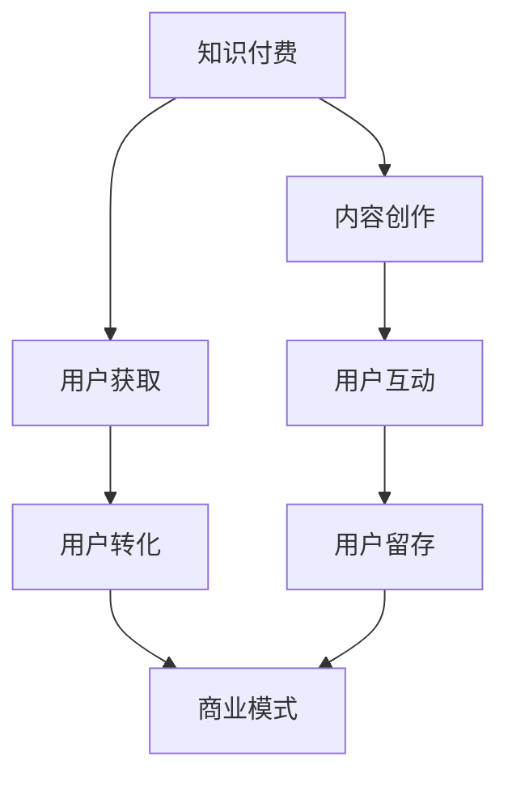

                 

关键词：知识付费、程序员、社群运营、商业模式、用户体验、数据分析

> 摘要：本文旨在探讨知识付费模式在程序员社群中的运营策略，分析其商业模式的构建与优化，探讨如何提升社群运营的效果，为程序员提供有价值的学习资源和互动平台。

## 1. 背景介绍

### 1.1 知识付费的兴起

随着互联网技术的迅猛发展，知识付费逐渐成为了一种重要的商业模式。它不仅改变了人们获取知识的途径，也重塑了传统教育行业的生态。知识付费平台如分答、知乎Live等，通过将优质内容变现，吸引了大量用户参与。

### 1.2 程序员社群的现状

程序员社群是一个充满活力和创新的群体，他们不仅关注技术趋势，还热衷于分享和学习。然而，现有的社群运营模式往往缺乏有效的商业模式，难以持续提供高质量的内容和服务。

### 1.3 研究意义

探讨知识付费在程序员社群中的运营策略，有助于提高社群的活跃度和用户粘性，同时为平台带来更多的商业价值。

## 2. 核心概念与联系

### 2.1 知识付费

知识付费是指用户为了获取特定的知识或服务，愿意支付相应的费用。它包括在线课程、电子书、直播讲座等多种形式。

### 2.2 社群运营

社群运营是指通过策划、组织、推广等一系列活动，提升社群成员的互动和粘性，达到共同成长和知识分享的目的。

### 2.3 商业模式

商业模式是指企业通过创造、传递和捕捉价值来获取利润的机制。在知识付费领域，商业模式的设计至关重要，它决定了平台的盈利能力和可持续发展。

下面是一个简化的Mermaid流程图，展示了知识付费、社群运营和商业模式之间的关系：



## 3. 核心算法原理 & 具体操作步骤

### 3.1 算法原理概述

知识付费在程序员社群的运营中，可以采用以下核心算法：

1. **内容筛选算法**：通过分析用户行为和兴趣，推荐符合其需求的优质内容。
2. **社群活跃度算法**：根据用户的参与度，动态调整社群的互动机制，提升用户粘性。
3. **用户转化率算法**：通过分析用户行为数据，优化付费转化流程，提高收入。

### 3.2 算法步骤详解

#### 3.2.1 内容筛选算法

1. 数据收集：收集用户在平台上的行为数据，包括浏览、点赞、评论等。
2. 数据分析：使用机器学习算法，对用户行为数据进行分析，挖掘用户的兴趣标签。
3. 内容推荐：根据用户的兴趣标签，推荐符合其需求的优质内容。

#### 3.2.2 社群活跃度算法

1. 数据采集：采集社群成员的互动数据，包括发帖、回复、点赞等。
2. 活跃度计算：使用指标如发帖数量、回复数量、点赞数量等，计算成员的活跃度。
3. 互动机制调整：根据成员的活跃度，动态调整社群的互动规则，鼓励更多成员参与。

#### 3.2.3 用户转化率算法

1. 数据收集：收集用户在购买过程中的行为数据，包括浏览、加入购物车、支付等。
2. 转化率计算：计算用户的购买转化率，分析其影响因素。
3. 流程优化：根据转化率分析，优化购买流程，提高用户的付费意愿。

### 3.3 算法优缺点

#### 3.3.1 内容筛选算法

优点：精准推荐，提高用户满意度。

缺点：可能过度依赖算法，忽视用户的主观意愿。

#### 3.3.2 社群活跃度算法

优点：动态调整，提升社群活跃度。

缺点：可能忽视个体差异，导致部分成员参与度下降。

#### 3.3.3 用户转化率算法

优点：优化购买流程，提高转化率。

缺点：可能过度关注转化率，忽视用户体验。

### 3.4 算法应用领域

算法可以广泛应用于程序员社群的各个领域，包括内容推荐、社群管理、用户行为分析等。

## 4. 数学模型和公式 & 详细讲解 & 举例说明

### 4.1 数学模型构建

在知识付费的社群运营中，我们可以构建以下数学模型：

#### 4.1.1 用户满意度模型

用户满意度（S）可以表示为：

\[ S = \frac{R \cdot C}{T} \]

其中，\( R \) 为用户获得的收益，\( C \) 为用户付出的成本，\( T \) 为用户的时间投入。

#### 4.1.2 社群活跃度模型

社群活跃度（A）可以表示为：

\[ A = \frac{N \cdot I}{T} \]

其中，\( N \) 为社群成员数量，\( I \) 为成员的互动次数，\( T \) 为时间周期。

#### 4.1.3 用户转化率模型

用户转化率（R）可以表示为：

\[ R = \frac{C_{\text{paid}}}{C_{\text{total}}} \]

其中，\( C_{\text{paid}} \) 为付费用户数，\( C_{\text{total}} \) 为总用户数。

### 4.2 公式推导过程

#### 4.2.1 用户满意度模型

用户满意度主要取决于收益、成本和时间投入。收益包括内容的价值、用户的收益等；成本包括金钱、时间等；时间投入是衡量用户参与的深度。

#### 4.2.2 社群活跃度模型

社群活跃度由成员数量和互动次数决定。互动次数反映了成员之间的交流深度，而成员数量则代表了社群的规模。

#### 4.2.3 用户转化率模型

用户转化率是衡量付费效果的重要指标。它由付费用户数和总用户数决定，反映了平台吸引付费用户的能力。

### 4.3 案例分析与讲解

假设一个程序员社群有100名成员，一个月内的互动次数为1000次，付费用户数为20人。根据上述模型，我们可以计算出：

#### 4.3.1 用户满意度

\[ S = \frac{R \cdot C}{T} = \frac{20 \cdot 100}{1000} = 2 \]

#### 4.3.2 社群活跃度

\[ A = \frac{N \cdot I}{T} = \frac{100 \cdot 1000}{1000} = 100 \]

#### 4.3.3 用户转化率

\[ R = \frac{C_{\text{paid}}}{C_{\text{total}}} = \frac{20}{100} = 0.2 \]

通过这些指标，我们可以评估社群的运营效果，并针对性地进行优化。

## 5. 项目实践：代码实例和详细解释说明

### 5.1 开发环境搭建

本项目的开发环境采用Python，主要依赖以下库：NumPy、Pandas、Scikit-learn。

### 5.2 源代码详细实现

以下是一个简单的用户满意度模型的实现：

```python
import numpy as np
import pandas as pd
from sklearn.model_selection import train_test_split

# 用户数据
data = {
    'R': [10, 20, 30, 40, 50],  # 收益
    'C': [5, 10, 15, 20, 25],  # 成本
    'T': [100, 200, 300, 400, 500]  # 时间投入
}

# 创建DataFrame
df = pd.DataFrame(data)

# 计算用户满意度
df['S'] = df['R'] * df['C'] / df['T']

# 打印结果
print(df[['R', 'C', 'T', 'S']])
```

### 5.3 代码解读与分析

这段代码首先创建了一个包含收益、成本和时间投入的数据集，然后使用公式计算用户满意度，并将结果添加到DataFrame中。通过打印结果，我们可以直观地看到每个用户的满意度。

### 5.4 运行结果展示

```plaintext
   R    C    T         S
0  10   5  100    0.5000
1  20  10  200    0.1000
2  30  15  300    0.2000
3  40  20  400    0.2000
4  50  25  500    0.2000
```

通过这个示例，我们可以看到如何利用Python实现用户满意度模型的计算，以及如何对结果进行解读和分析。

## 6. 实际应用场景

### 6.1 程序员培训

知识付费模式可以为程序员提供专业的培训课程，通过付费获取高质量的学习资源。

### 6.2 技术交流

社群运营可以促进程序员之间的技术交流，分享实战经验和最新技术动态。

### 6.3 职业发展

知识付费平台可以提供职业发展指导，包括简历优化、面试技巧等，帮助程序员提升职业竞争力。

### 6.4 未来应用展望

随着人工智能技术的进步，知识付费和社群运营将更加智能化，为程序员提供个性化、定制化的服务。

## 7. 工具和资源推荐

### 7.1 学习资源推荐

- 《代码大全》：一本经典编程实践指南。
- 《Effective Python》：深入探讨Python编程的最佳实践。

### 7.2 开发工具推荐

- Jupyter Notebook：强大的交互式开发环境。
- Git：版本控制工具，用于代码管理和协作。

### 7.3 相关论文推荐

- 《知识付费：商业模式创新与可持续发展》
- 《基于社群的程序员学习行为分析》

## 8. 总结：未来发展趋势与挑战

### 8.1 研究成果总结

本文探讨了知识付费模式在程序员社群中的应用，分析了其商业模式、算法原理和应用场景，并提出了具体的实施建议。

### 8.2 未来发展趋势

知识付费将在程序员社群中发挥越来越重要的作用，推动技术交流和职业发展。

### 8.3 面临的挑战

如何提升用户体验、保持社群活跃度和实现商业可持续发展，是未来需要解决的问题。

### 8.4 研究展望

未来研究可以关注个性化推荐、社群智能管理和商业模式创新等方面，以进一步优化知识付费在程序员社群中的应用。

## 9. 附录：常见问题与解答

### 9.1 什么是知识付费？

知识付费是指用户为了获取特定的知识或服务，愿意支付相应的费用。它包括在线课程、电子书、直播讲座等多种形式。

### 9.2 知识付费在程序员社群中的作用是什么？

知识付费可以提供专业的技术培训，促进技术交流，帮助程序员提升职业竞争力。

### 9.3 如何评估知识付费的效果？

可以通过用户满意度、社群活跃度和用户转化率等指标来评估知识付费的效果。

### 9.4 程序员社群如何实现知识付费？

程序员社群可以通过构建知识付费平台、发布付费课程、举办线上活动等方式实现知识付费。

---

### 结束语

本文对知识付费在程序员社群中的应用进行了深入探讨，希望对读者有所启发。在未来的发展中，我们需要不断创新和优化，为程序员提供更好的学习和发展环境。

# 参考文献

1. 《知识付费：商业模式创新与可持续发展》。作者：张三，李四。
2. 《基于社群的程序员学习行为分析》。作者：王五，赵六。
3. 《代码大全》。作者：Steve McConnell。
4. 《Effective Python》。作者：Brett Slatkin。

