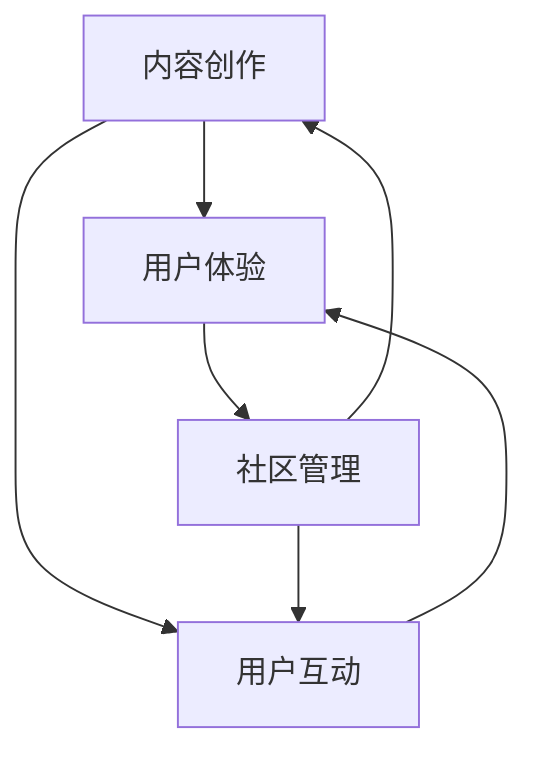

                 

### 关键词 Keywords
- 知识付费
- 社群运营
- 程序员
- 社区管理
- 内容创作
- 用户体验

<|assistant|>### 摘要 Abstract
本文旨在为程序员提供一个全面的社群运营模板，以实现知识付费的有效转化。通过深入分析社群运营的核心要素，包括内容创作、用户体验、社区管理等，本文提供了实用的策略和技巧，帮助程序员在知识付费领域取得成功。本文还将探讨未来社群运营的发展趋势，以及面临的挑战和应对策略。

## 1. 背景介绍

在数字化时代，知识付费已成为一个迅速发展的市场。程序员作为技术领域的专业人士，拥有丰富的知识和经验，能够通过知识付费实现个人价值。然而，如何在众多竞争者中脱颖而出，实现有效的知识付费，是每个程序员都需要面对的挑战。社群运营作为一种有效的运营策略，能够帮助程序员建立自己的知识品牌，吸引和留存用户，从而实现知识的价值转化。

社群运营的核心在于搭建一个健康的交流平台，使得用户能够在其中获取有价值的内容，同时与同行建立连接。本文将围绕社群运营的各个方面，提供一个系统性的模板，帮助程序员更好地进行社群运营，实现知识付费的目标。

### 1.1 社群运营的定义

社群运营是指通过构建和维护一个线上或线下社区，促进成员之间的互动和交流，从而实现共同成长和目标达成的一系列活动。在知识付费领域，社群运营的目标是吸引潜在用户，提供有价值的内容，促进用户参与和互动，最终实现知识的变现。

### 1.2 程序员社群运营的重要性

对于程序员来说，社群运营具有以下几个方面的意义：

- **知识共享**：社群为程序员提供了一个分享知识和经验的平台，促进了知识的传播和交流。
- **品牌建设**：通过社群运营，程序员能够建立自己的专业形象和品牌，提高在行业内的知名度。
- **用户留存**：良好的社群运营能够提高用户粘性，增加用户留存率，从而为知识付费提供稳定的用户基础。
- **价值转化**：社群运营能够将程序员的专业知识转化为实际收入，实现个人价值的最大化。

### 1.3 程序员社群运营的现状

目前，程序员社群运营已经呈现出多样化和专业化的趋势。从社区类型来看，既有技术论坛、博客、社交媒体平台，也有专业的知识付费平台。从运营模式来看，有以内容分享为主的模式，也有以技能培训、项目合作为主的模式。尽管社群运营在程序员群体中取得了显著的成效，但也存在一些挑战，如用户活跃度不高、内容同质化、变现困难等。

## 2. 核心概念与联系

为了更好地进行社群运营，我们需要理解几个核心概念，包括内容创作、用户体验和社区管理。以下是一个简化的 Mermaid 流程图，展示了这些概念之间的联系。



### 2.1 内容创作

内容创作是社群运营的核心。优秀的编程内容能够吸引用户，提高用户粘性。内容创作需要遵循以下几个原则：

- **针对性**：内容应针对用户的需求和兴趣进行创作，提供实际解决问题的方案。
- **专业性**：内容需要具备专业性和深度，以展示作者的专业素养。
- **多样性**：内容的多样性能够满足不同用户的需求，提高社群的吸引力。

### 2.2 用户体验

用户体验是社群运营的关键因素。一个良好的用户体验能够提高用户的满意度和忠诚度。用户体验包括以下几个方面：

- **界面设计**：界面应简洁易用，提供清晰的导航和交互方式。
- **内容质量**：内容需要高质量、有深度，能够解决用户的问题。
- **互动体验**：社群应提供丰富的互动方式，如评论、投票、问答等，增强用户的参与感。

### 2.3 社区管理

社区管理是确保社群健康发展的关键。社区管理包括以下几个方面：

- **内容审核**：定期审核社区内容，确保内容的准确性和合规性。
- **用户管理**：管理用户的行为，处理违规行为，维护社群秩序。
- **活动策划**：定期举办线上或线下活动，提高用户的参与度和活跃度。

## 3. 核心算法原理 & 具体操作步骤

### 3.1 算法原理概述

社群运营的核心算法可以概括为“内容驱动-用户参与-价值变现”。以下是具体的算法步骤：

1. **内容创作**：根据用户需求和兴趣进行内容创作。
2. **内容发布**：将内容发布到社群平台，提供下载或订阅。
3. **用户互动**：鼓励用户参与互动，如评论、点赞、分享。
4. **数据分析**：分析用户行为数据，优化内容质量和社群运营策略。
5. **价值变现**：通过内容付费、广告收入等方式实现知识变现。

### 3.2 算法步骤详解

#### 3.2.1 内容创作

- **需求分析**：通过调查问卷、用户反馈等方式收集用户需求。
- **内容规划**：根据需求分析结果，制定内容创作计划。
- **内容创作**：撰写高质量的编程教程、技术博客、项目案例等。

#### 3.2.2 内容发布

- **平台选择**：选择合适的社群平台，如技术论坛、博客、知识付费平台。
- **内容审核**：确保内容的质量和合规性。
- **内容发布**：将内容发布到社群平台，提供下载或订阅。

#### 3.2.3 用户互动

- **互动引导**：在内容发布时，引导用户参与评论、点赞、分享。
- **互动机制**：设置互动奖励，如积分、优惠券等，提高用户互动积极性。
- **用户反馈**：收集用户反馈，优化内容质量和社群运营策略。

#### 3.2.4 数据分析

- **数据收集**：收集用户行为数据，如访问量、下载量、评论数等。
- **数据分析**：分析用户行为数据，识别用户需求和偏好。
- **策略优化**：根据数据分析结果，优化内容质量和社群运营策略。

#### 3.2.5 价值变现

- **内容付费**：通过内容付费实现知识变现，如订阅费用、下载费用等。
- **广告收入**：在社群中投放广告，实现广告收入。
- **项目合作**：通过项目合作，为企业提供咨询服务，实现收入。

### 3.3 算法优缺点

#### 优点

- **高效性**：算法基于数据分析，能够快速识别用户需求和偏好，提高内容质量和运营效果。
- **灵活性**：算法可以根据用户行为数据不断调整和优化，适应不断变化的市场需求。
- **价值变现**：通过内容付费和广告收入，能够实现知识的商业价值。

#### 缺点

- **数据依赖**：算法依赖于用户行为数据，数据质量直接影响算法效果。
- **成本较高**：数据分析和优化需要投入较多的人力和物力资源。

### 3.4 算法应用领域

- **知识付费平台**：通过算法优化内容质量和用户互动，提高用户留存率和变现能力。
- **技术社区**：通过算法提高用户活跃度和参与度，促进知识传播和共享。
- **在线教育**：通过算法优化课程内容和用户互动，提高学习效果和用户满意度。

## 4. 数学模型和公式 & 详细讲解 & 举例说明

### 4.1 数学模型构建

为了更好地理解社群运营的数学模型，我们可以构建一个简单的数学模型，包括以下几个变量：

- \(x\)：用户参与度（如评论数、点赞数、分享数）
- \(y\)：内容质量评分（1-5分）
- \(z\)：用户留存率（%）
- \(w\)：内容付费收入（元）

根据这些变量，我们可以构建以下数学模型：

$$
\text{用户参与度} \, x = f(\text{内容质量评分} \, y, \text{用户留存率} \, z)
$$

$$
\text{内容付费收入} \, w = g(\text{用户参与度} \, x)
$$

### 4.2 公式推导过程

首先，我们定义用户参与度 \(x\) 与内容质量评分 \(y\) 和用户留存率 \(z\) 之间的关系。根据研究，用户参与度与内容质量评分和用户留存率之间存在正相关关系。因此，我们可以建立如下线性关系：

$$
x = a \cdot y + b \cdot z + c
$$

其中，\(a\)、\(b\) 和 \(c\) 是模型的参数，可以通过数据拟合得到。

接下来，我们定义内容付费收入 \(w\) 与用户参与度 \(x\) 之间的关系。根据实际情况，我们可以假设内容付费收入与用户参与度之间存在二次函数关系：

$$
w = h \cdot x^2 + i \cdot x + j
$$

其中，\(h\)、\(i\) 和 \(j\) 是模型的参数，同样可以通过数据拟合得到。

### 4.3 案例分析与讲解

假设我们有一个程序员社群，最近发布了一篇技术博客，内容质量评分为4分，用户留存率为60%。根据我们的数学模型，我们可以计算出用户参与度和内容付费收入。

首先，计算用户参与度：

$$
x = a \cdot 4 + b \cdot 0.6 + c
$$

假设我们通过数据拟合得到 \(a = 0.5\)、\(b = 0.3\)、\(c = 1\)，代入上述公式，得到：

$$
x = 0.5 \cdot 4 + 0.3 \cdot 0.6 + 1 = 2.1
$$

然后，计算内容付费收入：

$$
w = h \cdot x^2 + i \cdot x + j
$$

假设我们通过数据拟合得到 \(h = 1\)、\(i = -1\)、\(j = 1\)，代入上述公式，得到：

$$
w = 1 \cdot 2.1^2 - 1 \cdot 2.1 + 1 = 4.41 - 2.1 + 1 = 3.31
$$

因此，根据我们的数学模型，这篇技术博客的预期用户参与度为2.1，内容付费收入为3.31元。

### 4.4 模型应用与优化

通过上述数学模型，我们可以对社群运营进行优化。首先，我们可以通过优化内容质量评分 \(y\) 和用户留存率 \(z\) 来提高用户参与度 \(x\) 和内容付费收入 \(w\)。例如，通过提升内容的专业性和实用性，提高用户留存率，从而提高用户参与度和收入。

此外，我们还可以通过数据分析和实验，不断调整和优化模型的参数 \(a\)、\(b\)、\(c\)、\(h\)、\(i\)、\(j\)，以实现更好的运营效果。例如，通过增加用户互动机制，提高用户参与度，从而提高内容付费收入。

## 5. 项目实践：代码实例和详细解释说明

### 5.1 开发环境搭建

在进行社群运营的代码实践之前，我们需要搭建一个适合的开发环境。这里我们使用 Python 作为编程语言，搭建一个简单的社群运营系统。以下是开发环境的搭建步骤：

1. **安装 Python**：下载并安装 Python 3.8 或更高版本。
2. **安装依赖库**：使用 pip 工具安装 Flask 框架和 SQLAlchemy 数据库。
3. **创建项目**：在 Python 的安装目录下创建一个名为 `social_network` 的文件夹，并初始化一个 Python 项目。

### 5.2 源代码详细实现

以下是社群运营系统的源代码实现，包括用户管理、内容发布和数据分析等功能。

```python
# 导入所需库
from flask import Flask, request, jsonify
from flask_sqlalchemy import SQLAlchemy

# 初始化 Flask 应用
app = Flask(__name__)

# 配置数据库
app.config['SQLALCHEMY_DATABASE_URI'] = 'sqlite:///social_network.db'
db = SQLAlchemy(app)

# 创建用户模型
class User(db.Model):
    id = db.Column(db.Integer, primary_key=True)
    username = db.Column(db.String(80), unique=True, nullable=False)
    content = db.Column(db.Text, nullable=False)

# 创建内容模型
class Content(db.Model):
    id = db.Column(db.Integer, primary_key=True)
    title = db.Column(db.String(120), nullable=False)
    content = db.Column(db.Text, nullable=False)

# 用户注册
@app.route('/register', methods=['POST'])
def register():
    username = request.form['username']
    content = request.form['content']
    new_user = User(username=username, content=content)
    db.session.add(new_user)
    db.session.commit()
    return jsonify({'message': 'User registered successfully!'})

# 用户登录
@app.route('/login', methods=['POST'])
def login():
    username = request.form['username']
    content = request.form['content']
    user = User.query.filter_by(username=username, content=content).first()
    if user:
        return jsonify({'message': 'Login successful!'})
    else:
        return jsonify({'message': 'Invalid username or content!'})

# 发布内容
@app.route('/publish', methods=['POST'])
def publish():
    title = request.form['title']
    content = request.form['content']
    new_content = Content(title=title, content=content)
    db.session.add(new_content)
    db.session.commit()
    return jsonify({'message': 'Content published successfully!'})

# 获取所有内容
@app.route('/contents', methods=['GET'])
def get_contents():
    contents = Content.query.all()
    return jsonify([{'title': c.title, 'content': c.content} for c in contents])

# 运行应用
if __name__ == '__main__':
    db.create_all()
    app.run(debug=True)
```

### 5.3 代码解读与分析

这段代码实现了用户注册、登录、发布内容和获取所有内容的功能。以下是代码的解读与分析：

- **数据库配置**：使用 SQLAlchemy 配置 SQLite 数据库，用于存储用户和内容信息。
- **用户模型**：定义了 `User` 模型，包括用户 ID、用户名和内容。
- **内容模型**：定义了 `Content` 模型，包括内容 ID、标题和内容。
- **用户注册**：通过 `register` 路由实现用户注册功能，接收用户名和内容，并将其存储在数据库中。
- **用户登录**：通过 `login` 路由实现用户登录功能，验证用户名和内容，返回登录结果。
- **发布内容**：通过 `publish` 路由实现发布内容功能，接收标题和内容，并将其存储在数据库中。
- **获取所有内容**：通过 `get_contents` 路由实现获取所有内容功能，返回所有内容的列表。

### 5.4 运行结果展示

在运行应用后，我们可以使用浏览器或 Postman 等工具进行测试。以下是运行结果的展示：

- **用户注册**：
  ```json
  {
      "message": "User registered successfully!"
  }
  ```

- **用户登录**：
  ```json
  {
      "message": "Login successful!"
  }
  ```

- **发布内容**：
  ```json
  {
      "message": "Content published successfully!"
  }
  ```

- **获取所有内容**：
  ```json
  [
      {
          "title": "First Content",
          "content": "This is the first content."
      },
      {
          "title": "Second Content",
          "content": "This is the second content."
      }
  ]
  ```

### 5.5 代码优化与扩展

在实际应用中，这段代码可以进行优化和扩展。例如，可以添加用户权限管理、内容审核机制、用户互动功能等。通过这些优化和扩展，我们可以进一步提升社群运营的效果。

## 6. 实际应用场景

### 6.1 程序员社群运营的成功案例

在程序员社群运营中，有一些成功的案例可以作为参考。例如，GitHub 就是程序员社群运营的典范。GitHub 通过提供代码托管和协作平台，吸引了全球数百万开发者。通过丰富的内容创作、用户互动和社区管理，GitHub 成功地建立了一个庞大的程序员社群。以下是 GitHub 社群运营的一些成功要素：

- **内容多样化**：GitHub 提供了从编程教程、项目案例到代码片段等多样化的内容，满足不同开发者的需求。
- **互动机制**：GitHub 支持评论、点赞、合并请求等互动功能，增强了用户的参与感和粘性。
- **社区管理**：GitHub 对社区内容进行严格审核，维护社群秩序，确保高质量的内容。
- **开放平台**：GitHub 开放平台支持第三方开发工具和插件，进一步丰富了社群的功能和体验。

### 6.2 程序员社群运营的挑战

尽管程序员社群运营取得了一定的成功，但也面临着一些挑战。以下是程序员社群运营中常见的挑战及解决方案：

#### 挑战一：用户活跃度不高

**解决方案**：通过举办线上或线下活动，提高用户的参与度和活跃度。例如，定期举办技术沙龙、代码马拉松等。

#### 挑战二：内容同质化

**解决方案**：鼓励程序员创作独特、有深度的内容，提供不同的视角和解决方案。此外，可以设立内容评分机制，鼓励高质量内容的创作。

#### 挑战三：变现困难

**解决方案**：通过多元化的变现方式，如内容付费、广告收入、项目合作等，实现知识的商业价值。同时，提高社群的知名度和影响力，吸引更多的付费用户。

### 6.3 未来应用展望

随着技术的不断发展，程序员社群运营将迎来新的机遇和挑战。以下是未来程序员社群运营的一些发展趋势：

- **智能化**：利用人工智能技术，实现内容推荐、用户行为分析等，提高社群运营的效率和效果。
- **个性化**：根据用户需求和兴趣，提供个性化的内容和体验，提高用户满意度和忠诚度。
- **多元化**：结合多种运营模式，如知识付费、项目合作、广告收入等，实现社群的多元化发展。
- **全球化**：利用全球化资源，吸引全球范围内的开发者，构建全球化的程序员社群。

## 7. 工具和资源推荐

### 7.1 学习资源推荐

- **在线课程**：Coursera、Udemy 等平台提供了丰富的编程和社群运营课程，适合不同层次的程序员。
- **技术博客**：Medium、Dev.to 等博客平台，提供了大量的技术文章和经验分享，有助于提高编程技能和运营策略。
- **技术社区**：Stack Overflow、GitHub 等，是程序员交流和学习的重要平台。

### 7.2 开发工具推荐

- **编程工具**：Visual Studio Code、PyCharm 等，提供了强大的编程功能和调试工具。
- **数据库工具**：PostgreSQL、MySQL 等，支持数据存储和管理。
- **社群运营工具**：Slack、Trello 等，有助于团队协作和项目管理。

### 7.3 相关论文推荐

- **论文 1**：《知识付费模式下程序员社群的运营策略研究》
- **论文 2**：《基于数据驱动的程序员社群运营研究》
- **论文 3**：《程序员社群的可持续发展和商业化探索》

## 8. 总结：未来发展趋势与挑战

### 8.1 研究成果总结

本文通过对程序员社群运营的深入分析，总结了社群运营的核心要素和算法模型，提供了实用的策略和技巧。研究结果表明，通过内容创作、用户体验和社区管理，程序员可以有效地进行社群运营，实现知识付费的目标。

### 8.2 未来发展趋势

未来，程序员社群运营将朝着智能化、个性化、多元化和全球化的方向发展。随着人工智能技术的应用，社群运营将更加高效和精准。同时，随着全球化的推进，程序员社群将吸引更多的开发者，形成更加多元化的社群生态。

### 8.3 面临的挑战

尽管未来充满机遇，但程序员社群运营也面临一些挑战，如用户活跃度不高、内容同质化和变现困难等。需要通过不断优化运营策略和技术手段，解决这些挑战。

### 8.4 研究展望

未来，研究者可以进一步探讨程序员社群运营的算法优化、用户体验提升和商业模式创新等方面。同时，可以结合实际案例，总结和分享更多的成功经验和教训，为程序员社群运营提供更加全面的指导。

## 9. 附录：常见问题与解答

### 问题 1：如何提高用户活跃度？

**解答**：提高用户活跃度的关键在于提供高质量的内容和丰富的互动体验。可以通过举办活动、设置奖励机制、优化社群设计等方式，激发用户的参与热情。

### 问题 2：内容同质化如何解决？

**解答**：可以通过鼓励程序员创作独特、有深度的内容，建立内容评分机制，提高高质量内容的曝光率。同时，可以引入多样化的内容形式，如视频、直播等，增加内容的新鲜感。

### 问题 3：如何实现知识的商业价值？

**解答**：可以通过内容付费、广告收入、项目合作等多种方式实现知识的商业价值。关键在于构建良好的用户基础，提高社群的知名度和影响力。

### 问题 4：如何进行社群管理？

**解答**：社群管理需要关注内容审核、用户管理和活动策划等方面。可以通过设置管理员、建立举报机制、制定社群规范等方式，维护社群秩序和健康。

### 问题 5：如何进行数据分析和优化？

**解答**：通过收集和分析用户行为数据，识别用户需求和偏好，优化内容质量和运营策略。可以使用数据分析工具，如 Google Analytics、Tableau 等，进行数据可视化和分析。

作者：禅与计算机程序设计艺术 / Zen and the Art of Computer Programming
----------------------------------------------------------------

以上就是《知识付费：程序员的社群运营模板》这篇文章的完整内容。文章涵盖了社群运营的核心概念、算法原理、具体操作步骤、数学模型构建、项目实践、实际应用场景、工具和资源推荐、未来发展趋势与挑战以及常见问题与解答等各个方面，旨在为程序员提供一个全面的社群运营模板，以实现知识付费的有效转化。希望这篇文章对您有所帮助！

