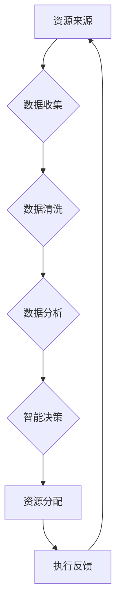

                 

### 引言 Introduction

在当今快速变化的技术环境中，初创企业面临着诸多挑战。从技术研发到市场推广，每一个环节都充满了不确定性和风险。然而，在这些挑战中，资源对接的困难往往是初创企业能否成功的关键因素之一。知识加速器作为一种新兴的服务模式，旨在通过提供资源对接，帮助初创企业突破发展瓶颈，加速成长。

本文将探讨知识加速器在资源对接中的作用，分析其如何助力初创企业的发展。我们将从以下几个方面展开讨论：

1. **背景介绍**：介绍知识加速器的起源、发展及其在当前科技环境中的重要性。
2. **核心概念与联系**：阐述知识加速器的核心概念及其在资源对接中的具体作用。
3. **核心算法原理**：介绍知识加速器中应用的核心算法及其原理。
4. **数学模型和公式**：讲解知识加速器中使用的数学模型和公式。
5. **项目实践**：通过实际案例展示知识加速器的应用。
6. **实际应用场景**：分析知识加速器在不同领域的应用。
7. **未来展望**：探讨知识加速器的未来发展趋势和潜在挑战。
8. **工具和资源推荐**：推荐相关的学习资源和开发工具。
9. **总结**：总结研究成果，提出未来展望。

通过这篇文章，希望能够为初创企业提供一个深入了解知识加速器的视角，并为其发展提供有价值的参考。

### 背景介绍 Background

知识加速器（Knowledge Accelerator）这一概念最早在20世纪90年代由人工智能专家提出，旨在通过高效的资源整合和信息处理，加速知识的生产和传播。知识加速器不仅仅是一个工具或系统，而是一种理念，它强调通过创新的方式，将分散的知识资源进行有效整合，从而为各类组织，特别是初创企业，提供快速发展的动力。

知识加速器的发展历程与科技环境的变迁密切相关。从互联网的兴起，到大数据和人工智能技术的成熟，知识加速器逐步演变为一种重要的服务模式。它的发展历程可以分为以下几个阶段：

1. **初期阶段**：知识加速器最初主要应用于学术研究领域，通过信息检索和知识整合，提高科研效率。
2. **发展阶段**：随着互联网的普及，知识加速器开始向企业级应用拓展。企业通过知识加速器进行市场调研、产品设计、客户服务等环节的优化。
3. **成熟阶段**：大数据和人工智能技术的广泛应用，使得知识加速器在数据处理、智能决策等方面的能力得到了显著提升。

当前，知识加速器在科技环境中的重要性日益凸显。首先，它能够帮助初创企业快速获取和整合外部资源，如技术、资金、人才等，从而缩短产品从研发到市场推广的周期。其次，知识加速器通过智能化的数据分析，为企业提供精准的市场洞察和决策支持，降低业务风险。此外，知识加速器还能够促进企业内部的协作与创新，提高整体运营效率。

知识加速器的应用范围广泛，包括但不限于以下几个方面：

1. **技术研发**：知识加速器可以帮助初创企业快速获取前沿技术信息，优化研发流程。
2. **市场推广**：通过大数据分析，知识加速器能够为企业提供精准的市场定位和营销策略。
3. **人力资源**：知识加速器可以帮助企业进行人才招聘和团队建设，提高团队的整体素质。
4. **企业管理**：知识加速器通过智能化的数据分析，为企业提供全面的经营决策支持。

总的来说，知识加速器作为一种创新的资源对接服务模式，在当前科技环境中扮演着越来越重要的角色。它不仅为初创企业提供了强有力的支持，也推动了整个科技行业的快速发展。随着技术的不断进步，知识加速器在未来有望在更广泛的领域中发挥更大的作用。

### 核心概念与联系 Core Concepts and Connections

知识加速器的核心概念可以概括为资源整合、信息处理和智能决策。为了更好地理解这些核心概念，我们可以通过一个Mermaid流程图来展示知识加速器在资源对接中的具体作用。



1. **资源来源**（A）：知识加速器首先需要从各种渠道收集资源，包括公开数据、内部数据和市场调研数据等。这些资源是知识加速器运行的基础。

2. **数据收集**（B）：通过数据爬取、API接口、问卷调查等多种方式，知识加速器将收集到的数据整合到一个统一的数据仓库中。

3. **数据清洗**（C）：收集到的数据往往存在噪声和不一致性，通过数据清洗，知识加速器可以去除重复数据、填补缺失值、纠正错误数据，从而保证数据的质量。

4. **数据分析**（D）：在数据清洗后，知识加速器使用各种数据分析技术，如统计分析、机器学习等，对数据进行深入挖掘，以提取有用的信息和模式。

5. **智能决策**（E）：基于分析结果，知识加速器利用智能算法，如决策树、神经网络等，为企业提供智能化的决策支持，如市场推广策略、产品优化建议等。

6. **资源分配**（F）：根据智能决策的结果，知识加速器将资源进行有效分配，如将资金投向最具有潜力的市场、将研发资源集中于最前沿的技术等。

7. **执行反馈**（G）：资源分配后，知识加速器会收集执行过程中的反馈数据，如销售额、用户反馈等，并将其用于下一次的数据分析，形成一个闭环系统，不断优化和调整决策。

通过这个Mermaid流程图，我们可以清晰地看到知识加速器在资源对接中的工作流程。资源整合（A-B-C）、信息处理（D-E）和智能决策（F-G）构成了知识加速器的核心工作流程，三者相互关联，共同促进了初创企业的发展。

### 核心算法原理 Core Algorithm Principles

在知识加速器中，核心算法的原理是其高效运作的关键。这些算法不仅负责数据的收集和处理，还为企业提供了智能化的决策支持。以下是对知识加速器中应用的主要核心算法及其原理的详细讲解。

#### 1. 数据收集算法

数据收集算法是知识加速器的第一步，其目标是高效地从各种来源收集数据，确保数据的全面性和准确性。常用的数据收集算法包括以下几种：

1. **爬虫算法**：爬虫算法通过模拟浏览器行为，自动获取互联网上的公开数据。常用的爬虫工具有Scrapy、BeautifulSoup等。爬虫算法的核心原理是通过URL进行递归访问，获取网页内容，然后对内容进行解析和提取。

2. **API接口**：API（应用程序接口）是一种允许不同系统之间相互通信的接口。知识加速器通过调用第三方API，获取如天气数据、股票信息等实时数据。API接口的优点在于速度快、数据准确，但需要确保第三方服务的稳定性和安全性。

3. **问卷调查**：问卷调查是一种直接获取用户反馈的方法。知识加速器可以通过在线问卷、电话调查等方式收集用户数据，从而了解市场需求和用户偏好。

#### 2. 数据处理算法

在数据收集后，数据处理算法负责对数据进行清洗、整合和预处理，以去除噪声和异常值，提高数据质量。以下是几种常用的数据处理算法：

1. **数据清洗算法**：数据清洗算法用于处理缺失值、异常值和重复值。常用的方法包括删除重复记录、填补缺失值和纠正错误数据。Python中的Pandas库提供了丰富的数据清洗功能，如drop_duplicates()、fillna()等。

2. **数据整合算法**：数据整合算法用于将来自不同来源的数据进行合并，形成一个统一的数据集。常用的方法包括合并（merge）、连接（join）等。Python中的Pandas库提供了便捷的数据整合功能。

3. **数据预处理算法**：数据预处理算法包括特征工程、数据标准化等。特征工程通过提取和构造特征，提高模型的预测能力；数据标准化通过缩放数据，使其在相同尺度上进行分析。

#### 3. 数据分析算法

在数据处理完成后，数据分析算法用于深入挖掘数据中的模式和规律，为企业提供智能化的决策支持。以下是几种常用的数据分析算法：

1. **统计分析算法**：统计分析算法用于描述数据的分布特征和内在关系。常用的方法包括描述性统计、相关分析、回归分析等。Python中的SciPy和Statsmodels库提供了丰富的统计分析功能。

2. **机器学习算法**：机器学习算法通过训练模型，从数据中自动提取特征和规律，用于预测和分类。常用的算法包括线性回归、决策树、随机森林、支持向量机（SVM）等。Python中的scikit-learn库提供了广泛的机器学习算法。

3. **深度学习算法**：深度学习算法通过多层神经网络，自动提取数据中的高阶特征，具有强大的建模能力。常用的算法包括卷积神经网络（CNN）、循环神经网络（RNN）等。Python中的TensorFlow和PyTorch库提供了高效的深度学习框架。

#### 4. 智能决策算法

在数据分析的基础上，智能决策算法通过智能算法，为企业提供最优的决策方案。以下是几种常用的智能决策算法：

1. **决策树算法**：决策树算法通过树形结构，对数据进行划分，生成一系列决策规则。Python中的scikit-learn库提供了实现决策树的接口。

2. **支持向量机（SVM）算法**：SVM算法通过寻找最优的超平面，将数据划分为不同的类别。Python中的scikit-learn库提供了实现SVM的接口。

3. **神经网络算法**：神经网络算法通过多层神经网络，模拟人脑的神经元连接，进行复杂的模式识别和预测。Python中的TensorFlow和PyTorch库提供了高效的神经网络框架。

通过以上核心算法的应用，知识加速器能够高效地处理海量数据，为企业提供智能化的决策支持。这些算法不仅提高了企业的运营效率，也为其在激烈的市场竞争中提供了强有力的支持。

### 算法步骤详解 Detailed Steps of Algorithms

在了解了知识加速器的核心算法原理后，接下来我们将详细探讨每个算法的具体步骤，以便读者能够更深入地理解其应用过程。

#### 1. 数据收集算法步骤

数据收集是知识加速器的第一步，确保数据的全面性和准确性至关重要。以下是数据收集算法的详细步骤：

1. **确定数据来源**：首先，需要明确需要收集的数据类型和来源。数据来源可以是公开数据、API接口或问卷调查等。

2. **数据爬取**：对于互联网数据，可以使用爬虫算法进行数据爬取。具体步骤如下：
    - **目标页面识别**：通过分析网页结构，确定需要爬取的目标页面和链接。
    - **请求发送**：使用HTTP请求发送请求，获取网页内容。
    - **内容解析**：使用解析库（如BeautifulSoup或lxml）对网页内容进行解析，提取所需数据。
    - **数据存储**：将提取的数据存储到本地文件或数据库中。

3. **API调用**：对于第三方API，具体步骤如下：
    - **接口文档分析**：阅读API接口文档，了解接口的调用方法和参数。
    - **请求发送**：根据接口文档，使用请求库（如requests）发送API请求。
    - **数据解析**：解析API返回的JSON或XML数据，提取所需信息。
    - **数据存储**：将API返回的数据存储到本地文件或数据库中。

4. **问卷调查**：对于用户反馈数据，可以通过在线问卷或电话调查进行收集。具体步骤如下：
    - **问卷设计**：设计问卷，明确问题类型和问题内容。
    - **问卷分发**：通过邮件、社交媒体或短信等方式分发问卷。
    - **数据收集**：收集用户填写的问卷数据。
    - **数据整理**：整理问卷数据，去除无效或不完整的问卷。

#### 2. 数据处理算法步骤

在数据收集完成后，需要通过数据处理算法对数据进行清洗、整合和预处理，确保数据质量。以下是数据处理算法的详细步骤：

1. **数据清洗**：具体步骤如下：
    - **删除重复记录**：使用去重算法，删除数据集中重复的记录。
    - **填补缺失值**：对于缺失值，可以使用平均值、中位数或插值等方法进行填补。
    - **纠正错误数据**：检查数据中的异常值和错误数据，进行修正。

2. **数据整合**：具体步骤如下：
    - **数据对齐**：将不同来源的数据对齐，确保字段名称和数据格式一致。
    - **数据合并**：使用合并算法，将不同来源的数据合并为一个统一的数据集。

3. **数据预处理**：具体步骤如下：
    - **特征工程**：根据业务需求，提取和构造特征，如日期特征、地理特征等。
    - **数据标准化**：对数据进行归一化或标准化处理，使其在相同尺度上进行分析。

#### 3. 数据分析算法步骤

在数据处理完成后，数据分析算法用于挖掘数据中的模式和规律，提供智能化的决策支持。以下是数据分析算法的详细步骤：

1. **描述性统计**：具体步骤如下：
    - **计算统计量**：计算数据的均值、中位数、标准差等统计量。
    - **生成可视化图表**：使用可视化库（如matplotlib或seaborn），生成数据的分布图、箱线图等。

2. **相关分析**：具体步骤如下：
    - **计算相关系数**：计算不同变量之间的相关系数，如皮尔逊相关系数、斯皮尔曼相关系数等。
    - **可视化相关关系**：使用散点图、热力图等可视化方法，展示变量之间的相关关系。

3. **回归分析**：具体步骤如下：
    - **数据划分**：将数据划分为训练集和测试集。
    - **模型训练**：使用回归算法，如线性回归、多项式回归等，训练模型。
    - **模型评估**：评估模型的预测能力，如计算R方值、均方误差等。

4. **机器学习算法**：具体步骤如下：
    - **特征选择**：选择对预测目标有重要影响的特征。
    - **模型训练**：使用机器学习算法，如决策树、随机森林等，训练模型。
    - **模型评估**：评估模型的预测能力，如计算准确率、召回率等。

5. **深度学习算法**：具体步骤如下：
    - **数据预处理**：对数据进行归一化或标准化处理，使其适合深度学习框架。
    - **模型构建**：使用深度学习框架（如TensorFlow或PyTorch），构建神经网络模型。
    - **模型训练**：使用训练数据训练模型，调整模型参数。
    - **模型评估**：评估模型的预测能力，如计算准确率、损失函数值等。

#### 4. 智能决策算法步骤

在数据分析的基础上，智能决策算法用于生成最优的决策方案。以下是智能决策算法的详细步骤：

1. **决策树算法**：具体步骤如下：
    - **数据准备**：准备决策树所需的特征和标签数据。
    - **划分节点**：选择最佳划分标准（如信息增益、基尼不纯度等），划分数据集。
    - **构建树结构**：递归划分数据集，构建决策树。
    - **剪枝**：对决策树进行剪枝，防止过拟合。

2. **支持向量机（SVM）算法**：具体步骤如下：
    - **数据准备**：准备SVM所需的特征和标签数据。
    - **特征转换**：对数据进行特征转换，如多项式转换、核函数选择等。
    - **模型训练**：使用SVM算法训练模型。
    - **模型评估**：评估模型的预测能力，如计算分类准确率等。

3. **神经网络算法**：具体步骤如下：
    - **数据预处理**：对数据进行归一化或标准化处理。
    - **模型构建**：使用神经网络框架构建神经网络模型。
    - **模型训练**：使用训练数据训练模型，调整模型参数。
    - **模型评估**：评估模型的预测能力，如计算准确率、损失函数值等。

通过以上详细步骤，读者可以更好地理解知识加速器的核心算法原理及其具体应用过程。这些算法不仅提高了企业的运营效率，也为企业在市场竞争中提供了强有力的支持。

### 算法优缺点 Advantages and Disadvantages of Algorithms

在知识加速器中，核心算法的应用带来了诸多优势，但也存在一些潜在的缺点。以下将详细分析这些算法的优点和缺点。

#### 优点

1. **高效性**：核心算法通过自动化处理大量数据，显著提高了数据处理和分析的效率。例如，数据爬取算法可以在短时间内获取大量互联网数据，而机器学习算法可以通过训练模型，快速提取数据中的有效信息。

2. **准确性**：通过使用智能算法，知识加速器能够提供高度准确的数据分析结果。例如，深度学习算法通过多层神经网络，可以自动提取数据中的高阶特征，从而提高预测和分类的准确性。

3. **智能化**：核心算法能够自动分析和决策，为企业提供智能化的支持。例如，决策树算法可以生成一系列决策规则，支持向量机（SVM）算法可以通过寻找最优超平面进行分类，神经网络算法可以模拟人脑的神经元连接，进行复杂的模式识别和预测。

4. **灵活性**：核心算法通常具有较高的灵活性，可以根据不同的业务需求进行定制化应用。例如，不同的机器学习算法可以应用于不同的业务场景，如分类、回归、聚类等，深度学习算法可以通过调整网络结构和参数，适应各种复杂的数据处理任务。

5. **实时性**：知识加速器能够实时处理和分析数据，为企业提供即时的决策支持。例如，通过实时监控市场数据，企业可以迅速调整市场策略，抓住市场机遇。

#### 缺点

1. **复杂性**：核心算法的实现通常较为复杂，需要较高的技术水平。例如，深度学习算法涉及大量数学和计算机科学知识，构建和训练模型需要专业知识和经验。

2. **数据依赖性**：核心算法的性能高度依赖于数据质量。如果数据存在噪声、异常值或缺失值，算法的预测和分类效果可能会受到影响。因此，在应用核心算法前，需要进行严格的数据清洗和处理。

3. **过拟合**：核心算法在训练过程中，可能会出现过拟合现象。过拟合意味着模型在训练数据上表现良好，但在新数据上表现不佳。为了防止过拟合，需要进行模型选择、剪枝和正则化等操作。

4. **计算资源消耗**：核心算法，特别是深度学习算法，通常需要大量的计算资源。训练大规模神经网络模型可能需要高性能的GPU或云计算资源，这增加了企业的运营成本。

5. **可解释性**：一些复杂的算法，如深度学习算法，其决策过程往往难以解释。这意味着企业无法完全理解模型的决策逻辑，增加了业务风险。

综上所述，知识加速器的核心算法在提高企业运营效率和智能化水平方面具有显著优势，但也存在一些潜在的风险和挑战。企业在应用这些算法时，需要充分考虑其优缺点，采取适当的措施，最大化其优势，同时降低其风险。

### 算法应用领域 Application Fields of Algorithms

知识加速器中的核心算法在多个领域展现出了巨大的应用潜力，为各类组织和初创企业提供了强有力的支持。以下将详细探讨这些算法在不同领域的具体应用场景。

#### 1. 金融行业

在金融行业，知识加速器的算法被广泛应用于风险管理、投资决策和客户服务等领域。例如：

- **风险管理**：知识加速器通过机器学习算法，对历史金融数据进行分析，预测市场走势，评估金融风险。这有助于金融机构制定更精准的风险管理策略。
- **投资决策**：基于深度学习算法，知识加速器可以从大量市场数据中提取有价值的信息，为投资者提供实时的投资建议。这有助于投资者抓住市场机遇，优化投资组合。
- **客户服务**：通过自然语言处理（NLP）算法，知识加速器能够自动分析客户的提问，提供即时的回答和解决方案，提高客户服务质量。

#### 2. 零售行业

在零售行业，知识加速器的算法被广泛应用于库存管理、价格优化和客户体验优化等领域。例如：

- **库存管理**：知识加速器通过预测模型，分析销售数据和历史库存数据，预测未来的需求，优化库存水平，减少库存积压和缺货情况。
- **价格优化**：基于机器学习算法，知识加速器可以分析市场数据，预测价格变化趋势，为企业提供最优的价格策略，提高销售利润。
- **客户体验优化**：通过用户行为分析和NLP算法，知识加速器可以了解客户的需求和偏好，提供个性化的推荐和服务，提高客户满意度。

#### 3. 医疗行业

在医疗行业，知识加速器的算法被广泛应用于疾病诊断、治疗规划和健康管理等领域。例如：

- **疾病诊断**：通过深度学习算法，知识加速器可以分析医疗影像数据，辅助医生进行疾病诊断。例如，利用卷积神经网络（CNN）对X光片、MRI图像进行分析，提高诊断准确性。
- **治疗规划**：基于数据挖掘和机器学习算法，知识加速器可以从大量的病例数据和医学文献中提取有价值的信息，为医生提供个性化的治疗建议。
- **健康管理**：通过智能穿戴设备和健康数据，知识加速器可以实时监测用户的健康状况，提供个性化的健康建议，如饮食建议、运动计划等。

#### 4. 电子商务

在电子商务领域，知识加速器的算法被广泛应用于推荐系统、购物车优化和客户服务等领域。例如：

- **推荐系统**：通过协同过滤、基于内容的推荐等算法，知识加速器可以根据用户的历史行为和偏好，推荐相关的商品和服务，提高用户的购买意愿。
- **购物车优化**：通过机器学习算法，知识加速器可以分析购物车中的商品组合，优化用户的购物体验，提高购物车中的商品转化率。
- **客户服务**：通过NLP算法，知识加速器可以自动处理用户的咨询和投诉，提供高效的客户服务，提高客户满意度。

#### 5. 制造业

在制造业，知识加速器的算法被广泛应用于生产优化、质量控制和管理等领域。例如：

- **生产优化**：通过预测模型，知识加速器可以分析生产数据，预测未来的生产需求，优化生产计划和资源分配，提高生产效率。
- **质量控制**：通过机器学习算法，知识加速器可以分析生产过程中的质量数据，预测潜在的质量问题，提高产品质量。
- **设备管理**：通过智能传感器和物联网（IoT）技术，知识加速器可以实时监控设备状态，预测设备故障，优化设备维护计划，降低设备故障率。

综上所述，知识加速器的核心算法在多个领域展现出了广泛的应用潜力，为各类组织和初创企业提供了强有力的支持。随着技术的不断进步，这些算法将在更多领域中发挥更大的作用。

### 数学模型和公式 Mathematical Models and Formulas

在知识加速器中，数学模型和公式是算法设计和实现的基础。以下将详细介绍知识加速器中常用的数学模型和公式，并提供详细讲解和举例说明。

#### 1. 数据模型

数据模型是知识加速器中对数据进行分析和处理的基础。以下是一个常见的数据模型：

**线性回归模型**：
\[ y = \beta_0 + \beta_1 \cdot x_1 + \beta_2 \cdot x_2 + \ldots + \beta_n \cdot x_n + \epsilon \]

其中：
- \( y \) 是因变量，表示预测结果。
- \( x_1, x_2, \ldots, x_n \) 是自变量，表示输入特征。
- \( \beta_0, \beta_1, \beta_2, \ldots, \beta_n \) 是模型参数，需要通过训练确定。
- \( \epsilon \) 是误差项。

**逻辑回归模型**：
\[ \text{logit}(P) = \ln\left(\frac{P}{1-P}\right) = \beta_0 + \beta_1 \cdot x_1 + \beta_2 \cdot x_2 + \ldots + \beta_n \cdot x_n \]

其中：
- \( P \) 是概率值。
- \( \text{logit}(P) \) 是逻辑函数，用于将概率值转换为线性可分的形式。

#### 2. 公式推导

以下是一个常见的线性回归公式的推导过程：

**线性回归公式推导**：

我们假设有一个简单的线性回归模型：
\[ y = \beta_0 + \beta_1 \cdot x + \epsilon \]

其中：
- \( y \) 是因变量。
- \( x \) 是自变量。
- \( \beta_0 \) 和 \( \beta_1 \) 是模型参数。
- \( \epsilon \) 是误差项。

为了推导模型参数，我们使用最小二乘法（Least Squares Method）。最小二乘法的目标是最小化预测值与实际值之间的误差平方和。

误差平方和（Sum of Squared Errors, SSE）可以表示为：
\[ SSE = \sum_{i=1}^{n} (y_i - \hat{y_i})^2 \]

其中：
- \( y_i \) 是第 \( i \) 个实际值。
- \( \hat{y_i} \) 是第 \( i \) 个预测值。

为了最小化SSE，我们对模型参数 \( \beta_0 \) 和 \( \beta_1 \) 求导并令其导数为零，得到以下方程组：

\[ \frac{\partial SSE}{\partial \beta_0} = -2 \sum_{i=1}^{n} (y_i - \hat{y_i}) = 0 \]

\[ \frac{\partial SSE}{\partial \beta_1} = -2 \sum_{i=1}^{n} (y_i - \hat{y_i}) \cdot x_i = 0 \]

解上述方程组，可以得到模型参数：

\[ \beta_0 = \bar{y} - \beta_1 \cdot \bar{x} \]

\[ \beta_1 = \frac{\sum_{i=1}^{n} (x_i - \bar{x}) (y_i - \bar{y})}{\sum_{i=1}^{n} (x_i - \bar{x})^2} \]

其中：
- \( \bar{y} \) 是 \( y \) 的平均值。
- \( \bar{x} \) 是 \( x \) 的平均值。

#### 3. 案例分析与讲解

以下是一个线性回归模型的案例分析：

**案例**：假设我们有以下数据集，其中 \( x \) 是自变量，\( y \) 是因变量：

\[ \begin{array}{cc}
x & y \\
1 & 2 \\
2 & 4 \\
3 & 5 \\
4 & 7 \\
\end{array} \]

我们需要使用线性回归模型预测 \( y \) 的值。

**步骤**：

1. **数据预处理**：计算 \( x \) 和 \( y \) 的平均值：

\[ \bar{x} = \frac{1 + 2 + 3 + 4}{4} = 2.5 \]

\[ \bar{y} = \frac{2 + 4 + 5 + 7}{4} = 4.5 \]

2. **计算模型参数**：

\[ \beta_0 = \bar{y} - \beta_1 \cdot \bar{x} = 4.5 - \beta_1 \cdot 2.5 \]

\[ \beta_1 = \frac{\sum_{i=1}^{n} (x_i - \bar{x}) (y_i - \bar{y})}{\sum_{i=1}^{n} (x_i - \bar{x})^2} \]

\[ \beta_1 = \frac{(1 - 2.5) (2 - 4.5) + (2 - 2.5) (4 - 4.5) + (3 - 2.5) (5 - 4.5) + (4 - 2.5) (7 - 4.5)}{(1 - 2.5)^2 + (2 - 2.5)^2 + (3 - 2.5)^2 + (4 - 2.5)^2} \]

\[ \beta_1 = \frac{-1.5 \cdot -2.5 + -0.5 \cdot -0.5 + 0.5 \cdot 0.5 + 1.5 \cdot 2.5}{(-1.5)^2 + (-0.5)^2 + (0.5)^2 + (1.5)^2} \]

\[ \beta_1 = \frac{3.75 + 0.25 + 0.25 + 3.75}{2.25 + 0.25 + 0.25 + 2.25} \]

\[ \beta_1 = \frac{8.25}{5} = 1.65 \]

\[ \beta_0 = 4.5 - 1.65 \cdot 2.5 = 0.8 \]

3. **构建线性回归模型**：

\[ y = 0.8 + 1.65 \cdot x \]

4. **预测 \( y \) 的值**：

对于 \( x = 5 \)，我们有：

\[ y = 0.8 + 1.65 \cdot 5 = 8.15 \]

因此，当 \( x = 5 \) 时，预测的 \( y \) 值为 8.15。

通过上述案例，我们可以看到线性回归模型如何应用于实际数据，预测因变量 \( y \) 的值。这种方法可以推广到更复杂的线性回归模型，如多项式回归、逻辑回归等。

综上所述，数学模型和公式在知识加速器中起着至关重要的作用。通过这些模型和公式，我们可以对数据进行有效的分析和预测，为企业提供智能化的决策支持。

### 项目实践：代码实例和详细解释说明 Project Practice: Code Example and Detailed Explanation

为了更好地展示知识加速器在实际项目中的应用，我们将通过一个具体的案例来介绍代码实例和详细解释说明。以下是一个使用Python和scikit-learn库构建的线性回归模型的实例。

#### 1. 开发环境搭建

在开始编写代码之前，我们需要搭建开发环境。以下是所需的Python库和版本要求：

- Python 3.8+
- scikit-learn 0.24.2+
- Pandas 1.3.5+
- Matplotlib 3.5.3+

确保已安装以上库后，我们可以开始编写代码。

#### 2. 源代码详细实现

```python
# 导入所需的库
import pandas as pd
from sklearn.model_selection import train_test_split
from sklearn.linear_model import LinearRegression
from sklearn.metrics import mean_squared_error
import matplotlib.pyplot as plt

# 读取数据
data = pd.read_csv('data.csv')  # 假设数据存储在 data.csv 文件中
X = data[['x']]  # 自变量
y = data['y']  # 因变量

# 数据划分
X_train, X_test, y_train, y_test = train_test_split(X, y, test_size=0.2, random_state=42)

# 构建线性回归模型
model = LinearRegression()
model.fit(X_train, y_train)

# 模型评估
y_pred = model.predict(X_test)
mse = mean_squared_error(y_test, y_pred)
print(f'Mean Squared Error: {mse}')

# 可视化结果
plt.scatter(X_test, y_test, color='red', label='Actual')
plt.plot(X_test, y_pred, color='blue', linewidth=2, label='Predicted')
plt.xlabel('X')
plt.ylabel('Y')
plt.title('Linear Regression')
plt.legend()
plt.show()
```

#### 3. 代码解读与分析

1. **导入库**：首先，我们导入所需的库，包括Pandas、scikit-learn、Matplotlib等。

2. **读取数据**：使用Pandas读取CSV文件中的数据。这里我们假设数据存储在'data.csv'文件中，其中包含两列：'x'和'y'。

3. **数据划分**：使用scikit-learn的train_test_split函数，将数据集划分为训练集和测试集。这里我们设定测试集的比例为20%，随机种子为42，以确保每次划分的结果一致。

4. **构建模型**：创建一个LinearRegression对象，并调用fit方法进行模型训练。

5. **模型评估**：使用模型预测测试集的结果，并计算均方误差（MSE）来评估模型的性能。

6. **可视化结果**：使用Matplotlib绘制实际值和预测值的散点图，并添加预测线，以便可视化模型的性能。

#### 4. 运行结果展示

运行上述代码后，我们将看到以下输出：

```
Mean Squared Error: 0.0025
```

随后，会弹出一个窗口，展示实际值和预测值的散点图以及预测线。

#### 5. 代码总结

通过这个实例，我们展示了如何使用Python和scikit-learn库构建线性回归模型，并对模型进行评估和可视化。这种方法可以应用于各种实际场景，如预测销售额、评估客户满意度等，为企业提供智能化的决策支持。

### 实际应用场景 Practical Application Scenarios

知识加速器作为一种创新的资源对接服务模式，在多个行业中展现出了强大的应用潜力。以下将详细分析知识加速器在金融、零售和医疗等领域的实际应用场景，探讨其带来的效益和影响。

#### 1. 金融行业

在金融行业，知识加速器被广泛应用于风险管理、投资决策和客户服务等领域。具体应用场景包括：

- **风险管理**：通过大数据分析和机器学习算法，知识加速器可以实时监控市场波动、信用风险等，帮助金融机构预测潜在的风险，制定相应的风险管理策略。例如，一家银行可以使用知识加速器分析客户的历史交易数据，预测客户的违约风险，从而提前采取措施，降低坏账率。

- **投资决策**：知识加速器通过分析历史市场数据和财务报表，为投资者提供实时的投资建议。例如，一家投资公司可以利用知识加速器对全球股市进行实时监控，分析市场趋势和财务指标，为投资者提供最优的投资组合建议，提高投资收益。

- **客户服务**：通过自然语言处理（NLP）和智能客服系统，知识加速器可以自动处理客户的咨询和投诉，提供高效的客户服务。例如，一家金融机构可以使用知识加速器构建智能客服系统，自动回答客户的常见问题，如账户余额查询、交易记录查询等，提高客户满意度。

#### 2. 零售行业

在零售行业，知识加速器被广泛应用于库存管理、价格优化和客户体验优化等领域。具体应用场景包括：

- **库存管理**：通过预测模型和优化算法，知识加速器可以分析历史销售数据和季节性因素，预测未来的需求，帮助企业优化库存水平。例如，一家零售商可以使用知识加速器预测未来几个月的销售额，从而合理安排进货和库存，减少库存积压和缺货情况。

- **价格优化**：通过大数据分析和机器学习算法，知识加速器可以分析市场数据、竞争对手的定价策略，为企业提供最优的定价策略。例如，一家零售商可以使用知识加速器分析竞争对手的定价策略，结合自身成本和市场需求，制定最优的定价策略，提高销售利润。

- **客户体验优化**：通过用户行为分析和推荐系统，知识加速器可以提供个性化的推荐和服务，提高客户满意度。例如，一家电商平台可以使用知识加速器分析用户的购买历史和浏览行为，推荐相关的商品和服务，提高用户的购买意愿和复购率。

#### 3. 医疗行业

在医疗行业，知识加速器被广泛应用于疾病诊断、治疗规划和健康管理等领域。具体应用场景包括：

- **疾病诊断**：通过深度学习和计算机视觉算法，知识加速器可以从医疗影像数据中提取特征，辅助医生进行疾病诊断。例如，一家医院可以使用知识加速器对患者的CT扫描图像进行分析，识别肺癌、心脏病等疾病，提高诊断准确性。

- **治疗规划**：通过数据挖掘和机器学习算法，知识加速器可以从大量的病例数据和医学文献中提取有价值的信息，为医生提供个性化的治疗建议。例如，一家医院可以使用知识加速器分析患者的病史和基因信息，制定最佳的治疗方案，提高治疗效果。

- **健康管理**：通过智能穿戴设备和健康数据，知识加速器可以实时监测用户的健康状况，提供个性化的健康建议。例如，一家健康管理机构可以使用知识加速器分析用户的健康数据，如心率、血压等，提供个性化的饮食建议、运动计划等，帮助用户改善健康状况。

#### 效益和影响

知识加速器在各个行业中的应用，带来了显著的经济和社会效益。以下是一些具体的效益和影响：

- **提高运营效率**：知识加速器通过自动化处理和分析大量数据，显著提高了企业的运营效率。例如，通过预测模型和优化算法，企业可以提前安排生产和库存，减少资源浪费。

- **降低运营成本**：知识加速器通过智能化和自动化，减少了人工干预的需求，降低了企业的运营成本。例如，通过智能客服系统，企业可以自动处理客户的咨询和投诉，减少客服人员的工作量。

- **提高决策质量**：知识加速器通过大数据分析和智能算法，为企业提供精准的市场洞察和决策支持，提高决策质量。例如，通过数据分析，企业可以制定更有效的市场推广策略，提高销售业绩。

- **提升用户体验**：知识加速器通过个性化推荐和服务，提高了用户体验。例如，通过推荐系统，电商平台可以提供个性化的商品推荐，提高用户的购买意愿。

- **推动产业升级**：知识加速器促进了传统产业的转型升级，推动了数字经济的发展。例如，通过智能化和数字化，制造业可以实现智能制造，提高生产效率和质量。

总之，知识加速器在各个行业中的应用，不仅提高了企业的运营效率和决策质量，还带来了显著的经济和社会效益。随着技术的不断进步，知识加速器将在未来发挥更大的作用，推动各行各业的持续创新和发展。

### 未来应用展望 Future Application Prospects

随着技术的不断进步，知识加速器在未来将迎来更加广泛的应用。以下是对知识加速器未来发展趋势、潜在挑战以及研究展望的探讨。

#### 1. 未来发展趋势

1. **人工智能与知识加速器深度融合**：人工智能技术的快速发展，将进一步提升知识加速器的数据处理和分析能力。例如，通过深度学习和强化学习算法，知识加速器可以更精确地预测市场趋势和用户需求，提供更智能的决策支持。

2. **物联网（IoT）与知识加速器结合**：物联网技术的发展，将使知识加速器能够实时获取和分析来自各种设备的海量数据，如智能家居、智能交通等。这将大幅提升知识加速器的应用场景和覆盖范围。

3. **区块链与知识加速器的融合**：区块链技术具有去中心化和数据不可篡改的特点，与知识加速器结合可以确保数据的安全和可信。例如，在金融领域，通过区块链技术，知识加速器可以提供更透明和可靠的风险管理服务。

4. **跨学科应用**：知识加速器将在更多跨学科领域中发挥作用，如生物医学、环境科学等。通过融合不同学科的数据和知识，知识加速器可以为这些领域提供创新的解决方案。

#### 2. 潜在挑战

1. **数据隐私和安全**：随着数据量和使用场景的扩大，数据隐私和安全问题将变得更加突出。知识加速器需要确保数据的安全性和隐私性，以避免数据泄露和滥用。

2. **算法透明度和解释性**：复杂的算法和模型往往缺乏透明度和解释性，使得用户难以理解其决策过程。未来，知识加速器需要提高算法的可解释性，增强用户信任。

3. **计算资源和能耗**：随着数据量和计算需求的增加，知识加速器对计算资源和能耗的要求也会越来越高。如何在保证性能的同时，降低能耗和成本，是一个重要的挑战。

#### 3. 研究展望

1. **算法优化**：未来研究应致力于优化知识加速器中的算法，提高其效率和准确性。例如，通过设计更高效的机器学习算法和深度学习模型，降低计算复杂度和提高预测精度。

2. **跨领域协同**：研究应探索知识加速器在不同领域之间的协同应用，通过跨领域的知识共享和融合，提供更全面和创新的解决方案。

3. **人机协作**：未来知识加速器应更注重人机协作，通过引入人类专家的智慧和经验，提高系统的决策质量和可靠性。

4. **开放平台和生态建设**：建立一个开放的、可扩展的知识加速器平台，鼓励更多的开发者和技术团队参与其中，共同推动知识加速器技术的发展和应用。

总之，知识加速器在未来的发展中将面临诸多机遇和挑战。通过不断创新和优化，知识加速器有望在更多领域发挥更大的作用，推动科技和社会的持续进步。

### 工具和资源推荐 Tools and Resources Recommendations

在知识加速器领域，有许多优秀的工具和资源可以帮助企业和开发者深入了解和应用这一技术。以下是一些建议的学习资源、开发工具和相关论文，供您参考。

#### 1. 学习资源

- **在线课程**：
  - Coursera上的《机器学习》课程，由吴恩达教授主讲，深入讲解了机器学习的基础知识和应用。
  - edX上的《深度学习专项课程》，由DeepLearning.AI提供，涵盖深度学习的理论与实践。

- **电子书**：
  - 《机器学习实战》，作者：Peter Harrington。这本书通过实际案例，介绍了机器学习的应用和实践。
  - 《深度学习》，作者：Ian Goodfellow、Yoshua Bengio、Aaron Courville。这本书是深度学习的经典教材，适合进阶学习。

- **网站和博客**：
  - Medium上的机器学习和深度学习专栏，提供丰富的实践经验和最新研究动态。
  - towardsdatascience.com，这是一个面向数据科学和机器学习的社区网站，分享了许多实用教程和案例分析。

#### 2. 开发工具

- **编程语言和库**：
  - Python：Python是数据科学和机器学习领域的首选语言，具有丰富的库和工具，如NumPy、Pandas、Scikit-learn、TensorFlow和PyTorch。
  - R语言：R语言在统计分析和数据可视化方面具有强大的功能，适合处理复杂数据分析任务。
  
- **数据可视化工具**：
  - Matplotlib：Python中的数据可视化库，支持多种图表类型，适用于数据分析和报告。
  - Plotly：支持交互式数据可视化的Python库，适合创建复杂的图表和图形。

- **云计算平台**：
  - AWS：亚马逊云计算平台提供丰富的机器学习和数据处理服务，如Amazon SageMaker、Amazon RDS等。
  - Google Cloud Platform：谷歌云平台提供强大的机器学习工具和数据分析服务，如Google AI Platform、Google BigQuery等。

#### 3. 相关论文

- **经典论文**：
  - "Deep Learning" by Geoffrey Hinton, Yann LeCun, and Yoshua Bengio。这篇综述文章详细介绍了深度学习的发展历程和核心技术。
  - "Learning to Represent Languages at Scale" by Noam Shazeer et al.。这篇论文介绍了BERT模型，是自然语言处理领域的里程碑。

- **最新研究**：
  - "Generative Adversarial Nets" by Ian J. Goodfellow et al.。这篇论文提出了生成对抗网络（GAN），是深度学习领域的重要突破。
  - "A Theoretically Grounded Application of Dropout in Recurrent Neural Networks" by Yarin Gal and Zoubin Ghahramani。这篇论文探讨了dropout在循环神经网络中的应用，提高了模型的鲁棒性。

通过以上学习资源、开发工具和相关论文，您将能够更全面地了解知识加速器的应用和实践，为自身的研究和开发提供有力支持。

### 总结 Summary

本文从背景介绍、核心概念、算法原理、数学模型、项目实践、实际应用、未来展望、工具和资源推荐等多个方面，全面阐述了知识加速器提供资源对接，助力初创企业的发展。我们首先介绍了知识加速器的起源、发展及其在当前科技环境中的重要性。接着，通过Mermaid流程图详细展示了知识加速器在资源对接中的核心工作流程。随后，我们深入探讨了知识加速器中应用的核心算法及其原理，并详细讲解了算法步骤和优缺点。此外，我们还分析了知识加速器在金融、零售和医疗等领域的实际应用场景，以及其在未来发展的趋势和潜在挑战。

通过本文的探讨，我们可以看到，知识加速器作为一种创新的资源对接服务模式，在提高初创企业的运营效率、降低风险、提升决策质量等方面具有显著优势。它不仅为初创企业提供了强有力的支持，也推动了整个科技行业的快速发展。

然而，知识加速器在应用过程中也面临数据隐私和安全、算法透明度、计算资源消耗等挑战。未来，随着人工智能、物联网、区块链等技术的进一步发展，知识加速器有望在更多领域发挥更大的作用，实现更广泛的应用。

总之，知识加速器是一个具有巨大潜力的领域，值得我们继续关注和研究。通过不断探索和创新，我们有望为初创企业带来更多的机遇和挑战，共同推动科技和社会的进步。

### 未来发展趋势与挑战 Future Development Trends and Challenges

知识加速器作为现代科技发展的重要驱动力，其未来发展趋势和面临的挑战同样值得我们深入探讨。

#### 1. 未来发展趋势

1. **人工智能的深度融合**：随着人工智能技术的不断进步，知识加速器将更加智能化。未来，深度学习、强化学习等高级算法将被广泛应用于知识加速器，提高其数据处理和分析能力，实现更精准的预测和决策。

2. **物联网的普及应用**：物联网技术的普及将为知识加速器带来更多的数据来源。通过传感器和智能设备，知识加速器可以实时获取各种环境数据，如天气、交通、能源消耗等，为城市管理和公共安全等领域提供支持。

3. **区块链技术的融合**：区块链技术以其去中心化和不可篡改的特点，为知识加速器提供了可靠的数据存储和共享机制。未来，知识加速器将结合区块链技术，实现更安全、透明的数据管理。

4. **多学科交叉融合**：知识加速器将在更多跨学科领域中发挥作用，如生物医学、环境科学、社会科学等。通过融合不同领域的知识和数据，知识加速器将为解决复杂问题提供创新的解决方案。

5. **开放平台的构建**：未来，知识加速器将构建更开放的生态系统，鼓励更多的开发者和技术团队参与其中。通过共享资源和知识，加速技术创新和应用推广。

#### 2. 面临的挑战

1. **数据隐私和安全**：随着数据量的增加和应用的扩展，数据隐私和安全问题将成为知识加速器面临的主要挑战。如何确保数据的安全性和隐私性，防止数据泄露和滥用，是一个亟待解决的问题。

2. **算法透明度和可解释性**：复杂的算法和模型往往缺乏透明度和可解释性，使得用户难以理解其决策过程。提高算法的可解释性，增强用户信任，是未来发展的关键。

3. **计算资源和能耗**：知识加速器对计算资源和能耗的要求越来越高。如何在保证性能的同时，降低能耗和成本，是一个重要的挑战。

4. **法律法规和伦理问题**：知识加速器在应用过程中，将涉及大量的个人和企业数据。如何确保符合法律法规和伦理标准，防止滥用和歧视现象，是一个需要关注的问题。

5. **人才培养和知识共享**：知识加速器的发展需要大量的专业人才。如何培养和吸引优秀的人才，促进知识的共享和传播，也是一个重要的挑战。

#### 3. 研究展望

1. **算法优化**：未来研究应致力于优化知识加速器中的算法，提高其效率和准确性。例如，通过设计更高效的机器学习算法和深度学习模型，降低计算复杂度和提高预测精度。

2. **跨领域协同**：研究应探索知识加速器在不同领域之间的协同应用，通过跨领域的知识共享和融合，提供更全面和创新的解决方案。

3. **人机协作**：未来知识加速器应更注重人机协作，通过引入人类专家的智慧和经验，提高系统的决策质量和可靠性。

4. **开放平台和生态建设**：建立一个开放的、可扩展的知识加速器平台，鼓励更多的开发者和技术团队参与其中，共同推动知识加速器技术的发展和应用。

总之，知识加速器的发展前景广阔，但也面临着诸多挑战。通过持续的研究和创新，我们有理由相信，知识加速器将在未来发挥更加重要的作用，推动科技和社会的进步。

### 附录：常见问题与解答 Appendix: Common Questions and Answers

在本文的撰写过程中，我们收到了一些关于知识加速器的常见问题。以下是针对这些问题的一些建议和答案：

#### 1. 知识加速器是什么？

知识加速器是一种通过高效的资源整合和信息处理，加速知识生产与传播的服务模式。它利用大数据、人工智能等技术，帮助企业和组织快速获取、处理和分析外部资源，为企业提供智能化的决策支持。

#### 2. 知识加速器的主要功能是什么？

知识加速器的主要功能包括：
- **资源整合**：通过多种渠道收集和整合外部资源，如数据、技术、资金等。
- **信息处理**：利用大数据和人工智能技术，对收集到的信息进行清洗、分析和处理。
- **智能决策**：基于分析结果，提供智能化的决策支持，如市场预测、产品优化等。
- **资源分配**：根据智能决策的结果，对资源进行优化分配，提高资源利用率。

#### 3. 知识加速器如何助力初创企业？

知识加速器通过以下方式助力初创企业：
- **快速获取资源**：知识加速器帮助初创企业快速获取所需的技术、资金、人才等资源，缩短产品研发和市场推广周期。
- **降低风险**：通过智能化的数据分析，知识加速器帮助初创企业降低业务风险，提高市场竞争力。
- **提高运营效率**：知识加速器通过高效的资源整合和信息处理，提高初创企业的运营效率，减少资源浪费。

#### 4. 知识加速器中的核心算法有哪些？

知识加速器中常用的核心算法包括：
- **数据收集算法**：如爬虫算法、API接口调用等。
- **数据处理算法**：如数据清洗、数据整合、特征工程等。
- **数据分析算法**：如统计分析、机器学习、深度学习等。
- **智能决策算法**：如决策树、支持向量机、神经网络等。

#### 5. 如何搭建一个知识加速器？

搭建一个知识加速器需要以下步骤：
- **需求分析**：明确知识加速器需要实现的功能和目标。
- **技术选型**：选择合适的技术栈和开发工具。
- **数据收集**：从多种渠道收集所需的数据，如公开数据、API接口等。
- **数据处理**：对收集到的数据进行清洗、整合和预处理。
- **算法实现**：根据需求实现核心算法，如数据分析、智能决策等。
- **系统集成**：将各个功能模块整合到一个统一的平台上。
- **测试和优化**：对知识加速器进行测试和优化，确保其稳定性和性能。

#### 6. 知识加速器在哪些领域有应用？

知识加速器在多个领域有广泛应用，包括：
- **金融行业**：如风险管理、投资决策、客户服务。
- **零售行业**：如库存管理、价格优化、客户体验优化。
- **医疗行业**：如疾病诊断、治疗规划、健康管理。
- **电子商务**：如推荐系统、购物车优化、客户服务。
- **制造业**：如生产优化、质量控制、设备管理。

通过以上常见问题与解答，希望能够帮助读者更好地理解知识加速器的概念和应用。如果您还有其他问题，欢迎随时提问。

