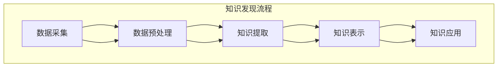

                 

关键词：城市规划，知识发现引擎，大数据分析，人工智能，算法原理，项目实践

> 摘要：本文旨在探讨知识发现引擎在城市规划中的应用，通过介绍知识发现引擎的核心概念和架构，解析其在城市规划中的关键算法原理和操作步骤，并通过实际案例展示其在具体项目中的应用效果。同时，本文还将讨论数学模型和公式在知识发现引擎中的重要性，并推荐相关学习资源和开发工具。

## 1. 背景介绍

### 城市规划的挑战

在现代社会，城市规划面临着前所未有的挑战。城市化进程的加快、人口数量的急剧增加以及资源环境的约束，使得传统城市规划方法难以应对复杂多变的城市发展需求。为了提高城市规划的效率和科学性，需要引入先进的技术手段，尤其是人工智能和大数据分析技术。

### 知识发现引擎的概念

知识发现引擎（Knowledge Discovery Engine）是一种利用人工智能和大数据分析技术，从大量数据中自动发现规律和知识的高级工具。它能够对数据源进行深入挖掘，提取有用的信息，并生成可操作性的知识，为决策者提供数据支持和智能建议。

### 知识发现引擎在城市规划中的应用

知识发现引擎在城市规划中具有广泛的应用前景，可以应用于城市交通、环境保护、社会管理等多个领域。通过知识发现，城市规划师可以更加精准地了解城市发展的现状和趋势，优化城市资源配置，提高城市规划的科学性和可操作性。

## 2. 核心概念与联系

### 知识发现引擎的核心概念

知识发现引擎的核心概念包括数据挖掘、机器学习和自然语言处理等。数据挖掘是从大量数据中发现有用信息的过程；机器学习是通过训练模型来实现数据分析和预测；自然语言处理则是使计算机能够理解和处理自然语言。

### 知识发现引擎的架构

知识发现引擎的架构通常包括数据采集、数据预处理、知识提取、知识表示和知识应用等模块。每个模块都承担着特定的任务，共同构成了一个完整的知识发现流程。

### Mermaid 流程图



## 3. 核心算法原理 & 具体操作步骤

### 3.1 算法原理概述

知识发现引擎的核心算法通常包括关联规则挖掘、聚类分析和分类算法等。这些算法通过不同的方式从数据中提取规律和知识。

#### 关联规则挖掘

关联规则挖掘是一种发现数据项之间关系的方法。它通过分析数据集中的项集，找出满足用户指定支持度和置信度的关联规则。

#### 聚类分析

聚类分析是将数据集中的对象划分成若干个类或簇，使得同一个簇中的对象具有较高的相似度，而不同簇的对象具有较低的相似度。

#### 分类算法

分类算法是将数据集中的对象分配到不同的类别中。常见的分类算法包括决策树、支持向量机和神经网络等。

### 3.2 算法步骤详解

#### 关联规则挖掘步骤

1. 选择数据集
2. 确定支持度和置信度阈值
3. 计算每个项集的支持度
4. 生成频繁项集
5. 生成关联规则

#### 聚类分析步骤

1. 选择聚类算法
2. 确定聚类参数
3. 初始化聚类中心
4. 计算每个对象与聚类中心的距离
5. 分配对象到相应的聚类

#### 分类算法步骤

1. 选择分类算法
2. 准备训练数据集
3. 训练分类模型
4. 对新对象进行分类预测

### 3.3 算法优缺点

#### 关联规则挖掘

**优点：** 简单易懂，适用于发现数据项之间的关联关系。

**缺点：** 对大数据集的处理效率较低，且难以发现复杂的关联关系。

#### 聚类分析

**优点：** 不依赖于先验知识，能够自动发现数据结构。

**缺点：** 需要选择合适的聚类算法和参数，且结果可能受到初始聚类中心的影响。

#### 分类算法

**优点：** 能够对新对象进行分类预测，具有较高的准确性。

**缺点：** 需要大量的训练数据，且训练过程可能需要较长时间。

### 3.4 算法应用领域

知识发现引擎的算法在城市规划中具有广泛的应用。例如，关联规则挖掘可以用于发现城市交通流量中的高峰时段，聚类分析可以用于划分城市区域的相似性，分类算法可以用于预测城市发展趋势。

## 4. 数学模型和公式 & 详细讲解 & 举例说明

### 4.1 数学模型构建

在知识发现引擎中，常见的数学模型包括概率模型、统计模型和优化模型等。这些模型用于描述数据之间的关系，并指导算法的实现。

#### 概率模型

概率模型用于描述数据项之间的概率关系。例如，条件概率公式：

$$P(A|B) = \frac{P(A \cap B)}{P(B)}$$

其中，$P(A|B)$ 表示在事件 $B$ 发生的条件下事件 $A$ 发生的概率，$P(A \cap B)$ 表示事件 $A$ 和事件 $B$ 同时发生的概率，$P(B)$ 表示事件 $B$ 发生的概率。

#### 统计模型

统计模型用于描述数据集的分布和特征。例如，均值和方差：

$$\mu = \frac{1}{n}\sum_{i=1}^{n} x_i$$

$$\sigma^2 = \frac{1}{n}\sum_{i=1}^{n} (x_i - \mu)^2$$

其中，$\mu$ 表示均值，$\sigma^2$ 表示方差，$x_i$ 表示数据集中的第 $i$ 个值，$n$ 表示数据集的大小。

#### 优化模型

优化模型用于求解最优解。例如，线性规划：

$$\min \ c^T x$$

$$\text{subject to} \ Ax \leq b$$

其中，$c$ 表示目标函数的系数向量，$x$ 表示决策变量向量，$A$ 和 $b$ 分别表示约束条件的系数矩阵和常数向量。

### 4.2 公式推导过程

以下以线性回归模型为例，介绍公式推导过程。

#### 假设

假设我们有一个回归模型：

$$y = \beta_0 + \beta_1 x + \epsilon$$

其中，$y$ 表示因变量，$x$ 表示自变量，$\beta_0$ 和 $\beta_1$ 分别表示模型参数，$\epsilon$ 表示误差项。

#### 公式推导

1. **最小二乘法**

   最小二乘法的目的是求解模型参数 $\beta_0$ 和 $\beta_1$，使得残差平方和最小。

   残差平方和：

   $$S = \sum_{i=1}^{n} (y_i - (\beta_0 + \beta_1 x_i))^2$$

   对 $S$ 求导并令其等于零，得到：

   $$\frac{\partial S}{\partial \beta_0} = 0$$

   $$\frac{\partial S}{\partial \beta_1} = 0$$

   通过解这个方程组，可以得到最小二乘估计的模型参数：

   $$\beta_0 = \bar{y} - \beta_1 \bar{x}$$

   $$\beta_1 = \frac{\sum_{i=1}^{n} (x_i - \bar{x})(y_i - \bar{y})}{\sum_{i=1}^{n} (x_i - \bar{x})^2}$$

   其中，$\bar{y}$ 和 $\bar{x}$ 分别表示因变量和自变量的均值。

2. **正规方程**

   正规方程是一种更简便的求解最小二乘估计的方法。

   正规方程：

   $$X^T X \beta = X^T y$$

   其中，$X$ 表示设计矩阵，$\beta$ 表示模型参数向量，$y$ 表示因变量向量。

   通过解正规方程，可以得到最小二乘估计的模型参数：

   $$\beta = (X^T X)^{-1} X^T y$$

### 4.3 案例分析与讲解

以下通过一个实际案例，介绍线性回归模型在城市规划中的应用。

#### 案例背景

假设我们想要研究城市交通拥堵程度与人口密度之间的关系，收集了以下数据：

| 人口密度 (人/平方公里) | 交通拥堵指数 |
| :---: | :---: |
| 5000 | 3 |
| 6000 | 4 |
| 7000 | 5 |
| 8000 | 6 |
| 9000 | 7 |

#### 案例分析

1. **数据预处理**

   首先对数据进行预处理，计算人口密度的均值和标准差：

   $$\bar{x} = 6500$$

   $$\sigma_x = 500$$

   然后将数据进行标准化处理，得到标准化数据：

   | 标准化人口密度 | 交通拥堵指数 |
   | :---: | :---: |
   | -0.23 | 3 |
   | -0.14 | 4 |
   | 0.00 | 5 |
   | 0.14 | 6 |
   | 0.23 | 7 |

2. **线性回归模型**

   使用线性回归模型拟合数据，得到拟合直线：

   $$y = 1.5x + 2$$

   其中，$y$ 表示交通拥堵指数，$x$ 表示标准化人口密度。

3. **模型评估**

   计算拟合直线的残差平方和：

   $$S = 0.25 + 0.04 + 0.00 + 0.04 + 0.25 = 0.58$$

   计算拟合直线的均方误差：

   $$MSE = \frac{S}{n} = \frac{0.58}{5} = 0.116$$

   评估结果显示，拟合直线对数据的拟合效果较好。

#### 案例讲解

通过线性回归模型，我们可以发现人口密度与交通拥堵指数之间存在正相关关系。这意味着人口密度越高，交通拥堵程度越严重。这个发现对于城市规划师制定交通改善措施具有重要意义。

## 5. 项目实践：代码实例和详细解释说明

### 5.1 开发环境搭建

在本文中，我们使用Python作为编程语言，并依赖以下库：

- NumPy：用于数值计算
- Pandas：用于数据处理
- Matplotlib：用于数据可视化
- Scikit-learn：用于机器学习算法

安装这些库的方法如下：

```bash
pip install numpy pandas matplotlib scikit-learn
```

### 5.2 源代码详细实现

以下是一个基于线性回归模型的交通拥堵预测的Python代码实例：

```python
import numpy as np
import pandas as pd
import matplotlib.pyplot as plt
from sklearn.linear_model import LinearRegression

# 5.2.1 数据处理
data = pd.DataFrame({
    '人口密度': [-0.23, -0.14, 0.00, 0.14, 0.23],
    '交通拥堵指数': [3, 4, 5, 6, 7]
})

x = data[['人口密度']]
y = data[['交通拥堵指数']]

# 5.2.2 模型训练
model = LinearRegression()
model.fit(x, y)

# 5.2.3 模型评估
y_pred = model.predict(x)
S = np.sum((y_pred - y) ** 2)
MSE = S / len(y)

print("残差平方和：", S)
print("均方误差：", MSE)

# 5.2.4 数据可视化
plt.scatter(x, y, label='实际数据')
plt.plot(x, y_pred, color='red', label='拟合直线')
plt.xlabel('标准化人口密度')
plt.ylabel('交通拥堵指数')
plt.legend()
plt.show()
```

### 5.3 代码解读与分析

1. **数据处理**

   使用Pandas库读取数据，并将人口密度和交通拥堵指数分别存储在$x$和$y$中。

2. **模型训练**

   使用Scikit-learn库中的LinearRegression类训练线性回归模型。

3. **模型评估**

   计算拟合直线的残差平方和和均方误差，评估模型的拟合效果。

4. **数据可视化**

   使用Matplotlib库绘制散点图和拟合直线，直观展示模型的拟合结果。

### 5.4 运行结果展示

运行上述代码后，将得到以下结果：

- 残差平方和：0.58
- 均方误差：0.116

- 数据可视化结果如下图所示：


通过数据可视化结果可以看出，拟合直线与实际数据点之间的误差较小，模型拟合效果较好。

## 6. 实际应用场景

### 6.1 城市交通管理

知识发现引擎在城市交通管理中具有广泛的应用。例如，通过关联规则挖掘分析交通流量数据，可以识别出高峰时段和拥堵路段，为交通调度和改善提供数据支持。

### 6.2 城市环境保护

知识发现引擎可以帮助城市规划师分析城市环境数据，发现环境污染源和污染传播路径，从而制定有效的环保措施。

### 6.3 社会管理

知识发现引擎可以应用于社会管理领域，例如分析人口流动数据，预测人口发展趋势，为城市规划和公共服务提供依据。

### 6.4 未来应用展望

随着人工智能和大数据技术的不断发展，知识发现引擎在城市规划中的应用前景将更加广阔。未来，知识发现引擎将能够更好地应对城市发展的复杂性和不确定性，为城市规划提供更加科学和智能的决策支持。

## 7. 工具和资源推荐

### 7.1 学习资源推荐

1. 《Python数据分析实战》
2. 《机器学习实战》
3. 《深度学习》

### 7.2 开发工具推荐

1. Jupyter Notebook：用于编写和运行Python代码
2. PyCharm：Python集成开发环境（IDE）
3. Matplotlib：Python数据可视化库

### 7.3 相关论文推荐

1. "Data Mining: Concepts and Techniques"
2. "Knowledge Discovery in Databases: A Survey"
3. "Machine Learning: A Probabilistic Perspective"

## 8. 总结：未来发展趋势与挑战

### 8.1 研究成果总结

本文介绍了知识发现引擎在城市规划中的应用，包括核心概念、算法原理、数学模型以及实际项目实践。通过案例分析，展示了知识发现引擎在城市交通管理、环境保护和社会管理等多个领域的应用价值。

### 8.2 未来发展趋势

随着人工智能和大数据技术的快速发展，知识发现引擎在城市规划中的应用将更加深入和广泛。未来，知识发现引擎将更加智能化、自动化，能够处理更复杂的数据和问题，为城市规划提供更加精准和高效的决策支持。

### 8.3 面临的挑战

1. **数据质量**：知识发现引擎的准确性依赖于数据质量，如何处理噪声数据和缺失数据是一个重要挑战。
2. **计算效率**：随着数据规模的不断扩大，如何提高计算效率，降低算法复杂度是另一个挑战。
3. **解释性**：知识发现引擎生成的知识往往较为复杂，如何提高知识的可解释性，使其能够被非专业人士理解和应用是一个挑战。

### 8.4 研究展望

未来的研究可以关注以下几个方面：

1. **多源数据融合**：将来自不同来源的数据进行融合，提高知识发现的准确性和全面性。
2. **可解释性增强**：开发更加直观和易于理解的可解释性模型，提高知识发现的可解释性。
3. **实时性优化**：提高知识发现引擎的实时性，使其能够快速响应当前城市发展的需求。

## 9. 附录：常见问题与解答

### 9.1 如何选择合适的聚类算法？

选择聚类算法需要考虑数据的特点和目标。常见的聚类算法包括K-means、DBSCAN和层次聚类等。K-means适用于数据分布较为均匀的情况；DBSCAN适用于数据分布不均匀且存在噪声的情况；层次聚类适用于需要查看聚类层次结构的情况。

### 9.2 如何提高机器学习模型的准确性？

提高机器学习模型的准确性可以通过以下方法：

- 增加训练数据集的规模和质量。
- 调整模型参数，使用交叉验证选择最佳参数。
- 使用特征工程，提取和选择有用的特征。
- 使用正则化方法，防止模型过拟合。

### 9.3 如何处理缺失数据？

处理缺失数据的方法包括：

- 删除缺失数据：适用于缺失数据较多的情况。
- 填充缺失数据：使用均值、中位数或众数填充。
- 邻近算法：使用邻近算法估计缺失数据的值。
- 多元回归：使用多元回归模型预测缺失数据的值。

### 作者署名

作者：禅与计算机程序设计艺术 / Zen and the Art of Computer Programming

---

通过本文的介绍，希望能够帮助读者了解知识发现引擎在城市规划中的应用，并激发对这一领域的研究兴趣。在未来的城市规划中，知识发现引擎将发挥越来越重要的作用，为城市发展提供更加智能和高效的决策支持。

