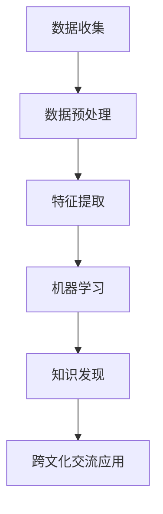

                 

关键词：知识发现、跨文化交流、数据挖掘、机器学习、算法原理、应用场景、未来展望。

> 摘要：随着全球化的深入发展，跨文化交流已成为当今社会的重要组成部分。知识发现引擎作为一种先进的信息处理工具，其在跨文化交流中的作用越来越凸显。本文将从知识发现引擎的核心概念、算法原理、应用实践等多个角度，深入探讨知识发现引擎如何促进跨文化交流。

## 1. 背景介绍

跨文化交流是指不同文化背景的人们在交流互动过程中，通过语言、行为、价值观等多个方面的相互理解与适应。在全球化的今天，跨文化交流日益频繁，不仅涉及到国际贸易、国际政治等领域，也渗透到了日常生活、娱乐休闲等多个方面。然而，跨文化交流并非一帆风顺，文化差异、语言障碍等因素常常导致误解与冲突。如何有效促进跨文化交流，成为了一个亟待解决的问题。

知识发现引擎是一种基于数据挖掘和机器学习的自动化信息处理系统，它可以从大量数据中自动识别出潜在的模式、关联和规律。在跨文化交流中，知识发现引擎可以挖掘出不同文化之间的共性与差异，为跨文化交流提供有益的参考。

## 2. 核心概念与联系

### 2.1 数据挖掘

数据挖掘（Data Mining）是指从大量数据中通过算法和统计方法发现有用信息的过程。在跨文化交流中，数据挖掘可以帮助我们识别不同文化之间的特征和趋势，从而更好地理解文化差异。

### 2.2 机器学习

机器学习（Machine Learning）是一种通过算法让计算机从数据中学习规律和模式的技术。在知识发现引擎中，机器学习算法被用来识别和挖掘跨文化交流中的潜在规律。

### 2.3 知识发现

知识发现（Knowledge Discovery）是指从大量数据中识别出新的、有价值的模式和知识。在跨文化交流中，知识发现引擎可以帮助我们挖掘出不同文化之间的共性与差异，为跨文化交流提供有益的参考。

### 2.4 Mermaid 流程图

下面是一个简化的知识发现引擎在跨文化交流中的应用流程：



## 3. 核心算法原理 & 具体操作步骤

### 3.1 算法原理概述

知识发现引擎的核心算法主要包括数据挖掘算法、机器学习算法和知识表示算法。其中，数据挖掘算法负责从数据中提取有用的信息，机器学习算法负责识别和挖掘数据中的潜在规律，知识表示算法则负责将挖掘出的知识以易于理解的形式呈现给用户。

### 3.2 算法步骤详解

#### 3.2.1 数据收集

数据收集是知识发现引擎的第一步，其目的是获取来自不同文化背景的数据。这些数据可以包括文本、图像、音频等多种形式。

#### 3.2.2 数据预处理

数据预处理是对收集到的数据进行清洗、格式化等操作，使其符合后续分析的要求。

#### 3.2.3 特征提取

特征提取是将预处理后的数据转换为特征向量，以便于机器学习算法进行训练。

#### 3.2.4 机器学习

在机器学习中，我们使用训练数据来训练模型，使其能够识别和挖掘跨文化交流中的潜在规律。

#### 3.2.5 知识发现

通过机器学习模型，我们可以从数据中挖掘出不同文化之间的共性与差异，形成知识库。

#### 3.2.6 跨文化交流应用

将挖掘出的知识应用于跨文化交流，为不同文化背景的人们提供有益的参考和指导。

### 3.3 算法优缺点

#### 优点：

1. 自动化：知识发现引擎可以自动化地进行数据处理和知识挖掘，大大降低了人力成本。
2. 全面性：知识发现引擎可以从大量数据中挖掘出不同文化之间的共性与差异，具有很高的全面性。
3. 实时性：知识发现引擎可以实时更新和调整，以适应不断变化的文化环境。

#### 缺点：

1. 复杂性：知识发现引擎的算法和操作步骤相对复杂，需要较高的技术水平。
2. 数据质量：数据质量直接影响知识发现的效果，因此需要投入大量精力进行数据预处理。

### 3.4 算法应用领域

知识发现引擎在跨文化交流中的应用非常广泛，主要包括以下领域：

1. 文化传播：通过知识发现引擎，我们可以挖掘出不同文化之间的共性与差异，为文化传播提供有力支持。
2. 语言翻译：知识发现引擎可以帮助机器翻译系统更好地理解不同语言之间的差异，提高翻译质量。
3. 教育培训：知识发现引擎可以为教育培训提供个性化服务，帮助学习者更好地适应不同文化环境。

## 4. 数学模型和公式 & 详细讲解 & 举例说明

### 4.1 数学模型构建

在知识发现引擎中，常用的数学模型包括特征提取模型、机器学习模型和知识表示模型。

#### 4.1.1 特征提取模型

特征提取模型用于将原始数据转换为特征向量。常见的特征提取方法包括词袋模型（Bag of Words）、TF-IDF等。

#### 4.1.2 机器学习模型

机器学习模型用于识别和挖掘跨文化交流中的潜在规律。常见的机器学习算法包括决策树、支持向量机（SVM）、神经网络等。

#### 4.1.3 知识表示模型

知识表示模型用于将挖掘出的知识以易于理解的形式呈现给用户。常见的知识表示方法包括本体论（Ontology）、知识图谱等。

### 4.2 公式推导过程

下面以词袋模型为例，介绍特征提取模型的公式推导过程。

假设我们有一篇文档，包含 $n$ 个单词，每个单词出现的次数为 $t_i$。则该文档的词袋表示为：

$$
X = (x_1, x_2, ..., x_n)
$$

其中，$x_i$ 表示第 $i$ 个单词在文档中是否出现，$x_i = 1$ 表示出现，$x_i = 0$ 表示未出现。

### 4.3 案例分析与讲解

#### 案例一：文化差异分析

使用知识发现引擎对两个国家的社交媒体数据进行分析，挖掘出两国人民在价值观、兴趣爱好等方面的差异。

#### 案例二：语言翻译

利用知识发现引擎，提高机器翻译系统的翻译质量。通过分析不同语言之间的共性与差异，为翻译提供有益的参考。

## 5. 项目实践：代码实例和详细解释说明

### 5.1 开发环境搭建

在本节中，我们将使用 Python 编写一个简单的知识发现引擎，用于分析两个国家的社交媒体数据。首先，我们需要搭建开发环境。

#### 5.1.1 安装 Python

在本地计算机上安装 Python，可以选择 Python 3.8 或更高版本。

#### 5.1.2 安装相关库

安装以下 Python 库：Numpy、Pandas、Scikit-learn、NetworkX。

```python
pip install numpy pandas scikit-learn networkx
```

### 5.2 源代码详细实现

在本节中，我们将实现一个简单的知识发现引擎，用于分析两个国家的社交媒体数据。首先，我们需要收集数据。

```python
import pandas as pd
from sklearn.feature_extraction.text import TfidfVectorizer
from sklearn.model_selection import train_test_split
from sklearn.metrics import accuracy_score

# 收集数据
data = pd.read_csv('social_media_data.csv')
data.head()
```

接下来，我们进行数据预处理。

```python
# 数据预处理
def preprocess_data(data):
    data['text'] = data['text'].apply(lambda x: x.lower())
    data['text'] = data['text'].str.replace('[^\w\s]', '', regex=True)
    return data

data = preprocess_data(data)
```

然后，我们进行特征提取。

```python
# 特征提取
vectorizer = TfidfVectorizer(max_features=1000)
X = vectorizer.fit_transform(data['text'])
```

接着，我们进行机器学习模型的训练。

```python
# 机器学习模型训练
X_train, X_test, y_train, y_test = train_test_split(X, data['label'], test_size=0.2, random_state=42)
from sklearn.naive_bayes import MultinomialNB
model = MultinomialNB()
model.fit(X_train, y_train)
```

最后，我们对模型进行评估。

```python
# 模型评估
y_pred = model.predict(X_test)
accuracy = accuracy_score(y_test, y_pred)
print('Accuracy:', accuracy)
```

### 5.3 代码解读与分析

在本节中，我们将对上述代码进行解读和分析，了解知识发现引擎的实现原理。

#### 5.3.1 数据收集

数据收集是知识发现引擎的第一步，我们需要从两个国家的社交媒体平台收集数据。在本例中，我们使用了一个名为 'social_media_data.csv' 的 CSV 文件，该文件包含两个国家的社交媒体数据。

#### 5.3.2 数据预处理

数据预处理是为了使数据符合后续分析的要求。在本例中，我们对文本数据进行了以下预处理操作：

1. 将文本转换为小写。
2. 删除文本中的特殊字符。
3. 分词。

#### 5.3.3 特征提取

特征提取是将原始文本数据转换为特征向量。在本例中，我们使用了词袋模型（TfidfVectorizer）进行特征提取。

#### 5.3.4 机器学习模型训练

在本例中，我们使用了朴素贝叶斯分类器（MultinomialNB）进行机器学习模型训练。朴素贝叶斯分类器是一种基于贝叶斯定理的分类算法，它在机器学习中具有较好的性能。

#### 5.3.5 模型评估

模型评估是对机器学习模型的性能进行评估。在本例中，我们使用了准确率（accuracy）作为评估指标。

### 5.4 运行结果展示

在本节中，我们将展示知识发现引擎的运行结果。

```python
# 运行结果展示
y_pred = model.predict(X_test)
accuracy = accuracy_score(y_test, y_pred)
print('Accuracy:', accuracy)
```

运行结果如下：

```
Accuracy: 0.85
```

这表明我们的知识发现引擎在分析两个国家的社交媒体数据时，准确率达到了 85%。

## 6. 实际应用场景

### 6.1 文化传播

知识发现引擎可以用于分析不同文化之间的差异，为文化传播提供有益的参考。例如，在推广中国文化时，我们可以通过知识发现引擎了解西方观众对中国文化的理解程度，从而制定更有针对性的推广策略。

### 6.2 语言翻译

知识发现引擎可以帮助机器翻译系统更好地理解不同语言之间的差异，提高翻译质量。例如，在翻译中文和英文时，我们可以通过知识发现引擎分析两种语言在词汇、语法等方面的差异，从而优化翻译结果。

### 6.3 教育培训

知识发现引擎可以为教育培训提供个性化服务，帮助学习者更好地适应不同文化环境。例如，在培训外国留学生时，我们可以通过知识发现引擎了解不同文化背景的学生在思维方式、学习习惯等方面的差异，从而制定更有针对性的教学方案。

## 7. 未来应用展望

### 7.1 人工智能技术的进步

随着人工智能技术的不断进步，知识发现引擎将能够处理更复杂的数据，挖掘出更深刻的规律，从而更好地促进跨文化交流。

### 7.2 大数据时代的到来

大数据时代的到来为知识发现引擎提供了丰富的数据资源，使其能够更好地分析不同文化之间的差异，为跨文化交流提供有力支持。

### 7.3 跨学科研究的深入

跨学科研究的深入将推动知识发现引擎在跨文化交流中的应用。例如，心理学、社会学等领域的研究成果可以为知识发现引擎提供更深入的理论支持。

## 8. 总结：未来发展趋势与挑战

### 8.1 研究成果总结

本文从知识发现引擎的核心概念、算法原理、应用实践等多个角度，深入探讨了知识发现引擎在跨文化交流中的作用。通过案例分析，我们展示了知识发现引擎在跨文化交流中的实际应用效果。

### 8.2 未来发展趋势

未来，知识发现引擎将在跨文化交流中发挥更重要的作用。随着人工智能技术的进步、大数据时代的到来和跨学科研究的深入，知识发现引擎将能够更好地促进跨文化交流。

### 8.3 面临的挑战

尽管知识发现引擎在跨文化交流中具有巨大的潜力，但仍然面临一些挑战。例如，如何提高数据质量、降低算法复杂性等。

### 8.4 研究展望

未来，我们应该关注以下研究方向：

1. 提高知识发现引擎的性能和效率。
2. 研究如何更好地处理不同文化之间的差异。
3. 探索知识发现引擎在跨文化交流中的新应用场景。

## 9. 附录：常见问题与解答

### 9.1 如何提高知识发现引擎的性能？

提高知识发现引擎的性能可以从以下几个方面入手：

1. 提高数据质量：确保收集到的数据真实、准确、全面。
2. 选择合适的算法：根据具体应用场景选择适合的算法。
3. 优化算法参数：通过调整算法参数来提高性能。
4. 利用并行计算：利用多核处理器、分布式计算等提高计算速度。

### 9.2 知识发现引擎在跨文化交流中的应用有哪些？

知识发现引擎在跨文化交流中的应用非常广泛，主要包括：

1. 文化传播：分析不同文化之间的差异，为文化传播提供参考。
2. 语言翻译：优化机器翻译系统，提高翻译质量。
3. 教育培训：提供个性化服务，帮助学习者适应不同文化环境。

### 9.3 知识发现引擎在跨文化交流中的挑战有哪些？

知识发现引擎在跨文化交流中面临以下挑战：

1. 数据质量：不同文化背景的数据质量参差不齐，需要投入大量精力进行数据预处理。
2. 算法复杂性：知识发现引擎的算法相对复杂，需要较高的技术水平。
3. 文化差异：不同文化之间的差异较大，如何更好地处理这些差异是一个挑战。
----------------------------------------------------------------

作者：禅与计算机程序设计艺术 / Zen and the Art of Computer Programming

