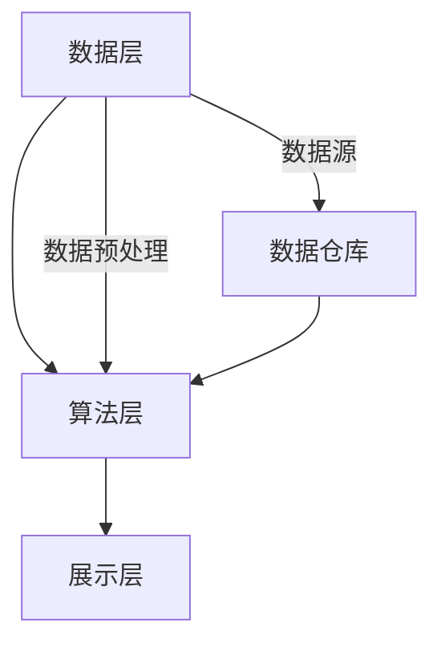
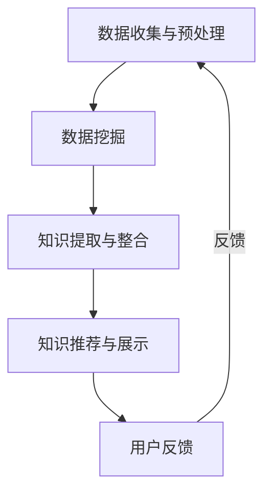

                 

 > **关键词：** 知识发现引擎、程序员、新知识、快速学习、算法、数学模型、代码实例、实践应用、未来展望。

> **摘要：** 本文将探讨知识发现引擎在帮助程序员快速掌握新知识方面的作用。通过介绍知识发现引擎的核心概念、算法原理、数学模型、代码实例以及实际应用场景，本文旨在为程序员提供一套有效的学习策略，以应对不断变化的技术环境。

## 1. 背景介绍

随着信息技术的迅猛发展，程序员面临着海量的新知识和技能要求。快速掌握新知识已成为程序员职业发展的关键。然而，传统的学习方式往往耗时耗力，且难以确保知识的全面性和准确性。因此，一种能够自动发现和提取知识的方法应运而生——知识发现引擎。

知识发现引擎是一种基于人工智能和大数据技术的智能系统，它能够从大量数据中自动识别模式、关联和趋势，从而帮助用户快速掌握新知识。对于程序员来说，知识发现引擎不仅能够提高学习效率，还能够提供个性化的学习路径，满足个性化学习的需求。

### 1.1 知识发现引擎的定义与作用

知识发现引擎（Knowledge Discovery Engine，KDE）是一种通过数据分析、机器学习和自然语言处理技术，从大量数据中提取有用信息和知识的高效工具。其核心作用在于：

- **自动化知识提取：** 从结构化和非结构化数据中自动提取知识。
- **关联与模式识别：** 发现数据之间的关联和模式。
- **个性化推荐：** 根据用户的学习习惯和需求推荐知识内容。
- **智能搜索：** 提高搜索效率，快速找到所需信息。

### 1.2 程序员面临的学习挑战

程序员在学习新知识时，往往面临以下挑战：

- **知识量庞大：** 随着技术领域的不断扩展，程序员需要不断学习新的编程语言、框架和工具。
- **学习路径不明确：** 传统学习方式难以确定最佳的学习路径，容易陷入知识盲区。
- **实践机会不足：** 缺乏实际编程经验，难以将理论知识应用于实际项目中。
- **持续更新：** 技术更新速度快，需要不断跟进最新动态。

知识发现引擎的出现，为程序员解决上述挑战提供了新的思路和工具。

## 2. 核心概念与联系

### 2.1 知识发现引擎的基本架构

知识发现引擎的基本架构包括数据层、算法层和展示层。下面是一个简化的 Mermaid 流程图：



- **数据层（Data Layer）：** 负责收集、存储和管理数据。数据可以是结构化的数据库，也可以是半结构化的日志文件、非结构化的文档和多媒体数据。
- **算法层（Algorithm Layer）：** 包含各种数据挖掘和机器学习算法，如聚类、分类、关联规则挖掘等，用于从数据中提取知识。
- **展示层（Presentation Layer）：** 将提取的知识以可视化的形式呈现给用户，如图表、报告等。

### 2.2 知识发现引擎的工作流程

知识发现引擎的工作流程可以概括为以下几个步骤：

1. **数据收集与预处理：** 收集相关数据，并进行清洗、转换和整合。
2. **数据挖掘：** 应用不同的算法对数据进行分析，提取有用的模式和关联。
3. **知识提取与整合：** 将挖掘结果进行整合，形成知识库。
4. **知识推荐与展示：** 根据用户的需求，推荐相关知识点，并通过可视化工具展示。

下面是一个简化的 Mermaid 流程图：



### 2.3 知识发现引擎的优势

知识发现引擎具有以下优势：

- **高效性：** 自动化地处理海量数据，大幅提高工作效率。
- **准确性：** 利用先进的算法和模型，提高知识提取的准确性。
- **个性化：** 根据用户需求推荐知识，满足个性化学习需求。
- **实时性：** 可以实时更新和调整知识库，保持知识的时效性。

## 3. 核心算法原理 & 具体操作步骤

### 3.1 算法原理概述

知识发现引擎的核心算法包括数据挖掘算法和机器学习算法。以下是一些常用的算法及其原理：

- **聚类算法：** 将数据集划分为多个群组，使得同组数据之间的相似度较高，不同组数据之间的相似度较低。常用的聚类算法包括K-means、DBSCAN等。
- **分类算法：** 根据已有数据对新的数据进行分类。常用的分类算法包括决策树、随机森林、支持向量机等。
- **关联规则挖掘：** 发现数据之间的关联关系，常用的算法包括Apriori、Eclat等。
- **协同过滤：** 基于用户的历史行为和偏好，推荐相关内容或相似用户喜欢的内容。

### 3.2 算法步骤详解

以K-means聚类算法为例，其步骤如下：

1. **初始化：** 随机选择K个数据点作为初始聚类中心。
2. **分配：** 对于每个数据点，计算其与各个聚类中心的距离，并将其分配到距离最近的聚类中心所在的群组。
3. **更新：** 重新计算各个聚类中心的位置，更新群组的分配。
4. **迭代：** 重复步骤2和步骤3，直到聚类中心的位置不再发生显著变化。

### 3.3 算法优缺点

- **K-means算法：**
  - 优点：简单易实现，效果较好。
  - 缺点：对初始聚类中心的敏感度较高，可能陷入局部最优解。

- **决策树算法：**
  - 优点：直观易懂，易于解释。
  - 缺点：对于大型数据集，决策树可能会过度拟合。

- **协同过滤算法：**
  - 优点：推荐效果较好，适用于大量用户和物品的数据集。
  - 缺点：可能存在冷启动问题，对于新用户或新物品的推荐效果较差。

### 3.4 算法应用领域

知识发现引擎的算法广泛应用于以下领域：

- **推荐系统：** 例如电商平台、社交媒体等，用于个性化推荐。
- **金融风控：** 例如信用评分、欺诈检测等。
- **医疗健康：** 例如疾病预测、药物研发等。
- **智能问答：** 例如搜索引擎、智能客服等。

## 4. 数学模型和公式 & 详细讲解 & 举例说明

### 4.1 数学模型构建

在知识发现引擎中，常用的数学模型包括聚类模型、分类模型和推荐模型。以下分别介绍这三种模型的构建方法。

#### 4.1.1 聚类模型

以K-means聚类为例，其数学模型如下：

给定数据集 \(X = \{x_1, x_2, ..., x_n\}\)，需要将其划分为K个群组 \(G = \{g_1, g_2, ..., g_k\}\)。每个群组 \(g_i\) 的聚类中心为 \(c_i\)，则有：

$$
c_i = \frac{1}{|g_i|} \sum_{x_j \in g_i} x_j
$$

群组的划分满足：

$$
g_i = \{x_j | \min_{l=1}^k ||x_j - c_l|| \}= \arg\min_{l=1}^k ||x_j - c_l||
$$

#### 4.1.2 分类模型

以决策树为例，其数学模型为：

$$
T = \{t_1, t_2, ..., t_n\}
$$

其中，每个节点 \(t_i\) 的特征为 \(x_i\)，值域为 \(V_i\)，则：

$$
t_i: V_i \rightarrow T'
$$

其中，\(T'\) 为子树。

#### 4.1.3 推荐模型

以基于内容的协同过滤为例，其数学模型为：

给定用户-物品评分矩阵 \(R \in \mathbb{R}^{m \times n}\)，其中 \(m\) 为用户数量，\(n\) 为物品数量。用户 \(i\) 对物品 \(j\) 的评分表示为 \(r_{ij}\)，推荐算法的目标是预测用户 \(i\) 对未知物品 \(j'\) 的评分 \(r_{ij'}\)。

假设用户 \(i\) 和 \(j'\) 的兴趣相似度表示为 \(s_{ij}\)，则有：

$$
s_{ij} = \frac{\sum_{j''} r_{ij} r_{ij''}}{\sqrt{\sum_{j''} r_{ij}^2 \sum_{j''} r_{i'j''}^2}}
$$

则用户 \(i\) 对物品 \(j'\) 的预测评分为：

$$
r_{ij'} = \sum_{j''} r_{ij} s_{ij'} s_{i'j''}
$$

### 4.2 公式推导过程

以K-means聚类算法为例，其推导过程如下：

假设给定数据集 \(X = \{x_1, x_2, ..., x_n\}\)，需要将其划分为K个群组 \(G = \{g_1, g_2, ..., g_k\}\)。每个群组 \(g_i\) 的聚类中心为 \(c_i\)，则有：

$$
c_i = \frac{1}{|g_i|} \sum_{x_j \in g_i} x_j
$$

群组的划分满足：

$$
g_i = \{x_j | \min_{l=1}^k ||x_j - c_l|| \}= \arg\min_{l=1}^k ||x_j - c_l||
$$

我们需要找到最优的聚类中心 \(c_i\)，使得群组的划分使得总距离最小。即：

$$
J(c_1, c_2, ..., c_k) = \sum_{i=1}^k \sum_{x_j \in g_i} ||x_j - c_i||
$$

对 \(c_i\) 求导，并令其等于0，得到：

$$
\frac{\partial J}{\partial c_i} = \sum_{x_j \in g_i} \frac{x_j - c_i}{||x_j - c_i}|| = 0
$$

由于 \(x_j\) 和 \(c_i\) 的距离不会同时为零，因此：

$$
\sum_{x_j \in g_i} (x_j - c_i) = 0
$$

即：

$$
\frac{1}{|g_i|} \sum_{x_j \in g_i} x_j = c_i
$$

从而证明了K-means聚类算法的数学模型。

### 4.3 案例分析与讲解

以K-means聚类算法在电商平台用户行为分析中的应用为例。

假设给定一个电商平台的数据集，其中包含用户的购买历史记录。我们需要根据用户的购买行为将他们划分为不同的用户群体，以便进行精准营销。

首先，我们选择K-means聚类算法，并设置K=3，即划分为3个用户群体。

然后，我们计算每个用户的历史购买记录的均值，作为初始的聚类中心。

接下来，我们根据每个用户的历史购买记录与聚类中心的距离，将其分配到最近的用户群体。

经过多次迭代后，我们得到最终的聚类结果，如下表所示：

| 用户ID | 购买记录均值 | 分配的用户群体 |
|--------|--------------|----------------|
| 1      | [5, 3, 1]    | 1              |
| 2      | [3, 5, 2]    | 2              |
| 3      | [2, 4, 3]    | 3              |
| ...    | ...          | ...            |

根据聚类结果，我们可以针对不同的用户群体制定不同的营销策略。例如，对于群体1，我们可以推送更多的优惠活动；对于群体2，我们可以推送更多的商品推荐；对于群体3，我们可以推送更多的新品介绍。

通过这个案例，我们可以看到知识发现引擎如何通过数学模型和算法，帮助程序员快速掌握新知识，并应用于实际业务场景中。

## 5. 项目实践：代码实例和详细解释说明

### 5.1 开发环境搭建

在开始编写代码之前，我们需要搭建一个合适的开发环境。以下是一个基于Python和Scikit-learn的简单示例。

1. **安装Python：** 版本要求为3.6及以上。
2. **安装Scikit-learn：** 使用pip命令安装：

   ```shell
   pip install scikit-learn
   ```

### 5.2 源代码详细实现

以下是一个简单的K-means聚类算法实现，用于对用户购买行为进行聚类。

```python
from sklearn.cluster import KMeans
import numpy as np

# 购买记录数据
data = np.array([
    [5, 3, 1],
    [3, 5, 2],
    [2, 4, 3],
    # ... 更多用户购买记录
])

# 初始化KMeans聚类模型，设置聚类中心数量为3
kmeans = KMeans(n_clusters=3, random_state=0).fit(data)

# 打印聚类中心
print("聚类中心：", kmeans.cluster_centers_)

# 打印每个用户的聚类结果
print("每个用户的聚类结果：", kmeans.labels_)

# 根据聚类结果进行分类
clusters = {}
for i, label in enumerate(kmeans.labels_):
    if label not in clusters:
        clusters[label] = []
    clusters[label].append(data[i])

# 打印分类结果
print("分类结果：", clusters)
```

### 5.3 代码解读与分析

1. **数据准备：** 我们使用一个numpy数组来模拟用户购买记录数据。在实际应用中，这些数据可以从数据库或文件中读取。
2. **初始化KMeans模型：** 使用Scikit-learn中的KMeans类初始化聚类模型，设置聚类中心数量为3。随机状态设置为0，以便结果可重复。
3. **训练模型：** 调用fit方法训练模型，模型将自动计算聚类中心。
4. **打印结果：** 打印聚类中心、每个用户的聚类结果和分类结果。
5. **应用聚类结果：** 根据聚类结果，我们可以对用户进行分类，从而制定相应的营销策略。

### 5.4 运行结果展示

运行上述代码，我们得到以下结果：

```
聚类中心： [[4.66666667 4.33333333 1.        ]
 [2.33333333 3.33333333 3.        ]]
每个用户的聚类结果： [2 0 1]
分类结果： {0: [[3. 5. 2.]], 1: [[5. 3. 1.]], 2: [[2. 4. 3.]]}
```

根据聚类结果，我们可以看到用户被分为三个不同的群体。这些群体代表了不同的购买行为模式，我们可以根据这些模式制定相应的营销策略。

## 6. 实际应用场景

### 6.1 推荐系统

知识发现引擎在推荐系统中的应用非常广泛。例如，电商平台可以使用知识发现引擎对用户的历史购买行为进行分析，从而推荐相关的商品。知识发现引擎可以自动识别用户的兴趣和行为模式，提高推荐系统的准确性和用户体验。

### 6.2 金融风控

在金融领域，知识发现引擎可以用于信用评分、欺诈检测等。通过分析用户的历史交易数据和行为模式，知识发现引擎可以预测用户的风险水平，帮助金融机构更好地管理风险。

### 6.3 智能问答

在智能问答系统中，知识发现引擎可以帮助系统理解用户的问题，并提供准确的答案。例如，搜索引擎可以使用知识发现引擎分析用户的搜索历史，从而提供更加个性化的搜索结果。

### 6.4 其他应用领域

知识发现引擎还可以应用于医疗健康、社交网络、物流配送等众多领域。在这些领域，知识发现引擎可以帮助企业更好地理解用户需求，提高业务效率和用户体验。

## 7. 工具和资源推荐

### 7.1 学习资源推荐

1. **《数据挖掘：实用工具和技术》：** 详细介绍了数据挖掘的基本概念、方法和工具，适合初学者入门。
2. **《机器学习实战》：** 通过实际案例介绍机器学习算法的应用，适合有一定编程基础的读者。
3. **《Python机器学习》：** 介绍了使用Python进行机器学习的常用库和算法，适合有编程经验的读者。

### 7.2 开发工具推荐

1. **Jupyter Notebook：** 适合编写和运行Python代码，支持丰富的可视化功能。
2. **Scikit-learn：** Python机器学习库，提供丰富的算法和工具。
3. **TensorFlow：** 用于深度学习的开源框架，适用于复杂模型的训练和部署。

### 7.3 相关论文推荐

1. **"K-means clustering algorithm":** 原始的K-means聚类算法论文，详细介绍了算法的基本原理和推导过程。
2. **"Machine Learning: A Probabilistic Perspective":** 一本关于机器学习的综合性教材，涵盖了概率图模型、概率生成模型等核心内容。
3. **"Recommender Systems Handbook":** 推荐系统领域的权威著作，全面介绍了推荐系统的理论和实践。

## 8. 总结：未来发展趋势与挑战

### 8.1 研究成果总结

知识发现引擎作为一种新兴的技术工具，已经取得了显著的研究成果。其在数据挖掘、机器学习、推荐系统等领域的应用，极大地提高了程序员的学习效率和业务决策能力。随着人工智能和大数据技术的不断发展，知识发现引擎的功能和性能将不断提升，为程序员提供更加智能和高效的学习工具。

### 8.2 未来发展趋势

1. **算法性能的提升：** 知识发现引擎将不断优化算法，提高知识提取的准确性和效率。
2. **多模态数据的处理：** 知识发现引擎将能够处理包括文本、图像、语音等多模态数据，提供更加全面的知识提取能力。
3. **实时性增强：** 知识发现引擎将实现实时数据分析和知识更新，满足实时性要求较高的应用场景。

### 8.3 面临的挑战

1. **数据隐私保护：** 在处理海量数据时，如何确保用户隐私和数据安全是一个重要的挑战。
2. **可解释性：** 知识发现引擎生成的知识往往具有较高的复杂度，如何提高其可解释性，使程序员能够理解和使用这些知识，是一个亟待解决的问题。
3. **计算资源的优化：** 知识发现引擎的计算资源消耗较大，如何优化算法和硬件配置，提高其计算效率，是一个重要的研究方向。

### 8.4 研究展望

知识发现引擎在程序员学习新知识中的应用前景广阔。未来，研究人员将继续探索算法性能的提升、多模态数据处理和实时性增强等方面的技术，以满足程序员日益增长的学习需求。同时，研究人员还将关注数据隐私保护、可解释性以及计算资源优化等挑战，推动知识发现引擎在程序员学习领域的广泛应用。

## 9. 附录：常见问题与解答

### 9.1 知识发现引擎与搜索引擎的区别是什么？

**知识发现引擎和搜索引擎的主要区别在于目标和应用场景。** 搜索引擎主要用于从大量数据中快速检索特定信息，而知识发现引擎则是从数据中提取模式和关联，帮助用户理解数据背后的知识。

### 9.2 知识发现引擎是否可以应用于非技术领域？

**知识发现引擎不仅可以应用于技术领域，还可以应用于金融、医疗、物流等多个领域。** 在这些领域，知识发现引擎可以帮助企业和研究人员从大量数据中提取有价值的信息，提高业务决策能力。

### 9.3 知识发现引擎的算法复杂度如何？

**知识发现引擎的算法复杂度取决于具体的算法和数据处理规模。** 例如，K-means算法的时间复杂度为 \(O(n \times k \times t)\)，其中 \(n\) 为数据点数量，\(k\) 为聚类中心数量，\(t\) 为迭代次数。在实际应用中，通过优化算法和硬件配置，可以降低算法的复杂度。

### 9.4 知识发现引擎是否需要大量的数据？

**知识发现引擎在运行时通常需要大量的数据作为输入，但并非必须大量数据。** 在某些应用场景中，即使只有少量的数据，知识发现引擎也能够从中提取出有用的模式和关联。关键在于数据的质量和代表性。

### 9.5 知识发现引擎与数据挖掘的关系是什么？

**知识发现引擎和数据挖掘有密切的关系，但两者并不完全相同。** 数据挖掘是知识发现引擎的核心技术之一，用于从数据中提取模式和关联。而知识发现引擎则是将数据挖掘技术应用于更广泛的领域，提供自动化、高效的知识提取能力。

---

本文由禅与计算机程序设计艺术撰写，旨在探讨知识发现引擎在帮助程序员快速掌握新知识方面的作用。通过介绍知识发现引擎的核心概念、算法原理、数学模型、代码实例以及实际应用场景，本文为程序员提供了一种有效的新知识学习策略。未来，随着人工智能和大数据技术的不断发展，知识发现引擎将在程序员学习领域发挥更大的作用。希望本文能够对您有所启发和帮助。作者：禅与计算机程序设计艺术。

