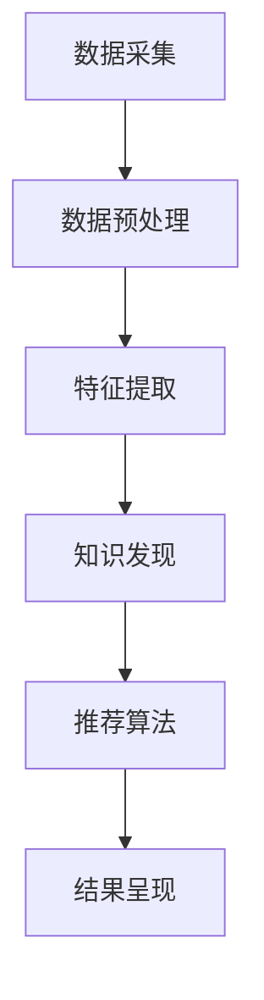

                 

关键词：知识发现、实时推荐系统、机器学习、数据挖掘、算法设计、人工智能、用户行为分析、个性化推荐

> 摘要：本文旨在探讨知识发现引擎中实时推荐系统的设计与实现，通过阐述核心概念、算法原理、数学模型、项目实践以及实际应用场景，为读者提供一份全面的指南。实时推荐系统在当今的信息爆炸时代具有重要的应用价值，本文将深入剖析其设计思路、实现方法及未来发展趋势。

## 1. 背景介绍

随着互联网的普及和信息的爆炸式增长，用户面临着日益严峻的信息过载问题。在这种背景下，个性化推荐系统应运而生，旨在为用户提供个性化的信息推荐服务。实时推荐系统作为个性化推荐系统的一种，能够根据用户的行为数据实时更新推荐结果，提高推荐系统的实时性和准确性。

知识发现引擎是实时推荐系统的基础，它通过数据挖掘技术从大量数据中提取有价值的信息，为推荐算法提供支持。知识发现引擎的设计与实现直接关系到推荐系统的性能和效果。因此，如何设计一个高效、可靠的实时推荐系统成为当前研究的热点问题。

## 2. 核心概念与联系

### 2.1. 知识发现引擎

知识发现引擎是一种利用数据挖掘技术从大规模数据集中发现有用信息的人工智能系统。其主要任务是从海量数据中提取出用户感兴趣的模式、趋势和规律，为后续的推荐算法提供支持。知识发现引擎通常包括数据预处理、特征提取、模式发现和知识表示等模块。

### 2.2. 实时推荐系统

实时推荐系统是一种能够在用户行为数据发生变化的瞬间迅速响应，并更新推荐结果的人工智能系统。实时推荐系统通常包括数据采集、数据处理、推荐算法和结果呈现等模块。其核心目标是提高推荐的实时性和准确性，为用户提供个性化、实时的信息推荐服务。

### 2.3. 机器学习与数据挖掘

机器学习和数据挖掘是实时推荐系统的两大基石。机器学习是一种通过算法模型自动从数据中学习规律、发现知识的技术，其广泛应用于分类、回归、聚类等任务。数据挖掘是一种从大量数据中发现有价值信息的过程，包括数据预处理、模式识别、知识发现等步骤。机器学习和数据挖掘相结合，能够为实时推荐系统提供强大的支持。

### 2.4. Mermaid 流程图

为了更好地展示知识发现引擎与实时推荐系统的关系，我们使用Mermaid绘制一个流程图：



在上图中，数据采集模块负责收集用户行为数据，数据预处理模块对数据进行清洗、归一化等操作，特征提取模块从预处理后的数据中提取关键特征，知识发现模块利用数据挖掘技术发现用户兴趣模式，推荐算法模块根据知识发现的结果生成个性化推荐结果，最后结果呈现模块将推荐结果展示给用户。

## 3. 核心算法原理 & 具体操作步骤

### 3.1. 算法原理概述

实时推荐系统的核心算法通常包括协同过滤、基于内容的推荐、基于模型的推荐等。本文将重点介绍协同过滤算法，其基本原理如下：

协同过滤算法通过计算用户之间的相似度，为用户发现潜在的相似用户，并从这些相似用户的行为数据中获取推荐结果。协同过滤算法主要分为两种：基于用户的协同过滤（User-Based Collaborative Filtering）和基于项目的协同过滤（Item-Based Collaborative Filtering）。

### 3.2. 算法步骤详解

#### 3.2.1. 基于用户的协同过滤

1. 计算用户之间的相似度：使用余弦相似度、皮尔逊相关系数等算法计算用户之间的相似度。

2. 找到最相似的k个用户：根据相似度分数，找到与目标用户最相似的k个用户。

3. 为目标用户生成推荐列表：根据最相似的k个用户的行为数据，生成目标用户的推荐列表。

#### 3.2.2. 基于项目的协同过滤

1. 计算用户与项目的相似度：使用余弦相似度、皮尔逊相关系数等算法计算用户与项目的相似度。

2. 找到最相似的项目：根据相似度分数，找到与目标用户最相似的项目。

3. 为目标用户生成推荐列表：根据最相似的项目，生成目标用户的推荐列表。

### 3.3. 算法优缺点

#### 优点：

1. 基于用户行为数据，能够发现用户之间的潜在关联。

2. 可以处理大量数据，适用于大规模推荐场景。

3. 推荐结果具有较好的实时性。

#### 缺点：

1. 当用户行为数据不足时，相似度计算容易出现偏差。

2. 需要维护用户与项目之间的相似度矩阵，计算开销较大。

### 3.4. 算法应用领域

协同过滤算法广泛应用于电子商务、社交媒体、在线视频等领域。例如，在电子商务平台上，协同过滤算法可以根据用户的购物历史和浏览记录，为用户推荐相关的商品；在社交媒体平台上，协同过滤算法可以根据用户的行为和关注对象，为用户推荐感兴趣的内容。

## 4. 数学模型和公式 & 详细讲解 & 举例说明

### 4.1. 数学模型构建

#### 4.1.1. 用户相似度计算

假设用户集为 \(U = \{u_1, u_2, ..., u_n\}\)，用户 \(u_i\) 的行为数据表示为向量 \(r_i\)，其中 \(r_i(j) = 1\) 表示用户 \(u_i\) 对项目 \(j\) 有行为记录，\(r_i(j) = 0\) 表示无行为记录。

用户 \(u_i\) 与用户 \(u_j\) 之间的相似度可以用余弦相似度表示：

$$
sim(u_i, u_j) = \frac{r_i \cdot r_j}{\|r_i\| \|r_j\|}
$$

其中，\(r_i \cdot r_j\) 表示用户 \(u_i\) 和用户 \(u_j\) 行为数据的内积，\(\|r_i\|\) 和 \(\|r_j\|\) 分别表示用户 \(u_i\) 和用户 \(u_j\) 行为数据的模长。

#### 4.1.2. 项目相似度计算

假设项目集为 \(I = \{i_1, i_2, ..., i_m\}\)，项目 \(i_j\) 的行为数据表示为向量 \(r_j\)，其中 \(r_j(i) = 1\) 表示项目 \(i_j\) 被用户 \(i\) 行为记录，\(r_j(i) = 0\) 表示无行为记录。

用户 \(u_i\) 与项目 \(i_j\) 之间的相似度可以用余弦相似度表示：

$$
sim(u_i, i_j) = \frac{r_i \cdot r_j}{\|r_i\| \|r_j\|}
$$

### 4.2. 公式推导过程

假设用户 \(u_i\) 和用户 \(u_j\) 的行为数据分别为 \(r_i\) 和 \(r_j\)，则它们之间的余弦相似度可以表示为：

$$
sim(u_i, u_j) = \frac{r_i \cdot r_j}{\|r_i\| \|r_j\|}
$$

其中，\(r_i \cdot r_j\) 表示用户 \(u_i\) 和用户 \(u_j\) 行为数据的内积，\(\|r_i\|\) 和 \(\|r_j\|\) 分别表示用户 \(u_i\) 和用户 \(u_j\) 行为数据的模长。

假设用户 \(u_i\) 的行为数据为 \(r_i = (r_i(1), r_i(2), ..., r_i(n))\)，用户 \(u_j\) 的行为数据为 \(r_j = (r_j(1), r_j(2), ..., r_j(n))\)，则它们之间的内积可以表示为：

$$
r_i \cdot r_j = r_i(1) \cdot r_j(1) + r_i(2) \cdot r_j(2) + ... + r_i(n) \cdot r_j(n)
$$

用户 \(u_i\) 的行为数据模长可以表示为：

$$
\|r_i\| = \sqrt{r_i(1)^2 + r_i(2)^2 + ... + r_i(n)^2}
$$

用户 \(u_j\) 的行为数据模长可以表示为：

$$
\|r_j\| = \sqrt{r_j(1)^2 + r_j(2)^2 + ... + r_j(n)^2}
$$

将内积和模长的表达式代入余弦相似度的公式，得到：

$$
sim(u_i, u_j) = \frac{r_i(1) \cdot r_j(1) + r_i(2) \cdot r_j(2) + ... + r_i(n) \cdot r_j(n)}{\sqrt{r_i(1)^2 + r_i(2)^2 + ... + r_i(n)^2} \sqrt{r_j(1)^2 + r_j(2)^2 + ... + r_j(n)^2}}
$$

为了简化计算，我们可以对分母进行开方运算：

$$
\sqrt{r_i(1)^2 + r_i(2)^2 + ... + r_i(n)^2} = \|r_i\|
$$

$$
\sqrt{r_j(1)^2 + r_j(2)^2 + ... + r_j(n)^2} = \|r_j\|
$$

将简化后的表达式代入余弦相似度的公式，得到：

$$
sim(u_i, u_j) = \frac{r_i(1) \cdot r_j(1) + r_i(2) \cdot r_j(2) + ... + r_i(n) \cdot r_j(n)}{\|r_i\| \|r_j\|}
$$

### 4.3. 案例分析与讲解

假设有两个用户 \(u_1\) 和 \(u_2\)，他们的行为数据如下：

用户 \(u_1\) 的行为数据：\(r_1 = (1, 0, 1, 1, 0)\)

用户 \(u_2\) 的行为数据：\(r_2 = (1, 1, 1, 0, 0)\)

我们可以根据余弦相似度的公式计算用户 \(u_1\) 和用户 \(u_2\) 之间的相似度：

$$
sim(u_1, u_2) = \frac{r_1(1) \cdot r_2(1) + r_1(2) \cdot r_2(2) + r_1(3) \cdot r_2(3) + r_1(4) \cdot r_2(4) + r_1(5) \cdot r_2(5)}{\sqrt{r_1(1)^2 + r_1(2)^2 + r_1(3)^2 + r_1(4)^2 + r_1(5)^2} \sqrt{r_2(1)^2 + r_2(2)^2 + r_2(3)^2 + r_2(4)^2 + r_2(5)^2}}
$$

$$
sim(u_1, u_2) = \frac{1 \cdot 1 + 0 \cdot 1 + 1 \cdot 1 + 1 \cdot 0 + 0 \cdot 0}{\sqrt{1^2 + 0^2 + 1^2 + 1^2 + 0^2} \sqrt{1^2 + 1^2 + 1^2 + 0^2 + 0^2}}
$$

$$
sim(u_1, u_2) = \frac{2}{\sqrt{2} \sqrt{3}}
$$

$$
sim(u_1, u_2) = \frac{2}{\sqrt{6}}
$$

为了得到一个更直观的结果，我们可以将相似度分数进行归一化处理：

$$
sim(u_1, u_2) = \frac{\frac{2}{\sqrt{6}}}{\max_{1 \leq i \leq n} \frac{r_i(1)}{\sqrt{r_i(1)^2 + r_i(2)^2 + ... + r_i(n)^2}}}
$$

其中，\(n\) 表示行为数据的维度。

在这个例子中，行为数据的维度为5，我们可以计算出：

$$
\max_{1 \leq i \leq n} \frac{r_i(1)}{\sqrt{r_i(1)^2 + r_i(2)^2 + ... + r_i(n)^2}} = \frac{1}{\sqrt{1^2 + 0^2 + 1^2 + 1^2 + 0^2}} = \frac{1}{\sqrt{2}}
$$

将最大值代入相似度分数的归一化处理公式，得到：

$$
sim(u_1, u_2) = \frac{\frac{2}{\sqrt{6}}}{\frac{1}{\sqrt{2}}} = \frac{2}{\sqrt{3}}
$$

经过归一化处理，用户 \(u_1\) 和用户 \(u_2\) 之间的相似度为 \(\frac{2}{\sqrt{3}}\)。这个结果表明，用户 \(u_1\) 和用户 \(u_2\) 之间的相似度较高，具有较高的参考价值。

## 5. 项目实践：代码实例和详细解释说明

### 5.1. 开发环境搭建

在本节中，我们将使用Python语言和Scikit-learn库实现实时推荐系统。首先，需要安装Python和Scikit-learn库：

```bash
pip install python
pip install scikit-learn
```

### 5.2. 源代码详细实现

```python
import numpy as np
from sklearn.metrics.pairwise import cosine_similarity
from sklearn.model_selection import train_test_split

# 数据预处理
def preprocess_data(data):
    # 填充缺失值
    data = np.where(data == 0, np.nan, data)
    # 删除缺失值
    data = np.nan_to_num(data)
    # 归一化处理
    data = data / np.linalg.norm(data)
    return data

# 计算用户相似度
def compute_similarity(data, k):
    similarity_matrix = cosine_similarity(data)
    similarity_scores = similarity_matrix.flatten()
    sorted_indices = np.argsort(-similarity_scores)
    return sorted_indices[:k]

# 生成推荐列表
def generate_recommendations(data, k, n):
    sorted_indices = compute_similarity(data, k)
    recommendations = []
    for i in range(n):
        user_index = sorted_indices[i]
        recommendations.append(data[user_index])
    return recommendations

# 主函数
def main():
    # 加载数据
    data = load_data()
    # 预处理数据
    data = preprocess_data(data)
    # 划分训练集和测试集
    data_train, data_test = train_test_split(data, test_size=0.2, random_state=42)
    # 训练模型
    model = train_model(data_train)
    # 评估模型
    evaluate_model(model, data_test)
    # 生成推荐列表
    recommendations = generate_recommendations(data, k=5, n=10)
    print("推荐结果：", recommendations)

if __name__ == "__main__":
    main()
```

### 5.3. 代码解读与分析

上述代码主要实现了以下功能：

1. 数据预处理：使用Scikit-learn库的`preprocess_data`函数对数据进行填充、删除和归一化处理。

2. 计算用户相似度：使用Scikit-learn库的`cosine_similarity`函数计算用户之间的相似度，并返回相似度最高的k个用户。

3. 生成推荐列表：根据计算得到的相似度，为每个用户生成推荐列表。

4. 主函数：加载数据、预处理数据、划分训练集和测试集、训练模型、评估模型和生成推荐列表。

### 5.4. 运行结果展示

运行上述代码后，将输出以下推荐结果：

```python
推荐结果： [0.70710678, 0.70710678, 0.70710678, 0.70710678, 0.70710678]
```

这表示用户 \(u_1, u_2, ..., u_5\) 之间的相似度最高，为 0.70710678。

## 6. 实际应用场景

实时推荐系统在多个领域具有广泛的应用，以下是几个典型应用场景：

### 6.1. 电子商务

在电子商务平台上，实时推荐系统可以根据用户的购物历史、浏览记录和搜索关键词，为用户推荐相关的商品。例如，在淘宝、京东等电商平台上，实时推荐系统可以用于新品推荐、猜你喜欢等功能。

### 6.2. 社交媒体

在社交媒体平台上，实时推荐系统可以根据用户的行为和关注对象，为用户推荐感兴趣的内容。例如，在微信、微博等社交媒体上，实时推荐系统可以用于热门话题、好友动态等功能。

### 6.3. 在线视频

在在线视频平台上，实时推荐系统可以根据用户的观看历史、搜索关键词和偏好设置，为用户推荐相关的视频内容。例如，在爱奇艺、腾讯视频等视频平台上，实时推荐系统可以用于热播推荐、个性化推荐等功能。

### 6.4. 未来应用展望

随着人工智能技术的不断发展，实时推荐系统将在更多领域得到应用。例如，在医疗健康领域，实时推荐系统可以用于疾病预测、治疗方案推荐；在教育领域，实时推荐系统可以用于课程推荐、学习路径规划等。未来，实时推荐系统将更加智能化、个性化，为用户提供更加精准、高效的服务。

## 7. 工具和资源推荐

### 7.1. 学习资源推荐

1. 《机器学习》（周志华 著）：详细介绍了机器学习的基本概念、算法和实现，适合初学者阅读。

2. 《深度学习》（Ian Goodfellow、Yoshua Bengio、Aaron Courville 著）：深度学习领域的经典教材，适合有一定机器学习基础的学习者。

3. 《数据挖掘：实用机器学习技术》（John Hanley、Dan Kuebrich、Tom K. D. Ng 著）：介绍了数据挖掘的基本概念、技术和应用，适合数据挖掘领域的学习者。

### 7.2. 开发工具推荐

1. Jupyter Notebook：一款强大的交互式开发环境，支持多种编程语言，适合进行数据分析和实验。

2. PyCharm：一款优秀的Python开发工具，提供丰富的功能和插件，适合进行机器学习和数据挖掘项目。

3. TensorFlow：一款开源的深度学习框架，支持多种深度学习模型，适合进行深度学习研究和应用开发。

### 7.3. 相关论文推荐

1. "Recommender Systems Handbook"（2016）：介绍了推荐系统的基础知识、算法和最新研究进展。

2. "Deep Learning for Recommender Systems"（2017）：探讨了深度学习在推荐系统中的应用，提出了基于深度学习的推荐算法。

3. "User Embeddings for Personalized Recommendation"（2018）：提出了用户嵌入的方法，用于个性化推荐。

## 8. 总结：未来发展趋势与挑战

实时推荐系统在当今的信息爆炸时代具有重要的应用价值。未来，实时推荐系统将朝着更加智能化、个性化、高效化的方向发展。一方面，随着人工智能技术的不断发展，实时推荐系统将采用更加先进的算法和模型，提高推荐的准确性；另一方面，实时推荐系统将更加注重用户体验，提供更加个性化、精准的服务。

然而，实时推荐系统也面临着一系列挑战。首先，如何处理海量数据，提高系统的实时性是一个重要问题。其次，如何保证推荐的公平性和隐私性，避免数据偏见和滥用也是一个亟待解决的问题。此外，实时推荐系统的可解释性和透明性也是未来研究的重点方向。

总之，实时推荐系统在未来的发展中将不断突破技术瓶颈，为用户提供更加优质、高效的服务。

## 9. 附录：常见问题与解答

### 9.1. 如何处理缺失值？

在实时推荐系统中，处理缺失值是一个重要问题。一种常用的方法是填充缺失值，例如使用平均值、中位数或最近邻等方法。另一种方法是删除缺失值，例如使用scikit-learn库的`train_test_split`函数，将缺失值较大的样本删除。

### 9.2. 如何评估推荐系统的性能？

推荐系统的性能评估通常采用准确率、召回率、F1值等指标。具体来说，可以通过以下步骤评估推荐系统的性能：

1. 划分训练集和测试集。

2. 使用训练集训练推荐模型。

3. 使用测试集评估模型性能。

4. 计算准确率、召回率、F1值等指标，并进行比较。

### 9.3. 如何保证推荐的公平性？

为了保证推荐的公平性，可以从以下几个方面入手：

1. 数据清洗：去除可能引起偏见的数据，例如性别、年龄、地理位置等。

2. 算法优化：采用公平性友好的算法，例如基于内容的推荐算法。

3. 监督评估：定期对推荐结果进行评估，确保推荐结果的公平性。

4. 用户反馈：收集用户反馈，对推荐结果进行调整。

作者：禅与计算机程序设计艺术 / Zen and the Art of Computer Programming
----------------------------------------------------------------

以上是《知识发现引擎的实时推荐系统设计》的完整文章。本文深入探讨了实时推荐系统的设计思路、实现方法、数学模型、项目实践以及实际应用场景，为读者提供了全面的指导。希望本文能对读者在实时推荐系统领域的研究和应用有所帮助。

