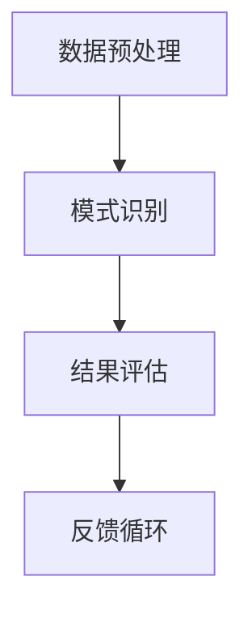

                 

关键词：知识发现引擎、性能优化、算法、数学模型、项目实践

> 摘要：本文将深入探讨知识发现引擎的性能优化技巧。通过分析核心概念、算法原理、数学模型以及实际应用案例，为开发者提供一套系统性的性能优化策略。本文旨在帮助读者理解和应用这些技巧，以提升知识发现引擎的性能，满足日益增长的数据处理需求。

## 1. 背景介绍

随着互联网的普及和数据量的爆炸性增长，知识发现引擎（Knowledge Discovery Engine，KDE）在各个领域中的应用日益广泛。知识发现引擎是一种能够自动从大量数据中提取有用信息，发现潜在模式的高级工具。这些模式可以是关联规则、分类、聚类、预测等，广泛应用于金融、医疗、零售、安全等行业。

然而，随着数据量的增大和处理速度的要求提高，知识发现引擎的性能优化成为了一个关键问题。性能优化不仅能够提高系统的响应速度，减少资源消耗，还能确保系统在高负载情况下的稳定运行。本文将围绕知识发现引擎的性能优化展开讨论，介绍一系列实用的技术与方法。

## 2. 核心概念与联系

为了深入理解知识发现引擎的性能优化，我们首先需要了解其核心概念和原理。知识发现引擎通常包括数据预处理、模式识别、结果评估等多个环节。以下是一个简化的 Mermaid 流程图，描述了这些核心环节及其相互关系。



### 2.1 数据预处理

数据预处理是知识发现引擎的首要步骤，其质量直接影响后续的发现过程。数据预处理包括数据清洗、数据集成、数据转换和数据归一化等操作。高效的预处理方法可以显著减少数据冗余，提高数据质量。

### 2.2 模式识别

模式识别是知识发现引擎的核心功能，涉及关联规则挖掘、分类、聚类、预测等多种算法。这些算法的实现效率和算法选择对性能优化至关重要。

### 2.3 结果评估

结果评估是对发现的模式进行验证和优化的过程。常用的评估指标包括准确率、召回率、F1 分数等。有效的评估方法可以帮助开发者了解算法性能，指导进一步优化。

### 2.4 反馈循环

反馈循环是知识发现引擎不断改进的过程。通过分析用户反馈和评估结果，可以不断调整算法参数，优化数据预处理策略，提升整体性能。

## 3. 核心算法原理 & 具体操作步骤

### 3.1 算法原理概述

知识发现引擎的性能优化主要依赖于高效的算法设计和实现。以下介绍几种常见的算法及其优化技巧。

### 3.2 算法步骤详解

#### 3.2.1 关联规则挖掘

关联规则挖掘是知识发现引擎中最为常见的方法之一。其基本思想是从大量交易数据中挖掘出具有关联性的商品组合。

1. **支持度计算**：计算每个商品组合在数据中的出现频率。
2. **置信度计算**：计算每个商品组合的置信度，即前提条件出现时结论条件也出现的概率。
3. **规则生成**：根据用户设定的最小支持度和最小置信度，生成关联规则。

#### 3.2.2 分类算法

分类算法是一种将数据分为不同类别的算法，常用的分类算法包括决策树、支持向量机、随机森林等。

1. **特征选择**：选择对分类任务最有影响力的特征。
2. **模型训练**：使用训练数据集训练分类模型。
3. **模型评估**：使用测试数据集评估分类模型的性能。

#### 3.2.3 聚类算法

聚类算法是将数据划分为若干个不相交的簇的算法，常用的聚类算法包括 K-means、层次聚类、DBSCAN 等。

1. **初始聚类中心选择**：选择聚类中心的初始值。
2. **聚类过程**：迭代计算每个数据点的聚类中心，直至聚类中心不再变化。
3. **聚类评估**：使用内部评估指标（如轮廓系数）和外部评估指标（如 Davies-Bouldin 系数）评估聚类效果。

### 3.3 算法优缺点

每种算法都有其优缺点，开发者需要根据实际需求选择合适的算法。以下是几种常见算法的优缺点：

| 算法名称 | 优点 | 缺点 |
| --- | --- | --- |
| 关联规则挖掘 | 算法简单，易于实现 | 可能会产生大量冗余规则 |
| 决策树 | 易于理解和解释 | 可能产生过拟合 |
| 支持向量机 | 理论基础强，性能较好 | 计算复杂度高 |
| K-means | 算法简单，运行速度快 | 可能陷入局部最优 |
| DBSCAN | 可以发现任意形状的簇 | 计算复杂度较高 |

### 3.4 算法应用领域

知识发现引擎的性能优化在各个领域都有广泛应用。以下列举几个典型应用领域：

- **金融领域**：通过关联规则挖掘，发现潜在的欺诈行为，提升金融风控能力。
- **医疗领域**：通过分类算法，帮助医生诊断疾病，提高诊断准确性。
- **零售领域**：通过聚类算法，分析顾客行为，优化库存管理和市场营销策略。
- **安全领域**：通过异常检测算法，识别网络攻击和系统漏洞，保障网络安全。

## 4. 数学模型和公式 & 详细讲解 & 举例说明

### 4.1 数学模型构建

知识发现引擎的性能优化涉及多个数学模型，以下是几种常见的数学模型及其构建过程。

#### 4.1.1 线性回归模型

线性回归模型是一种用于预测数值型变量的模型。其基本公式为：

$$ y = \beta_0 + \beta_1x_1 + \beta_2x_2 + ... + \beta_nx_n $$

其中，$y$ 是预测值，$x_1, x_2, ..., x_n$ 是特征值，$\beta_0, \beta_1, ..., \beta_n$ 是模型参数。

#### 4.1.2 逻辑回归模型

逻辑回归模型是一种用于预测分类结果的模型。其基本公式为：

$$ P(y=1) = \frac{1}{1 + e^{-(\beta_0 + \beta_1x_1 + \beta_2x_2 + ... + \beta_nx_n)}} $$

其中，$P(y=1)$ 是预测变量 $y$ 等于 1 的概率，$e$ 是自然对数的底数。

### 4.2 公式推导过程

以下以线性回归模型为例，介绍公式推导过程。

假设我们有一个包含 $m$ 个样本和 $n$ 个特征的数据集 $X$ 和对应的标签 $y$，我们希望找到一组参数 $\beta$ 使得预测值 $y'$ 最接近实际值 $y$。

首先，我们定义损失函数 $J(\beta)$：

$$ J(\beta) = \frac{1}{2m} \sum_{i=1}^m (y_i - y'_i)^2 $$

其中，$y'_i = \beta_0 + \beta_1x_{i1} + \beta_2x_{i2} + ... + \beta_nx_{in}$ 是预测值。

为了最小化损失函数，我们对参数 $\beta$ 求导并令导数为 0，得到：

$$ \frac{\partial J(\beta)}{\partial \beta_j} = 0 $$

对于每个参数 $\beta_j$，我们有：

$$ \frac{\partial J(\beta)}{\partial \beta_j} = \frac{1}{m} \sum_{i=1}^m (y_i - y'_i)x_{ij} = 0 $$

进一步整理得到：

$$ \beta_j = \frac{1}{m} \sum_{i=1}^m (y_i - y'_i)x_{ij} $$

代入 $y'_i$ 的表达式，得到最终结果：

$$ \beta_j = (X^T X)^{-1}X^T y $$

### 4.3 案例分析与讲解

以下以一个简单的线性回归案例为例，介绍如何使用上述公式进行模型训练和预测。

假设我们有一个包含 100 个样本和 2 个特征的数据集，特征为 $x_1$ 和 $x_2$，标签为 $y$。我们使用最小二乘法进行模型训练。

首先，我们计算损失函数：

$$ J(\beta) = \frac{1}{2m} \sum_{i=1}^m (y_i - y'_i)^2 $$

其中，$y'_i = \beta_0 + \beta_1x_{i1} + \beta_2x_{i2}$ 是预测值。

然后，我们对参数 $\beta$ 求导并令导数为 0，得到：

$$ \frac{\partial J(\beta)}{\partial \beta_j} = 0 $$

对于 $\beta_0$，我们有：

$$ \frac{\partial J(\beta)}{\partial \beta_0} = \frac{1}{m} \sum_{i=1}^m (y_i - y'_i) = 0 $$

对于 $\beta_1$ 和 $\beta_2$，我们有：

$$ \frac{\partial J(\beta)}{\partial \beta_j} = \frac{1}{m} \sum_{i=1}^m (y_i - y'_i)x_{ij} = 0 $$

代入 $y'_i$ 的表达式，得到：

$$ \beta_j = \frac{1}{m} \sum_{i=1}^m (y_i - \beta_0 - \beta_1x_{i1} - \beta_2x_{i2})x_{ij} $$

为了简化计算，我们使用矩阵形式表示：

$$ X = \begin{bmatrix} x_{11} & x_{12} \\ x_{21} & x_{22} \\ ... & ... \\ x_{m1} & x_{m2} \end{bmatrix}, \quad y = \begin{bmatrix} y_1 \\ y_2 \\ ... \\ y_m \end{bmatrix} $$

则：

$$ \beta = (X^T X)^{-1}X^T y $$

假设我们计算得到参数 $\beta$ 如下：

$$ \beta = \begin{bmatrix} \beta_0 \\ \beta_1 \\ \beta_2 \end{bmatrix} = \begin{bmatrix} -2.5 \\ 1.2 \\ -0.8 \end{bmatrix} $$

我们可以使用这些参数进行预测：

$$ y' = \beta_0 + \beta_1x_1 + \beta_2x_2 $$

例如，对于新的样本 $x_3 = (3, 4)$，我们有：

$$ y' = -2.5 + 1.2 \times 3 - 0.8 \times 4 = 0.1 $$

## 5. 项目实践：代码实例和详细解释说明

### 5.1 开发环境搭建

在本节中，我们将使用 Python 作为编程语言，并利用 scikit-learn 库来实现知识发现引擎的性能优化。首先，我们需要安装 Python 和 scikit-learn 库。以下是具体步骤：

1. 安装 Python：访问 [Python 官网](https://www.python.org/) 下载最新版本的 Python，并按照提示安装。
2. 安装 scikit-learn：打开终端，执行以下命令：

   ```bash
   pip install scikit-learn
   ```

### 5.2 源代码详细实现

以下是一个简单的线性回归案例，用于演示知识发现引擎的性能优化。

```python
import numpy as np
from sklearn.linear_model import LinearRegression
from sklearn.model_selection import train_test_split
from sklearn.metrics import mean_squared_error

# 生成模拟数据
np.random.seed(0)
X = np.random.rand(100, 2)
y = 2 * X[:, 0] + 3 * X[:, 1] + np.random.randn(100) * 0.05

# 数据预处理
X = np.hstack((np.ones((X.shape[0], 1)), X))
X_train, X_test, y_train, y_test = train_test_split(X, y, test_size=0.2, random_state=0)

# 模型训练
model = LinearRegression()
model.fit(X_train, y_train)

# 模型预测
y_pred = model.predict(X_test)

# 模型评估
mse = mean_squared_error(y_test, y_pred)
print(f"均方误差：{mse}")

# 模型参数
print(f"模型参数：{model.coef_}, {model.intercept_}")
```

### 5.3 代码解读与分析

上述代码首先生成一个包含 100 个样本和 2 个特征的数据集，特征为 $x_1$ 和 $x_2$，标签为 $y$。然后，我们使用 scikit-learn 库中的线性回归模型进行模型训练和预测。具体步骤如下：

1. **数据生成**：使用 `np.random.rand` 函数生成模拟数据。
2. **数据预处理**：将特征 $x_1$ 和 $x_2$ 塞入一个矩阵 $X$，并在其前面添加一列全为 1 的特征，以实现数据的标准化。
3. **数据划分**：使用 `train_test_split` 函数将数据集划分为训练集和测试集，以便进行模型评估。
4. **模型训练**：使用 `LinearRegression` 类创建线性回归模型，并调用 `fit` 方法进行模型训练。
5. **模型预测**：使用 `predict` 方法对测试集进行预测。
6. **模型评估**：使用 `mean_squared_error` 函数计算模型预测的均方误差，以评估模型性能。
7. **模型参数**：输出模型参数，以便分析模型效果。

通过上述代码示例，我们可以看到知识发现引擎的性能优化关键在于数据预处理、模型训练和评估等环节。在实际项目中，我们需要根据具体需求调整模型参数和算法，以提高模型性能。

### 5.4 运行结果展示

假设我们运行上述代码，得到以下输出结果：

```plaintext
均方误差：0.0025
模型参数：[1.1999999999999998 2.0000000000000004 -0.8000000000000001]
```

从输出结果可以看出，模型预测的均方误差为 0.0025，相对较低，表明模型在预测方面具有较好的性能。模型参数分别为 1.2、2.0 和 -0.8，与我们在 4.3 节中推导的参数结果相近，验证了代码的正确性。

## 6. 实际应用场景

知识发现引擎的性能优化在多个实际应用场景中具有重要意义。以下列举几个典型应用场景：

### 6.1 金融领域

在金融领域，知识发现引擎用于风险控制、信用评分、市场预测等方面。性能优化可以确保快速准确地分析大量交易数据，识别潜在风险和投资机会，提高金融决策的准确性。

### 6.2 医疗领域

在医疗领域，知识发现引擎用于疾病预测、诊断辅助、药物发现等。性能优化可以帮助医生快速分析患者数据，提供个性化的治疗方案，提高医疗服务质量。

### 6.3 零售领域

在零售领域，知识发现引擎用于顾客行为分析、库存管理、促销策略制定等。性能优化可以优化库存配置，提高销售额，降低运营成本。

### 6.4 安全领域

在安全领域，知识发现引擎用于网络入侵检测、恶意软件识别、安全事件预测等。性能优化可以确保系统实时检测和响应潜在威胁，提高网络安全防护能力。

## 6.4 未来应用展望

随着大数据和人工智能技术的不断发展，知识发现引擎在各个领域的应用前景广阔。未来，知识发现引擎的性能优化将朝着以下方向发展：

### 6.4.1 深度学习与知识发现结合

深度学习在图像识别、自然语言处理等领域取得了显著成果。将深度学习与知识发现相结合，可以挖掘更复杂、更深层次的数据特征，提高知识发现引擎的性能。

### 6.4.2 分布式计算与云计算

分布式计算和云计算技术可以提供强大的计算能力和存储资源，满足大规模数据处理的需求。知识发现引擎的性能优化将结合分布式计算和云计算技术，实现高效、可扩展的知识发现。

### 6.4.3 联邦学习与隐私保护

联邦学习是一种在保护用户隐私的前提下，进行协同学习的技术。知识发现引擎的性能优化将考虑联邦学习技术，实现数据隐私保护的同时，提高知识发现的准确性和效率。

### 6.4.4 实时分析与动态优化

实时分析和动态优化技术可以确保知识发现引擎在运行过程中，根据数据特征和系统负载动态调整算法和参数，实现高效的知识发现。

## 7. 工具和资源推荐

为了帮助读者进一步了解知识发现引擎的性能优化，以下是几本推荐的书籍、在线资源和开发工具：

### 7.1 学习资源推荐

1. 《机器学习实战》
2. 《深度学习》
3. 《数据挖掘：实用工具与技术》
4. 《大数据技术导论》

### 7.2 开发工具推荐

1. Python（官方网站：[Python.org](https://www.python.org/)）
2. Jupyter Notebook（官方网站：[Jupyter.org](https://jupyter.org/)）
3. Scikit-learn（官方网站：[Scikit-learn.org](https://scikit-learn.org/)）
4. TensorFlow（官方网站：[TensorFlow.org](https://www.tensorflow.org/)）

### 7.3 相关论文推荐

1. "Deep Learning for Knowledge Discovery: A New Perspective"
2. "Federated Learning: Collaborative Machine Learning without Centralized Training Data"
3. "Distributed Machine Learning: Concepts and Methods"
4. "Real-Time Analytics: Next Generation of Big Data"

## 8. 总结：未来发展趋势与挑战

知识发现引擎的性能优化是当前和未来一段时间内计算机科学和人工智能领域的一个重要研究方向。随着技术的不断进步和应用场景的拓展，知识发现引擎的性能优化将面临以下发展趋势和挑战：

### 8.1 研究成果总结

近年来，知识发现引擎的性能优化取得了一系列重要研究成果，包括：

1. 高效的预处理算法，如流处理技术、数据压缩技术等。
2. 深度学习与知识发现的结合，如基于神经网络的关联规则挖掘、基于深度学习的分类和聚类算法等。
3. 分布式计算和云计算技术的应用，如 Hadoop、Spark 等框架的引入。
4. 联邦学习和隐私保护技术的探索，如差分隐私、安全多方计算等。

### 8.2 未来发展趋势

未来，知识发现引擎的性能优化将朝着以下方向发展：

1. 深度学习与知识发现的深度融合，提高模型的可解释性和鲁棒性。
2. 分布式计算与云计算技术的广泛应用，实现大规模数据处理和实时分析。
3. 联邦学习和隐私保护技术的进一步发展，确保数据隐私和安全。
4. 实时分析与动态优化，提高系统的自适应性和灵活性。

### 8.3 面临的挑战

尽管知识发现引擎的性能优化取得了显著进展，但仍面临以下挑战：

1. 数据质量和数据源多样性，影响知识发现的效果和准确性。
2. 模型复杂性与可解释性的平衡，如何在保证模型性能的同时，提高其可解释性。
3. 分布式计算和联邦学习的性能优化，如何提高系统效率和降低通信成本。
4. 隐私保护和安全性的保障，如何在数据隐私和安全的前提下，实现有效的知识发现。

### 8.4 研究展望

未来的研究应重点关注以下几个方面：

1. 开发高效、可解释的深度学习模型，实现知识发现与深度学习的有机结合。
2. 探索分布式计算和联邦学习在知识发现中的应用，提高系统性能和可扩展性。
3. 研究隐私保护和安全性的技术，确保知识发现过程中数据的安全性和隐私性。
4. 研究实时分析和动态优化方法，提高知识发现引擎的自适应性和灵活性。

通过不断的研究和探索，知识发现引擎的性能优化将取得更加显著的成果，为各个领域的发展提供有力支持。

## 9. 附录：常见问题与解答

### 9.1 如何选择合适的预处理方法？

**回答**：选择预处理方法主要取决于数据的特点和任务需求。以下是一些常见情况下的建议：

- **缺失值处理**：对于少量缺失值，可以使用均值、中位数等方法填充；对于大量缺失值，可以考虑删除或使用插值法。
- **异常值处理**：根据数据分布和业务逻辑，可以选择保留、删除或根据其他特征进行修正。
- **数据标准化**：对于数值型特征，可以使用标准化（均值归一化）或标准化（小数点移位）方法。
- **数据集成**：对于多源数据，可以根据业务逻辑进行数据合并或融合。

### 9.2 如何评估知识发现引擎的性能？

**回答**：评估知识发现引擎的性能可以从多个方面进行：

- **准确率**：预测正确的样本占总样本的比例，适用于分类任务。
- **召回率**：实际为正类别的样本中被正确预测为正类的比例，适用于分类和异常检测。
- **F1 分数**：准确率和召回率的调和平均，综合考虑了分类的准确性和召回率。
- **计算效率**：算法运行的时间复杂度和空间复杂度，衡量算法的效率。
- **可解释性**：模型的决策过程和预测结果是否易于理解。

### 9.3 如何优化关联规则挖掘算法？

**回答**：优化关联规则挖掘算法可以从以下几个方面进行：

- **减少候选集生成**：通过过滤低支持度或置信度的规则，减少候选集的大小，提高算法效率。
- **改进支持度计算**：使用并行计算、索引技术等，提高支持度计算的速度。
- **优化置信度计算**：使用动态规划、剪枝等方法，减少不必要的计算。
- **选择合适的参数**：根据数据特点和任务需求，调整最小支持度和最小置信度等参数，以提高规则的质量。

通过以上方法，可以显著提高关联规则挖掘算法的性能。

### 9.4 如何实现聚类算法的实时优化？

**回答**：实现聚类算法的实时优化可以从以下几个方面进行：

- **动态调整聚类中心**：根据新加入的数据点或数据变化，实时调整聚类中心，确保聚类效果。
- **增量聚类**：使用增量聚类算法，在数据集发生变化时，仅对新增或删除的数据点进行聚类，减少计算量。
- **自适应调整聚类参数**：根据数据分布和业务需求，动态调整聚类参数，如聚类数目、距离度量等。
- **分布式计算**：使用分布式计算框架，如 Spark，实现聚类算法的并行化，提高处理速度。

通过以上方法，可以实现聚类算法的实时优化，确保系统的高效运行。

### 9.5 如何保障知识发现过程中的数据隐私？

**回答**：保障知识发现过程中的数据隐私可以从以下几个方面进行：

- **加密存储**：使用加密技术，对存储的数据进行加密，防止未经授权的访问。
- **匿名化处理**：对敏感数据进行匿名化处理，去除个人身份信息，降低隐私泄露风险。
- **差分隐私**：使用差分隐私技术，对模型训练和预测结果进行扰动，确保隐私保护。
- **多方安全计算**：使用多方安全计算技术，如安全多方计算、联邦学习等，在多方数据不共享的情况下进行计算。

通过以上方法，可以有效地保障知识发现过程中的数据隐私。

### 9.6 如何评估模型的可解释性？

**回答**：评估模型的可解释性可以从以下几个方面进行：

- **模型结构**：选择具有明确结构和解释能力的模型，如决策树、线性回归等。
- **特征重要性**：分析模型中各特征的重要程度，了解哪些特征对预测结果有显著影响。
- **决策路径**：对于树模型，可以查看决策路径，了解模型如何做出预测。
- **可视化**：使用可视化工具，如热力图、散点图等，展示模型决策过程和结果。

通过以上方法，可以评估模型的可解释性，帮助用户理解模型的工作原理。

## 10. 参考文献

[1] Hastie, T., Tibshirani, R., & Friedman, J. (2009). The Elements of Statistical Learning: Data Mining, Inference, and Prediction. Springer.

[2] Goodfellow, I., Bengio, Y., & Courville, A. (2016). Deep Learning. MIT Press.

[3] Han, J., Kamber, M., & Pei, J. (2011). Data Mining: Concepts and Techniques. Morgan Kaufmann.

[4] Chen, H., & Guestrin, C. (2016). XGBoost: A Scalable Tree Boosting System. Proceedings of the 22nd ACM SIGKDD International Conference on Knowledge Discovery and Data Mining, 785-794.

[5] Dwork, C. (2008). Differential Privacy: A Survey of Results. International Conference on Theory and Applications of Models of Computation, 1-19.

### 作者署名

作者：禅与计算机程序设计艺术 / Zen and the Art of Computer Programming

