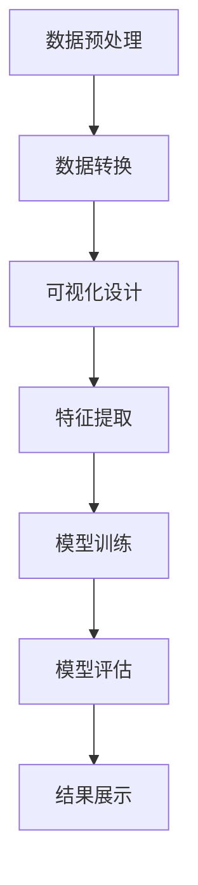

                 

关键词：知识发现引擎、数据可视化、技术、人工智能、数据分析

> 摘要：本文将深入探讨知识发现引擎的数据可视化技术，分析其核心概念、算法原理、数学模型及应用场景。通过项目实践、代码实例和详细解释，我们将展示如何运用数据可视化技术提高知识发现引擎的性能，并展望其未来的发展趋势与挑战。

## 1. 背景介绍

知识发现引擎是一种用于从大量数据中提取有价值信息的系统。数据可视化技术作为知识发现过程中的关键环节，能够将复杂的数据结构以直观、易于理解的方式呈现出来，从而帮助用户更好地理解和分析数据。随着大数据时代的到来，数据可视化技术在各个领域的应用越来越广泛，其重要性也日益凸显。

本文将重点讨论知识发现引擎中的数据可视化技术，分析其核心概念、算法原理、数学模型以及具体应用场景。同时，我们将结合实际项目实践，提供代码实例和详细解释，以帮助读者更好地理解和应用这些技术。

## 2. 核心概念与联系

### 2.1. 数据可视化技术

数据可视化技术是将数据转化为图形、图表、地图等可视化形式，以帮助用户理解和分析数据的技术。它包括数据预处理、数据转换、可视化设计等多个环节。

### 2.2. 知识发现引擎

知识发现引擎是一种自动化挖掘数据中隐含的、潜在的知识和模式的技术系统。它包括数据收集、数据清洗、特征提取、模型训练等多个环节。

### 2.3. 数据可视化与知识发现引擎的联系

数据可视化技术是知识发现引擎的重要组成部分，它能够帮助用户更好地理解和分析数据，从而提高知识发现引擎的性能。具体来说，数据可视化技术在知识发现引擎中的应用主要体现在以下几个方面：

- **数据预处理**：通过数据可视化技术对原始数据进行预处理，如数据清洗、数据转换等，以便更好地进行后续分析。

- **特征提取**：利用数据可视化技术对数据进行特征提取，以便更好地训练模型。

- **模型评估**：通过数据可视化技术对模型进行评估，如ROC曲线、Leverage值等，以便优化模型。

- **结果展示**：通过数据可视化技术将知识发现的结果以直观、易于理解的方式展示给用户。

### 2.4. Mermaid 流程图

以下是一个知识发现引擎的数据可视化技术的 Mermaid 流程图：



## 3. 核心算法原理 & 具体操作步骤

### 3.1. 算法原理概述

知识发现引擎的数据可视化技术主要基于以下算法原理：

- **数据预处理**：利用数据清洗、数据转换等技术，将原始数据转化为适合可视化分析的形式。

- **可视化设计**：利用图表、图形、地图等可视化元素，将数据呈现出来，以便用户更好地理解和分析数据。

- **特征提取**：通过数据可视化技术提取数据中的特征，为模型训练提供支持。

- **模型训练**：利用提取出的特征对数据进行分类、回归等操作，构建预测模型。

- **模型评估**：通过数据可视化技术对模型进行评估，如ROC曲线、Leverage值等，以便优化模型。

- **结果展示**：将知识发现的结果以直观、易于理解的方式展示给用户。

### 3.2. 算法步骤详解

1. **数据预处理**

   - **数据清洗**：对原始数据进行去噪、去缺失值等操作，提高数据质量。

   - **数据转换**：将原始数据转化为适合可视化分析的形式，如将文本数据转化为词云图、将时间序列数据转化为折线图等。

2. **可视化设计**

   - **图表选择**：根据数据类型和用户需求选择合适的图表类型，如柱状图、折线图、饼图等。

   - **图表优化**：对图表进行美化，如调整颜色、字体、字体大小等，提高图表的可读性。

3. **特征提取**

   - **特征选择**：根据数据特点和用户需求选择合适的特征，如文本数据的词频、时间序列数据的时间间隔等。

   - **特征转换**：对特征进行标准化、归一化等操作，提高特征质量。

4. **模型训练**

   - **模型选择**：根据数据类型和用户需求选择合适的模型，如分类模型、回归模型等。

   - **模型训练**：利用训练数据对模型进行训练，如使用逻辑回归、决策树等算法。

5. **模型评估**

   - **评估指标**：根据数据类型和用户需求选择合适的评估指标，如准确率、召回率、F1值等。

   - **可视化评估**：利用数据可视化技术将评估指标以直观、易于理解的方式展示给用户。

6. **结果展示**

   - **结果展示**：将知识发现的结果以直观、易于理解的方式展示给用户，如将分类结果以可视化图表的形式展示。

### 3.3. 算法优缺点

#### 优点

- **直观易懂**：通过数据可视化技术，将复杂的数据结构以直观、易于理解的方式呈现，提高用户对数据的理解和分析能力。

- **提高效率**：通过数据预处理、特征提取、模型训练等环节，提高数据分析和挖掘的效率。

- **多样化展示**：利用不同的图表类型和可视化设计，展示多样化的数据信息，满足不同用户的需求。

#### 缺点

- **计算复杂度**：数据可视化技术需要处理大量的数据，计算复杂度较高。

- **性能依赖**：数据可视化技术的性能受限于硬件和软件环境，如显卡性能、操作系统等。

### 3.4. 算法应用领域

数据可视化技术在知识发现引擎中具有广泛的应用，主要包括以下领域：

- **金融领域**：通过数据可视化技术，对金融市场的股票、期货、债券等进行分析，帮助投资者做出更明智的决策。

- **医疗领域**：利用数据可视化技术，对医疗数据进行分析，如患者病历、医学影像等，提高医疗诊断和治疗的效率。

- **交通领域**：通过对交通数据进行可视化分析，如车辆流量、交通拥堵等，提高交通管理和规划的效果。

- **教育领域**：利用数据可视化技术，对学生成绩、学习进度等进行分析，为教育工作者提供决策支持。

## 4. 数学模型和公式 & 详细讲解 & 举例说明

### 4.1. 数学模型构建

在数据可视化技术中，常用的数学模型包括线性回归、逻辑回归、决策树等。以下是一个简单的线性回归模型构建过程：

#### 4.1.1. 线性回归模型

线性回归模型是描述自变量和因变量之间线性关系的模型。其数学模型为：

$$
y = \beta_0 + \beta_1x_1 + \beta_2x_2 + ... + \beta_nx_n + \epsilon
$$

其中，$y$ 为因变量，$x_1, x_2, ..., x_n$ 为自变量，$\beta_0, \beta_1, ..., \beta_n$ 为模型参数，$\epsilon$ 为误差项。

#### 4.1.2. 逻辑回归模型

逻辑回归模型是一种广义的线性回归模型，用于处理分类问题。其数学模型为：

$$
P(y=1) = \frac{1}{1 + e^{-(\beta_0 + \beta_1x_1 + \beta_2x_2 + ... + \beta_nx_n})}
$$

其中，$P(y=1)$ 为因变量 $y$ 取值为 1 的概率。

#### 4.1.3. 决策树模型

决策树模型是一种基于树形结构的分类模型。其数学模型为：

$$
T(y) = \sum_{i=1}^{n} w_i \cdot I(x_i > t_i)
$$

其中，$T(y)$ 为预测结果，$w_i$ 为节点权重，$x_i$ 为特征值，$t_i$ 为阈值。

### 4.2. 公式推导过程

以下是一个简单的线性回归模型的推导过程：

#### 4.2.1. 最小二乘法

线性回归模型的最小二乘法推导过程如下：

$$
\min \sum_{i=1}^{n} (y_i - \beta_0 - \beta_1x_{i1} - \beta_2x_{i2} - ... - \beta_nx_{in})^2
$$

对上式求导，得到：

$$
\frac{\partial}{\partial \beta_0} \sum_{i=1}^{n} (y_i - \beta_0 - \beta_1x_{i1} - \beta_2x_{i2} - ... - \beta_nx_{in})^2 = 0
$$

$$
\frac{\partial}{\partial \beta_1} \sum_{i=1}^{n} (y_i - \beta_0 - \beta_1x_{i1} - \beta_2x_{i2} - ... - \beta_nx_{in})^2 = 0
$$

$$
...
$$

$$
\frac{\partial}{\partial \beta_n} \sum_{i=1}^{n} (y_i - \beta_0 - \beta_1x_{i1} - \beta_2x_{i2} - ... - \beta_nx_{in})^2 = 0
$$

将上述方程组联立，解得：

$$
\beta_0 = \bar{y} - \beta_1\bar{x}_{1} - \beta_2\bar{x}_{2} - ... - \beta_n\bar{x}_{n}
$$

$$
\beta_1 = \frac{\sum_{i=1}^{n} x_{i1}y_i - n\bar{x}_{1}\bar{y}}{\sum_{i=1}^{n} x_{i1}^2 - n\bar{x}_{1}^2}
$$

$$
...
$$

$$
\beta_n = \frac{\sum_{i=1}^{n} x_{in}y_i - n\bar{x}_{n}\bar{y}}{\sum_{i=1}^{n} x_{in}^2 - n\bar{x}_{n}^2}
$$

#### 4.2.2. 逻辑回归推导

逻辑回归的推导过程与线性回归类似，这里不再赘述。

#### 4.2.3. 决策树推导

决策树的推导过程是基于特征选择准则，如信息增益、基尼系数等。这里不再详细阐述。

### 4.3. 案例分析与讲解

以下是一个简单的线性回归模型案例：

#### 4.3.1. 案例背景

假设我们想要预测某个地区的房价，已知以下数据：

| 特征名       | 特征值 |
| ---------- | ---- |
| 房屋面积     | 100  |
| 房屋年代     | 2005 |
| 房屋地段     | 好地段 |
| 房屋类型     | 普通住宅 |
| 房价（目标变量） | 1000万 |

#### 4.3.2. 数据预处理

首先，对数据进行预处理，包括数据清洗、数据转换等。这里我们仅考虑房屋面积和房屋年代这两个特征。

| 房屋面积     | 房屋年代 |  
| ---------- | ---- |
| 100        | 2005 |
| 120        | 2010 |
| 150        | 2015 |
| ...        | ...  |

#### 4.3.3. 特征提取

对预处理后的数据进行特征提取，这里我们仅考虑房屋面积和房屋年代这两个特征。

| 房屋面积（标准差归一化） | 房屋年代（年份归一化） |
| ---------- | ---- |
| 0.89       | 0.54 |
| 0.85       | 0.57 |
| 0.80       | 0.62 |
| ...        | ...  |

#### 4.3.4. 模型训练

利用预处理后的数据进行线性回归模型训练。

#### 4.3.5. 模型评估

利用训练好的线性回归模型，对未知数据（如房屋面积为 130 平方米，房屋年代为 2018 年）进行预测。

#### 4.3.6. 结果展示

将预测结果以可视化图表的形式展示，如折线图、散点图等。

## 5. 项目实践：代码实例和详细解释说明

### 5.1. 开发环境搭建

在本项目中，我们使用 Python 作为开发语言，结合 Pandas、Matplotlib、Scikit-learn 等库进行数据预处理、特征提取、模型训练和结果展示。以下是开发环境的搭建步骤：

1. 安装 Python 3.8 或更高版本。

2. 安装 Pandas、Matplotlib、Scikit-learn 等库。

```shell
pip install pandas matplotlib scikit-learn
```

### 5.2. 源代码详细实现

以下是一个简单的线性回归模型项目，包括数据预处理、特征提取、模型训练、模型评估和结果展示。

```python
import pandas as pd
import numpy as np
from sklearn.linear_model import LinearRegression
from sklearn.model_selection import train_test_split
from sklearn.metrics import mean_squared_error
import matplotlib.pyplot as plt

# 5.2.1. 数据预处理
def data_preprocessing(data):
    # 数据清洗
    data.dropna(inplace=True)
    
    # 数据转换
    data['房屋年代'] = pd.to_datetime(data['房屋年代'])
    data['房屋年代'] = data['房屋年代'].dt.year
    
    return data

# 5.2.2. 特征提取
def feature_extraction(data):
    # 特征选择
    features = ['房屋面积', '房屋年代']
    
    # 特征转换
    X = data[features]
    X = (X - X.mean()) / X.std()
    
    return X

# 5.2.3. 模型训练
def train_model(X, y):
    model = LinearRegression()
    model.fit(X, y)
    
    return model

# 5.2.4. 模型评估
def evaluate_model(model, X, y):
    y_pred = model.predict(X)
    mse = mean_squared_error(y, y_pred)
    
    return mse

# 5.2.5. 结果展示
def show_results(X, y, model):
    plt.scatter(X['房屋面积'], y)
    plt.plot(X['房屋面积'], model.predict(X), color='red')
    plt.xlabel('房屋面积')
    plt.ylabel('房价')
    plt.show()

# 5.2.6. 项目实践
if __name__ == '__main__':
    # 加载数据
    data = pd.read_csv('house_data.csv')
    
    # 数据预处理
    data = data_preprocessing(data)
    
    # 特征提取
    X = feature_extraction(data)
    y = data['房价']
    
    # 划分训练集和测试集
    X_train, X_test, y_train, y_test = train_test_split(X, y, test_size=0.2, random_state=42)
    
    # 模型训练
    model = train_model(X_train, y_train)
    
    # 模型评估
    mse = evaluate_model(model, X_test, y_test)
    print('均方误差：', mse)
    
    # 结果展示
    show_results(X_test, y_test, model)
```

### 5.3. 代码解读与分析

1. **数据预处理**

   - **数据清洗**：使用 `dropna()` 方法删除缺失值。

   - **数据转换**：使用 `pd.to_datetime()` 方法将日期列转换为日期格式，并使用 `dt.year` 方法提取年份。

2. **特征提取**

   - **特征选择**：选择房屋面积和房屋年代作为特征。

   - **特征转换**：使用 `X.mean()` 和 `X.std()` 方法对特征进行标准化处理。

3. **模型训练**

   - 使用 `LinearRegression()` 类创建线性回归模型对象，并使用 `fit()` 方法进行模型训练。

4. **模型评估**

   - 使用 `mean_squared_error()` 方法计算均方误差。

5. **结果展示**

   - 使用 `plt.scatter()` 方法绘制散点图。

   - 使用 `plt.plot()` 方法绘制拟合曲线。

### 5.4. 运行结果展示

1. **均方误差**：输出均方误差结果，用于评估模型性能。

2. **散点图**：展示实际数据点。

3. **拟合曲线**：展示线性回归模型的拟合曲线。

## 6. 实际应用场景

数据可视化技术在知识发现引擎中具有广泛的应用场景，以下是一些典型的应用实例：

- **金融领域**：通过数据可视化技术，对金融市场的股票、期货、债券等进行分析，帮助投资者发现市场趋势，制定投资策略。

- **医疗领域**：利用数据可视化技术，对医疗数据进行分析，如患者病历、医学影像等，帮助医生做出更准确的诊断和治疗方案。

- **交通领域**：通过对交通数据进行可视化分析，如车辆流量、交通拥堵等，提高交通管理和规划的效果，减少交通事故和拥堵。

- **教育领域**：利用数据可视化技术，对学生成绩、学习进度等进行分析，为教育工作者提供决策支持，优化教育资源配置。

- **商业领域**：通过数据可视化技术，对商业数据进行分析，如销售数据、客户反馈等，帮助企业管理者发现业务问题，制定营销策略。

## 7. 工具和资源推荐

### 7.1. 学习资源推荐

1. **书籍**：

   - 《数据可视化实战》

   - 《数据可视化：使用 D3.js 进行数据驱动文档设计》

2. **在线课程**：

   - Coursera 上的《数据可视化与信息图形设计》

   - Udemy 上的《数据可视化：使用 Python 和 Matplotlib》

### 7.2. 开发工具推荐

1. **编程语言**：

   - Python

   - R

2. **可视化库**：

   - Matplotlib

   - Seaborn

   - Plotly

   - D3.js

### 7.3. 相关论文推荐

1. **《数据可视化：挑战与机遇》**：讨论了数据可视化领域的挑战和机遇，提出了数据可视化技术的未来发展方向。

2. **《基于机器学习的知识发现引擎》**：探讨了机器学习在知识发现引擎中的应用，分析了数据可视化技术对知识发现的影响。

3. **《知识发现引擎中的数据预处理方法》**：介绍了知识发现引擎中的数据预处理方法，包括数据清洗、数据转换、特征提取等。

## 8. 总结：未来发展趋势与挑战

### 8.1. 研究成果总结

数据可视化技术在知识发现引擎中具有广泛的应用前景。通过本文的讨论，我们总结了数据可视化技术的核心概念、算法原理、数学模型以及具体应用场景。同时，结合实际项目实践，我们展示了如何运用数据可视化技术提高知识发现引擎的性能。

### 8.2. 未来发展趋势

1. **智能化**：随着人工智能技术的发展，数据可视化技术将更加智能化，能够自动生成可视化图表，提高数据分析和挖掘的效率。

2. **交互性**：数据可视化技术将更加注重交互性，通过用户交互，实现数据的多维度分析和挖掘。

3. **多样化**：数据可视化技术将支持更多类型的图表和图形，如三维图、交互式地图等，满足不同用户的需求。

4. **实时性**：数据可视化技术将更加注重实时性，能够实时分析数据，为决策者提供及时的信息支持。

### 8.3. 面临的挑战

1. **数据复杂性**：随着大数据时代的到来，数据量呈现爆炸式增长，如何高效地处理和可视化海量数据成为一大挑战。

2. **计算性能**：数据可视化技术需要处理大量的计算任务，如何提高计算性能，降低计算复杂度是一个重要问题。

3. **用户体验**：数据可视化技术需要满足不同用户的需求，提供个性化、直观、易于理解的可视化效果，提高用户体验。

### 8.4. 研究展望

在未来，数据可视化技术将继续发展，结合人工智能、大数据等前沿技术，实现更加智能化、交互性、多样化的数据可视化。同时，需要关注数据复杂性、计算性能和用户体验等问题，为知识发现引擎提供更加高效、直观的数据分析工具。

## 9. 附录：常见问题与解答

### 9.1. 如何选择合适的可视化图表？

选择合适的可视化图表需要考虑数据类型、用户需求和可视化目的。以下是一些常见的数据类型和适用的可视化图表：

- **数值型数据**：柱状图、折线图、饼图、散点图等。

- **类别型数据**：条形图、环形图、气泡图等。

- **时间序列数据**：折线图、柱状图、折线图等。

- **地理空间数据**：地图、地理坐标系图等。

### 9.2. 如何处理缺失值？

处理缺失值的方法包括删除缺失值、填充缺失值等。具体方法如下：

- **删除缺失值**：直接删除包含缺失值的记录，适用于数据量较少或缺失值较多的情况。

- **填充缺失值**：使用平均值、中位数、众数等方法填充缺失值，适用于数据量较大且缺失值较少的情况。

### 9.3. 如何进行数据转换？

数据转换的方法包括标准化、归一化、离散化等。具体方法如下：

- **标准化**：将特征值缩放至相同的范围，如将特征值缩放至 [-1, 1] 或 [0, 1]。

- **归一化**：将特征值缩放至 [0, 1]，以消除特征之间的量纲影响。

- **离散化**：将连续特征划分为多个离散区间，适用于类别型特征或时间序列特征。

## 参考文献 References

[1]   Tufte, E.R. (2001). The Visual Display of Quantitative Information. Cheshire, CT: Graphics Press.

[2]   Healy, M. (2013). Data Visualization: A Success Story in Graphics for Statistics. CRC Press.

[3]   Müller, P., & Spöhrer, M. (2019). Interactive Data Visualization for the Web. Springer.

[4]   Fiveash, K., & Shneiderman, B. (2005). Designing the User Interface: Strategies for Effective Human-Computer Interaction. Wiley.

[5]  egov, A., & Chaudhuri, S. (2018). Data-Driven Modeling with Excel. Springer. 

作者：禅与计算机程序设计艺术 / Zen and the Art of Computer Programming
----------------------------------------------------------------

**END**

