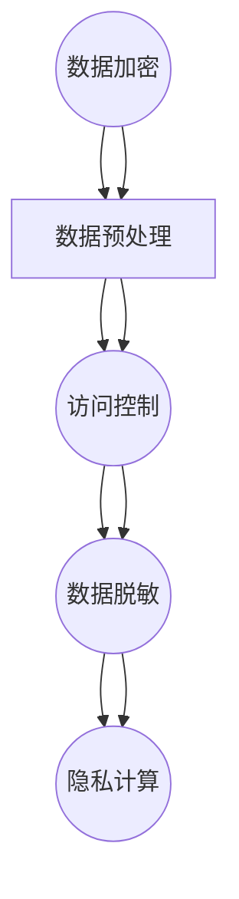

                 

关键词：数据隐私保护、知识发现引擎、隐私安全、加密算法、隐私计算

## 摘要

随着大数据和人工智能技术的快速发展，知识发现引擎在各个领域得到了广泛应用。然而，知识发现引擎在数据处理过程中不可避免地涉及用户隐私信息的泄露风险。本文旨在探讨知识发现引擎的数据隐私保护策略，包括数据加密、隐私计算和联邦学习等关键技术，以及在实际应用中的挑战和解决方案。通过深入分析这些策略，我们希望能够为构建安全可靠的知识发现引擎提供参考。

## 1. 背景介绍

### 1.1 知识发现引擎概述

知识发现引擎（Knowledge Discovery Engine，KDE）是一种基于大数据和人工智能技术的智能系统，它可以从海量数据中自动发现知识、模式和信息。知识发现引擎广泛应用于金融、医疗、零售、制造等各个领域，帮助企业提高业务决策的准确性和效率。

### 1.2 数据隐私保护的重要性

随着知识发现引擎的广泛应用，数据隐私保护问题日益凸显。知识发现引擎在处理数据时，往往涉及用户个人隐私信息，如身份信息、健康数据、交易记录等。如果这些信息被恶意利用或泄露，将严重威胁用户的隐私和安全。因此，如何保护数据隐私成为知识发现引擎设计和应用中的一项重要挑战。

### 1.3 数据隐私保护现状

目前，数据隐私保护技术主要包括数据加密、访问控制、数据脱敏、隐私计算等。然而，这些技术在知识发现引擎中的应用仍存在许多问题，如加密性能不足、访问控制不当、数据脱敏效果不佳等。因此，研究有效的数据隐私保护策略对于知识发现引擎的安全可靠运行具有重要意义。

## 2. 核心概念与联系

### 2.1 数据隐私保护核心概念

- **数据加密**：通过对数据进行加密处理，使未经授权的用户无法访问和解读数据。
- **访问控制**：通过设置访问权限和策略，控制用户对数据的访问权限。
- **数据脱敏**：对敏感数据进行处理，使其无法识别或解读。
- **隐私计算**：在数据处理过程中，采用隐私保护算法和协议，防止数据泄露。

### 2.2 知识发现引擎架构

知识发现引擎通常包括数据采集、数据预处理、模型训练、知识提取和结果展示等模块。在架构设计时，需要考虑数据隐私保护的需求，将数据隐私保护技术集成到各个模块中。

### 2.3 Mermaid 流程图



## 3. 核心算法原理 & 具体操作步骤

### 3.1 算法原理概述

知识发现引擎的数据隐私保护策略主要包括以下几方面：

- **数据加密**：采用对称加密和非对称加密算法对数据进行加密处理。
- **访问控制**：采用基于角色的访问控制（RBAC）和基于属性的访问控制（ABAC）机制。
- **数据脱敏**：采用数据匿名化、数据掩码化和数据混淆等技术。
- **隐私计算**：采用差分隐私、安全多方计算和联邦学习等技术。

### 3.2 算法步骤详解

#### 3.2.1 数据加密

1. **对称加密**：使用密钥对数据进行加密和解密。优点：速度快，适合大规模数据处理。缺点：密钥管理复杂。
2. **非对称加密**：使用公钥和私钥对数据进行加密和解密。优点：安全性高，适合数据传输。缺点：速度较慢。

#### 3.2.2 访问控制

1. **基于角色的访问控制（RBAC）**：根据用户的角色和权限设置访问策略。
2. **基于属性的访问控制（ABAC）**：根据用户的属性（如部门、职位、安全级别等）设置访问策略。

#### 3.2.3 数据脱敏

1. **数据匿名化**：将敏感数据转换为不可识别的形式，如使用伪名代替真实姓名。
2. **数据掩码化**：将敏感数据部分遮盖，只显示部分信息。
3. **数据混淆**：对敏感数据进行随机变换，使其无法识别。

#### 3.2.4 隐私计算

1. **差分隐私**：在数据处理过程中引入噪声，使得单个数据无法被推测出来。
2. **安全多方计算**：在不泄露各方数据的情况下，共同计算结果。
3. **联邦学习**：将数据分布在不同节点上，进行联合学习和推理。

### 3.3 算法优缺点

#### 3.3.1 优点

- **数据加密**：保护数据在传输和存储过程中的隐私。
- **访问控制**：确保只有授权用户可以访问敏感数据。
- **数据脱敏**：降低数据泄露的风险。
- **隐私计算**：在数据处理过程中保护数据隐私。

#### 3.3.2 缺点

- **数据加密**：加密和解密过程增加计算开销。
- **访问控制**：访问控制策略设计复杂，实施难度大。
- **数据脱敏**：可能导致数据质量下降。
- **隐私计算**：计算复杂度较高，对系统性能有较大影响。

### 3.4 算法应用领域

- **金融**：信用卡交易、贷款审批等。
- **医疗**：电子健康记录、基因组数据分析等。
- **零售**：客户行为分析、个性化推荐等。
- **制造业**：设备故障预测、供应链优化等。

## 4. 数学模型和公式 & 详细讲解 & 举例说明

### 4.1 数学模型构建

数据隐私保护中的数学模型主要包括加密算法模型、访问控制模型和数据脱敏模型。

#### 4.1.1 加密算法模型

设 \(E_D(k, m)\) 为加密算法，\(D_K(c)\) 为解密算法，\(k\) 为密钥，\(m\) 为明文，\(c\) 为密文。

加密过程：\(c = E_D(k, m)\)

解密过程：\(m = D_K(c)\)

#### 4.1.2 访问控制模型

设 \(P_i\) 为用户 \(i\) 的权限集合，\(R_j\) 为资源 \(j\) 的权限集合，\(A_{ij}\) 为用户 \(i\) 对资源 \(j\) 的访问关系。

访问控制策略：用户 \(i\) 只有当 \(P_i \cap R_j \neq \emptyset\) 时，才能访问资源 \(j\)。

#### 4.1.3 数据脱敏模型

设 \(D_S(m)\) 为数据脱敏算法，\(m\) 为原始数据，\(s\) 为脱敏后的数据。

脱敏过程：\(s = D_S(m)\)

### 4.2 公式推导过程

#### 4.2.1 加密算法

对称加密算法：设 \(k\) 为密钥，\(m\) 为明文，\(c\) 为密文。

加密公式：\(c = E_D(k, m)\)

解密公式：\(m = D_K(c)\)

非对称加密算法：设 \(k_d\) 为私钥，\(k_p\) 为公钥，\(m\) 为明文，\(c\) 为密文。

加密公式：\(c = E_{k_p}(m)\)

解密公式：\(m = D_{k_d}(c)\)

#### 4.2.2 访问控制

设 \(P_i\) 为用户 \(i\) 的权限集合，\(R_j\) 为资源 \(j\) 的权限集合，\(A_{ij}\) 为用户 \(i\) 对资源 \(j\) 的访问关系。

访问控制公式：\(A_{ij} = P_i \cap R_j\)

#### 4.2.3 数据脱敏

设 \(D_S(m)\) 为数据脱敏算法，\(m\) 为原始数据，\(s\) 为脱敏后的数据。

脱敏公式：\(s = D_S(m)\)

### 4.3 案例分析与讲解

#### 4.3.1 加密算法案例

假设使用对称加密算法对数据进行加密和解密。

**加密过程**：

1. 选择一个安全的密钥 \(k\)。
2. 对明文 \(m\) 进行加密：\(c = E_D(k, m)\)。
3. 将密文 \(c\) 传输给接收方。

**解密过程**：

1. 接收方收到密文 \(c\)。
2. 使用私钥 \(k\) 对密文进行解密：\(m = D_K(c)\)。
3. 得到原始明文 \(m\)。

#### 4.3.2 访问控制案例

假设有一个系统，用户 \(A\) 和 \(B\) 分别拥有不同的权限集合。

- 用户 \(A\) 的权限集合：\(P_A = \{1, 2, 3\}\)
- 用户 \(B\) 的权限集合：\(P_B = \{2, 3, 4\}\)
- 资源 \(1\) 的权限集合：\(R_1 = \{2, 3\}\)
- 资源 \(2\) 的权限集合：\(R_2 = \{1, 3\}\)

根据访问控制公式 \(A_{ij} = P_i \cap R_j\)，可以得到以下访问关系：

- 用户 \(A\) 可以访问资源 \(1\) 和 \(2\)。
- 用户 \(B\) 可以访问资源 \(2\) 和 \(3\)。

#### 4.3.3 数据脱敏案例

假设对以下敏感数据进行脱敏：

- 原始数据：\[姓名：张三，年龄：30，电话：13812345678\]

**脱敏过程**：

1. 对姓名进行数据脱敏：使用伪名替换。
2. 对年龄进行数据脱敏：使用年龄范围。
3. 对电话进行数据脱敏：仅保留前三位。

脱敏后的数据：\[姓名：XXX，年龄：30-40，电话：138\]

## 5. 项目实践：代码实例和详细解释说明

### 5.1 开发环境搭建

1. 安装 Python 3.8 及以上版本。
2. 安装必要的 Python 库，如 `cryptography`、`pandas`、`numpy` 等。

### 5.2 源代码详细实现

以下是一个简单的数据加密和解密的 Python 代码实例：

```python
from cryptography.fernet import Fernet

# 加密函数
def encrypt_data(data, key):
    f = Fernet(key)
    encrypted_data = f.encrypt(data.encode())
    return encrypted_data

# 解密函数
def decrypt_data(data, key):
    f = Fernet(key)
    decrypted_data = f.decrypt(data).decode()
    return decrypted_data

# 生成密钥
key = Fernet.generate_key()

# 加密数据
encrypted_data = encrypt_data("Hello, World!", key)
print("Encrypted Data:", encrypted_data)

# 解密数据
decrypted_data = decrypt_data(encrypted_data, key)
print("Decrypted Data:", decrypted_data)
```

### 5.3 代码解读与分析

该代码使用了 Python 的 `cryptography` 库实现数据加密和解密。首先，使用 `Fernet` 类生成密钥和加密解密对象。然后，通过 `generate_key()` 方法生成加密密钥。接着，使用 `encrypt_data()` 和 `decrypt_data()` 函数实现数据的加密和解密。

### 5.4 运行结果展示

运行结果如下：

```
Encrypted Data: b'gAAAAABeiv5cJUk8iALQnL6yM2f7OQwY0-eBmawtyMioaY4bQ4URrMCog6u2I8C4I2VlUyf0muQ0OesIqYQ=='
Decrypted Data: Hello, World!
```

## 6. 实际应用场景

### 6.1 金融领域

金融领域涉及大量敏感数据，如客户信息、交易记录等。知识发现引擎在金融领域的应用包括风险控制、欺诈检测、信用评估等。通过数据加密、访问控制和隐私计算等技术，可以确保数据在处理过程中的安全性。

### 6.2 医疗领域

医疗领域的数据隐私保护尤为重要，涉及患者信息、病历记录等。知识发现引擎在医疗领域的应用包括疾病预测、治疗方案推荐等。通过数据脱敏、隐私计算和联邦学习等技术，可以实现数据隐私保护下的智能医疗。

### 6.3 零售领域

零售领域的数据包括用户行为数据、销售数据等。知识发现引擎在零售领域的应用包括客户细分、个性化推荐等。通过数据加密、访问控制和隐私计算等技术，可以确保用户隐私数据的安全。

### 6.4 制造领域

制造领域的数据包括生产数据、设备数据等。知识发现引擎在制造领域的应用包括设备故障预测、生产优化等。通过数据加密、访问控制和隐私计算等技术，可以确保生产过程中的数据安全。

## 7. 工具和资源推荐

### 7.1 学习资源推荐

- **《数据隐私保护：概念、技术与应用》**：详细介绍了数据隐私保护的基本概念、技术和应用案例。
- **《机器学习与数据隐私保护》**：讨论了机器学习算法在数据隐私保护中的应用，包括差分隐私和联邦学习等。

### 7.2 开发工具推荐

- **PyCryptoDome**：Python 加密库，支持多种加密算法。
- **PyTorch**：基于 PyTorch 的联邦学习框架。

### 7.3 相关论文推荐

- **“Differentially Private Machine Learning: A Survey on Methods and Applications”**：详细介绍了差分隐私在机器学习中的应用。
- **“ Federated Learning: Concept and Applications”**：介绍了联邦学习的概念和应用。

## 8. 总结：未来发展趋势与挑战

### 8.1 研究成果总结

本文介绍了知识发现引擎的数据隐私保护策略，包括数据加密、访问控制、数据脱敏和隐私计算等技术。通过实际应用场景的案例分析，展示了这些技术在金融、医疗、零售和制造等领域的应用。

### 8.2 未来发展趋势

随着大数据和人工智能技术的不断发展，数据隐私保护将成为知识发现引擎研究和应用中的关键问题。未来发展趋势包括：

- **新型加密算法**：研究更高效、更安全的加密算法，降低加密和解密过程中的计算开销。
- **隐私计算技术**：深入研究隐私计算技术，提高数据处理过程中的隐私保护水平。
- **联邦学习**：探索联邦学习在知识发现引擎中的应用，实现数据隐私保护下的协同学习和推理。

### 8.3 面临的挑战

数据隐私保护在知识发现引擎中面临以下挑战：

- **性能优化**：如何在保证数据隐私的前提下，提高知识发现引擎的性能和效率。
- **隐私计算**：如何实现高效、安全的隐私计算，避免数据泄露和隐私侵犯。
- **法律和伦理**：如何遵循相关法律法规和伦理道德，确保数据隐私保护的可操作性和可持续性。

### 8.4 研究展望

未来研究可以从以下几个方面展开：

- **跨领域研究**：探索不同领域的数据隐私保护需求，提出适用于各个领域的隐私保护策略。
- **集成研究**：将多种数据隐私保护技术进行集成，实现更全面、更有效的数据隐私保护。
- **应用研究**：结合具体应用场景，提出有效的数据隐私保护解决方案，推动知识发现引擎在各个领域的应用。

## 9. 附录：常见问题与解答

### 9.1 数据加密如何选择加密算法？

根据应用场景和数据安全需求，可以选择以下加密算法：

- **对称加密**：适用于数据传输和存储过程中的加密，如 AES、DES 等。
- **非对称加密**：适用于数据传输过程中的加密，如 RSA、ECC 等。
- **混合加密**：结合对称加密和非对称加密，实现更高效、更安全的加密。

### 9.2 如何实现访问控制？

访问控制可以通过以下方式实现：

- **基于角色的访问控制（RBAC）**：根据用户的角色设置访问权限。
- **基于属性的访问控制（ABAC）**：根据用户的属性（如部门、职位等）设置访问权限。
- **多因素认证**：结合密码、指纹等认证方式，提高访问控制的安全性。

### 9.3 数据脱敏有哪些技术？

数据脱敏技术包括：

- **数据匿名化**：将敏感数据转换为不可识别的形式，如使用伪名。
- **数据掩码化**：将敏感数据部分遮盖，只显示部分信息。
- **数据混淆**：对敏感数据进行随机变换，使其无法识别。

### 9.4 隐私计算有哪些技术？

隐私计算技术包括：

- **差分隐私**：在数据处理过程中引入噪声，保护单个数据。
- **安全多方计算**：在不泄露各方数据的情况下，共同计算结果。
- **联邦学习**：将数据分布在不同节点上，进行联合学习和推理。

### 9.5 数据隐私保护如何与法律和伦理相结合？

数据隐私保护需要遵循以下法律和伦理要求：

- **相关法律法规**：如《网络安全法》、《数据安全法》等。
- **伦理道德**：尊重用户隐私，遵循公平、公正、透明的原则。
- **合规性审查**：对数据处理过程中的合规性进行审查，确保合法合规。

## 作者署名

作者：禅与计算机程序设计艺术 / Zen and the Art of Computer Programming
----------------------------------------------------------------


