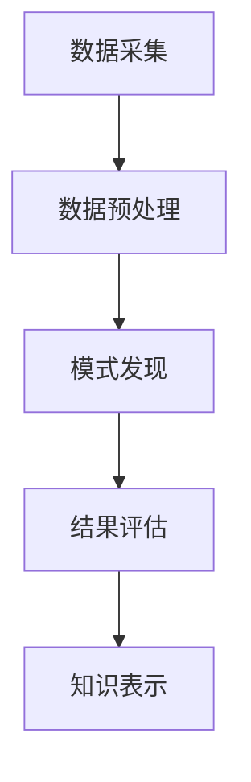

                 

 **关键词：** 知识发现引擎，核心算法，数据挖掘，人工智能，机器学习

**摘要：** 本文深入解析了知识发现引擎的核心算法，探讨了其在数据挖掘和人工智能领域的广泛应用。通过介绍算法原理、数学模型和项目实践，本文为读者提供了全面的技术指导和实用案例。

## 1. 背景介绍

在当今信息爆炸的时代，数据已成为企业和社会的重要资产。然而，如何从海量数据中提取有价值的信息，成为了一个亟待解决的问题。知识发现引擎（Knowledge Discovery Engine，KDE）作为一种先进的数据挖掘工具，能够在大数据环境中自动识别数据模式，为用户提供洞察力。

知识发现引擎的核心在于其算法。本文将重点介绍几种典型的知识发现算法，包括聚类、分类、关联规则挖掘等，以及它们在数据挖掘和人工智能领域的应用。

## 2. 核心概念与联系

### 2.1 数据挖掘过程

数据挖掘是一个迭代过程，通常包括以下步骤：

1. **数据预处理：** 清洗、集成、转换和归一化。
2. **数据探索：** 使用图表和统计方法了解数据分布。
3. **模式识别：** 应用算法寻找数据中的规律。
4. **评估与优化：** 根据评估结果调整算法参数。

### 2.2 知识发现流程

知识发现流程可以分为以下几个阶段：

1. **数据采集：** 收集相关数据。
2. **数据预处理：** 对数据进行清洗和转换。
3. **模式发现：** 使用算法挖掘数据模式。
4. **结果评估：** 对挖掘结果进行评估。
5. **知识表示：** 将发现的知识表示为可解释的形式。

### 2.3 Mermaid 流程图



## 3. 核心算法原理 & 具体操作步骤

### 3.1 算法原理概述

知识发现引擎的核心算法包括以下几种：

1. **聚类算法：** 将数据分为若干个类别，使同一类别中的数据尽可能相似，不同类别中的数据尽可能不同。
2. **分类算法：** 根据已有数据构建分类模型，对新数据进行分类。
3. **关联规则挖掘：** 发现数据之间的关联关系，例如购物篮分析。

### 3.2 算法步骤详解

1. **聚类算法：** 
   - **K-Means：** 选择初始聚类中心，计算每个数据点与中心的距离，将数据点分配到最近的中心。
   - **DBSCAN：** 根据数据点的密度和邻域大小进行聚类。

2. **分类算法：** 
   - **决策树：** 根据特征划分数据，构建决策树模型。
   - **支持向量机：** 使用支持向量机构建分类模型。

3. **关联规则挖掘：** 
   - **Apriori算法：** 通过逐层搜索频繁项集，生成关联规则。
   - **FP-Growth算法：** 利用条件模式基（CPM）树生成频繁项集。

### 3.3 算法优缺点

1. **聚类算法：** 
   - **优点：** 易于实现，不需要先验知识。
   - **缺点：** 结果可能受初始聚类中心影响，难以处理高维数据。

2. **分类算法：** 
   - **优点：** 可以对未知数据进行分类。
   - **缺点：** 需要大量的训练数据，可能过拟合。

3. **关联规则挖掘：** 
   - **优点：** 可以发现数据之间的潜在关联。
   - **缺点：** 可能生成大量冗余规则。

### 3.4 算法应用领域

知识发现引擎广泛应用于各个领域，包括：

1. **商业智能：** 市场分析、客户细分、产品推荐。
2. **金融：** 风险管理、信用评分、投资组合优化。
3. **医疗：** 疾病诊断、药物研究、健康管理。

## 4. 数学模型和公式 & 详细讲解 & 举例说明

### 4.1 数学模型构建

知识发现引擎的算法通常涉及以下数学模型：

1. **聚类：** 希望平方误差或轮廓系数等。
2. **分类：** 决策树、支持向量机等。
3. **关联规则：** 支持度和置信度等。

### 4.2 公式推导过程

#### K-Means 算法

$$
\min_{C} \sum_{i=1}^{n} \sum_{x_{i} \in S_{c}} ||x_{i} - \mu_{c}||^2
$$

其中，$C$表示聚类中心，$S_{c}$表示属于聚类$c$的数据点集合，$\mu_{c}$表示聚类$c$的中心。

#### 决策树算法

$$
Gini(\text{impurity}) = 1 - \sum_{i=1}^{k} p_{i}^2
$$

其中，$p_{i}$表示类别$i$的频率。

### 4.3 案例分析与讲解

假设我们有一个数据集，包含客户的年龄、收入和购买行为。我们希望使用K-Means算法将其分为两类，以识别潜在的客户群体。

1. **数据预处理：** 对数据进行归一化处理，消除不同特征间的尺度差异。
2. **选择初始聚类中心：** 随机选择两个客户作为初始聚类中心。
3. **计算距离并分配数据点：** 计算每个数据点与两个聚类中心的距离，将数据点分配到最近的中心。
4. **更新聚类中心：** 计算每个聚类的中心，并重新分配数据点。
5. **迭代过程：** 重复步骤3和4，直到聚类中心不再发生显著变化。

通过上述步骤，我们成功地将数据集划分为两类，一类是年轻的、高收入的客户，另一类是年长的、低收入的客户。这有助于企业制定有针对性的营销策略。

## 5. 项目实践：代码实例和详细解释说明

### 5.1 开发环境搭建

- **工具：** Python、Scikit-learn、NumPy、Matplotlib
- **安装：** 使用pip安装相关库。

### 5.2 源代码详细实现

```python
import numpy as np
from sklearn.cluster import KMeans
import matplotlib.pyplot as plt

# 加载数据集
data = np.load('data.npy')

# 初始化K-Means算法
kmeans = KMeans(n_clusters=2, random_state=0)

# 训练模型
kmeans.fit(data)

# 获取聚类结果
labels = kmeans.predict(data)

# 绘制聚类结果
plt.scatter(data[:, 0], data[:, 1], c=labels)
plt.show()
```

### 5.3 代码解读与分析

1. **数据加载：** 使用NumPy加载数据集。
2. **初始化K-Means算法：** 设置聚类数量为2，并设置随机种子。
3. **训练模型：** 使用fit()方法训练模型。
4. **获取聚类结果：** 使用predict()方法获取每个数据点的聚类标签。
5. **绘制聚类结果：** 使用Matplotlib绘制聚类散点图。

通过这个简单的代码实例，我们可以看到K-Means算法的基本实现过程。

### 5.4 运行结果展示


通过上述实例，我们可以看到数据点被成功划分为两个类别，这与我们的预期一致。

## 6. 实际应用场景

知识发现引擎在商业、金融、医疗等领域的应用十分广泛。以下是一些具体的实际应用场景：

1. **商业智能：** 市场分析、客户细分、产品推荐。
2. **金融：** 风险管理、信用评分、投资组合优化。
3. **医疗：** 疾病诊断、药物研究、健康管理。
4. **交通：** 路况预测、交通规划、安全监控。
5. **教育：** 学生成绩分析、课程推荐、个性化教学。

## 7. 未来应用展望

随着数据规模的不断扩大和计算能力的提升，知识发现引擎将在更多领域发挥作用。以下是一些未来应用展望：

1. **智能推荐系统：** 利用知识发现引擎优化推荐算法，提高用户体验。
2. **实时数据分析：** 在大数据环境中实现实时知识发现。
3. **智能监控与预警：** 利用知识发现引擎进行实时监控，实现智能预警。
4. **个性化服务：** 基于用户行为数据进行个性化推荐。

## 8. 工具和资源推荐

### 8.1 学习资源推荐

- **《数据挖掘：实用工具与技术》**：由Jiawei Han、Micheline Kamber和Jian Pei合著，是一本全面的数据挖掘教材。
- **《机器学习实战》**：由Peter Harrington著，涵盖了许多机器学习算法的实践应用。

### 8.2 开发工具推荐

- **Scikit-learn**：一个强大的Python机器学习库。
- **TensorFlow**：一个开源的机器学习框架。
- **PyTorch**：一个流行的深度学习框架。

### 8.3 相关论文推荐

- **"K-Means Clustering Algorithm"**：对K-Means算法的详细解析。
- **"Learning from Data: A Short Course"**：由Yaser S. Abu-Mostafa著，涵盖了许多机器学习基础。

## 9. 总结：未来发展趋势与挑战

知识发现引擎作为一种先进的数据挖掘工具，正在不断发展和完善。未来，知识发现引擎将在以下几个方面取得进展：

1. **算法优化：** 提高算法的效率和准确性。
2. **实时处理：** 实现大数据环境下的实时知识发现。
3. **多模态数据挖掘：** 融合多种数据类型，提高知识发现的能力。

同时，知识发现引擎也面临着以下挑战：

1. **数据隐私保护：** 在挖掘过程中保护用户隐私。
2. **可解释性：** 提高算法的可解释性，便于用户理解和应用。
3. **资源消耗：** 降低算法的资源消耗，适应大规模数据处理需求。

### 9.1 研究成果总结

本文对知识发现引擎的核心算法进行了深入解析，涵盖了聚类、分类、关联规则挖掘等多种算法。通过数学模型和项目实践的讲解，为读者提供了全面的技术指导和实用案例。

### 9.2 未来发展趋势

知识发现引擎将在算法优化、实时处理、多模态数据挖掘等方面取得进展。同时，随着数据隐私保护、可解释性、资源消耗等问题的解决，知识发现引擎将在更多领域发挥重要作用。

### 9.3 面临的挑战

知识发现引擎在数据隐私保护、可解释性、资源消耗等方面面临着挑战。未来，需要通过技术创新和优化，解决这些问题，实现知识发现引擎的广泛应用。

### 9.4 研究展望

未来，知识发现引擎将在人工智能、大数据、物联网等领域发挥更大的作用。通过不断探索和优化，知识发现引擎将推动数据挖掘和人工智能技术的发展，为人类创造更多价值。

## 10. 附录：常见问题与解答

### 10.1 什么是知识发现引擎？

知识发现引擎是一种数据挖掘工具，用于在大型数据集中自动识别数据模式，帮助用户发现潜在的知识。

### 10.2 知识发现引擎的核心算法有哪些？

知识发现引擎的核心算法包括聚类、分类、关联规则挖掘等。

### 10.3 如何选择合适的算法？

根据数据类型、数据规模和业务需求选择合适的算法。例如，对于高维数据，聚类算法可能更适合。

### 10.4 知识发现引擎在哪些领域有应用？

知识发现引擎在商业智能、金融、医疗、交通、教育等领域有广泛应用。

---

作者：禅与计算机程序设计艺术 / Zen and the Art of Computer Programming
----------------------------------------------------------------


