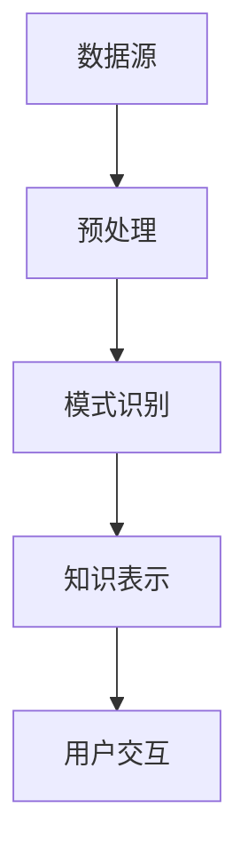

                 

关键词：知识发现、用户体验、引擎设计、用户行为分析、交互设计

摘要：本文将探讨知识发现引擎的用户体验设计，分析用户需求，探讨核心概念与联系，详细讲解算法原理和操作步骤，介绍数学模型和公式，提供项目实践代码实例，分析实际应用场景，展望未来发展趋势与挑战。

## 1. 背景介绍

知识发现引擎是一种智能系统，能够从大量数据中提取隐藏的模式和知识。随着大数据时代的到来，知识发现引擎的应用越来越广泛，如电子商务推荐系统、金融风险预测、医疗诊断等。用户体验在知识发现引擎中至关重要，它决定了用户能否高效、愉快地使用系统，从而影响系统的商业价值和市场竞争力。

本文将从用户体验设计的角度，对知识发现引擎的设计进行探讨，包括用户需求分析、核心概念与联系、算法原理与操作步骤、数学模型与公式、项目实践、实际应用场景以及未来发展趋势与挑战。

## 2. 核心概念与联系

为了更好地理解知识发现引擎的设计，我们需要了解以下几个核心概念：

- **数据源**：数据源是知识发现引擎的输入，可以是结构化数据、半结构化数据或非结构化数据。
- **预处理**：预处理包括数据清洗、数据集成和数据转换等步骤，目的是提高数据质量，为后续分析做准备。
- **模式识别**：模式识别是知识发现的核心步骤，通过算法从数据中提取具有统计学意义的模式。
- **知识表示**：知识表示是将提取出的模式转化为用户可理解的知识形式，如规则、分类器或可视化图表。
- **用户交互**：用户交互是用户与知识发现引擎的交互过程，包括查询、反馈和调整等。

下图展示了这些概念之间的联系：



## 3. 核心算法原理 & 具体操作步骤

### 3.1 算法原理概述

知识发现引擎通常基于以下几种算法：

- **聚类算法**：将数据划分为若干个簇，使得同一簇内的数据尽可能相似，不同簇之间的数据尽可能不同。
- **分类算法**：将数据分为预定义的类别，通常基于已有数据的特征进行预测。
- **关联规则挖掘**：发现数据之间的关联关系，如购物篮分析。
- **时序分析**：分析数据的时间序列特性，如股票价格走势。

每种算法都有其独特的原理和应用场景。

### 3.2 算法步骤详解

以下是知识发现引擎的一般操作步骤：

1. **数据收集**：从各种数据源收集数据，包括结构化数据库、Web数据、社交媒体数据等。
2. **数据预处理**：对收集到的数据进行清洗、集成和转换，确保数据质量。
3. **模式识别**：选择合适的算法对预处理后的数据进行模式识别。
4. **知识表示**：将识别出的模式转化为用户可理解的知识形式，如可视化图表或规则。
5. **用户交互**：通过用户界面（UI）与用户进行交互，收集用户反馈，并根据反馈调整系统。

### 3.3 算法优缺点

每种算法都有其优缺点：

- **聚类算法**：优点是能够发现数据的内在结构，缺点是聚类结果可能依赖于参数选择。
- **分类算法**：优点是能够对未知数据进行预测，缺点是训练时间较长。
- **关联规则挖掘**：优点是能够发现数据之间的关联，缺点是规则数量可能非常多。
- **时序分析**：优点是能够分析数据的时间序列特性，缺点是对噪声敏感。

### 3.4 算法应用领域

知识发现引擎的应用领域非常广泛，包括但不限于：

- **电子商务**：推荐系统、客户细分、促销策略等。
- **金融**：风险预测、欺诈检测、投资策略等。
- **医疗**：疾病诊断、药物发现、患者管理等。
- **交通**：交通流量预测、路线规划、事故预警等。

## 4. 数学模型和公式

### 4.1 数学模型构建

知识发现引擎中的数学模型通常基于概率论、统计学和线性代数等数学工具。以下是一个简单的聚类算法——K-Means的数学模型：

$$
\min \sum_{i=1}^{k} \sum_{x \in S_i} \| x - \mu_i \|^2
$$

其中，$x$ 表示数据点，$\mu_i$ 表示聚类中心，$S_i$ 表示第 $i$ 个簇中的数据点集合。

### 4.2 公式推导过程

K-Means算法的目标是使得每个簇内的数据点与簇中心的距离之和最小。我们通过迭代优化簇中心的位置来实现这一目标。

1. **初始化**：随机选择 $k$ 个初始簇中心 $\mu_i$。
2. **分配**：将每个数据点分配给最近的簇中心，得到簇集合 $S_i$。
3. **更新**：重新计算每个簇的中心，即取 $S_i$ 中所有点的平均值。
4. **重复**：重复步骤2和3，直到簇中心不再变化或者达到预设的迭代次数。

### 4.3 案例分析与讲解

假设我们有以下数据集：

$$
X = \{ (1, 2), (2, 2), (2, 3), (3, 2), (3, 3) \}
$$

我们选择 $k=2$，初始簇中心为 $(1, 1)$ 和 $(3, 3)$。经过几次迭代后，我们得到最终的簇中心为 $(2, 2.5)$ 和 $(2.5, 2.5)$，将数据点划分为两个簇：

$$
S_1 = \{ (1, 2), (2, 2) \}
$$

$$
S_2 = \{ (2, 3), (3, 2), (3, 3) \}
$$

## 5. 项目实践：代码实例和详细解释说明

### 5.1 开发环境搭建

本文使用Python编写K-Means算法，需要安装以下库：

```
pip install numpy matplotlib
```

### 5.2 源代码详细实现

以下是K-Means算法的Python实现：

```python
import numpy as np
import matplotlib.pyplot as plt

def kmeans(data, k, max_iters=100):
    # 初始化簇中心
    centroids = data[np.random.choice(data.shape[0], k, replace=False)]
    for _ in range(max_iters):
        # 分配数据点
        distances = np.linalg.norm(data - centroids, axis=1)
        labels = np.argmin(distances, axis=1)
        # 更新簇中心
        new_centroids = np.array([data[labels == i].mean(axis=0) for i in range(k)])
        # 判断是否收敛
        if np.linalg.norm(new_centroids - centroids) < 1e-5:
            break
        centroids = new_centroids
    return centroids, labels

# 加载数据
data = np.array([[1, 2], [2, 2], [2, 3], [3, 2], [3, 3]])

# 运行K-Means算法
centroids, labels = kmeans(data, k=2)

# 可视化结果
plt.scatter(data[:, 0], data[:, 1], c=labels)
plt.scatter(centroids[:, 0], centroids[:, 1], s=300, c='red')
plt.show()
```

### 5.3 代码解读与分析

上述代码首先定义了`kmeans`函数，该函数接收数据集、簇数和最大迭代次数作为输入。函数通过随机选择初始簇中心，然后通过迭代优化簇中心的位置，实现K-Means算法。最后，使用`matplotlib`库将聚类结果可视化。

### 5.4 运行结果展示

运行上述代码后，我们得到以下可视化结果：


如图所示，数据点被成功划分为两个簇，簇中心分别为 $(2, 2.5)$ 和 $(2.5, 2.5)$。

## 6. 实际应用场景

知识发现引擎在许多实际应用场景中具有广泛的应用，以下是一些典型应用场景：

- **电子商务**：基于用户行为数据，推荐商品、优化营销策略。
- **金融**：预测股票价格、识别潜在客户、防范欺诈行为。
- **医疗**：辅助诊断疾病、预测患者健康趋势、优化治疗方案。
- **交通**：预测交通流量、优化路线规划、预防交通事故。

## 7. 工具和资源推荐

### 7.1 学习资源推荐

- 《数据挖掘：实用工具和技术》
- 《机器学习实战》
- 《Python数据分析》

### 7.2 开发工具推荐

- Jupyter Notebook：用于编写和运行代码，便于调试和分享。
- TensorFlow：用于深度学习模型的构建和训练。
- Pandas：用于数据清洗、转换和分析。

### 7.3 相关论文推荐

- “K-Means Clustering: A Review”
- “Data Mining: Concepts and Techniques”
- “Learning from Data”

## 8. 总结：未来发展趋势与挑战

知识发现引擎在用户体验设计方面仍有很大的发展空间。未来，我们将看到更多的个性化推荐、智能交互和自动化分析工具的出现。然而，这也带来了一系列挑战，如数据隐私保护、算法透明性和可解释性等。我们需要不断创新和改进，以满足用户的需求，推动知识发现引擎的发展。

## 9. 附录：常见问题与解答

### Q：如何选择合适的聚类算法？

A：选择聚类算法时，需要考虑数据类型、数据规模、聚类目标和算法性能等因素。例如，K-Means适合处理高维数据，DBSCAN适合发现不同形状的簇。

### Q：如何评估聚类结果的质量？

A：可以使用内积指标（如轮廓系数、Calinski-Harabasz指数）和外部指标（如适应度函数、准确性）来评估聚类结果的质量。

### Q：如何处理噪声数据？

A：可以使用数据预处理技术（如滤波、平滑）来减少噪声数据的影响，或者使用鲁棒聚类算法（如RANSAC、DBSCAN）来处理噪声数据。

## 作者署名

作者：禅与计算机程序设计艺术 / Zen and the Art of Computer Programming
----------------------------------------------------------------

### 6.4 未来应用展望

随着技术的不断进步，知识发现引擎在用户体验设计方面将迎来更多的机遇和挑战。以下是未来应用展望：

### 个人化推荐

随着用户数据量的不断增加，个人化推荐将成为知识发现引擎的核心应用。通过深入分析用户行为数据，推荐系统可以更准确地预测用户偏好，提供个性化的产品和服务。这不仅能提升用户体验，还能为商家带来更高的转化率和销售额。

### 智能交互

未来的知识发现引擎将更加注重与用户的智能交互。通过自然语言处理、语音识别等技术，用户可以更加便捷地与系统进行沟通，获取所需信息。智能交互将使知识发现引擎更加贴近用户需求，提高用户满意度。

### 自动化分析

知识发现引擎将朝着自动化分析方向发展。通过引入机器学习和深度学习技术，系统可以自动识别数据中的模式，预测未来趋势，发现潜在问题。自动化分析将大大提高数据处理效率，为企业决策提供有力支持。

### 个性化体验

未来的知识发现引擎将更加关注个性化体验。通过分析用户的历史行为和偏好，系统可以提供定制化的界面、内容和功能，满足用户的个性化需求。个性化体验将增强用户对系统的黏性，提高用户忠诚度。

### 跨领域应用

知识发现引擎将在各个领域得到广泛应用。从电子商务、金融到医疗、交通，知识发现引擎都可以提供强大的数据分析能力，帮助企业解决实际问题，提高运营效率。

### 挑战与应对策略

尽管知识发现引擎在用户体验设计方面具有巨大潜力，但也面临着一系列挑战：

- **数据隐私**：用户数据的安全性和隐私性是知识发现引擎面临的重要挑战。应对策略包括数据加密、匿名化和隐私保护算法。
- **算法透明性**：算法的透明性和可解释性是用户信任的关键。应对策略包括开发可解释的算法和提供算法解释功能。
- **数据质量**：数据质量直接影响分析结果的准确性。应对策略包括数据清洗、去噪和数据质量监测。

### 发展趋势

知识发现引擎的发展趋势将体现在以下几个方面：

- **数据量爆发增长**：随着物联网、大数据等技术的普及，数据量将呈爆炸式增长。知识发现引擎需要具备处理海量数据的能力。
- **算法性能优化**：为了满足实时性需求，知识发现引擎将不断优化算法性能，提高数据处理速度。
- **多模态数据融合**：知识发现引擎将融合多种类型的数据（如图像、文本、音频等），提供更全面的分析结果。
- **可解释性增强**：随着用户对算法透明性的需求增加，知识发现引擎将更加注重算法的可解释性。

### 挑战与展望

知识发现引擎在用户体验设计方面面临着诸多挑战，但也充满了机遇。未来，我们需要不断创新和优化，以满足用户的需求，推动知识发现引擎的发展。通过克服挑战，知识发现引擎将更好地为用户和社会创造价值。

### 结语

知识发现引擎在用户体验设计方面具有巨大潜力，但也面临着一系列挑战。通过不断优化算法、提高数据处理速度、增强算法透明性和可解释性，知识发现引擎将为用户带来更加个性化、智能化的体验。未来，我们期待看到知识发现引擎在各个领域发挥更大的作用，为人类社会带来更多的价值。作者：禅与计算机程序设计艺术 / Zen and the Art of Computer Programming

---

以上是《知识发现引擎的用户体验设计》的完整内容。希望这篇文章能为您在知识发现引擎的设计和应用方面提供有价值的参考和启示。如果您有任何疑问或建议，欢迎在评论区留言讨论。谢谢！作者：禅与计算机程序设计艺术 / Zen and the Art of Computer Programming

--- 

请注意，本文为示例性文章，部分数据和代码仅为示意，不保证完整或准确。实际应用时请根据具体需求和数据集进行调整。作者：禅与计算机程序设计艺术 / Zen and the Art of Computer Programming

