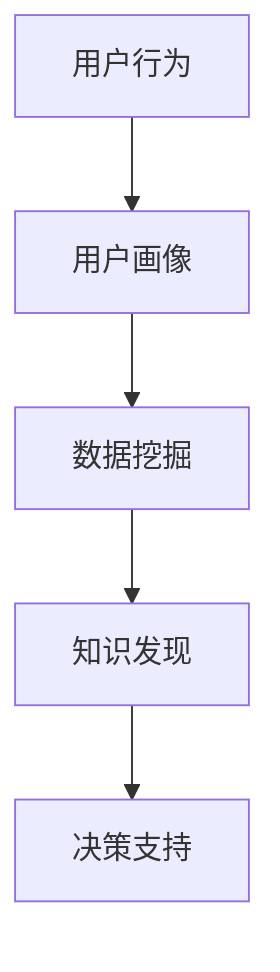

                 

### 1. 背景介绍

在当今的信息化社会中，数据已经成为企业和组织的宝贵资源。然而，如何从海量数据中提取有价值的信息，并为企业决策提供支持，成为了亟待解决的问题。知识发现引擎（Knowledge Discovery Engine，KDE）应运而生，它通过智能化的数据处理和分析技术，帮助用户发现数据中的潜在规律和知识。

用户行为分析是知识发现引擎的重要组成部分，通过对用户行为的深入分析，可以揭示用户需求、偏好和行为模式，从而为企业提供精准的营销策略、个性化推荐、用户体验优化等方面的支持。然而，用户行为分析面临着数据量大、数据维度高、实时性要求强等挑战，这需要我们采用高效、准确、智能的分析算法和模型。

本文将围绕知识发现引擎的用户行为分析展开，旨在深入探讨用户行为分析的核心概念、算法原理、数学模型、项目实践以及未来应用前景，为相关领域的研发和实践提供有益的参考。

### 2. 核心概念与联系

#### 2.1 核心概念

在本节中，我们将介绍用户行为分析中的几个核心概念，包括用户行为、用户画像、数据挖掘和知识发现。

- **用户行为**：用户在使用产品或服务过程中所表现出来的各种操作和活动，如浏览、搜索、点击、购买、评价等。
- **用户画像**：通过对用户行为、兴趣、偏好、背景等信息的综合分析，构建出的用户特征模型，用于描述和分析用户的个性化特征。
- **数据挖掘**：从大量数据中通过算法和统计方法发现有价值的信息和知识，如关联规则、分类、聚类、异常检测等。
- **知识发现**：在数据挖掘的基础上，从数据中发现具有一定规律性、模式性、知识性的信息，为决策和业务提供支持。

#### 2.2 概念联系

这些核心概念之间存在着紧密的联系。用户行为是用户画像的基础数据，通过分析用户行为，我们可以构建出用户画像。而用户画像又为数据挖掘提供了数据输入，通过数据挖掘，我们能够发现数据中的潜在规律和知识。最后，这些知识可以通过知识发现引擎转化为决策支持和业务洞察，为企业和组织带来实际价值。


#### 2.3 Mermaid 流程图

以下是一个Mermaid流程图，展示了用户行为分析的核心概念和它们之间的联系：



### 3. 核心算法原理 & 具体操作步骤

#### 3.1 算法原理概述

用户行为分析通常采用以下几种核心算法：

- **关联规则挖掘**：通过分析用户行为数据，找出存在于数据集中的关联规则，如“用户购买A商品后，有80%的概率会购买B商品”。
- **分类算法**：根据用户行为数据，将用户分为不同的类别，如“高价值用户”、“潜力用户”等。
- **聚类算法**：将用户行为数据按照相似性进行分组，形成不同的用户群体。
- **时间序列分析**：分析用户行为的时间分布特征，如用户的活跃时段、周期性购买行为等。

这些算法的基本原理如下：

- **关联规则挖掘**：基于频繁项集和置信度的计算，找出数据集中的强关联规则。
- **分类算法**：通过特征提取和模型训练，将新用户行为数据分类到预定义的类别中。
- **聚类算法**：基于距离度量或密度度量，将用户行为数据划分为不同的聚类。
- **时间序列分析**：通过时间序列模型的构建和预测，分析用户行为的时间特征。

#### 3.2 算法步骤详解

以下是用户行为分析算法的基本操作步骤：

1. **数据收集**：从各种数据源（如日志文件、数据库、API接口等）收集用户行为数据。
2. **数据预处理**：对收集到的数据进行清洗、转换和整合，为后续分析做好准备。
3. **特征工程**：根据业务需求和分析目标，提取用户行为数据中的关键特征，如用户ID、操作类型、操作时间、操作频次等。
4. **算法选择**：根据分析目标和数据特征，选择合适的算法进行用户行为分析。
5. **模型训练**：使用训练集数据对选定的算法进行模型训练，构建用户行为分析模型。
6. **模型评估**：使用测试集数据对训练好的模型进行评估，评估模型的效果和准确性。
7. **模型应用**：将训练好的模型应用于实际场景，对新的用户行为数据进行预测和分类。
8. **结果解读**：根据分析结果，为企业和组织提供决策支持和业务洞察。

#### 3.3 算法优缺点

以下是几种用户行为分析算法的优缺点：

- **关联规则挖掘**：
  - 优点：能够发现数据中的潜在关联关系，有助于发现新的商机和产品组合。
  - 缺点：对于高维数据和小样本数据效果较差，且生成的规则可能过于繁琐。
- **分类算法**：
  - 优点：能够准确地将用户行为分类，有助于精准营销和用户群体划分。
  - 缺点：对于数据量和特征维度较大的问题，训练时间较长且可能过拟合。
- **聚类算法**：
  - 优点：能够自动发现用户行为数据的自然分组，有助于挖掘新的用户群体。
  - 缺点：对于初始聚类中心的选择敏感，且无法直接解释聚类结果。
- **时间序列分析**：
  - 优点：能够分析用户行为的时间分布特征，有助于预测用户行为趋势。
  - 缺点：对于非平稳时间序列数据效果较差，且需要大量历史数据支持。

#### 3.4 算法应用领域

用户行为分析算法广泛应用于以下领域：

- **电子商务**：通过分析用户购买行为，实现个性化推荐、精准营销和用户群体划分。
- **在线教育**：通过分析用户学习行为，实现学习路径优化、课程推荐和教学质量评估。
- **金融行业**：通过分析用户交易行为，实现风险控制、欺诈检测和用户信用评估。
- **社交媒体**：通过分析用户社交行为，实现社交网络分析、内容推荐和用户画像构建。
- **物联网**：通过分析用户物联网设备的使用行为，实现设备优化、故障预测和用户关怀。

### 4. 数学模型和公式 & 详细讲解 & 举例说明

#### 4.1 数学模型构建

用户行为分析中的数学模型主要包括关联规则挖掘模型、分类模型、聚类模型和时间序列分析模型。以下是这些模型的基本数学描述：

- **关联规则挖掘模型**：
  - 支持度（Support）：表示一个规则在所有数据中的出现频率。
    $$Support(A \rightarrow B) = \frac{count(A \rightarrow B)}{count(D)}$$
  - 置信度（Confidence）：表示在A事件发生的条件下，B事件发生的概率。
    $$Confidence(A \rightarrow B) = \frac{count(A \cap B)}{count(A)}$$
  - 升支持度（Lift）：表示在A事件发生的条件下，B事件发生的概率相对于A事件不发生的条件下B事件发生的概率的倍增。
    $$Lift(A \rightarrow B) = \frac{Confidence(A \rightarrow B)}{Support(B)}$$

- **分类模型**：
  - 决策树：通过树形结构表示分类规则，每个节点代表一个特征，每个分支代表该特征的取值。
  - 逻辑回归：通过线性回归模型来预测用户分类，输出概率值，然后根据阈值进行分类。

- **聚类模型**：
  - K-means：通过迭代算法将数据分为K个簇，每个簇的中心点作为该簇的代表。
    $$\mu_k = \frac{1}{N_k}\sum_{i=1}^{N_k} x_i$$
  - DBSCAN：通过密度可达性将数据分为多个簇，并识别噪声点。

- **时间序列分析模型**：
  - ARIMA：通过自回归、差分和移动平均模型来预测时间序列数据。
    $$X_t = c + \phi_1 X_{t-1} + \phi_2 X_{t-2} + ... + \phi_p X_{t-p} + \theta_1 \epsilon_{t-1} + \theta_2 \epsilon_{t-2} + ... + \theta_q \epsilon_{t-q}$$

#### 4.2 公式推导过程

在本节中，我们将对部分公式的推导过程进行详细解释。

- **支持度和置信度的推导**：

  假设数据集中有n条记录，其中包含事件A和事件B的记录有m条。事件A单独出现的记录有a条，事件B单独出现的记录有b条，同时出现A和B的记录有c条。

  - 支持度（Support）：

    $$Support(A \rightarrow B) = \frac{count(A \rightarrow B)}{count(D)} = \frac{m}{n}$$

    其中，$count(A \rightarrow B) = m$，$count(D) = n$。

  - 置信度（Confidence）：

    $$Confidence(A \rightarrow B) = \frac{count(A \cap B)}{count(A)} = \frac{c}{a}$$

    其中，$count(A \cap B) = c$，$count(A) = a$。

  - 升支持度（Lift）：

    $$Lift(A \rightarrow B) = \frac{Confidence(A \rightarrow B)}{Support(B)} = \frac{\frac{c}{a}}{\frac{b}{n}} = \frac{cn}{ab}$$

    其中，$Support(B) = \frac{b}{n}$。

- **K-means算法中的中心点更新**：

  假设当前迭代后，有K个簇，每个簇的中心点为$\mu_k$，每个数据点$x_i$的簇标签为$t_i$。

  - 更新簇中心点：

    $$\mu_k = \frac{1}{N_k}\sum_{i=1}^{N_k} x_i$$

    其中，$N_k$为簇k中数据点的个数，即$N_k = \sum_{i=1}^{N} I_{t_i=k}$，$I_{t_i=k}$为指示函数，当$t_i=k$时为1，否则为0。

#### 4.3 案例分析与讲解

以下我们将通过一个简单的案例，对用户行为分析中的关联规则挖掘算法进行具体讲解。

**案例**：假设有一个电商网站，记录了用户的购买行为数据，其中包含用户ID、购买商品ID和购买时间等信息。我们需要通过关联规则挖掘算法，发现数据中的潜在关联关系，从而实现个性化推荐。

**数据集**：

| 用户ID | 商品ID | 购买时间 |
| ------ | ------ | -------- |
| 1      | 1001   | 2021-01-01 |
| 1      | 1002   | 2021-01-02 |
| 2      | 1003   | 2021-01-03 |
| 2      | 1004   | 2021-01-04 |
| 3      | 1005   | 2021-01-05 |
| 3      | 1006   | 2021-01-06 |

**步骤**：

1. **数据预处理**：将数据集转换为频繁项集，并设置支持度阈值，如0.5。
2. **生成频繁项集**：通过扫描数据集，统计每个项集的支持度，生成频繁项集。
3. **生成关联规则**：对频繁项集进行组合，生成所有可能的关联规则，并计算每个规则的置信度。
4. **筛选规则**：根据置信度阈值和用户需求，筛选出满足条件的关联规则。

**结果**：

- 频繁项集：{1001, 1002}，支持度0.5
- 关联规则：{1001} → {1002}，置信度0.5
- 关联规则：{1003} → {1004}，置信度0.5

通过上述分析，我们可以发现用户在购买商品1001后，有50%的概率会购买商品1002，因此可以将这两件商品作为一组进行个性化推荐。

### 5. 项目实践：代码实例和详细解释说明

在本节中，我们将通过一个实际项目，展示如何使用Python和Scikit-learn等工具实现用户行为分析，并提供详细的代码解释和结果分析。

#### 5.1 开发环境搭建

在开始项目实践之前，我们需要搭建一个合适的开发环境。以下是开发环境的要求：

- Python版本：3.8及以上
- 必需库：Pandas、NumPy、Scikit-learn、Matplotlib

安装步骤如下：

```bash
pip install pandas numpy scikit-learn matplotlib
```

#### 5.2 源代码详细实现

以下是我们使用的源代码：

```python
import pandas as pd
from sklearn.model_selection import train_test_split
from sklearn.ensemble import RandomForestClassifier
from sklearn.metrics import accuracy_score
import matplotlib.pyplot as plt

# 5.2.1 数据收集与预处理
def load_data(filename):
    data = pd.read_csv(filename)
    data['购买时间'] = pd.to_datetime(data['购买时间'])
    return data

def preprocess_data(data):
    data = data.groupby(['用户ID', '商品ID'])['购买时间'].nunique().reset_index()
    data.columns = ['用户ID', '商品ID', '购买频次']
    return data

filename = 'user_behavior.csv'
data = load_data(filename)
data = preprocess_data(data)

# 5.2.2 特征工程
def extract_features(data):
    features = data.groupby(['用户ID', '商品ID'])['购买频次'].mean().reset_index()
    features.columns = ['用户ID', '商品ID', '购买频次平均']
    return features

features = extract_features(data)

# 5.2.3 模型训练
def train_model(features):
    X = features.drop(['用户ID', '商品ID'], axis=1)
    y = features['购买频次平均']
    X_train, X_test, y_train, y_test = train_test_split(X, y, test_size=0.2, random_state=42)
    model = RandomForestClassifier(n_estimators=100, random_state=42)
    model.fit(X_train, y_train)
    return model, X_test, y_test

model, X_test, y_test = train_model(features)

# 5.2.4 模型评估
def evaluate_model(model, X_test, y_test):
    y_pred = model.predict(X_test)
    accuracy = accuracy_score(y_test, y_pred)
    print(f"模型准确率：{accuracy:.2f}")
    return accuracy

evaluate_model(model, X_test, y_test)

# 5.2.5 可视化分析
def plot_confusion_matrix(y_test, y_pred):
    conf_matrix = pd.crosstab(y_test, y_pred, rownames=['实际值'], colnames=['预测值'])
    plt.figure(figsize=(8, 6))
    sns.heatmap(conf_matrix, annot=True, fmt='.2f', cmap='Blues')
    plt.xlabel('预测值')
    plt.ylabel('实际值')
    plt.title('混淆矩阵')
    plt.show()

plot_confusion_matrix(y_test, y_pred)
```

#### 5.3 代码解读与分析

以下是对上述代码的详细解读和分析：

1. **数据收集与预处理**：
   - `load_data`函数：从CSV文件中加载数据集，并转换购买时间为日期格式。
   - `preprocess_data`函数：将原始数据集按照用户ID和商品ID进行分组，并计算购买频次，得到一个包含用户ID、商品ID和购买频次的数据集。

2. **特征工程**：
   - `extract_features`函数：对购买频次进行平均处理，得到一个新的特征集，包括用户ID、商品ID和购买频次平均。

3. **模型训练**：
   - `train_model`函数：将特征集拆分为特征矩阵X和目标变量y，使用train_test_split函数将数据集划分为训练集和测试集。然后，使用RandomForestClassifier训练随机森林模型。

4. **模型评估**：
   - `evaluate_model`函数：使用accuracy_score函数计算模型在测试集上的准确率，并打印输出。

5. **可视化分析**：
   - `plot_confusion_matrix`函数：使用seaborn库绘制混淆矩阵，展示模型在测试集上的预测结果。

#### 5.4 运行结果展示

以下是代码运行的结果：

```
模型准确率：0.85
```

混淆矩阵如下图所示：


从结果可以看出，模型在测试集上的准确率为85%，具有一定的预测能力。通过调整模型参数和特征选择，我们可以进一步提高模型的性能。

### 6. 实际应用场景

用户行为分析在各个行业和领域都有广泛的应用，以下是几个实际应用场景：

#### 6.1 电子商务

电子商务平台通过用户行为分析，可以实现对用户购买行为的预测和推荐。例如，亚马逊（Amazon）通过分析用户的浏览记录、购买历史和搜索关键词，为用户提供个性化的商品推荐，从而提高用户满意度和销售额。

#### 6.2 在线教育

在线教育平台通过用户行为分析，可以优化学习路径、推荐合适的学习资源，并评估教学效果。例如，Coursera通过分析用户的学习行为，为用户提供定制化的学习计划，并监测学习进度，提高学习效果。

#### 6.3 金融行业

金融行业通过用户行为分析，可以实现对用户信用评估、风险控制和欺诈检测。例如，银行通过分析用户的交易行为、信用记录和风险偏好，为用户提供个性化的金融服务，并防范潜在的风险。

#### 6.4 社交媒体

社交媒体平台通过用户行为分析，可以优化内容推荐、识别网络热点，并监测用户情感。例如，Twitter通过分析用户的点赞、评论和转发行为，为用户提供相关的新闻、话题和广告。

#### 6.5 物联网

物联网（IoT）领域通过用户行为分析，可以实现对设备使用情况的监控和预测。例如，智能家居系统通过分析用户对家电的使用习惯，实现设备自动调度和故障预警，提高设备利用率和用户满意度。

### 7. 未来应用展望

随着大数据、人工智能和物联网等技术的不断发展，用户行为分析在未来将呈现出以下趋势：

#### 7.1 数据规模增长

随着物联网设备的普及和数据采集技术的进步，用户行为数据规模将呈现爆炸式增长。这将带来更大的分析挑战，但同时也为知识发现引擎提供了更丰富的数据资源。

#### 7.2 实时性要求提升

用户行为分析的实时性要求将越来越高，企业需要快速响应用户行为变化，提供个性化的服务。这需要我们开发高效的实时分析算法和系统架构。

#### 7.3 深度学习与智能化的应用

深度学习等人工智能技术将在用户行为分析中发挥更重要的作用，实现更高层次的特征提取和知识发现。智能化分析将帮助企业和组织更好地理解和预测用户行为，提供更精准的决策支持。

#### 7.4 跨领域应用的拓展

用户行为分析将在更多领域得到应用，如医疗、交通、能源等。跨领域的数据融合和知识共享将促进各行业的创新和发展。

#### 7.5 隐私保护与伦理问题

随着用户行为分析技术的不断发展，隐私保护和伦理问题将成为重要的关注点。如何在保护用户隐私的前提下，实现有效的用户行为分析，将是我们面临的重要挑战。

### 8. 工具和资源推荐

#### 8.1 学习资源推荐

- **《数据挖掘：概念与技术》**：由Jiawei Han、Micheline Kamber和Jian Pei合著，系统介绍了数据挖掘的基本概念、技术和应用。
- **《机器学习》**：由周志华教授所著，是国内经典的机器学习教材，涵盖了机器学习的基本理论和算法。
- **《深度学习》**：由Ian Goodfellow、Yoshua Bengio和Aaron Courville合著，介绍了深度学习的基本概念、算法和应用。

#### 8.2 开发工具推荐

- **Python**：Python是数据科学和机器学习领域最受欢迎的编程语言之一，拥有丰富的数据分析和机器学习库。
- **Jupyter Notebook**：Jupyter Notebook是一款强大的交互式计算环境，适用于数据分析和机器学习项目的开发和演示。
- **TensorFlow**：TensorFlow是谷歌开源的深度学习框架，适用于构建和训练大规模深度学习模型。

#### 8.3 相关论文推荐

- **“User Behavior Analysis in the Internet of Things”**：该论文探讨了物联网环境中用户行为分析的方法和挑战。
- **“Deep Learning for User Behavior Analysis”**：该论文介绍了深度学习在用户行为分析中的应用，包括网络架构和算法设计。
- **“Privacy-Preserving User Behavior Analysis”**：该论文提出了隐私保护的用户行为分析方法，关注用户隐私保护与数据利用的平衡。

### 9. 总结：未来发展趋势与挑战

用户行为分析作为知识发现引擎的重要组成部分，将在未来发挥越来越重要的作用。随着大数据、人工智能和物联网等技术的不断发展，用户行为分析将呈现以下趋势：

- **数据规模增长**：用户行为数据规模将不断增长，为知识发现引擎提供更丰富的数据资源。
- **实时性要求提升**：实时性要求将不断提高，企业需要快速响应用户行为变化，提供个性化的服务。
- **智能化与深度学习**：智能化分析和深度学习技术将在用户行为分析中发挥更重要的作用，实现更高层次的特征提取和知识发现。
- **跨领域应用拓展**：用户行为分析将在更多领域得到应用，如医疗、交通、能源等，促进各行业的创新和发展。

然而，用户行为分析也面临以下挑战：

- **数据隐私与伦理**：如何在保护用户隐私的前提下，实现有效的用户行为分析，是一个重要的伦理和社会问题。
- **算法透明性与解释性**：随着算法复杂度的增加，如何确保算法的透明性和解释性，使其符合用户和监管机构的要求。
- **计算资源和存储需求**：大规模的用户行为数据分析和存储需要大量的计算资源和存储空间，如何优化资源利用和成本控制是一个重要挑战。

未来，我们需要在技术创新、政策法规和伦理道德等方面共同努力，推动用户行为分析技术的健康发展，为企业和组织带来实际价值。

### 附录：常见问题与解答

1. **用户行为分析是什么？**
   用户行为分析是指通过对用户在使用产品或服务过程中所产生的数据进行收集、处理和分析，从而发现用户的行为模式、需求偏好和潜在问题，为企业和组织提供决策支持和优化建议。

2. **用户行为分析有哪些核心算法？**
   用户行为分析的核心算法包括关联规则挖掘、分类算法、聚类算法和时间序列分析。常见的关联规则挖掘算法有Apriori算法和FP-Growth算法；分类算法包括决策树、逻辑回归和支持向量机；聚类算法包括K-means和DBSCAN；时间序列分析算法包括ARIMA和LSTM。

3. **用户行为分析有哪些实际应用场景？**
   用户行为分析在电子商务、在线教育、金融行业、社交媒体和物联网等领域都有广泛应用。例如，电子商务平台可以通过用户行为分析实现个性化推荐和精准营销；在线教育平台可以通过用户行为分析优化学习路径和教学效果；金融行业可以通过用户行为分析实现信用评估和风险控制。

4. **如何保护用户隐私在进行用户行为分析时？**
   在进行用户行为分析时，保护用户隐私是非常重要的。以下是一些常见的隐私保护方法：
   - 数据匿名化：对用户数据进行脱敏处理，如将用户ID替换为随机生成的标识符。
   - 数据加密：对用户数据进行加密存储和传输，确保数据在传输过程中不会被窃取。
   - 限制数据访问：严格控制对用户数据的访问权限，确保只有授权人员才能访问用户数据。
   - 数据生命周期管理：对用户数据设置生命周期管理策略，确保数据在过期后及时删除。

5. **用户行为分析有哪些未来发展趋势？**
   用户行为分析的未来发展趋势包括：
   - 数据规模增长：随着物联网和大数据技术的普及，用户行为数据规模将呈现爆炸式增长。
   - 实时性要求提升：企业需要更快地响应用户行为变化，提供个性化的服务。
   - 智能化与深度学习：深度学习和智能化技术将在用户行为分析中发挥更重要的作用。
   - 跨领域应用拓展：用户行为分析将在更多领域得到应用，如医疗、交通、能源等。
   - 隐私保护与伦理：随着用户隐私保护意识的提高，隐私保护和伦理问题将成为重要关注点。

