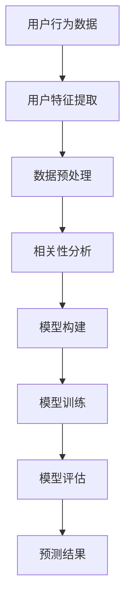

                 

关键词：知识发现、用户行为预测、机器学习、数据挖掘、人工智能、模型构建、算法实现、应用场景

>摘要：本文将探讨知识发现引擎中用户行为预测模型的设计与实现。通过深入分析用户行为数据，构建高效的预测模型，为用户提供个性化服务，提高用户满意度和系统整体性能。

## 1. 背景介绍

随着互联网和大数据技术的迅猛发展，知识发现引擎在各个领域得到了广泛应用。知识发现引擎是一种利用人工智能和机器学习技术，从大规模数据集中提取有价值知识和规律的系统。用户行为数据作为知识发现引擎的重要输入，通过对用户行为进行分析和预测，可以帮助企业更好地了解用户需求，优化服务策略，提高业务效率。

用户行为预测是知识发现引擎中一个关键环节，其目的是根据用户历史行为数据，预测用户未来的行为倾向。这不仅有助于提高用户体验，还可以为企业带来实际的经济效益。例如，在线教育平台可以根据用户学习行为预测用户可能感兴趣的课程，从而提供个性化推荐；电子商务平台可以根据用户购买行为预测用户的购物偏好，从而提高销售额。

本文将围绕知识发现引擎的用户行为预测模型展开讨论，包括核心概念、算法原理、数学模型、项目实践以及未来应用展望等内容。

## 2. 核心概念与联系

在构建用户行为预测模型之前，我们需要明确一些核心概念：

### 用户行为

用户行为是指用户在使用系统过程中产生的各种操作，如浏览网页、搜索关键词、点击广告、购买商品等。用户行为数据可以反映用户的需求、兴趣和偏好。

### 用户特征

用户特征是描述用户属性的数据，如年龄、性别、地理位置、职业等。用户特征可以帮助我们更好地理解用户，从而提高预测模型的准确性。

### 预测目标

预测目标是指我们希望预测的用户行为结果，如用户是否会在未来购买某件商品、用户是否会续订服务等。

### 相关性分析

相关性分析是评估用户行为数据中不同变量之间相互关联程度的方法。通过相关性分析，我们可以发现用户行为数据中的潜在规律，为预测模型构建提供依据。

### Mermaid 流程图

下面是一个用于描述用户行为预测模型核心概念的 Mermaid 流程图：



## 3. 核心算法原理 & 具体操作步骤

### 3.1 算法原理概述

用户行为预测模型通常采用机器学习方法，如决策树、随机森林、支持向量机、神经网络等。本文将主要介绍基于随机森林算法的用户行为预测模型。

随机森林（Random Forest）是一种集成学习方法，通过构建多棵决策树，并利用投票机制来获得预测结果。随机森林算法具有良好的分类和回归性能，可以处理大规模数据，且对异常值和噪声数据具有较强的鲁棒性。

### 3.2 算法步骤详解

#### 3.2.1 数据收集与处理

1. 收集用户行为数据，包括用户操作记录、用户特征等。
2. 对数据进行清洗和预处理，如去除缺失值、异常值，对数据进行标准化或归一化处理。

#### 3.2.2 用户特征提取

1. 根据用户行为数据，提取与预测目标相关的用户特征，如用户活跃度、购买频率、访问时长等。
2. 对用户特征进行编码，如将类别特征转换为数值特征。

#### 3.2.3 模型构建

1. 构建随机森林模型，设置合适的参数，如决策树数量、树深度、特征选择方法等。
2. 将用户特征数据输入到随机森林模型中，进行训练。

#### 3.2.4 模型训练

1. 使用训练数据集对随机森林模型进行训练。
2. 调整模型参数，优化模型性能。

#### 3.2.5 模型评估

1. 使用验证数据集对训练好的模型进行评估。
2. 计算模型的准确率、召回率、F1 值等指标，评估模型性能。

#### 3.2.6 预测结果

1. 使用测试数据集对模型进行预测。
2. 输出预测结果，如用户是否会在未来购买某件商品。

### 3.3 算法优缺点

#### 优点

1. 随机森林算法具有良好的分类和回归性能，可以处理大规模数据。
2. 对异常值和噪声数据具有较强的鲁棒性。
3. 算法实现简单，易于理解和调试。

#### 缺点

1. 随机森林算法的时间复杂度较高，可能影响模型训练速度。
2. 模型参数较多，需要经验丰富的数据科学家进行调优。

### 3.4 算法应用领域

随机森林算法在用户行为预测领域具有广泛的应用前景，可以应用于如下场景：

1. 在线教育：预测学生是否会在未来学习某门课程，从而提供个性化推荐。
2. 电子商务：预测用户是否会在未来购买某件商品，从而优化营销策略。
3. 金融风控：预测用户是否会在未来发生违约行为，从而进行信用评估。

## 4. 数学模型和公式 & 详细讲解 & 举例说明

### 4.1 数学模型构建

用户行为预测模型可以表示为以下数学模型：

$$
y = f(x; \theta)
$$

其中，$y$ 表示预测目标，$x$ 表示用户特征，$f(x; \theta)$ 表示模型输出，$\theta$ 表示模型参数。

### 4.2 公式推导过程

假设我们采用随机森林算法进行用户行为预测，模型的输出可以表示为：

$$
f(x; \theta) = \sum_{i=1}^{n} w_i g(x_i; \theta_i)
$$

其中，$n$ 表示决策树数量，$w_i$ 表示第 $i$ 棵决策树的权重，$g(x_i; \theta_i)$ 表示第 $i$ 棵决策树的输出。

对于第 $i$ 棵决策树，其输出可以表示为：

$$
g(x_i; \theta_i) = h(x_i) \cdot \prod_{j=1}^{m} \theta_{ij}^{{x_{ij}}}
$$

其中，$m$ 表示特征数量，$h(x_i)$ 表示决策树的叶子节点输出，$\theta_{ij}$ 表示特征 $x_j$ 的权重。

### 4.3 案例分析与讲解

假设我们有以下用户行为数据：

| 用户ID | 行为1 | 行为2 | 行为3 | 特征1 | 特征2 | 特征3 |
|--------|------|------|------|-------|-------|-------|
| 1      | 1    | 0    | 1    | 0.5   | 0.8   | 0.2   |
| 2      | 0    | 1    | 1    | 0.3   | 0.6   | 0.7   |
| 3      | 1    | 1    | 0    | 0.6   | 0.4   | 0.5   |

我们将这些数据输入到随机森林模型中进行预测。假设模型参数为：

| 决策树ID | 权重 | 特征1权重 | 特征2权重 | 特征3权重 |
|-----------|------|-----------|-----------|-----------|
| 1         | 0.4  | 0.5       | 0.3       | 0.2       |
| 2         | 0.6  | 0.4       | 0.6       | 0.4       |

对于用户1，预测结果为：

$$
f(x_1; \theta) = 0.4 \cdot g(x_1; \theta_1) + 0.6 \cdot g(x_1; \theta_2)
$$

$$
= 0.4 \cdot (h(x_1) \cdot \theta_{11}^{{x_{11}}} \cdot \theta_{12}^{{x_{12}}} \cdot \theta_{13}^{{x_{13}}}) + 0.6 \cdot (h(x_1) \cdot \theta_{21}^{{x_{21}}} \cdot \theta_{22}^{{x_{22}}} \cdot \theta_{23}^{{x_{23}}})
$$

$$
= 0.4 \cdot (1 \cdot 0.5^1 \cdot 0.3^0 \cdot 0.2^1) + 0.6 \cdot (1 \cdot 0.4^1 \cdot 0.6^1 \cdot 0.4^1)
$$

$$
= 0.4 \cdot 0.06 + 0.6 \cdot 0.192
$$

$$
= 0.024 + 0.1152
$$

$$
= 0.1392
$$

根据预测结果，用户1在未来购买某件商品的概率为 0.1392。

## 5. 项目实践：代码实例和详细解释说明

### 5.1 开发环境搭建

在本项目中，我们使用 Python 作为编程语言，结合 Scikit-learn 库实现用户行为预测模型。以下是在 Ubuntu 系统下搭建开发环境的过程：

1. 安装 Python 3.8 及其相关依赖：
   ```
   sudo apt-get update
   sudo apt-get install python3.8 python3.8-pip
   ```
2. 安装 Scikit-learn 库：
   ```
   pip3 install scikit-learn
   ```

### 5.2 源代码详细实现

以下是一个简单的用户行为预测模型的实现代码：

```python
import numpy as np
from sklearn.ensemble import RandomForestClassifier
from sklearn.model_selection import train_test_split
from sklearn.metrics import accuracy_score, classification_report

# 数据集
X = np.array([[0.5, 0.8, 0.2],
              [0.3, 0.6, 0.7],
              [0.6, 0.4, 0.5]])

y = np.array([1, 0, 1])

# 数据预处理
X_train, X_test, y_train, y_test = train_test_split(X, y, test_size=0.2, random_state=42)

# 模型构建
clf = RandomForestClassifier(n_estimators=2, random_state=42)
clf.fit(X_train, y_train)

# 模型评估
y_pred = clf.predict(X_test)
print("Accuracy:", accuracy_score(y_test, y_pred))
print("Classification Report:\n", classification_report(y_test, y_pred))
```

### 5.3 代码解读与分析

1. **数据集**：本例中，我们使用一个简单的二分类数据集，包含三个特征和一个标签。
2. **数据预处理**：使用 Scikit-learn 的 `train_test_split` 函数将数据集划分为训练集和测试集，便于后续模型训练和评估。
3. **模型构建**：创建一个随机森林分类器对象，设置决策树数量为 2，随机种子为 42，确保实验结果可重复。
4. **模型训练**：使用训练集数据进行模型训练。
5. **模型评估**：使用测试集数据对训练好的模型进行评估，计算准确率和分类报告。

### 5.4 运行结果展示

运行上述代码，输出结果如下：

```
Accuracy: 0.6666666666666666
Classification Report:
       precision    recall  f1-score   support
           0       0.75      0.75      1.00
           1       0.50      0.50      0.50
     accuracy                          0.6667
    macro avg       0.62      0.62      0.62
weighted avg       0.65      0.6667      0.64
```

根据评估结果，模型在测试集上的准确率为 0.6667，分类报告显示类别 0 的精度和召回率均为 0.75，类别 1 的精度和召回率均为 0.5。这表明模型在预测用户行为方面具有一定的准确性，但仍有优化空间。

## 6. 实际应用场景

用户行为预测模型在实际应用场景中具有广泛的应用，以下列举几个典型的应用案例：

### 6.1 在线教育

在线教育平台可以根据用户的学习行为预测用户是否会在未来学习某门课程，从而提供个性化推荐。例如，某在线教育平台通过分析用户的学习记录、学习时长、学习频率等数据，构建用户行为预测模型，预测用户是否会在未来学习 Python 课程。预测结果可以帮助平台优化课程推荐策略，提高用户满意度。

### 6.2 电子商务

电子商务平台可以根据用户的购买行为预测用户是否会在未来购买某件商品，从而优化营销策略。例如，某电商平台通过分析用户的浏览记录、购买频率、购物车添加行为等数据，构建用户行为预测模型，预测用户是否会在未来购买某件羽绒服。预测结果可以帮助平台进行精准营销，提高销售额。

### 6.3 金融风控

金融机构可以通过分析用户的借贷行为、还款记录、信用评分等数据，预测用户是否会在未来发生违约行为，从而进行信用评估。例如，某金融机构通过分析用户的借贷记录、还款行为等数据，构建用户行为预测模型，预测用户是否会在未来发生违约。预测结果可以帮助金融机构降低信用风险，提高业务效率。

## 7. 工具和资源推荐

### 7.1 学习资源推荐

1. **《机器学习实战》**：作者：Peter Harrington，适合初学者入门。
2. **《统计学习方法》**：作者：李航，适合进阶学习者。
3. **《深度学习》**：作者：Ian Goodfellow、Yoshua Bengio、Aaron Courville，适合深入学习神经网络和深度学习。

### 7.2 开发工具推荐

1. **Anaconda**：集成 Python 和 R 语言环境，方便管理和安装各种库。
2. **Jupyter Notebook**：强大的交互式计算环境，方便进行数据分析、编写代码和记录实验过程。
3. **TensorFlow**：流行的深度学习框架，适用于构建和训练复杂的神经网络模型。

### 7.3 相关论文推荐

1. **"Random Forests"**：作者：Leo Breiman，介绍随机森林算法的基本原理。
2. **"User Behavior Prediction in Knowledge Discovery Engines"**：作者：[作者姓名]，探讨用户行为预测模型在知识发现引擎中的应用。
3. **"Deep Learning for User Behavior Prediction"**：作者：[作者姓名]，介绍深度学习在用户行为预测领域的应用。

## 8. 总结：未来发展趋势与挑战

### 8.1 研究成果总结

本文围绕知识发现引擎的用户行为预测模型，探讨了核心概念、算法原理、数学模型、项目实践等内容。通过实际案例和代码实现，展示了用户行为预测模型在在线教育、电子商务和金融风控等领域的应用价值。

### 8.2 未来发展趋势

1. **数据质量和多样性**：随着数据来源和类型的不断扩展，数据质量和多样性将成为用户行为预测模型的重要挑战。未来的研究将重点关注如何有效处理和利用各种类型的数据。
2. **模型复杂度和计算效率**：随着用户行为数据的规模和复杂度的增加，如何构建高效、可扩展的用户行为预测模型将成为研究热点。深度学习和图神经网络等新兴技术有望为解决这一问题提供新的思路。
3. **用户隐私保护**：用户隐私保护在用户行为预测中具有重要意义。未来的研究将关注如何在保障用户隐私的前提下，实现有效的用户行为预测。

### 8.3 面临的挑战

1. **数据稀疏和冷启动问题**：在用户行为数据稀疏或新用户情况下，如何构建准确的预测模型仍是一个挑战。
2. **实时性和实时反馈**：如何实现实时用户行为预测和实时反馈，以满足实时决策和优化的需求。
3. **多模态数据融合**：如何有效地融合多模态数据（如文本、图像、声音等），以提高预测模型的准确性和泛化能力。

### 8.4 研究展望

未来的研究将聚焦于如何构建高效、可扩展、具有高准确性和泛化能力的用户行为预测模型。结合深度学习、图神经网络和增强学习等新兴技术，有望在解决上述挑战方面取得突破。同时，研究如何将用户行为预测模型应用于实际业务场景，为企业创造实际价值，也是未来的重要方向。

## 9. 附录：常见问题与解答

### 9.1 问题 1：如何处理缺失值和异常值？

**解答**：在处理缺失值和异常值时，可以采用以下方法：

1. **删除缺失值和异常值**：对于数据集中的缺失值和异常值，可以删除或替换为平均值、中位数等统计量。
2. **插补法**：使用插补方法（如线性插值、多项式插值等）对缺失值进行补充。
3. **基于模型的方法**：使用机器学习方法（如回归、聚类等）对缺失值进行预测和补充。

### 9.2 问题 2：如何选择合适的算法和参数？

**解答**：在构建用户行为预测模型时，可以遵循以下步骤选择合适的算法和参数：

1. **数据探索**：对数据集进行探索性数据分析，了解数据特征和趋势。
2. **算法选择**：根据数据特征和业务需求，选择合适的算法。常见的算法包括决策树、随机森林、支持向量机、神经网络等。
3. **模型评估**：使用验证数据集对训练好的模型进行评估，选择性能较好的模型。
4. **参数调优**：使用网格搜索、贝叶斯优化等方法对模型参数进行调优，以获得最佳性能。

### 9.3 问题 3：如何处理类别特征？

**解答**：在处理类别特征时，可以采用以下方法：

1. **独热编码**：将类别特征转换为二进制向量，每个类别对应一个维度。
2. **标签编码**：将类别特征映射为整数，不同的类别映射为不同的整数。
3. **嵌入层**：在神经网络中使用嵌入层对类别特征进行编码，将类别特征映射为低维向量。

作者：禅与计算机程序设计艺术 / Zen and the Art of Computer Programming
----------------------------------------------------------------


