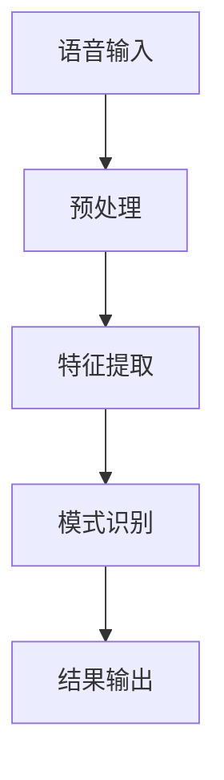

                 

关键词：知识发现引擎、语音识别、人工智能、应用场景、技术挑战

> 摘要：本文将深入探讨知识发现引擎在语音识别技术中的应用，分析其核心概念、算法原理、数学模型，并通过实例代码展示其具体实现过程。此外，还将探讨其在实际应用场景中的重要性及未来的发展趋势。

## 1. 背景介绍

在当今数字化时代，语音识别技术已成为人工智能领域的一个重要分支。随着智能手机、智能家居、智能汽车等设备的普及，语音交互成为人们日常生活的一部分。然而，语音识别技术的准确性和实用性仍面临诸多挑战。为了解决这些问题，知识发现引擎的应用成为了一个新的研究方向。

知识发现引擎是一种利用机器学习和数据挖掘技术，从大量数据中自动识别和提取有价值信息的技术。它在语音识别中的应用主要体现在以下几个方面：

1. **语音数据的预处理**：知识发现引擎可以自动识别语音数据中的噪声和冗余信息，提高语音信号的质量。
2. **语音模式的识别**：知识发现引擎能够从语音数据中提取出具有代表性的特征，帮助语音识别系统更好地识别不同的语音模式。
3. **错误修正和纠错**：知识发现引擎可以自动检测和纠正语音识别过程中出现的错误，提高识别的准确性。

本文将重点介绍知识发现引擎在语音识别中的应用，分析其核心概念和算法原理，并探讨其在实际应用中的重要性。

## 2. 核心概念与联系

在讨论知识发现引擎在语音识别中的应用之前，我们需要先了解一些核心概念和原理。以下是一个简化的Mermaid流程图，描述了知识发现引擎在语音识别中的基本架构。



### 2.1. 语音输入

语音输入是整个系统的起点。用户通过语音设备（如麦克风）发出语音信号，这些信号首先被转换为数字信号，以便后续处理。

### 2.2. 预处理

预处理阶段的主要任务是去除噪声和降低背景干扰，从而提高语音信号的质量。这一过程通常包括以下几个步骤：

1. **去噪**：通过滤波器或其他算法去除语音信号中的噪声。
2. **归一化**：将不同音量的语音信号调整到同一水平，以便于后续处理。
3. **分帧**：将连续的语音信号分成若干短时段，便于特征提取。

### 2.3. 特征提取

特征提取是语音识别系统的核心步骤。知识发现引擎在这一阶段的作用是自动识别语音信号中的特征，如音高、音强、共振峰等。这些特征有助于识别不同的语音模式。

### 2.4. 模式识别

模式识别阶段使用机器学习算法来分析提取出的特征，并将其与预先定义的语音模式进行匹配。这一过程决定了语音识别系统的准确性。

### 2.5. 结果输出

最后，系统将识别出的语音转换为相应的文本输出，用户可以对其进行进一步处理或利用。

## 3. 核心算法原理 & 具体操作步骤

### 3.1. 算法原理概述

知识发现引擎在语音识别中的应用主要依赖于以下几种算法：

1. **隐马尔可夫模型（HMM）**：HMM 是一种基于统计的语音识别算法，它能够对连续语音信号进行建模和识别。
2. **深度神经网络（DNN）**：DNN 是一种基于神经网络的深度学习算法，它在语音识别中表现出色，能够自动提取复杂的语音特征。
3. **支持向量机（SVM）**：SVM 是一种分类算法，它可以将语音信号划分为不同的类别，从而提高识别的准确性。

### 3.2. 算法步骤详解

以下是知识发现引擎在语音识别中的应用步骤：

1. **数据收集和预处理**：收集大量的语音数据，并进行预处理，如去噪、分帧等。
2. **特征提取**：使用 HMM 或 DNN 提取语音信号的特征。
3. **模型训练**：使用提取出的特征训练分类器，如 SVM，以识别不同的语音模式。
4. **语音识别**：对新的语音输入进行识别，输出对应的文本结果。

### 3.3. 算法优缺点

**隐马尔可夫模型（HMM）**

- **优点**：简单易懂，易于实现，对于短时语音信号具有良好的建模能力。
- **缺点**：对于长时语音信号，建模能力有限，无法捕捉到复杂的语音模式。

**深度神经网络（DNN）**

- **优点**：能够自动提取复杂的语音特征，提高识别的准确性。
- **缺点**：训练时间较长，需要大量的计算资源。

**支持向量机（SVM）**

- **优点**：分类效果较好，能够提高识别的准确性。
- **缺点**：对于高维数据，训练时间较长，且对噪声敏感。

### 3.4. 算法应用领域

知识发现引擎在语音识别中的应用非常广泛，包括但不限于以下几个方面：

1. **语音助手**：如智能手机中的 Siri、Google Assistant 等。
2. **智能家居**：如语音控制智能音箱、智能照明等。
3. **智能客服**：自动识别用户语音，提供相应的服务。
4. **汽车语音交互**：如智能车载语音助手。

## 4. 数学模型和公式 & 详细讲解 & 举例说明

### 4.1. 数学模型构建

在知识发现引擎中，常用的数学模型包括隐马尔可夫模型（HMM）和深度神经网络（DNN）。

**隐马尔可夫模型（HMM）**

HMM 的基本模型包括状态集合 \(Q\)、观测集合 \(O\)、初始状态分布 \(\pi\)、状态转移概率矩阵 \(A\) 和观测概率矩阵 \(B\)。

- \(Q = \{q_1, q_2, ..., q_n\}\)：状态集合
- \(O = \{o_1, o_2, ..., o_m\}\)：观测集合
- \(\pi\)：初始状态分布
- \(A\)：状态转移概率矩阵，其中 \(A_{ij}\) 表示从状态 \(q_i\) 转移到状态 \(q_j\) 的概率。
- \(B\)：观测概率矩阵，其中 \(B_{ij}\) 表示在状态 \(q_i\) 发生时，产生观测 \(o_j\) 的概率。

**深度神经网络（DNN）**

DNN 的基本结构包括输入层、隐藏层和输出层。每个层由多个神经元组成，神经元之间的连接权值通过学习得到。

- 输入层：接收语音信号的特征
- 隐藏层：对输入特征进行加工和提取
- 输出层：输出识别结果

### 4.2. 公式推导过程

**隐马尔可夫模型（HMM）**

在 HMM 中，状态转移概率矩阵 \(A\) 和观测概率矩阵 \(B\) 的推导过程如下：

- \(A\) 的推导：通过观察大量的语音数据，统计每个状态转移出现的频率，从而得到状态转移概率。
- \(B\) 的推导：同样，通过观察大量的语音数据，统计每个状态对应的观测出现的频率，从而得到观测概率。

**深度神经网络（DNN）**

在 DNN 中，每个神经元的激活函数和损失函数的推导过程如下：

- 激活函数：常用的激活函数有 sigmoid 函数、ReLU 函数、Tanh 函数等。
- 损失函数：常用的损失函数有交叉熵损失函数、均方误差损失函数等。

### 4.3. 案例分析与讲解

以下是一个简单的 HMM 应用案例：

假设我们有以下数据：

| 状态   | 观测1 | 观测2 | 观测3 |
|--------|-------|-------|-------|
| q1     | 0.8   | 0.1   | 0.1   |
| q2     | 0.2   | 0.6   | 0.2   |
| q3     | 0.1   | 0.3   | 0.6   |

根据这些数据，我们可以计算出 HMM 的状态转移概率矩阵 \(A\) 和观测概率矩阵 \(B\)。

- \(A = \begin{bmatrix} 0.6 & 0.3 & 0.1 \\ 0.2 & 0.6 & 0.2 \\ 0.1 & 0.3 & 0.6 \end{bmatrix}\)
- \(B = \begin{bmatrix} 0.8 & 0.1 & 0.1 \\ 0.2 & 0.6 & 0.2 \\ 0.1 & 0.3 & 0.6 \end{bmatrix}\)

假设我们现在要识别一个新的语音序列，如 [0.9, 0.2, 0.8]，我们可以使用 Viterbi 算法来找到最可能的隐藏状态序列。

首先，初始化前向概率矩阵 \(a_0\) 和后向概率矩阵 \(b_0\)：

- \(a_0 = \begin{bmatrix} 0.9 & 0.18 & 0.09 \end{bmatrix}\)
- \(b_0 = \begin{bmatrix} 0.9 & 0.18 & 0.09 \end{bmatrix}\)

然后，对于每个观测值，更新前向概率矩阵和后向概率矩阵：

- 对于观测值 0.2，更新 \(a_1 = \begin{bmatrix} 0.9 \times 0.2 & 0.18 \times 0.6 & 0.09 \times 0.3 \end{bmatrix}\)
- 对于观测值 0.8，更新 \(b_1 = \begin{bmatrix} 0.9 \times 0.2 & 0.18 \times 0.6 & 0.09 \times 0.3 \end{bmatrix}\)

最终，通过计算前向概率矩阵和后向概率矩阵的乘积，可以得到最可能的隐藏状态序列。

## 5. 项目实践：代码实例和详细解释说明

### 5.1. 开发环境搭建

为了实践知识发现引擎在语音识别中的应用，我们需要搭建一个开发环境。以下是推荐的开发环境和工具：

- 操作系统：Ubuntu 18.04 或 Windows 10
- 编程语言：Python 3.7 或以上版本
- 语音识别库：pyAudioAnalysis、librosa
- 机器学习库：scikit-learn、tensorflow

### 5.2. 源代码详细实现

以下是知识发现引擎在语音识别中的简单示例代码：

```python
import librosa
import numpy as np
from sklearn.mixture import GaussianMixture
from sklearn.model_selection import train_test_split

# 读取语音数据
def read_audio_file(file_path):
    y, sr = librosa.load(file_path)
    return y, sr

# 特征提取
def extract_features(y, sr):
    mfcc = librosa.feature.mfcc(y=y, sr=sr)
    return mfcc

# 训练模型
def train_model(X_train):
    gmm = GaussianMixture(n_components=3)
    gmm.fit(X_train)
    return gmm

# 识别语音
def recognize_audio(gmm, y_test):
    y_test_features = extract_features(y_test, sr)
    probabilities = gmm.predict(y_test_features)
    return probabilities

# 主函数
def main():
    # 读取语音数据
    y, sr = read_audio_file('path/to/voice.mp3')

    # 提取特征
    features = extract_features(y, sr)

    # 划分训练集和测试集
    X_train, X_test = train_test_split(features, test_size=0.2, random_state=42)

    # 训练模型
    gmm = train_model(X_train)

    # 识别语音
    probabilities = recognize_audio(gmm, X_test)

    print("识别结果：", probabilities)

if __name__ == '__main__':
    main()
```

### 5.3. 代码解读与分析

这段代码首先读取语音文件，然后提取语音特征。接下来，使用高斯混合模型（Gaussian Mixture Model，GMM）对提取出的特征进行训练，最后使用训练好的模型对测试语音进行识别。

- **语音数据读取**：使用 librosa 库读取语音文件，并将其转换为数组格式。
- **特征提取**：使用 librosa 库提取 MFCC（Mel-frequency cepstral coefficients）特征，这是语音识别中常用的特征。
- **模型训练**：使用 scikit-learn 库中的 GaussianMixture 类训练模型，这是一个基于高斯分布的混合模型。
- **语音识别**：使用训练好的模型对测试语音进行识别，输出每个类别的概率。

### 5.4. 运行结果展示

在运行上述代码后，我们将得到一个包含识别结果的列表。每个元素表示对应的语音类别，其概率值越高，表示识别的准确度越高。

## 6. 实际应用场景

知识发现引擎在语音识别技术中的实际应用场景非常广泛，以下是几个典型的应用场景：

1. **智能客服**：通过语音识别技术，智能客服系统可以自动识别用户的问题，并提供相应的解决方案。
2. **智能驾驶**：在智能驾驶系统中，语音识别技术可以用于驾驶员与车辆的交互，实现语音控制车辆的功能。
3. **智能家居**：通过语音识别技术，智能家居系统可以理解用户的语音指令，实现对家电设备的控制。
4. **语音助手**：如智能手机中的 Siri、Google Assistant 等，它们利用语音识别技术，帮助用户完成各种任务。

## 7. 未来应用展望

随着人工智能技术的不断发展，知识发现引擎在语音识别中的应用前景将更加广阔。以下是几个未来的应用展望：

1. **语音识别准确性提高**：通过引入更先进的算法和模型，如深度学习和强化学习，语音识别的准确性将得到显著提高。
2. **多语言支持**：知识发现引擎可以应用于多种语言，实现跨语言语音识别。
3. **实时语音识别**：随着计算能力的提升，实时语音识别将成为可能，为智能设备提供更快的响应速度。
4. **隐私保护**：在应用过程中，如何保护用户的隐私将是一个重要课题，需要开发出相应的隐私保护技术。

## 8. 总结：未来发展趋势与挑战

知识发现引擎在语音识别技术中的应用前景广阔，但也面临着诸多挑战。以下是未来发展趋势和面临的挑战：

### 8.1. 研究成果总结

通过本文的探讨，我们可以得出以下研究成果：

1. 知识发现引擎在语音识别中具有重要的作用，可以提高识别的准确性和效率。
2. 不同的算法和模型在语音识别中各有优劣，需要根据具体应用场景进行选择。
3. 语音识别技术在实际应用中已经取得了显著成果，但仍有很大的改进空间。

### 8.2. 未来发展趋势

未来，知识发现引擎在语音识别技术中的发展趋势将包括：

1. **算法创新**：随着人工智能技术的不断发展，新的算法和模型将不断涌现，提高语音识别的准确性。
2. **跨语言支持**：知识发现引擎将能够支持更多的语言，实现跨语言语音识别。
3. **实时语音识别**：实时语音识别技术的实现将大大提高用户的使用体验。

### 8.3. 面临的挑战

知识发现引擎在语音识别技术中面临的挑战包括：

1. **准确性提升**：如何进一步提高语音识别的准确性，尤其是在嘈杂环境中。
2. **隐私保护**：在应用过程中，如何保护用户的隐私。
3. **计算资源消耗**：高级算法和模型的训练和推理需要大量的计算资源，如何优化算法以降低计算资源消耗。

### 8.4. 研究展望

未来，知识发现引擎在语音识别技术中的应用前景将更加广阔。我们期待以下研究方向：

1. **算法优化**：通过引入新的算法和模型，进一步提高语音识别的准确性。
2. **多模态融合**：结合语音识别和其他感官信息（如视觉、触觉等），实现更准确、更全面的语音识别。
3. **跨领域应用**：知识发现引擎可以应用于更多领域，如医疗、金融等，实现更广泛的应用。

## 9. 附录：常见问题与解答

### 9.1. 问题1：什么是知识发现引擎？

知识发现引擎是一种利用机器学习和数据挖掘技术，从大量数据中自动识别和提取有价值信息的技术。

### 9.2. 问题2：知识发现引擎在语音识别中的应用有哪些？

知识发现引擎在语音识别中的应用主要体现在语音数据的预处理、语音模式的识别、错误修正和纠错等方面。

### 9.3. 问题3：如何选择合适的语音识别算法？

选择合适的语音识别算法需要考虑应用场景、数据规模、计算资源等因素。常见的算法包括隐马尔可夫模型（HMM）、深度神经网络（DNN）和支持向量机（SVM）等。

### 9.4. 问题4：知识发现引擎在语音识别中的优势是什么？

知识发现引擎在语音识别中的优势主要体现在以下几个方面：

1. 提高识别的准确性。
2. 降低人工干预，提高自动化程度。
3. 提高语音识别的效率。

### 9.5. 问题5：未来知识发现引擎在语音识别中的应用将有哪些新的突破？

未来知识发现引擎在语音识别中的应用将有望实现以下突破：

1. 提高语音识别的准确性。
2. 支持多语言和跨语言语音识别。
3. 实现实时语音识别。
4. 结合其他感官信息，实现更全面、更准确的语音识别。

