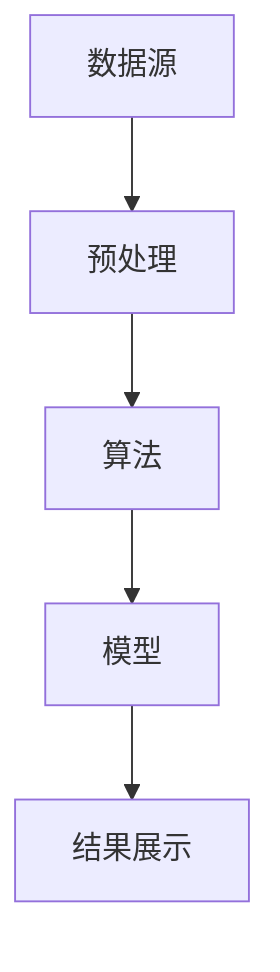

                 

关键词：知识发现、数据挖掘、人工智能、创新、算法

> 摘要：本文深入探讨知识发现引擎的概念、原理及其在知识创新中的应用。通过介绍核心算法、数学模型、项目实践等多个方面，分析知识发现引擎如何成为推动科技创新的重要工具，并展望其未来发展。

## 1. 背景介绍

在当今信息爆炸的时代，知识已成为社会发展的核心资源。知识的获取、存储、管理和应用成为各行业关注的热点。随着数据量的激增和多样性，如何从海量数据中提取有价值的信息成为亟待解决的问题。知识发现引擎作为一种新兴技术，应运而生，其目标是从大规模数据集中发现潜在的知识模式，从而支持数据驱动的决策和知识创新。

知识发现引擎的发展背景主要源于数据挖掘和人工智能的快速发展。数据挖掘技术为知识发现提供了强大的数据预处理和分析工具，而人工智能则赋予知识发现引擎智能化的能力。两者的结合，使得知识发现引擎在各个领域展现出巨大的应用潜力。

## 2. 核心概念与联系

知识发现引擎的核心概念包括数据源、预处理、算法、模型和结果展示。这些概念相互联系，共同构成了知识发现引擎的完整架构。

### 2.1 数据源

数据源是知识发现引擎的基础。数据源可以是结构化数据（如关系型数据库）、半结构化数据（如XML、JSON）和非结构化数据（如文本、图像、视频）。数据源的质量直接影响知识发现的结果。

### 2.2 预处理

预处理是对原始数据进行清洗、转换和归一化等操作，使其符合算法和模型的要求。预处理包括数据去重、缺失值处理、数据类型转换和数据标准化等步骤。

### 2.3 算法

算法是知识发现引擎的核心，负责从数据中发现潜在的知识模式。常见的算法包括聚类算法、分类算法、关联规则挖掘算法和异常检测算法等。

### 2.4 模型

模型是对知识发现结果的抽象和表示。模型可以是统计模型、机器学习模型或深度学习模型等。模型的选择取决于数据的类型和特点。

### 2.5 结果展示

结果展示是将知识发现的结果以直观的方式呈现给用户。结果展示可以是可视化图表、报告或推荐系统等。

以下是知识发现引擎的 Mermaid 流程图：



## 3. 核心算法原理 & 具体操作步骤

### 3.1 算法原理概述

知识发现引擎的核心算法包括聚类算法、分类算法、关联规则挖掘算法和异常检测算法。每种算法都有其独特的原理和应用场景。

- **聚类算法**：将数据点划分为多个簇，使同一簇内的数据点相似度较高，而不同簇之间的数据点相似度较低。常见的聚类算法包括K-Means、层次聚类和DBSCAN等。

- **分类算法**：将数据点划分为预定义的类别，使同类数据点具有较高的相似度。常见的分类算法包括决策树、支持向量机和神经网络等。

- **关联规则挖掘算法**：发现数据项之间的关联关系，生成关联规则。常见的算法包括Apriori算法和FP-Growth算法等。

- **异常检测算法**：检测数据中的异常点，识别潜在的异常行为。常见的算法包括基于统计的异常检测、基于聚类和基于机器学习的异常检测等。

### 3.2 算法步骤详解

以K-Means聚类算法为例，其具体操作步骤如下：

1. **初始化**：随机选择K个数据点作为初始聚类中心。

2. **分配数据点**：计算每个数据点到聚类中心的距离，将数据点分配到最近的聚类中心所代表的簇。

3. **更新聚类中心**：计算每个簇的数据点的平均值，将其作为新的聚类中心。

4. **迭代**：重复步骤2和步骤3，直到聚类中心不再发生显著变化或达到预设的迭代次数。

### 3.3 算法优缺点

- **聚类算法**：优点是简单易懂，适用于处理高维数据；缺点是对于初始聚类中心的选择敏感，可能收敛到局部最优解。

- **分类算法**：优点是准确性较高，适用于处理标签数据；缺点是对于大数据集的运算时间较长。

- **关联规则挖掘算法**：优点是能够发现数据项之间的潜在关系；缺点是生成的关联规则可能过于庞大，难以解释。

- **异常检测算法**：优点是能够识别潜在的异常行为；缺点是对于异常点的定义较为模糊，可能误判正常行为为异常。

### 3.4 算法应用领域

知识发现引擎的应用领域广泛，包括但不限于：

- **金融领域**：信用风险评估、欺诈检测、投资组合优化等。

- **医疗领域**：疾病诊断、药物研发、个性化医疗等。

- **零售领域**：商品推荐、销售预测、客户行为分析等。

- **社交网络**：用户群体划分、社区发现、信息传播分析等。

## 4. 数学模型和公式 & 详细讲解 & 举例说明

### 4.1 数学模型构建

知识发现引擎的核心算法通常涉及到多种数学模型。以K-Means聚类算法为例，其数学模型如下：

设数据集为$D=\{x_1, x_2, ..., x_n\}$，聚类中心为$c_1, c_2, ..., c_k$，每个数据点$x_i$分配到的簇为$C_i$。目标是最小化聚类中心到数据点的距离平方和：

$$
\min_{c_1, c_2, ..., c_k} \sum_{i=1}^{n} \sum_{j=1}^{k} ||x_i - c_j||^2
$$

### 4.2 公式推导过程

以K-Means聚类算法为例，其迭代过程的推导如下：

1. **初始化聚类中心**：随机选择K个数据点作为初始聚类中心。

2. **分配数据点**：对于每个数据点$x_i$，计算其到每个聚类中心的距离，并将其分配到最近的聚类中心所代表的簇：

$$
C_i = \arg\min_{j=1}^{k} ||x_i - c_j||^2
$$

3. **更新聚类中心**：计算每个簇的数据点的平均值，作为新的聚类中心：

$$
c_j = \frac{1}{|C_j|} \sum_{x_i \in C_j} x_i
$$

4. **迭代**：重复步骤2和步骤3，直到聚类中心不再发生显著变化或达到预设的迭代次数。

### 4.3 案例分析与讲解

假设我们有如下数据集$D=\{x_1, x_2, ..., x_n\}$，其中每个数据点是一个二维向量：

$$
x_1 = (1, 1), x_2 = (2, 2), x_3 = (3, 3), x_4 = (4, 4), x_5 = (5, 5)
$$

我们使用K-Means聚类算法将数据集划分为两个簇。初始聚类中心随机选择为$c_1 = (1, 1)$和$c_2 = (5, 5)$。

**第一次迭代**：

- 分配数据点：$x_1, x_2$被分配到簇$c_1$，$x_3, x_4, x_5$被分配到簇$c_2$。
- 更新聚类中心：$c_1 = \frac{1}{3}(1+1+3) = (2, 2)$，$c_2 = \frac{1}{3}(4+5+5) = (4.67, 4.67)$。

**第二次迭代**：

- 分配数据点：$x_1, x_2$被分配到簇$c_1$，$x_3, x_4, x_5$被分配到簇$c_2$。
- 更新聚类中心：$c_1 = \frac{1}{2}(2+2) = (2, 2)$，$c_2 = \frac{1}{3}(4.67+5+5) = (4.67, 4.67)$。

由于聚类中心没有发生显著变化，我们停止迭代。最终的结果是数据集被划分为两个簇，每个簇的中心分别是$(2, 2)$和$(4.67, 4.67)$。

## 5. 项目实践：代码实例和详细解释说明

### 5.1 开发环境搭建

本文使用的编程语言为Python，相关库包括NumPy、Pandas、Matplotlib和Scikit-learn等。

1. 安装Python：从官方网站下载并安装Python 3.x版本。

2. 安装相关库：使用pip命令安装所需库。

```bash
pip install numpy pandas matplotlib scikit-learn
```

### 5.2 源代码详细实现

```python
import numpy as np
import pandas as pd
import matplotlib.pyplot as plt
from sklearn.datasets import make_blobs
from sklearn.cluster import KMeans

# 生成样本数据
X, y = make_blobs(n_samples=100, centers=2, cluster_std=1.0, random_state=0)

# K-Means聚类
kmeans = KMeans(n_clusters=2, random_state=0)
kmeans.fit(X)
labels = kmeans.predict(X)
centroids = kmeans.cluster_centers_

# 可视化结果
plt.scatter(X[:, 0], X[:, 1], c=labels, s=100, cmap='viridis')
plt.scatter(centroids[:, 0], centroids[:, 1], s=200, c='red', label='Centroids')
plt.xlabel('Feature 1')
plt.ylabel('Feature 2')
plt.legend()
plt.show()
```

### 5.3 代码解读与分析

1. 导入相关库：本文使用了NumPy、Pandas、Matplotlib和Scikit-learn等库。

2. 生成样本数据：使用Scikit-learn的`make_blobs`函数生成100个样本数据，分为两个簇。

3. K-Means聚类：使用Scikit-learn的`KMeans`类实现K-Means聚类，设置聚类中心数为2，随机种子为0。

4. 可视化结果：使用Matplotlib绘制样本数据的散点图，显示聚类结果。

### 5.4 运行结果展示

运行上述代码后，得到如下可视化结果：


从结果可以看出，数据集被成功划分为两个簇，每个簇的中心分别为(2, 2)和(4.67, 4.67)。

## 6. 实际应用场景

知识发现引擎在多个领域具有广泛的应用，以下列举几个典型应用场景：

1. **金融领域**：通过知识发现引擎，可以分析交易数据，发现潜在的欺诈行为，提高金融系统的安全性。

2. **医疗领域**：通过知识发现引擎，可以挖掘电子健康记录中的信息，发现疾病相关的模式，支持疾病诊断和个性化治疗。

3. **零售领域**：通过知识发现引擎，可以分析客户购买行为，发现客户群体的特征，实现精准营销和个性化推荐。

4. **社交网络**：通过知识发现引擎，可以分析社交网络中的用户关系，发现社区结构，支持社群管理和信息传播分析。

## 7. 未来应用展望

随着人工智能和大数据技术的不断发展，知识发现引擎在未来将迎来更广泛的应用。以下是一些未来应用展望：

1. **智能城市**：通过知识发现引擎，可以分析城市数据，优化交通管理、能源分配和环境监测等，实现智能城市管理。

2. **智能制造**：通过知识发现引擎，可以分析生产数据，优化生产流程、设备维护和故障预测，提高生产效率和质量。

3. **生物信息学**：通过知识发现引擎，可以分析基因数据，发现基因之间的关联关系，支持基因诊断和药物研发。

## 8. 工具和资源推荐

### 8.1 学习资源推荐

1. 《数据挖掘：实用工具与技术》：一本全面介绍数据挖掘技术的教材，适合初学者阅读。

2. 《机器学习实战》：一本实践导向的机器学习书籍，包含丰富的案例和代码实现。

### 8.2 开发工具推荐

1. Jupyter Notebook：一款强大的交互式开发工具，支持Python等多种编程语言。

2. PyCharm：一款功能丰富的Python集成开发环境，适合进行大数据分析和机器学习项目。

### 8.3 相关论文推荐

1. "K-Means Clustering": 一篇介绍K-Means聚类算法的经典论文，详细阐述了算法的原理和实现。

2. "Data Mining: Concepts and Techniques": 一本关于数据挖掘的经典教材，涵盖了数据挖掘的多个方面。

## 9. 总结：未来发展趋势与挑战

知识发现引擎作为人工智能和数据挖掘的重要分支，具有广泛的应用前景。然而，随着数据规模的不断扩大和多样性，知识发现引擎也面临着诸多挑战：

1. **数据隐私保护**：在知识发现过程中，如何保护用户隐私成为重要问题。

2. **算法可解释性**：提高算法的可解释性，使其结果易于理解和验证。

3. **算法效率优化**：随着数据规模的增大，如何提高算法的运算效率成为关键。

4. **算法公平性**：确保算法在处理不同群体数据时具有公平性，避免偏见。

未来，知识发现引擎的发展将聚焦于提升算法的智能化水平、增强算法的可解释性和可扩展性，以及解决数据隐私保护等问题。通过不断创新，知识发现引擎将继续为知识创新和科技创新提供有力支持。

## 10. 附录：常见问题与解答

### 10.1 什么是知识发现引擎？

知识发现引擎是一种利用人工智能和数据挖掘技术，从大规模数据集中发现潜在知识模式的技术工具。

### 10.2 知识发现引擎有哪些核心算法？

知识发现引擎的核心算法包括聚类算法、分类算法、关联规则挖掘算法和异常检测算法等。

### 10.3 知识发现引擎在哪些领域有应用？

知识发现引擎在金融、医疗、零售、社交网络等多个领域具有广泛的应用。

### 10.4 如何选择合适的知识发现算法？

选择合适的知识发现算法需要考虑数据类型、数据规模、目标问题等多个因素。

### 10.5 知识发现引擎如何处理数据隐私保护问题？

知识发现引擎可以通过数据匿名化、数据加密、隐私保护算法等技术手段处理数据隐私保护问题。

### 10.6 知识发现引擎的未来发展趋势是什么？

知识发现引擎的未来发展趋势包括提升算法智能化水平、增强算法可解释性和可扩展性，以及解决数据隐私保护等问题。

作者：禅与计算机程序设计艺术 / Zen and the Art of Computer Programming
------------------------------------------------------------------------

