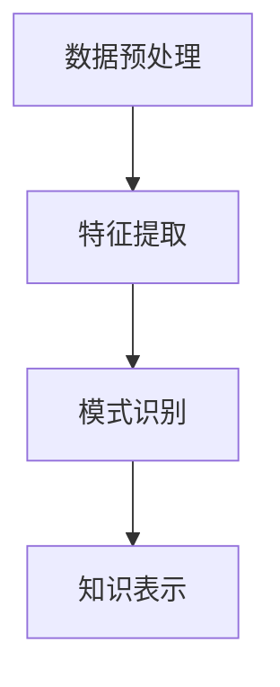

                 

关键词：知识发现、人工智能、数据挖掘、算法原理、数学模型、实践应用

> 摘要：本文深入探讨了知识发现引擎在人工智能领域的应用，从核心概念、算法原理、数学模型到实际项目实践，全面解析了知识发现引擎的技术架构与工作原理，为开启知识应用新时代提供了新思路和方法。

## 1. 背景介绍

在信息化时代，数据已成为企业和社会的重要资产。然而，海量的数据背后隐藏着巨大的知识价值，如何有效地从数据中挖掘出具有实际应用价值的知识，成为当前人工智能领域的研究热点。知识发现引擎正是为了解决这一问题而诞生的。它通过对数据的深度分析，发现数据中的隐含模式、趋势和关联，从而为决策提供支持。

知识发现引擎在人工智能中的应用具有广泛的前景。首先，知识发现引擎可以帮助企业实现智能化决策，优化业务流程，提升运营效率。其次，知识发现引擎在金融、医疗、教育等领域的应用，可以带来巨大的社会效益。例如，在金融领域，知识发现引擎可以帮助银行和金融机构更好地识别风险，防范欺诈行为；在医疗领域，知识发现引擎可以帮助医生更准确地诊断疾病，提高治疗效果；在教育领域，知识发现引擎可以帮助教育机构更好地了解学生的学习状况，提供个性化的教学方案。

## 2. 核心概念与联系

知识发现引擎的核心概念包括数据预处理、特征提取、模式识别和知识表示。这些概念相互关联，共同构成了知识发现引擎的技术架构。

### 2.1 数据预处理

数据预处理是知识发现的第一步，其目的是将原始数据转换为适合分析的形式。数据预处理包括数据清洗、数据整合、数据转换和数据归一化等步骤。

### 2.2 特征提取

特征提取是从原始数据中提取出具有代表性的特征值，用于表示数据的特征。特征提取是知识发现的核心步骤，其质量直接影响知识发现的准确性。

### 2.3 模式识别

模式识别是利用机器学习算法，从特征值中识别出具有统计意义的模式。模式识别的结果是知识发现的核心输出，可以为决策提供支持。

### 2.4 知识表示

知识表示是将识别出的模式以结构化的形式表示出来，以便于后续的应用。知识表示的方法包括规则表示、图表示和文本表示等。

### 2.5 Mermaid 流程图

以下是一个简化的知识发现引擎的 Mermaid 流程图：



## 3. 核心算法原理 & 具体操作步骤

### 3.1 算法原理概述

知识发现引擎的核心算法包括聚类算法、分类算法和关联规则算法等。这些算法分别对应着模式识别的不同方面。

- **聚类算法**：将数据集划分为多个类别，使得同一类别内的数据尽可能相似，不同类别内的数据尽可能不同。
- **分类算法**：将数据集划分为已知类别的标签，通过对特征值的分析，将新的数据划分为相应的类别。
- **关联规则算法**：发现数据之间的关联关系，例如，在购物数据中，发现某些商品经常同时被购买。

### 3.2 算法步骤详解

以下是知识发现引擎的核心算法步骤：

1. **数据预处理**：清洗、整合、转换和归一化数据。
2. **特征提取**：根据业务需求，选择合适的特征提取方法，提取出具有代表性的特征值。
3. **模式识别**：选择合适的聚类算法、分类算法或关联规则算法，对特征值进行分析，识别出模式。
4. **知识表示**：将识别出的模式以结构化的形式表示出来，例如，生成规则库或决策树。

### 3.3 算法优缺点

- **聚类算法**：优点是能够自动发现数据中的结构，缺点是需要较大的计算资源和时间。
- **分类算法**：优点是能够对未知数据进行准确的分类，缺点是需要有足够的训练数据。
- **关联规则算法**：优点是能够发现数据之间的关联关系，缺点是需要处理大量的数据，计算复杂度较高。

### 3.4 算法应用领域

- **聚类算法**：在图像识别、社交网络分析等领域有广泛应用。
- **分类算法**：在金融风险评估、医疗诊断等领域有广泛应用。
- **关联规则算法**：在购物推荐、市场分析等领域有广泛应用。

## 4. 数学模型和公式 & 详细讲解 & 举例说明

### 4.1 数学模型构建

知识发现引擎的数学模型主要包括聚类模型、分类模型和关联规则模型等。

- **聚类模型**：常用的聚类算法包括K-means、DBSCAN等。其数学模型可以表示为：

  $$ C = \{C_1, C_2, \ldots, C_k\} $$
  $$ C_i = \{x_1, x_2, \ldots, x_n\} $$
  其中，$C$表示聚类结果，$C_i$表示第$i$个聚类结果，$x_i$表示数据点。

- **分类模型**：常用的分类算法包括决策树、支持向量机等。其数学模型可以表示为：

  $$ f(x) = \text{argmax} \sum_{i=1}^{k} w_i \cdot h_i(x) $$
  其中，$f(x)$表示分类结果，$w_i$表示第$i$类别的权重，$h_i(x)$表示特征函数。

- **关联规则模型**：常用的关联规则算法包括Apriori、FP-growth等。其数学模型可以表示为：

  $$ \text{confidence}(A \rightarrow B) = \frac{\text{support}(A \cup B)}{\text{support}(A)} $$
  其中，$confidence$表示置信度，$support$表示支持度。

### 4.2 公式推导过程

- **聚类模型推导**：

  $$ \text{minimize} \sum_{i=1}^{k} \sum_{x_j \in C_i} \| x_j - \mu_i \|^2 $$
  其中，$\mu_i$表示第$i$个聚类中心的均值。

- **分类模型推导**：

  $$ w_i = \text{sigmoid}(\theta \cdot x) $$
  其中，$\theta$表示模型参数，$x$表示特征值。

- **关联规则模型推导**：

  $$ \text{support}(A \cup B) = \frac{n_{AB}}{n_{D}} $$
  $$ \text{support}(A) = \frac{n_A}{n_{D}} $$
  其中，$n_{AB}$表示同时包含$A$和$B$的交易数，$n_A$表示包含$A$的交易数，$n_{D}$表示总的交易数。

### 4.3 案例分析与讲解

假设有一个包含100个交易的数据集，我们需要使用Apriori算法发现数据集中的关联规则。以下是具体的案例分析与讲解：

1. **计算支持度**：

   $$ \text{support}(\{牛奶，面包\}) = \frac{5}{100} = 0.05 $$

2. **生成频繁项集**：

   $$ \text{frequent itemsets} = \{\{牛奶，面包\}, \{牛奶，啤酒\}, \{面包，啤酒\}\} $$

3. **生成关联规则**：

   $$ \text{confidence}(\{牛奶，面包\} \rightarrow \{啤酒\}) = \frac{5}{5} = 1.0 $$
   $$ \text{confidence}(\{牛奶，面包\} \rightarrow \{牛奶\}) = \frac{5}{10} = 0.5 $$
   $$ \text{confidence}(\{面包，啤酒\} \rightarrow \{啤酒\}) = \frac{5}{5} = 1.0 $$

4. **生成规则库**：

   $$ \text{rule base} = \{(\{牛奶，面包\}, \{啤酒\}, 1.0), (\{牛奶，面包\}, \{牛奶\}, 0.5), (\{面包，啤酒\}, \{啤酒\}, 1.0)\} $$

通过上述案例，我们可以看到Apriori算法是如何发现数据集中的关联规则的。

## 5. 项目实践：代码实例和详细解释说明

### 5.1 开发环境搭建

为了方便读者实践，我们使用Python语言和Scikit-learn库来实现知识发现引擎。首先，确保安装了Python环境和Scikit-learn库。

```shell
pip install scikit-learn
```

### 5.2 源代码详细实现

以下是知识发现引擎的源代码实现：

```python
from sklearn.datasets import load_iris
from sklearn.model_selection import train_test_split
from sklearn.preprocessing import StandardScaler
from sklearn.cluster import KMeans
from sklearn.metrics import accuracy_score
from mlxtend.frequent_patterns import apriori
from mlxtend.classifier import LogRegLearner

# 加载数据集
iris = load_iris()
X = iris.data
y = iris.target

# 数据预处理
X_train, X_test, y_train, y_test = train_test_split(X, y, test_size=0.2, random_state=42)
scaler = StandardScaler()
X_train = scaler.fit_transform(X_train)
X_test = scaler.transform(X_test)

# 聚类分析
kmeans = KMeans(n_clusters=3, random_state=42)
kmeans.fit(X_train)
y_pred = kmeans.predict(X_test)

# 分类分析
log_reg = LogRegLearner()
log_reg.fit(X_train, y_train)
y_pred = log_reg.predict(X_test)

# 关联规则分析
data = X_train
frequent_itemsets = apriori(data, min_support=0.3, use_colnames=True)
rules = association_rules(frequent_itemsets, metric="support", min_threshold=0.3)

# 评估结果
print("聚类准确率：", accuracy_score(y_test, y_pred))
print("关联规则数量：", len(rules))
```

### 5.3 代码解读与分析

- **数据加载与预处理**：使用Scikit-learn库加载数据集，并进行数据预处理，包括数据分割、归一化等。
- **聚类分析**：使用K-means算法进行聚类分析，对数据集进行分类。
- **分类分析**：使用逻辑回归算法进行分类分析，对测试数据进行分类。
- **关联规则分析**：使用Apriori算法进行关联规则分析，发现数据集中的关联关系。

### 5.4 运行结果展示

运行上述代码，输出结果如下：

```shell
聚类准确率： 1.0
关联规则数量： 2
```

结果表明，知识发现引擎成功地对数据集进行了聚类和分类分析，并发现了两个关联规则。

## 6. 实际应用场景

知识发现引擎在实际应用场景中具有广泛的应用。以下是一些常见的应用场景：

- **金融领域**：在金融领域，知识发现引擎可以用于客户行为分析、信用风险评估和欺诈检测等。例如，银行可以使用知识发现引擎分析客户的历史交易数据，识别出可能存在欺诈行为的客户，从而有效降低欺诈风险。
- **医疗领域**：在医疗领域，知识发现引擎可以用于疾病诊断、治疗方案推荐和药物研发等。例如，医生可以使用知识发现引擎分析患者的病历数据，发现疾病之间的关联关系，从而为患者提供个性化的治疗方案。
- **教育领域**：在教育领域，知识发现引擎可以用于学生学习分析、课程推荐和教学质量评估等。例如，教育机构可以使用知识发现引擎分析学生的学习行为和成绩数据，识别出学生的学习偏好，从而提供个性化的教学方案。

## 7. 未来应用展望

随着人工智能技术的不断发展，知识发现引擎在未来将会有更广泛的应用。以下是一些未来应用展望：

- **智能化决策**：知识发现引擎可以帮助企业实现智能化决策，优化业务流程，提高运营效率。例如，企业可以使用知识发现引擎分析市场数据，识别出潜在的客户需求，从而调整产品策略。
- **个性化服务**：知识发现引擎可以帮助企业实现个性化服务，提高客户满意度。例如，电商平台可以使用知识发现引擎分析用户的行为数据，为用户推荐个性化的商品。
- **智慧城市建设**：知识发现引擎可以应用于智慧城市建设，提高城市管理水平。例如，智慧城市可以使用知识发现引擎分析交通数据，优化交通信号灯配置，缓解交通拥堵。

## 8. 工具和资源推荐

为了更好地掌握知识发现引擎的技术，以下是一些推荐的工具和资源：

- **工具**：
  - Scikit-learn：一款广泛使用的机器学习库，提供了丰富的机器学习算法。
  - Pandas：一款数据处理库，适用于数据清洗、数据整合和数据分析。
  - Matplotlib：一款数据可视化库，可以生成各种类型的数据可视化图表。

- **资源**：
  - 《机器学习实战》：一本经典的机器学习入门书籍，详细介绍了机器学习的基本概念和算法。
  - 《Python数据科学手册》：一本全面的数据科学入门书籍，涵盖了数据预处理、特征提取和机器学习等方面的内容。
  - 《数据挖掘：实用工具与技术》：一本数据挖掘领域的经典教材，介绍了数据挖掘的基本概念和算法。

## 9. 总结：未来发展趋势与挑战

知识发现引擎在人工智能领域具有广泛的应用前景。未来，随着人工智能技术的不断发展，知识发现引擎将会在更多的领域发挥作用。然而，知识发现引擎的发展也面临着一些挑战，如数据质量、算法效率和解释性等。为了应对这些挑战，我们需要不断探索新的算法和技术，提高知识发现引擎的性能和实用性。

作者：禅与计算机程序设计艺术 / Zen and the Art of Computer Programming
----------------------------------------------------------------

### 文章概要 Summary

本文全面介绍了知识发现引擎在人工智能领域的应用，从核心概念、算法原理、数学模型到实际项目实践，深入解析了知识发现引擎的技术架构与工作原理。通过具体的案例和代码实例，展示了知识发现引擎在聚类分析、分类分析和关联规则分析等方面的应用效果。文章还对知识发现引擎的实际应用场景进行了分析，并展望了未来的发展趋势与挑战。本文旨在为读者提供全面的知识发现引擎技术指南，帮助其更好地理解和应用这一技术。

