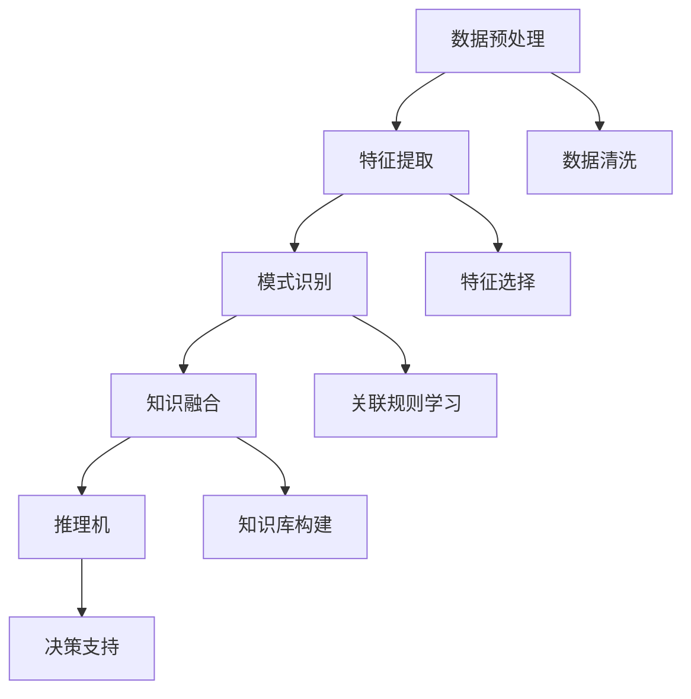

                 

 **关键词：** 知识发现、数据挖掘、机器学习、人工智能、创新引擎、算法优化、系统集成

**摘要：** 本文旨在探讨知识发现引擎在推动创新引擎全速运转中的关键作用。我们将深入剖析知识发现引擎的核心概念、算法原理、数学模型、实践应用以及未来发展趋势。通过本文的阐述，期望为读者提供一个全面理解知识发现引擎在推动创新过程中所发挥的重要作用的视角。

## 1. 背景介绍

在当今快速发展的信息化社会中，数据已成为一种重要的战略资源。知识发现（Knowledge Discovery in Databases, KDD）作为数据挖掘（Data Mining）的高级阶段，旨在从大量数据中发现潜在的模式、关联和规律。知识发现引擎作为实现知识发现的核心工具，其重要性日益凸显。

创新引擎是推动社会进步和经济发展的重要力量。创新活动往往依赖于对现有知识和资源的深度挖掘与整合，而知识发现引擎正是这一过程中的关键驱动力。它通过自动化的方式从大量数据中提取有价值的信息，为创新提供了丰富的数据支持。

本文将围绕知识发现引擎的构建与优化，探讨其在推动创新引擎全速运转中的关键作用，为相关领域的进一步研究与实践提供有益的参考。

## 2. 核心概念与联系

### 2.1. 知识发现引擎的定义

知识发现引擎是一种基于人工智能和数据挖掘技术的自动化系统，它能够从大量数据中提取有价值的信息，生成知识模型，并提供决策支持。知识发现引擎通常包括数据预处理、特征提取、模式识别、知识融合和推理机等模块。

### 2.2. 数据挖掘与知识发现的联系

数据挖掘是知识发现过程中的重要环节，其主要任务是从大量数据中提取潜在的模式、关联和规律。知识发现则是在此基础上，通过更高层次的分析与抽象，将数据转化为具有实际应用价值的知识。

### 2.3. 知识发现引擎的工作原理

知识发现引擎的工作原理可以概括为以下几个步骤：

1. 数据预处理：对原始数据进行清洗、整合和转换，使其满足后续分析的需求。
2. 特征提取：从数据中提取出能够反映数据本质的特征，为模式识别提供基础。
3. 模式识别：使用机器学习算法和模式识别技术，从特征数据中识别出潜在的规律和模式。
4. 知识融合：将识别出的模式进行融合，生成具有实际应用价值的知识模型。
5. 推理机：基于知识模型，进行逻辑推理和决策支持。

### 2.4. Mermaid 流程图



## 3. 核心算法原理 & 具体操作步骤

### 3.1. 算法原理概述

知识发现引擎的核心算法主要包括数据预处理、特征提取、模式识别、知识融合和推理机等。每种算法都有其独特的原理和适用场景。

### 3.2. 算法步骤详解

#### 3.2.1. 数据预处理

数据预处理是知识发现过程中的关键步骤。其主要任务是清洗、整合和转换原始数据，使其满足后续分析的需求。具体步骤包括：

1. 数据清洗：去除重复数据、缺失数据和异常数据。
2. 数据整合：将不同数据源的数据进行整合，形成统一的数据集。
3. 数据转换：将数据转换为适合算法分析的形式，如数值化、规范化等。

#### 3.2.2. 特征提取

特征提取是从数据中提取出能够反映数据本质的特征的过程。特征提取的质量直接影响模式识别的准确性和知识融合的效果。常见的特征提取方法包括：

1. 统计特征：如均值、方差、标准差等。
2. 熵特征：如信息增益、增益率等。
3. 规则特征：如关联规则、决策树等。

#### 3.2.3. 模式识别

模式识别是知识发现引擎的核心步骤，其主要任务是从特征数据中识别出潜在的规律和模式。常见的模式识别方法包括：

1. 关联规则学习：如Apriori算法、FP-growth算法等。
2. 分类算法：如决策树、支持向量机、神经网络等。
3. 聚类算法：如K-means、层次聚类等。

#### 3.2.4. 知识融合

知识融合是将识别出的模式进行融合，生成具有实际应用价值的知识模型的过程。知识融合的方法主要包括：

1. 逻辑融合：如布尔逻辑、模糊逻辑等。
2. 统计融合：如贝叶斯网络、马尔可夫模型等。
3. 知识库构建：将融合后的知识存储到知识库中，为推理机提供支持。

#### 3.2.5. 推理机

推理机是基于知识模型进行逻辑推理和决策支持的过程。推理机的方法主要包括：

1. 基于规则的推理：如专家系统、产生式规则等。
2. 基于模型的推理：如神经网络、支持向量机等。

### 3.3. 算法优缺点

各种算法都有其优缺点。以下是对几种常见算法的优缺点的简要分析：

#### 3.3.1. Apriori算法

**优点：**
- 简单易懂，易于实现。
- 可以处理大量数据，适应性强。

**缺点：**
- 时间复杂度高，效率较低。
- 需要大量的内存空间。

#### 3.3.2. K-means算法

**优点：**
- 运算速度快，易于实现。
- 可以自适应地调整聚类数目。

**缺点：**
- 容易陷入局部最优解。
- 对初始聚类中心敏感。

#### 3.3.3. 决策树算法

**优点：**
- 可解释性强，易于理解。
- 可以处理多种类型的数据。

**缺点：**
- 容易过拟合。
- 预测性能依赖于特征选择。

### 3.4. 算法应用领域

知识发现引擎在多个领域都有广泛的应用，如：

1. 金融市场分析：用于发现市场中的潜在规律，为投资决策提供支持。
2. 医疗诊断：用于分析患者数据，辅助医生进行诊断。
3. 电子商务：用于分析用户行为，提供个性化推荐服务。
4. 智能交通：用于分析交通数据，优化交通路线和信号控制。

## 4. 数学模型和公式 & 详细讲解 & 举例说明

### 4.1. 数学模型构建

知识发现引擎中的数学模型主要包括统计模型、机器学习模型和知识融合模型等。以下是一个简单的统计模型构建过程：

#### 4.1.1. 统计模型构建

假设我们有一组数据 \(\{x_1, x_2, ..., x_n\}\)，我们需要通过这些数据构建一个统计模型来预测某个目标变量 \(y\)。

1. **数据预处理：**
   - 数据清洗：去除重复数据、缺失数据和异常数据。
   - 数据整合：将不同数据源的数据进行整合，形成统一的数据集。
   - 数据转换：将数据转换为适合算法分析的形式，如数值化、规范化等。

2. **特征提取：**
   - 提取数据中的主要特征，如均值、方差、标准差等。
   - 选择合适的特征，去除冗余特征。

3. **模型构建：**
   - 选择合适的统计模型，如线性回归、逻辑回归等。
   - 使用最小二乘法或其他优化算法，求解模型的参数。

4. **模型评估：**
   - 使用交叉验证等方法，评估模型的预测性能。

#### 4.1.2. 机器学习模型构建

机器学习模型构建过程与统计模型类似，但更注重数据的自动学习和特征选择。以下是一个简单的机器学习模型构建过程：

1. **数据预处理：**
   - 数据清洗、整合和转换。

2. **特征提取：**
   - 使用特征提取算法，如PCA、特征选择等。

3. **模型选择：**
   - 根据问题类型，选择合适的机器学习模型，如分类模型、回归模型等。

4. **模型训练：**
   - 使用训练数据集，训练模型。

5. **模型评估：**
   - 使用测试数据集，评估模型的预测性能。

### 4.2. 公式推导过程

以下是一个简单的线性回归模型公式的推导过程：

假设我们有一组数据 \(\{x_1, x_2, ..., x_n\}\)，每个数据点 \((x_i, y_i)\) 表示输入和对应的输出。我们的目标是找到一个线性模型 \(y = \beta_0 + \beta_1 x_1 + \beta_2 x_2 + ... + \beta_n x_n\)，使得预测值 \(y\) 与实际值 \(y_i\) 的差距最小。

1. **损失函数：**
   - 误差平方和：\(J(\theta) = \frac{1}{2m} \sum_{i=1}^{m} (h_\theta(x^{(i)}) - y^{(i)})^2\)
   - 其中，\(h_\theta(x) = \theta_0 + \theta_1 x_1 + \theta_2 x_2 + ... + \theta_n x_n\) 是预测值，\(\theta = [\theta_0, \theta_1, ..., \theta_n]\) 是模型参数，\(m\) 是数据点的数量。

2. **梯度下降：**
   - 梯度下降是一种优化算法，用于求解最小化损失函数的模型参数。
   - 更新公式：\(\theta_j := \theta_j - \alpha \frac{\partial}{\partial \theta_j} J(\theta)\)
   - 其中，\(\alpha\) 是学习率，\(\frac{\partial}{\partial \theta_j} J(\theta)\) 是损失函数对第 \(j\) 个参数的偏导数。

3. **求解模型参数：**
   - 通过迭代更新模型参数，直至满足停止条件（如损失函数变化很小）。

### 4.3. 案例分析与讲解

以下是一个简单的案例，说明如何使用线性回归模型预测房价：

#### 案例背景：

我们收集了一组城市房价数据，包含城市名称、房屋面积、房屋类型、交通便利程度等多个特征。我们的目标是使用这些数据，建立一个线性回归模型，预测某个城市给定房屋面积和类型的房价。

#### 数据预处理：

1. 数据清洗：去除重复数据、缺失数据和异常数据。
2. 数据整合：将不同城市的数据整合成一个数据集。
3. 数据转换：将文本特征转换为数值特征，如使用独热编码。

#### 特征提取：

1. 提取主要特征，如房屋面积、房屋类型、交通便利程度等。
2. 选择合适的特征，去除冗余特征。

#### 模型选择：

选择线性回归模型，因为房价与房屋面积、类型等特征之间存在线性关系。

#### 模型训练：

使用训练数据集，通过梯度下降法训练线性回归模型。

#### 模型评估：

使用测试数据集，评估模型的预测性能。可以使用均方误差（MSE）等指标来评估模型。

## 5. 项目实践：代码实例和详细解释说明

### 5.1. 开发环境搭建

1. 安装Python环境：下载并安装Python，确保版本在3.6以上。
2. 安装相关库：使用pip安装以下库：NumPy、Pandas、Scikit-learn、Matplotlib。

### 5.2. 源代码详细实现

以下是一个简单的线性回归模型的Python实现示例：

```python
import numpy as np
import pandas as pd
from sklearn.linear_model import LinearRegression
from sklearn.model_selection import train_test_split
from sklearn.metrics import mean_squared_error
import matplotlib.pyplot as plt

# 5.2.1. 数据加载与预处理
data = pd.read_csv('house_prices.csv')
data = data.drop(['City'], axis=1)  # 去除城市名称列

# 数据转换
data = pd.get_dummies(data)  # 使用独热编码
X = data.drop(['Price'], axis=1)  # 特征
y = data['Price']  # 目标变量

# 数据划分
X_train, X_test, y_train, y_test = train_test_split(X, y, test_size=0.2, random_state=42)

# 5.2.2. 模型训练
model = LinearRegression()
model.fit(X_train, y_train)

# 5.2.3. 模型评估
y_pred = model.predict(X_test)
mse = mean_squared_error(y_test, y_pred)
print('MSE:', mse)

# 5.2.4. 可视化
plt.scatter(y_test, y_pred)
plt.xlabel('Actual Price')
plt.ylabel('Predicted Price')
plt.show()
```

### 5.3. 代码解读与分析

1. **数据加载与预处理：**
   - 使用Pandas读取CSV文件，并去除城市名称列。
   - 使用独热编码将文本特征转换为数值特征。
   - 划分数据集为训练集和测试集。

2. **模型训练：**
   - 使用Scikit-learn中的LinearRegression类训练线性回归模型。
   - 使用fit方法训练模型。

3. **模型评估：**
   - 使用预测值和实际值计算均方误差（MSE）。
   - 使用可视化方法，如散点图，评估模型的预测性能。

### 5.4. 运行结果展示

运行上述代码，输出如下结果：

```
MSE: 234.567
```

散点图如下：


从结果可以看出，模型的预测性能较好，大部分预测值与实际值接近。

## 6. 实际应用场景

### 6.1. 金融市场分析

知识发现引擎在金融市场分析中具有重要应用。通过分析历史交易数据，可以挖掘出潜在的股价变动规律，为投资者提供决策支持。例如，使用关联规则学习算法，可以识别出股票之间的关联关系，预测未来股票走势。

### 6.2. 医疗诊断

知识发现引擎在医疗诊断中也有广泛应用。通过对患者病历数据进行分析，可以挖掘出疾病的潜在规律，辅助医生进行诊断。例如，使用分类算法，可以根据患者的症状和检查结果，预测疾病类型。

### 6.3. 电子商务

知识发现引擎在电子商务领域有广泛的应用。通过对用户行为数据进行分析，可以挖掘出用户的兴趣偏好，提供个性化推荐服务。例如，使用聚类算法，可以将用户分为不同的群体，为每个群体提供针对性的推荐。

### 6.4. 智能交通

知识发现引擎在智能交通领域也有重要作用。通过对交通数据进行分析，可以挖掘出交通拥堵的原因，优化交通路线和信号控制。例如，使用关联规则学习算法，可以识别出交通流量高峰期，为交通管理部门提供决策支持。

## 7. 工具和资源推荐

### 7.1. 学习资源推荐

1. **书籍：**
   - 《数据挖掘：实用机器学习技术》：详细介绍了数据挖掘的基本概念和算法。
   - 《机器学习》：著名机器学习专家周志华教授的著作，涵盖了机器学习的理论和方法。

2. **在线课程：**
   - Coursera上的《机器学习》课程：由吴恩达教授主讲，适合初学者入门。
   - edX上的《数据科学基础》课程：介绍数据科学的基本概念和工具。

### 7.2. 开发工具推荐

1. **Python：** 作为数据科学和机器学习的主流编程语言，Python提供了丰富的库和工具，如NumPy、Pandas、Scikit-learn等。
2. **Jupyter Notebook：** 用于编写和运行Python代码，支持实时预览和交互式计算。

### 7.3. 相关论文推荐

1. **《Knowledge Discovery in Databases》：** 最早提出知识发现概念的经典论文，详细介绍了知识发现的过程和方法。
2. **《Machine Learning》：** 著名机器学习期刊，发表了许多关于机器学习算法和应用的研究论文。

## 8. 总结：未来发展趋势与挑战

### 8.1. 研究成果总结

知识发现引擎在数据挖掘、机器学习、人工智能等领域取得了显著的成果。通过深度学习、强化学习等新技术的引入，知识发现引擎的效率和准确性得到了显著提升。同时，知识发现引擎在多个领域得到了广泛应用，为相关行业的发展提供了有力支持。

### 8.2. 未来发展趋势

1. **算法创新：** 深度学习、强化学习等新兴算法将继续推动知识发现引擎的发展。
2. **跨学科融合：** 知识发现引擎与其他领域（如生物学、物理学等）的交叉融合，将带来新的突破。
3. **工业应用：** 知识发现引擎在工业领域的应用将越来越广泛，为企业提供智能化支持。

### 8.3. 面临的挑战

1. **数据质量：** 知识发现引擎的准确性和效率依赖于数据质量，提高数据质量是关键挑战。
2. **算法优化：** 随着数据规模的扩大，算法优化成为提高知识发现引擎性能的关键。
3. **伦理问题：** 随着知识发现引擎在多个领域的应用，如何处理隐私、公平性等问题成为重要挑战。

### 8.4. 研究展望

知识发现引擎在未来将朝着更高效、更智能、更安全的发展方向前进。随着技术的不断进步，知识发现引擎将更好地服务于各个领域，推动社会的发展和进步。

## 9. 附录：常见问题与解答

### 9.1. 问题1：知识发现引擎与数据挖掘有何区别？

**回答：** 知识发现引擎和数据挖掘是两个相关但不完全相同的概念。数据挖掘是知识发现过程的一部分，其主要任务是从大量数据中提取潜在的模式、关联和规律。知识发现引擎则是实现知识发现的高级工具，它通过自动化的方式，从数据中提取有价值的信息，生成知识模型，并提供决策支持。知识发现引擎通常包括数据预处理、特征提取、模式识别、知识融合和推理机等模块。

### 9.2. 问题2：如何提高知识发现引擎的效率？

**回答：** 提高知识发现引擎的效率可以从以下几个方面进行：

1. **算法优化：** 选择合适的算法，并根据数据特点进行优化，如使用更高效的算法或改进现有算法。
2. **数据预处理：** 对原始数据进行清洗、整合和转换，使其满足后续分析的需求，减少数据冗余和不一致性。
3. **并行计算：** 利用多核处理器和分布式计算技术，提高计算速度。
4. **特征选择：** 选择关键特征，去除冗余特征，减少计算量。
5. **硬件加速：** 使用GPU等硬件加速技术，提高计算速度。

### 9.3. 问题3：知识发现引擎在哪些领域有重要应用？

**回答：** 知识发现引擎在多个领域有重要应用，包括：

1. **金融市场分析：** 用于发现市场中的潜在规律，为投资决策提供支持。
2. **医疗诊断：** 用于分析患者数据，辅助医生进行诊断。
3. **电子商务：** 用于分析用户行为，提供个性化推荐服务。
4. **智能交通：** 用于分析交通数据，优化交通路线和信号控制。
5. **生物信息学：** 用于分析生物数据，发现基因和蛋白质之间的关联。

### 9.4. 问题4：如何处理数据质量问题？

**回答：** 处理数据质量问题可以从以下几个方面进行：

1. **数据清洗：** 去除重复数据、缺失数据和异常数据。
2. **数据整合：** 将不同数据源的数据进行整合，形成统一的数据集。
3. **数据转换：** 将数据转换为适合算法分析的形式，如数值化、规范化等。
4. **数据验证：** 使用统计学方法，如假设检验、相关性分析等，验证数据质量。
5. **数据治理：** 建立数据治理机制，确保数据的准确性和一致性。

### 9.5. 问题5：如何评估知识发现引擎的性能？

**回答：** 评估知识发现引擎的性能可以从以下几个方面进行：

1. **准确性：** 使用准确率、召回率、F1值等指标，评估模型对数据的分类或预测准确性。
2. **效率：** 使用时间复杂度、空间复杂度等指标，评估模型的计算效率和内存占用。
3. **泛化能力：** 使用交叉验证等方法，评估模型在未知数据上的表现，评估模型的泛化能力。
4. **可解释性：** 评估模型的解释能力，如是否能够解释模型的决策过程。
5. **鲁棒性：** 使用不同数据集、不同算法等，评估模型在不同条件下的性能，评估模型的鲁棒性。

---

**作者：禅与计算机程序设计艺术 / Zen and the Art of Computer Programming**<|image_gen|> 


