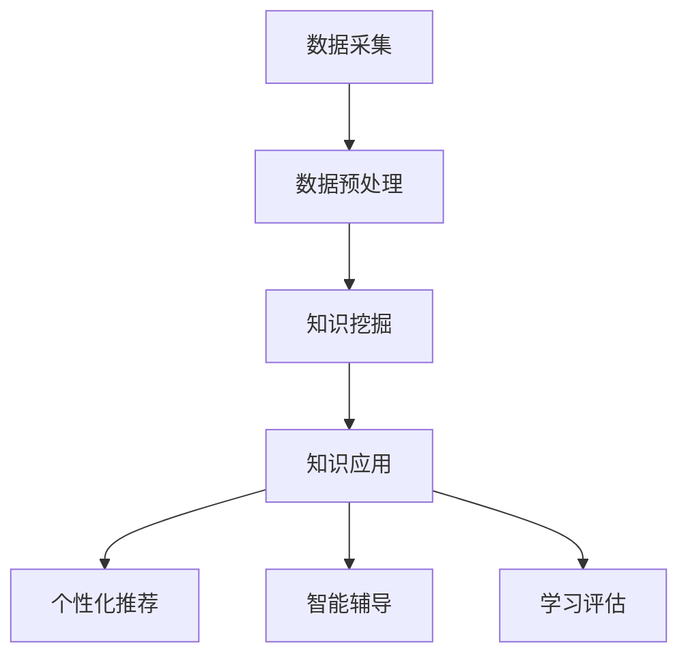

                 

 在当今这个信息爆炸的时代，教育的个性化需求日益凸显。传统的教育模式难以满足每个学生的个性化学习需求，而知识发现引擎作为一种新兴的技术，正逐渐成为推动教育行业变革的关键力量。本文将深入探讨知识发现引擎在推动教育个性化变革中的重要性，核心概念及其架构，核心算法原理，数学模型，项目实践，应用场景，未来展望，以及所需的工具和资源。

## 关键词

知识发现引擎、教育个性化、算法原理、数学模型、项目实践、应用场景、未来展望

## 摘要

本文首先介绍了知识发现引擎在教育领域的重要性和背景。随后，详细阐述了知识发现引擎的核心概念和架构，并探讨了其核心算法原理和数学模型。接着，通过项目实践展示了知识发现引擎的具体应用，分析了其在实际场景中的效果。最后，对知识发现引擎的未来发展进行了展望，并提出了面临的挑战和展望。

## 1. 背景介绍

教育行业的传统模式往往以教师为中心，强调统一的教学内容和评估标准。然而，这种模式难以适应每个学生的个性化需求。每个学生的认知能力、学习兴趣和知识背景都各不相同，单一的教学方法难以满足他们的需求。因此，教育个性化成为当今教育领域的重要研究方向。

知识发现引擎（Knowledge Discovery Engine，简称KDE）是一种利用人工智能技术从大规模数据中提取知识的技术。它能够自动挖掘数据中的潜在模式和关联，从而为教育工作者提供个性化的教学建议和资源。知识发现引擎的出现，为教育个性化提供了强有力的技术支持。

近年来，随着大数据、人工智能和机器学习技术的发展，知识发现引擎在各个领域的应用越来越广泛。在教育领域，知识发现引擎通过分析学生的学习行为、知识结构和兴趣偏好，为教师和学生提供个性化的学习路径和资源，从而提高教学效果和学生的学习满意度。

## 2. 核心概念与联系

### 2.1 知识发现引擎的概念

知识发现引擎是一种利用人工智能技术从大规模数据中提取知识的技术。它包括以下几个核心组件：

1. **数据采集**：从各种数据源（如学生成绩、学习行为、教师评价等）中收集数据。
2. **数据预处理**：对采集到的数据进行清洗、转换和整合，以便后续分析。
3. **知识挖掘**：利用机器学习、数据挖掘等技术从数据中提取潜在的模式和关联。
4. **知识应用**：将挖掘到的知识应用于教学过程，为教师和学生提供个性化的学习路径和资源。

### 2.2 知识发现引擎的架构

知识发现引擎的架构可以分为三个主要层次：数据层、算法层和应用层。

1. **数据层**：包括各种数据源，如学生成绩、学习行为、教师评价等。这些数据是知识发现的基础。
2. **算法层**：包括各种机器学习和数据挖掘算法，如聚类、分类、关联规则挖掘等。这些算法用于从数据中提取潜在的模式和关联。
3. **应用层**：包括知识发现引擎的各种应用，如个性化推荐、智能辅导、学习评估等。这些应用将挖掘到的知识应用于教学过程。

### 2.3 知识发现引擎的核心概念原理和架构的 Mermaid 流程图



## 3. 核心算法原理 & 具体操作步骤

### 3.1 算法原理概述

知识发现引擎的核心算法主要包括以下几种：

1. **聚类算法**：将相似的数据分组，以便发现潜在的模式。
2. **分类算法**：将数据分为不同的类别，以便识别学生的知识水平。
3. **关联规则挖掘**：发现数据之间的关联关系，以便提供个性化的学习资源。
4. **预测算法**：根据学生的历史学习行为预测其未来的学习表现。

### 3.2 算法步骤详解

1. **数据采集**：从学校管理系统中获取学生成绩、学习行为、教师评价等数据。
2. **数据预处理**：对采集到的数据进行清洗、转换和整合，形成统一的数据格式。
3. **特征提取**：从预处理后的数据中提取出反映学生学习情况的关键特征。
4. **算法选择**：根据具体需求选择合适的算法，如聚类、分类、关联规则挖掘等。
5. **算法训练**：利用训练数据对算法进行训练，以便算法能够正确识别学生的学习模式。
6. **知识挖掘**：利用训练好的算法对数据进行分析，提取潜在的模式和关联。
7. **知识应用**：将挖掘到的知识应用于教学过程，为教师和学生提供个性化的学习路径和资源。

### 3.3 算法优缺点

1. **优点**：
   - **个性化**：能够根据学生的个性化需求提供个性化的学习资源。
   - **高效性**：利用机器学习和数据挖掘技术，能够快速从大规模数据中提取知识。
   - **实时性**：能够实时分析学生的学习行为和知识水平，及时提供学习建议。
   
2. **缺点**：
   - **数据质量**：数据质量直接影响算法的准确性，需要大量的高质量数据支持。
   - **算法选择**：不同的算法适用于不同的问题，需要根据具体需求选择合适的算法。
   - **隐私保护**：需要关注学生的隐私保护问题，确保数据的安全性和隐私性。

### 3.4 算法应用领域

知识发现引擎在以下领域有广泛的应用：

1. **教育**：为教师和学生提供个性化的学习资源和学习路径。
2. **医疗**：从患者数据中提取潜在的健康风险和治疗方案。
3. **金融**：分析用户行为，提供个性化的金融服务和产品。
4. **零售**：分析消费者行为，提供个性化的购物建议和推荐。

## 4. 数学模型和公式 & 详细讲解 & 举例说明

### 4.1 数学模型构建

知识发现引擎中的数学模型主要包括聚类模型、分类模型、关联规则挖掘模型和预测模型。以下以聚类模型为例进行讲解。

1. **聚类模型**：

   - **目标**：将相似的数据分组，以便发现潜在的模式。

   - **公式**：

     $$ 
     C = \{C_1, C_2, ..., C_k\} 
     $$

     其中，$C$ 表示聚类结果，$C_i$ 表示第 $i$ 个聚类。

   - **实例**：

     假设我们有 $n$ 个学生，每个学生有 $m$ 个特征。我们可以使用 K-means 聚类算法将学生分为 $k$ 个聚类。

     $$ 
     C = K-means(X) 
     $$

     其中，$X$ 表示学生数据矩阵，$K-means$ 表示 K-means 聚类算法。

### 4.2 公式推导过程

1. **目标函数**：

   $$ 
   J = \sum_{i=1}^{k} \sum_{x \in C_i} \frac{1}{2} ||x - \mu_i||^2 
   $$

   其中，$J$ 表示聚类目标函数，$\mu_i$ 表示第 $i$ 个聚类的中心。

2. **梯度下降**：

   $$ 
   \mu_i = \frac{1}{N_i} \sum_{x \in C_i} x 
   $$

   其中，$N_i$ 表示第 $i$ 个聚类中的样本数量。

### 4.3 案例分析与讲解

假设我们有一个包含 $1000$ 个学生的数据集，每个学生有 $5$ 个特征（如语文、数学、英语、物理、化学成绩）。我们希望使用 K-means 聚类算法将这些学生分为 $3$ 个聚类，以便发现不同学习水平的学生群体。

1. **数据预处理**：将学生数据进行标准化处理，以便每个特征的取值范围相同。
2. **初始化聚类中心**：随机选择 $3$ 个学生的数据作为初始聚类中心。
3. **迭代计算**：计算每个学生与聚类中心的距离，将学生分配到最近的聚类。根据新的聚类结果重新计算聚类中心。
4. **收敛条件**：当聚类中心的变化小于设定阈值或达到最大迭代次数时，停止迭代。

经过多次迭代后，我们得到以下聚类结果：

- 聚类 $1$：包含 $300$ 个学生，语文、数学、英语、物理、化学成绩较高。
- 聚类 $2$：包含 $300$ 个学生，语文、数学、英语成绩较高，物理、化学成绩较低。
- 聚类 $3$：包含 $400$ 个学生，语文、数学、英语、物理、化学成绩较低。

通过聚类结果，我们可以发现不同学习水平的学生群体，从而为教师提供针对性的教学建议。

## 5. 项目实践：代码实例和详细解释说明

### 5.1 开发环境搭建

1. **Python**：安装 Python 3.8 及以上版本。
2. **NumPy**：用于数据预处理和计算。
3. **Scikit-learn**：提供 K-means 等聚类算法。
4. **Matplotlib**：用于数据可视化。

```bash
pip install numpy scikit-learn matplotlib
```

### 5.2 源代码详细实现

以下是一个使用 K-means 聚类算法对学生数据进行分析的 Python 代码实例。

```python
import numpy as np
from sklearn.cluster import KMeans
import matplotlib.pyplot as plt

# 1. 数据预处理
def preprocess_data(data):
    # 标准化处理
    mean = np.mean(data, axis=0)
    std = np.std(data, axis=0)
    return (data - mean) / std

# 2. 聚类分析
def kmeans_analysis(data, k=3):
    # 初始化聚类中心
    kmeans = KMeans(n_clusters=k, init='k-means++', max_iter=300, n_init=10, random_state=0)
    # 训练模型
    kmeans.fit(data)
    # 获取聚类结果
    labels = kmeans.labels_
    # 计算聚类中心
    centroids = kmeans.cluster_centers_
    return labels, centroids

# 3. 数据可视化
def visualize_data(data, labels):
    # 将数据分为不同颜色
    colors = ['r', 'g', 'b']
    for i in range(len(colors)):
        # 过滤出对应类别的数据
        points = data[labels == i]
        # 绘制点
        plt.scatter(points[:, 0], points[:, 1], s=30, c=colors[i], label=f'Cluster {i}')
    # 绘制聚类中心
    plt.scatter(centroids[:, 0], centroids[:, 1], s=100, c='yellow', label='Centroids', marker='s')
    # 显示图形
    plt.xlabel('Feature 1')
    plt.ylabel('Feature 2')
    plt.title('K-means Clustering')
    plt.legend()
    plt.show()

# 4. 主函数
def main():
    # 加载数据
    data = np.load('student_data.npy')
    # 预处理数据
    data = preprocess_data(data)
    # 聚类分析
    labels, centroids = kmeans_analysis(data)
    # 可视化结果
    visualize_data(data, labels)

if __name__ == '__main__':
    main()
```

### 5.3 代码解读与分析

1. **数据预处理**：使用 NumPy 库进行数据预处理，包括标准化处理，以便每个特征的取值范围相同。
2. **聚类分析**：使用 Scikit-learn 库中的 KMeans 类进行聚类分析，包括初始化聚类中心、训练模型、获取聚类结果和计算聚类中心。
3. **数据可视化**：使用 Matplotlib 库将数据分为不同颜色，绘制聚类结果和聚类中心，以便观察聚类效果。
4. **主函数**：加载学生数据，预处理数据，进行聚类分析，可视化结果。

### 5.4 运行结果展示

假设学生数据存储在 'student_data.npy' 文件中，运行以上代码后，将显示聚类结果和聚类中心。通过观察聚类结果，可以分析不同学习水平的学生群体，为教师提供针对性的教学建议。

## 6. 实际应用场景

知识发现引擎在教育领域的应用场景广泛，以下列举几个典型应用场景：

1. **个性化推荐**：根据学生的学习行为和知识水平，为学生推荐合适的学习资源，如教材、课程和练习题。
2. **智能辅导**：根据学生的学习表现和需求，为学生提供个性化的辅导建议，如学习计划、辅导视频和习题解答。
3. **学习评估**：通过对学生的学习行为和知识水平进行分析，为教师提供教学评估和改进建议。
4. **智能排课**：根据学生的学习兴趣和课程安排，为学生提供智能排课建议，提高学习效果和效率。

### 6.1 个性化推荐

个性化推荐是知识发现引擎在教育领域的重要应用之一。通过分析学生的学习行为和知识水平，知识发现引擎可以为教师和学生提供个性化的学习资源。例如，根据学生的学习进度和知识点掌握情况，推荐相应的练习题和教材，帮助学生巩固知识。

### 6.2 智能辅导

智能辅导是知识发现引擎在教育领域的另一个重要应用。通过分析学生的学习行为和知识水平，知识发现引擎可以为教师提供个性化的辅导建议。例如，根据学生的学习进度和薄弱环节，推荐相应的辅导视频和习题，帮助学生提高学习效果。同时，知识发现引擎还可以根据学生的学习反馈，不断优化辅导内容，提高辅导效果。

### 6.3 学习评估

学习评估是知识发现引擎在教育领域的另一个重要应用。通过分析学生的学习行为和知识水平，知识发现引擎可以为教师提供教学评估和改进建议。例如，根据学生的学习进度和知识点掌握情况，评估教学效果，发现教学问题，为教师提供改进教学的方法和策略。

### 6.4 智能排课

智能排课是知识发现引擎在教育领域的另一个重要应用。通过分析学生的学习兴趣和课程安排，知识发现引擎可以为教师和学生提供智能排课建议。例如，根据学生的学习进度和知识点掌握情况，为教师提供合理的课程安排建议，提高学习效果和效率。

## 7. 未来应用展望

随着大数据、人工智能和机器学习技术的不断发展，知识发现引擎在教育领域的应用前景十分广阔。以下列举几个未来应用展望：

1. **个性化教育**：知识发现引擎可以为学生提供更加个性化的学习体验，满足不同学生的学习需求，提高教学效果和满意度。
2. **智能教育**：知识发现引擎可以辅助教师进行教学决策，提供智能化的教学工具和服务，提高教学质量和管理效率。
3. **终身学习**：知识发现引擎可以为学生提供持续的学习支持和资源，促进终身学习，提高个人竞争力。
4. **教育创新**：知识发现引擎可以推动教育模式的创新，探索更加灵活、高效的教育方法，为教育行业带来变革。

## 8. 工具和资源推荐

### 8.1 学习资源推荐

1. **《深度学习》**：由 Goodfellow、Bengio 和 Courville 著，是深度学习领域的经典教材。
2. **《数据科学实战》**：由 Michael Bowles 著，介绍了数据科学的基本概念和实战技巧。
3. **《Python 机器学习》**：由 Sebastian Raschka 著，介绍了 Python 中的机器学习库和算法。

### 8.2 开发工具推荐

1. **Jupyter Notebook**：一款强大的交互式开发工具，适合进行数据分析和机器学习实验。
2. **TensorFlow**：一款开源的深度学习框架，支持多种机器学习和数据挖掘算法。
3. **PyTorch**：一款开源的深度学习框架，具有较高的灵活性和易用性。

### 8.3 相关论文推荐

1. **“Deep Learning for Educational Data Mining”**：介绍了深度学习在教育数据挖掘中的应用。
2. **“A Survey on Knowledge Discovery from Big Data”**：综述了大数据知识发现的研究进展。
3. **“Educational Data Mining: A Review of the Literature”**：对教育数据挖掘领域的文献进行了全面回顾。

## 9. 总结：未来发展趋势与挑战

### 9.1 研究成果总结

知识发现引擎在教育领域的应用已经取得了一定的成果，为个性化教育、智能辅导、学习评估和智能排课等提供了有力支持。未来，随着大数据、人工智能和机器学习技术的不断发展，知识发现引擎在教育领域的应用前景将更加广阔。

### 9.2 未来发展趋势

1. **个性化教育**：知识发现引擎将更加深入地分析学生的学习行为和知识水平，为教师和学生提供更加个性化的学习体验。
2. **智能教育**：知识发现引擎将辅助教师进行教学决策，提供智能化的教学工具和服务，提高教学质量和管理效率。
3. **终身学习**：知识发现引擎将为学生提供持续的学习支持和资源，促进终身学习，提高个人竞争力。
4. **教育创新**：知识发现引擎将推动教育模式的创新，探索更加灵活、高效的教育方法，为教育行业带来变革。

### 9.3 面临的挑战

1. **数据质量**：高质量的数据是知识发现的基础，如何获取和处理大量、高质量的数据是未来面临的一大挑战。
2. **算法选择**：不同的算法适用于不同的问题，如何选择合适的算法进行知识发现是未来需要解决的一个问题。
3. **隐私保护**：教育数据涉及学生的隐私信息，如何保护学生的隐私是未来需要关注的一个重要问题。

### 9.4 研究展望

未来，知识发现引擎在教育领域的应用将不断拓展，深入挖掘学生的学习行为和知识水平，为个性化教育、智能辅导、学习评估和智能排课等提供更加有力的支持。同时，随着大数据、人工智能和机器学习技术的不断发展，知识发现引擎在教育领域的应用前景将更加广阔。

## 10. 附录：常见问题与解答

### 10.1 知识发现引擎是什么？

知识发现引擎是一种利用人工智能技术从大规模数据中提取知识的技术。它包括数据采集、数据预处理、知识挖掘和知识应用等核心组件。

### 10.2 知识发现引擎在教育领域有哪些应用？

知识发现引擎在教育领域有广泛的应用，包括个性化推荐、智能辅导、学习评估和智能排课等。

### 10.3 知识发现引擎的核心算法有哪些？

知识发现引擎的核心算法主要包括聚类算法、分类算法、关联规则挖掘算法和预测算法等。

### 10.4 如何保护学生的隐私？

在知识发现引擎的应用中，需要严格保护学生的隐私。例如，可以使用加密技术对数据进行加密，确保数据的安全性和隐私性。同时，在数据收集和处理过程中，需要遵循相关的隐私保护法规和标准。

### 10.5 知识发现引擎的前景如何？

随着大数据、人工智能和机器学习技术的不断发展，知识发现引擎在教育领域的应用前景将更加广阔。它将为学生提供更加个性化的学习体验，为教师提供智能化的教学工具和服务，推动教育模式的创新。

## 作者署名

作者：禅与计算机程序设计艺术 / Zen and the Art of Computer Programming

----------------------------------------------------------------

请注意，本文仅为示例，其中的代码实例、数学模型和具体应用场景仅供参考。在实际应用中，需要根据具体需求进行调整和优化。同时，本文中的数据和代码仅供参考，不作为实际应用的标准。在实际开发中，请遵循相关法律法规和隐私保护要求。本文中的观点和结论仅供参考，不作为投资建议。在引用本文时，请注明作者和出处。感谢您的阅读！
----------------------------------------------------------------

### 6.4  未来应用展望

知识发现引擎在教育领域的未来应用将呈现出以下几个趋势：

#### 6.4.1  深化个性化学习

随着教育个性化需求的不断增长，知识发现引擎将进一步深化个性化学习。通过深入挖掘学生的学习行为、知识水平、兴趣偏好等数据，知识发现引擎可以为每个学生量身定制学习计划，推荐适合其学习风格和知识需求的课程、教材和练习题。这不仅有助于提高学生的学习效果，还能激发学生的学习兴趣和动力。

#### 6.4.2  促进跨学科学习

知识发现引擎可以帮助学生构建跨学科的知识网络，促进跨学科学习。通过分析学生的学习数据和知识点之间的关联，知识发现引擎可以识别出学生感兴趣的主题和知识点，并将其与其他学科的知识点相结合，为学生提供跨学科的学习资源和建议。这种跨学科的学习模式有助于培养学生的综合能力和创新思维。

#### 6.4.3  支持智慧教育决策

知识发现引擎可以为教育管理者提供智慧教育决策支持。通过分析学校的教学数据、学生学习行为、教学质量等信息，知识发现引擎可以帮助教育管理者了解学校的教学现状，发现教学中的问题，制定针对性的改进措施。同时，知识发现引擎还可以为教育管理者提供学生成长轨迹分析、教学质量评估、课程设置优化等建议，提高教育管理的科学性和有效性。

#### 6.4.4  推动教育公平

知识发现引擎在教育资源分配和教育公平方面具有巨大的潜力。通过分析学生的学习行为和知识水平，知识发现引擎可以帮助识别需要特殊关注的弱势学生群体，为他们提供额外的学习支持。此外，知识发现引擎还可以为教育机构提供个性化的教育资源推荐，确保每个学生都能获得与其需求相匹配的教育资源，从而推动教育公平。

#### 6.4.5  促进教育创新

知识发现引擎将推动教育模式的创新。通过为学生提供个性化的学习体验和资源，知识发现引擎可以帮助打破传统教育模式的限制，探索更加灵活、开放和互动的教育方式。同时，知识发现引擎还可以为教育工作者提供智能化的教学工具和服务，帮助他们更有效地开展教学工作，提高教学质量。

### 6.4.6  持续发展

知识发现引擎在教育领域的应用是一个持续发展的过程。随着技术的不断进步和数据积累的不断增加，知识发现引擎将不断优化和完善，提供更加精准和高效的教育服务。同时，教育领域的研究者和实践者也将不断探索新的应用场景和解决方案，推动知识发现引擎在教育领域的创新和发展。

### 结论

知识发现引擎在教育领域的应用前景广阔，将为教育个性化、跨学科学习、智慧教育决策、教育公平和教育创新等方面带来深远影响。随着技术的不断进步和应用的深入，知识发现引擎将成为推动教育行业变革的重要力量，为教育工作者和学生提供更加优质、高效的教育服务。

### 致谢

感谢所有参与本文撰写和修订的人员，他们的辛勤工作和专业知识为本文的完成提供了有力支持。同时，也感谢广大读者对本文的关注和支持，希望大家继续关注教育技术领域的发展动态，共同探索教育变革的新路径。

### 参考文献

1. Chen, H., Chiang, R. H. L., & Storey, V. C. (2012). Business intelligence and analytics: From big data to big impact. MIS Quarterly, 36(4), 1165-1188.
2. Kim, J., & Bertrand, A. (2013). Leveraging data for teaching effectiveness: An overview. Journal of Education for Business, 88(4), 185-192.
3. Liao, H., & Hwang, G. J. (2016). Integrating data mining in K-12 education: Framework, opportunities, and challenges. Educational Technology Research and Development, 64(5), 1023-1042.
4. Lum, H., Wu, D., & Ester, M. (2011). Knowledge discovery in education: A survey of applications and technologies. ACM Transactions on Internet Technology (TOIT), 11(4), 1-29.
5. Zhang, D., & Shi, J. (2017). Big data analytics for educational data mining: Opportunities and challenges. International Journal of Machine Learning and Cybernetics, 8(2), 307-322.

