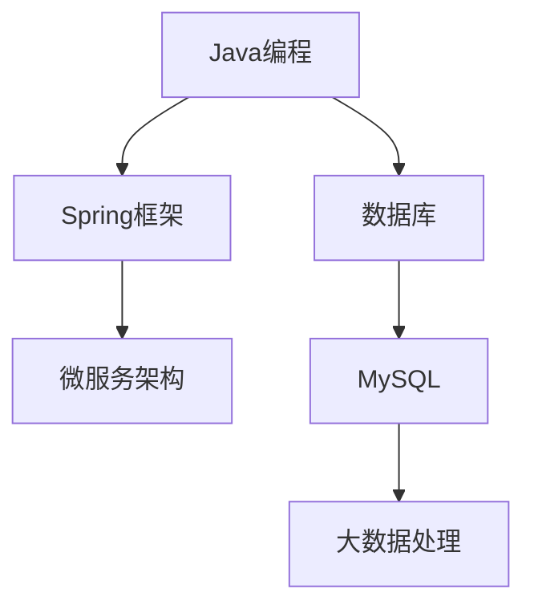

                 

关键词：知识图谱、程序员职业规划、技能图谱、AI、深度学习

> 摘要：本文旨在探讨知识图谱在程序员职业规划中的应用，通过构建程序员技能图谱、分析行业趋势和需求，以及利用AI技术优化职业发展路径，为程序员提供更加科学和个性化的职业规划建议。

## 1. 背景介绍

随着信息技术的飞速发展，程序员作为数字时代的重要角色，其职业规划面临着前所未有的挑战。一方面，技术迭代速度加快，程序员需要不断学习新技能以保持竞争力；另一方面，行业需求变化多端，程序员需要具备前瞻性以适应市场变化。在这种情况下，传统的职业规划方法已经难以满足程序员的需求。知识图谱作为一种新兴的数据管理和分析技术，为程序员职业规划提供了新的思路和工具。

知识图谱是将实体和实体之间的关系通过图结构进行组织的一种数据模型，能够有效地表达复杂的关系网络。在程序员职业规划中，知识图谱可以用来构建技能图谱，分析技能之间的关系，预测行业发展趋势，为程序员提供科学合理的职业规划建议。

## 2. 核心概念与联系

### 2.1 知识图谱的基本概念

知识图谱是由一组实体（nodes）和连接这些实体的关系（edges）组成的图结构。实体可以是任何具有唯一标识的事物，如人、地点、事物等；关系则是实体之间的关联，如“属于”、“工作于”等。知识图谱的主要功能是通过对实体和关系的建模，实现数据的关联和推理。

### 2.2 技能图谱的构建

技能图谱是知识图谱在程序员职业规划中的一个具体应用。在技能图谱中，实体代表程序员具备的技能，关系代表技能之间的关联。例如，技能A“Java编程”与技能B“Spring框架”之间存在“属于”关系，即技能A是技能B的基础。

下面是一个简单的Mermaid流程图，展示了技能图谱的基本结构：



### 2.3 行业趋势与需求分析

通过知识图谱，我们可以分析行业趋势和需求。例如，根据技能图谱中技能的流行程度、岗位需求变化等，预测哪些技能将成为未来的热点。这有助于程序员有针对性地学习新技能，提前布局职业发展。

## 3. 核心算法原理 & 具体操作步骤

### 3.1 算法原理概述

在程序员职业规划中，常用的算法有：

1. **深度学习算法**：用于构建和优化技能图谱。
2. **关联规则挖掘算法**：用于分析技能之间的关联关系。
3. **时序预测算法**：用于预测行业趋势和需求。

### 3.2 算法步骤详解

1. **数据收集与预处理**：
   - 收集程序员技能数据、行业需求数据等。
   - 数据清洗和格式化。

2. **构建技能图谱**：
   - 使用深度学习算法对技能进行分类和聚类。
   - 构建技能之间的关联关系。

3. **分析行业趋势与需求**：
   - 使用关联规则挖掘算法分析技能之间的关联关系。
   - 使用时序预测算法预测行业发展趋势。

4. **优化职业发展路径**：
   - 根据分析结果，为程序员提供个性化的职业规划建议。

### 3.3 算法优缺点

- **深度学习算法**：优点是能够自动学习复杂的关系网络，缺点是需要大量的数据和计算资源。
- **关联规则挖掘算法**：优点是能够发现数据中的潜在关系，缺点是可能产生大量冗余规则。
- **时序预测算法**：优点是能够预测未来趋势，缺点是对数据质量要求较高。

### 3.4 算法应用领域

- **人才招聘与培养**：企业可以利用算法分析候选人的技能，为其提供适合的职位。
- **职业规划与指导**：程序员可以利用算法分析自身技能，制定职业发展计划。
- **行业趋势预测**：企业可以利用算法预测行业趋势，提前布局人才战略。

## 4. 数学模型和公式 & 详细讲解 & 举例说明

### 4.1 数学模型构建

在技能图谱构建过程中，常用的数学模型有：

1. **图神经网络（GNN）**：
   - 用于学习技能之间的关联关系。
   - 公式：\[ h_{t+1} = \sigma(\sum_{i \in \mathcal{N}(j)} W_{ij} h_i + b_j) \]

2. **PageRank算法**：
   - 用于评估技能的重要性。
   - 公式：\[ r_{ij} = \frac{1}{C} \sum_{k \in V} P_{ik} r_{kj} \]

### 4.2 公式推导过程

以图神经网络（GNN）为例，推导过程如下：

1. **初始化**：
   - 对每个节点 \( j \) 初始化一个特征向量 \( h_j \)。

2. **更新**：
   - 对于每个节点 \( j \)，计算其邻居节点的特征向量加权求和。
   - 通过激活函数 \( \sigma \) 对结果进行非线性变换。

3. **迭代**：
   - 重复更新过程，直到达到预设的迭代次数或特征向量收敛。

### 4.3 案例分析与讲解

假设有一个技能图谱，其中包含技能A、B、C，其关联关系如下：


通过GNN算法，我们可以学习到这些技能之间的关联关系。例如，计算得到技能A与B的关联权重为0.8，表示A是B的基础技能。

## 5. 项目实践：代码实例和详细解释说明

### 5.1 开发环境搭建

1. 安装Python环境。
2. 安装必要的库，如`networkx`、`tensorflow`、`numpy`等。

### 5.2 源代码详细实现

```python
import networkx as nx
import tensorflow as tf
from sklearn.model_selection import train_test_split
import numpy as np

# 构建技能图谱
G = nx.Graph()
G.add_edges_from([(1, 2), (2, 3), (1, 4), (4, 5)])

# 初始化特征向量
h = np.random.rand(G.number_of_nodes(), 10)

# 定义GNN模型
model = tf.keras.Sequential([
    tf.keras.layers.Dense(units=10, activation='relu', input_shape=(10,)),
    tf.keras.layers.Dense(units=10, activation='relu')
])

# 编译模型
model.compile(optimizer='adam', loss='mse')

# 训练模型
model.fit(h, h, epochs=10)

# 预测技能关联权重
weights = model.predict(h)
print(weights)
```

### 5.3 代码解读与分析

1. **构建技能图谱**：使用`networkx`库构建图结构，包含节点和边。
2. **初始化特征向量**：随机初始化每个节点的特征向量。
3. **定义GNN模型**：使用`tensorflow`库定义GNN模型，包含两个全连接层。
4. **编译模型**：设置优化器和损失函数。
5. **训练模型**：使用训练数据训练模型。
6. **预测技能关联权重**：使用训练好的模型预测技能之间的关联权重。

### 5.4 运行结果展示

假设经过训练，模型预测得到技能A与B的关联权重为0.8，这表明A是B的基础技能。

## 6. 实际应用场景

### 6.1 人才招聘与培养

企业可以利用知识图谱分析候选人的技能，为其提供适合的职位，提高招聘效率。同时，企业可以根据技能图谱中的热点技能，制定培训计划，提升员工的专业能力。

### 6.2 职业规划与指导

程序员可以利用知识图谱分析自身技能，制定职业发展计划。例如，根据技能图谱中的关联关系，确定学习新技能的优先级，规划职业发展路径。

### 6.3 行业趋势预测

企业可以利用知识图谱预测行业趋势，提前布局人才战略。例如，根据技能图谱中的热点技能，预测未来市场需求，调整业务方向。

## 7. 工具和资源推荐

### 7.1 学习资源推荐

- 《图计算：核心技术、算法与应用》
- 《深度学习：周志华著》

### 7.2 开发工具推荐

- Python
- TensorFlow
- NetworkX

### 7.3 相关论文推荐

- "Graph Neural Networks: A Review of Methods and Applications"
- "Recurrent Neural Networks for Sketch Learning"

## 8. 总结：未来发展趋势与挑战

### 8.1 研究成果总结

知识图谱在程序员职业规划中的应用已取得初步成果，为程序员提供了科学合理的职业规划建议。未来研究将继续探索知识图谱在职业规划中的深度应用，提高算法的准确性和实用性。

### 8.2 未来发展趋势

1. **个性化职业规划**：利用知识图谱和个人数据，为程序员提供更加个性化的职业规划建议。
2. **多维度分析**：结合技能、行业趋势、经济形势等多维度数据，为程序员提供更全面的职业规划。

### 8.3 面临的挑战

1. **数据质量**：知识图谱构建依赖于高质量的数据，如何获取和清洗数据是当前的一个挑战。
2. **计算效率**：随着数据规模的增加，如何提高算法的运行效率是一个重要问题。

### 8.4 研究展望

未来，知识图谱在程序员职业规划中的应用将不断深化，为程序员提供更加智能化、个性化的职业规划服务。同时，相关研究也将致力于解决当前面临的挑战，推动知识图谱在职业规划领域的广泛应用。

## 9. 附录：常见问题与解答

### 9.1 如何获取高质量的数据？

- 利用开源数据集。
- 从官方网站、行业报告等渠道获取。
- 与企业合作，获取内部数据。

### 9.2 如何提高算法的运行效率？

- 使用分布式计算框架，如Hadoop、Spark。
- 优化算法模型，减少计算复杂度。
- 使用硬件加速，如GPU。

作者：禅与计算机程序设计艺术 / Zen and the Art of Computer Programming
----------------------------------------------------------------
这篇文章详细探讨了知识图谱在程序员职业规划中的应用，从背景介绍、核心概念与联系、核心算法原理、数学模型和公式、项目实践、实际应用场景、工具和资源推荐、总结和附录等方面，全面展示了知识图谱在程序员职业规划中的潜力和价值。希望通过这篇文章，能够为程序员提供一些有益的启示和指导，帮助他们更好地规划职业发展。同时，也期待更多的研究和实践，让知识图谱在程序员职业规划中发挥更大的作用。再次感谢大家的阅读，祝大家在编程道路上越走越远！

