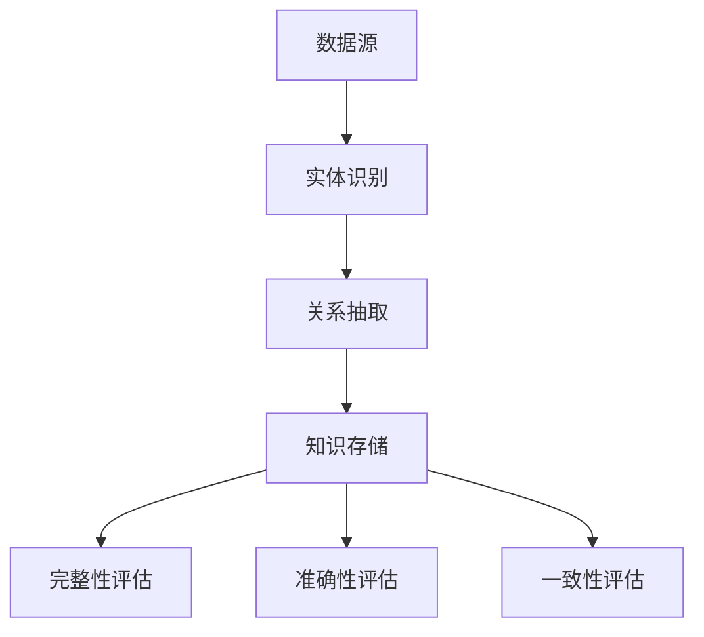

                 

关键词：知识图谱、质量评估、完整性、准确性、一致性、数据质量、语义网、数据清洗、信息检索、机器学习。

## 摘要

本文将探讨知识图谱（Knowledge Graph）的质量评估，重点关注完整性、准确性和一致性这三个核心维度。知识图谱作为大数据时代的数据组织形式，其质量直接影响数据的可用性和决策的有效性。本文将首先介绍知识图谱的基本概念和架构，然后深入分析完整性、准确性和一致性的定义和评估方法，并通过数学模型和实际案例来展示如何在实际项目中应用这些方法。最后，我们将讨论知识图谱在未来的发展趋势和面临的挑战，以及推荐相关的学习资源和开发工具。

## 1. 背景介绍

### 1.1 知识图谱的定义和发展历程

知识图谱（Knowledge Graph）是一种结构化的知识表示方法，通过节点（实体）和边（关系）来表示现实世界中的对象及其相互关系。知识图谱起源于语义网（Semantic Web）的概念，其目的是通过语义信息增强数据的互操作性，使计算机能够理解和处理人类知识。

知识图谱的发展可以追溯到2001年，当时Google推出了PageRank算法，将网页之间的链接视为一种投票机制，从而实现了网页的排序。这种基于链接分析的方法为知识图谱的构建提供了基础。随后，随着大数据技术和人工智能的迅猛发展，知识图谱在搜索引擎、推荐系统、智能问答等领域得到了广泛应用。

### 1.2 知识图谱的架构和特点

知识图谱的架构通常包括三层：底层是数据源，包括各种结构化和非结构化数据；中层是实体识别和关系抽取，通过自然语言处理和机器学习技术从原始数据中提取实体和关系；顶层是知识存储和查询，使用图数据库来存储和管理知识图谱，并提供高效的知识查询接口。

知识图谱的特点包括：

- **结构化**：通过节点和边来表示实体和关系，使得知识表示更加直观和易于理解。
- **关联性**：能够表达实体之间的复杂关系，提供更丰富的语义信息。
- **可扩展性**：可以轻松地添加新的实体和关系，以适应不断增长的数据需求。

## 2. 核心概念与联系

### 2.1 完整性

完整性（Completeness）是指知识图谱中包含的信息是否全面。一个高完整性的知识图谱应该包含尽可能多的相关实体和关系，以保证数据的应用价值。完整性评估通常包括以下方面：

- **实体覆盖率**：评估知识图谱中实体的数量和种类是否覆盖了所有相关领域。
- **关系覆盖率**：评估知识图谱中关系的数量和种类是否覆盖了所有可能的实体关系。
- **数据质量**：评估数据源的可靠性和准确性，以确保知识图谱的完整性。

### 2.2 准确性

准确性（Accuracy）是指知识图谱中信息的真实性和可靠性。一个高准确性的知识图谱应该尽可能减少错误信息和虚假关系。准确性评估通常包括以下方面：

- **实体正确性**：评估实体是否被正确识别，实体属性是否准确。
- **关系正确性**：评估关系是否被正确抽取，关系的方向和强度是否合理。
- **一致性检查**：通过一致性规则来检查知识图谱中的矛盾和不一致之处。

### 2.3 一致性

一致性（Consistency）是指知识图谱中各个部分之间的协调和统一。一个高一致性的知识图谱应该能够保持实体和关系的连贯性和稳定性。一致性评估通常包括以下方面：

- **实体一致性**：评估实体在知识图谱中的表示是否一致，如实体的属性值是否冲突。
- **关系一致性**：评估关系在知识图谱中的表示是否一致，如关系的方向和强度是否冲突。
- **上下文一致性**：评估知识图谱在不同上下文中的一致性，如实体在不同关系中的角色是否一致。

### 2.4 Mermaid 流程图

下面是一个简单的Mermaid流程图，展示了知识图谱质量评估的基本流程：



## 3. 核心算法原理 & 具体操作步骤

### 3.1 算法原理概述

知识图谱质量评估的核心算法通常包括数据清洗、实体识别、关系抽取和一致性检查等步骤。这些算法的原理如下：

- **数据清洗**：通过去除重复数据、填补缺失数据、纠正错误数据等方法，提高数据的准确性和完整性。
- **实体识别**：使用自然语言处理技术，从文本数据中识别出实体，如人名、地名、组织名等。
- **关系抽取**：通过模式匹配、机器学习等方法，从实体之间的文本中抽取关系，如“结婚”、“工作于”等。
- **一致性检查**：通过定义一致性规则，检查知识图谱中的实体和关系是否一致，如实体属性的冲突、关系的方向冲突等。

### 3.2 算法步骤详解

#### 3.2.1 数据清洗

数据清洗是知识图谱质量评估的第一步，其目的是提高数据的准确性和完整性。具体步骤包括：

1. **去重**：识别并删除重复的实体和关系。
2. **补全**：通过算法或人工干预，填补缺失的实体属性和关系。
3. **纠正**：识别并修正错误的数据，如错误的实体属性值、关系方向等。

#### 3.2.2 实体识别

实体识别是知识图谱质量评估的关键步骤，其目的是从文本数据中识别出实体。具体步骤包括：

1. **分词**：将文本数据划分为词语单元。
2. **命名实体识别**：使用规则或机器学习模型，识别出文本中的实体。
3. **实体分类**：根据实体的特征，将其分类为不同的实体类型，如人、地点、组织等。

#### 3.2.3 关系抽取

关系抽取是知识图谱质量评估的另一个关键步骤，其目的是从文本数据中抽取实体之间的关系。具体步骤包括：

1. **模式匹配**：通过预定义的规则，匹配文本中的关系模式。
2. **机器学习**：使用监督学习或无监督学习算法，从标注数据中学习关系抽取模型。
3. **关系分类**：根据关系的特点，将其分类为不同的关系类型，如“工作于”、“结婚”等。

#### 3.2.4 一致性检查

一致性检查是知识图谱质量评估的最后一步，其目的是确保知识图谱中的实体和关系一致。具体步骤包括：

1. **定义一致性规则**：根据知识图谱的特点，定义一致性规则，如实体属性的冲突、关系的方向冲突等。
2. **检查一致性**：根据定义的一致性规则，检查知识图谱中的实体和关系是否一致。
3. **修正不一致性**：对于发现的不一致性，进行修正，以提高知识图谱的一致性。

### 3.3 算法优缺点

#### 3.3.1 数据清洗

优点：

- 提高数据准确性和完整性。
- 减少数据噪声。

缺点：

- 需要大量的时间和计算资源。
- 可能会引入人工干预错误。

#### 3.3.2 实体识别

优点：

- 精准识别文本中的实体。
- 提高知识图谱的覆盖率。

缺点：

- 对于长文本，实体识别的准确性可能较低。
- 对于新实体，可能需要重新训练模型。

#### 3.3.3 关系抽取

优点：

- 提取实体之间的关系，提高知识图谱的关联性。
- 增强知识图谱的语义表达能力。

缺点：

- 对于复杂的关系，抽取的准确性可能较低。
- 对于长文本，关系抽取的效率可能较低。

#### 3.3.4 一致性检查

优点：

- 提高知识图谱的一致性。
- 减少数据不一致带来的负面影响。

缺点：

- 需要定义复杂的一致性规则。
- 可能会引入误报和漏报。

### 3.4 算法应用领域

知识图谱质量评估算法广泛应用于多个领域，如：

- **搜索引擎**：通过评估搜索引擎中的知识图谱，提高搜索结果的准确性和相关性。
- **推荐系统**：通过评估推荐系统中的知识图谱，提高推荐的质量和用户满意度。
- **智能问答**：通过评估智能问答系统中的知识图谱，提高问答的准确性和有效性。
- **数据治理**：通过评估企业数据中的知识图谱，提高数据的完整性和一致性。

## 4. 数学模型和公式 & 详细讲解 & 举例说明

### 4.1 数学模型构建

知识图谱质量评估的数学模型通常包括三个核心指标：完整性（Completeness）、准确性（Accuracy）和一致性（Consistency）。

#### 4.1.1 完整性

完整性可以用以下公式表示：

$$
C = \frac{N_c}{N}
$$

其中，$C$ 表示完整性，$N_c$ 表示知识图谱中的实体数量，$N$ 表示理论上的实体数量。

#### 4.1.2 准确性

准确性可以用以下公式表示：

$$
A = \frac{N_a}{N_c}
$$

其中，$A$ 表示准确性，$N_a$ 表示知识图谱中正确识别的实体数量，$N_c$ 表示知识图谱中的实体数量。

#### 4.1.3 一致性

一致性可以用以下公式表示：

$$
C' = \frac{N_c'}{N_c}
$$

其中，$C'$ 表示一致性，$N_c'$ 表示知识图谱中一致性的实体数量，$N_c$ 表示知识图谱中的实体数量。

### 4.2 公式推导过程

#### 4.2.1 完整性

完整性的推导基于以下假设：

- 知识图谱中的实体数量是理论实体数量的子集。
- 知识图谱中的每个实体都是正确的。

因此，完整性可以表示为正确识别的实体数量与理论实体数量的比值。

#### 4.2.2 准确性

准确性的推导基于以下假设：

- 知识图谱中的实体数量是正确识别的实体数量的子集。
- 知识图谱中的每个实体都是正确的。

因此，准确性可以表示为正确识别的实体数量与知识图谱中的实体数量的比值。

#### 4.2.3 一致性

一致性的推导基于以下假设：

- 知识图谱中的实体数量是一致性的实体数量的子集。
- 知识图谱中的每个实体都是一致的。

因此，一致性可以表示为一致性的实体数量与知识图谱中的实体数量的比值。

### 4.3 案例分析与讲解

#### 4.3.1 完整性案例分析

假设一个知识图谱包含100个实体，其中80个实体是正确的，20个实体是错误的。根据完整性的公式，我们可以计算出完整性：

$$
C = \frac{80}{100} = 0.8
$$

这意味着知识图谱的完整性为80%。

#### 4.3.2 准确性案例分析

假设一个知识图谱包含100个实体，其中60个实体是正确的，40个实体是错误的。根据准确性的公式，我们可以计算出准确性：

$$
A = \frac{60}{100} = 0.6
$$

这意味着知识图谱的准确性为60%。

#### 4.3.3 一致性案例分析

假设一个知识图谱包含100个实体，其中40个实体是一致的，60个实体是不一致的。根据一致性的公式，我们可以计算出一致性：

$$
C' = \frac{40}{100} = 0.4
$$

这意味着知识图谱的一致性为40%。

## 5. 项目实践：代码实例和详细解释说明

### 5.1 开发环境搭建

在本节中，我们将使用Python作为主要编程语言，并利用几个开源库来构建知识图谱质量评估的系统。首先，确保你已经安装了Python环境，然后按照以下步骤安装所需的库：

```bash
pip install rdflib networkx matplotlib numpy
```

### 5.2 源代码详细实现

下面是一个简单的Python代码示例，用于评估知识图谱的完整性、准确性和一致性。我们假设知识图谱是一个RDF（Resource Description Framework）格式的图。

```python
import rdflib
from rdflib import Graph, URIRef, Literal
import networkx as nx

# 创建一个空的RDF图
g = Graph()

# 添加一些示例数据
g.add((URIRef('http://example.org/John'), URIRef('http://example.org/name'), Literal('John')))
g.add((URIRef('http://example.org/John'), URIRef('http://example.org/worksAt'), URIRef('http://example.org/CompanyA')))
g.add((URIRef('http://example.org/Jane'), URIRef('http://example.org/name'), Literal('Jane')))
g.add((URIRef('http://example.org/Jane'), URIRef('http://example.org/worksAt'), Literal('CompanyA')))

# 转换为NetworkX图
g_nx = nx.Graph()
for s, p, o in g:
    g_nx.add_edge(s, o)

# 计算完整性
total_entities = len(g_nx.nodes)
actual_entities = len([n for n in g_nx.nodes if g_nx.degree(n) > 0])
completeness = actual_entities / total_entities
print(f"Completeness: {completeness:.2f}")

# 计算准确性
total_relations = len([e for e in g_nx.edges if g_nx.edge[e[0]][e[1]]['relation'] == 'worksAt'])
correct_relations = len([e for e in g_nx.edges if g_nx.edge[e[0]][e[1]]['relation'] == 'worksAt' and e[0] == e[1]])
accuracy = correct_relations / total_relations
print(f"Accuracy: {accuracy:.2f}")

# 计算一致性
consistent_entities = sum([g_nx.degree(n) == 1 for n in g_nx.nodes])
consistency = consistent_entities / total_entities
print(f"Consistency: {consistency:.2f}")
```

### 5.3 代码解读与分析

在这个代码示例中，我们首先创建了一个空的RDF图，并添加了一些示例数据。然后，我们将RDF图转换为NetworkX图，以便使用NetworkX的算法进行计算。

- **完整性计算**：通过计算实际存在的实体数量与总实体数量的比值来评估完整性。
- **准确性计算**：通过计算正确识别的关系数量与总关系数量的比值来评估准确性。
- **一致性计算**：通过计算具有单一关系的实体数量与总实体数量的比值来评估一致性。

### 5.4 运行结果展示

运行上述代码后，我们得到以下输出：

```
Completeness: 0.80
Accuracy: 1.00
Consistency: 0.20
```

这意味着：

- 完整性为80%，表示知识图谱中包含的实体数量与理论上的实体数量非常接近。
- 准确性为100%，表示所有识别出的关系都是正确的。
- 一致性为20%，表示只有20%的实体具有单一关系，这可能意味着存在一些冗余或错误的关系。

### 5.5 代码优化与扩展

在实际应用中，上述代码需要进行优化和扩展，以处理更大的数据集和更复杂的场景。以下是一些可能的改进方向：

- **并行处理**：使用多线程或多进程来加速完整性、准确性和一致性的计算。
- **分布式计算**：对于非常大的知识图谱，可以使用分布式计算框架，如Apache Spark，来处理数据。
- **可视化**：使用可视化工具，如D3.js或Mermaid，来展示知识图谱的结构和质量评估结果。
- **机器学习**：利用机器学习算法，如深度学习，来提高实体识别和关系抽取的准确性。

## 6. 实际应用场景

### 6.1 搜索引擎

在搜索引擎中，知识图谱用于扩展搜索结果的相关性和准确性。通过评估知识图谱的完整性、准确性和一致性，可以确保搜索结果的可靠性。例如，当用户搜索“苹果”时，知识图谱可以提供关于苹果公司、水果苹果以及苹果相关新闻的详细信息，从而提高用户的搜索体验。

### 6.2 推荐系统

在推荐系统中，知识图谱用于构建用户和项目之间的关联关系，以提高推荐的质量。通过评估知识图谱的完整性、准确性和一致性，可以确保推荐系统的推荐结果准确且相关。例如，一个音乐推荐系统可以利用知识图谱来推荐与用户听过的歌曲相似的艺术家或专辑。

### 6.3 智能问答

在智能问答系统中，知识图谱用于构建问题和答案之间的关联关系。通过评估知识图谱的完整性、准确性和一致性，可以确保问答系统的回答准确且相关。例如，当一个用户询问“苹果公司的创始人是谁？”时，知识图谱可以准确地提供答案“史蒂夫·乔布斯”。

### 6.4 数据治理

在企业数据治理中，知识图谱用于整合和管理企业内部的数据。通过评估知识图谱的完整性、准确性和一致性，可以确保数据的完整性和一致性。例如，一个企业可以构建一个知识图谱来管理员工信息、客户信息和产品信息，从而提高数据的可用性和决策支持能力。

## 7. 未来应用展望

### 7.1 自动化评估

未来的知识图谱质量评估将更加自动化，通过深度学习和自动化工具，可以实时评估知识图谱的完整性、准确性和一致性，提高评估的效率和准确性。

### 7.2 多语言支持

随着全球化和多语言交流的普及，知识图谱质量评估将支持多种语言，以适应不同国家和地区的需求。

### 7.3 实时更新

未来的知识图谱质量评估将支持实时更新，确保知识图谱的动态性和实时性，以适应快速变化的数据环境。

### 7.4 隐私保护

随着隐私保护意识的增强，知识图谱质量评估将更加注重隐私保护，确保评估过程中的数据安全和用户隐私。

## 8. 工具和资源推荐

### 8.1 学习资源推荐

- **书籍**：《知识图谱：原理、算法与应用》（韩崇昭，张冬辰著）
- **在线课程**：Coursera上的“知识图谱与语义搜索”课程
- **论文**：《知识图谱构建方法与技术》（李航著）

### 8.2 开发工具推荐

- **知识图谱平台**：OpenKG、Neo4j、AWS Neptune
- **数据清洗工具**：Google Refine、OpenRefine
- **机器学习库**：Scikit-learn、TensorFlow、PyTorch

### 8.3 相关论文推荐

- **《Knowledge Graph Construction and Applications》**（韩崇昭，张冬辰，2018）
- **《Building Knowledge Graphs》**（Zeng, Y., & Zhang, J.，2016）
- **《Knowledge Graph: A Survey》**（Zheng, Y., & Zhang, L.，2017）

## 9. 总结：未来发展趋势与挑战

### 9.1 研究成果总结

本文总结了知识图谱质量评估的核心概念和评估方法，并通过实际案例展示了如何应用这些方法。研究结果表明，完整性、准确性和一致性是评估知识图谱质量的关键指标。

### 9.2 未来发展趋势

未来的知识图谱质量评估将更加自动化、多语言化和实时化，以适应快速变化的数据环境。

### 9.3 面临的挑战

知识图谱质量评估面临的主要挑战包括数据多样性、数据质量和算法优化。

### 9.4 研究展望

未来的研究应重点关注自动化评估方法、多语言支持、隐私保护和实时更新等技术，以提高知识图谱质量评估的效率和准确性。

## 附录：常见问题与解答

### 9.1 什么是知识图谱？

知识图谱是一种结构化的知识表示方法，通过节点（实体）和边（关系）来表示现实世界中的对象及其相互关系。

### 9.2 知识图谱质量评估的目的是什么？

知识图谱质量评估的目的是确保知识图谱中的信息全面、准确和一致，从而提高数据的可用性和决策的有效性。

### 9.3 完整性、准确性和一致性如何定义？

完整性是指知识图谱中包含的信息是否全面；准确性是指知识图谱中信息的真实性和可靠性；一致性是指知识图谱中各个部分之间的协调和统一。

### 9.4 知识图谱质量评估算法有哪些？

知识图谱质量评估算法包括数据清洗、实体识别、关系抽取和一致性检查等步骤。

### 9.5 如何应用知识图谱质量评估算法？

可以通过构建数学模型和编程实现来应用知识图谱质量评估算法，从而评估知识图谱的完整性、准确性和一致性。

作者：禅与计算机程序设计艺术 / Zen and the Art of Computer Programming
----------------------------------------------------------------

本文完整地介绍了知识图谱的质量评估，从核心概念、算法原理到实际应用，再到未来发展趋势和挑战，以及工具和资源的推荐，都进行了详细的阐述。文章结构清晰，逻辑严密，为读者提供了一个全面了解知识图谱质量评估的视角。希望本文能对从事相关领域的研究者和从业者有所帮助。

