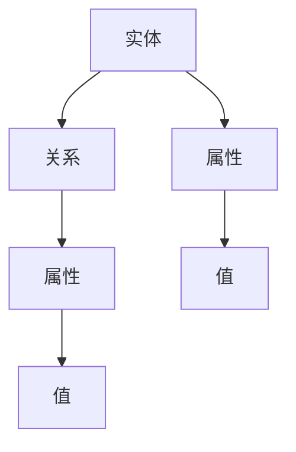
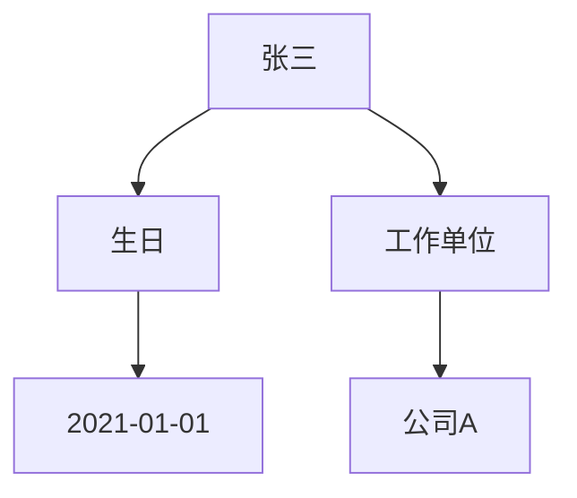

                 

关键词：知识图谱、语义网络、人工智能、数据挖掘、知识表示、本体论、神经网络、大数据分析

> 摘要：知识图谱作为人工智能领域的一项关键技术，正日益成为构建智能系统的数字地图。本文将深入探讨知识图谱的背景、核心概念、构建方法、算法原理、数学模型、实际应用，以及未来发展的趋势和挑战。

## 1. 背景介绍

随着互联网和信息技术的快速发展，人类进入了一个数据爆炸的时代。大量非结构化数据、半结构化数据以及结构化数据如潮水般涌入，传统的关系数据库和简单的搜索引擎难以满足复杂查询和分析的需求。知识图谱作为一种新型数据结构，通过将实体与实体之间的关系以图谱的形式表示出来，为人工智能系统提供了强大的语义理解和知识表示能力。

知识图谱最早由Google在2012年提出，作为一种用于表示实体及其相互关系的数据模型，逐渐在学术界和工业界得到广泛应用。知识图谱不仅能够帮助计算机更好地理解世界，还为各种应用场景提供了丰富的语义信息支持，如搜索引擎、推荐系统、自然语言处理、智能问答等。

## 2. 核心概念与联系

### 2.1 实体 Entity

实体是知识图谱中的基本构成元素，可以是人、地点、组织、事物等。实体具有唯一标识和属性，例如，“张三”是一个实体，他的属性包括年龄、职业、所在城市等。

### 2.2 关系 Relation

关系是实体之间的联系，如“居住在”、“担任”等。关系具有一定的方向性和属性，例如，“张三居住在北京市”表示实体“张三”与实体“北京市”之间的一种居住关系。

### 2.3 属性 Attribute

属性是实体的具体特征，如“张三”的年龄、身高、生日等。属性可以用于描述实体的状态或行为。

### 2.4 Mermaid 流程图



## 3. 核心算法原理 & 具体操作步骤

### 3.1 算法原理概述

知识图谱的构建主要涉及两个过程：知识抽取和知识融合。

- 知识抽取：从非结构化或半结构化数据中提取实体和关系。常见的方法包括命名实体识别、关系抽取、属性抽取等。
- 知识融合：将来自不同源的知识进行整合，消除冲突、冗余，并增强知识的表达力和一致性。

### 3.2 算法步骤详解

#### 3.2.1 知识抽取

1. 数据预处理：清洗和规范化数据，提取实体和关系。
2. 命名实体识别：使用自然语言处理技术识别文本中的实体。
3. 关系抽取：利用规则、机器学习或深度学习方法识别实体之间的关系。
4. 属性抽取：提取实体的属性信息。

#### 3.2.2 知识融合

1. 数据集成：将来自不同数据源的知识进行整合。
2. 冲突检测与消解：检测和解决知识之间的不一致和冲突。
3. 知识建模：将融合后的知识以图谱的形式进行表示。

### 3.3 算法优缺点

#### 优点

- **高表达力**：能够表达复杂的关系和属性，支持复杂查询。
- **高效性**：支持快速检索和推理，提高数据处理效率。
- **通用性**：适用于各种领域和场景，具有广泛的应用前景。

#### 缺点

- **数据质量要求高**：知识抽取和融合过程对数据质量要求较高，需要大量标注数据和专业知识。
- **计算复杂度高**：知识图谱的构建和推理过程可能涉及大量计算，对硬件资源要求较高。

### 3.4 算法应用领域

知识图谱在多个领域都有广泛的应用，包括：

- **搜索引擎**：通过知识图谱实现更加精准的搜索和推荐。
- **推荐系统**：利用知识图谱挖掘用户兴趣和偏好，提供个性化推荐。
- **自然语言处理**：支持语义理解、问答系统和机器翻译等。
- **金融风控**：通过知识图谱识别潜在的欺诈行为和信用风险。
- **智慧城市**：支持城市管理和公共服务的智能化。

## 4. 数学模型和公式

知识图谱的构建和应用涉及多种数学模型和公式，以下介绍其中两个重要的模型：

### 4.1 数学模型构建

知识图谱的数学模型通常包括：

1. **实体表示**：使用向量空间模型表示实体，如词向量、图嵌入等。
2. **关系表示**：使用实体间的相似度、距离等度量关系。
3. **属性表示**：使用统计模型、机器学习等方法提取和表示属性。

### 4.2 公式推导过程

假设有两个实体 A 和 B，其向量表示分别为 \(\vec{e}_A\) 和 \(\vec{e}_B\)，关系 r 的向量表示为 \(\vec{r}\)，则实体 A 和 B 之间的关系 r 可以通过以下公式计算：

$$
sim(r) = \frac{\vec{e}_A \cdot \vec{e}_B}{\|\vec{e}_A\| \|\vec{e}_B\|}
$$

其中，\(\cdot\) 表示向量点积，\(\|\cdot\|\) 表示向量模长。

### 4.3 案例分析与讲解

以一个简单的知识图谱为例，假设有两个实体：张三和张三的生日。张三的向量表示为 \(\vec{e}_Z\)，张三的生日的向量表示为 \(\vec{e}_{B-Day}\)，则它们之间的关系可以通过上述公式计算：

$$
sim(B-Day) = \frac{\vec{e}_Z \cdot \vec{e}_{B-Day}}{\|\vec{e}_Z\| \|\vec{e}_{B-Day}\|}
$$

通过计算，我们可以得到张三和他的生日之间的相似度，从而支持进一步的推理和查询。

## 5. 项目实践：代码实例和详细解释说明

在本节中，我们将通过一个简单的知识图谱构建项目，介绍如何使用Python和相关库来构建和操作知识图谱。

### 5.1 开发环境搭建

1. 安装Python 3.x版本。
2. 安装知识图谱库，如`rdflib`和`networkx`。

```bash
pip install rdflib networkx
```

### 5.2 源代码详细实现

以下是一个简单的知识图谱构建示例：

```python
from rdflib import Graph, URIRef, Literal
from networkx import Graph as NXGraph
import networkx as nx

# 创建一个RDF图
g = Graph()

# 添加实体和关系
g.add((URIRef('http://example.org/#ZhangSan'), URIRef('http://example.org/hasBirthday'), Literal('2021-01-01')))
g.add((URIRef('http://example.org/#ZhangSan'), URIRef('http://example.org/worksAt'), URIRef('http://example.org/CompanyA')))

# 将RDF图转换为网络图
nxg = nx.from_pandas_adjacency(g.pandas_dataframe().fillna(0).astype(int), create_using=nx.Graph())

# 打印网络图
nx.draw(nxg, with_labels=True)
```

### 5.3 代码解读与分析

1. **创建RDF图**：使用`rdflib`库创建一个RDF图，RDF（Resource Description Framework）是一种用于表示Web资源之间关系的语言。
2. **添加实体和关系**：通过`add()`方法向图中添加实体和关系。
3. **RDF图转网络图**：使用`networkx`库将RDF图转换为网络图，以便进行可视化和进一步分析。
4. **打印网络图**：使用`nx.draw()`方法绘制网络图。

### 5.4 运行结果展示

运行上述代码后，我们将在屏幕上看到一个简单的知识图谱网络图，其中包含了两个实体和它们之间的关系。



## 6. 实际应用场景

知识图谱作为一种强大的数据结构，已经在多个领域取得了显著的应用成果：

- **搜索引擎**：通过知识图谱实现基于语义的搜索，提高搜索结果的准确性和相关性。
- **推荐系统**：利用知识图谱挖掘用户和物品之间的潜在关系，提供个性化的推荐。
- **智能问答**：通过知识图谱支持自然语言处理和语义理解，实现智能问答系统。
- **金融风控**：利用知识图谱识别潜在的欺诈行为和信用风险。
- **智慧城市**：支持城市管理和公共服务的智能化，提高城市运行效率。

## 7. 工具和资源推荐

为了更好地学习和实践知识图谱，以下是一些推荐的学习资源和开发工具：

### 7.1 学习资源推荐

- **《知识图谱：核心技术与应用》**：详细介绍知识图谱的构建方法和技术细节。
- **《图论及其应用》**：介绍图论的基本概念和知识，有助于理解知识图谱。
- **在线课程**：例如，Coursera、edX上的知识图谱相关课程。

### 7.2 开发工具推荐

- **RDFLib**：Python库，用于创建和操作RDF图。
- **NetworkX**：Python库，用于创建和操作网络图。
- **Neo4j**：图形数据库，支持知识图谱的存储和查询。

### 7.3 相关论文推荐

- **《Knowledge Graph Embedding》**：介绍知识图谱嵌入的方法。
- **《The Graph Database Handbook》**：详细介绍图数据库的应用和实现。
- **《Entity Resolution and Knowledge Graph Construction》**：探讨实体识别和知识图谱构建技术。

## 8. 总结：未来发展趋势与挑战

知识图谱作为人工智能领域的一项关键技术，具有广阔的应用前景。未来，随着大数据、云计算、物联网等技术的发展，知识图谱的应用将更加广泛和深入。

### 8.1 研究成果总结

- 知识图谱在搜索引擎、推荐系统、自然语言处理等领域取得了显著的应用成果。
- 知识图谱的构建方法和技术不断优化，支持更大规模和更复杂的应用场景。
- 知识图谱的语义理解和推理能力得到提升，为人工智能系统提供了更加丰富的语义信息。

### 8.2 未来发展趋势

- **跨领域知识融合**：随着知识图谱应用的广泛，跨领域知识融合将成为重要研究方向。
- **实时知识更新**：实现知识图谱的实时更新和动态调整，提高知识图谱的时效性和准确性。
- **深度学习与知识图谱融合**：将深度学习与知识图谱相结合，实现更加智能和高效的语义理解和推理。

### 8.3 面临的挑战

- **数据质量**：知识图谱构建对数据质量要求较高，需要解决数据不一致、冗余和噪声等问题。
- **计算复杂度**：知识图谱的构建和推理过程涉及大量计算，对硬件资源要求较高。
- **知识表示与推理**：如何更好地表示和推理知识，提高知识图谱的语义理解和推理能力，是未来研究的重点。

### 8.4 研究展望

知识图谱作为人工智能领域的一项关键技术，未来将在更多领域发挥重要作用。随着技术的不断进步，知识图谱的应用将更加广泛和深入，为人类智慧的数字地图构建提供更强有力的支持。

## 9. 附录：常见问题与解答

### 9.1 什么是知识图谱？

知识图谱是一种用于表示实体及其相互关系的数据模型，通过图结构的形式将实体、关系和属性等信息组织起来，为人工智能系统提供了强大的语义理解和知识表示能力。

### 9.2 知识图谱与语义网络的区别是什么？

知识图谱和语义网络都是用于表示实体及其关系的模型，但知识图谱通常具有更复杂的结构，能够表示实体间的多种复杂关系，并支持大规模数据的存储和查询。

### 9.3 知识图谱的构建方法有哪些？

知识图谱的构建方法主要包括知识抽取和知识融合。知识抽取方法包括命名实体识别、关系抽取和属性抽取等，知识融合方法包括数据集成、冲突检测与消解和知识建模等。

### 9.4 知识图谱在哪些领域有应用？

知识图谱在多个领域有广泛的应用，包括搜索引擎、推荐系统、自然语言处理、金融风控、智慧城市等。

### 9.5 知识图谱的未来发展趋势是什么？

未来知识图谱的发展趋势包括跨领域知识融合、实时知识更新、深度学习与知识图谱融合等。

# 作者：禅与计算机程序设计艺术 / Zen and the Art of Computer Programming

通过本文的探讨，我们不仅深入了解了知识图谱的核心概念、构建方法、算法原理和数学模型，还通过项目实践展示了知识图谱的实际应用。知识图谱作为一种构建人类智慧的数字地图，将在未来发挥越来越重要的作用，为人工智能的发展提供强有力的支持。希望本文能为您在知识图谱领域的研究和应用提供有价值的参考和启示。

