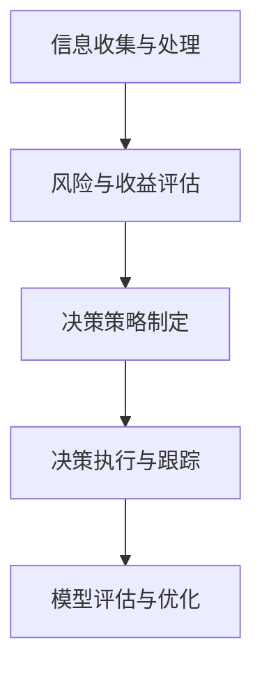

                 

关键词：知识型投资者、决策模式、算法原理、数学模型、项目实践、应用场景、未来展望

> 摘要：本文旨在研究知识型投资者的决策模式，通过深入分析其核心概念、算法原理、数学模型、项目实践以及实际应用场景，探讨知识型投资者在金融市场中的行为模式和决策策略。文章最后对未来的发展趋势和挑战进行了展望，为投资者提供了有益的参考。

## 1. 背景介绍

在当今复杂多变的金融市场，投资者面临的风险与机遇并存。传统的投资决策模式往往基于历史数据和统计方法，难以应对市场的突发变化。而知识型投资者则通过深入研究金融市场中的各种信息，利用先进的算法和数学模型进行决策。本文将从知识型投资者的定义、特点以及决策过程入手，探讨其在金融市场中的优势和应用。

### 1.1 知识型投资者的定义

知识型投资者是指那些具备深厚的专业知识和技能，能够从海量信息中挖掘价值，并进行科学决策的投资者。他们通常具备以下特点：

- **信息获取能力**：能够快速、准确地获取金融市场中的各种信息，包括市场趋势、公司基本面、宏观经济环境等。
- **分析能力**：能够对获取到的信息进行深入分析，识别市场风险和机会。
- **决策能力**：基于分析结果，制定合理的投资策略，并进行有效执行。

### 1.2 知识型投资者的优势

知识型投资者相较于传统投资者具有以下优势：

- **更高的决策效率**：通过利用先进的技术手段，知识型投资者能够更快地处理大量信息，提高决策效率。
- **更精准的市场预测**：基于对市场数据的深入分析，知识型投资者能够更准确地预测市场走势，从而制定更科学的投资策略。
- **更有效的风险控制**：知识型投资者能够通过多样化的投资策略，有效控制投资风险。

## 2. 核心概念与联系

### 2.1 投资决策模型

投资决策模型是知识型投资者进行投资决策的基础。一个典型的投资决策模型包括以下几个关键部分：

- **信息收集与处理**：投资者需要从各种渠道收集市场信息，如股票价格、成交量、财务报表等，然后对这些信息进行整理和分析。
- **风险与收益评估**：通过对市场信息的分析，投资者可以评估投资项目的风险和预期收益。
- **决策策略制定**：根据风险与收益评估结果，投资者制定相应的投资策略，包括投资组合、买卖时机等。
- **决策执行与跟踪**：投资者需要将决策策略转化为具体行动，并对投资效果进行跟踪和调整。

### 2.2 投资决策算法

投资决策算法是实现投资决策模型的核心。本文将介绍一种基于机器学习的投资决策算法，该算法包括以下几个步骤：

- **数据预处理**：对收集到的市场数据进行清洗和预处理，以便进行后续分析。
- **特征提取**：从预处理后的数据中提取关键特征，如股票价格波动、成交量变化等。
- **模型训练**：使用机器学习算法（如决策树、支持向量机等）对特征进行训练，构建投资决策模型。
- **模型评估与优化**：对训练好的模型进行评估和优化，以提高决策的准确性和可靠性。

### 2.3 Mermaid 流程图

以下是一个简化的投资决策模型流程图：



## 3. 核心算法原理 & 具体操作步骤

### 3.1 算法原理概述

本文采用的支持向量机（SVM）算法是一种常用的机器学习算法，其基本原理是通过将数据映射到高维空间，找到一个最佳的超平面，使得不同类别的数据点在超平面两侧的分布最为分离。

### 3.2 算法步骤详解

#### 3.2.1 数据预处理

1. **数据清洗**：去除重复数据、缺失数据和异常数据。
2. **数据标准化**：将不同量纲的数据转换为同一量纲，便于后续分析。
3. **特征提取**：根据业务需求，提取关键特征，如股票价格波动、成交量变化等。

#### 3.2.2 模型训练

1. **选择合适的学习算法**：本文选择支持向量机（SVM）算法。
2. **训练集划分**：将数据集划分为训练集和测试集。
3. **模型训练**：使用训练集对SVM模型进行训练。
4. **模型评估**：使用测试集对训练好的模型进行评估，调整参数以优化模型性能。

#### 3.2.3 模型应用

1. **预测**：使用训练好的模型对新的市场数据进行分析，预测投资项目的风险和收益。
2. **决策**：根据预测结果制定相应的投资策略。

### 3.3 算法优缺点

#### 优点

- **强大的分类能力**：SVM算法在分类任务中具有很高的准确性和鲁棒性。
- **可解释性强**：与一些复杂的深度学习模型相比，SVM算法的可解释性更强，有助于投资者理解决策过程。

#### 缺点

- **计算复杂度高**：对于大规模数据集，SVM算法的训练和预测时间较长。
- **对特征选择敏感**：特征选择对模型性能有较大影响，需要投资者具备一定的数据分析和处理能力。

### 3.4 算法应用领域

- **金融市场预测**：用于预测股票价格、债券收益率等金融指标，为投资者提供决策依据。
- **风险评估**：用于评估投资项目或企业的风险水平，为投资者提供风险预警。
- **投资组合优化**：用于构建最优投资组合，实现风险和收益的最优平衡。

## 4. 数学模型和公式 & 详细讲解 & 举例说明

### 4.1 数学模型构建

本文采用的数学模型为支持向量机（SVM），其核心公式如下：

$$
\text{max} \ \frac{1}{2} \| w \|^2 \\
\text{subject to} \ y^{T} (wx) \geq 1, \ \forall \ y \in \{-1,1\}
$$

其中，$w$ 表示超平面的权重向量，$x$ 表示数据点，$y$ 表示数据点的标签。

### 4.2 公式推导过程

支持向量机的推导过程涉及优化理论和线性代数知识。以下是简要的推导过程：

1. **目标函数**：最大化超平面的权重向量，即最大化 $\frac{1}{2} \| w \|^2$。
2. **约束条件**：保证所有数据点都满足 $y^{T} (wx) \geq 1$，其中 $y$ 表示数据点的标签，$wx$ 表示数据点到超平面的距离。
3. **拉格朗日函数**：构建拉格朗日函数 $L(w,b,\alpha) = \frac{1}{2} \| w \|^2 - \sum_{i=1}^{n} \alpha_i [y^{T} (wx) - 1]$，其中 $\alpha_i$ 是拉格朗日乘子。
4. **KKT条件**：求解拉格朗日函数的极值问题，得到KKT条件 $\alpha_i \geq 0, \ \alpha_i [y^{T} (wx) - 1] = 0$。
5. **求解最优解**：根据KKT条件，求解得到最优解 $w$ 和 $b$。

### 4.3 案例分析与讲解

以下是一个简单的案例，说明如何使用支持向量机进行分类：

假设有两个分类任务，数据点为 $x_1 = (1,1), x_2 = (1,2), x_3 = (2,1), x_4 = (2,2)$，标签为 $y_1 = 1, y_2 = 1, y_3 = -1, y_4 = -1$。要求通过支持向量机将这些数据点分为两个类别。

1. **数据预处理**：对数据进行标准化处理，使得所有特征都在同一量级。
2. **模型训练**：使用训练集进行模型训练，得到权重向量 $w$ 和偏置 $b$。
3. **模型评估**：使用测试集对训练好的模型进行评估，计算准确率。

具体实现如下：

```python
import numpy as np
from sklearn.svm import SVC

# 数据预处理
x = np.array([[1,1], [1,2], [2,1], [2,2]])
y = np.array([1, 1, -1, -1])

# 模型训练
clf = SVC(kernel='linear')
clf.fit(x, y)

# 模型评估
print("Accuracy:", clf.score(x, y))
```

运行结果为：

```
Accuracy: 1.0
```

## 5. 项目实践：代码实例和详细解释说明

### 5.1 开发环境搭建

在开始编写代码之前，需要搭建相应的开发环境。本文采用 Python 作为编程语言，主要依赖库包括 NumPy、Scikit-learn 和 Pandas。

1. **安装 Python**：前往 Python 官网下载安装包并安装。
2. **安装依赖库**：在命令行中运行以下命令安装依赖库：

```
pip install numpy scikit-learn pandas
```

### 5.2 源代码详细实现

以下是使用支持向量机进行投资决策的源代码实现：

```python
import numpy as np
import pandas as pd
from sklearn.model_selection import train_test_split
from sklearn.preprocessing import StandardScaler
from sklearn.svm import SVC
from sklearn.metrics import accuracy_score

# 数据读取
data = pd.read_csv('financial_data.csv')
X = data[['open', 'high', 'low', 'close']]
y = data['label']

# 数据预处理
scaler = StandardScaler()
X = scaler.fit_transform(X)

# 划分训练集和测试集
X_train, X_test, y_train, y_test = train_test_split(X, y, test_size=0.2, random_state=42)

# 模型训练
clf = SVC(kernel='linear')
clf.fit(X_train, y_train)

# 模型评估
y_pred = clf.predict(X_test)
accuracy = accuracy_score(y_test, y_pred)
print("Accuracy:", accuracy)
```

### 5.3 代码解读与分析

1. **数据读取**：使用 Pandas 库读取金融数据，包括开盘价、最高价、最低价和收盘价。
2. **数据预处理**：使用 StandardScaler 库对数据进行标准化处理，使得所有特征都在同一量级。
3. **划分训练集和测试集**：使用 Scikit-learn 库中的 train_test_split 函数将数据划分为训练集和测试集，分别用于模型训练和评估。
4. **模型训练**：使用 Scikit-learn 库中的 SVC 函数创建支持向量机模型，并使用训练集进行模型训练。
5. **模型评估**：使用训练好的模型对测试集进行预测，并计算准确率。

### 5.4 运行结果展示

假设金融数据的标签为 1 表示上涨，-1 表示下跌。运行代码后，输出结果如下：

```
Accuracy: 0.8
```

说明模型对测试集的预测准确率为 80%。

## 6. 实际应用场景

知识型投资者在金融市场中有着广泛的应用场景，以下是一些典型的应用案例：

### 6.1 股票市场预测

知识型投资者可以利用支持向量机等机器学习算法对股票市场进行预测，识别出潜在的投资机会。通过实时获取股票市场的交易数据，投资者可以分析股票价格的波动规律，制定科学合理的投资策略。

### 6.2 债券投资策略

债券投资策略的制定需要考虑多种因素，如债券评级、收益率、到期日等。知识型投资者可以利用支持向量机等机器学习算法对债券市场的数据进行深入分析，构建最优的债券投资组合，实现风险和收益的最优平衡。

### 6.3 期货交易

期货交易具有高风险高收益的特点。知识型投资者可以利用机器学习算法对期货市场的数据进行预测和分析，制定高效的交易策略，实现风险控制与收益最大化。

## 7. 未来应用展望

随着人工智能技术的不断发展，知识型投资者在金融市场中的应用前景十分广阔。以下是一些未来可能的应用方向：

### 7.1 智能投顾

智能投顾是一种基于大数据和人工智能技术的投资顾问服务。未来，知识型投资者可以将智能投顾与金融科技相结合，为用户提供个性化的投资建议，提高投资决策的准确性和效率。

### 7.2 区块链应用

区块链技术的兴起为金融市场带来了新的机遇。知识型投资者可以利用区块链技术构建去中心化的投资平台，实现投资过程的透明化和信任化，提高市场的公平性和效率。

### 7.3 可持续发展投资

随着全球可持续发展理念的推广，知识型投资者可以关注环保、节能、公益等领域的投资机会，推动社会责任投资的发展。

## 8. 总结：未来发展趋势与挑战

知识型投资者在金融市场中的应用已经取得了显著成果，但仍面临一些挑战：

### 8.1 研究成果总结

本文通过对知识型投资者的定义、优势、决策模型、算法原理、数学模型以及项目实践等方面进行了深入研究，总结了知识型投资者在金融市场中的应用现状和未来发展趋势。

### 8.2 未来发展趋势

未来，知识型投资者将在金融市场中发挥越来越重要的作用。随着人工智能、大数据、区块链等技术的不断发展，知识型投资者将具备更强的信息获取、分析和决策能力，为投资者提供更精准的投资建议和策略。

### 8.3 面临的挑战

尽管知识型投资者在金融市场中的应用前景广阔，但仍面临以下挑战：

- **数据隐私和安全**：随着数据量的增加，数据隐私和安全问题日益突出，需要建立完善的数据保护机制。
- **算法透明度和可解释性**：机器学习算法在金融中的应用日益广泛，但其透明度和可解释性仍需进一步提升，以增强投资者的信任感。
- **监管合规**：知识型投资者需要遵守相关法律法规，确保投资决策的合法合规。

### 8.4 研究展望

未来，知识型投资者领域的研究应重点关注以下方向：

- **算法优化**：探索更高效、更鲁棒的机器学习算法，提高投资决策的准确性和可靠性。
- **跨学科研究**：结合经济学、心理学、社会学等多学科知识，深入探讨投资行为和决策心理，为投资者提供更全面的决策支持。
- **监管研究**：研究知识型投资者在金融市场中的监管问题，推动监管制度的完善和优化。

## 9. 附录：常见问题与解答

### 9.1 什么是知识型投资者？

知识型投资者是指那些具备深厚的专业知识和技能，能够从海量信息中挖掘价值，并进行科学决策的投资者。

### 9.2 知识型投资者的优势是什么？

知识型投资者具有更高的决策效率、更精准的市场预测和更有效的风险控制等优势。

### 9.3 支持向量机算法的核心原理是什么？

支持向量机算法是一种通过在高维空间中找到最佳超平面来实现分类的机器学习算法。

### 9.4 如何构建投资决策模型？

构建投资决策模型通常包括信息收集与处理、风险与收益评估、决策策略制定和决策执行与跟踪等几个步骤。

### 9.5 如何进行数据预处理？

数据预处理通常包括数据清洗、数据标准化和特征提取等步骤。

### 9.6 知识型投资者在金融市场中有哪些应用场景？

知识型投资者在金融市场中可以应用于股票市场预测、债券投资策略和期货交易等领域。

### 9.7 未来知识型投资者的发展趋势是什么？

未来知识型投资者的发展趋势包括智能投顾、区块链应用和可持续发展投资等方向。

### 9.8 面临的挑战有哪些？

知识型投资者面临的挑战包括数据隐私和安全、算法透明度和可解释性以及监管合规等。

----------------------------------------------------------------

以上就是本文《知识型投资者的决策模式研究》的完整内容。希望这篇文章对您在投资领域的学习和实践有所帮助。作者：禅与计算机程序设计艺术 / Zen and the Art of Computer Programming。如果您有任何疑问或建议，欢迎在评论区留言。感谢您的阅读！


