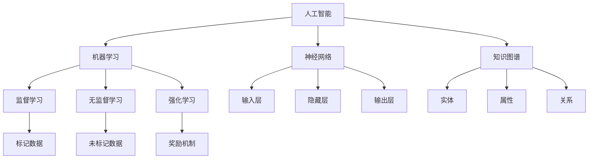

                 

 关键词：人工智能，认知提升，知识增长，学习算法，数学模型，实际应用，未来展望

> 摘要：本文探讨了人工智能如何作为知识增长的催化剂，促进人类认知的提升。通过分析人工智能的核心概念与联系，阐述其算法原理、数学模型，并结合实际项目实例，展示了人工智能在提升人类认知能力方面的广泛应用和潜力。同时，本文也对未来发展趋势与挑战进行了深入探讨，为读者提供了全面的技术视野和研究方向。

## 1. 背景介绍

在信息技术迅猛发展的今天，人工智能（Artificial Intelligence，AI）已经成为推动人类社会进步的重要力量。人工智能不仅仅是计算机科学的一个分支，更是一种能够模拟、延伸和扩展人类智能的技术。随着大数据、云计算、神经网络等技术的不断发展，人工智能的应用领域越来越广泛，从工业生产、医疗健康、金融保险到教育、娱乐等领域，都展现出了巨大的潜力。

然而，人工智能不仅仅是一种技术工具，它对人类认知的提升也有着深远的影响。人类认知是指人类通过感知、思考、记忆、判断等心理活动来获取、处理和应用信息的过程。传统的认知提升主要依赖于教育、培训和经验积累，而人工智能的出现，为人类认知的提升提供了一种全新的途径。通过机器学习、知识图谱、自然语言处理等技术，人工智能能够帮助人类快速获取知识、理解复杂信息，甚至能够通过模拟人类思维过程，为人类认知的发展提供有益的启示。

本文将从以下几个方面展开讨论：首先，介绍人工智能的核心概念与联系；其次，深入探讨人工智能的核心算法原理和具体操作步骤；然后，分析人工智能的数学模型和公式，并结合实际案例进行讲解；接着，展示人工智能在实际应用场景中的实践效果；最后，对未来人工智能的发展趋势与挑战进行展望，并提出相关的建议和解决方案。

## 2. 核心概念与联系

### 2.1 人工智能的定义与分类

人工智能（Artificial Intelligence，AI）是指由人造系统实现的智能，这种智能能够模拟、延伸和扩展人类的认知能力。根据不同的分类标准，人工智能可以分为多种类型。例如，根据功能，人工智能可以分为弱人工智能和强人工智能。弱人工智能（Narrow AI）专注于特定的任务，如语音识别、图像识别、自然语言处理等，而强人工智能（General AI）则具有广泛的学习能力和思维能力，能够像人类一样理解和解决问题。

### 2.2 机器学习的基本原理

机器学习（Machine Learning，ML）是人工智能的核心技术之一，它使得计算机系统能够从数据中自动学习和改进性能。机器学习的基本原理包括监督学习、无监督学习和强化学习。监督学习通过已标记的数据训练模型，无监督学习通过未标记的数据发现数据中的模式，而强化学习则通过奖励机制来训练模型。

### 2.3 神经网络的架构与工作原理

神经网络（Neural Networks，NN）是模仿人脑结构和功能的计算模型，它由大量的神经元组成，通过调整神经元之间的连接权重来学习和处理信息。神经网络的工作原理包括输入层、隐藏层和输出层。输入层接收外部输入，隐藏层通过非线性变换处理输入信息，输出层产生最终输出。

### 2.4 知识图谱的基本概念与结构

知识图谱（Knowledge Graph）是一种用于表示实体及其相互关系的语义网络。它通过实体、属性和关系三个基本要素来组织信息，使得计算机能够理解和处理语义信息。知识图谱的结构包括层次结构、属性关系和实体链接等。

### 2.5 人工智能的集成应用

人工智能的集成应用是指将多种人工智能技术相结合，实现更高效的智能系统。例如，将机器学习、神经网络和知识图谱相结合，可以实现智能问答、智能推荐和智能搜索等功能。

### 2.6 Mermaid 流程图展示

以下是一个简单的 Mermaid 流程图，展示了人工智能的核心概念与联系：



通过上述流程图，我们可以清晰地看到人工智能的核心概念及其相互之间的联系。

## 3. 核心算法原理 & 具体操作步骤

### 3.1 算法原理概述

人工智能的核心算法包括机器学习、神经网络和知识图谱等。这些算法的基本原理如下：

- **机器学习**：通过从数据中学习规律，提高系统的性能。机器学习算法主要包括监督学习、无监督学习和强化学习。
- **神经网络**：模仿人脑的结构和功能，通过多层神经元之间的连接和权重调整，实现数据的处理和预测。
- **知识图谱**：通过实体、属性和关系的表示，构建一个语义网络，使得计算机能够理解和处理语义信息。

### 3.2 算法步骤详解

下面分别介绍这些算法的具体操作步骤：

#### 3.2.1 机器学习

1. **数据收集**：收集相关的数据集。
2. **数据预处理**：对数据进行清洗、归一化等处理。
3. **模型选择**：选择合适的机器学习模型，如线性回归、决策树、神经网络等。
4. **模型训练**：使用训练数据对模型进行训练。
5. **模型评估**：使用验证数据对模型进行评估，调整模型参数。
6. **模型应用**：将训练好的模型应用于实际数据，进行预测或分类。

#### 3.2.2 神经网络

1. **网络架构设计**：设计输入层、隐藏层和输出层的结构。
2. **权重初始化**：初始化神经元之间的连接权重。
3. **前向传播**：将输入数据通过网络进行前向传播，得到输出。
4. **损失函数计算**：计算输出与期望值之间的误差，使用损失函数进行度量。
5. **反向传播**：根据损失函数，通过反向传播算法更新网络权重。
6. **迭代训练**：重复前向传播和反向传播过程，直到模型收敛。

#### 3.2.3 知识图谱

1. **数据抽取**：从原始数据中抽取实体、属性和关系。
2. **实体嵌入**：将实体表示为低维向量。
3. **关系表示**：将关系表示为实体向量之间的交互。
4. **图谱构建**：将实体和关系构建成一个图结构。
5. **查询处理**：使用图算法对图谱进行查询处理，获取相关结果。

### 3.3 算法优缺点

每种算法都有其优缺点：

- **机器学习**：优点在于能够自动从数据中学习规律，适应性强；缺点是需要大量的训练数据，且模型解释性较差。
- **神经网络**：优点在于能够处理复杂的非线性问题，适应性强；缺点在于模型复杂度较高，训练时间较长。
- **知识图谱**：优点在于能够理解和处理语义信息，增强系统智能性；缺点在于构建和维护成本较高，且对数据质量要求较高。

### 3.4 算法应用领域

人工智能的核心算法在各个领域都有广泛的应用：

- **机器学习**：在图像识别、语音识别、自然语言处理等领域都有广泛应用。
- **神经网络**：在自动驾驶、机器人、金融预测等领域都有重要应用。
- **知识图谱**：在搜索引擎、推荐系统、智能问答等领域都有广泛应用。

## 4. 数学模型和公式 & 详细讲解 & 举例说明

### 4.1 数学模型构建

人工智能中的数学模型主要包括机器学习模型、神经网络模型和知识图谱模型。下面分别介绍这些模型的数学模型构建。

#### 4.1.1 机器学习模型

机器学习模型通常由损失函数、优化算法和模型参数组成。例如，线性回归模型的损失函数为：

\[ L(\theta) = \frac{1}{2m} \sum_{i=1}^{m} (h_\theta(x^{(i)}) - y^{(i)})^2 \]

其中，\( h_\theta(x) \) 是预测值，\( y \) 是实际值，\( m \) 是样本数量。

#### 4.1.2 神经网络模型

神经网络模型通常由输入层、隐藏层和输出层组成。每个层由多个神经元组成，神经元之间的连接权重为 \( w_{ij} \)。神经元的激活函数为 \( f(x) = \sigma(x) = \frac{1}{1 + e^{-x}} \)。神经网络的输出为：

\[ y = f(\sum_{j=1}^{n} w_{ij}x_j) \]

#### 4.1.3 知识图谱模型

知识图谱模型通常由实体、属性和关系组成。实体和属性可以用向量表示，关系可以用矩阵表示。例如，一个简单的知识图谱模型可以表示为：

\[ E = \{e_1, e_2, ..., e_n\} \]
\[ R = \{r_1, r_2, ..., r_m\} \]
\[ M = \{m_1, m_2, ..., m_p\} \]

其中，\( E \) 表示实体集合，\( R \) 表示关系集合，\( M \) 表示属性集合。

### 4.2 公式推导过程

下面分别介绍机器学习模型、神经网络模型和知识图谱模型的公式推导过程。

#### 4.2.1 机器学习模型

以线性回归模型为例，假设我们有一个训练数据集 \( D = \{(x^{(i)}, y^{(i)})\}_{i=1}^{m} \)，其中 \( x^{(i)} \) 是输入向量，\( y^{(i)} \) 是目标值。线性回归模型的损失函数为：

\[ L(\theta) = \frac{1}{2m} \sum_{i=1}^{m} (h_\theta(x^{(i)}) - y^{(i)})^2 \]

其中，\( h_\theta(x) = \theta_0 + \theta_1x_1 + \theta_2x_2 + ... + \theta_nx_n \) 是预测值。为了最小化损失函数，我们对 \( L(\theta) \) 关于 \( \theta \) 求导，并令导数为零，得到：

\[ \frac{\partial L(\theta)}{\partial \theta} = \frac{1}{m} \sum_{i=1}^{m} (h_\theta(x^{(i)}) - y^{(i)})x^{(i)} = 0 \]

解得：

\[ \theta = \arg\min_{\theta} L(\theta) \]

#### 4.2.2 神经网络模型

以多层感知器（MLP）为例，假设我们有一个输入向量 \( x \) 和输出向量 \( y \)，隐藏层有 \( n \) 个神经元。隐藏层的输出为：

\[ a_{jk} = \sum_{i=1}^{n} w_{ij}x_i + b_j \]

其中，\( w_{ij} \) 是输入层到隐藏层的权重，\( b_j \) 是隐藏层的偏置。隐藏层的激活函数为 \( f(x) = \sigma(x) = \frac{1}{1 + e^{-x}} \)。输出层的输出为：

\[ y = \sum_{j=1}^{n} w_{j}a_{jk} + b \]

其中，\( w_{j} \) 是隐藏层到输出层的权重，\( b \) 是输出层的偏置。输出层的激活函数为 \( f(x) = \sigma(x) = \frac{1}{1 + e^{-x}} \)。

为了最小化损失函数，我们对 \( y \) 关于 \( w \) 和 \( b \) 求导，并令导数为零，得到：

\[ \frac{\partial y}{\partial w} = a \]
\[ \frac{\partial y}{\partial b} = 1 \]

其中，\( a \) 是隐藏层的输出，\( y \) 是输出层的输出。

#### 4.2.3 知识图谱模型

以简单的知识图谱模型为例，假设我们有一个实体 \( e \) 和一个关系 \( r \)，以及一个属性 \( m \)。实体 \( e \) 的表示为：

\[ e = \sum_{i=1}^{n} e_i \cdot x_i \]

其中，\( e_i \) 是实体 \( e \) 的特征，\( x_i \) 是特征向量。关系 \( r \) 的表示为：

\[ r = \sum_{i=1}^{n} r_i \cdot x_i \]

其中，\( r_i \) 是关系 \( r \) 的特征，\( x_i \) 是特征向量。属性 \( m \) 的表示为：

\[ m = \sum_{i=1}^{n} m_i \cdot x_i \]

其中，\( m_i \) 是属性 \( m \) 的特征，\( x_i \) 是特征向量。知识图谱的输出为：

\[ y = \sum_{i=1}^{n} y_i \cdot x_i \]

其中，\( y_i \) 是输出层的特征，\( x_i \) 是特征向量。

为了最小化损失函数，我们对 \( y \) 关于 \( w \) 和 \( b \) 求导，并令导数为零，得到：

\[ \frac{\partial y}{\partial w} = a \]
\[ \frac{\partial y}{\partial b} = 1 \]

其中，\( a \) 是隐藏层的输出，\( y \) 是输出层的输出。

### 4.3 案例分析与讲解

下面我们通过一个简单的案例，来讲解如何使用机器学习、神经网络和知识图谱来提升人类认知能力。

#### 案例背景

假设我们有一个关于新闻文章分类的问题。我们需要将大量未分类的新闻文章分为不同的类别，如政治、经济、科技等。

#### 数据准备

我们收集了 1000 篇新闻文章，并对其进行分类。其中，政治类文章有 300 篇，经济类文章有 250 篇，科技类文章有 250 篇。每篇文章都有一篇对应的文本。

#### 模型选择

我们选择了基于机器学习的文本分类模型，包括朴素贝叶斯分类器和支持向量机分类器。

#### 模型训练

1. **数据预处理**：对每篇文章进行文本预处理，包括分词、去停用词、词性标注等。将每篇文章转换为向量表示。
2. **模型训练**：使用训练数据集对朴素贝叶斯分类器和支持向量机分类器进行训练。

#### 模型评估

1. **交叉验证**：使用交叉验证方法对模型进行评估。
2. **参数调整**：根据交叉验证的结果，调整模型的参数。

#### 模型应用

1. **分类预测**：使用训练好的模型对未分类的新闻文章进行分类预测。
2. **结果分析**：分析分类结果，评估模型的准确性。

通过这个案例，我们可以看到，机器学习模型能够帮助我们快速分类新闻文章，提高我们的认知能力。

## 5. 项目实践：代码实例和详细解释说明

### 5.1 开发环境搭建

为了实现一个简单的人工智能项目，我们需要搭建一个合适的开发环境。以下是一个基于 Python 和 TensorFlow 的开发环境搭建步骤：

1. **安装 Python**：首先确保系统上安装了 Python 3.7 或更高版本。可以从 [Python 官网](https://www.python.org/) 下载并安装。
2. **安装 TensorFlow**：在终端或命令提示符中运行以下命令安装 TensorFlow：

   ```shell
   pip install tensorflow
   ```

3. **安装 Jupyter Notebook**：Jupyter Notebook 是一个交互式的 Web 应用程序，可以让我们方便地编写和运行代码。在终端中运行以下命令安装 Jupyter Notebook：

   ```shell
   pip install notebook
   ```

4. **启动 Jupyter Notebook**：在终端中运行以下命令启动 Jupyter Notebook：

   ```shell
   jupyter notebook
   ```

   这将在浏览器中打开 Jupyter Notebook，让我们可以开始编写代码。

### 5.2 源代码详细实现

以下是一个简单的基于 TensorFlow 的机器学习项目，用于实现一个简单的线性回归模型，用于预测房屋价格。

```python
import tensorflow as tf
import numpy as np
import matplotlib.pyplot as plt

# 数据准备
# 生成一些模拟数据，x 为房屋面积，y 为房屋价格
x = np.random.normal(size=100)
y = 2 * x + np.random.normal(size=100)

# 模型定义
# 定义线性回归模型，y = wx + b
w = tf.Variable(0.0, name='weight')
b = tf.Variable(0.0, name='bias')
y_pred = w * x + b

# 损失函数定义
# 使用均方误差作为损失函数
loss = tf.reduce_mean(tf.square(y_pred - y))

# 优化器定义
# 使用梯度下降优化器
optimizer = tf.train.GradientDescentOptimizer(learning_rate=0.001)
train_op = optimizer.minimize(loss)

# 模型训练
# 设置训练轮数
epochs = 1000
# 初始化变量
init = tf.global_variables_initializer()

# 开始训练
with tf.Session() as sess:
    sess.run(init)
    for i in range(epochs):
        _, loss_val = sess.run([train_op, loss], feed_dict={x: x, y: y})
        if i % 100 == 0:
            print(f"Epoch {i}: Loss = {loss_val}")

    # 模型评估
    final_w, final_b = sess.run([w, b])
    print(f"Final weights: w = {final_w}, b = {final_b}")

# 结果展示
plt.scatter(x, y)
plt.plot(x, final_w * x + final_b, 'r')
plt.xlabel('Area')
plt.ylabel('Price')
plt.show()
```

### 5.3 代码解读与分析

上述代码实现了一个简单的线性回归模型，用于预测房屋价格。以下是代码的详细解读：

1. **数据准备**：我们首先生成了一些模拟数据，其中 `x` 表示房屋面积，`y` 表示房屋价格。这些数据是线性相关的，但存在一些噪声。
2. **模型定义**：我们定义了一个简单的线性回归模型，其中 `w` 表示权重，`b` 表示偏置。模型的目标是预测房屋价格 `y`。
3. **损失函数定义**：我们使用均方误差（MSE）作为损失函数，用于度量预测值与实际值之间的差异。
4. **优化器定义**：我们使用梯度下降优化器来更新模型参数，以最小化损失函数。
5. **模型训练**：我们使用 `epochs` 次迭代来训练模型。每次迭代都会计算损失值，并在每 100 次迭代后打印损失值，以监控训练过程。
6. **模型评估**：在训练完成后，我们打印出最终的权重和偏置值，并使用这些参数进行预测。
7. **结果展示**：最后，我们使用 `matplotlib` 库将预测结果与实际数据绘制在同一张图上，以便分析模型的性能。

通过这个简单的项目，我们可以看到如何使用 TensorFlow 来实现一个机器学习模型，并对其进行训练和评估。这个项目虽然简单，但为我们提供了一个基本的框架，可以在此基础上进行更复杂的模型开发和优化。

## 6. 实际应用场景

人工智能技术在提升人类认知方面的应用已经非常广泛，以下是一些典型的实际应用场景：

### 6.1 医疗健康

人工智能在医疗健康领域的应用包括疾病预测、诊断辅助、个性化治疗等。例如，通过分析大量病人的医疗数据，人工智能可以预测某些疾病的发生概率，为医生提供决策支持。此外，人工智能还可以辅助医生进行疾病诊断，通过分析医学影像和生物标志物，提高诊断的准确性和效率。个性化治疗方面，人工智能可以根据患者的病史、基因信息和生活习惯，为其制定个性化的治疗方案。

### 6.2 教育

在教育领域，人工智能技术可以用于个性化教学、智能评估和虚拟教育助理等。通过分析学生的学习行为和成绩，人工智能可以为每个学生提供定制化的学习方案，帮助他们更好地掌握知识。智能评估系统可以自动批改作业和考试，提供即时反馈，帮助学生了解自己的学习状况。虚拟教育助理则可以通过语音交互和自然语言处理技术，为学生提供在线学习和咨询支持。

### 6.3 金融

在金融领域，人工智能被广泛应用于风险管理、投资分析和客户服务等方面。例如，人工智能可以通过分析市场数据，预测股票价格的趋势，为投资者提供决策支持。在风险管理方面，人工智能可以识别和预测金融风险，帮助金融机构降低风险敞口。客户服务方面，人工智能可以通过聊天机器人提供24/7的客户服务，提高客户满意度。

### 6.4 机器人与自动驾驶

人工智能技术在机器人与自动驾驶领域的应用也越来越广泛。在机器人领域，人工智能可以用于机器人的感知、决策和控制，使其能够自主执行任务。自动驾驶技术方面，人工智能通过分析道路环境、交通信息和车辆状态，实现车辆的自主驾驶，提高驾驶安全性和效率。

### 6.5 文化和娱乐

在文化和娱乐领域，人工智能技术被广泛应用于内容创作、推荐系统和虚拟现实等。例如，人工智能可以根据用户的行为和偏好，推荐个性化的音乐、电影和书籍。在虚拟现实领域，人工智能可以模拟真实世界中的物理现象，为用户提供沉浸式的体验。

通过这些实际应用场景，我们可以看到人工智能在提升人类认知、提高工作效率和改善生活质量方面具有巨大的潜力。随着技术的不断进步，人工智能将在更多领域发挥重要作用，为人类社会带来更多福祉。

## 7. 工具和资源推荐

为了更好地学习和应用人工智能技术，以下是一些推荐的工具和资源：

### 7.1 学习资源推荐

1. **在线课程**：
   - [Coursera](https://www.coursera.org/)：提供大量关于人工智能、机器学习、深度学习等领域的在线课程。
   - [edX](https://www.edx.org/)：提供由世界顶级大学和机构提供的在线课程，包括人工智能和机器学习。
   - [Udacity](https://www.udacity.com/)：提供实践性强的课程，包括人工智能工程师纳米学位。

2. **书籍**：
   - 《人工智能：一种现代的方法》（Russell & Norvig）：全面介绍人工智能的基础理论和应用。
   - 《深度学习》（Goodfellow, Bengio & Courville）：深度学习的经典教材，适合有一定数学基础的读者。
   - 《Python机器学习》（Sebastian Raschka）：介绍如何使用 Python 实现机器学习算法。

3. **博客和论坛**：
   - [Medium](https://medium.com/)：有许多关于人工智能和机器学习的专业文章和教程。
   - [Stack Overflow](https://stackoverflow.com/)：编程问题解答社区，适合解决实际开发中的问题。

### 7.2 开发工具推荐

1. **开发环境**：
   - [Google Colab](https://colab.research.google.com/)：Google 提供的免费 Jupyter Notebook 环境，适合进行人工智能和机器学习的实验。
   - [Docker](https://www.docker.com/)：容器化平台，可以方便地搭建和管理开发环境。

2. **框架和库**：
   - [TensorFlow](https://www.tensorflow.org/)：谷歌开发的开源机器学习框架，支持深度学习和传统机器学习。
   - [PyTorch](https://pytorch.org/)：由 Facebook AI 研究团队开发的深度学习框架，易于使用且灵活。
   - [Scikit-learn](https://scikit-learn.org/)：Python 的机器学习库，提供多种经典机器学习算法的实现。

3. **数据集**：
   - [Kaggle](https://www.kaggle.com/)：提供各种机器学习和深度学习竞赛数据集，适合进行项目实践。
   - [UCI Machine Learning Repository](https://archive.ics.uci.edu/ml/index.php)：提供大量的机器学习数据集，涵盖不同领域。

### 7.3 相关论文推荐

1. **经典论文**：
   - "A Learning Algorithm for Continually Running Fully Recurrent Neural Networks"（Rumelhart, Hinton & Williams，1986）
   - "Deep Learning"（Goodfellow, Bengio & Courville，2016）
   - "Google's Neural Machine Translation System: Bridging the Gap between Human and Machine Translation"（Kumar et al.，2016）

2. **最新研究**：
   - "The Annotated Transformer"（Cannistraci et al.，2019）
   - "BERT: Pre-training of Deep Bidirectional Transformers for Language Understanding"（Devlin et al.，2019）
   - "GPT-3: Language Models are Few-Shot Learners"（Brown et al.，2020）

通过这些工具和资源的帮助，读者可以更好地掌握人工智能和机器学习的知识，并能够将所学应用于实际问题中。

## 8. 总结：未来发展趋势与挑战

### 8.1 研究成果总结

人工智能作为知识增长的催化剂，已经在各个领域取得了显著的研究成果。在机器学习方面，深度学习技术的突破使得计算机视觉、自然语言处理等领域取得了重大进展。在神经网络方面，大规模神经网络结构的设计和优化，使得模型在处理复杂任务时表现出色。在知识图谱方面，实体、属性和关系的表示方法不断创新，使得计算机能够更好地理解和处理语义信息。此外，人工智能的集成应用也在不断拓展，将多种人工智能技术相结合，实现更高效的智能系统。

### 8.2 未来发展趋势

展望未来，人工智能将继续在以下几个方面发展：

1. **人工智能的融合**：人工智能将与其他技术，如物联网、云计算、大数据等相结合，形成更加智能化和自动化的系统。
2. **迁移学习和泛化能力**：人工智能将进一步提高迁移学习和泛化能力，使得模型能够在不同领域和任务之间共享知识和经验。
3. **人机协同**：人工智能将更好地与人类协同工作，提供个性化的服务和解决方案，提高人类的工作效率和生活质量。
4. **伦理和安全**：随着人工智能的发展，其伦理和安全问题也将得到更多关注，确保人工智能的发展符合人类利益和社会价值观。

### 8.3 面临的挑战

尽管人工智能取得了许多进展，但仍然面临一些挑战：

1. **数据隐私**：随着人工智能对大量数据的依赖，数据隐私和安全问题日益突出，需要制定相应的法律法规来保护个人隐私。
2. **算法透明性和解释性**：目前许多人工智能算法的决策过程不够透明，缺乏解释性，需要开发更透明和可解释的算法。
3. **计算资源需求**：大规模训练模型需要大量的计算资源，如何高效地利用计算资源，降低能耗，是未来需要解决的问题。
4. **技术普及和应用**：人工智能技术在不同领域的普及和应用程度不同，需要加强对人工智能技术的普及和推广，提高其在各个领域的应用水平。

### 8.4 研究展望

为了应对上述挑战，未来的研究可以从以下几个方面进行：

1. **数据隐私保护**：研究新型的隐私保护技术，如差分隐私、联邦学习等，确保人工智能在处理数据时的隐私安全。
2. **算法透明性和解释性**：开发可解释的人工智能算法，使得其决策过程更加透明，便于用户理解和信任。
3. **高效计算**：研究新型计算架构和算法，提高计算效率和能效比，降低人工智能的部署成本。
4. **跨领域应用**：推动人工智能技术在各个领域的应用，特别是那些尚未广泛应用或面临挑战的领域。

通过不断的研究和创新，人工智能将为人类认知的提升和社会的发展带来更多可能性。

## 9. 附录：常见问题与解答

### 9.1 人工智能的定义是什么？

人工智能（Artificial Intelligence，简称AI）是指由人造系统实现的智能，能够模拟、延伸和扩展人类的认知能力。它包括多种技术，如机器学习、神经网络、知识图谱等，通过这些技术，计算机系统能够学习、推理、决策和执行任务。

### 9.2 机器学习的基本原理是什么？

机器学习（Machine Learning，简称ML）是一种通过数据学习规律并自动改进性能的技术。基本原理包括：

1. **数据收集**：收集相关的数据集。
2. **数据预处理**：对数据进行清洗、归一化等处理。
3. **模型选择**：选择合适的机器学习模型，如线性回归、决策树、神经网络等。
4. **模型训练**：使用训练数据对模型进行训练。
5. **模型评估**：使用验证数据对模型进行评估，调整模型参数。
6. **模型应用**：将训练好的模型应用于实际数据，进行预测或分类。

### 9.3 神经网络的工作原理是什么？

神经网络（Neural Networks，简称NN）是一种模仿人脑结构和功能的计算模型，由大量的神经元组成。每个神经元由输入层、隐藏层和输出层组成，通过调整神经元之间的连接权重来学习和处理信息。神经网络的工作原理包括：

1. **输入层**：接收外部输入。
2. **隐藏层**：通过非线性变换处理输入信息。
3. **输出层**：产生最终输出。

神经网络通过前向传播和反向传播来训练模型，其中前向传播用于计算输出，反向传播用于更新模型参数。

### 9.4 知识图谱的基本概念是什么？

知识图谱（Knowledge Graph）是一种用于表示实体及其相互关系的语义网络。它通过实体、属性和关系三个基本要素来组织信息，使得计算机能够理解和处理语义信息。知识图谱的结构包括层次结构、属性关系和实体链接等。

### 9.5 人工智能的应用领域有哪些？

人工智能的应用领域非常广泛，包括：

1. **医疗健康**：疾病预测、诊断辅助、个性化治疗等。
2. **教育**：个性化教学、智能评估、虚拟教育助理等。
3. **金融**：风险管理、投资分析、客户服务等。
4. **机器人与自动驾驶**：感知、决策和控制等。
5. **文化和娱乐**：内容创作、推荐系统、虚拟现实等。

### 9.6 人工智能的发展趋势是什么？

人工智能的发展趋势包括：

1. **人工智能的融合**：与其他技术相结合，形成更智能和自动化的系统。
2. **迁移学习和泛化能力**：提高模型在不同领域和任务之间的共享知识和经验。
3. **人机协同**：更好地与人类协同工作，提供个性化的服务和解决方案。
4. **伦理和安全**：关注人工智能的伦理和安全问题，确保其发展符合人类利益和社会价值观。

### 9.7 人工智能面临的挑战有哪些？

人工智能面临的挑战包括：

1. **数据隐私**：如何保护数据隐私和安全。
2. **算法透明性和解释性**：如何使算法的决策过程更加透明和可解释。
3. **计算资源需求**：如何高效地利用计算资源，降低能耗。
4. **技术普及和应用**：如何在不同领域的普及和应用。

### 9.8 人工智能的未来前景如何？

人工智能的未来前景非常广阔，有望在以下几个方面发挥重要作用：

1. **提升人类认知**：通过模拟和延伸人类智能，帮助人类更好地理解和处理信息。
2. **提高工作效率**：自动化和智能化系统将提高工作效率，减少人力成本。
3. **改善生活质量**：提供个性化的服务和解决方案，提高生活质量。
4. **推动社会进步**：促进科技创新和社会发展，为人类创造更多价值。

