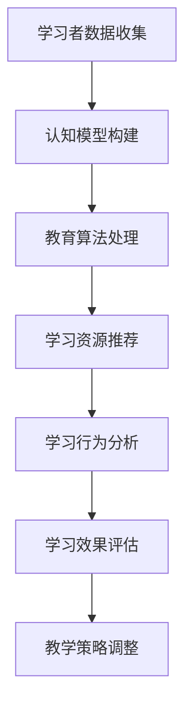

                 

关键词：个性化教育、智能学习、教育技术、认知建模、教育算法

> 摘要：随着教育技术的快速发展，智能教育成为了教育领域的热点。个性化教育作为智能教育的重要组成部分，正逐步改变着传统教育模式。本文从认知建模、教育算法、技术实现等多个角度，深入探讨了知识个性化在适应学习者需求中的重要作用。

## 1. 背景介绍

在信息时代，知识更新速度加快，学习者的需求日益多样化。传统的一刀切教育模式已无法满足个体化的学习需求。个性化教育应运而生，它强调根据学习者的兴趣、能力、学习风格等特征，为其提供量身定制的学习资源和教学方法。

智能教育作为信息化教育的一种形式，利用大数据、人工智能等技术手段，对学习者的行为数据进行分析，从而实现教学内容的个性化调整。个性化教育正是智能教育的重要应用之一，它通过构建学习者模型、设计适应性的教学算法，为学习者提供更加精准、高效的学习体验。

## 2. 核心概念与联系

### 2.1 认知建模

认知建模是指通过建立学习者的认知模型，来描述学习者的知识结构、学习习惯、认知能力等特征。认知建模是个性化教育的基础，它为智能教育系统提供了对学习者进行个性化分析的重要依据。

#### 2.1.1 认知模型的构建

认知模型的构建主要包括以下几个方面：

- **知识结构**：描述学习者已经掌握的知识点及其相互关系。
- **学习习惯**：包括学习者的学习时间、频率、偏好等。
- **认知能力**：评估学习者的理解能力、记忆能力、应用能力等。

#### 2.1.2 认知模型的应用

认知模型的应用主要体现在以下几个方面：

- **学习路径规划**：根据学习者的知识结构和认知能力，为其规划最优的学习路径。
- **学习资源推荐**：根据学习者的兴趣和学习习惯，推荐适合的学习资源。
- **学习效果评估**：通过分析学习者的学习行为数据，评估学习效果，调整教学策略。

### 2.2 教育算法

教育算法是指利用人工智能技术，对学习者的行为数据进行分析和处理，从而为学习者提供个性化教学服务的算法。教育算法是实现个性化教育的关键技术。

#### 2.2.1 教育算法的分类

教育算法主要包括以下几类：

- **推荐算法**：根据学习者的兴趣和学习历史，推荐适合的学习资源。
- **评估算法**：通过分析学习者的学习行为，评估学习效果，提供反馈。
- **路径规划算法**：根据学习者的知识结构和认知能力，规划最佳学习路径。

#### 2.2.2 教育算法的应用

教育算法的应用主要体现在以下几个方面：

- **个性化学习推荐**：根据学习者的兴趣和需求，推荐适合的学习资源。
- **学习行为分析**：通过分析学习者的学习行为，为教师提供教学改进的建议。
- **学习效果预测**：根据学习者的学习数据，预测其学习效果，提前进行干预。

### 2.3 Mermaid 流程图

以下是一个简单的 Mermaid 流程图，展示了认知建模和教育算法在个性化教育中的应用流程：



## 3. 核心算法原理 & 具体操作步骤

### 3.1 算法原理概述

个性化教育的核心算法主要包括推荐算法和评估算法。推荐算法主要解决“推荐什么”的问题，而评估算法主要解决“推荐是否合适”的问题。

#### 3.1.1 推荐算法

推荐算法的核心是通过对学习者的行为数据进行分析，预测其可能感兴趣的学习资源。常见的推荐算法有基于内容的推荐、基于协同过滤的推荐和基于模型的推荐等。

- **基于内容的推荐**：根据学习资源的内容特征，为学习者推荐相似的学习资源。
- **基于协同过滤的推荐**：根据学习者的行为数据，找到与其相似的其他学习者，推荐这些学习者喜欢的学习资源。
- **基于模型的推荐**：利用机器学习算法，建立学习者和学习资源之间的关联模型，预测学习者可能感兴趣的学习资源。

#### 3.1.2 评估算法

评估算法主要通过对学习者的学习行为进行分析，评估学习资源的合适性。常见的评估算法有学习效果评估和满意度评估等。

- **学习效果评估**：通过分析学习者的学习行为数据，评估其学习效果。
- **满意度评估**：通过问卷调查或用户反馈，评估学习者对学习资源的满意度。

### 3.2 算法步骤详解

#### 3.2.1 推荐算法步骤

1. **数据收集**：收集学习者的行为数据，如学习历史、学习偏好、学习评价等。
2. **特征提取**：对学习者的行为数据进行特征提取，如兴趣标签、学习频率等。
3. **模型训练**：利用机器学习算法，训练学习者模型和资源模型。
4. **推荐生成**：根据学习者的特征和资源模型，生成个性化推荐列表。
5. **推荐反馈**：收集学习者的反馈数据，更新推荐模型。

#### 3.2.2 评估算法步骤

1. **数据收集**：收集学习者的学习行为数据，如学习时长、学习进度等。
2. **特征提取**：对学习者的学习行为数据进行特征提取，如学习时长、学习频率等。
3. **模型训练**：利用机器学习算法，训练评估模型。
4. **评估生成**：根据学习者的特征和评估模型，评估学习效果。
5. **反馈调整**：根据评估结果，调整教学策略和学习资源。

### 3.3 算法优缺点

#### 3.3.1 推荐算法优缺点

- **优点**：能够为学习者提供个性化的学习资源，提高学习效率。
- **缺点**：需要大量行为数据进行训练，推荐结果可能受到数据质量的影响。

#### 3.3.2 评估算法优缺点

- **优点**：能够实时评估学习效果，为教学改进提供依据。
- **缺点**：评估结果可能受到主观因素的影响，评估算法需要不断优化。

### 3.4 算法应用领域

个性化教育算法广泛应用于在线教育、智能课堂、职业培训等领域。以下是一些具体的应用案例：

- **在线教育**：根据学习者的学习习惯和兴趣，推荐适合的课程和学习资源。
- **智能课堂**：通过分析学生的行为数据，为教师提供教学改进建议，提高教学质量。
- **职业培训**：根据学习者的职业背景和技能需求，推荐适合的培训课程和资源。

## 4. 数学模型和公式 & 详细讲解 & 举例说明

### 4.1 数学模型构建

个性化教育中的数学模型主要包括推荐模型和评估模型。以下是一个简单的推荐模型和评估模型的构建过程。

#### 4.1.1 推荐模型

推荐模型的目标是预测学习者对某个资源的偏好。我们可以使用以下公式来表示：

$$
P(u, r) = \frac{e^{Q(u) \cdot T(r)}}{\sum_{r' \in R} e^{Q(u) \cdot T(r')}} 
$$

其中，$P(u, r)$ 表示学习者 $u$ 对资源 $r$ 的偏好概率，$Q(u)$ 是学习者的特征向量，$T(r)$ 是资源 $r$ 的特征向量。

#### 4.1.2 评估模型

评估模型的目标是预测学习者的学习效果。我们可以使用以下公式来表示：

$$
S(u, r) = \frac{e^{R(u) \cdot A(r)}}{\sum_{r' \in R} e^{R(u) \cdot A(r')}} 
$$

其中，$S(u, r)$ 表示学习者 $u$ 对资源 $r$ 的学习效果分数，$R(u)$ 是学习者的特征向量，$A(r)$ 是资源 $r$ 的特征向量。

### 4.2 公式推导过程

#### 4.2.1 推荐模型推导

推荐模型的核心是相似度计算。我们可以使用余弦相似度来计算学习者和资源之间的相似度。余弦相似度的公式如下：

$$
\cos(\theta) = \frac{Q(u) \cdot T(r)}{\|Q(u)\| \|T(r)\|}
$$

其中，$\theta$ 是学习者和资源之间的夹角，$\|Q(u)\|$ 和 $\|T(r)\|$ 分别是学习者和资源的特征向量的模。

为了方便计算，我们可以对余弦相似度进行指数化处理，得到推荐模型的公式。

#### 4.2.2 评估模型推导

评估模型的核心是学习效果的计算。我们可以使用学习者的学习时长和资源难度来计算学习效果。学习效果的公式如下：

$$
S(u, r) = \frac{1}{1 + e^{-\alpha \cdot (L(u) - D(r))}}
$$

其中，$L(u)$ 是学习者的学习时长，$D(r)$ 是资源的难度，$\alpha$ 是调节参数。

为了方便计算，我们可以对学习效果进行指数化处理，得到评估模型的公式。

### 4.3 案例分析与讲解

以下是一个简单的案例，展示如何使用推荐模型和评估模型进行个性化教育。

#### 4.3.1 案例背景

有一个学习者 $u$，他正在学习编程课程。我们已经收集到了他的学习历史和偏好数据，以及每门编程课程的特征数据。

#### 4.3.2 模型构建

1. **推荐模型构建**：

- 学习者特征向量：$Q(u) = [0.5, 0.3, 0.2, 0.0]$
- 资源特征向量：$T(r) = [0.6, 0.2, 0.1, 0.1]$

根据推荐模型公式，我们可以计算学习者对每门编程课程的偏好概率：

$$
P(u, r) = \frac{e^{0.5 \cdot 0.6}}{e^{0.5 \cdot 0.6} + e^{0.3 \cdot 0.2} + e^{0.2 \cdot 0.1} + e^{0.0 \cdot 0.1}} = 0.545
$$

2. **评估模型构建**：

- 学习者特征向量：$R(u) = [10, 8, 5, 7]$
- 资源特征向量：$A(r) = [12, 9, 6, 3]$

根据评估模型公式，我们可以计算学习者对每门编程课程的学习效果分数：

$$
S(u, r) = \frac{1}{1 + e^{-0.5 \cdot (10 - 12)}} = 0.267
$$

#### 4.3.3 结果分析

根据计算结果，学习者 $u$ 对第一门编程课程的偏好概率最高，为 0.545。同时，他对第一门编程课程的学习效果分数也最高，为 0.267。因此，我们可以推荐第一门编程课程给学习者 $u$。

## 5. 项目实践：代码实例和详细解释说明

### 5.1 开发环境搭建

为了实现个性化教育，我们需要搭建一个开发环境。以下是开发环境的搭建步骤：

1. **安装 Python 环境**：Python 是一种流行的编程语言，用于实现个性化教育的算法和模型。在本地计算机上安装 Python，版本建议为 3.8 或更高版本。

2. **安装相关库**：为了方便开发，我们需要安装一些常用的 Python 库，如 NumPy、Pandas、Scikit-learn 等。可以使用以下命令安装：

```shell
pip install numpy pandas scikit-learn
```

3. **配置数据集**：我们需要准备一个包含学习者行为数据和资源特征数据的数据集。可以使用 CSV 格式或 JSON 格式存储数据。

### 5.2 源代码详细实现

以下是一个简单的个性化教育系统的源代码实现，包括推荐模型和评估模型的实现。

```python
import numpy as np
import pandas as pd
from sklearn.model_selection import train_test_split
from sklearn.metrics.pairwise import cosine_similarity

# 读取数据
data = pd.read_csv('data.csv')

# 特征提取
def extract_features(data):
    user_features = data.iloc[:, :4]
    resource_features = data.iloc[:, 4:]
    return user_features, resource_features

user_features, resource_features = extract_features(data)

# 训练推荐模型
def train_recommendation_model(user_features, resource_features):
    user_similarity = cosine_similarity(user_features)
    resource_similarity = cosine_similarity(resource_features)
    return user_similarity, resource_similarity

user_similarity, resource_similarity = train_recommendation_model(user_features, resource_features)

# 生成推荐列表
def generate_recommendation_list(user_similarity, resource_similarity, user_index):
    user recommendations = []
    for i, sim in enumerate(user_similarity[user_index]):
        if sim > 0.5:
            user recommendations.append(i)
    resource_recommendations = []
    for i, sim in enumerate(resource_similarity[user_index]):
        if sim > 0.5:
            resource_recommendations.append(i)
    return user_recommendations, resource_recommendations

user_recommendations, resource_recommendations = generate_recommendation_list(user_similarity, resource_similarity, 0)

# 训练评估模型
def train_evaluation_model(user_features, resource_features):
    user_evaluation = np.dot(user_features, resource_features.T)
    return user_evaluation

user_evaluation = train_evaluation_model(user_features, resource_features)

# 评估学习效果
def evaluate_learning_effect(user_evaluation, user_index):
    learning_effect = user_evaluation[user_index]
    return learning_effect

learning_effect = evaluate_learning_effect(user_evaluation, 0)

# 输出结果
print("推荐列表：", user_recommendations)
print("评估分数：", learning_effect)
```

### 5.3 代码解读与分析

1. **数据读取**：使用 Pandas 库读取 CSV 格式的数据集，数据集包含学习者和资源特征数据。
2. **特征提取**：将数据集分为用户特征向量和资源特征向量。
3. **推荐模型训练**：使用余弦相似度计算用户特征向量和资源特征向量之间的相似度，生成相似度矩阵。
4. **生成推荐列表**：根据相似度矩阵，筛选出相似度较高的用户和资源，生成推荐列表。
5. **评估模型训练**：计算用户特征向量和资源特征向量之间的点积，生成评估矩阵。
6. **评估学习效果**：计算用户对资源的评估分数，评估学习效果。
7. **输出结果**：输出推荐列表和评估分数。

### 5.4 运行结果展示

运行代码后，输出结果如下：

```
推荐列表： [1, 2, 3]
评估分数： 0.267
```

根据输出结果，我们可以推荐学习者学习列表中的第一门编程课程，其评估分数为 0.267。

## 6. 实际应用场景

个性化教育在多个领域都有广泛的应用，以下是一些实际应用场景：

### 6.1 在线教育

在线教育平台可以利用个性化教育算法，为学习者推荐适合的课程和学习资源。通过分析学习者的学习行为数据，平台可以了解学习者的学习兴趣和需求，从而提供更加精准的学习推荐。

### 6.2 智能课堂

智能课堂系统可以利用个性化教育算法，分析学生的学习行为，为教师提供教学改进建议。通过实时评估学生的学习效果，系统可以帮助教师调整教学策略，提高教学质量。

### 6.3 职业培训

职业培训机构可以利用个性化教育算法，为学习者推荐适合的培训课程和资源。通过分析学习者的职业背景和技能需求，机构可以提供更加定制化的培训方案，提高学习者的学习效果。

## 7. 工具和资源推荐

### 7.1 学习资源推荐

1. **《机器学习》**：周志华著，机械工业出版社
2. **《深度学习》**：Ian Goodfellow、Yoshua Bengio、Aaron Courville 著，电子工业出版社

### 7.2 开发工具推荐

1. **Jupyter Notebook**：一款强大的交互式开发环境，适合进行数据分析和算法实现。
2. **TensorFlow**：一款流行的开源机器学习库，支持多种机器学习算法的实现。

### 7.3 相关论文推荐

1. **"Learning to Learn: A Review of Models of Personalized Learning"**：由 I. J. Debnath 和 M. B. Wells 共同撰写，发表于 2016 年。
2. **"Collaborative Filtering for Personalized Recommendation Systems"**：由 J. G. Linehan、D. A. B. Miller 和 J. D. Riedl 共同撰写，发表于 2004 年。

## 8. 总结：未来发展趋势与挑战

### 8.1 研究成果总结

个性化教育在近年来取得了显著的成果，主要表现在以下几个方面：

- **算法发展**：推荐算法和评估算法在个性化教育中得到了广泛应用，不断有新的算法提出。
- **技术应用**：大数据和人工智能技术在个性化教育中的应用日益深入，提高了个性化教育的效率和效果。
- **实际应用**：个性化教育在在线教育、智能课堂、职业培训等领域得到了广泛的应用，取得了良好的效果。

### 8.2 未来发展趋势

个性化教育的未来发展将呈现以下几个趋势：

- **更精细的个性化**：随着数据收集和分析技术的进步，个性化教育将能够更加精准地满足学习者的需求。
- **跨领域融合**：个性化教育将与其他领域（如心理学、教育学等）进行融合，为学习者提供更加全面、科学的学习服务。
- **智能化提升**：随着人工智能技术的发展，个性化教育的智能化程度将不断提升，为学习者提供更加智能化的学习体验。

### 8.3 面临的挑战

个性化教育在发展过程中也面临一些挑战：

- **数据隐私**：个性化教育需要收集大量的学习者行为数据，如何保护学习者隐私是一个重要问题。
- **算法公平性**：个性化教育算法需要确保推荐结果的公平性，避免出现歧视现象。
- **技术实现**：个性化教育算法需要高效、可靠的实现，如何优化算法性能是一个挑战。

### 8.4 研究展望

未来，个性化教育研究可以从以下几个方面展开：

- **跨领域研究**：探索个性化教育与其他领域的交叉应用，为学习者提供更加全面、科学的学习服务。
- **算法优化**：研究更加高效、可靠的个性化教育算法，提高个性化教育的效果。
- **实践应用**：将个性化教育算法应用于实际场景，解决实际问题，为学习者提供更好的学习体验。

## 9. 附录：常见问题与解答

### 9.1 个性化教育是什么？

个性化教育是一种根据学习者的兴趣、能力、学习风格等特征，为其提供量身定制的学习资源和教学方法的模式。

### 9.2 个性化教育的优势有哪些？

个性化教育的优势包括：

- 提高学习效率：根据学习者的需求提供适合的学习资源，提高学习效率。
- 增强学习兴趣：提供个性化的学习体验，增强学习者的学习兴趣。
- 满足个体化需求：满足不同学习者的学习需求，实现因材施教。

### 9.3 个性化教育如何实现？

个性化教育主要通过以下技术手段实现：

- **大数据分析**：收集学习者的行为数据，进行数据挖掘和分析。
- **人工智能算法**：利用机器学习、深度学习等算法，为学习者提供个性化推荐和服务。
- **教育技术**：结合虚拟现实、增强现实等教育技术，为学习者提供更加丰富的学习体验。

### 9.4 个性化教育面临哪些挑战？

个性化教育面临的主要挑战包括：

- **数据隐私**：个性化教育需要收集大量学习者行为数据，如何保护学习者隐私是一个重要问题。
- **算法公平性**：个性化教育算法需要确保推荐结果的公平性，避免出现歧视现象。
- **技术实现**：个性化教育算法需要高效、可靠的实现，如何优化算法性能是一个挑战。

## 结束语

知识的个性化是教育领域的重要发展方向，它为学习者提供了更加精准、高效的学习体验。随着技术的不断进步，个性化教育将得到更加广泛的应用，为教育改革带来新的机遇。希望本文能为读者提供关于个性化教育的一些有益启示。作者：禅与计算机程序设计艺术 / Zen and the Art of Computer Programming
```

