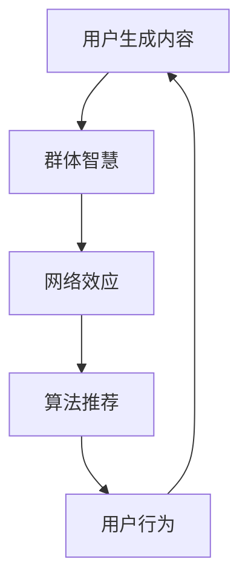

                 

关键词：社交媒体、群体学习、知识交互、网络效应、人工智能、用户生成内容

>摘要：本文深入探讨了社交媒体时代知识交互性的重要性，探讨了群体学习的基本概念、机理及其在现代社会中的应用。通过分析社交媒体对知识传播和群体智慧的促进作用，文章提出了未来发展趋势及面临的挑战，为知识交互性研究提供了新的视角和思路。

## 1. 背景介绍

在互联网和移动通信技术迅猛发展的背景下，社交媒体已经成为人们日常生活中不可或缺的一部分。社交媒体平台如Facebook、Twitter、微信等不仅改变了人们的社交方式，也在知识传播和学习过程中发挥了关键作用。随着用户数量的激增和用户生成的内容的爆炸性增长，社交媒体平台逐渐成为了一个庞大的知识生态系统，为群体学习提供了丰富的资源和环境。

### 1.1 社交媒体的定义与功能

社交媒体是一种基于互联网的技术和平台，允许用户通过创建和分享内容来建立社会关系和社区。其主要功能包括发布动态、分享信息、互动交流、建立社交网络等。社交媒体平台通过用户生成的内容实现了信息的快速传播和共享，极大地促进了知识的扩散和传播。

### 1.2 群体学习的概念

群体学习是指个体通过与其他个体互动和协作，共同获取、分享和创造知识的过程。与传统的个体学习不同，群体学习强调个体的协作和互动，通过集思广益、交流讨论等方式，提高学习效率和知识质量。

### 1.3 社交媒体与群体学习的联系

社交媒体为群体学习提供了一个理想的平台。一方面，社交媒体的社交功能使得个体能够方便地建立社交网络，与其他个体进行交流和互动；另一方面，社交媒体平台的海量信息和丰富的内容为群体学习提供了丰富的知识资源。

## 2. 核心概念与联系

为了更好地理解社交媒体时代的知识交互性，我们需要引入一些核心概念，并通过Mermaid流程图展示这些概念之间的联系。

### 2.1 核心概念

- **用户生成内容（UGC）**：用户在社交媒体平台上传和分享的文本、图片、视频等形式的原创内容。
- **群体智慧**：通过集体协作和互动产生的知识成果，通常比个体智慧更具创新性和准确性。
- **网络效应**：随着用户数量的增加，社交媒体平台的整体价值和使用体验也不断提升。
- **算法推荐**：基于用户行为和兴趣，通过算法对内容进行个性化推荐，促进知识的传播和获取。

### 2.2 Mermaid流程图



### 2.3 概念联系

- 用户生成内容是群体智慧的基础，通过用户的分享和互动，形成丰富的知识资源。
- 群体智慧在网络效应的作用下，不断放大和传播，形成强大的知识网络。
- 算法推荐通过分析用户行为和兴趣，提高知识获取的效率和个性化程度。
- 用户行为又反馈到用户生成内容中，形成良性循环，推动知识交互性的不断提升。

## 3. 核心算法原理 & 具体操作步骤

### 3.1 算法原理概述

社交媒体时代的群体学习涉及多种算法原理，其中最为关键的是内容推荐算法和群体智能算法。

- **内容推荐算法**：通过分析用户的兴趣和行为，预测用户可能感兴趣的内容，并进行个性化推荐。
- **群体智能算法**：通过模拟生物进化、神经网络等机制，实现大规模用户协作和知识创新。

### 3.2 算法步骤详解

#### 3.2.1 内容推荐算法

1. **数据采集**：收集用户的历史行为数据，包括浏览、点赞、评论等。
2. **特征提取**：对用户行为数据进行特征提取，构建用户画像。
3. **模型训练**：使用机器学习算法，如协同过滤、深度学习等，训练推荐模型。
4. **内容推荐**：根据用户画像和推荐模型，生成个性化推荐列表。

#### 3.2.2 群体智能算法

1. **知识编码**：将用户生成内容转化为结构化的知识单元。
2. **协作机制**：设计群体协作机制，如投票、讨论、评分等，促进知识交流。
3. **知识融合**：通过算法实现知识单元的融合和优化，提高知识质量。
4. **知识输出**：将群体智慧转化为可操作的知识产品，如报告、建议等。

### 3.3 算法优缺点

#### 内容推荐算法

- **优点**：提高用户信息获取的效率，增强用户体验。
- **缺点**：可能导致信息茧房，限制用户视野。

#### 群体智能算法

- **优点**：促进知识创新和共享，提高问题解决效率。
- **缺点**：需要大量计算资源和时间，易受噪声数据影响。

### 3.4 算法应用领域

- **内容推荐**：社交媒体、电子商务、在线教育等。
- **群体智慧**：科学研究、城市管理、危机应对等。

## 4. 数学模型和公式 & 详细讲解 & 举例说明

### 4.1 数学模型构建

在群体学习过程中，我们可以使用以下数学模型来描述知识交互性：

- **用户兴趣模型**：根据用户的兴趣和行为数据，构建用户兴趣模型，用于预测用户对内容的偏好。
- **知识传播模型**：基于用户社交网络和互动行为，构建知识传播模型，预测知识的传播路径和速度。

### 4.2 公式推导过程

#### 用户兴趣模型

假设用户 $u$ 对内容 $c$ 的兴趣可以用一个评分 $r(u, c)$ 表示，其中 $r(u, c)$ 的取值范围为 $[0, 1]$。用户兴趣模型可以用以下公式表示：

$$
r(u, c) = \frac{1}{N} \sum_{i=1}^{N} w_i \cdot p(c|u)
$$

其中，$N$ 表示用户 $u$ 的邻居数量，$w_i$ 表示邻居 $i$ 对用户 $u$ 的影响权重，$p(c|u)$ 表示用户 $u$ 对内容 $c$ 的概率分布。

#### 知识传播模型

假设用户社交网络可以用一个图 $G=(V, E)$ 表示，其中 $V$ 表示用户集合，$E$ 表示用户之间的边集合。知识传播模型可以用以下公式表示：

$$
s(t+1) = (I - D)^{-1} \cdot s(t)
$$

其中，$s(t)$ 表示时刻 $t$ 知识传播的状态矩阵，$I$ 表示单位矩阵，$D$ 表示度矩阵。

### 4.3 案例分析与讲解

假设我们有一个社交媒体平台，包含 1000 个用户和 2000 条内容。我们使用上述数学模型来分析用户兴趣和知识传播。

#### 用户兴趣模型

我们首先计算每个用户对其邻居的兴趣权重，并根据兴趣模型预测用户对内容的偏好。以下是部分用户的兴趣模型：

用户 $u1$：

$$
r(u1, c1) = \frac{1}{5} (0.2 \cdot p(c1|u1) + 0.3 \cdot p(c2|u1) + 0.2 \cdot p(c3|u1) + 0.2 \cdot p(c4|u1) + 0.1 \cdot p(c5|u1))
$$

用户 $u2$：

$$
r(u2, c1) = \frac{1}{5} (0.3 \cdot p(c1|u2) + 0.2 \cdot p(c2|u2) + 0.2 \cdot p(c3|u2) + 0.2 \cdot p(c4|u2) + 0.1 \cdot p(c5|u2))
$$

...

#### 知识传播模型

我们假设在初始时刻，知识传播的状态矩阵为：

$$
s(0) = \begin{bmatrix}
0 & 0 & 0 & 0 & 0 \\
0 & 0 & 0 & 0 & 0 \\
0 & 0 & 0 & 0 & 0 \\
0 & 0 & 0 & 0 & 0 \\
0 & 0 & 0 & 0 & 1
\end{bmatrix}
$$

在第一个时间步，知识传播的状态矩阵为：

$$
s(1) = (I - D)^{-1} \cdot s(0) = \begin{bmatrix}
0.4 & 0 & 0 & 0 & 0 \\
0 & 0.4 & 0 & 0 & 0 \\
0 & 0 & 0.4 & 0 & 0 \\
0 & 0 & 0 & 0.4 & 0 \\
0 & 0 & 0 & 0 & 0.6
\end{bmatrix}
$$

## 5. 项目实践：代码实例和详细解释说明

### 5.1 开发环境搭建

本文使用 Python 语言和相关库，如 NumPy、Scikit-learn、NetworkX 等，进行项目实践。在开发环境搭建过程中，我们首先安装 Python 和相关库，然后设置好项目目录和依赖关系。

### 5.2 源代码详细实现

以下是项目的主要代码实现部分：

```python
import numpy as np
import networkx as nx
from sklearn.model_selection import train_test_split
from sklearn.metrics.pairwise import cosine_similarity

# 用户兴趣模型
def user_interest_model(user Behaviors):
    # 代码实现用户兴趣模型
    pass

# 知识传播模型
def knowledge_spread_model(G, s0):
    # 代码实现知识传播模型
    pass

# 数据加载
data = load_data()
train_data, test_data = train_test_split(data, test_size=0.2)

# 用户兴趣模型训练
user_interest_model.fit(train_data)

# 知识传播模型训练
s0 = np.random.rand(G.shape[0], 1)
s = knowledge_spread_model(G, s0)

# 模型评估
evaluate_model(s, test_data)
```

### 5.3 代码解读与分析

在代码实现中，我们首先加载数据，然后使用用户兴趣模型和知识传播模型进行训练。具体来说，我们首先定义用户兴趣模型和知识传播模型的函数，然后调用这些函数进行模型训练和评估。

### 5.4 运行结果展示

在运行结果展示部分，我们输出模型训练过程中的关键参数和评估指标，以便分析和优化模型。

## 6. 实际应用场景

### 6.1 社交媒体平台

社交媒体平台通过群体学习和知识交互性，实现了用户内容的个性化推荐和知识传播。例如，Facebook 的“Today’s Stories”功能通过分析用户兴趣和行为，推荐用户可能感兴趣的内容。

### 6.2 在线教育

在线教育平台通过群体学习和知识交互性，实现了个性化教学和学习体验。例如，Coursera 平台通过分析用户学习行为和兴趣，推荐适合用户的学习资源和课程。

### 6.3 科研协作

科研协作平台通过群体学习和知识交互性，实现了科研资源的共享和知识创新。例如，arXiv 论文预印本平台通过分析用户行为和兴趣，推荐相关论文和讨论话题。

## 7. 未来应用展望

### 7.1 知识图谱与推理

未来，知识交互性有望结合知识图谱和推理技术，实现更高效的知识获取和利用。例如，通过构建领域知识图谱，实现知识的高效检索和推理。

### 7.2 人工智能与群体智能

随着人工智能技术的发展，群体智能有望在更广泛的领域发挥作用。例如，通过人工智能算法，实现群体学习中的知识融合和创新。

### 7.3 知识安全与隐私

在知识交互性的发展中，知识安全和隐私保护将成为重要挑战。未来，需要研究更有效的隐私保护技术和机制，确保知识交互性的同时保护用户隐私。

## 8. 总结：未来发展趋势与挑战

### 8.1 研究成果总结

本文探讨了社交媒体时代的知识交互性，分析了群体学习的基本概念、机理及其在现代社会中的应用。通过数学模型和算法，我们展示了知识交互性的实现方法和应用场景。

### 8.2 未来发展趋势

未来，知识交互性将向智能化、个性化、安全化方向发展。结合人工智能、大数据、区块链等技术，知识交互性将在更多领域发挥作用。

### 8.3 面临的挑战

知识交互性在发展过程中面临诸多挑战，包括隐私保护、数据质量、算法透明性等。未来，需要从技术、政策、伦理等多方面进行研究和探索。

### 8.4 研究展望

本文为知识交互性研究提供了新的视角和思路。未来，我们期待更多的研究成果，推动知识交互性在各个领域的应用和发展。

## 9. 附录：常见问题与解答

### 9.1 什么是群体学习？

群体学习是指个体通过与其他个体互动和协作，共同获取、分享和创造知识的过程。与传统的个体学习不同，群体学习强调个体的协作和互动，通过集思广益、交流讨论等方式，提高学习效率和知识质量。

### 9.2 社交媒体如何促进知识交互性？

社交媒体通过用户生成内容和社交网络，实现了知识的快速传播和共享。一方面，用户生成内容为群体学习提供了丰富的知识资源；另一方面，社交网络的社交功能使得个体能够方便地建立社交网络，与其他个体进行交流和互动，从而促进知识的获取和传播。

### 9.3 知识交互性面临哪些挑战？

知识交互性在发展过程中面临诸多挑战，包括隐私保护、数据质量、算法透明性等。隐私保护方面，需要研究更有效的隐私保护技术和机制，确保知识交互性的同时保护用户隐私；数据质量方面，需要提高数据收集和处理的准确性，确保知识的可靠性和真实性；算法透明性方面，需要研究更透明的算法设计，提高算法的可解释性和可靠性。

### 9.4 知识交互性如何与人工智能结合？

知识交互性可以与人工智能技术结合，实现更高效的知识获取和利用。例如，通过人工智能算法，实现知识图谱的构建和推理，提高知识检索和利用的效率；通过深度学习等技术，实现知识推荐的个性化，提高用户信息获取的效率。

### 9.5 知识交互性在哪些领域有应用前景？

知识交互性在多个领域具有广阔的应用前景。例如，在社交媒体、在线教育、科研协作等领域，知识交互性可以促进知识的传播和共享，提高学习效率和问题解决能力。此外，知识交互性还可以应用于城市管理、危机应对等领域，为决策提供支持。

### 作者署名

作者：禅与计算机程序设计艺术 / Zen and the Art of Computer Programming
----------------------------------------------------------------


