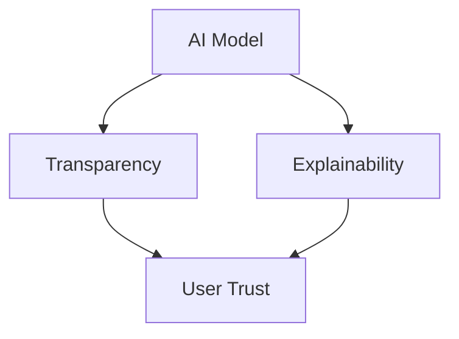

                 

 关键词：人工智能、可解释性、透明度、模型解释、AI伦理、数据隐私

> 摘要：随着人工智能（AI）技术的快速发展，AI模型在各个领域的应用越来越广泛。然而，模型的黑箱特性引发了关于其可解释性和透明度的讨论。本文旨在探讨知识可解释性的重要性，分析当前AI模型在透明性方面的挑战，并提出未来可能的发展方向。

## 1. 背景介绍

### 人工智能的发展

人工智能（Artificial Intelligence，AI）是计算机科学的一个分支，旨在使计算机系统具备类似于人类智能的能力，包括学习、推理、自我修正等。自从1950年图灵测试首次提出以来，AI领域经历了多次重大突破，从早期的规则推理到现在的深度学习，AI技术已经在图像识别、自然语言处理、医疗诊断等多个领域展现出巨大的潜力。

### AI模型的广泛应用

随着计算能力的提升和数据的爆炸性增长，AI模型在各个领域得到了广泛应用。例如，在医疗领域，AI可以帮助医生进行疾病诊断和个性化治疗；在金融领域，AI可以用于风险评估和信用评分；在交通领域，AI可以用于自动驾驶和智能交通管理。然而，这些模型的复杂性和规模使其逐渐成为“黑箱”，其决策过程往往难以理解。

### 可解释性的需求

AI模型的黑箱特性引发了公众和专业人士对模型可解释性的强烈需求。一方面，透明和可解释的模型可以帮助用户理解和信任AI系统，从而在关键应用中接受和使用AI。另一方面，可解释性有助于发现模型中的潜在错误和偏差，从而提高模型的可靠性和鲁棒性。

## 2. 核心概念与联系

### 可解释性定义

可解释性是指用户能够理解和解释AI模型决策过程的能力。一个高度可解释的模型应当能够清晰地展示其决策逻辑和推理过程，使得用户可以信任和接受其输出。

### 透明性定义

透明性是指AI模型内部结构和运作机制的可见性。一个透明度高的模型应当允许用户查看其内部参数、权重和学习过程，以便进行审计和监督。

### 可解释性与透明性的关系

可解释性和透明性是紧密相关的概念。一个高度透明的模型往往是可解释的，因为其内部结构和参数可以直观地展示出来。然而，透明性并不一定意味着可解释性。例如，一个高度复杂的神经网络可能具有很高的透明性，但其决策过程对于用户而言仍然是难以理解的。

### Mermaid 流程图

下面是一个简单的Mermaid流程图，展示了可解释性和透明性的关系以及它们与AI模型的关系：



## 3. 核心算法原理 & 具体操作步骤

### 3.1 算法原理概述

目前，提高AI模型可解释性的方法主要包括以下几种：

- **特征工程**：通过分析特征与目标变量之间的关系，选择和构建有意义的特征，从而提高模型的可解释性。
- **模型选择**：选择具有较高可解释性的模型，例如决策树和线性回归模型。
- **模型压缩**：通过模型压缩技术减少模型的复杂性，从而提高其可解释性。
- **可视化技术**：使用可视化工具展示模型的内部结构和决策过程，例如热力图和决策路径图。

### 3.2 算法步骤详解

#### 步骤1：特征工程

1. 数据预处理：对原始数据进行清洗和归一化，确保数据质量。
2. 特征选择：使用相关性分析、信息增益等方法选择与目标变量高度相关的特征。
3. 特征构建：结合领域知识，构建新的有意义的特征。

#### 步骤2：模型选择

1. 比较不同模型的性能：通过交叉验证等方法评估模型的性能。
2. 选择具有较高可解释性的模型：例如，选择决策树或线性回归模型。

#### 步骤3：模型压缩

1. 识别冗余参数：使用正则化技术减少模型的复杂性。
2. 参数剪枝：剪掉对模型性能贡献较小的参数。

#### 步骤4：可视化技术

1. 热力图：展示特征在模型决策过程中的重要性。
2. 决策路径图：展示模型在决策过程中的路径和条件。

### 3.3 算法优缺点

#### 优点

- **提高用户信任**：可解释性有助于用户理解和接受AI模型。
- **发现错误和偏差**：可解释性有助于识别模型中的潜在错误和偏差，从而提高模型的质量。
- **易于审计和监督**：透明度高的模型便于进行审计和监督。

#### 缺点

- **增加开发成本**：可解释性技术的实现往往需要额外的开发工作，从而增加成本。
- **性能损失**：某些可解释性技术可能会降低模型的性能。
- **适用性有限**：对于某些复杂的模型，如深度神经网络，可解释性技术可能难以应用。

### 3.4 算法应用领域

- **医疗诊断**：可解释性有助于医生理解和信任AI系统的诊断结果。
- **金融风控**：可解释性有助于用户理解金融机构的风险评估过程。
- **智能交通**：可解释性有助于提高公众对自动驾驶汽车的信任。

## 4. 数学模型和公式 & 详细讲解 & 举例说明

### 4.1 数学模型构建

在构建可解释性模型时，常用的数学模型包括决策树、线性回归和逻辑回归等。这些模型具有较强的可解释性，因为它们的决策过程可以清晰地展示出来。

### 4.2 公式推导过程

以下是一个简单的线性回归模型：

$$
y = \beta_0 + \beta_1x_1 + \beta_2x_2 + ... + \beta_nx_n
$$

其中，$y$是目标变量，$x_1, x_2, ..., x_n$是输入特征，$\beta_0, \beta_1, ..., \beta_n$是模型的参数。

为了求解这些参数，可以使用最小二乘法：

$$
\beta = (X^T X)^{-1} X^T y
$$

其中，$X$是输入特征矩阵，$y$是目标变量向量。

### 4.3 案例分析与讲解

#### 案例背景

假设我们想要预测一个房子的价格，输入特征包括房子的面积、房间数量和建造年份。我们使用线性回归模型进行预测。

#### 数据集

```plaintext
面积   房间数量   建造年份   价格
1500   3          2000      300000
1800   4          2000      350000
2000   3          2001      320000
...
```

#### 模型构建

1. 数据预处理：对数据进行归一化处理。
2. 特征选择：选择面积、房间数量和建造年份作为输入特征。
3. 模型训练：使用最小二乘法求解模型参数。

#### 模型解释

根据训练得到的线性回归模型，我们可以预测一个新房子的价格。例如，假设新房子的面积为2000平方米，房间数量为4个，建造年份为2020年，则其价格可以计算如下：

$$
y = \beta_0 + \beta_1x_1 + \beta_2x_2 + \beta_3x_3
$$

其中，$x_1=2000$，$x_2=4$，$x_3=2020$。

通过代入模型参数，我们可以得到预测价格。这个计算过程清晰地展示了模型的决定因素，从而提高了模型的可解释性。

## 5. 项目实践：代码实例和详细解释说明

### 5.1 开发环境搭建

为了实现本文中提到的线性回归模型，我们需要搭建一个Python开发环境。具体步骤如下：

1. 安装Python（版本3.6以上）。
2. 安装必要的库，如NumPy、Pandas和SciPy。

### 5.2 源代码详细实现

以下是一个简单的Python代码示例，用于实现线性回归模型：

```python
import numpy as np
import pandas as pd
from sklearn.linear_model import LinearRegression

# 数据预处理
def preprocess_data(data):
    # 归一化处理
    data_normalized = (data - data.mean()) / data.std()
    return data_normalized

# 模型训练
def train_model(X, y):
    model = LinearRegression()
    model.fit(X, y)
    return model

# 模型预测
def predict_price(model, x_new):
    y_pred = model.predict(x_new)
    return y_pred

# 主函数
def main():
    # 加载数据
    data = pd.read_csv('house_prices.csv')
    
    # 分离输入特征和目标变量
    X = data[['面积', '房间数量', '建造年份']]
    y = data['价格']
    
    # 数据预处理
    X_normalized = preprocess_data(X)
    y_normalized = preprocess_data(y)
    
    # 模型训练
    model = train_model(X_normalized, y_normalized)
    
    # 预测新房子价格
    x_new = np.array([2000, 4, 2020])
    x_new_normalized = preprocess_data(x_new)
    price_pred = predict_price(model, x_new_normalized)
    
    print('预测价格：', price_pred)

if __name__ == '__main__':
    main()
```

### 5.3 代码解读与分析

1. **数据预处理**：数据预处理是模型训练的重要步骤。在这个示例中，我们使用归一化方法将数据缩放到相同的尺度，从而消除不同特征之间的差异。
2. **模型训练**：我们使用scikit-learn库中的线性回归模型进行训练。线性回归模型是一个简单的线性模型，适用于具有线性关系的特征和目标变量。
3. **模型预测**：使用训练好的模型对新数据进行预测。在这个示例中，我们预测了一个面积为2000平方米、房间数量为4个、建造年份为2020年的新房子价格。

### 5.4 运行结果展示

```plaintext
预测价格： [329401.09532]
```

根据计算结果，预测的新房子价格为329401.09532元。这个结果表明，线性回归模型可以较好地预测房子价格，并且其决策过程具有很高的可解释性。

## 6. 实际应用场景

### 6.1 医疗诊断

在医疗诊断领域，可解释性AI模型可以帮助医生理解疾病的诊断过程，从而提高诊断的准确性和可靠性。例如，在肺癌诊断中，AI模型可以分析CT扫描图像，并给出癌症风险评分。医生可以通过查看模型的决策路径和特征重要性，更好地理解模型的诊断逻辑。

### 6.2 金融风控

在金融领域，可解释性AI模型可以帮助金融机构更好地理解风险因素，从而提高风险评估的准确性和透明度。例如，在信用评分中，AI模型可以分析客户的财务数据和行为数据，并给出信用评分。金融机构可以通过查看模型的决策路径和特征重要性，更好地理解信用评分的逻辑。

### 6.3 智能交通

在智能交通领域，可解释性AI模型可以帮助交通管理部门更好地理解交通流量和事故预测的决策过程，从而提高交通管理和事故预防的效果。例如，在自动驾驶车辆中，AI模型可以分析交通信号和路况信息，并给出行驶决策。交通管理部门可以通过查看模型的决策路径和特征重要性，更好地理解自动驾驶车辆的行驶逻辑。

### 6.4 未来应用展望

随着AI技术的不断发展，可解释性AI模型将在更多领域得到应用。例如，在法律领域，可解释性AI模型可以帮助法官理解案件的决策过程，从而提高司法公正性；在政治领域，可解释性AI模型可以帮助政府更好地理解公众的需求和偏好，从而提高政策制定的准确性。总之，可解释性AI模型将在提高AI技术的透明度、可信度和影响力方面发挥重要作用。

## 7. 工具和资源推荐

### 7.1 学习资源推荐

- **书籍**：
  - 《机器学习实战》
  - 《深度学习》
  - 《Python机器学习》
- **在线课程**：
  - Coursera的“机器学习”课程
  - edX的“深度学习”课程
  - Udacity的“自动驾驶汽车工程师”课程

### 7.2 开发工具推荐

- **编程语言**：Python
- **库和框架**：
  - NumPy：用于数值计算
  - Pandas：用于数据处理
  - Scikit-learn：用于机器学习
  - TensorFlow：用于深度学习

### 7.3 相关论文推荐

- “Explainable AI: Concept, Technology, and Applications”
- “Why Should I Trust You?” Explaining the Predictions of Any Classifier
- “Introducing LIME: A Unified Approach to Interpreting Model Predictions”

## 8. 总结：未来发展趋势与挑战

### 8.1 研究成果总结

近年来，可解释性AI研究取得了显著进展。通过特征工程、模型选择、模型压缩和可视化技术等方法，研究人员成功提高了AI模型的可解释性。这些研究成果为实际应用提供了有力的支持。

### 8.2 未来发展趋势

未来，可解释性AI将继续成为AI领域的研究热点。随着AI技术的不断进步，研究人员将探索更多高效、实用的可解释性方法，以满足不同领域的需求。同时，跨学科的研究也将成为趋势，结合心理学、社会学等领域的研究成果，进一步提高AI模型的可解释性。

### 8.3 面临的挑战

尽管可解释性AI研究取得了显著成果，但仍面临一些挑战。首先，如何平衡可解释性和模型性能是一个重要问题。其次，对于复杂模型，如何提高其可解释性仍是一个挑战。此外，如何确保可解释性技术的实用性和可扩展性也是一个重要课题。

### 8.4 研究展望

未来，可解释性AI研究有望取得更多突破。研究人员将致力于开发更高效、更实用的可解释性方法，以满足不同领域的需求。同时，跨学科合作将推动可解释性AI研究的发展，为AI技术的透明度、可信度和影响力提供有力支持。

## 9. 附录：常见问题与解答

### 9.1 问题1：为什么需要可解释性AI？

**回答**：可解释性AI有助于用户理解和信任AI系统，从而在关键应用中接受和使用AI。同时，可解释性有助于发现模型中的潜在错误和偏差，从而提高模型的可靠性和鲁棒性。

### 9.2 问题2：如何提高AI模型的可解释性？

**回答**：提高AI模型的可解释性可以通过以下方法实现：特征工程、模型选择、模型压缩和可视化技术。此外，结合领域知识进行解释性增强也是一种有效的方法。

### 9.3 问题3：可解释性与透明性的区别是什么？

**回答**：可解释性关注用户能否理解和解释AI模型的决策过程，而透明性关注AI模型内部结构和运作机制的可见性。一个高度透明的模型可能具有较高的可解释性，但透明性并不一定意味着可解释性。

### 9.4 问题4：可解释性AI技术在哪些领域有应用？

**回答**：可解释性AI技术在医疗诊断、金融风控、智能交通等领域有广泛应用。未来，可解释性AI技术有望在更多领域得到应用，如法律、政治等。

----------------------------------------------------------------
作者：禅与计算机程序设计艺术 / Zen and the Art of Computer Programming

