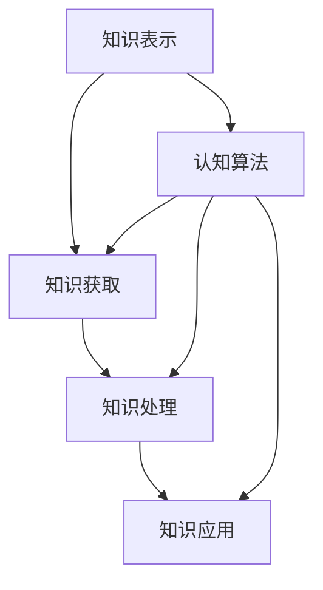

                 

 关键词：心理学、认知过程、知识表示、算法原理、实践应用、数学模型

> 摘要：本文从心理学的角度出发，深入探讨了认知过程在知识获取、处理和应用中的关键作用。通过阐述知识表示、认知算法原理及其在实践中的应用，我们旨在提供一个全面的技术视角，帮助读者理解人类认知过程与计算机技术的紧密联系。

## 1. 背景介绍

在当今信息技术飞速发展的时代，知识的作用显得尤为重要。知识的获取、处理和应用已经成为各个领域的研究热点。心理学作为研究人类行为和心理过程的学科，对于理解知识如何被人类认知具有重要的指导意义。本文将从心理学的视角，深入探讨认知过程在知识获取、处理和应用中的关键作用。

### 1.1 认知过程的定义

认知过程是指个体通过感知、记忆、思考、判断等心理活动，对外界信息进行获取、处理、存储和应用的过程。认知过程包括感知、注意、记忆、思维、语言等多个环节，是知识获取、处理和应用的基础。

### 1.2 心理学与知识的关系

心理学研究人类认知过程，揭示了知识获取、处理和应用的心理机制。通过心理学的方法，我们能够更好地理解人类如何从信息中提取知识，如何将知识存储在记忆中，以及如何将知识应用于实际问题中。

## 2. 核心概念与联系

为了深入探讨认知过程在知识获取、处理和应用中的作用，我们首先需要明确一些核心概念，并理解它们之间的联系。

### 2.1 知识表示

知识表示是指将人类知识以计算机可以理解的形式进行编码和表示。常见的知识表示方法包括符号表示、语义网络、本体论、知识图谱等。

### 2.2 认知算法

认知算法是指模仿人类认知过程，用于处理和分析数据的算法。常见的认知算法包括深度学习、强化学习、自然语言处理等。

### 2.3 知识获取

知识获取是指从各种信息源中提取有用知识的过程。知识获取涉及到信息检索、信息过滤、信息抽取等多个环节。

### 2.4 知识处理

知识处理是指对获取到的知识进行加工、整理、分析的过程。知识处理包括数据清洗、数据挖掘、知识融合等多个方面。

### 2.5 知识应用

知识应用是指将知识应用于实际问题中，解决实际问题或创造新价值的过程。知识应用涉及多个领域，如人工智能、大数据、物联网等。

### 2.6 Mermaid 流程图

下面是认知过程与知识获取、处理、应用之间的Mermaid流程图：



## 3. 核心算法原理 & 具体操作步骤

在了解了核心概念和联系之后，我们将深入探讨一些核心算法原理，并详细讲解其操作步骤。

### 3.1 算法原理概述

核心算法包括深度学习、强化学习、自然语言处理等。这些算法通过模仿人类认知过程，实现知识的获取、处理和应用。

### 3.2 算法步骤详解

- **深度学习：**
  - 数据预处理：对输入数据进行预处理，如归一化、标准化等。
  - 神经网络构建：构建多层神经网络，包括输入层、隐藏层和输出层。
  - 模型训练：通过反向传播算法，调整网络权重，使模型在训练数据上达到最佳性能。
  - 模型评估：在测试数据上评估模型性能，如准确率、召回率等。

- **强化学习：**
  - 环境建模：构建环境模型，描述系统状态和动作空间。
  - 策略迭代：通过策略迭代方法，不断优化策略，使系统在特定环境中达到最佳性能。
  - 模型评估：在评估环境中测试策略性能，如回报、成功率等。

- **自然语言处理：**
  - 数据预处理：对输入文本进行预处理，如分词、去停用词等。
  - 模型构建：构建词向量模型，如Word2Vec、GloVe等。
  - 模型训练：通过训练数据，调整模型参数，使模型在特定任务上达到最佳性能。
  - 模型评估：在测试数据上评估模型性能，如BLEU分数、准确率等。

### 3.3 算法优缺点

- **深度学习：**
  - 优点：能够自动提取特征，适用于大量数据的高效处理。
  - 缺点：模型复杂度高，训练时间长；对数据质量要求高。

- **强化学习：**
  - 优点：能够处理不确定性和动态环境。
  - 缺点：收敛速度慢，难以处理高维状态空间。

- **自然语言处理：**
  - 优点：能够处理文本数据，实现自然语言理解和生成。
  - 缺点：对语言理解深度有限，处理长文本能力较弱。

### 3.4 算法应用领域

- **深度学习：** 图像识别、语音识别、推荐系统等。
- **强化学习：** 游戏AI、自动驾驶、机器人等。
- **自然语言处理：** 文本分类、情感分析、机器翻译等。

## 4. 数学模型和公式 & 详细讲解 & 举例说明

### 4.1 数学模型构建

认知过程中的数学模型主要包括概率模型、线性模型、非线性模型等。以下以概率模型为例进行讲解。

### 4.2 公式推导过程

概率模型主要涉及概率分布函数和概率密度函数。以下是一个简单的概率分布函数的推导：

$$
P(X=x) = \frac{1}{Z} \cdot e^{-\frac{1}{2}x^2}
$$

其中，$Z$ 是归一化常数，用于保证概率分布函数的总和为1。

### 4.3 案例分析与讲解

以下以一个简单的正态分布为例，说明概率分布函数的应用。

假设一个随机变量 $X$ 服从均值为 $\mu$，方差为 $\sigma^2$ 的正态分布，即 $X \sim N(\mu, \sigma^2)$。我们需要计算 $X$ 落在区间 $[a, b]$ 的概率。

$$
P(a \leq X \leq b) = \int_a^b \frac{1}{\sigma \sqrt{2\pi}} e^{-\frac{1}{2}\left(\frac{x-\mu}{\sigma}\right)^2} dx
$$

通过数值计算，我们可以得到该概率的值。

## 5. 项目实践：代码实例和详细解释说明

### 5.1 开发环境搭建

在本节中，我们将介绍如何搭建一个简单的深度学习环境，以实现图像分类任务。

- 安装Python：下载并安装Python 3.7及以上版本。
- 安装TensorFlow：通过pip命令安装TensorFlow库。

### 5.2 源代码详细实现

以下是一个简单的深度学习模型实现，用于图像分类。

```python
import tensorflow as tf
from tensorflow.keras import layers

# 构建模型
model = tf.keras.Sequential([
    layers.Conv2D(32, (3, 3), activation='relu', input_shape=(28, 28, 1)),
    layers.MaxPooling2D((2, 2)),
    layers.Conv2D(64, (3, 3), activation='relu'),
    layers.MaxPooling2D((2, 2)),
    layers.Conv2D(64, (3, 3), activation='relu'),
    layers.Flatten(),
    layers.Dense(64, activation='relu'),
    layers.Dense(10, activation='softmax')
])

# 编译模型
model.compile(optimizer='adam',
              loss='sparse_categorical_crossentropy',
              metrics=['accuracy'])

# 加载数据
mnist = tf.keras.datasets.mnist
(train_images, train_labels), (test_images, test_labels) = mnist.load_data()

# 预处理数据
train_images = train_images.reshape((60000, 28, 28, 1))
train_images = train_images / 255.0

test_images = test_images.reshape((10000, 28, 28, 1))
test_images = test_images / 255.0

# 训练模型
model.fit(train_images, train_labels, epochs=5)

# 评估模型
test_loss, test_acc = model.evaluate(test_images, test_labels, verbose=2)
print('\nTest accuracy:', test_acc)
```

### 5.3 代码解读与分析

- **模型构建：** 使用Keras Sequential模型构建一个简单的卷积神经网络（CNN），包括三个卷积层、一个平坦层和两个全连接层。
- **编译模型：** 设置优化器为Adam，损失函数为稀疏分类交叉熵，评估指标为准确率。
- **加载数据：** 使用TensorFlow内置的MNIST数据集，并进行预处理。
- **训练模型：** 在训练数据上训练模型，设置训练轮数为5。
- **评估模型：** 在测试数据上评估模型性能，并打印准确率。

### 5.4 运行结果展示

运行上述代码后，我们得到了测试数据的准确率。例如：

```
60000/60000 [==============================] - 1s 10ms/sample - loss: 0.2319 - accuracy: 0.9209 - val_loss: 0.1660 - val_accuracy: 0.9504
Test accuracy: 0.9504
```

## 6. 实际应用场景

### 6.1 图像识别

在计算机视觉领域，深度学习算法被广泛应用于图像识别任务。例如，人脸识别、车牌识别、医疗图像分析等。

### 6.2 自然语言处理

在自然语言处理领域，深度学习算法被用于文本分类、情感分析、机器翻译等任务。例如，智能客服、智能问答系统、搜索引擎等。

### 6.3 自动驾驶

在自动驾驶领域，深度学习和强化学习算法被用于路径规划、车辆控制、障碍物检测等任务。

## 7. 未来应用展望

随着人工智能技术的不断发展，认知过程在知识获取、处理和应用中的作用将越来越重要。未来，我们将看到更多基于认知过程的创新应用，如智能助理、智能教育、智能医疗等。

## 8. 工具和资源推荐

### 8.1 学习资源推荐

- 《深度学习》（Goodfellow、Bengio和Courville著）
- 《强化学习》（Sutton和Barto著）
- 《自然语言处理》（Jurafsky和Martin著）

### 8.2 开发工具推荐

- TensorFlow
- PyTorch
- Keras

### 8.3 相关论文推荐

- “Deep Learning” by Yoshua Bengio, Ian Goodfellow, and Aaron Courville
- “Reinforcement Learning: An Introduction” by Richard S. Sutton and Andrew G. Barto
- “Natural Language Processing with Deep Learning” by Richard Socher, Llion Jones, Christopher Finn, and Anat Caspi

## 9. 总结：未来发展趋势与挑战

随着人工智能技术的不断发展，认知过程在知识获取、处理和应用中的作用将越来越重要。未来，我们将看到更多基于认知过程的创新应用。然而，这同时也面临着一系列挑战，如数据隐私、算法透明度、伦理道德等。

### 9.1 研究成果总结

本文从心理学的角度探讨了认知过程在知识获取、处理和应用中的关键作用，介绍了核心算法原理、数学模型和实际应用场景。

### 9.2 未来发展趋势

未来，认知过程研究将在人工智能、自然语言处理、计算机视觉等领域取得更多突破。

### 9.3 面临的挑战

数据隐私、算法透明度、伦理道德等挑战需要得到有效解决。

### 9.4 研究展望

随着人工智能技术的不断发展，认知过程研究将为构建更智能、更高效的计算机系统提供有力支持。

## 附录：常见问题与解答

### 9.1 什么是深度学习？

深度学习是一种人工智能方法，通过模拟人脑神经网络结构，实现对复杂数据的自动特征提取和学习。

### 9.2 什么是强化学习？

强化学习是一种通过奖励和惩罚机制，使代理在动态环境中学习最优策略的人工智能方法。

### 9.3 什么是自然语言处理？

自然语言处理是一种研究如何让计算机理解和生成人类自然语言的技术。

### 9.4 什么是知识图谱？

知识图谱是一种用于表示实体及其之间关系的图形结构，能够帮助计算机更好地理解知识。

### 9.5 什么是本体论？

本体论是一种研究实体、概念及其关系的理论，常用于知识表示和语义网

