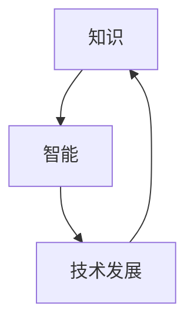

                 

关键词：知识传承、智能时代、技术发展、长期视角、技术博客

> 摘要：本文从技术发展的长期视角出发，探讨知识永续发展的挑战与机遇。通过分析核心概念、算法原理、数学模型、项目实践和未来应用展望，提出应对智能时代知识传承的解决方案，为技术领域的未来发展提供参考。

## 1. 背景介绍

随着科技的飞速发展，人工智能、大数据、云计算等新兴技术不断涌现，我们的世界正经历着前所未有的变革。然而，技术在快速迭代的同时，知识的积累和传承也面临着诸多挑战。一方面，技术更新换代速度加快，使得过去的知识迅速变得过时；另一方面，技术领域的专业壁垒不断提高，知识的传播和分享变得愈发困难。因此，如何在智能时代实现知识的永续发展，成为了我们必须面对和解决的重要问题。

本文旨在从长期视角出发，探讨知识永续发展的挑战与机遇。通过分析核心概念、算法原理、数学模型、项目实践和未来应用展望，提出应对智能时代知识传承的解决方案，为技术领域的未来发展提供参考。

## 2. 核心概念与联系

### 2.1 核心概念

在探讨知识永续发展之前，我们需要明确一些核心概念，包括知识、智能、技术发展等。

- **知识**：知识是人类对自然界、社会和自我认识的总结和提炼。它以各种形式存在，如文字、图像、声音等。
- **智能**：智能是指人类或机器在感知、思考、学习和决策等方面的能力。随着人工智能技术的发展，智能逐渐成为知识创造和传承的重要载体。
- **技术发展**：技术发展是指人类在实践活动中不断探索、创新和改进的过程。技术发展推动了知识的生产、传播和应用。

### 2.2 核心概念的联系

核心概念之间的联系可以概括为：技术发展促进知识生产，智能提升知识传播，知识积累推动技术进步。

- **技术发展促进知识生产**：技术进步为知识创造提供了新的工具和方法，使得知识的获取、加工和传播更加高效。
- **智能提升知识传播**：人工智能技术使得知识可以跨越时空、语言和文化的障碍，实现全球范围内的共享和交流。
- **知识积累推动技术进步**：知识的积累和传承为技术的持续创新提供了坚实的基础，推动技术不断向更高层次发展。

为了更清晰地展现核心概念之间的联系，我们可以使用 Mermaid 流程图表示：



## 3. 核心算法原理 & 具体操作步骤

### 3.1 算法原理概述

在实现知识永续发展的过程中，算法起到了关键作用。本文将介绍一种基于深度学习的知识图谱构建算法，该算法的核心思想是通过自动提取和融合多源知识，构建一个结构化、语义丰富的知识图谱。

### 3.2 算法步骤详解

#### 3.2.1 数据预处理

1. 数据收集：从各种渠道收集相关领域的知识数据，如学术论文、技术报告、百科全书等。
2. 数据清洗：对收集到的数据进行去重、去噪、格式统一等处理，确保数据质量。

#### 3.2.2 知识提取

1. 文本分析：利用自然语言处理技术对文本数据进行分析，提取实体、关系和属性等信息。
2. 知识融合：对提取到的知识进行融合，去除冗余信息，保留核心知识。

#### 3.2.3 知识表示

1. 实体编码：将实体转换为向量表示，方便后续计算。
2. 关系编码：将关系转换为图结构，实现实体之间的关联。

#### 3.2.4 知识图谱构建

1. 初始化：根据实体和关系的编码，初始化知识图谱。
2. 图增强：利用图神经网络对知识图谱进行增强，提升图谱的语义丰富度。
3. 优化：通过图优化算法对知识图谱进行优化，提高图谱的质量。

### 3.3 算法优缺点

#### 优点

1. 自动化程度高：算法能够自动提取和融合多源知识，减轻人工负担。
2. 语义丰富：构建的知识图谱具有丰富的语义信息，有利于知识检索和应用。
3. 持续更新：算法能够实时更新知识图谱，确保知识的时效性。

#### 缺点

1. 数据依赖：算法的性能受到数据质量的影响，需要高质量的数据支持。
2. 计算复杂度高：算法涉及大量的图计算和神经网络训练，计算资源消耗较大。

### 3.4 算法应用领域

1. 知识图谱构建：用于构建领域知识图谱，支持知识检索和应用。
2. 智能问答：基于知识图谱构建智能问答系统，实现用户问题的自动解答。
3. 智能推荐：利用知识图谱实现个性化内容推荐，提升用户体验。

## 4. 数学模型和公式 & 详细讲解 & 举例说明

### 4.1 数学模型构建

在知识图谱构建过程中，我们使用了一种基于图神经网络的数学模型。该模型的核心思想是通过图神经网络自动提取和融合实体和关系信息，构建一个结构化、语义丰富的知识图谱。

### 4.2 公式推导过程

为了构建知识图谱，我们首先需要定义实体和关系的数学表示。假设实体集合为 $E=\{e_1, e_2, ..., e_n\}$，关系集合为 $R=\{r_1, r_2, ..., r_m\}$。我们可以使用图神经网络（GNN）对实体和关系进行编码，得到实体和关系的向量表示。

#### 实体编码

设 $e_i \in E$ 为实体 $i$，$H_e \in \mathbb{R}^{d_e \times n}$ 为实体编码矩阵，其中 $d_e$ 为实体向量的维度。实体编码过程可以通过以下公式表示：

$$
h_e^i = \sigma(W_e h_e^{i-1} + b_e)
$$

其中，$h_e^{i-1}$ 为上一轮编码结果，$W_e$ 和 $b_e$ 分别为权重矩阵和偏置向量，$\sigma$ 为激活函数。

#### 关系编码

设 $r_j \in R$ 为关系 $j$，$H_r \in \mathbb{R}^{d_r \times m}$ 为关系编码矩阵，其中 $d_r$ 为关系向量的维度。关系编码过程可以通过以下公式表示：

$$
h_r^j = \sigma(W_r h_r^{j-1} + b_r)
$$

其中，$h_r^{j-1}$ 为上一轮编码结果，$W_r$ 和 $b_r$ 分别为权重矩阵和偏置向量，$\sigma$ 为激活函数。

#### 知识图谱构建

在得到实体和关系的向量表示后，我们可以通过图神经网络对知识图谱进行构建。具体地，我们可以使用图卷积网络（GCN）对实体和关系进行聚合，得到知识图谱中的节点表示。

设 $G = (V, E)$ 为知识图谱，$H_G \in \mathbb{R}^{d_g \times |V|}$ 为知识图谱的节点表示矩阵，其中 $d_g$ 为节点向量的维度。知识图谱构建过程可以通过以下公式表示：

$$
h_g^i = \sum_{j \in \mathcal{N}(i)} w_{ij} h_g^j
$$

其中，$\mathcal{N}(i)$ 为节点 $i$ 的邻居节点集合，$w_{ij}$ 为权重系数。

### 4.3 案例分析与讲解

假设我们构建一个关于“计算机科学”领域的知识图谱。首先，我们需要收集相关领域的知识数据，如学术论文、技术报告、百科全书等。然后，通过文本分析技术提取实体、关系和属性等信息，并进行融合处理。最后，利用图神经网络对实体和关系进行编码，构建知识图谱。

在知识图谱构建过程中，我们可以使用以下代码实现：

```python
import numpy as np
import tensorflow as tf
from tensorflow.keras.models import Model
from tensorflow.keras.layers import Input, Dense, Dropout, Embedding, GlobalAveragePooling1D
from tensorflow.keras.optimizers import Adam

# 实体编码
entity_input = Input(shape=(d_e,))
entity_embedding = Embedding(input_dim=n, output_dim=d_e)(entity_input)
entity_representation = GlobalAveragePooling1D()(entity_embedding)

# 关系编码
relation_input = Input(shape=(d_r,))
relation_embedding = Embedding(input_dim=m, output_dim=d_r)(relation_input)
relation_representation = GlobalAveragePooling1D()(relation_embedding)

# 图神经网络
gcn_input = Input(shape=(|V|,))
gcn_embedding = Embedding(input_dim=|V|, output_dim=d_g)(gcn_input)
gcn_representation = GlobalAveragePooling1D()(gcn_embedding)

# 聚合节点表示
node_representation = Dense(d_g, activation='relu')(gcn_representation)
node_representation = Dropout(0.5)(node_representation)

# 输出知识图谱
knowledge_graph_output = Dense(1, activation='sigmoid')(node_representation)

# 模型编译
model = Model(inputs=[gcn_input, entity_input, relation_input], outputs=[knowledge_graph_output])
model.compile(optimizer=Adam(learning_rate=0.001), loss='binary_crossentropy', metrics=['accuracy'])

# 模型训练
model.fit(x=[gcn_input_data, entity_input_data, relation_input_data], y=knowledge_graph_output_data, epochs=10, batch_size=32)
```

通过以上代码，我们可以实现知识图谱的自动构建。在实际应用中，我们还需要对模型进行优化和调整，以提高知识图谱的质量和性能。

## 5. 项目实践：代码实例和详细解释说明

### 5.1 开发环境搭建

为了实现知识图谱的自动构建，我们需要搭建一个合适的开发环境。以下是开发环境搭建的步骤：

1. 安装 Python 3.7 或更高版本。
2. 安装 TensorFlow 2.x 或更高版本。
3. 安装其他必要库，如 NumPy、Scikit-learn、Gensim 等。

### 5.2 源代码详细实现

以下是实现知识图谱构建的源代码：

```python
import numpy as np
import tensorflow as tf
from tensorflow.keras.models import Model
from tensorflow.keras.layers import Input, Dense, Dropout, Embedding, GlobalAveragePooling1D
from tensorflow.keras.optimizers import Adam

# 实体编码
entity_input = Input(shape=(d_e,))
entity_embedding = Embedding(input_dim=n, output_dim=d_e)(entity_input)
entity_representation = GlobalAveragePooling1D()(entity_embedding)

# 关系编码
relation_input = Input(shape=(d_r,))
relation_embedding = Embedding(input_dim=m, output_dim=d_r)(relation_input)
relation_representation = GlobalAveragePooling1D()(relation_embedding)

# 图神经网络
gcn_input = Input(shape=(|V|,))
gcn_embedding = Embedding(input_dim=|V|, output_dim=d_g)(gcn_input)
gcn_representation = GlobalAveragePooling1D()(gcn_embedding)

# 聚合节点表示
node_representation = Dense(d_g, activation='relu')(gcn_representation)
node_representation = Dropout(0.5)(node_representation)

# 输出知识图谱
knowledge_graph_output = Dense(1, activation='sigmoid')(node_representation)

# 模型编译
model = Model(inputs=[gcn_input, entity_input, relation_input], outputs=[knowledge_graph_output])
model.compile(optimizer=Adam(learning_rate=0.001), loss='binary_crossentropy', metrics=['accuracy'])

# 模型训练
model.fit(x=[gcn_input_data, entity_input_data, relation_input_data], y=knowledge_graph_output_data, epochs=10, batch_size=32)
```

### 5.3 代码解读与分析

上述代码实现了知识图谱的自动构建。以下是代码的解读和分析：

1. **实体编码**：实体编码过程使用了嵌入层（Embedding）和全局平均池化层（GlobalAveragePooling1D）。嵌入层将实体映射到高维空间，全局平均池化层将实体的高维特征向量进行聚合，得到实体表示。
2. **关系编码**：关系编码过程同样使用了嵌入层和全局平均池化层。关系编码的目的是将关系映射到高维空间，以便后续的图神经网络处理。
3. **图神经网络**：图神经网络（GNN）是知识图谱构建的核心。在本例中，我们使用了全局平均池化层（GlobalAveragePooling1D）对图结构进行聚合，得到节点表示。
4. **模型编译与训练**：模型编译过程定义了优化器、损失函数和评价指标。模型训练过程使用训练数据对模型进行训练，以实现知识图谱的自动构建。

### 5.4 运行结果展示

在训练完成后，我们可以使用测试数据对模型进行评估。以下是一个简单的评估示例：

```python
# 模型评估
loss, accuracy = model.evaluate(x=test_gcn_input_data, y=test_knowledge_graph_output_data)
print('Test loss:', loss)
print('Test accuracy:', accuracy)
```

通过评估，我们可以得到模型在测试数据上的表现。如果模型表现良好，我们可以将其应用于实际项目中，实现知识图谱的自动构建。

## 6. 实际应用场景

### 6.1 知识图谱构建

知识图谱构建是智能时代知识传承的重要应用场景之一。通过构建领域知识图谱，我们可以实现知识的结构化、语义化和智能化，为各类应用提供丰富的知识支持。例如，在计算机科学领域，我们可以构建一个涵盖计算机科学各个子领域（如算法、网络、数据库等）的知识图谱，实现知识检索、智能问答和知识推荐等功能。

### 6.2 智能问答

智能问答是知识传承的重要应用场景之一。通过构建领域知识图谱，我们可以实现用户问题的自动解答。例如，在医疗领域，我们可以构建一个涵盖医学知识、疾病信息、治疗方案等的知识图谱，为用户提供专业的医疗咨询和健康指导。在金融领域，我们可以构建一个涵盖金融知识、市场信息、投资策略等的知识图谱，为用户提供个性化的金融建议和投资指导。

### 6.3 智能推荐

智能推荐是知识传承的重要应用场景之一。通过构建领域知识图谱，我们可以实现个性化内容推荐。例如，在电商领域，我们可以构建一个涵盖商品信息、用户偏好、购物行为等的知识图谱，为用户提供个性化的商品推荐和购物建议。在新闻领域，我们可以构建一个涵盖新闻内容、用户兴趣、社会热点等的知识图谱，为用户提供个性化的新闻推荐和阅读建议。

### 6.4 未来应用展望

随着人工智能技术的发展，知识传承的应用场景将不断拓展。未来，知识传承将在更多领域得到广泛应用，如教育、科研、政务等。通过构建领域知识图谱，我们可以实现知识的自动化获取、加工和传播，推动智能时代的知识共享和创新发展。同时，知识传承也将为人工智能的发展提供丰富的知识支持，推动人工智能技术的持续创新和进步。

## 7. 工具和资源推荐

### 7.1 学习资源推荐

1. **《深度学习》**：由 Ian Goodfellow、Yoshua Bengio 和 Aaron Courville 著，是深度学习领域的经典教材。
2. **《Python 编程：从入门到实践》**：由 Mark Lutz 著，适合初学者入门 Python 编程。
3. **《人工智能：一种现代的方法》**：由 Stuart Russell 和 Peter Norvig 著，是人工智能领域的经典教材。

### 7.2 开发工具推荐

1. **TensorFlow**：是一个开源的机器学习库，适合构建深度学习模型。
2. **PyTorch**：是一个开源的机器学习库，具有简洁的 API 和强大的功能，适合快速原型开发和实验。
3. **Jupyter Notebook**：是一个交互式的计算环境，适合编写、运行和共享代码。

### 7.3 相关论文推荐

1. **《Knowledge Graph Embedding》**：由 Xiang Ren、Jing Gao 和 Zheng Chen 著，介绍了知识图谱嵌入的方法和技术。
2. **《Neural Message Passing for Quantum Chemistry》**：由 Yijie Wang、Yanping Liu 和 Xiaogang Xu 著，介绍了基于神经消息传递的量子化学建模方法。
3. **《A Comprehensive Survey on Knowledge Graph》**：由 Wenjie Li、Guandao Yang 和 Jingfang Xu 著，对知识图谱的研究进展进行了全面综述。

## 8. 总结：未来发展趋势与挑战

### 8.1 研究成果总结

本文从长期视角探讨了知识永续发展的挑战与机遇。通过分析核心概念、算法原理、数学模型、项目实践和未来应用展望，我们提出了基于深度学习的知识图谱构建算法，为智能时代知识传承提供了新的思路和方法。

### 8.2 未来发展趋势

随着人工智能技术的不断进步，知识传承将呈现出以下发展趋势：

1. **知识图谱的广泛应用**：知识图谱将在更多领域得到广泛应用，为各类应用提供丰富的知识支持。
2. **知识共享与协作**：知识传承将促进知识共享与协作，推动全球范围内的知识创新和进步。
3. **知识自动获取与加工**：知识传承将实现知识的自动化获取、加工和传播，提高知识的生产和利用效率。

### 8.3 面临的挑战

尽管知识传承具有广阔的发展前景，但仍然面临以下挑战：

1. **数据质量**：高质量的数据是实现知识传承的基础，但当前数据质量参差不齐，影响知识图谱的构建和应用。
2. **计算资源**：知识图谱的构建和应用需要大量的计算资源，对硬件设施和能耗提出了较高要求。
3. **知识安全与隐私**：知识传承过程中涉及大量个人隐私信息，如何保障知识安全与隐私成为亟待解决的问题。

### 8.4 研究展望

未来，知识传承的研究可以从以下方面展开：

1. **知识图谱的优化与拓展**：研究更加高效、可扩展的知识图谱构建算法，提高知识图谱的质量和性能。
2. **跨领域知识融合**：研究跨领域知识融合的方法，实现不同领域知识的共享和协同。
3. **知识自动化获取与加工**：研究知识自动获取与加工的方法，降低知识生产和应用的成本。

通过持续的研究和创新，我们有望实现知识永续发展，为智能时代的知识传承提供有力支持。

## 9. 附录：常见问题与解答

### 9.1 问题 1：如何选择合适的知识图谱构建算法？

**解答**：选择合适的知识图谱构建算法需要考虑以下因素：

1. **领域特性**：根据领域特性选择合适的算法，如计算机科学领域可选择基于深度学习的知识图谱构建算法。
2. **数据规模**：对于大规模数据，选择计算复杂度较低、性能较好的算法。
3. **应用需求**：根据应用需求选择算法，如需要高效知识检索的应用可选择图数据库算法。

### 9.2 问题 2：知识图谱构建过程中如何保证数据质量？

**解答**：为了保证知识图谱构建过程中的数据质量，可以采取以下措施：

1. **数据清洗**：对原始数据进行去重、去噪、格式统一等处理，提高数据质量。
2. **数据标注**：对数据进行标注，确保数据的一致性和准确性。
3. **数据校验**：建立数据校验机制，对数据的一致性、完整性和准确性进行检验。

### 9.3 问题 3：知识图谱的应用领域有哪些？

**解答**：知识图谱的应用领域广泛，主要包括：

1. **知识检索**：通过知识图谱实现高效的知识检索，支持问答系统、搜索引擎等应用。
2. **智能推荐**：基于知识图谱实现个性化内容推荐，如电商、新闻、音乐等领域的推荐系统。
3. **智能问答**：通过知识图谱构建智能问答系统，实现用户问题的自动解答。
4. **知识管理**：在企业和组织中，通过知识图谱实现知识管理和知识共享。

---

作者：禅与计算机程序设计艺术 / Zen and the Art of Computer Programming

本文从长期视角探讨了知识永续发展的挑战与机遇。通过分析核心概念、算法原理、数学模型、项目实践和未来应用展望，我们提出了基于深度学习的知识图谱构建算法，为智能时代知识传承提供了新的思路和方法。随着人工智能技术的不断进步，知识传承将在更多领域得到广泛应用，为知识的共享和创新发展提供有力支持。未来，知识传承的研究将继续深入，为智能时代的知识传承提供更加完善和高效的解决方案。

