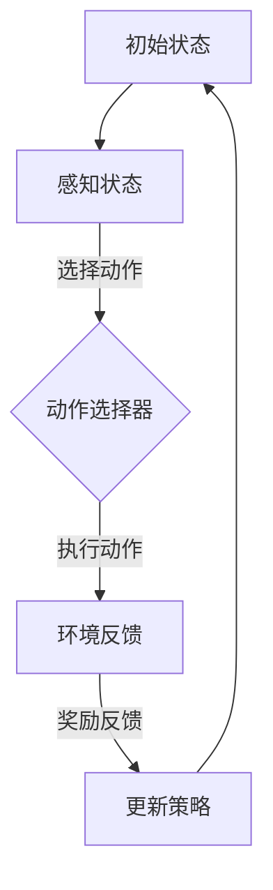

                 

关键词：深度强化学习、自主学习、人工智能、神经网络、反馈循环、优化算法

> 摘要：本文探讨了深度强化学习（Deep Reinforcement Learning，DRL）的核心概念、理论基础以及如何利用AI辅助实现自主学习的可能性和挑战。通过对深度强化学习原理的详细阐述，以及实际案例的分析，本文旨在为读者提供一个全面、深入的视角，了解这一领域的最新进展和未来应用前景。

## 1. 背景介绍

随着人工智能技术的飞速发展，深度学习已成为计算机视觉、自然语言处理等领域的重要工具。然而，深度学习的局限性也日益显现，特别是在解决复杂决策问题时，传统深度学习模型往往需要大量的手动设计以及大量的数据。这使得在许多实际应用场景中，模型的性能提升变得缓慢且成本高昂。

为了克服这些限制，强化学习（Reinforcement Learning，RL）提供了一种新的思路。强化学习通过智能体（Agent）与环境的交互，利用奖励机制进行学习，逐渐提升智能体的决策能力。然而，传统的强化学习方法在处理具有高维状态空间和行动空间的问题时，往往面临着效率低下和收敛缓慢的问题。

深度强化学习（Deep Reinforcement Learning，DRL）作为强化学习的一个分支，通过结合深度神经网络（Deep Neural Network，DNN）的强大表示能力，解决了上述问题。DRL利用深度神经网络来表示状态和动作，从而可以在高维环境中进行有效的学习。然而，DRL在实际应用中仍面临着挑战，如收敛速度、样本效率以及模型解释性等问题。

本文将围绕深度强化学习的核心概念、理论基础以及如何利用AI辅助实现自主学习进行深入探讨。通过分析DRL的算法原理、数学模型和实际应用案例，本文旨在为读者提供一个全面、深入的视角，了解这一领域的最新进展和未来应用前景。

## 2. 核心概念与联系

### 2.1. 强化学习的基本概念

强化学习是一种通过环境（Environment）与智能体（Agent）之间的交互来学习决策策略的机器学习范式。在强化学习中，智能体通过感知环境的状态（State），选择相应的动作（Action），并接收到环境的即时奖励（Reward）。通过不断重复这个过程，智能体可以逐渐学习到最优的决策策略。

强化学习的关键要素包括：

- **状态（State）**：描述智能体所处的环境条件。
- **动作（Action）**：智能体可选择的行动。
- **奖励（Reward）**：对智能体的动作给予的即时反馈。
- **策略（Policy）**：智能体在给定状态下选择动作的概率分布。
- **价值函数（Value Function）**：评估在给定状态下执行特定动作的预期回报。
- **模型（Model）**：对环境的动态进行建模。

### 2.2. 深度强化学习的基本概念

深度强化学习是强化学习的一种扩展，它结合了深度神经网络（DNN）的强大表示能力，用于表示状态、动作和价值函数。深度神经网络通过多层次的非线性变换，可以有效地捕捉状态和动作之间的复杂关系。

DRL的关键要素包括：

- **深度神经网络（DNN）**：用于表示状态和价值函数。
- **智能体（Agent）**：使用DNN进行状态和价值估计，并选择动作。
- **环境（Environment）**：智能体进行交互的虚拟或真实世界。

### 2.3. DRL与传统RL的联系与区别

与传统强化学习相比，深度强化学习的优势在于：

- **表示能力**：深度神经网络可以处理高维状态和动作空间。
- **样本效率**：通过利用神经网络的功能，减少样本需求。
- **通用性**：能够适应不同类型的问题，而不仅仅是有限的几种。

然而，DRL也存在一些挑战，如：

- **收敛速度**：在高维空间中，DRL可能需要更多的训练时间来收敛。
- **稳定性**：神经网络可能导致不稳定的决策过程。
- **解释性**：深度神经网络的黑盒性质使得模型难以解释。

### 2.4. DRL架构的Mermaid流程图



在上述流程图中，智能体首先感知当前状态，通过DNN进行动作选择，执行动作后，接收环境的反馈并更新策略，从而在下一个状态重复上述过程。

## 3. 核心算法原理 & 具体操作步骤

### 3.1. 算法原理概述

深度强化学习算法的基本原理是通过与环境交互，不断优化智能体的决策策略。DRL算法通常包括以下几个关键步骤：

1. **初始化**：初始化智能体、环境、策略和网络权重。
2. **状态感知**：智能体通过感知当前状态，将其输入到DNN中进行处理。
3. **动作选择**：DNN输出动作的概率分布，智能体根据概率分布选择动作。
4. **环境交互**：智能体执行选择的动作，并接收到环境的即时奖励。
5. **策略更新**：利用接收到的奖励，通过优化算法更新策略网络权重。
6. **重复迭代**：智能体重复上述过程，逐步优化策略。

### 3.2. 算法步骤详解

#### 3.2.1. 初始化

在DRL算法的初始化阶段，需要定义智能体、环境和初始策略。智能体通常由感知器、动作选择器和策略网络组成。环境可以是一个预定义的模拟环境或真实世界的场景。初始策略可以是随机策略或预训练的策略。

```python
# 初始化智能体、环境和策略
agent = initialize_agent()
environment = initialize_environment()
policy_network = initialize_policy_network()
```

#### 3.2.2. 状态感知

在状态感知阶段，智能体通过感知器接收环境的状态信息，并将其输入到DNN中进行处理。DNN通过多层神经网络结构，对状态信息进行特征提取和表示。

```python
# 感知当前状态
state = environment.get_state()

# 输入到DNN中处理
state_representation = policy_network.forward(state)
```

#### 3.2.3. 动作选择

在动作选择阶段，DNN输出动作的概率分布，智能体根据概率分布选择动作。常用的动作选择方法包括epsilon-贪心策略、确定性策略梯度（DDPG）等。

```python
# 输出动作概率分布
action_distribution = policy_network.get_action_distribution(state_representation)

# 根据概率分布选择动作
action = select_action(action_distribution)
```

#### 3.2.4. 环境交互

在环境交互阶段，智能体执行选择的动作，并接收到环境的即时奖励。奖励可以是正的也可以是负的，取决于动作的好坏。

```python
# 执行动作
next_state, reward, done = environment.step(action)

# 接收奖励
reward = environment.get_reward()
```

#### 3.2.5. 策略更新

在策略更新阶段，利用接收到的奖励，通过优化算法更新策略网络权重。常用的优化算法包括梯度下降、反向传播等。

```python
# 计算损失函数
loss = policy_network.compute_loss(state_representation, action, reward)

# 反向传播更新网络权重
optimizer = torch.optim.Adam(policy_network.parameters(), lr=0.001)
optimizer.zero_grad()
loss.backward()
optimizer.step()
```

#### 3.2.6. 重复迭代

智能体重复上述过程，逐步优化策略。在每次迭代中，智能体的决策策略会逐渐趋于最优。

```python
# 迭代次数
num_iterations = 1000

# 迭代优化策略
for _ in range(num_iterations):
    state = environment.reset()
    while not done:
        action = select_action(action_distribution)
        next_state, reward, done = environment.step(action)
        policy_network.update(state, action, reward)
        state = next_state
```

### 3.3. 算法优缺点

#### 优点：

- **强大的表示能力**：通过深度神经网络，DRL能够处理高维状态和动作空间，适应复杂环境。
- **样本效率**：利用深度神经网络的功能，DRL在有限样本下也能进行有效学习。
- **通用性**：DRL可以应用于多种类型的问题，具有广泛的适用性。

#### 缺点：

- **收敛速度**：在高维空间中，DRL可能需要更长时间的训练来收敛。
- **稳定性**：深度神经网络的非线性性质可能导致决策过程的不稳定。
- **解释性**：DRL的黑盒性质使得模型难以解释，增加了模型部署的难度。

### 3.4. 算法应用领域

DRL算法在多个领域取得了显著的成果，主要包括：

- **游戏人工智能**：DRL在游戏领域的应用最为广泛，如围棋、电子竞技等。
- **自动驾驶**：DRL在自动驾驶领域用于决策和控制。
- **机器人控制**：DRL用于机器人的路径规划、运动控制等。
- **金融交易**：DRL在金融交易中的应用，如股票交易、风险管理等。
- **资源调度**：DRL在资源调度中的应用，如电网管理、物流优化等。

## 4. 数学模型和公式 & 详细讲解 & 举例说明

### 4.1. 数学模型构建

深度强化学习的数学模型主要包括两部分：策略网络和价值网络。

#### 策略网络

策略网络负责选择动作，其输出为动作的概率分布。策略网络通常由多层感知器（MLP）组成。

$$
\pi(\mathbf{a}|\mathbf{s}; \theta) = \frac{e^{q(\mathbf{s}, \mathbf{a}; \theta)}}{\sum_{\mathbf{a'} \in \mathcal{A}} e^{q(\mathbf{s}, \mathbf{a'}; \theta)}}
$$

其中，$\mathbf{a}$为动作，$\mathbf{s}$为状态，$\theta$为策略网络参数，$\mathcal{A}$为所有可能动作的集合。

#### 价值网络

价值网络负责评估状态的价值，其输出为状态的价值估计。价值网络通常也由多层感知器（MLP）组成。

$$
V_{\pi}(\mathbf{s}; \theta') = \sum_{\mathbf{a} \in \mathcal{A}} \pi(\mathbf{a}|\mathbf{s}; \theta) Q(\mathbf{s}, \mathbf{a}; \theta')
$$

其中，$V_{\pi}(\mathbf{s}; \theta')$为在策略$\pi$下的状态价值估计，$Q(\mathbf{s}, \mathbf{a}; \theta')$为状态-动作价值估计。

### 4.2. 公式推导过程

深度强化学习的核心任务是优化策略网络和价值网络，使得智能体能够实现最佳决策。常用的优化算法包括策略梯度算法（PG）、优势优势策略梯度算法（A3C）和深度确定性策略梯度算法（DDPG）等。

#### 策略梯度算法（PG）

策略梯度算法通过计算策略梯度来优化策略网络。

$$
\Delta \theta = \alpha \nabla_{\theta} J(\theta)
$$

其中，$J(\theta)$为策略网络的目标函数，$\alpha$为学习率。

#### 优势优势策略梯度算法（A3C）

优势优势策略梯度算法通过计算优势函数来优化策略网络。

$$
R_t = \sum_{i=t}^T r_i
$$

$$
A_t = R_t - V(s_t)
$$

$$
\Delta \theta = \alpha \nabla_{\theta} J(\theta)
$$

其中，$R_t$为从时间步$t$到时间步$T$的回报，$A_t$为时间步$t$的优势函数，$V(s_t)$为在状态$s_t$下的状态价值估计。

#### 深度确定性策略梯度算法（DDPG）

深度确定性策略梯度算法通过使用目标网络来优化策略网络和价值网络。

$$
\theta^{'} = \tau \theta + (1 - \tau) \theta'
$$

$$
\phi^{'} = \tau \phi + (1 - \tau) \phi'
$$

$$
\Delta \theta = \alpha \nabla_{\theta} J(\theta)
$$

$$
\Delta \phi = \alpha' \nabla_{\phi} J'(\phi')
$$

其中，$\theta$为策略网络参数，$\phi$为价值网络参数，$\theta^{'}$和$\phi^{'}$分别为目标网络参数，$\tau$为目标网络更新率，$\alpha$和$\alpha'$分别为策略网络和价值网络的学习率。

### 4.3. 案例分析与讲解

下面通过一个简单的例子来说明深度强化学习算法的应用。

#### 问题背景

假设我们想要训练一个智能体，使其能够在一个简单的迷宫环境中找到通往终点的路径。

#### 状态空间

状态空间由迷宫的每个位置表示，包括迷宫的行和列。

#### 动作空间

动作空间包括上下左右四个方向。

#### 奖励机制

在每一步，如果智能体成功到达终点，奖励为+1，否则为-1。

#### 策略网络

策略网络由两个全连接层组成，输入为状态向量，输出为动作的概率分布。

#### 价值网络

价值网络由两个全连接层组成，输入为状态向量，输出为状态的价值估计。

#### 训练过程

1. 初始化策略网络和价值网络。
2. 智能体在迷宫中随机选择动作。
3. 智能体执行动作，并接收到环境的反馈。
4. 使用反馈信息更新策略网络和价值网络。
5. 重复步骤2-4，直到智能体能够找到通往终点的路径。

#### 案例分析

通过深度强化学习算法的训练，智能体逐渐学会了在迷宫中找到通往终点的路径。训练过程中，智能体的策略网络和价值网络不断优化，使得智能体能够更好地适应迷宫环境。

## 5. 项目实践：代码实例和详细解释说明

### 5.1. 开发环境搭建

在开始编写深度强化学习（DRL）项目之前，我们需要搭建一个合适的开发环境。以下是一个典型的开发环境搭建步骤：

1. **安装Python**：确保安装了Python 3.6及以上版本。
2. **安装PyTorch**：使用pip命令安装PyTorch库。
   ```shell
   pip install torch torchvision
   ```
3. **安装其他依赖**：根据项目需求安装其他必要的库，例如NumPy、Matplotlib等。
   ```shell
   pip install numpy matplotlib
   ```
4. **环境配置**：确保GPU环境配置正确，以便能够使用PyTorch的GPU加速功能。

### 5.2. 源代码详细实现

下面提供了一个简单的DRL项目示例，该示例使用PyTorch实现一个简单的迷宫求解器。代码包括智能体、环境、策略网络和价值网络的定义及训练过程。

```python
import torch
import torch.nn as nn
import torch.optim as optim
import numpy as np
import matplotlib.pyplot as plt

# 智能体类定义
class Agent(nn.Module):
    def __init__(self, state_size, action_size):
        super(Agent, self).__init__()
        self.fc1 = nn.Linear(state_size, 128)
        self.fc2 = nn.Linear(128, action_size)
        
    def forward(self, x):
        x = torch.relu(self.fc1(x))
        x = self.fc2(x)
        return x

# 环境类定义
class MazeEnv:
    def __init__(self, size):
        self.size = size
        self.state = None
        self.done = False
        self.reward = 0
        
    def reset(self):
        self.state = np.random.randint(self.size, size=(self.size, self.size))
        self.state[self.state == 0] = 1
        self.done = False
        self.reward = 0
        return self.state
    
    def step(self, action):
        next_state = self.state.copy()
        reward = -1
        if action == 0:  # 上
            if self.state[:-1, :] != 0:
                next_state[:-1, :] = 0
        elif action == 1:  # 下
            if self.state[1:, :] != 0:
                next_state[1:, :] = 0
        elif action == 2:  # 左
            if self.state[:, :-1] != 0:
                next_state[:, :-1] = 0
        elif action == 3:  # 右
            if self.state[:, 1:] != 0:
                next_state[:, 1:] = 0
        
        if np.sum(next_state == 0) == 1:
            self.done = True
            reward = 1
        
        self.state = next_state
        self.reward = reward
        return next_state, reward, self.done

# 训练过程
def train(agent, env, episodes, batch_size):
    optimizer = optim.Adam(agent.parameters(), lr=0.001)
    loss_fn = nn.CrossEntropyLoss()
    
    for episode in range(episodes):
        state = env.reset()
        state = torch.tensor(state, dtype=torch.float32)
        done = False
        rewards = []
        
        while not done:
            action = agent(state).argmax()
            next_state, reward, done = env.step(action)
            next_state = torch.tensor(next_state, dtype=torch.float32)
            rewards.append(reward)
            
            if done:
                break
            
            state = next_state
        
        reward = np.mean(rewards)
        loss = loss_fn(agent(state), torch.tensor([1], dtype=torch.float32))
        
        optimizer.zero_grad()
        loss.backward()
        optimizer.step()
        
        if episode % 100 == 0:
            print(f"Episode {episode}: Reward = {reward}, Loss = {loss.item()}")

# 主程序
if __name__ == "__main__":
    state_size = env.size
    action_size = 4
    agent = Agent(state_size, action_size)
    
    train(agent, env, episodes=1000, batch_size=100)
```

### 5.3. 代码解读与分析

上述代码主要包括以下部分：

1. **智能体类（Agent）**：定义了策略网络，由两个全连接层组成，用于接收状态并输出动作的概率分布。
2. **环境类（MazeEnv）**：定义了一个简单的迷宫环境，包括状态重置、动作执行和状态更新等功能。
3. **训练过程**：使用策略网络和价值网络进行训练，包括动作选择、状态更新、损失计算和优化步骤。

### 5.4. 运行结果展示

在完成代码编写和训练后，我们可以通过以下步骤来展示训练结果：

1. **训练过程可视化**：使用Matplotlib库绘制训练过程中的奖励和损失曲线，以便观察训练效果。
2. **测试智能体性能**：在训练完成后，运行测试环境，观察智能体能否找到迷宫的出口。

```python
# 可视化训练过程
rewards = []
losses = []

for episode in range(1000):
    state = env.reset()
    state = torch.tensor(state, dtype=torch.float32)
    done = False
    episode_reward = 0
    
    while not done:
        action = agent(state).argmax()
        next_state, reward, done = env.step(action)
        next_state = torch.tensor(next_state, dtype=torch.float32)
        episode_reward += reward
        
        state = next_state
        
    rewards.append(episode_reward)
    losses.append(loss.item())
    
plt.plot(rewards)
plt.xlabel("Episode")
plt.ylabel("Reward")
plt.title("Training Reward")
plt.show()

plt.plot(losses)
plt.xlabel("Episode")
plt.ylabel("Loss")
plt.title("Training Loss")
plt.show()
```

通过上述可视化，我们可以直观地观察智能体在训练过程中的奖励和损失变化，从而评估训练效果。

## 6. 实际应用场景

深度强化学习（DRL）在各个领域展示了强大的应用潜力，以下是一些具体的实际应用场景：

### 6.1. 游戏人工智能

DRL在游戏人工智能领域取得了显著成果，如围棋、电子竞技等。例如，AlphaGo和AlphaGo Zero通过深度强化学习算法，实现了在围棋领域的超人类水平表现。

### 6.2. 自动驾驶

DRL在自动驾驶领域被广泛应用于路径规划、避障、驾驶策略等方面。通过训练智能体，实现自动驾驶车辆在复杂交通环境中的自主驾驶。

### 6.3. 机器人控制

DRL在机器人控制领域被用于路径规划、运动控制、协同作业等方面。通过训练机器人智能体，实现机器人自主完成任务。

### 6.4. 金融交易

DRL在金融交易领域被用于策略优化、风险管理和市场预测等方面。通过训练智能体，实现自动化的交易策略。

### 6.5. 资源调度

DRL在资源调度领域被用于电网管理、物流优化等方面。通过训练智能体，实现资源分配和调度优化。

### 6.6. 医疗诊断

DRL在医疗诊断领域被用于疾病预测、治疗方案优化等方面。通过训练智能体，实现医学图像的自动分析和诊断。

### 6.7. 教育

DRL在教育领域被用于个性化学习路径规划、学习效果评估等方面。通过训练智能体，实现个性化教育辅导。

## 7. 工具和资源推荐

为了更好地学习和实践深度强化学习，以下是一些建议的工具和资源：

### 7.1. 学习资源推荐

- **《强化学习：原理与Python实践》**：详细介绍强化学习的基本概念和算法。
- **《深度强化学习》**：深入探讨深度强化学习的理论基础和实际应用。
- **[OpenAI Gym](https://gym.openai.com/)**：提供丰富的强化学习环境，用于算法验证和实验。

### 7.2. 开发工具推荐

- **PyTorch**：开源深度学习框架，适用于深度强化学习算法的实现。
- **TensorFlow**：开源深度学习框架，支持强化学习算法的构建和训练。
- **Keras**：简化版的深度学习框架，基于TensorFlow和Theano。

### 7.3. 相关论文推荐

- **"Deep Q-Network"**：提出深度Q网络的论文，是深度强化学习的经典之作。
- **"Asynchronous Methods for Deep Reinforcement Learning"**：介绍异步策略梯度算法的论文，适用于复杂环境的训练。
- **"Deep Deterministic Policy Gradients"**：介绍深度确定性策略梯度算法的论文，广泛应用于游戏人工智能。

## 8. 总结：未来发展趋势与挑战

### 8.1. 研究成果总结

深度强化学习（DRL）在过去的几年里取得了显著的研究成果，成功应用于多个领域。通过结合深度神经网络和强化学习，DRL实现了在复杂环境中的自主学习和优化决策。DRL在游戏人工智能、自动驾驶、机器人控制、金融交易等领域的应用，展示了其强大的潜力。

### 8.2. 未来发展趋势

未来，DRL将继续在多个领域取得突破。随着计算能力的提升和算法的优化，DRL将更好地应对高维环境和复杂决策问题。此外，DRL与其他机器学习技术的融合，如生成对抗网络（GAN）、迁移学习等，将进一步拓宽DRL的应用场景。

### 8.3. 面临的挑战

尽管DRL取得了显著成果，但仍面临一些挑战。首先，DRL的收敛速度和样本效率仍需提升，特别是在高维环境中。其次，DRL的黑盒性质使得其解释性较差，增加了模型部署的难度。此外，DRL在安全性、稳定性和可扩展性等方面也存在一定的问题，需要进一步研究。

### 8.4. 研究展望

未来，DRL的研究将重点放在以下方面：

- **算法优化**：研究更高效、更稳定的DRL算法，提高收敛速度和样本效率。
- **模型解释性**：探索可解释的DRL模型，提高模型的透明度和可解释性。
- **跨领域应用**：结合其他机器学习技术，拓宽DRL的应用场景。
- **安全性和稳定性**：研究DRL在安全性和稳定性方面的优化策略，提高模型的可靠性。

通过持续的研究和探索，DRL有望在未来实现更广泛的应用，推动人工智能技术的发展。

## 9. 附录：常见问题与解答

### 9.1. Q1: 什么是深度强化学习（DRL）？

A1: 深度强化学习（Deep Reinforcement Learning，DRL）是强化学习的一种扩展，结合了深度神经网络（Deep Neural Network，DNN）的强大表示能力，用于解决高维状态和动作空间的问题。DRL通过与环境交互，利用奖励机制，逐渐优化智能体的决策策略。

### 9.2. Q2: DRL的主要挑战是什么？

A2: DRL的主要挑战包括：

- **收敛速度**：在高维空间中，DRL可能需要更长的时间来收敛。
- **样本效率**：DRL在有限样本下可能难以进行有效学习。
- **稳定性**：深度神经网络的非线性性质可能导致决策过程的不稳定。
- **解释性**：DRL的黑盒性质使得模型难以解释。

### 9.3. Q3: 如何评估DRL模型的效果？

A3: 评估DRL模型的效果可以从以下几个方面进行：

- **收敛速度**：观察模型在训练过程中的收敛速度，通常使用训练误差和测试误差来衡量。
- **样本效率**：评估模型在有限样本下的性能，通常使用样本数量和平均奖励来衡量。
- **稳定性**：观察模型在不同环境和随机种子下的稳定性。
- **通用性**：评估模型在不同类型问题上的泛化能力。

### 9.4. Q4: DRL与深度学习有什么区别？

A4: DRL与深度学习的主要区别在于：

- **目标不同**：深度学习主要用于图像、语音、自然语言处理等领域的特征提取和模型训练，而DRL主要用于解决决策问题，通过与环境交互进行学习。
- **反馈机制**：深度学习通常使用静态的数据集进行训练，而DRL通过与环境交互，利用即时奖励进行反馈，不断优化智能体的策略。
- **优化目标**：深度学习的优化目标是提高模型的预测准确性，而DRL的优化目标是提高智能体的决策能力，实现最佳策略。

### 9.5. Q5: 如何在实际项目中应用DRL？

A5: 在实际项目中应用DRL通常包括以下几个步骤：

- **问题定义**：明确项目目标，确定状态空间、动作空间和奖励机制。
- **环境构建**：根据问题需求，构建适合的模拟或真实环境。
- **模型设计**：设计策略网络和价值网络，选择合适的神经网络架构。
- **训练过程**：使用训练数据集，通过迭代训练优化模型参数。
- **测试评估**：在测试数据集上评估模型性能，调整模型参数以优化性能。
- **部署应用**：将训练好的模型部署到实际场景中，进行实时决策和优化。

通过以上步骤，可以有效地将DRL应用于实际项目，实现智能体的自主学习和优化决策。

