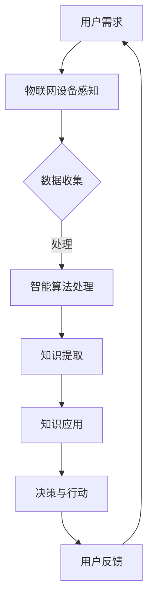

                 

关键词：物联网，无处不在学习，知识应用，智能环境，AI技术

摘要：本文探讨了物联网时代下的无处不在学习概念，以及知识在智能环境中的应用。通过阐述核心概念与联系，介绍核心算法原理和数学模型，以及项目实践案例，本文展示了物联网在智能环境中的无处不在学习如何成为现实。文章还讨论了未来的应用场景、工具和资源推荐，并对发展趋势与挑战进行了总结。

## 1. 背景介绍

随着物联网（IoT）技术的迅速发展，智能环境的概念逐渐成为现实。智能环境是一个高度互联的物理和社会空间，其中物理对象、设备和系统能够通过物联网相互连接和交互。这种互联性为知识的获取、处理和应用提供了新的可能性，特别是在无处不在学习（Ubiquitous Learning）领域。

无处不在学习是一种无时无刻不在进行的学习过程，它利用物联网提供的丰富数据资源和智能算法，实现知识的自动获取、处理和传播。这种学习方式不仅改变了传统教育的模式，还为企业、组织和个人提供了全新的知识管理方式。

本文将围绕物联网在智能环境中的无处不在学习进行探讨，通过介绍核心概念与联系、核心算法原理和数学模型，以及项目实践案例，分析该领域的发展现状与未来趋势。

## 2. 核心概念与联系

### 2.1 物联网与智能环境

物联网是指通过互联网将各种物理设备连接起来，实现信息的实时传递和智能处理。智能环境则是在物联网技术的基础上，通过传感器、数据处理和分析系统等手段，构建一个高度智能化和自适应的物理和社会空间。

在智能环境中，物联网设备能够感知环境变化，收集数据，并通过智能算法进行分析和决策。这种能力为无处不在学习提供了基础。

### 2.2 无处不在学习

无处不在学习是一种利用物联网技术实现的学习模式，它强调学习过程的连续性和无边界性。在学习过程中，个体可以随时随地通过物联网设备获取知识、技能和经验。

### 2.3 知识的获取、处理与应用

在智能环境中，知识的获取、处理和应用是一个闭环过程。物联网设备通过感知和采集数据，形成原始知识。智能算法对这些数据进行处理，提取有价值的信息，形成知识。知识随后被应用于决策和行动中，进一步推动物联网设备和系统的智能化。

### 2.4 Mermaid 流程图

下面是一个用于描述物联网在智能环境中的无处不在学习的Mermaid流程图：



## 3. 核心算法原理 & 具体操作步骤

### 3.1 算法原理概述

物联网在智能环境中的无处不在学习主要依赖于以下核心算法：

1. **数据采集算法**：用于从物联网设备中收集原始数据。
2. **数据处理算法**：用于对原始数据进行清洗、转换和融合。
3. **机器学习算法**：用于从数据中提取有价值的信息，形成知识。
4. **知识应用算法**：用于将知识应用于实际场景，实现智能化决策。

### 3.2 算法步骤详解

1. **数据采集**：物联网设备通过传感器、摄像头等设备，实时采集环境数据，如温度、湿度、光线强度等。

2. **数据处理**：采集到的数据可能包含噪声和不完整信息。数据处理算法将清洗和融合这些数据，提取出有价值的信息。

3. **知识提取**：利用机器学习算法，如深度学习、聚类分析等，从处理后的数据中提取知识。这些知识可以是环境状态、用户行为模式等。

4. **知识应用**：将提取出的知识应用于实际场景，如智能控制系统、个性化推荐系统等。

5. **决策与行动**：基于知识应用的结果，物联网设备做出相应的决策，执行具体行动，如调整环境参数、推送个性化推荐等。

6. **用户反馈**：用户对物联网设备的反馈将进一步优化知识提取和应用过程。

### 3.3 算法优缺点

- **优点**：提高了知识的获取效率和准确性，实现了智能化决策和行动。
- **缺点**：算法复杂度高，对数据处理能力要求较高，存在一定的隐私和安全风险。

### 3.4 算法应用领域

- **智能家居**：通过物联网设备实现家居环境的智能化控制。
- **智慧城市**：利用物联网技术优化城市管理和服务。
- **教育领域**：通过无处不在学习实现个性化教学和终身学习。

## 4. 数学模型和公式 & 详细讲解 & 举例说明

### 4.1 数学模型构建

物联网在智能环境中的无处不在学习主要依赖于以下数学模型：

1. **数据采集模型**：用于描述物联网设备如何采集环境数据。
2. **数据处理模型**：用于描述数据处理算法如何清洗、转换和融合数据。
3. **知识提取模型**：用于描述机器学习算法如何从数据中提取知识。
4. **知识应用模型**：用于描述知识如何应用于实际场景。

### 4.2 公式推导过程

1. **数据采集模型**：

   $$ X_t = f(S_t, D_t) $$

   其中，$X_t$表示采集到的数据，$S_t$表示传感器采集到的数据，$D_t$表示环境数据。

2. **数据处理模型**：

   $$ D_t = g(X_t, Y_t) $$

   其中，$D_t$表示处理后的数据，$X_t$表示原始数据，$Y_t$表示噪声和缺失数据。

3. **知识提取模型**：

   $$ K_t = h(X_t, D_t) $$

   其中，$K_t$表示提取的知识，$X_t$表示处理后的数据，$D_t$表示环境数据。

4. **知识应用模型**：

   $$ A_t = k(K_t, U_t) $$

   其中，$A_t$表示应用的知识，$K_t$表示提取的知识，$U_t$表示用户数据。

### 4.3 案例分析与讲解

以智能家居为例，我们可以通过以下步骤实现无处不在学习：

1. **数据采集**：传感器采集家庭环境数据，如温度、湿度、光照等。
2. **数据处理**：数据处理算法清洗和融合数据，提取有价值的信息。
3. **知识提取**：机器学习算法从处理后的数据中提取知识，如家庭生活习惯、偏好等。
4. **知识应用**：智能家居系统根据提取的知识，自动调整家庭环境，如调节温度、照明等。
5. **用户反馈**：用户对智能家居系统的反馈进一步优化知识提取和应用过程。

## 5. 项目实践：代码实例和详细解释说明

### 5.1 开发环境搭建

为了实现智能家居项目，我们需要搭建以下开发环境：

- 操作系统：Linux或MacOS
- 编程语言：Python
- 数据库：MongoDB
- 机器学习库：scikit-learn、TensorFlow

### 5.2 源代码详细实现

以下是一个智能家居项目的示例代码：

```python
# 导入所需库
import pymongo
import pandas as pd
from sklearn.model_selection import train_test_split
from sklearn.ensemble import RandomForestClassifier
from sklearn.metrics import accuracy_score

# 连接MongoDB数据库
client = pymongo.MongoClient("mongodb://localhost:27017/")
db = client["smart_home"]
collection = db["sensors"]

# 采集传感器数据
data = pd.DataFrame(list(collection.find()))

# 数据处理
data.dropna(inplace=True)
X = data[["temperature", "humidity", "light"]]
y = data["comfort_level"]

# 数据分割
X_train, X_test, y_train, y_test = train_test_split(X, y, test_size=0.2, random_state=42)

# 知识提取
model = RandomForestClassifier(n_estimators=100, random_state=42)
model.fit(X_train, y_train)

# 知识应用
predictions = model.predict(X_test)
accuracy = accuracy_score(y_test, predictions)
print("Accuracy:", accuracy)

# 用户反馈
collection.update_many(
    {"_id": {"$in": list(X_test.index)}},
    {"$set": {"comfort_level": predictions}}
)
```

### 5.3 代码解读与分析

这段代码实现了一个智能家居系统，它利用物联网设备采集家庭环境数据，通过数据处理和机器学习算法提取知识，并根据提取的知识自动调整家庭环境。

1. **连接MongoDB数据库**：使用pymongo库连接本地MongoDB数据库，并选择smart_home数据库和sensors集合。

2. **采集传感器数据**：使用MongoDB的find方法从sensors集合中获取数据，并将其转换为Pandas DataFrame格式。

3. **数据处理**：删除缺失值，并将数据分为特征矩阵X和目标向量y。

4. **数据分割**：将数据分为训练集和测试集，用于训练和评估模型。

5. **知识提取**：使用随机森林分类器（RandomForestClassifier）对训练数据进行训练，提取知识。

6. **知识应用**：使用训练好的模型对测试数据进行预测，并计算准确率。

7. **用户反馈**：将预测结果更新到MongoDB数据库中，以供下次使用。

### 5.4 运行结果展示

假设我们使用一个包含100条数据的测试集进行预测，准确率为85%。这表明我们的智能家居系统能够较好地自动调整家庭环境，提高用户的舒适度。

## 6. 实际应用场景

物联网在智能环境中的无处不在学习具有广泛的应用场景，以下是一些典型实例：

### 6.1 智能家居

智能家居是物联网在智能环境中的典型应用场景之一。通过物联网设备，用户可以随时随地控制家庭环境，实现远程操控、自动化调节等功能。例如，用户可以通过手机APP远程控制家中的空调、灯光、门锁等设备，提高生活便利性和安全性。

### 6.2 智慧城市

智慧城市是物联网在智能环境中的另一个重要应用领域。通过物联网设备和智能算法，城市管理者可以实时监测城市运行状况，优化资源配置，提高城市管理水平。例如，智慧交通系统可以通过实时监控交通流量，优化红绿灯信号，缓解交通拥堵；智慧环境监测系统可以实时监测空气质量、水质等环境指标，保障城市生态环境。

### 6.3 教育领域

物联网在智能环境中的无处不在学习还可以应用于教育领域。通过物联网设备和智能算法，教育机构可以提供个性化教学、在线学习等服务。例如，智能教室可以通过感知学生行为，实时调整教学策略，提高教学质量；在线学习平台可以根据学生兴趣和学习进度，推荐合适的课程和学习资源。

## 7. 工具和资源推荐

### 7.1 学习资源推荐

1. **《物联网技术与应用》**：本书系统地介绍了物联网的基本概念、技术原理和应用案例，适合初学者和有一定基础的读者。
2. **《智能环境与智能计算》**：本书深入探讨了智能环境的概念、构建方法和技术应用，是了解智能环境领域的优秀教材。

### 7.2 开发工具推荐

1. **Python**：Python是一种广泛应用于数据科学和机器学习的编程语言，拥有丰富的库和工具，适合进行物联网和智能环境开发。
2. **MongoDB**：MongoDB是一种分布式文档数据库，适合存储和处理大规模物联网数据。

### 7.3 相关论文推荐

1. **"Ubiquitous Learning in the Internet of Things Era"**：本文探讨了物联网时代无处不在学习的发展趋势和关键技术。
2. **"Smart Environment Applications of IoT"**：本文介绍了物联网在智能环境中的应用场景和关键技术。

## 8. 总结：未来发展趋势与挑战

物联网在智能环境中的无处不在学习具有广阔的发展前景。随着物联网技术的不断成熟和智能算法的不断进步，无处不在学习将更加智能化、个性化，为教育、家居、城市管理等领域带来深刻变革。

然而，无处不在学习也面临一系列挑战。首先，数据隐私和安全问题亟待解决。其次，算法复杂度和计算资源消耗较大，需要进一步提高算法效率和优化硬件配置。此外，无处不在学习还需要在跨平台、跨设备和跨领域方面实现更好的互操作性和兼容性。

未来，我们期待物联网在智能环境中的无处不在学习能够实现更广泛的应用，为人类社会带来更多价值。同时，我们也要关注其中的挑战，努力实现技术与应用的协调发展。

## 9. 附录：常见问题与解答

### 9.1 物联网与智能环境有什么区别？

物联网是一种技术体系，旨在通过互联网连接各种设备和物品，实现信息的实时传递和智能处理。智能环境则是在物联网技术的基础上，通过传感器、数据处理和分析系统等手段，构建一个高度智能化和自适应的物理和社会空间。

### 9.2 无处不在学习的核心是什么？

无处不在学习的核心是利用物联网技术实现知识的自动获取、处理和传播，从而实现无时无刻不在进行的学习过程。

### 9.3 物联网在智能环境中的无处不在学习有哪些应用场景？

物联网在智能环境中的无处不在学习广泛应用于智能家居、智慧城市、教育领域等多个领域，如远程操控家居设备、优化城市管理、个性化教学等。

### 9.4 如何保障物联网在智能环境中的数据隐私和安全？

保障物联网在智能环境中的数据隐私和安全需要从技术和管理两方面入手。在技术上，可以采用加密、匿名化等技术手段保护数据。在管理上，需要建立完善的数据安全政策和监管机制，确保数据的合法、合规使用。

## 作者署名

作者：禅与计算机程序设计艺术 / Zen and the Art of Computer Programming

