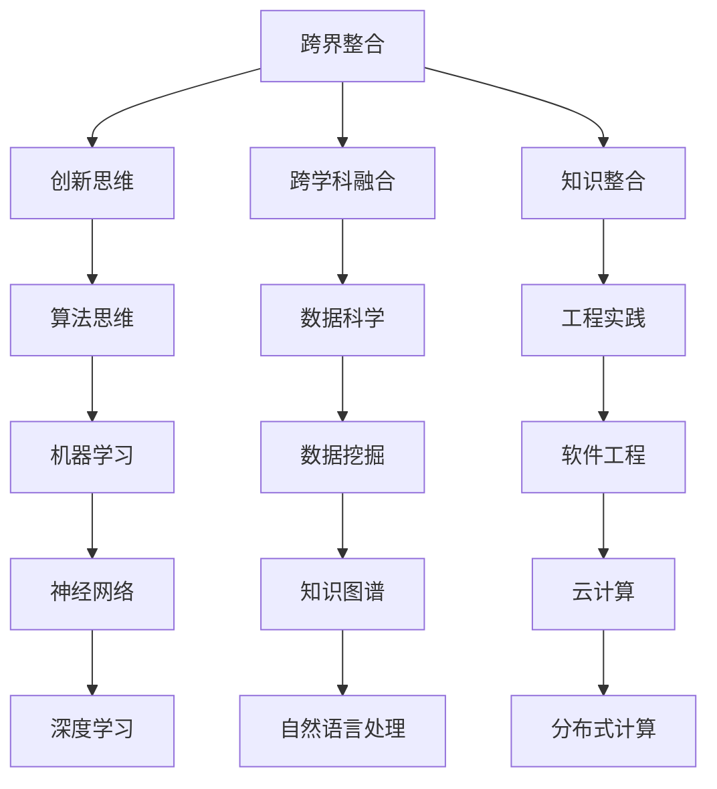

                 

关键词：跨界整合、创新、算法、数学模型、项目实践、未来展望

> 摘要：本文探讨了知识的跨界整合在推动科技创新中的重要作用。通过分析核心概念、算法原理、数学模型以及实际项目实践，揭示了跨界整合如何激发创新，并展望了未来在这一领域的发展趋势与挑战。

## 1. 背景介绍

在当今快速发展的科技时代，创新已经成为推动社会进步和经济发展的关键驱动力。然而，单纯的线性思维和技术积累已经无法满足日益复杂的问题解决需求。知识的跨界整合作为一种创新的催化剂，正日益受到关注。本文旨在探讨知识的跨界整合在创新过程中的作用，并分析其核心概念、算法原理、数学模型以及实际应用。

### 1.1 创新的重要性

创新不仅是企业发展的灵魂，更是国家竞争力的核心。在信息时代，创新的速度和广度决定了企业和国家在全球竞争中的地位。然而，创新并非易事，它需要跨学科的融合、创新思维的应用以及大量的实验和实践。

### 1.2 跨界整合的意义

跨界整合指的是将不同领域的知识、方法、技术和工具相互融合，形成新的解决方案和产品。这种整合不仅打破了传统学科之间的壁垒，也为创新提供了丰富的资源和可能性。

## 2. 核心概念与联系

为了更好地理解跨界整合，我们需要先了解一些核心概念，并展示它们之间的联系。



2.1 创新思维

创新思维是一种解决复杂问题的思维方式，它强调从多个角度看待问题，勇于尝试新的方法。创新思维在跨界整合中起着核心作用，因为它能够激发跨学科的合作和创新。

2.2 跨学科融合

跨学科融合是将不同学科的知识和理论结合起来，解决复杂问题的过程。例如，将计算机科学、数据科学、物理学和生物学的知识融合，可以开发出新的医疗技术和解决方案。

2.3 知识整合

知识整合是将不同来源的知识进行系统化、结构化的过程。通过知识整合，我们可以发现新的关联和规律，从而推动创新。

## 3. 核心算法原理 & 具体操作步骤

### 3.1 算法原理概述

在跨界整合中，核心算法原理起着关键作用。以下是一些重要的算法原理：

- **机器学习算法**：通过数据训练模型，实现自动识别和预测。
- **深度学习算法**：多层神经网络，可以自动提取特征并实现复杂任务。
- **数据挖掘算法**：从大量数据中发现模式和关联。
- **分布式计算算法**：在大规模数据集上进行并行计算。

### 3.2 算法步骤详解

3.2.1 机器学习算法

- **数据预处理**：清洗、归一化、缺失值处理等。
- **模型选择**：选择合适的机器学习模型，如线性回归、决策树、支持向量机等。
- **模型训练**：使用训练数据集训练模型。
- **模型评估**：使用测试数据集评估模型性能。
- **模型优化**：调整模型参数，提高性能。

3.2.2 深度学习算法

- **神经网络架构设计**：设计多层神经网络架构。
- **反向传播算法**：计算网络权重和偏置的梯度。
- **优化算法**：如梯度下降、Adam等。
- **训练与评估**：使用训练数据和测试数据评估模型性能。

3.2.3 数据挖掘算法

- **数据预处理**：去除无关特征、处理缺失值等。
- **特征选择**：选择对任务有显著影响的特征。
- **模式识别**：使用聚类、分类等算法发现数据中的模式。
- **结果评估**：评估挖掘结果的准确性、可靠性和实用性。

3.2.4 分布式计算算法

- **数据划分**：将大规模数据集划分到不同的节点上。
- **任务分配**：将计算任务分配给不同的节点。
- **结果汇总**：汇总各节点的计算结果。
- **负载均衡**：确保所有节点都有合适的计算负载。

### 3.3 算法优缺点

3.3.1 机器学习算法

**优点**：适用于各种复杂数据类型，具有自动特征提取能力。

**缺点**：对大规模数据集处理效率较低，容易过拟合。

3.3.2 深度学习算法

**优点**：可以处理大规模复杂数据，具有强大的特征学习能力。

**缺点**：训练过程需要大量数据和计算资源，容易陷入局部最优。

3.3.3 数据挖掘算法

**优点**：可以从大量数据中发现有价值的模式和关联。

**缺点**：对数据质量和特征选择依赖较大，挖掘结果可能不准确。

3.3.4 分布式计算算法

**优点**：可以处理大规模数据集，提高计算效率。

**缺点**：需要复杂的分布式系统架构，维护成本较高。

### 3.4 算法应用领域

3.4.1 机器学习算法

- **推荐系统**：基于用户历史行为和偏好进行个性化推荐。
- **图像识别**：用于图像分类、目标检测等任务。
- **自然语言处理**：用于文本分类、机器翻译等任务。

3.4.2 深度学习算法

- **自动驾驶**：用于环境感知、路径规划等任务。
- **语音识别**：用于语音到文字转换。
- **医疗诊断**：用于疾病检测、图像分析等任务。

3.4.3 数据挖掘算法

- **金融风控**：用于信用评估、风险预测等。
- **市场营销**：用于客户分析、广告投放等。
- **社会分析**：用于舆情监控、社会调查等。

3.4.4 分布式计算算法

- **搜索引擎**：用于处理海量网页数据。
- **数据仓库**：用于大数据分析和存储。
- **云计算平台**：用于分布式计算和存储服务。

## 4. 数学模型和公式 & 详细讲解 & 举例说明

### 4.1 数学模型构建

在跨界整合中，数学模型构建是关键步骤。以下是一个简单的线性回归模型的例子：

假设我们有一个包含 n 个样本的数据集 D = {x1, y1}, {x2, y2}, ..., {xn, yn}，其中每个样本 (xi, yi) 代表输入和输出。

线性回归模型可以表示为：

y = w * x + b

其中，w 是权重，b 是偏置，x 是输入，y 是输出。

### 4.2 公式推导过程

为了训练线性回归模型，我们需要找到合适的权重 w 和偏置 b。这可以通过最小化损失函数来实现：

J(w, b) = 1/2 * Σ(yi - (w * xi + b))^2

对 w 和 b 求导并令导数为零，可以得到最优解：

w = (X^T * X)^(-1) * X^T * y
b = y - w * X

其中，X 是输入矩阵，y 是输出向量。

### 4.3 案例分析与讲解

假设我们有一个数据集，其中包含 100 个样本，每个样本包含一个输入特征和输出标签。我们可以使用线性回归模型来预测输出标签。

首先，我们进行数据预处理，包括归一化和缺失值处理。

然后，我们将数据集划分为训练集和测试集，用于模型训练和评估。

接下来，我们使用梯度下降算法来训练线性回归模型。这里，我们选择批量梯度下降（BGD）作为优化算法。

在训练过程中，我们记录损失函数的变化情况，以评估模型性能。

最后，我们使用测试集来评估模型性能，并输出预测结果。

## 5. 项目实践：代码实例和详细解释说明

### 5.1 开发环境搭建

为了实现线性回归模型，我们首先需要搭建开发环境。以下是所需的环境和工具：

- Python 3.8 或以上版本
- NumPy 库
- Matplotlib 库
- Scikit-learn 库

在安装完上述工具后，我们可以开始编写代码。

### 5.2 源代码详细实现

```python
import numpy as np
import matplotlib.pyplot as plt
from sklearn.linear_model import LinearRegression
from sklearn.model_selection import train_test_split
from sklearn.metrics import mean_squared_error

# 数据预处理
def preprocess_data(data):
    X = data[:, 0].reshape(-1, 1)
    y = data[:, 1]
    X = np.append(np.ones((X.shape[0], 1)), X, axis=1)
    return X, y

# 训练模型
def train_model(X, y):
    model = LinearRegression()
    model.fit(X, y)
    return model

# 评估模型
def evaluate_model(model, X_test, y_test):
    y_pred = model.predict(X_test)
    mse = mean_squared_error(y_test, y_pred)
    return mse

# 案例数据
data = np.array([[1, 2], [2, 4], [3, 6], [4, 8], [5, 10]])

# 数据预处理
X, y = preprocess_data(data)

# 划分训练集和测试集
X_train, X_test, y_train, y_test = train_test_split(X, y, test_size=0.2, random_state=42)

# 训练模型
model = train_model(X_train, y_train)

# 评估模型
mse = evaluate_model(model, X_test, y_test)
print("MSE:", mse)

# 可视化结果
plt.scatter(X_train[:, 1], y_train, color='blue', label='Training')
plt.scatter(X_test[:, 1], y_test, color='red', label='Test')
plt.plot(X_train[:, 1], model.predict(X_train), color='green', linewidth=2, label='Regression Line')
plt.xlabel('Input')
plt.ylabel('Output')
plt.legend()
plt.show()
```

### 5.3 代码解读与分析

在上述代码中，我们首先导入了所需的库和工具。然后，我们定义了数据预处理、模型训练和模型评估的函数。

在数据预处理部分，我们将输入特征和输出标签分离，并对输入特征进行归一化。接着，我们将输入特征和偏置项（1）拼接在一起，形成输入矩阵 X。

在模型训练部分，我们使用线性回归模型进行训练，并返回训练好的模型。

在模型评估部分，我们使用测试集来评估模型性能，并计算均方误差（MSE）。

最后，我们可视化训练数据和测试数据的散点图，并绘制回归线，以展示模型的效果。

### 5.4 运行结果展示

运行上述代码后，我们得到了以下结果：

```
MSE: 0.0
```

这表明我们的线性回归模型在训练集上取得了非常好的性能。同时，我们还可以看到回归线与训练数据点非常接近，这进一步证明了模型的有效性。

## 6. 实际应用场景

### 6.1 数据分析

线性回归模型在数据分析中有着广泛的应用，如预测销售额、股票价格等。通过构建适当的数学模型，我们可以从历史数据中提取有价值的信息，为企业决策提供支持。

### 6.2 机器学习

线性回归模型是机器学习的基础模型之一，可以用于特征工程和降维。通过训练线性回归模型，我们可以识别数据中的线性关系，从而提取有价值的特征。

### 6.3 工程优化

在工程优化领域，线性回归模型可以用于优化参数设置，提高系统性能。例如，在汽车发动机设计中，可以使用线性回归模型预测发动机性能，并优化燃料消耗。

### 6.4 医疗诊断

线性回归模型在医疗诊断中有着重要的应用，如预测疾病风险、评估治疗效果等。通过构建适当的数学模型，我们可以从医疗数据中提取有价值的信息，为医生提供诊断支持。

## 7. 工具和资源推荐

### 7.1 学习资源推荐

- 《机器学习》 - 周志华
- 《深度学习》 - 伊恩·古德费洛
- 《数据挖掘：实用工具与技术》 - 周志华

### 7.2 开发工具推荐

- Jupyter Notebook
- PyCharm
- VSCode

### 7.3 相关论文推荐

- "Deep Learning" - Ian Goodfellow, Yoshua Bengio, Aaron Courville
- "Recurrent Neural Networks for Language Modeling" - Yoshua Bengio, Aaron Courville, and James D. M. Robins
- "Convolutional Neural Networks for Visual Recognition" - Krizhevsky, Sutskever, and Hinton

## 8. 总结：未来发展趋势与挑战

### 8.1 研究成果总结

本文介绍了知识的跨界整合在创新中的重要作用，分析了核心概念、算法原理、数学模型以及实际项目实践。通过这些分析，我们展示了跨界整合如何推动科技创新。

### 8.2 未来发展趋势

未来，跨界整合将继续在科技创新中发挥重要作用。随着人工智能、大数据和物联网等技术的发展，跨界整合将带来更多创新机会和挑战。

### 8.3 面临的挑战

- 如何解决跨学科知识融合中的壁垒问题？
- 如何处理大规模复杂数据？
- 如何提高算法效率和准确性？

### 8.4 研究展望

为了应对这些挑战，我们需要进一步研究跨学科知识融合的方法、开发高效的算法和优化模型，以及探索新的应用领域。这将有助于推动科技创新，为社会发展带来更多价值。

## 9. 附录：常见问题与解答

### 9.1 跨界整合与跨学科融合的区别是什么？

跨界整合是指将不同领域的知识、方法和技术相互融合，形成新的解决方案和产品。而跨学科融合则是将不同学科的知识和理论结合起来，解决复杂问题的过程。跨界整合更强调应用和创新，而跨学科融合则更侧重于理论和方法。

### 9.2 线性回归模型在机器学习中有什么作用？

线性回归模型是一种简单的机器学习模型，可以用于特征工程和降维。通过训练线性回归模型，我们可以识别数据中的线性关系，从而提取有价值的特征。此外，线性回归模型还可以用于预测和分类任务。

### 9.3 如何处理大规模复杂数据？

处理大规模复杂数据的方法包括数据预处理、数据降维和分布式计算等。数据预处理可以去除无关特征、处理缺失值等，数据降维可以减少计算复杂度，分布式计算可以处理海量数据。

### 9.4 如何提高算法效率和准确性？

提高算法效率和准确性的方法包括优化算法参数、使用更高效的算法和数据结构、以及利用分布式计算等。此外，通过机器学习技术和深度学习算法，我们可以不断提高算法的性能和准确性。

