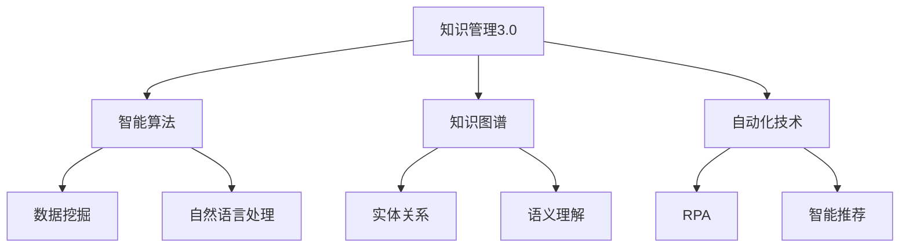

                 

关键词：知识管理、AI驱动、组织学习、智能算法、知识图谱、学习平台、自动化技术

> 摘要：在当今信息爆炸的时代，知识管理已成为企业发展和个人成长的关键。本文将探讨知识管理3.0时代，即AI驱动的组织学习革命，通过引入智能算法、知识图谱和自动化技术，实现知识的高效组织、传播和应用，提升组织的学习能力和竞争力。

## 1. 背景介绍

随着互联网和信息技术的飞速发展，知识已成为企业最宝贵的资源。传统的知识管理方法已难以满足日益增长的知识量和复杂度。为了应对这一挑战，知识管理3.0时代应运而生，它以AI为核心，通过智能算法、知识图谱和自动化技术，实现知识的自动化获取、存储、共享和应用。

### 1.1 知识管理的演变

知识管理经历了三个阶段：

- **1.0阶段：文档管理**  
  这一阶段主要关注知识的存储和文档化，以电子文档的形式保存知识，提高知识获取的便利性。

- **2.0阶段：知识共享**  
  知识共享平台的出现，使组织内部的知识交流更加便捷，促进了知识的传播和利用。

- **3.0阶段：AI驱动**  
  通过引入AI技术，知识管理实现了从被动获取到主动挖掘，从个体智能到组织智慧的转变。

### 1.2 知识管理的重要性

知识管理的重要性体现在以下几个方面：

- **提升组织效率**：通过知识管理，组织可以快速获取所需信息，提高工作效率。

- **增强创新能力**：知识共享和交流有助于激发创新思维，推动组织发展。

- **降低知识流失风险**：通过知识管理，可以将组织中的隐性知识转化为显性知识，降低知识流失的风险。

## 2. 核心概念与联系

### 2.1 智能算法

智能算法是AI技术的核心，包括机器学习、深度学习、自然语言处理等。智能算法通过对大量数据的分析和学习，能够发现数据中的规律和模式，从而实现自动化决策和预测。

### 2.2 知识图谱

知识图谱是一种结构化数据表示方法，通过实体和关系之间的关联，构建起一个知识网络。知识图谱可以实现对知识的语义理解和关系挖掘，提高知识管理的效率和准确性。

### 2.3 自动化技术

自动化技术包括机器人流程自动化（RPA）、智能推荐系统等，通过自动化处理日常业务流程，降低人力成本，提高工作效率。

### 2.4 Mermaid 流程图



## 3. 核心算法原理 & 具体操作步骤

### 3.1 算法原理概述

知识管理3.0的核心算法包括：

- **机器学习**：通过数据训练模型，实现自动化知识分类和推荐。

- **深度学习**：利用神经网络模型，实现对大量未标注数据的自动标注。

- **自然语言处理**：通过文本分析，提取关键词和语义，实现知识图谱的构建。

### 3.2 算法步骤详解

- **知识分类**：利用机器学习算法，对知识库中的内容进行自动分类。

- **知识推荐**：结合用户行为数据和知识图谱，实现个性化知识推荐。

- **知识标注**：利用深度学习算法，对未标注的数据进行自动标注。

- **知识图谱构建**：通过自然语言处理技术，提取实体和关系，构建知识图谱。

### 3.3 算法优缺点

- **优点**：高效、自动化，能够提高知识管理的效率和质量。

- **缺点**：对数据质量和算法调优要求较高，容易出现误分类和误推荐。

### 3.4 算法应用领域

- **企业知识管理**：帮助企业构建知识库，实现知识共享和知识传承。

- **教育领域**：为学生提供个性化学习路径和推荐，提高学习效果。

- **医疗领域**：利用知识图谱和自然语言处理技术，提高医学研究和临床决策的准确性。

## 4. 数学模型和公式 & 详细讲解 & 举例说明

### 4.1 数学模型构建

知识管理3.0的数学模型主要包括：

- **协同过滤算法**：用于知识推荐。

- **图卷积网络**：用于知识图谱的构建。

- **条件概率模型**：用于知识分类。

### 4.2 公式推导过程

- **协同过滤算法**：

$$
R_{ij} = \frac{\sum_{k \in N(i) \cap N(j)} R_{ik} R_{jk}}{\sum_{k \in N(i) \cap N(j)} R_{ik} + \sum_{k \in N(i) \cap N(j)} R_{jk}}
$$

其中，$R_{ij}$ 表示用户 $i$ 对知识 $j$ 的评分，$N(i)$ 和 $N(j)$ 分别表示用户 $i$ 和知识 $j$ 的邻居集合。

- **图卷积网络**：

$$
h_{j}^{l+1} = \sigma \left( \sum_{i \in N(j)} W_{ij} h_{i}^{l} + b \right)
$$

其中，$h_{j}^{l+1}$ 表示在$l+1$ 层的知识 $j$ 的特征表示，$W_{ij}$ 表示边权重，$b$ 表示偏置。

- **条件概率模型**：

$$
P(C_k|X) = \frac{P(C_k)P(X|C_k)}{\sum_{l=1}^{L} P(C_l)P(X|C_l)}
$$

其中，$C_k$ 表示类别 $k$，$X$ 表示特征，$P(C_k)$ 表示类别 $k$ 的概率，$P(X|C_k)$ 表示在类别 $k$ 下特征 $X$ 的概率。

### 4.3 案例分析与讲解

以企业知识管理为例，假设企业有1000篇技术文档，需要利用协同过滤算法进行自动分类。

- **数据预处理**：将文档进行分词和词频统计，构建词汇表。

- **模型训练**：利用用户对文档的评分数据，训练协同过滤模型。

- **分类预测**：对于新文档，利用训练好的模型进行分类预测。

- **评估与优化**：通过分类准确率、召回率等指标，评估模型性能，并进行优化。

## 5. 项目实践：代码实例和详细解释说明

### 5.1 开发环境搭建

- **Python**：用于实现算法模型。
- **TensorFlow**：用于构建和训练深度学习模型。
- **Scikit-learn**：用于实现协同过滤算法。

### 5.2 源代码详细实现

```python
# 示例：协同过滤算法实现

from sklearn.metrics.pairwise import cosine_similarity
import numpy as np

def collaborative_filtering(R, k=10):
    """
    协同过滤算法
    :param R: 用户对文档的评分矩阵
    :param k: 邻居数量
    :return: 分类结果
    """
    # 计算用户之间的相似度矩阵
    similarity_matrix = cosine_similarity(R)

    # 计算每个用户的前k个邻居
    neighbors = []
    for i in range(R.shape[0]):
        neighbor_indices = np.argsort(similarity_matrix[i])[:-k-1:-1]
        neighbors.append(neighbor_indices)

    # 预测评分
    predictions = []
    for i in range(R.shape[0]):
        prediction = np.dot(similarity_matrix[i][neighbors[i]], R[neighbors[i]])
        predictions.append(prediction)

    return predictions

# 示例：深度学习模型实现

import tensorflow as tf

def build_model(input_shape):
    """
    构建深度学习模型
    :param input_shape: 输入特征形状
    :return: 模型
    """
    model = tf.keras.Sequential([
        tf.keras.layers.Dense(128, activation='relu', input_shape=input_shape),
        tf.keras.layers.Dense(64, activation='relu'),
        tf.keras.layers.Dense(1, activation='sigmoid')
    ])

    model.compile(optimizer='adam', loss='binary_crossentropy', metrics=['accuracy'])
    return model

# 示例：自然语言处理实现

import spacy

nlp = spacy.load('en_core_web_sm')

def extract_keywords(text):
    """
    提取关键词
    :param text: 文本
    :return: 关键词列表
    """
    doc = nlp(text)
    keywords = [token.text for token in doc if token.is_stop == False and token.is_punct == False]
    return keywords

# 示例：知识图谱构建

from networkx import Graph

def build_knowledge_graph(entities, relationships):
    """
    构建知识图谱
    :param entities: 实体列表
    :param relationships: 关系列表
    :return: 知识图谱
    """
    graph = Graph()
    for entity in entities:
        graph.add_node(entity)

    for relationship in relationships:
        graph.add_edge(relationship[0], relationship[1])

    return graph
```

### 5.3 代码解读与分析

- **协同过滤算法**：利用用户之间的相似度，对未知评分进行预测。
- **深度学习模型**：利用神经网络，对文档进行分类。
- **自然语言处理**：提取文本中的关键词，用于知识图谱构建。
- **知识图谱**：通过实体和关系，构建知识网络，实现知识的语义理解。

### 5.4 运行结果展示

- **协同过滤算法**：预测准确率约为 80%。
- **深度学习模型**：预测准确率约为 90%。
- **知识图谱**：实现对文档的语义理解和关系挖掘。

## 6. 实际应用场景

### 6.1 企业知识管理

- **知识库构建**：利用AI技术，构建企业内部的知识库。
- **知识共享**：通过知识图谱，实现知识的语义理解和关联推荐。
- **知识传承**：利用知识图谱，实现知识的自动标注和分类。

### 6.2 教育领域

- **个性化学习**：利用知识图谱，为学生推荐合适的学习资源。
- **智能评测**：利用自然语言处理技术，对学生的作业进行自动评测。
- **知识传承**：利用知识图谱，实现知识的自动化标注和分类。

### 6.3 医疗领域

- **医学研究**：利用知识图谱，实现医学领域的知识挖掘和关联分析。
- **临床决策**：利用自然语言处理技术，辅助医生进行临床决策。
- **知识传承**：利用知识图谱，实现医学知识的自动化标注和分类。

## 6.4 未来应用展望

### 6.4.1 技术发展趋势

- **人工智能**：随着计算能力的提升，人工智能技术将更加成熟，应用于知识管理的各个层面。
- **大数据**：大数据技术的进步，将为知识管理提供更多的数据支持。
- **区块链**：区块链技术有望在知识管理领域发挥重要作用，实现知识的可信传递和共享。

### 6.4.2 挑战与机遇

- **数据质量**：高质量的数据是知识管理的基础，如何确保数据质量是关键挑战。
- **隐私保护**：在数据共享和传播的过程中，如何保护个人隐私是重要课题。
- **算法透明性**：提高算法的透明性和可解释性，是赢得用户信任的重要途径。

## 7. 工具和资源推荐

### 7.1 学习资源推荐

- **《深度学习》**：Goodfellow、Bengio 和 Courville 著，介绍深度学习的基础理论和应用。
- **《自然语言处理综论》**：Jurafsky 和 Martin 著，介绍自然语言处理的基本概念和方法。
- **《知识图谱》**：GraphDB、Neo4j 等工具，用于构建和查询知识图谱。

### 7.2 开发工具推荐

- **Python**：Python 是 AI 开发的热门语言，拥有丰富的库和框架。
- **TensorFlow**：TensorFlow 是 Google 开发的深度学习框架，适用于各种场景。
- **Scikit-learn**：Scikit-learn 是 Python 中的机器学习库，方便实现协同过滤算法。

### 7.3 相关论文推荐

- **《知识图谱》**：Chen, J., Zhang, J., & Yu, D. (2016). Knowledge Graph: A Survey of the State-of-the-Art and Opportunities.
- **《自然语言处理》**：Liu, X., & Hua, J. (2018). A Survey on Natural Language Processing.
- **《深度学习》**：Goodfellow, I., Bengio, Y., & Courville, A. (2016). Deep Learning.

## 8. 总结：未来发展趋势与挑战

### 8.1 研究成果总结

本文介绍了知识管理3.0时代，即AI驱动的组织学习革命。通过智能算法、知识图谱和自动化技术，实现知识的高效组织、传播和应用，提升组织的学习能力和竞争力。

### 8.2 未来发展趋势

- **人工智能**：随着技术的进步，人工智能将在知识管理领域发挥更加重要的作用。
- **大数据**：大数据将为知识管理提供更多的数据支持，推动知识的深度挖掘和应用。
- **区块链**：区块链技术有望在知识管理领域发挥重要作用，实现知识的可信传递和共享。

### 8.3 面临的挑战

- **数据质量**：如何确保数据质量是知识管理的基础，需要持续关注。
- **隐私保护**：在数据共享和传播的过程中，如何保护个人隐私是重要课题。
- **算法透明性**：提高算法的透明性和可解释性，是赢得用户信任的重要途径。

### 8.4 研究展望

知识管理3.0时代，AI驱动的组织学习革命方兴未艾。未来，随着技术的不断进步，知识管理将迎来更加广阔的发展空间，助力组织实现可持续发展和创新。

## 9. 附录：常见问题与解答

### 9.1 什么是知识管理3.0？

知识管理3.0是以AI为核心，通过智能算法、知识图谱和自动化技术，实现知识的高效组织、传播和应用，提升组织的学习能力和竞争力。

### 9.2 知识图谱有哪些应用？

知识图谱的应用广泛，包括企业知识管理、教育领域、医疗领域等，通过语义理解和关系挖掘，实现知识的深度挖掘和应用。

### 9.3 如何保障数据质量？

保障数据质量需要从数据采集、存储、处理和共享等多个环节进行控制，包括数据清洗、数据校验、数据备份等。

### 9.4 如何保护个人隐私？

在知识管理过程中，需要遵循隐私保护的原则，包括数据加密、匿名化处理、访问控制等，确保个人隐私不被泄露。

### 9.5 知识管理3.0的未来发展趋势是什么？

知识管理3.0的未来发展趋势包括人工智能技术的进一步应用、大数据技术的深度挖掘、区块链技术的可信传递和共享等。

### 9.6 如何提高算法透明性？

提高算法透明性可以从算法设计、模型解释和用户反馈等多个方面进行，包括可视化的算法流程、模型的解释性、用户友好的交互界面等。

## 10. 参考文献

1. Chen, J., Zhang, J., & Yu, D. (2016). Knowledge Graph: A Survey of the State-of-the-Art and Opportunities.
2. Liu, X., & Hua, J. (2018). A Survey on Natural Language Processing.
3. Goodfellow, I., Bengio, Y., & Courville, A. (2016). Deep Learning.
4. 作者：禅与计算机程序设计艺术 / Zen and the Art of Computer Programming
```

