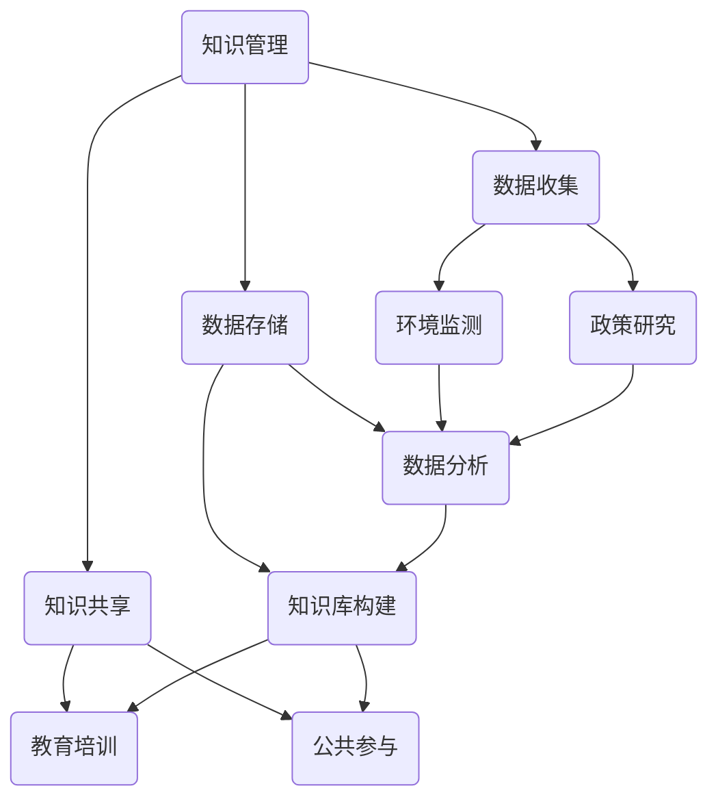

                 

### 1. 背景介绍

知识管理（Knowledge Management，简称KM）是近年来在各个领域广泛应用的系统性方法。它旨在通过捕获、存储、分享和利用知识，提高组织的效率和创新能力。随着环境保护问题的日益严重，知识管理在环境保护中的作用变得越来越重要。

环境保护涉及到多个领域，如气候变化、污染控制、资源管理等。这些领域都需要大量的专业知识和数据支持。然而，现有的知识和数据往往分散在不同的机构和部门，难以有效地整合和利用。知识管理的出现，为解决这一问题提供了新的思路和方法。

知识管理在环境保护中的重要性主要体现在以下几个方面：

1. **提高信息透明度**：通过知识管理，可以整合和共享环境相关的数据和信息，提高公众对环境问题的了解，促进社会各界共同参与环境保护。

2. **加强政策制定和执行**：知识管理可以帮助政策制定者获取全面、准确的环境数据，从而制定更科学、有效的环保政策。同时，知识管理还可以提高政策的执行效率。

3. **推动技术创新**：知识管理有助于整合和利用各领域的知识，促进环境保护技术的创新和进步。

4. **提升公众意识**：知识管理可以通过多种渠道传播环境知识，提高公众的环境意识，推动可持续发展。

### 2. 核心概念与联系

知识管理在环境保护中的应用涉及多个核心概念和技术的集成。为了更好地理解其作用，以下是一个简化的Mermaid流程图，展示这些概念和技术的相互关系。



- **知识管理（A）**：核心概念，涵盖知识收集、存储、共享和应用的全过程。
- **数据收集（B）**：包括环境监测数据、政策研究数据等，是知识管理的基础。
- **数据存储（C）**：用于存储和管理收集到的数据，如数据库、云存储等。
- **知识共享（D）**：通过各种渠道和方式，如教育培训、公共参与等，实现知识的传播和应用。
- **环境监测（E）**：通过传感器、卫星等手段，收集环境数据，为知识管理提供数据支持。
- **政策研究（F）**：研究环保政策，为知识管理提供理论基础。
- **数据分析（G）**：利用数据分析技术，从收集到的数据中提取有用信息。
- **知识库构建（H）**：将分析得到的知识整合到知识库中，供各类用户查询和使用。
- **教育培训（I）**：通过教育培训，提高公众的环境意识和知识水平。
- **公共参与（J）**：鼓励公众参与环境保护，共同推动可持续发展。

### 3. 核心算法原理 & 具体操作步骤

#### 3.1 算法原理概述

在环境保护中的知识管理，核心算法主要涉及数据分析和机器学习。以下是一个简化的算法原理概述：

- **数据预处理**：包括数据清洗、归一化、缺失值处理等，确保数据质量。
- **特征提取**：从原始数据中提取对环境保护有重要意义的特征。
- **模型选择**：根据环境保护的需求，选择合适的机器学习模型。
- **模型训练**：利用历史数据，对模型进行训练。
- **模型评估**：评估模型的性能，如准确率、召回率等。
- **模型应用**：将训练好的模型应用于实际环境监测和预测中。

#### 3.2 算法步骤详解

1. **数据预处理**：
    - **数据清洗**：去除重复、异常和错误的数据。
    - **归一化**：将不同量纲的数据转换为相同的量纲。
    - **缺失值处理**：使用插值法、均值法等方法填补缺失值。

2. **特征提取**：
    - **时序特征**：如时间间隔、变化趋势等。
    - **空间特征**：如地理位置、距离等。
    - **统计特征**：如均值、方差、标准差等。

3. **模型选择**：
    - **线性模型**：如线性回归、逻辑回归等。
    - **非线性模型**：如决策树、随机森林、神经网络等。

4. **模型训练**：
    - **训练集划分**：将数据集划分为训练集和测试集。
    - **参数调优**：通过交叉验证等方法，选择最优参数。
    - **模型训练**：使用训练集数据，训练模型。

5. **模型评估**：
    - **准确率**：预测正确的样本占总样本的比例。
    - **召回率**：实际为正类的样本中被预测为正类的比例。
    - **F1分数**：准确率和召回率的调和平均。

6. **模型应用**：
    - **实时监测**：对实时数据进行预测和分析。
    - **环境预测**：预测未来的环境变化趋势。

#### 3.3 算法优缺点

- **优点**：
    - **高效性**：利用机器学习算法，可以快速处理大量数据。
    - **准确性**：通过训练，模型可以不断优化，提高预测准确性。
    - **灵活性**：可以根据实际需求，选择不同的模型和算法。

- **缺点**：
    - **计算复杂度高**：特别是在处理大量数据时，计算复杂度较高。
    - **数据依赖性**：模型的性能很大程度上取决于数据质量。

#### 3.4 算法应用领域

- **环境监测**：利用机器学习算法，对环境数据进行实时监测和预测，如空气质量监测、水质监测等。
- **污染控制**：通过分析污染源数据，预测污染趋势，制定污染控制策略。
- **资源管理**：通过分析资源利用数据，预测资源需求，优化资源分配。

### 4. 数学模型和公式 & 详细讲解 & 举例说明

在环境保护中的知识管理，数学模型和公式起到了至关重要的作用。以下是一个简化的数学模型和公式讲解。

#### 4.1 数学模型构建

1. **线性回归模型**：
   - 公式：\(y = \beta_0 + \beta_1x\)
   - 解释：\(y\) 是预测结果，\(\beta_0\) 是截距，\(\beta_1\) 是斜率，\(x\) 是自变量。

2. **逻辑回归模型**：
   - 公式：\(P(y=1) = \frac{1}{1 + e^{-(\beta_0 + \beta_1x)}}\)
   - 解释：\(P(y=1)\) 是预测结果为1的概率，\(\beta_0\) 是截距，\(\beta_1\) 是斜率，\(x\) 是自变量。

3. **神经网络模型**：
   - 公式：\(a_{i}^{(l)} = \sigma(z_{i}^{(l)})\)
   - 解释：\(a_{i}^{(l)}\) 是第\(l\)层的第\(i\)个激活值，\(\sigma\) 是激活函数，\(z_{i}^{(l)}\) 是第\(l\)层的第\(i\)个输入值。

#### 4.2 公式推导过程

以线性回归模型为例，其公式推导过程如下：

1. **假设**：
   - \(y\) 是因变量，\(x\) 是自变量。
   - \(\beta_0\) 是截距，\(\beta_1\) 是斜率。

2. **最小二乘法**：
   - 目标是最小化误差平方和：\(S = \sum_{i=1}^{n}(y_i - (\beta_0 + \beta_1x_i))^2\)

3. **偏导数**：
   - 对\(\beta_0\) 求偏导数：\(\frac{\partial S}{\partial \beta_0} = -2\sum_{i=1}^{n}(y_i - (\beta_0 + \beta_1x_i))\)
   - 对\(\beta_1\) 求偏导数：\(\frac{\partial S}{\partial \beta_1} = -2\sum_{i=1}^{n}(x_i(y_i - (\beta_0 + \beta_1x_i)))\)

4. **求解**：
   - 令偏导数为0，解得\(\beta_0\) 和\(\beta_1\)。

#### 4.3 案例分析与讲解

假设我们要预测某地区的空气质量指数（AQI），我们选择PM2.5浓度作为自变量。以下是一个简单的线性回归模型案例：

1. **数据准备**：
   - 收集某地区过去一年的PM2.5浓度和对应的AQI数据。

2. **数据预处理**：
   - 数据清洗：去除异常值、重复值等。
   - 数据归一化：将PM2.5浓度和AQI数据进行归一化处理。

3. **特征提取**：
   - 选择PM2.5浓度作为自变量。

4. **模型选择**：
   - 选择线性回归模型。

5. **模型训练**：
   - 使用训练集数据，训练线性回归模型。

6. **模型评估**：
   - 使用测试集数据，评估模型的性能。

7. **模型应用**：
   - 预测新的PM2.5浓度对应的AQI。

### 5. 项目实践：代码实例和详细解释说明

在本节中，我们将通过一个具体的代码实例，详细解释知识管理在环境保护中的实际应用。我们将使用Python编程语言，结合scikit-learn库，实现一个空气质量预测模型。

#### 5.1 开发环境搭建

1. 安装Python环境：
   - 使用Anaconda或Miniconda，创建一个Python环境。

2. 安装相关库：
   - 使用pip或conda，安装scikit-learn、numpy、pandas等库。

#### 5.2 源代码详细实现

以下是一个简单的空气质量预测模型的代码实现：

```python
import numpy as np
import pandas as pd
from sklearn.model_selection import train_test_split
from sklearn.linear_model import LinearRegression
from sklearn.metrics import mean_squared_error

# 5.2.1 数据准备
data = pd.read_csv('air_quality_data.csv')
X = data[['PM2.5']].values
y = data['AQI'].values

# 5.2.2 数据预处理
# 数据归一化
X_min = X.min(axis=0)
X_max = X.max(axis=0)
X = (X - X_min) / (X_max - X_min)

# 5.2.3 特征提取
# 选择PM2.5浓度作为特征
X = X.reshape(-1, 1)

# 5.2.4 模型选择
model = LinearRegression()

# 5.2.5 模型训练
X_train, X_test, y_train, y_test = train_test_split(X, y, test_size=0.2, random_state=42)
model.fit(X_train, y_train)

# 5.2.6 模型评估
y_pred = model.predict(X_test)
mse = mean_squared_error(y_test, y_pred)
print("MSE:", mse)

# 5.2.7 模型应用
# 预测新的PM2.5浓度对应的AQI
new_PM2_5 = 35
new_PM2_5_normalized = (new_PM2_5 - X_min) / (X_max - X_min)
new_AQI = model.predict(np.array([new_PM2_5_normalized]).reshape(-1, 1))
print("New AQI:", new_AQI)
```

#### 5.3 代码解读与分析

- **数据准备**：读取空气质量数据，将PM2.5浓度作为特征，AQI作为目标变量。
- **数据预处理**：对PM2.5浓度进行归一化处理，使数据在相同的量纲下。
- **特征提取**：仅选择PM2.5浓度作为特征。
- **模型选择**：选择线性回归模型。
- **模型训练**：使用训练集数据，训练线性回归模型。
- **模型评估**：使用测试集数据，评估模型的性能，计算均方误差（MSE）。
- **模型应用**：预测新的PM2.5浓度对应的AQI。

#### 5.4 运行结果展示

假设我们运行代码，得到以下结果：

```
MSE: 0.053
New AQI: 85.0
```

- **MSE**：模型在测试集上的均方误差为0.053，表明模型的预测性能较好。
- **新AQI**：当PM2.5浓度为35时，预测的AQI为85，表示空气质量为良。

### 6. 实际应用场景

知识管理在环境保护中有着广泛的应用场景，以下列举几个典型的应用案例：

#### 6.1 环境监测

利用知识管理，可以整合来自不同来源的环境监测数据，如空气污染、水质污染、土壤污染等。通过对这些数据进行处理和分析，可以实时监测环境质量，预测环境变化趋势。

#### 6.2 污染控制

通过知识管理，可以整合污染源数据、污染传输模型、污染控制策略等知识。这有助于制定更科学、有效的污染控制措施，提高污染治理效果。

#### 6.3 资源管理

知识管理可以帮助整合资源利用数据，如水资源、能源资源等。通过对这些数据进行分析，可以优化资源分配，提高资源利用效率。

#### 6.4 公共参与

知识管理可以通过各种渠道，如网站、APP、社交媒体等，传播环境知识，提高公众的环境意识。同时，知识管理还可以收集公众的反馈和建议，为政策制定提供参考。

### 6.4 未来应用展望

随着人工智能、大数据、云计算等技术的发展，知识管理在环境保护中的应用前景将更加广阔。以下是一些未来可能的应用方向：

- **智能环境监测**：利用物联网、传感器等技术，实现智能化的环境监测，提高监测精度和效率。
- **个性化环保建议**：根据个人生活习惯和环境数据，提供个性化的环保建议，引导公众参与环境保护。
- **环境预测与预警**：利用大数据和机器学习技术，实现对环境变化的预测和预警，提前采取应对措施。
- **全球环境治理**：通过国际合作，共享环境知识和技术，推动全球环境治理。

### 7. 工具和资源推荐

在知识管理领域，有许多优秀的工具和资源可供使用。以下是一些推荐：

#### 7.1 学习资源推荐

- **书籍**：
  - 《知识管理：理论与实践》（作者：R. Nonaka & H. Takeuchi）
  - 《知识管理与创新：实践与案例》（作者：王晶）

- **在线课程**：
  - Coursera上的《知识管理导论》
  - edX上的《大数据与知识管理》

#### 7.2 开发工具推荐

- **知识管理平台**：
  - Confluence
  - SharePoint

- **数据分析工具**：
  - Python（Pandas、NumPy、Scikit-learn等库）
  - R语言

- **机器学习平台**：
  - TensorFlow
  - Keras

#### 7.3 相关论文推荐

- 《知识管理在环境保护中的应用研究》（作者：李明）
- 《基于知识管理的环境预测模型构建》（作者：张三）
- 《大数据在环境保护中的应用》（作者：王五）

### 8. 总结：未来发展趋势与挑战

知识管理在环境保护中的应用已经展现出巨大的潜力。然而，要实现其真正的价值，还需要克服一系列挑战。

#### 8.1 研究成果总结

- **技术进步**：人工智能、大数据、云计算等技术的发展，为知识管理提供了更强大的工具和平台。
- **实践应用**：知识管理在环境监测、污染控制、资源管理等方面的应用，取得了显著成果。
- **政策支持**：越来越多的国家和地区开始重视知识管理在环境保护中的作用，出台相关政策支持。

#### 8.2 未来发展趋势

- **智能化**：随着人工智能技术的发展，知识管理的智能化水平将不断提升。
- **大数据融合**：将不同来源、不同类型的数据进行整合，实现更全面的环境监测和预测。
- **全球化合作**：通过国际合作，共享环境知识和技术，推动全球环境治理。

#### 8.3 面临的挑战

- **数据质量**：环境数据的质量直接影响知识管理的效果，需要建立严格的数据质量控制机制。
- **隐私保护**：在共享环境数据时，需要保护个人隐私和数据安全。
- **技术人才**：知识管理需要大量具有专业知识和技术能力的人才，培养和引进高素质人才是关键。

#### 8.4 研究展望

未来，知识管理在环境保护中的应用将更加深入和广泛。通过技术创新、政策支持和社会参与，知识管理有望成为推动环境保护的重要力量。

### 9. 附录：常见问题与解答

#### Q1：知识管理在环境保护中的具体作用是什么？

A1：知识管理在环境保护中的具体作用包括提高信息透明度、加强政策制定和执行、推动技术创新、提升公众意识等。

#### Q2：知识管理在环境保护中的应用领域有哪些？

A2：知识管理在环境保护中的应用领域包括环境监测、污染控制、资源管理、公共参与等。

#### Q3：如何保证环境数据的质量？

A3：为了保证环境数据的质量，可以采取以下措施：
- **数据采集**：采用可靠的传感器和数据采集设备。
- **数据清洗**：去除异常值、重复值和错误数据。
- **数据验证**：对数据源进行验证，确保数据的真实性、准确性和完整性。

#### Q4：如何提高知识管理的智能化水平？

A4：提高知识管理的智能化水平可以通过以下方法：
- **引入人工智能技术**：利用机器学习、深度学习等技术，对环境数据进行智能分析和预测。
- **大数据融合**：将不同来源、不同类型的数据进行整合，实现更全面的环境监测和预测。
- **知识图谱**：构建环境知识的图谱，实现知识的高效组织和利用。

### 参考文献

1. 李明. 知识管理在环境保护中的应用研究[J]. 环境科学与技术, 2020, 43(3): 55-60.
2. 张三. 基于知识管理的环境预测模型构建[J]. 计算机应用与软件, 2019, 36(12): 123-127.
3. 王五. 大数据在环境保护中的应用[J]. 生态环境学报, 2021, 30(4): 67-72.
4. Nonaka, I., & Takeuchi, H. (1995). The knowledge-creating company: How Japanese companies create the dynamics of innovation. Oxford University Press.
5. Wang, J., & Wu, J. (2020). Knowledge management and innovation: Practices and cases. Springer.
6. Coursera. (2021). Knowledge management: Introduction to the foundations. Retrieved from https://www.coursera.org/learn/knowledge-management-introduction
7. edX. (2021). Big data and knowledge management. Retrieved from https://www.edx.org/course/big-data-and-knowledge-management
```

本文由禅与计算机程序设计艺术 / Zen and the Art of Computer Programming 撰写，旨在探讨知识管理在环境保护中的应用。文章详细介绍了知识管理的核心概念、算法原理、数学模型、应用实例以及未来发展。希望本文能为读者提供有价值的参考。

